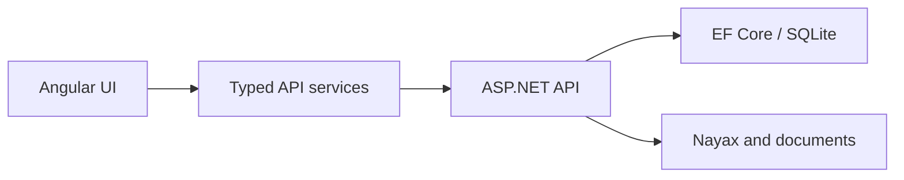

# InventoryApp

InventoryApp is a full-stack operations and bookkeeping system for a vending-machine business. It manages the path from purchasing and stock through machine replenishment and Nayax sales, then turns those records into auditable cost, reconciliation, GST, and profitability reports.

## Capabilities

- Product, category, supplier, and low-stock management.
- Purchase receipts, supporting documents, supplier orders, and stock movements.
- Sites, vending machines, product assignments, and machine refills.
- Nayax product and transaction imports with explicit payment/status handling.
- Historical weighted-average inventory costing and persisted COGS provenance.
- Effective-dated Nayax processing fees and site commission agreements.
- Operating expenses, reimbursement imports, and settlement reconciliation.
- Dashboard, bookkeeping, daily-sales, transaction, GST, commission, machine, and product reports.
- CSV/XLSX exports that use the same backend calculations as the UI.
- Microsoft Entra sign-in and delegated-scope API authorization (see [Authentication configuration](#authentication-configuration)).

## Technology

| Area | Stack |
| --- | --- |
| API | ASP.NET Core Web API, .NET 10 |
| Persistence | EF Core 10, SQLite, code-first migrations |
| Frontend | Angular 19 standalone components, TypeScript, RxJS, Tailwind CSS |
| Authentication | Microsoft Entra ID, `Microsoft.Identity.Web` (API), MSAL (`@azure/msal-angular`/`@azure/msal-browser`, SPA) |
| Tests | xUnit, Moq, EF Core InMemory and SQLite |
| Integrations | Nayax Lynx API and imported reimbursement/workbook data |
| Hosting | Azure App Service and Azure Static Web Apps |
| Automation | GitHub Actions |

## Architecture

The application is a modular monolith with separate API and browser deployments. The backend is being evolved incrementally toward pragmatic Clean Architecture with vertical feature slices. The Angular frontend remains standalone and is moving toward feature-local pages, components, data access, and contracts.



Business calculations stay authoritative on the backend. The UI owns navigation, interaction state, accessibility, and presentation without recreating inventory or accounting formulas.

See [docs/architecture.md](docs/architecture.md) for the current system, target boundaries, frontend structure, financial rules, and incremental migration tracks, and [docs/automation.md](docs/automation.md) for the controlled automated-development lifecycle.

## Repository map

```text
InventoryApp/
├── backend/InventoryApi/          ASP.NET Core API, EF migrations, and solution
├── backend/InventoryApi.Tests/    Backend test suite
├── frontend/inventory-app/        Angular application
├── docs/architecture.md           Current and target architecture
├── docs/automation.md             Automated development lifecycle and authority model
├── .github/ISSUE_TEMPLATE/        Agent task issue form
├── .github/pull_request_template.md
├── scripts/validate.ps1           Windows/PowerShell validation
├── scripts/validate.sh            Bash validation
├── AGENTS.md                      Engineering and agent safeguards
└── CLAUDE.md                      Claude Code entry point (points to AGENTS.md and docs)
```

## Prerequisites

- [.NET 10 SDK](https://dotnet.microsoft.com/download)
- [Node.js 20 or later](https://nodejs.org/) and npm

A global Angular CLI installation is not required; the npm scripts use the repository's locked CLI version.

## Run locally

### 1. Start the API

From the repository root:

```bash
dotnet restore backend/InventoryApi/InventoryApi.slnx
dotnet run --project backend/InventoryApi/InventoryApi.csproj
```

The development API listens at <http://localhost:5000>. Swagger UI is available at <http://localhost:5000/swagger> while the API is running in the Development environment.

EF Core migrations are applied at startup. The default SQLite database is `inventory.db`, resolved from the API process's working directory; local database files must not be committed.

### 2. How the frontend finds the API

Nothing to configure locally. `ConfigService` resolves the API base URL to `/api` whenever the application is served from `localhost` or `127.0.0.1`, and the development proxy forwards `/api` to <http://localhost:5000>. Any other origin is a deployed one and uses `apiBaseUrl` from `frontend/inventory-app/src/assets/config.json`, which holds the deployed Azure API URL. Do not edit that tracked file to switch between local development and deployment, and do not commit a personal endpoint.

### 3. Start the frontend

In a second terminal, from the repository root:

```bash
npm --prefix frontend/inventory-app ci
npm --prefix frontend/inventory-app start
```

Open <http://localhost:4200>. The `start` script builds the Tailwind stylesheet and starts the Angular development server.

### 4. Sign in

The application requires a Microsoft Entra sign-in. Click **Sign in** in the header; it redirects to Microsoft, and after sign-in redirects back to `/auth` (`AuthCallbackComponent`) before continuing to the requested page. `/auth` itself is intentionally public (not behind `MsalGuard`) so the redirect can complete; every other route requires an authenticated session with the delegated `access_as_user` scope, enforced again by the API (`401` with no token, `403` without the scope).

## Authentication configuration

Authentication uses Microsoft Entra ID (Azure AD): ASP.NET Core / `Microsoft.Identity.Web` validates bearer tokens on the API, and the Angular SPA signs users in with MSAL (`@azure/msal-angular`, `@azure/msal-browser`). See [docs/architecture.md](docs/architecture.md#authentication-and-authorization) for the full boundary description.

Non-secret configuration already committed to the repository:

- **API** (`backend/InventoryApi/appsettings.json`, `AzureAd` section): `Instance`, `TenantId` (`common`, multi-tenant), `ClientId` (the API app registration's public application ID), and `Scopes` (`access_as_user`). These identify the API for token validation; no client secret is used or required.
- **SPA** (`frontend/inventory-app/src/app/auth-config.ts`): the SPA app registration's client ID, the API's `api://<api-client-id>/access_as_user` scope, and the redirect URI (`<origin>/auth`).

Human-controlled Entra portal setup this configuration depends on (not part of this repository, and not something an agent may change):

- App registrations for the API and the SPA, with the API exposing the `access_as_user` scope and the SPA's platform configured for the redirect URIs it actually uses (`http://localhost:4200/auth` for local development, and the deployed Static Web App origin's `/auth` for production).
- The SPA registration's API permissions granting delegated `access_as_user` access to the API app registration.

MSAL's protected-resource map (`buildProtectedResourceMap` in `auth-config.ts`) is built from `ConfigService.apiBaseUrl`, the same value every HTTP call uses (see [above](#2-how-the-frontend-finds-the-api)), so the bearer token attaches correctly to `/api/*` locally and to the deployed absolute API URL in production, without any code or configuration change between environments. `ConfigService` loads `assets/config.json` on the raw `HttpBackend` rather than the intercepted `HttpClient`, so the MSAL interceptor cannot be constructed — and cannot capture a stale API base URL — before that load has finished.

Protected business documents (purchase receipts and operating-expense supporting documents) are stored outside the API's web root and are served only by the authenticated `/api/receipts/{id}/file` and `/api/operating-expenses/{id}/attachment` endpoints. The API registers no static-file middleware, so these documents have no anonymous URL; the frontend fetches them through `HttpClient` and renders them from a temporary object URL.

Azure Static Web Apps direct navigation (including the `/auth` redirect landing) is handled by `frontend/inventory-app/src/staticwebapp.config.json`, which rewrites unmatched paths to `/index.html` so the Angular router — not a platform 404 — handles them.

**Multi-tenant data partitioning is out of scope.** Accepting sign-ins from multiple Microsoft Entra tenants (`TenantId: "common"`) authenticates a user; it does not isolate one tenant's business data from another's. Database-level tenant scoping is a separate, unimplemented concern.

## Configuration and secrets

Backend configuration follows normal ASP.NET Core precedence. Override local or deployed values with user-secrets, environment variables, or the hosting platform's configuration instead of committing credentials.

Common environment-variable names include:

```text
ConnectionStrings__DefaultConnection
NayaxLynx__BaseUrl
Nayax__Token
NayaxLynx__OperatorId
```

Uploaded receipt and expense documents are stored beneath the API web root with their metadata in SQLite. Do not commit uploaded business documents, local databases, or credentials.

## Validate a change

Run the repository-level validation from the root:

```bash
# macOS, Linux, or Git Bash
bash scripts/validate.sh

# PowerShell 7
pwsh -File scripts/validate.ps1

# Windows PowerShell
powershell -ExecutionPolicy Bypass -File scripts/validate.ps1
```

The scripts restore, build, and test the backend, then perform a clean frontend install and production build. The frontend does not yet have configured test or lint scripts; its current automated gate is the production build.

## Important domain rules

- Gross vending sales are not the same as a Nayax payout. Card and cash revenue remain distinct.
- A machine refill is an internal stock transfer, not COGS or an expense.
- Historical sale cost is persisted from internal AVCO when reliable, with transaction-level Nayax product cost as a fallback.
- Missing COGS or profit remains unknown; it is never silently converted to zero.
- Australian financial years run from 1 July to 30 June, using `Australia/Sydney` for business reporting.
- UI reports and CSV/XLSX exports must use the same backend calculations and quality states.

The complete invariants and change rules are in [AGENTS.md](AGENTS.md).

## Delivery workflow

Changes are made on feature branches created from `develop` and validated through pull requests that target `develop`. Every pull request to `develop` or `main` runs the validation workflow. A push to `develop` builds and tests the backend without deploying. Production releases are separate pull requests from `develop` to `main`; a merge to `main` triggers the Azure API and frontend deployment workflows. After opening a pull request, an automated engineering agent may update only its feature branch, for at most two permitted repair attempts in response to CI or review failures, and then returns control to a human. It never merges or deploys. An agent may prepare a release pull request only when a human explicitly requests it; a human reviews and merges that pull request, and the existing workflow performs the deployment.

Tasks intended for an implementation agent use the **Agent task** issue form, and every pull request uses the repository pull request template. The agent provider is Claude Code: applying `agent-ready` to a reviewed issue starts the implementation workflow, which opens a pull request, applies `agent-review` to it as a deterministic step, and dispatches validation; once validation succeeds, an independent, comment-only review with an explicit verdict starts automatically, and the repository owner may request at most two repairs by commenting `@claude repair` on that pull request. Human approval and branch protection remain the merge gate. The full lifecycle, authority model, task labels, risk classification, and retry policy are in [docs/automation.md](docs/automation.md).

## License

See [LICENSE](LICENSE).
