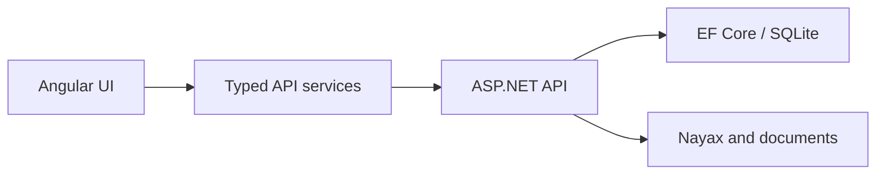

# InventoryApp

InventoryApp is a full-stack operations and bookkeeping system for a vending-machine business. It manages the path from purchasing and stock through machine replenishment and Nayax sales, then turns those records into auditable cost, reconciliation, GST, and profitability reports.

## Capabilities

- Product, category, supplier, and low-stock management, including a per-product supplier price history/comparison (lowest vs. latest actual purchase cost, by supplier and date).
- Purchases, their supporting documents, supplier orders, and stock movements.
- Sites, vending machines, product assignments, and machine refills.
- Nayax product and transaction imports with explicit payment/status handling.
- Historical weighted-average inventory costing and persisted COGS provenance.
- Effective-dated Nayax processing fees and site commission agreements.
- Operating expenses, reimbursement imports, and settlement reconciliation.
- Dashboard, bookkeeping, daily-sales, transaction, GST, commission, machine, and product reports.
- CSV/XLSX exports that use the same backend calculations as the UI.
- Microsoft Entra sign-in and delegated-scope API authorization (see [Authentication configuration](#authentication-configuration)).

## Technology

| Area | Stack |
| --- | --- |
| API | ASP.NET Core Web API, .NET 10 |
| Persistence | EF Core 10, SQLite, code-first migrations |
| Frontend | Angular 19 standalone components, TypeScript, RxJS, Tailwind CSS |
| Authentication | Microsoft Entra ID, `Microsoft.Identity.Web` (API), MSAL (`@azure/msal-angular`/`@azure/msal-browser`, SPA) |
| Tests | xUnit, Moq, EF Core InMemory and SQLite |
| Integrations | Nayax Lynx API and imported reimbursement/workbook data |
| Observability | Azure Monitor OpenTelemetry (`Azure.Monitor.OpenTelemetry.AspNetCore`) to Application Insights, enabled by configuration |
| Hosting | Azure App Service and Azure Static Web Apps |
| Automation | GitHub Actions |

## Architecture

The application is a modular monolith with separate API and browser deployments. The backend is being evolved incrementally toward pragmatic Clean Architecture with vertical feature slices. The Angular frontend remains standalone and is moving toward feature-local pages, components, data access, and contracts.


```mermaid
flowchart LR
    UI["Angular UI"] --> Client["Typed API services"]
    Client --> API["ASP.NET API"]
    API --> Data["EF Core / SQLite"]
    API --> External["Nayax and documents"]
```

Business calculations stay authoritative on the backend. The UI owns navigation, interaction state, accessibility, and presentation without recreating inventory or accounting formulas.

See [docs/architecture.md](docs/architecture.md) for the current system, target boundaries, frontend structure, financial rules, and incremental migration tracks, and [docs/automation.md](docs/automation.md) for the controlled automated-development lifecycle.

## Repository map

```text
Inventory App/
├── backend/InventoryApi/          ASP.NET Core API, EF migrations, and solution
├── backend/Inventory.UnitTests/   Pure Domain/Application backend tests
├── backend/Inventory.IntegrationTests/ Database, API, adapter and architecture backend tests
├── frontend/inventory-app/        Angular application
├── docs/architecture.md           Current and target architecture
├── docs/automation.md             Automated development lifecycle and authority model
├── evals/agent/                   Agent Evals corpus, schema and baseline report
├── .github/ISSUE_TEMPLATE/        Agent task issue form
├── .github/pull_request_template.md
├── scripts/validate.ps1           Windows/PowerShell validation
├── scripts/validate.sh            Bash validation
├── scripts/run-agent-evals.mjs    Agent Evals runner
├── AGENTS.md                      Engineering and agent safeguards
└── CLAUDE.md                      Claude Code entry point (points to AGENTS.md and docs)
```

## Prerequisites

- [.NET 10 SDK](https://dotnet.microsoft.com/download)
- [Node.js 20 or later](https://nodejs.org/) and npm

A global Angular CLI installation is not required; the npm scripts use the repository's locked CLI version.

## Run locally

### 1. Start the API

From the repository root:

```bash
dotnet restore backend/InventoryApi/InventoryApi.slnx
dotnet run --project backend/InventoryApi/InventoryApi.csproj
```

The development API listens at <http://localhost:5000>. Swagger UI is available at <http://localhost:5000/swagger> while the API is running in the Development environment.

EF Core migrations are applied automatically at startup in **Development**, **Testing**, and **Production** (issue #201). Development and `Testing` do this because their database is disposable; Production does it as part of a normal deployment restart, and fails closed — logging the failure and refusing to finish starting — rather than serving requests against a schema its code does not match. The default SQLite database is `inventory.db`, resolved from the API process's working directory; local database files must not be committed. Schema migrations never assign tenant ownership or perform the business backfill, so starting the API never triggers one. Some schema migrations do rebuild tables and copy persisted rows.

Any other non-Production environment (an ephemeral integration-test or Staging database, for example) still applies nothing by default and refuses to start while any migration is pending, unless `Database:AllowAutomaticMigrationUnsafeOutsideDevelopment` is set to `true` for that disposable database; the setting has no effect in Production, which always migrates automatically regardless. The explicit `migrate-database` command remains available for diagnostics and manual use — inspecting what a pending deployment will apply, or applying a high-risk migration ahead of a deployment window under review — from a source tree with the SDK:

```bash
dotnet run --project backend/InventoryApi -- migrate-database --dry-run
dotnet run --project backend/InventoryApi -- migrate-database --apply
```

or, from the deployed application (`dotnet publish` output, which has no SDK or sources, so `dotnet run --project` is unavailable):

```bash
dotnet InventoryApi.dll migrate-database --dry-run
dotnet InventoryApi.dll migrate-database --apply
```

#### Business/tenant bootstrap

Business data is owned by a `Business` record. Applying the schema creates no application `Business` — but it does not follow that there are no tenant-owned rows: seeded or pre-existing legacy rows carry `BusinessId = 0`, which matches no business, so they are invisible to every caller until the ownership bootstrap assigns them. Either way a signed-in caller sees an empty dataset until the bootstrap runs. This is the intended fail-closed state — the data is unowned, not lost — and the API logs an error at startup while it persists.

The mapping from Microsoft Entra identities to that business is human-supplied and is never committed. `appsettings.json` ships the `BusinessBootstrap` section empty; supply real values through user secrets locally:

```bash
cd backend/InventoryApi
dotnet user-secrets set "BusinessBootstrap:BusinessName" "<business name>"
dotnet user-secrets set "BusinessBootstrap:Members:0:DirectoryTenantId" "<your Entra tid claim>"
dotnet user-secrets set "BusinessBootstrap:Members:0:ObjectId" "<your Entra oid claim>"
```

Then assign ownership. The dry run measures and rolls back; `--apply` must be typed explicitly:

```bash
dotnet run --project backend/InventoryApi -- bootstrap-business --dry-run
dotnet run --project backend/InventoryApi -- bootstrap-business --apply
```

On a deployed application use `dotnet InventoryApi.dll bootstrap-business --dry-run` / `--apply` instead.

The command is restart-safe and idempotent: it only ever touches rows that are still unassigned. See [docs/tenant-rollout.md](docs/tenant-rollout.md) for the reviewed production sequence.

#### Migrating documents to Azure Blob storage

Uploaded purchase and operating-expense documents can be stored on the filesystem (the default)
or in a private Azure Blob container, selected by `DocumentStorage:Provider`. Moving the
documents already on disk into the container is a separate human-invoked command. It requires
`DocumentStorage:Provider=AzureBlob` with `BlobServiceUri` and `ContainerName`, authenticates
with `DefaultAzureCredential` — no account key, SAS token or connection string — and refuses to
run against the filesystem default:

```bash
DocumentStorage__Provider=AzureBlob dotnet run --project backend/InventoryApi -- migrate-documents --dry-run
DocumentStorage__Provider=AzureBlob dotnet run --project backend/InventoryApi -- migrate-documents --apply
```

On a deployed application use `dotnet InventoryApi.dll migrate-documents --dry-run` / `--apply`
instead. Exactly one of the two flags must be given.

The provider is supplied as a process-local override, not by changing the deployed application's
own setting: the running API reads the same `DocumentStorage:Provider`, so switching it
persistently would move live document reads to the container before anything had been copied or
verified.

The dry run writes nothing and reports what an apply would do. An apply copies each document to
`tenants/{businessId}/purchases|expenses/{storedFileName}`, where the business is read from the
record that owns the document, and verifies the copy by size and SHA-256 before counting it as
migrated. Reruns are safe and source documents are never deleted.

**Do not run this against production from this description.**
[docs/document-storage-rollout.md](docs/document-storage-rollout.md) is the canonical procedure:
prerequisites, how to read the report, what must be reviewed before an apply, how to verify, and
why the runtime provider is switched only afterwards.

### 2. How the frontend finds the API

Nothing to configure locally. `ConfigService` resolves the API base URL to `/api` whenever the application is served from `localhost` or `127.0.0.1`, and the development proxy forwards `/api` to <http://localhost:5000>. Any other origin is a deployed one and uses `apiBaseUrl` from `frontend/inventory-app/src/assets/config.json`, which holds the deployed Azure API URL. Do not edit that tracked file to switch between local development and deployment, and do not commit a personal endpoint.

### 3. Start the frontend

In a second terminal, from the repository root:

```bash
npm --prefix frontend/inventory-app ci
npm --prefix frontend/inventory-app start
```

Open <http://localhost:4200>. The `start` script builds the Tailwind stylesheet and starts the Angular development server.

### 4. Sign in

The application requires a Microsoft Entra sign-in. Click **Sign in** in the header; it redirects to Microsoft, and after sign-in redirects back to `/auth` (`AuthCallbackComponent`) before continuing to the requested page. `/auth` itself is intentionally public (not behind `MsalGuard`) so the redirect can complete; every other route requires an authenticated session with the delegated `access_as_user` scope, enforced again by the API (`401` with no token, `403` without the scope).

## Authentication configuration

Authentication uses Microsoft Entra ID (Azure AD): ASP.NET Core / `Microsoft.Identity.Web` validates bearer tokens on the API, and the Angular SPA signs users in with MSAL (`@azure/msal-angular`, `@azure/msal-browser`). See [docs/architecture.md](docs/architecture.md#authentication-and-authorization) for the full boundary description.

Non-secret configuration already committed to the repository:

- **API** (`backend/InventoryApi/appsettings.json`, `AzureAd` section): `Instance`, `TenantId` (`common`, multi-tenant), `ClientId` (the API app registration's public application ID), and `Scopes` (`access_as_user`). These identify the API for token validation; no client secret is used or required.
- **SPA** (`frontend/inventory-app/src/app/auth-config.ts`): the SPA app registration's client ID, the API's `api://<api-client-id>/access_as_user` scope, and the redirect URI (`<origin>/auth`).

Human-controlled Entra portal setup this configuration depends on (not part of this repository, and not something an agent may change):

- App registrations for the API and the SPA, with the API exposing the `access_as_user` scope and the SPA's platform configured for the redirect URIs it actually uses (`http://localhost:4200/auth` for local development, and the deployed Static Web App origin's `/auth` for production).
- The SPA registration's API permissions granting delegated `access_as_user` access to the API app registration.

MSAL's protected-resource map (`buildProtectedResourceMap` in `auth-config.ts`) is built from `ConfigService.apiBaseUrl`, the same value every HTTP call uses (see [above](#2-how-the-frontend-finds-the-api)), so the bearer token attaches correctly to `/api/*` locally and to the deployed absolute API URL in production, without any code or configuration change between environments. `ConfigService` loads `assets/config.json` on the raw `HttpBackend` rather than the intercepted `HttpClient`, so the MSAL interceptor cannot be constructed — and cannot capture a stale API base URL — before that load has finished.

Protected business documents (purchase documents and operating-expense supporting documents) are stored outside the API's web root and are served only by the authenticated `/api/purchases/{id}/file` and `/api/operating-expenses/{id}/attachment` endpoints. The API registers no static-file middleware, so these documents have no anonymous URL; the frontend fetches them through `HttpClient` and renders them from a temporary object URL.

Azure Static Web Apps direct navigation (including the `/auth` redirect landing) is handled by `frontend/inventory-app/src/staticwebapp.config.json`, which rewrites unmatched paths to `/index.html` so the Angular router — not a platform 404 — handles them.

**Authentication identifies a person; business ownership decides what they may see.** Accepting sign-ins from multiple Microsoft Entra tenants (`TenantId: "common"`) only authenticates a user. Data isolation is a separate boundary, established by issue #64: the validated `(tid, oid)` claim pair is mapped to an application-owned **Business** through explicit `BusinessMembership` rows, and every tenant-owned read and write is scoped to that business centrally in `AppDbContext`. A signed-in account with no usable membership receives `403` and no business data — it fails closed rather than falling back to "see everything". The business ID is never accepted from route, query, form, or JSON input.

The first rollout serves **one** business. Adding a second live business is deliberately not enabled: the Nayax integration still uses a single operator/token configuration, so remote identifiers and imports are not yet partitioned per business. See [docs/tenant-rollout.md](docs/tenant-rollout.md) for the bootstrap procedure and [docs/architecture.md](docs/architecture.md#tenant-ownership-issue-64) for the design.

## Configuration and secrets

Backend configuration follows normal ASP.NET Core precedence. Override local or deployed values with user-secrets, environment variables, or the hosting platform's configuration instead of committing credentials.

Common environment-variable names include:

```text
ConnectionStrings__DefaultConnection
NayaxLynx__BaseUrl
NayaxLynx__OperatorId
NayaxLynx__AccessToken
APPLICATIONINSIGHTS_CONNECTION_STRING
```

`NayaxLynx__BaseUrl` and `NayaxLynx__OperatorId` are non-secret and validated at startup — the API refuses to start with a missing or invalid value rather than failing on the first Nayax call. `NayaxLynx__AccessToken` is the Nayax Core bearer token, a secret: set it through user-secrets locally or Key Vault/App Service configuration in Azure, and it is never logged. The already deployed secret, `Nayax__Token`, keeps working as a fallback with no rollout required — `Inventory.Infrastructure.Nayax.NayaxLynxConfiguration.ResolveAccessToken` prefers `NayaxLynx__AccessToken` when both are set. New environments should set `NayaxLynx__AccessToken`; `Nayax__Token` is retained only for the deployment that predates this consolidation.

`APPLICATIONINSIGHTS_CONNECTION_STRING` is the Application Insights connection string, a secret that is never committed — see [Observability and error diagnostics](#observability-and-error-diagnostics). Unlike the Nayax settings it is optional: with the variable absent or blank no telemetry is registered at all and the API starts and runs normally, which is what local development and the automated tests do.

Uploaded purchase and expense documents are stored outside the API web root, under the content root's `protected-files/` folder, with their metadata in SQLite; they are readable only through the authenticated API endpoints. Do not commit uploaded business documents, local databases, or credentials.

## Database backup and restore

The production database is a single SQLite file, opened through
`ConnectionStrings:DefaultConnection` (default `Data Source=inventory.db`, a path relative to the
API process's working directory). On Azure App Service the only durable, restart-surviving
location is the `/home` mount; a normal deployment extracts the published app under
`/home/site/wwwroot`, so the default relative path resolves there today, but that default is
fragile — an App Service configured with `WEBSITE_RUN_FROM_PACKAGE=1` mounts `wwwroot`
**read-only**, and placing the database inside the deployment target directory is an avoidable
risk either way. See [docs/architecture.md § SQLite operating assumptions and scale
strategy](docs/architecture.md#sqlite-operating-assumptions-and-scale-strategy-issue-53) for the
full persistence assumptions, concurrency/locking limits, monitoring signals, and the measurable,
evidence-based triggers for moving to a server database (Azure SQL or PostgreSQL) — none of which
are met today.

**Backup and restore** uses SQLite's Online Backup API (the same mechanism behind the `sqlite3`
CLI's `.backup` command and `Microsoft.Data.Sqlite`'s `SqliteConnection.BackupDatabase`), which
produces a consistent snapshot without requiring the API process to stop.

The supported way to take a retained snapshot is the API executable's `backup-database` command
(issue #331) — an early CLI mode, like `bootstrap-business` and `migrate-database`, that never
runs during normal startup. It opens the same configured database the API would, requires an
explicit `--output <path>` outside the API's web root/published content, refuses a destination
that already exists or matches the source, runs `PRAGMA integrity_check` on the result itself, and
reports the snapshot's SHA-256 and duration (never the connection string), exiting non-zero on any
failure:

```bash
dotnet InventoryApi.dll backup-database --output /home/data/backups/inventory-<timestamp>.db
```

This is the same command the scheduled backup WebJob calls; routine backups are scheduled, not run
by hand.

The same command's `--upload` mode (issue #332) creates, verifies and uploads a snapshot as one
workflow, so the verified copy ends up off the instance instead of next to the database it
protects:

```bash
dotnet InventoryApi.dll backup-database --upload
```

It stages the snapshot outside `wwwroot`, writes it to a private Azure Blob container under a
`daily/` prefix (and under `monthly/<YYYY-MM>/` on the first successful upload of each UTC calendar
month, never overwriting an existing recovery point), verifies the upload, and removes the local
staged copy either way. Authentication is the App Service's managed identity through
`DefaultAzureCredential`; the only settings are the non-secret `BackupStorage__BlobServiceUri` and
`BackupStorage__ContainerName`, and there is no account key or SAS token to configure. `--output`
and `--upload` are mutually exclusive. The required container, least-privilege
`Storage Blob Data Contributor` assignment and encryption expectations are in
[docs/architecture.md](docs/architecture.md#sqlite-operating-assumptions-and-scale-strategy-issue-53);
no production Azure resource or role assignment is created by this repository.

**The schedule (issue #333)** is a triggered Linux App Service WebJob that ships inside the API's
own `dotnet publish` output, as
`backend/InventoryApi/App_Data/jobs/triggered/database-backup/` (`run.sh` plus a `settings.job`
holding the six-field CRON `0 0 15 * * *`, daily at 15:00 UTC). Because **Deploy Production**
deploys the complete publish directory, the job reaches production with the API and no GitHub
Actions workflow changed. The script holds no backup logic, no database path and no setting: it
locates the published application, runs `dotnet InventoryApi.dll backup-database --upload` from
that directory so the configured connection string resolves exactly as it does for the API, logs
start, completion or failure with the elapsed duration, and exits with the command's own exit code
so a failed backup is a failed WebJob run. Activating it is human work — the App Service plan,
**Always On**, the configured database path and confirming the first run — and the prerequisites
with their verification steps are in [docs/architecture.md § Scheduling the backup with an App
Service
WebJob](docs/architecture.md#scheduling-the-backup-with-an-app-service-webjob-issue-333).

The equivalent manual `sqlite3` CLI sequence remains available where the published `dotnet`
application is not on hand:

```bash
sqlite3 /home/data/inventory.db ".backup '/home/data/backups/inventory-<timestamp>.db'"
sqlite3 /home/data/backups/inventory-<timestamp>.db "PRAGMA integrity_check;"
```

Store the verified backup somewhere other than the App Service's own `/home` mount — which is what
`--upload` does for you. Restoring (`sqlite3 <backup> ".backup '/home/data/inventory.db'"`)
overwrites live data and must be run deliberately, by a human, after stopping the API — never
automatically. Retention/alerting and automated restore remain out of scope for
`backup-database`. The full
step-by-step procedure, including why a plain filesystem copy is unsafe on a live database, is in
[docs/architecture.md](docs/architecture.md#sqlite-operating-assumptions-and-scale-strategy-issue-53).

**Non-destructive local validation.**
`backend/Inventory.IntegrationTests/Operations/SqliteBackupRestoreTests.cs` proves the backup mechanism
itself and, built on top of it, the `backup-database` command's path validation, verification,
hashing, and failure reporting (`DatabaseBackupRunnerTests`) and its argument parsing
(`BackupDatabaseArgumentsTests`). The upload workflow is covered the same way:
`DatabaseBackupUploadRunnerTests` drives create-verify-upload-cleanup end to end and
`AzureBlobBackupUploaderTests` covers the object naming, the monthly recovery point and the
refusals — both against an in-memory stand-in for the container, so no Azure account, credential
or network is involved. `BackupWebJobPackagingTests` covers the schedule: that both WebJob files are
published, that the schedule is the daily 15:00 UTC expression, and — by running the real `run.sh`
against a fake `dotnet` — that it invokes `backup-database --upload` from the application's
directory, names no database path, and propagates the exit code. All of it runs as part of the
normal test suite and only ever touches throwaway files under the OS temp directory, never a
developer's or production `inventory.db`:

```bash
dotnet test backend/InventoryApi/InventoryApi.slnx --filter "FullyQualifiedName~SqliteBackupRestoreTests|FullyQualifiedName~DatabaseBackupRunnerTests|FullyQualifiedName~BackupDatabaseArgumentsTests|FullyQualifiedName~DatabaseBackupUploadRunnerTests|FullyQualifiedName~AzureBlobBackupUploaderTests|FullyQualifiedName~BackupWebJobPackagingTests"
```

To rehearse the `sqlite3` CLI sequence above before relying on it in production, run it against a
disposable local copy, never the live file:

```bash
cp inventory.db /tmp/inventory-check.db
sqlite3 /tmp/inventory-check.db ".backup '/tmp/inventory-check-backup.db'"
sqlite3 /tmp/inventory-check-backup.db "PRAGMA integrity_check;"
rm /tmp/inventory-check.db /tmp/inventory-check-backup.db
```

## Health checks

The API exposes two unauthenticated ASP.NET Core health-check endpoints (issue #164) so Azure App
Service and operators can tell an API process that is merely running apart from one that can
actually serve Inventory App requests:

- **`GET /health/live`** — liveness. Returns `200` whenever the process can answer HTTP requests.
  It runs no dependency checks at all, so it stays healthy through a database, Nayax, Entra ID, or
  Key Vault outage. Use it only to detect a hung or crashed process.
- **`GET /health/ready`** — readiness. Returns `200` only when the API can serve normal requests;
  today that means the database (`AppDbContext`) is reachable, via a health check that calls
  `Database.CanConnectAsync()`. Returns `503` when the database is unreachable. It deliberately
  excludes Nayax and Microsoft Entra ID — an outage in either external system must not make the
  whole Inventory API report unhealthy. Add a dependency to readiness only when it represents
  something that truly prevents the API from serving requests.

Both endpoints allow anonymous access (`AllowAnonymous()` in `Program.cs`) and are unaffected by
`BusinessScopeMiddleware`, which already leaves unauthenticated requests alone.

**Azure App Service configuration.** Set the App Service **Health check** path (Portal: App
Service → Monitoring → Health check; or the `healthCheckPath` site configuration property) to
`/health/ready`, so App Service routes traffic only to instances that can reach the database and
restarts instances that cannot. Do not point Health check at `/health/live` — that would keep an
instance in rotation even while its database connection is down.

## Observability and error diagnostics

The API reports failures to **Azure Application Insights** through the Microsoft-supported Azure
Monitor OpenTelemetry distribution (`Azure.Monitor.OpenTelemetry.AspNetCore`, issue #165), so an
operator can search retained logs, exceptions, requests and dependencies after the fact and
correlate them by trace/operation ID. It is the only instrumentation pipeline in the process: the
classic Application Insights SDK is deliberately not referenced, because two pipelines double the
cost and emit duplicate telemetry that no longer correlates.

Registration lives in one place,
`backend/InventoryApi/Observability/ObservabilityServiceCollectionExtensions.cs`, called from
`Program.cs` before `builder.Build()`. It collects, automatically and with no per-feature code:

- incoming ASP.NET Core requests;
- outgoing `HttpClient` dependencies, which is how every Nayax Lynx call is recorded;
- the SQL dependencies the distribution's `SqlClient` instrumentation supports;
- runtime, HTTP and ASP.NET Core metrics;
- every `Microsoft.Extensions.Logging` log and the exception attached to it.

Application code logs through `ILogger` only. Nothing calls a telemetry client directly, so
telemetry can be switched off — or replaced — in that one file.

**App Service configuration.** Set one application setting (Portal: App Service →
Settings → Environment variables; or `az webapp config appsettings set`):

```text
APPLICATIONINSIGHTS_CONNECTION_STRING=<connection string of the Application Insights resource>
```

Its value is a secret and is never committed to this repository, written into a pull request, an
issue, or a log. The Application Insights resource itself is created and connected by a human in
Azure; no Azure resource is provisioned from repository automation.

**Telemetry is optional, by design.** With the variable absent or blank, nothing OpenTelemetry-related
is registered and the API starts and serves requests exactly as before. Telemetry is diagnostics,
not a dependency the API needs in order to work, so a missing setting must never be a startup
failure. Local development and the whole test suite run that way.

### Error handling and what reaches a log

The three centrally registered exception handlers decide both the caller's response and the log
entry (see
[docs/architecture.md § Domain and application error mapping](docs/architecture.md#domain-and-application-error-mapping)):

| Failure | Response | Logged as |
| --- | --- | --- |
| Expected validation failure (`DomainValidationException`, `InsufficientStockException`) | `400` with the caller-safe message | not logged — it is a normal outcome, not an error |
| Expected business conflict (`DomainConflictException`) | `409` with the caller-safe message | one `Warning` with the trace ID and the caller-safe detail |
| Nayax upstream failure (`NayaxUpstreamException`) | `502`, fixed generic detail | one `Error` with the operation, upstream method, relative endpoint and numeric upstream status, plus the request method, path and trace ID |
| Anything else | `500`, fixed generic detail | one `Error` with the exception, the request method and path, and the trace ID |
| Caller cancellation | ASP.NET Core's normal handling | not logged — the caller went away, the server did not fail |

Every response carries a `traceId` and no stack trace, exception type or unexpected exception
message, so the caller can quote an identifier that finds the server-side detail without being
told any of it.

**Safe logging rules.** Telemetry is retained and searchable, so these are hard rules, not
preferences:

- Never log a Nayax token, an `Authorization` header, a cookie, a connection string or any other
  credential. The request's query string and headers are never logged for this reason: the handlers
  add only the request **method** and **path**.
- Never log document contents, customer information or sensitive business data.
- The Nayax upstream handler logs only fields this application composed and deliberately does not
  attach the exception, because its inner transport exception's message is outside this
  application's control and can repeat a request header or an upstream response body.
- The per-query EF Core SQL command log is suppressed in deployed environments; it is the most
  expensive category and the one most likely to carry business data.

### Logging levels

The deployed levels are in `backend/InventoryApi/appsettings.json` (there is no committed
`appsettings.Production.json`), and every log that passes them is exported and retained. The policy
is "every application warning and error, and nothing a framework emits per request":

| Category | Level | Why |
| --- | --- | --- |
| `Default` | `Information` | application code (`InventoryApi.*`, `Inventory.Application.*`, …) |
| `Microsoft`, `Microsoft.AspNetCore` | `Warning` | per-request framework noise |
| `Microsoft.Hosting.Lifetime` | `Information` | the record that a deployment came up |
| `Microsoft.EntityFrameworkCore`, `…Database.Command` | `Warning` | suppresses the per-query SQL log |
| `Microsoft.EntityFrameworkCore.Migrations` | `Information` | Production startup applies pending migrations (issue #201), so "Applying migration …" is an audit record |
| `Microsoft.Identity.Web` | `Warning` | per-request token validation detail |
| `System.Net.Http`, `Azure` | `Warning` | SDK/HttpClient chatter, and it keeps the exporter's own logs out of the exporter |

No category may be set below `Warning`: that would hide a real failure from the only place an
operator can look afterwards. `appsettings.Development.json` raises the framework, EF command and
Identity.Web categories back to `Information` for local debugging, where nothing is exported.
`backend/Inventory.IntegrationTests/Observability/LoggingLevelPolicyTests.cs` enforces all of this.

### KQL troubleshooting queries

Run these in the Application Insights resource (Portal: Application Insights → Monitoring → Logs).

Recent exceptions:

```kusto
exceptions
| where timestamp > ago(24h)
| project timestamp, operation_Id, type, outerMessage, problemId, operation_Name
| order by timestamp desc
```

Error-level traces, with the structured properties the handlers attach:

```kusto
traces
| where timestamp > ago(24h) and severityLevel >= 3     // 3 = Error, 4 = Critical
| project timestamp, operation_Id, message,
          method = tostring(customDimensions.Method),
          path = tostring(customDimensions.Path),
          traceId = tostring(customDimensions.TraceId)
| order by timestamp desc
```

Everything recorded for one request, from the `traceId` the caller was given. That value is a W3C
`traceparent` (`00-<trace-id>-<span-id>-<flags>`), and Application Insights indexes its middle
segment as `operation_Id`:

```kusto
let responseTraceId = "<traceId from the ProblemDetails response>";
let operationId = tostring(split(responseTraceId, "-")[1]);
union isfuzzy=true requests, dependencies, traces, exceptions
| where operation_Id == operationId
| project timestamp, itemType, name, message, resultCode, success, duration
| order by timestamp asc
```

### Verifying a change

Automated, as part of `bash scripts/validate.sh`:

```bash
dotnet test backend/InventoryApi/InventoryApi.slnx --filter "FullyQualifiedName~InventoryApi.Tests.Observability|FullyQualifiedName~ExceptionHandlerTests"
```

That covers telemetry registration with a synthetic, non-secret connection string, startup with
the setting absent, the deployed logging levels, the structured `Method`/`Path`/`TraceId`
properties on an unexpected-exception log, the log levels for expected domain failures, and the
rule that no header, query string, token or upstream body reaches a log entry.

By hand, against a running API:

1. Start the API with no `APPLICATIONINSIGHTS_CONNECTION_STRING` and confirm it starts and
   `GET /health/ready` answers `200`.
2. Call an endpoint that fails unexpectedly and confirm the response is a generic `500`
   `ProblemDetails` with a `traceId` and no exception detail, and that the console shows exactly
   one `Error` entry with that trace ID.
3. Call an endpoint that fails validation and confirm nothing is logged at `Error`.

Confirming that telemetry actually arrives in Azure requires the production connection string and
is a human step performed outside this repository: set the App Service setting, restart the app,
and run the KQL queries above.

## Validate a change

Run the repository-level validation from the root:

```bash
# macOS, Linux, or Git Bash
bash scripts/validate.sh

# PowerShell 7
pwsh -File scripts/validate.ps1

# Windows PowerShell
powershell -ExecutionPolicy Bypass -File scripts/validate.ps1
```

`scripts/validate.sh` and `scripts/validate.ps1` are the single local entry point and run the same pipeline:

| # | Step | What it checks | Blocking |
| - | ---- | -------------- | -------- |
| 1 | Test agent eval runner | `node --test scripts/run-agent-evals.test.mjs` | yes |
| 2 | Run agent eval corpus | `node scripts/run-agent-evals.mjs` against `evals/agent/cases/` (see `evals/agent/README.md`) | yes |
| 3 | Restore backend | NuGet restore for `backend/InventoryApi/InventoryApi.slnx` | yes |
| 4 | Verify C# formatting | `dotnet format --verify-no-changes` against the root `.editorconfig` | yes |
| 5 | Build backend | Release build with .NET analyzers, code-style enforcement and warnings-as-errors | yes |
| 6 | Test backend with coverage | xUnit suite plus Coverlet line/branch coverage | yes |
| 7 | Check vulnerable NuGet packages | `dotnet package list --vulnerable --include-transitive` | yes, when a vulnerable package is reported |
| 8 | Install frontend dependencies | `npm ci` against the committed lock file | yes |
| 9 | Lint frontend | `npm run lint` (`ng lint`, ESLint + angular-eslint over TypeScript and templates) | yes, on lint **errors** |
| 10 | Test frontend | `npm run test` (Jest, via `jest-preset-angular`) | yes |
| 11 | Build frontend | Angular production build | yes |
| 12 | Audit frontend dependencies | `npm audit` | no, report only |

### Backend code quality

Quality settings are centralised so every backend project gets them:

- **`Directory.Build.props`** (repository root) enables nullable reference types, .NET analyzers at the latest analysis level, `EnforceCodeStyleInBuild`, and `TreatWarningsAsErrors`. A new warning in application code fails the build.
- **`.editorconfig`** (repository root) holds formatting, naming and diagnostic severities for the whole repository, and is what `dotnet format` enforces. Rules set to `suggestion` are IDE guidance only; only `warning`/`error` rules can fail validation.
- EF Core generated migrations are the one scoped exception. Their all-lowercase generated class names raise `CS8981`, which `.editorconfig` switches off under `[**/Migrations/*.cs]` only — never globally and never through `<NoWarn>` — because an applied migration must not be renamed. `dotnet format` skips the `Migrations` folder for the same reason.
- Coverage is collected on every run (`--collect:"XPlat Code Coverage"`) and written per test project to `backend/Inventory.UnitTests/TestResults/<run-id>/coverage.cobertura.xml` and `backend/Inventory.IntegrationTests/TestResults/<run-id>/coverage.cobertura.xml`, which are git-ignored. There is deliberately **no** minimum-coverage threshold yet; this establishes the baseline.
- Architecture tests in `backend/Inventory.IntegrationTests/Architecture/` enforce the Clean Architecture dependency direction (Domain ← Application ← Infrastructure ← InventoryApi) and keep ASP.NET/EF Core/HTTP types out of Domain and Application. `ProjectDependencyDirectionTests` reads the project files; `CleanArchitectureDependencyTests` (NetArchTest) checks the compiled assemblies.

### Frontend code quality

- `npm run lint` runs `ng lint`, configured through `frontend/inventory-app/eslint.config.js` (ESLint 9 flat config with `angular-eslint` and `typescript-eslint`).
- Rules are chosen to catch defects rather than style: unused variables and imports, `==` vs `===`, unreachable and constant-condition code, Angular template errors, and Angular lifecycle/interface mistakes are **errors**. Accessibility findings, `trackBy`, `any` and stray `console.log` are **warnings** so they are visible without blocking a build.
- `npm run test` runs the Jest suite (`jest-preset-angular`, configured through `frontend/inventory-app/jest.config.js`/`tsconfig.spec.json`/`setup-jest.ts`) once and exits; it is not a watch-mode command. `*.spec.ts` files sit next to the code they test.
- `npm audit` is reported but not enforced. The outstanding high/critical advisories are all in the Angular 19 build toolchain (`@angular-devkit/build-angular` → `vite`, `webpack-dev-server`, `tar`, …) and every published fix requires a major Angular upgrade, which is a separate, deliberate piece of work. Review the printed report; do not run `npm audit fix --force`.

## Important domain rules

- Gross vending sales are not the same as a Nayax payout. Card and cash revenue remain distinct.
- A machine refill is an internal stock transfer, not COGS or an expense.
- Historical sale cost is persisted from internal AVCO when reliable, with transaction-level Nayax product cost as a fallback.
- Missing COGS or profit remains unknown; it is never silently converted to zero.
- Australian financial years run from 1 July to 30 June, using `Australia/Sydney` for business reporting.
- UI reports and CSV/XLSX exports must use the same backend calculations and quality states.

The complete invariants and change rules are in [AGENTS.md](AGENTS.md).

## Costing repair (Admin page)

The Admin page's **Costing Repair** section is how an operator restores a product's cost history
when it has a fatal missing-opening or unknown-cost costing issue: select the product, enter the
quantity, unit cost, reason and effective date/time (entered and shown in Sydney time, converted
to UTC for the API), and **Preview repair** to see the cost position before and after, the
resulting average unit cost, the first previously uncostable sale, the projected position once the
rest of the history replays, and any fatal issues still remaining. **Apply repair** only becomes
available once that preview is shown, and reapplies exactly the previewed proposal; if the
product's cost history changed in the meantime, the apply is refused and asks for a fresh preview.
Changing the selected product discards any preview or history still loading for the previous
product, and a preview can only be applied to the product it was taken for. An effective time that
does not exist in Sydney (the hour skipped when daylight saving starts in October) or that happens
twice (the hour repeated when it ends in April) is rejected before preview; enter a time outside
that hour. The product's repair history is shown underneath, newest first.

A costing repair is a human-entered historical correction: it changes the product's historical
cost of goods sold from the effective time onward, and it is never proof that the recorded history
is correct, only an auditable explanation for a specific situation. It never changes physical
stock, machine quantities, or stock adjustments. Use a real purchase or a stock correction instead
when what is actually wrong is physical stock, not costing history - a repair exists only to record
costing value that was never recorded in the first place.

## Delivery workflow

Changes are made on feature branches created from `develop` and validated through pull requests that target `develop`. Every pull request to `develop` or `main` runs the validation workflow. A push to `develop` builds and tests the backend without deploying. Production releases are separate pull requests from `develop` to `main`; a merge to `main` makes the code releasable but deploys nothing. A human deploys production by starting the **Deploy Production** workflow from the Actions tab for an exact `main` commit; it validates that commit, reports the database migrations production startup is expected to apply, deploys the API, checks `/health/ready`, and then deploys the frontend from the same commit (see `docs/automation.md` § Deploy Production). After opening a pull request, an automated engineering agent may update only its feature branch, for at most two permitted repair attempts in response to CI or review failures, and then returns control to a human. It never merges or deploys. An agent may prepare a release pull request only when a human explicitly requests it; a human reviews and merges that pull request, and a human starts Deploy Production.

Tasks intended for an implementation agent use the **Agent task** issue form, and every pull request uses the repository pull request template. Claude is the primary implementer and Copilot the normal reviewer. Two agents cross-review each other: applying `agent-ready-claude` (the default) to a reviewed issue has Claude Code implement it, Copilot check its architecture read-only, Claude fix the findings, and Copilot (through the Copilot CLI) do the final review after exact-SHA validation; applying `agent-ready-copilot` (an explicit override) has the Copilot coding agent implement it, Claude check its architecture read-only, Copilot fix the findings, and Claude do the final review. When one provider is unavailable, a human may apply a single-provider fallback label instead, `agent-ready-full-claude` or `agent-ready-full-copilot`: that provider implements, and separate read-only invocations of the same provider check the architecture and do the final review, recorded as a same-provider review rather than an independent one. Model triage always uses Claude Haiku, on every route. All final reviews are comment-only and publish an explicit verdict. The repository owner may request at most two repairs, with `@claude repair` on a Claude pull request or `@copilot` on a Copilot pull request. Human approval and branch protection remain the merge gate. The full lifecycle, authority model, task labels, risk classification, and retry policy are in [docs/automation.md](docs/automation.md).

Implementation model tiers: append `-low` for a cheap model or `-high` for a stronger model to either readiness label. The existing labels use a brief cheap triage to select low, standard or high automatically, and stop only when the requirements need clarification. Apply exactly one readiness label per issue. Architecture/review/repair models remain unchanged; see [Implementation model tiers](docs/automation.md#implementation-model-tiers) for models, costs, limits and rollout.

Agent branch/PR mutations use a dedicated GitHub App installation token rather than the repository `GITHUB_TOKEN`, so normal `pull_request` validation starts automatically for agent-created and agent-updated PRs instead of waiting for **Approve workflows to run**. Claude never receives the App credential: implementation, architecture and repair agents commit locally, then deterministic workflow steps mint a fresh short-lived token immediately before push/PR creation. One-time repository setup: install a dedicated GitHub App only on this repository with **Contents** and **Pull requests** set to read/write (Metadata read is implicit); set repository variables `AGENT_AUTOMATION_APP_CLIENT_ID` and `AGENT_AUTOMATION_APP_BOT_LOGIN`; store the App private key as repository secret `AGENT_AUTOMATION_APP_PRIVATE_KEY`. Do not grant the App Issues, Actions, Administration, Secrets, Deployments, Environments, or workflow-management permissions.

See [CONTRIBUTING.md](CONTRIBUTING.md) for how to propose a change, and [SECURITY.md](SECURITY.md) for how to report a vulnerability privately.

## License

InventoryApp is **source-available and proprietary, not open source**. This public repository permits viewing and evaluating the source code, but it does not grant permission to copy, modify, redistribute, sublicense, sell, host, deploy, or use InventoryApp (or a substantial portion of it) for commercial or production purposes. Any use beyond viewing and evaluation requires prior written permission from the copyright holder. See [LICENSE](LICENSE) for the controlling terms.
