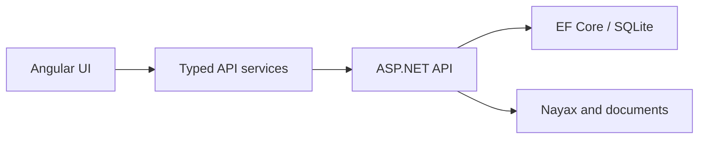

# InventoryApp

InventoryApp is a full-stack operations and bookkeeping system for a vending-machine business. It manages the path from purchasing and stock through machine replenishment and Nayax sales, then turns those records into auditable cost, reconciliation, GST, and profitability reports.

## Capabilities

- Product, category, supplier, and low-stock management, including a per-product supplier price history/comparison (lowest vs. latest actual purchase cost, by supplier and date). A product itself carries **no supplier**: a supplier is recorded on the purchase you bought in and on the supplier order you placed, and the price comparison shows every supplier a product was actually bought from out of that purchase history (see [A product carries no supplier](#a-product-carries-no-supplier)). It carries **no selling price** either: what it sells for is the machine's own live price (see [A product carries no selling price](#a-product-carries-no-selling-price)). Products and categories can be created, edited and deleted by the business itself, with or without a sales provider, and a product with history is retired rather than deleted — kept out of the product lists, the pickers and the reorder alerts while every record of it stays (see [Products and categories](#products-and-categories)). Reorder alerts and the dashboard's ordering figures work with or without a connected Nayax account (see [Reorder alerts without Nayax](#reorder-alerts-without-nayax)).
- Nayax is an optional add-on: inventory, purchasing, expenses and the reports over sales already imported work without it, while the features that read live Nayax data are grouped together in the menu and shown locked until a provider is connected (see [The menu without a usable provider](#the-menu-without-a-usable-provider)).
- Purchases, their supporting documents, supplier orders, and stock movements.
- Sites, vending machines, product assignments, and machine refills.
- Nayax product and transaction imports with explicit payment/status handling.
- Owner-driven Nayax connection setup: test a token, see which permissions it carries, save it and re-test it later (see [Connecting Nayax (Admin page)](#connecting-nayax-admin-page)).
- Historical weighted-average inventory costing and persisted COGS provenance.
- Effective-dated Nayax processing fees and site commission agreements.
- Operating expenses, reimbursement imports, and settlement reconciliation.
- Dashboard, bookkeeping, daily-sales, transaction, GST, commission, machine, and product reports.
- CSV/XLSX exports that use the same backend calculations as the UI.
- Microsoft Entra sign-in and delegated-scope API authorization (see [Authentication configuration](#authentication-configuration)).
- Owner-only business settings — name, contact email, ABN, GST registration and time zone, with a confirmation before a time zone change (see [Business settings (Admin page)](#business-settings-admin-page)).

## Technology

| Area | Stack |
| --- | --- |
| API | ASP.NET Core Web API, .NET 10 |
| Persistence | EF Core 10, SQLite, code-first migrations |
| Frontend | Angular 19 standalone components, TypeScript, RxJS, Tailwind CSS |
| Authentication | Microsoft Entra ID, `Microsoft.Identity.Web` (API), MSAL (`@azure/msal-angular`/`@azure/msal-browser`, SPA) |
| Tests | xUnit, Moq, EF Core InMemory and SQLite |
| Integrations | Nayax Lynx API and imported reimbursement/workbook data |
| Observability | Azure Monitor OpenTelemetry (`Azure.Monitor.OpenTelemetry.AspNetCore`) to Application Insights, enabled by configuration |
| Hosting | Azure App Service and Azure Static Web Apps |
| Automation | GitHub Actions |

## Architecture

The application is a modular monolith with separate API and browser deployments. The backend's incremental move to pragmatic Clean Architecture with vertical feature slices is complete: `InventoryApi` is the HTTP boundary and composition root, `Inventory.Application` holds the use cases and ports, `Inventory.Domain` the deterministic rules and `Inventory.Infrastructure` the adapters, and architecture tests fail if business logic or persistence returns to the API project. The Angular frontend remains standalone and is moving toward feature-local pages, components, data access, and contracts.


```mermaid
flowchart LR
    UI["Angular UI"] --> Client["Typed API services"]
    Client --> API["ASP.NET API"]
    API --> Data["EF Core / SQLite"]
    API --> External["Nayax and documents"]
```

Business calculations stay authoritative on the backend. The UI owns navigation, interaction state, accessibility, and presentation without recreating inventory or accounting formulas.

See [docs/architecture.md](docs/architecture.md) for the current system, target boundaries, frontend structure, financial rules, and incremental migration tracks, and [docs/automation.md](docs/automation.md) for the controlled automated-development lifecycle.

## Repository map

```text
Inventory App/
├── backend/InventoryApi/          ASP.NET Core API, EF migrations, and solution
├── backend/Inventory.UnitTests/   Pure Domain/Application backend tests
├── backend/Inventory.IntegrationTests/ Database, API, adapter and architecture backend tests
├── frontend/inventory-app/        Angular application
├── docs/architecture.md           Current and target architecture
├── docs/automation.md             Automated development lifecycle and authority model
├── evals/agent/                   Agent Evals corpus, schema and baseline report
├── .github/ISSUE_TEMPLATE/        Agent task issue form
├── .github/pull_request_template.md
├── scripts/validate.ps1           Windows/PowerShell validation
├── scripts/validate.sh            Bash validation
├── scripts/run-agent-evals.mjs    Agent Evals runner
├── scripts/validate-runner-placement.mjs  Every workflow job on the self-hosted runners
├── AGENTS.md                      Engineering and agent safeguards
└── CLAUDE.md                      Claude Code entry point (points to AGENTS.md and docs)
```

## Prerequisites

- [.NET 10 SDK](https://dotnet.microsoft.com/download)
- [Node.js 20 or later](https://nodejs.org/) and npm

A global Angular CLI installation is not required; the npm scripts use the repository's locked CLI version.

## Run locally

### 1. Start the API

From the repository root:

```bash
dotnet restore backend/InventoryApi/InventoryApi.slnx
dotnet run --project backend/InventoryApi/InventoryApi.csproj
```

The development API listens at <http://localhost:5000>. Swagger UI is available at <http://localhost:5000/swagger> while the API is running in the Development environment.

EF Core migrations are applied automatically at startup in **Development**, **Testing**, and **Production** (issue #201). Development and `Testing` do this because their database is disposable; Production does it as part of a normal deployment restart, and fails closed — logging the failure and refusing to finish starting — rather than serving requests against a schema its code does not match. The default SQLite database is `inventory.db`, resolved from the API process's working directory; local database files must not be committed. Schema migrations never assign tenant ownership or perform the business backfill, so starting the API never triggers one. Some schema migrations do rebuild tables and copy persisted rows.

Any other non-Production environment (an ephemeral integration-test or Staging database, for example) still applies nothing by default and refuses to start while any migration is pending, unless `Database:AllowAutomaticMigrationUnsafeOutsideDevelopment` is set to `true` for that disposable database; the setting has no effect in Production, which always migrates automatically regardless. The explicit `migrate-database` command remains available for diagnostics and manual use — inspecting what a pending deployment will apply, or applying a high-risk migration ahead of a deployment window under review — from a source tree with the SDK:

```bash
dotnet run --project backend/InventoryApi -- migrate-database --dry-run
dotnet run --project backend/InventoryApi -- migrate-database --apply
```

or, from the deployed application (`dotnet publish` output, which has no SDK or sources, so `dotnet run --project` is unavailable):

```bash
dotnet InventoryApi.dll migrate-database --dry-run
dotnet InventoryApi.dll migrate-database --apply
```

#### Business/tenant bootstrap

Business data is owned by a `Business` record. Applying the schema creates no application `Business` — but it does not follow that there are no tenant-owned rows: seeded or pre-existing legacy rows carry `BusinessId = 0`, which matches no business, so they are invisible to every caller until the ownership bootstrap assigns them. Either way a signed-in caller sees an empty dataset until the bootstrap runs. This is the intended fail-closed state — the data is unowned, not lost — and the API logs an error at startup while it persists.

The mapping from Microsoft Entra identities to that business is human-supplied and is never committed. `appsettings.json` ships the `BusinessBootstrap` section empty; supply real values through user secrets locally:

```bash
cd backend/InventoryApi
dotnet user-secrets set "BusinessBootstrap:BusinessName" "<business name>"
dotnet user-secrets set "BusinessBootstrap:Members:0:DirectoryTenantId" "<your Entra tid claim>"
dotnet user-secrets set "BusinessBootstrap:Members:0:ObjectId" "<your Entra oid claim>"
```

Then assign ownership. The dry run measures and rolls back; `--apply` must be typed explicitly:

```bash
dotnet run --project backend/InventoryApi -- bootstrap-business --dry-run
dotnet run --project backend/InventoryApi -- bootstrap-business --apply
```

On a deployed application use `dotnet InventoryApi.dll bootstrap-business --dry-run` / `--apply` instead.

The command is restart-safe and idempotent: it only ever touches rows that are still unassigned. See [docs/tenant-rollout.md](docs/tenant-rollout.md) for the reviewed production sequence.

#### Migrating documents to Azure Blob storage

Uploaded purchase and operating-expense documents can be stored on the filesystem (the default)
or in a private Azure Blob container, selected by `DocumentStorage:Provider`. Moving the
documents already on disk into the container is a separate human-invoked command. It requires
`DocumentStorage:Provider=AzureBlob` with `BlobServiceUri` and `ContainerName`, authenticates
with `DefaultAzureCredential` — no account key, SAS token or connection string — and refuses to
run against the filesystem default:

```bash
DocumentStorage__Provider=AzureBlob dotnet run --project backend/InventoryApi -- migrate-documents --dry-run
DocumentStorage__Provider=AzureBlob dotnet run --project backend/InventoryApi -- migrate-documents --apply
```

On a deployed application use `dotnet InventoryApi.dll migrate-documents --dry-run` / `--apply`
instead. Exactly one of the two flags must be given.

The provider is supplied as a process-local override, not by changing the deployed application's
own setting: the running API reads the same `DocumentStorage:Provider`, so switching it
persistently would move live document reads to the container before anything had been copied or
verified.

The dry run writes nothing and reports what an apply would do. An apply copies each document to
`tenants/{businessId}/purchases|expenses/{storedFileName}`, where the business is read from the
record that owns the document, and verifies the copy by size and SHA-256 before counting it as
migrated. Reruns are safe and source documents are never deleted.

**Do not run this against production from this description.**
[docs/document-storage-rollout.md](docs/document-storage-rollout.md) is the canonical procedure:
prerequisites, how to read the report, what must be reviewed before an apply, how to verify, and
why the runtime provider is switched only afterwards.

#### Migrating the Nayax connection into the business

Every Nayax call uses the calling business's own encrypted connection record (issues #518 and #520),
and the credential this application has used so far is in global configuration (`NayaxLynx__*`).
Moving that configured operator id and access token into the existing business's record is a separate
human-invoked command, and until it has run that business has no Nayax connection:

```bash
dotnet run --project backend/InventoryApi -- migrate-nayax-connection --dry-run
dotnet run --project backend/InventoryApi -- migrate-nayax-connection --apply
```

On a deployed application use `dotnet InventoryApi.dll migrate-nayax-connection --dry-run` /
`--apply` instead. `--apply` must be typed explicitly; neither flag is a dry run, and both together
are refused.

The dry run writes nothing at all and reports the business it resolved, the configured operator id,
what is stored today and the change an apply would make. The access token is never printed, logged
or included in a message. An apply stores the credential encrypted and marks the connection
`Ready`, because that token is the one already in production use — the command never calls Nayax.
It is one transaction, committed only once both land, and every run reports a `Database` line
stating whether anything changed, so a failed apply leaves nothing behind and says so.
Re-running changes nothing — including the connection's status, which a re-run leaves exactly as it
is even when it is not `Ready`. It refuses, writing nothing, unless the ownership bootstrap is complete
for exactly one business, that business is the one `bootstrap-business` adopted, no *different*
credential is already stored, and a `NayaxTokenProtection` key is provisioned.

A new business does not need this command: an Owner connects their own Nayax account from the
application, through the wizard on Admin → Integrations (see
[Connecting Nayax (Admin page)](#connecting-nayax-admin-page)). The command exists for the business
whose credential was already in global configuration before that wizard did.

**Do not run this against production from this description.**
[docs/tenant-rollout.md § Migrating the Nayax connection into the business](docs/tenant-rollout.md#migrating-the-nayax-connection-into-the-business-issue-519)
is the canonical procedure, including the cutover window around issue #520, how to verify Nayax
afterwards and when the global settings may be removed.

#### Deciding which product an unresolved sale belongs to

Since issue #758 every stored sale records the local product it belongs to in its own column, and
the release's migration fills that column from the identifiers each sale already carries. It
deliberately refuses to guess in two cases: a sale whose stored number names one product directly
and a *different* one through a recorded provider id, and a sale no unambiguous product name covers.
A human names the product instead:

```bash
dotnet run --project backend/InventoryApi -- resolve-nayax-sale-products --dry-run
dotnet run --project backend/InventoryApi -- resolve-nayax-sale-products \
    --decide 4821=5001 --decided-by "A. Operator" --apply
```

On a deployed application use `dotnet InventoryApi.dll resolve-nayax-sale-products --dry-run` /
`--apply` instead. `--apply` must be typed explicitly; neither flag is a dry run, both together are
refused, and `--decided-by` is required with a decision because who decided is part of the audit
row.

The dry run writes nothing and lists, per business, every unresolved sale with its own key, its
transaction, its machine, its reported product name, both recorded candidate products where there
are any, whether it carries a historical cost today, and whether exactly one product's name
attributes it today. Those last two counts matter: **the application refuses to start while any sale
that is costed today has no product**, because such a sale would otherwise be dropped from every
future cost replay while still carrying COGS, and **while any sale a product's name attributes today
has no product**, costed or not, because every reader gave it that product until this release. The
command applies no migration, so it is runnable exactly when startup is refusing for either reason.

A decision names the sale by the key the dry run prints — there is no business flag, and the
business is the one the stored sale belongs to. Each applied decision fills only a product that is
still absent and appends an audit row with the candidates, the chosen product, who decided and when,
so re-running one writes nothing and can never move a sale off a product it already carries.

**Do not run this against production from this description.** See
[docs/architecture.md § The sale's own product](docs/architecture.md#the-sales-own-product-issue-758)
for the model, the migration steps and what the failure gate guarantees.

### 2. How the frontend finds the API

Nothing to configure locally. `ConfigService` resolves the API base URL to `/api` whenever the application is served from `localhost` or `127.0.0.1`, and the development proxy forwards `/api` to <http://localhost:5000>. Any other origin is a deployed one and uses `apiBaseUrl` from `frontend/inventory-app/src/assets/config.json`, which holds the deployed Azure API URL. Do not edit that tracked file to switch between local development and deployment, and do not commit a personal endpoint.

### 3. Start the frontend

In a second terminal, from the repository root:

```bash
npm --prefix frontend/inventory-app ci
npm --prefix frontend/inventory-app start
```

Open <http://localhost:4200>. The `start` script builds the Tailwind stylesheet and starts the Angular development server.

### 4. Sign in

The application requires a Microsoft Entra sign-in. Click **Sign in** in the header; it redirects to Microsoft, and after sign-in redirects back to `/auth` (`AuthCallbackComponent`) before continuing to the requested page. `/auth` itself is intentionally public (not behind `MsalGuard`) so the redirect can complete; every other route requires an authenticated session with the delegated `access_as_user` scope, enforced again by the API (`401` with no token, `403` without the scope).

A deployment that has a customer identity tenant configured offers a choice first, on the public `/sign-in` page: **Continue with Google or an email address** or **Sign in with a Microsoft work account** — see [Signing in with Google](#signing-in-with-google-issue-711) and [Signing in with an email address and password](#signing-in-with-an-email-address-and-password-issue-712) below. With no such tenant configured, which is the state in source control, nothing changes: **Sign in** redirects straight to the workforce authority with no extra page and no extra click.

## Authentication configuration

Authentication uses Microsoft Entra ID (Azure AD): ASP.NET Core / `Microsoft.Identity.Web` validates bearer tokens on the API, and the Angular SPA signs users in with MSAL (`@azure/msal-angular`, `@azure/msal-browser`). See [docs/architecture.md](docs/architecture.md#authentication-and-authorization) for the full boundary description.

Non-secret configuration already committed to the repository:

- **API** (`backend/InventoryApi/appsettings.json`, `AzureAd` section): `Instance`, `TenantId` (`common`, multi-tenant), `ClientId` (the API app registration's public application ID), and `Scopes` (`access_as_user`). These identify the API for token validation; no client secret is used or required.
- **SPA** (`frontend/inventory-app/src/app/auth-config.ts`): the SPA app registration's client ID, the API's `api://<api-client-id>/access_as_user` scope, and the redirect URI (`<origin>/auth`). The same file holds `externalIdSettings`, the second authority's four identifiers, **empty** in source control — see [Signing in with Google](#signing-in-with-google-issue-711).

Human-controlled Entra portal setup this configuration depends on (not part of this repository, and not something an agent may change):

- App registrations for the API and the SPA, with the API exposing the `access_as_user` scope and the SPA's platform configured for the redirect URIs it actually uses (`http://localhost:4200/auth` for local development, and the deployed Static Web App origin's `/auth` for production).
- The SPA registration's API permissions granting delegated `access_as_user` access to the API app registration.

### Customer identity: a second trusted issuer (issue #710)

The API can also validate bearer tokens from **one** Microsoft Entra External ID tenant beside the workforce sign-in above, which is the token-validation half of the approved design in [docs/identity-provider-decision.md](docs/identity-provider-decision.md) (issue #709, under #708). Everything is in `backend/InventoryApi/Auth/ExternalIdentity/`, and [docs/architecture.md § Trusted issuers and the two bearer schemes](docs/architecture.md#trusted-issuers-and-the-two-bearer-schemes-issue-710) describes the boundary in full.

**What has shipped, and what has not.** The API accepts tokens from a configured External ID tenant and resolves the same validated `(tid, oid)` actor it always has; a customer identity that holds no membership gets `403` and no business data. Since issue #711 the Angular application offers the Google journey against that tenant too, and since issue #712 the local email-and-password journey through the same hosted flow — see [Signing in with Google](#signing-in-with-google-issue-711) and [Signing in with an email address and password](#signing-in-with-an-email-address-and-password-issue-712) below. Identity linking is **deferred** (#713), so the same person signing in a different way is a different actor with no membership and no inherited access. Issue #714 has completed the automated half of the consolidated validation — the provider × account-state × role matrix, identity separation, the threat-model rows and the rollback rehearsal — and recorded every hosted-provider check as **not verified**: see [Rollout verification, staging smoke tests and rollback](#rollout-verification-staging-smoke-tests-and-rollback-issue-714) below. **Enabling the new sign-in in production is still gated on those human staging checks and a recorded go/no-go decision.**

**Configuration, all of it non-secret, none of it committed.** The `ExternalId` section in `appsettings.json` ships with three **empty** identifiers, which is both the fail-closed state and the rollback lever: with them empty the second bearer scheme is not registered at all, every External ID token is rejected, and workforce sign-in is untouched. A half-filled or malformed section means the same thing and is logged as a startup error. Supply the values per environment with `dotnet user-secrets` locally or application settings in Azure:

- `ExternalId__Instance` — the tenant's authority host, `https://<tenant-subdomain>.ciamlogin.com/`
- `ExternalId__TenantId` — the External ID tenant's GUID
- `ExternalId__ClientId` — the GUID application ID of the API app registration **in that tenant**, which is a different registration from `AzureAd:ClientId` because an app registration belongs to one tenant and each scheme validates only its own audience

None of these is a credential: the API validates tokens with the authority's published signing keys and the SPA is a public client using authorization code with PKCE, so neither holds a client secret and no Key Vault reference is needed — the same classification the `PlatformAdmin` pair already has. Reverting to workforce-only sign-in is clearing these settings: no deployment, schema change or data step is involved, and memberships created through the new issuer are retained and work again if the settings are restored.

Human-controlled portal setup this depends on (no agent may perform any of it, and the API deliberately does not check that it was done):

- Create the External ID tenant, register the API application in it with an `access_as_user` delegated scope, and register the SPA as a PKCE public client with exactly the redirect and post-logout URIs in use.
- Configure the Google identity provider in the tenant — its OAuth client secret lives in the provider, never in this repository — and the local email/password sign-up with its verification and password reset.
- Create the sign-up/sign-in **user flow**, enable the intended providers inside it, and associate the SPA application with it. None of those three steps is implied by the registrations above, and the journeys simply do not appear without them.
- Decide each registration's accepted access-token version; the API pins both audience spellings (`<client-id>` and `api://<client-id>`), so either one validates.
- Keep the administration of that tenant separate from the `PlatformAdmin` pair, which stays a workforce identity: the same object ID presented from the customer identity tenant is a different actor and reaches no platform-admin endpoint.

### Signing in with Google (issue #711)

Google sign-in is the **hosted** customer identity journey: the SPA redirects to the configured External ID tenant's own sign-up/sign-in user flow, where a human has enabled Google as a built-in identity provider, and the API receives a token that *tenant* issued. The application never talks to Google, never exchanges a Google ID token, sends no provider hint or query parameter of its own, and reads nothing from the upstream Google subject — the actor is the validated `(tid, oid)` pair exactly as for every other sign-in. Design: [docs/identity-provider-decision.md](docs/identity-provider-decision.md) § 4 journey C and § 9; boundary: [docs/architecture.md § The sign-in choice and the Google journey](docs/architecture.md#the-sign-in-choice-and-the-google-journey-issue-711).

**What a person sees.** With a customer identity tenant configured, a signed-out visitor reaches the public `/sign-in` page instead of being redirected automatically — the authority has to be chosen explicitly, once, before any redirect — and it offers the customer identity action, **Continue with Google or an email address** since issue #712 added the local journey to the same hosted flow, beside **Sign in with a Microsoft work account**. The choice is remembered in `localStorage`, so a reload, a new tab and a token refresh go back to the authority that issued the session; signing out forgets it, so the next person chooses again. Each tab pins its own snapshot of that choice for as long as it is open, so a second tab changing it cannot alter the authority this tab is already signing in against. A cancelled or failed hosted sign-in returns to `/sign-in` with the reason and the same two choices and starts no further redirect by itself. The page the visitor originally asked for is carried across in the tab's `sessionStorage` and handed to MSAL as the redirect start page; it comes from the router state, never from a URL parameter, and an absolute, protocol-relative, `/auth` or `/sign-in` destination is refused. **It survives a cancelled or failed attempt**, so pressing an action again returns the person to the page they were going to — an invite acceptance page included — rather than to the dashboard; it is released when a sign-in completes, and trying again never extends its 15-minute window.

**Google sign-in grants nothing by itself.** A Google identity that nobody invited lands on the existing welcome page with `NoMembership`, and that page now says plainly that each way of signing in is a separate account: a member who normally uses their work account and then signs in with Google gets a *new* actor with no membership, no role and no inherited access. Nothing is linked by a matching email address — an address is display-only data here and decides nothing — and Google sign-in on its own never redeems an invite. Joining a business is still the existing invite or onboarding journey.

**Configuration, non-secret, and empty in source control.** The four SPA identifiers live in `externalIdSettings` in `frontend/inventory-app/src/app/auth-config.ts`, empty for the same reason the API's `ExternalId` section is: empty is the fail-closed shipped state and the rollback lever. While any of them is empty or the instance is not an `https` authority, the second authority does not exist — no Google action is rendered, no second MSAL instance can be built, and the application signs in exactly as it did before. Fill them in per deployment (they are build-time values, so changing them is a build):

- `instance` — the tenant's authority host, `https://<tenant-subdomain>.ciamlogin.com/`
- `tenantId` — the External ID tenant's GUID
- `clientId` — the **SPA** app registration in that tenant, which is a different registration from the workforce SPA client id above
- `apiClientId` — the **API** app registration in that tenant, whose `access_as_user` scope the SPA asks for

MSAL partitions its token cache by client id and authority, so those distinct client ids are what keep the two authorities' caches apart; the token request names `openid` and `profile` explicitly, because External ID issues `oid` and `tid` only when `profile` is asked for and they are the whole identity the API reads. None of these values is a credential: the SPA is a PKCE public client and holds no client secret, and the Google OAuth client secret exists only inside the External ID tenant's provider configuration — never in this repository, a pipeline or an application setting.

Human-controlled setup this depends on, in addition to the External ID portal work listed above (no agent may perform any of it):

- Create the Google OAuth client in Google Cloud and register its client id and secret **in the External ID tenant**.
- Enable Google inside the tenant's sign-up/sign-in **user flow** — enabling a provider at tenant level is not the same as offering it in a flow — and associate the SPA application with that flow.
- Register `http://localhost:4200/auth` and the deployed Static Web App origin's `/auth` as redirect URIs, and the origins as post-logout URIs, on that tenant's SPA registration.

**Staging verification before production activation (human, not automated).** Configuring a provider is not the same as a person being able to use it, so a human confirms in staging, with a test identity they created, that: `/sign-in` offers the customer identity action; the hosted page actually offers Google and a new Google user can complete the journey end to end; the SPA returns to `/auth` and acquires an API access token for `access_as_user`; the decoded token carries a GUID `oid` and the External ID `tid`; the API accepts it and the identity resolves **no** membership, so every business endpoint answers `403` and the application shows the welcome page; cancelling on the hosted page returns to `/sign-in` with the cancellation explained and no loop; an invite link opened before signing in still lands on `/invite` afterwards and is redeemable within its window, **including when the first attempt was cancelled and the second one completed**; and existing workforce sign-in is unchanged on the same build. A journey that is configured but not offered, or offered but not completable, is a failed phase. Record the result with the design's § 13 checklist; the consolidated run across both issuers is [docs/identity-rollout-verification.md § 3](docs/identity-rollout-verification.md#3-the-staging-smoke-tests-a-human-runs), which is the checklist to work from.

MSAL's protected-resource map (`buildProtectedResourceMap` in `auth-config.ts`) is built from `ConfigService.apiBaseUrl`, the same value every HTTP call uses (see [above](#2-how-the-frontend-finds-the-api)), so the bearer token attaches correctly to `/api/*` locally and to the deployed absolute API URL in production, without any code or configuration change between environments. `ConfigService` loads `assets/config.json` on the raw `HttpBackend` rather than the intercepted `HttpClient`, so the MSAL interceptor cannot be constructed — and cannot capture a stale API base URL — before that load has finished.

Protected business documents (purchase documents and operating-expense supporting documents) are stored outside the API's web root and are served only by the authenticated `/api/purchases/{id}/file` and `/api/operating-expenses/{id}/attachment` endpoints. The API registers no static-file middleware, so these documents have no anonymous URL; the frontend fetches them through `HttpClient` and renders them from a temporary object URL.

Azure Static Web Apps direct navigation (including the `/auth` redirect landing) is handled by `frontend/inventory-app/src/staticwebapp.config.json`, which rewrites unmatched paths to `/index.html` so the Angular router — not a platform 404 — handles them.

### Signing in with an email address and password (issue #712)

A customer can register and sign in with **any deliverable email address**, a custom company domain included, without holding a Microsoft or Google account. It is the *same* hosted journey as Google sign-in above — the same External ID tenant, the same user flow, the same SPA and API registrations — so there is no extra identifier, flag or setting to fill in, and the one customer identity action on `/sign-in` names both: **Continue with Google or an email address**. Design: [docs/identity-provider-decision.md](docs/identity-provider-decision.md) § 4 journey D and § 16; boundary: [docs/architecture.md § The local email and password journey](docs/architecture.md#the-local-email-and-password-journey-issue-712).

**No credential ever reaches this application.** There is no password field, registration form, verification page or recovery link anywhere in it, and no password, password hash, verification code, reset code or recovery token is received, stored, logged or put in a URL. Creating the account, verifying the mailbox with the one-time code Microsoft emails, signing in, and resetting a forgotten password all happen on the provider's hosted pages; the sign-in page says so, says Inventory Manager never sees a password and cannot reset one, and tells a person whose verification or reset code has expired to start again from `/sign-in`, where the hosted page issues a new one. A refused sign-in shows one generic application-authored sentence and never the provider's own error text, so it does not disclose whether an address has an account here.

**Signing in grants nothing by itself.** A newly verified customer who nobody invited lands on the existing welcome page with `NoMembership` and `403` from every business endpoint, exactly like a Google or workforce stranger; joining a business is still the invite or onboarding journey. Nothing is linked by a matching mailbox: registering an address an existing member already uses creates a separate actor with no membership, no role and no inherited access, a duplicate registration of one address is a second actor again, and an email change or password reset at the provider changes no `(tid, oid)` and therefore cannot move or widen a membership.

#### Provider controls, and what a human must configure

Recorded from the design's § 13 verification (checked against Microsoft's published External ID documentation on 18 October 2026, not against a provisioned tenant). These are the controls to set while configuring the user flow, and the gaps to accept or cover deliberately:

| Control | What the provider offers | Human action |
| --- | --- | --- |
| Mailbox verification | A one-time email code during sign-up, **before the account exists**, so an unfinished registration produces no account and no token. "Email with password" is the default local option | Enable email with password in the user flow and confirm the verification step is on |
| Password handling | Stored and checked entirely by the provider; this application never receives one. **Password policy configurability is unconfirmed** | Check the policy the tenant actually applies and record it |
| Account recovery | Self-service password reset sends a code to the mailbox; SMS reset is available as a paid add-on | Enable self-service password reset in the flow and verify the entry point on the hosted page |
| MFA | Email one-time code (no extra charge), SMS (paid add-on, billed per message by country), and passkeys for local accounts | Decide which methods are enabled, and record the decision with the staging result |
| Lockout / throttling | Smart lockout and basic HTTP protections are on by default. **There is no built-in per-IP throttling setting** | Accept the defaults, or put a WAF in front; raise per-IP limiting as its own issue if the data warrants it |
| Bot / sign-up fraud | **Not built in.** It needs a third party (Arkose Labs, HUMAN Security) or a WAF (Cloudflare, Akamai, Azure WAF) | Decide explicitly before enabling self-service onboarding, which stays `false` (`SelfServiceOnboarding:Enabled`) until then |
| Cost | Free for the first 50,000 monthly active users; add-ons (SMS included) have no free tier | None at the current single-business scale |

**Residual limitations, stated rather than worked around.** Bot and sign-up fraud protection and per-IP throttling are not provided and are not implemented here, so a free identity remains cheap to create — which is why `SelfServiceOnboarding:Enabled` stays off and the per-identity application rate limit is not relied on as an anti-abuse control (design § 11, T6). The password policy in force is whatever the tenant is set to and has not been confirmed. Nothing above is verified against a real tenant by this change: it is the documented capability set a human configures and then confirms in staging.

**Staging verification before production activation (human, not automated).** With a test identity they created, a human confirms in staging that: the hosted page offers the email-with-password option; a new customer can register, receive the verification code and complete sign-up end to end; the SPA returns to `/auth`, acquires an API access token for `access_as_user`, and the decoded token carries a GUID `oid` and the External ID `tid`; the API accepts it and resolves **no** membership, so every business endpoint answers `403` and the application shows the welcome page; signing in again with the same address and password works, and a wrong password shows the provider's own message on its own page and never reveals anything here; **forgot password** reaches the hosted reset journey, a reset code arrives, and an **expired or already-used** code is refused on that page — after which starting again from `/sign-in` issues a new one; cancelling the hosted journey returns to `/sign-in` with the cancellation explained and no loop; an invite link opened before signing up still lands on `/invite` afterwards and is redeemable inside its 15-minute window, which the longer registration round trip makes the case worth timing (extending that window would be its own reviewed decision); the same mailbox used through Google or a workforce Microsoft account produces a *separate* account with no membership and no inherited role; and existing workforce sign-in is unchanged on the same build. A journey that is configured but not offered, or offered but not completable, is a failed phase. Record the result with the design's § 13 checklist; the consolidated run across both issuers is [docs/identity-rollout-verification.md § 3](docs/identity-rollout-verification.md#3-the-staging-smoke-tests-a-human-runs), which is the checklist to work from.

**Authentication identifies a person; business ownership decides what they may see.** Accepting sign-ins from multiple Microsoft Entra tenants (`TenantId: "common"`) only authenticates a user. Data isolation is a separate boundary, established by issue #64: the validated `(tid, oid)` claim pair is mapped to an application-owned **Business** through explicit `BusinessMembership` rows, and every tenant-owned read and write is scoped to that business centrally in `AppDbContext`. A signed-in account with no usable membership receives `403` and no business data — it fails closed rather than falling back to "see everything". The business ID is never accepted from route, query, form, or JSON input. There are exactly three endpoints such an account may still reach, all on a reviewed allowlist the build enforces, and none names an existing business or reads business data. `GET /api/me/account-state` (issue #523) answers only with the state that account is in — `Member`, `NoMembership`, `ApplicationPending`, `ApplicationRejected`, `MembershipRevoked`, `BusinessDeactivated` or `MembershipAmbiguous` — so the application can show the right screen instead of a bare error. `POST /api/invites/redeem` (issue #532) takes an invite token an Owner created and nothing else, and creates that account's **own** membership in the business the invite belongs to, with the role the invite grants; it returns only that role, and an unusable token and an account that already belongs somewhere are both refused with one fixed sentence. `POST /api/onboarding/business-applications` (issue #541) is the self-service application described [below](#starting-a-business-self-service-onboarding), behind a flag that is off by default. The `403` every other endpoint returns is unchanged, for all three of those callers.

**The Angular application reads that state before any business call and shows the screen it calls for** (issue #529). `Member` reaches the page asked for. `NoMembership` goes to a welcome page offering **I have an invite link** — paste the link or the code from it, or open the link directly — and, when `onboardingEnabled` is true, **Start a new business**, which opens the business application form at `/apply` (issue #543): business name, contact email (starting as the signed-in account's own address), optional ABN, a stated yes or no for GST registration, and a time zone chosen from the browser's IANA list. The form checks each field with the API's own rules and sentences before sending anything, shows any refusal the API returns (an account that already belongs to a business, a different application already waiting, the rate limit, or onboarding switched off), and after a recorded application re-reads the account state and lands on the pending-approval page. `ApplicationPending` goes to a pending-approval page with a **Check again** button that re-reads the account state; once approved, it refreshes the capability cache too and loads the app as Owner. `ApplicationRejected` goes to a rejected page that shows the Super Admin's own recorded reason when there is one, and offers the same invite-link option plus **Apply again**, which opens the same form, when `onboardingEnabled` is true. `BusinessDeactivated`, `MembershipAmbiguous` and `MembershipRevoked` go to one "access unavailable" page that names no business — it says to contact the business Owner for the first and third, and support for the second. Because a revoked or released person is the one case `GET /api/me/account-state`'s `onboardingEnabled` flag can make eligible, that page also offers **I have an invite link** always and **Start a new business** only when `onboardingEnabled` is true, matching the API's own eligibility rule. A `403` from any other member endpoint shows "you don't have access to this" through the application's toast, except on one of those destination routes or `/invite/:token`, which already explain the situation themselves. None of this is a boundary: `BusinessScopeMiddleware` refuses every business call the same way regardless of what the router shows.

### Rollout verification, staging smoke tests and rollback (issue #714)

Everything above describes what the application does with a customer identity tenant. **Whether this deployment may switch one on in production is a separate question, and it is answered in [docs/identity-rollout-verification.md](docs/identity-rollout-verification.md)** — the consolidated verification matrix, the staging smoke tests a human runs, the phased enablement, the observability signals, the incident and rollback procedure, and the production go/no-go checklist.

**Three kinds of evidence, never pooled.** Synthetic API/JWT tests say what the API accepts, refuses and resolves. Synthetic browser journeys say what the SPA decides, stores and asks MSAL for. Only a human running a hosted journey in staging can say that a tenant exists, that Google or an email address is actually offered in its user flow, and that a real token carries the claims the design assumes. Each row of that matrix declares its kind and is `passed`, `failed` or **`not verified`**, and no agent may record a human row.

**Where it stands (18 October 2026).** Every synthetic row is `passed` and runs inside `scripts/validate.sh`: the provider × account-state × role matrix across both issuers (invitation redemption, applicant pending and rejected, member access, business deactivation, membership revocation, role capabilities and the Super Admin boundary), identity separation in place of the deferred linking feature (identical mailboxes across providers, one object id in two tenants, the upstream Google subject, duplicate registration, the already-a-member conflict), the threat-model rows T1, T2, T3, T6, T8, T9 and T10, the browser journeys (provider switching and cache separation, external return URLs, an interrupted invite journey, a cancellation, a disabled or misconfigured route), and the design's § 15 rollback rehearsal — which retains memberships and live invites, restores access unchanged, keeps the legacy Super Admin recovery route working while the new sign-in is off, and leaves no bearer token, invitation token or mailbox in the logs. Every hosted-provider row is **`not verified`**, because no External ID tenant is provisioned for these deployments and no agent may create one.

**Rollback, in one sentence.** Clear `ExternalId__Instance`, `ExternalId__TenantId` and `ExternalId__ClientId` and restart — a settings edit on the build already deployed, no deployment of its own — and the second bearer scheme is not registered, every External ID token is refused, workforce sign-in is untouched, and the memberships, roles and outstanding invites created through the new issuer are retained and work again the moment the settings are restored. Removing the customer identity action from the browser is the SPA's four identifiers, which are build-time values and therefore a build and a deployment **of the current commit**; it is cosmetic by comparison, because the API half is what stops access. If the code itself must change, that is a focused forward fix against the current base, not a redeployment of an earlier build: this design's lack of a migration says nothing about whether an earlier whole-application build matches today's database, and [docs/identity-rollout-verification.md § 6.2](docs/identity-rollout-verification.md) states what a human must check first. Rollback cannot recover a customer identity user's access — there is no linking, so the answer for somebody who must keep working is an invitation redeemed by a workforce identity they control.

### Starting a business: self-service onboarding

A business is created in one of two ways. The legacy way is the human-invoked `bootstrap-business` command, which adopts the one existing Australian vending operation and creates it already `Active`; see [docs/tenant-rollout.md](docs/tenant-rollout.md). The other, since issue #541, is a **self-service application** behind the `SelfServiceOnboarding:Enabled` flag:

1. Somebody signs in for the first time. `GET /api/me/account-state` reports `NoMembership`, and its `onboardingEnabled` field reports whether this deployment allows an application at all.
2. They `POST /api/onboarding/business-applications` with the business's name, contact email address, optional ABN, GST registration and IANA time zone. All of those except the ABN are required, and the GST registration must be *stated* — a missing field is a `400`, never a recorded `false`.
3. The server creates a **`Pending`** business with those details and makes the applicant its active **Owner**, in one transaction. It decides everything the request did not: the business's identifier, its status, the applicant's role, and who the applicant is (the validated `(tid, oid)` claim pair of their own token). The response carries only the application's name, status and submission instant — no business identifier.
4. The business is **not usable yet.** Only an `Active` business resolves, so the applicant's very next request is answered with the same `403` as before, and `GET /api/me/account-state` now reports `ApplicationPending` so the application can show them a waiting screen. The new business starts completely empty, with no Nayax connection (`NotConfigured`).
5. Approving or rejecting an application is a Super Admin decision, made through the [Super Admin businesses API](#super-admin-businesses-api) below (issue #544). Approving sets the business `Active`, so its Owner's next request is served; rejecting records a reason, which `GET /api/me/account-state` reports back to that applicant alone as `ApplicationRejected`, and releases the applicant's membership. The rejected application is kept, and the person may apply again, which creates a new business.

Who may apply: an account with **no active membership anywhere** — never a member, released, or previously rejected. An account that already holds an active membership in any business, including a `Pending` or `Deactivated` one, gets `409`. Submitting the identical application again while it is pending returns the application already waiting (`200`, same submission instant) so a lost response cannot create a second business; submitting *different* details is `409`, because changing details an operator is reviewing is a different request. Applications are rate-limited per applicant, and each one emits a structured audit event carrying the actor and the new business id and **no name, email address or ABN**.

**The flag is `false` in source control and must stay off in production until a human has verified the release gate** — see [docs/tenant-rollout.md § Enabling self-service onboarding](docs/tenant-rollout.md#enabling-self-service-onboarding-issue-541). With it off, the endpoint answers `404` and `onboardingEnabled` is `false`.

The journey a second live business needs is now complete end to end. The application form exists (issue #543, `/apply`, above), and the approval **user interface** of issue #510 does too: the Super Admin's own Businesses page (issue #547, see [Super Admin businesses API](#super-admin-businesses-api) above) approves, rejects, deactivates and reactivates a business and releases a member of a deactivated one. The Nayax credential is no longer a blocker either: since issue #520 every Nayax call uses the current business's own encrypted operator id and token, with no global fallback (see [docs/architecture.md § Per-business Nayax credentials](docs/architecture.md#per-business-nayax-credentials-issue-520)). An Owner can test a pasted operator id and token, save the tested pair and re-test the stored one (`/api/settings/nayax-connection/test`, `.../save`, `.../retest`; see [docs/architecture.md § Saving a tested connection and re-testing it](docs/architecture.md#saving-a-tested-connection-and-re-testing-it-issue-537)), and drives it from the connection wizard on Admin → Integrations (see [Connecting Nayax (Admin page)](#connecting-nayax-admin-page)); the connection banners of issue #539 are on the screens that depend on Nayax — the machine list and machine detail, Sync Restock, the site list and a site's products, and the pick list — so a member who cannot reach that wizard still sees why those screens have no Nayax data. The business that is live today had its credential moved in by the human-run [`migrate-nayax-connection`](#migrating-the-nayax-connection-into-the-business) command. See [docs/tenant-rollout.md](docs/tenant-rollout.md) for the bootstrap procedure and [docs/architecture.md](docs/architecture.md#tenant-ownership-issue-64) for the design.

## Roles and capabilities

Ownership decides *whose* data a member sees; their **role** decides what they may do with it. Every `BusinessMembership` carries one of three roles (issue #521):

| Role | What it may do |
| --- | --- |
| **Owner** | Everything, including the Nayax integration, data repairs, members, roles and the business record itself |
| **Manager** | Everything operational, plus the financial figures: dashboard financials, reports, operating expenses, imports, site commissions and supplier GST defaults |
| **Operator** | Day-to-day work only: the dashboard without financial figures, the pick list, inventory (products, take inventory, categories, stock history, machines including Sync Restock, sites) and purchasing (purchases, supplier orders, suppliers) |

- A signed-in member reads their own role and the capability names it grants from `GET /api/me/access`, which also returns their business's name and time zone. It describes the caller alone — never another member or another business — and a role change applies on their next request. A platform administrator inside a [support session](#super-admin-support-sessions) is the one caller it answers with no role at all: they hold none, and the capabilities it reports for them are that session's own read-only set.
- A role is first set when the membership is created, by `bootstrap-business` (its `Role` option is optional and defaults to `Owner`; see [docs/tenant-rollout.md](docs/tenant-rollout.md#the-members-role-issue-521)). Existing memberships were backfilled to `Owner`, so no one's access changed when roles arrived. Changing a role afterwards is the Owner-only member management below. The only other place a role arrives from client input is an Owner creating an invite link, which records the role the redemption will grant and changes nobody's access by itself; both check the role's published **name** against the same vocabulary, and no endpoint anywhere accepts a stored role value.
- A stored role the application does not recognise **denies access** rather than falling back to the least privileged role.
- **Every endpoint is enforced by capability** (issues #525 and #526). The capability a role must grant is checked before the request reaches the endpoint, and a refusal is a plain `403` that describes neither the capability nor the role. What each role can reach:
  - **Operator** — the Dashboard (including its sales refresh) and the Pick List; inventory: products, take inventory, categories, stock and stock history, machines including Sync Restock, and sites; purchasing: purchases, supplier orders and suppliers. They may record a purchase but not change a supplier's GST defaults (`Suppliers.ManageGstDefaults`), and they reach no report, expense, import, site commission, setting or maintenance tool at all.
  - **Manager** — everything an Operator reaches, plus a supplier's GST defaults, operating expenses and their attachments, every report and its CSV/XLSX export, Admin → Imports, and the site commission report, agreements and payments. Not the Nayax settings and not any data repair, so a Manager may read a report whose underlying processing-fee rate only an Owner may change.
  - **Owner** — everything a Manager reaches, plus Admin → Integrations (the Nayax connection wizard and the processing fee rates; see [Connecting Nayax (Admin page)](#connecting-nayax-admin-page)), the Nayax catalogue reconciliation, all five maintenance repairs (Costing Repair, Inventory AVCO Transition Baseline, Historical GST Classification, Nayax Sale Timestamp Repair and Nayax Historical Cost Recovery), Admin → Users (below), Admin → Roles and Admin → Business Settings (see [Business settings (Admin page)](#business-settings-admin-page)). Each repair's preview and dry run is as restricted as its apply.
  - **Admin → Roles** (issue #530) is a read-only page, on `Roles.View`, which only an Owner holds: it explains what Owner, Manager and Operator can each access, from the same table above. It edits nothing — no role, no permission and no member — and is rendered from one frontend definition kept from drifting away from the published capability vocabulary by its own test (see [docs/architecture.md § The Roles page](docs/architecture.md#the-roles-page-issue-530)).
  - **The dashboard's financial figures are sent only to a role that may see them** (issue #527). Every role reaches `GET /api/dashboard/summary` — it is the landing page — but a role without `Dashboard.ViewFinancials`, today an Operator, receives the response with no `salesThisWeek` object and no `inventory.inventoryValueAtCost`: both are **absent from the JSON**, not `null` and not `0`, and the week's sales are never calculated for that caller. Everything else in the response is unchanged. The Angular dashboard hides those two cards when the figures are absent and shows the two non-financial cards alone (issue #528), so the fix was never to make the API send `null`.
  - **`Dashboard.ViewFinancials` covers every sales, revenue, profit, margin, profitability-status and trend/comparison figure, and inventory value, on the Dashboard, Sites and Machines pages** (issue #699) — not only the two headline cards above. The Sites list and the home Dashboard's Sites/Machines tables hide their revenue, direct-profit, margin and trend columns without it; Site Products hides Estimated Card Profit (and drops it from the CSV export); the Machines list hides sales, direct profit and the profitability-status badge; and Machine Detail hides its revenue/direct-profit summary cards and the Estimated Card Profit/50% Card Margin Price product columns. Unit cost, site/machine selling price, stock, restock and navigation stay visible to every role. That page-level hide is read from `GET /api/me/access` rather than from each endpoint's response, so on its own it hides a figure rather than protecting it; the API withholds the figures too, for the site endpoints since #697, for the machine and product endpoints since #698, and for the stock-movement and purchasing endpoints since #700 (the next three bullets).
  - **The site endpoints withhold revenue and estimated profit from a role that may not see them** (issue #697). Every role reaches `GET /api/sites` and `GET /api/sites/{id}/products` — stocking and pricing a site is day-to-day inventory work, on `Inventory.Operate` — but a role without `Dashboard.ViewFinancials`, today an Operator, is sent `null` for `todayRevenue`, `currentWeekRevenue` and `previousComparableWeekRevenue` on every site row and for `estimatedCardProfit` on every site product row. Never `0`: a period with no completed sale still reports an honest `0` to a caller who may see it, so `null` means "not yours to see". The revenue and the estimate are never calculated for that caller at all — the completed-sales read behind the revenue and the commission and processing-fee reads behind the estimate are not made. **Unit cost (`averageUnitCost`) and site price (`sitePrice`) stay visible to every role**, together with stock, MDB codes, machine counts and the alert counts, and a Manager's and an Owner's response is unchanged. A platform administrator in a [support session](#super-admin-support-sessions) sees the figures, because that session's fixed capability set grants `Dashboard.ViewFinancials`. The machine and product endpoints are covered separately by #698 (next bullet).
  - **The machine and product endpoints withhold their financial figures too** (issue #698). `GET /api/machines`, `GET /api/machines/{id}`, `GET /api/machines/{id}/products`, `GET /api/products`, `GET /api/products/{id}` and the low-stock list all stay available to an Operator — restocking machines is what they are for — but for a caller without `Dashboard.ViewFinancials` every machine revenue, direct-profit and `profitabilityStatus` field and every product's `inventoryValue` is **`null`, never `0`**: a withheld revenue arriving as zero would be a false statement about the business, and summing `inventoryValue` would have recovered the valuation the dashboard withholds. Machine identity, stock, restock and Sync Restock are untouched, and **unit cost (`averageUnitCost`) and selling price (`machinePrice` and the slot's suggested price fields) stay visible to every role** by the recorded decision — an Operator needs them to restock and price a slot. The catalogue `unitPrice` that decision also named is no longer a question: the field was removed, so no response carries it (see [A product carries no selling price](#a-product-carries-no-selling-price)). A Manager's and an Owner's responses are unchanged. The one gap #698 left open — a product's `stockAdjustments` still carrying each movement's inventory value — is closed by #700 in the next bullet. See [docs/architecture.md § Machine and product financial redaction](docs/architecture.md#machine-and-product-financial-redaction-issue-698).
  - **Every remaining Operator-readable endpoint has been audited, and the last two leaks are closed** (issue #700). Issue #700 walked every endpoint a role without `Dashboard.ViewFinancials` can reach — taken from the capability policies themselves — and classified each restricted figure on each one; the endpoint-by-endpoint table is in [docs/architecture.md § Operator-readable financial disclosure](docs/architecture.md#operator-readable-financial-disclosure-issue-700). Two figures were still being sent. A **stock movement's `inventoryValueAfter`** — the business's inventory value at cost after that movement, so the latest one reports the current valuation — is now `null` for a caller without the capability on `GET`/`POST api/products/{id}/stock`, on `GET api/stock-history`, and nested in a product's `stockAdjustments`. The **catalogue product nested in a purchase line or a supplier-order line** now withholds its `inventoryValue` on the `api/purchases` and `api/supplierorders` responses, the same way `api/products` has since #698 — otherwise listing purchases was a way around that. Never `0`: both fields already mean "no cost" or "no valuation yet" when they are `null`, and a withheld amount arriving as zero would be a false statement about the business. **Nothing else is withheld.** A movement's own `unitCost`, `totalCost` and `averageUnitCostAfter`, a purchase's `totalAmount`, delivery and package charges, each line's `unitCost` and `lineTotal` and its input-GST block, and a supplier order's quantities, `unitPrice` and `outstandingQuantity` all stay visible to every role, because they are purchasing and unit-cost data an Operator enters and has to be able to read back. Every other Operator-readable endpoint — the pick list, categories, take inventory, the price history and restock-cost suggestion, Sync Restock, the machine stock ledger, suppliers and the stored purchase document — carries no restricted figure at all. A Manager's and an Owner's responses are unchanged, and a new revenue, profit, margin, sales or inventory-value property on any of these responses now fails the build until somebody decides what happens to it.
  - **The Angular application renders what the role allows** (issue #528). It reads the caller's capabilities once from `GET /api/me/access` and builds the sidebar from them, so an Operator is offered no Expenses, Reports or Admin entries and a Manager no Integrations or data-repair entries; a route the role does not allow shows an "access not allowed" page, and an action the role cannot use — the supplier GST defaults editor — is not offered. **None of that is the boundary**: the API checks the same capability on every request and refuses it there, so a hidden entry hides a page rather than protecting one, and a capability list that cannot be read hides nothing at all. Since every current member is an Owner, nothing changed for anybody using the application today.
  - The capability vocabulary and the one role → capability table are described in [docs/architecture.md](docs/architecture.md#membership-roles-and-capabilities-issue-521), how they are enforced in [docs/architecture.md § Capability authorization](docs/architecture.md#capability-authorization-issue-525), and the full matrix by page and endpoint in [docs/architecture.md § Capability authorization on the Manager and Owner endpoints](docs/architecture.md#capability-authorization-on-the-manager-and-owner-endpoints-issue-526).

### Managing members: changing a role and revoking access

An Owner manages their own business's members through four endpoints (issue #533). They require `Members.Manage`, which only an Owner holds, so a Manager and an Operator get a plain `403` — the list included, because it is the roster the changes are made from and it shows every member's name and email address. The Admin → Users page (issue #534) calls them: it lists every member with their name, email, role and status, and changes a role, revokes or reinstates a member, each behind a confirmation dialog and showing the API's own refusal sentence unchanged — including the last-Owner and already-a-member-elsewhere refusals below.

```text
GET  /api/members                              display name, email, role, active, joined
PUT  /api/members/{membershipId}/role          { "role": "Owner" | "Manager" | "Operator" }
POST /api/members/{membershipId}/revoke
POST /api/members/{membershipId}/reinstate
```

- **Everything is scoped to the caller's own business.** No endpoint takes a business id, and a membership id belonging to another business is simply **not found** — an Owner holds every capability there is and still reaches nothing of another business's.
- **Changes apply on that member's next request.** A demoted member's next call is answered with their new role, a revoked member's next call is refused, and a reinstated member's next call works again. There is nothing to wait for and no sign-out to force.
- **Revoking keeps the row**, marked inactive, so the revoked approval stays visible on the list, can be reinstated, and no longer occupies that person's one active membership — which is what lets them join another business.
- **The business always keeps at least one active Owner.** Revoking or demoting the last active one is refused with `409` and "A business must keep at least one active Owner. Give another member the Owner role first." — including when the Owner is acting on themselves. An Owner *may* step down or revoke themselves while another active Owner remains. The rule exists because only an Owner may manage members, roles, the integration and the business record, so a business that lost its last Owner could not be repaired from inside the application at all.
- **Reinstating is refused with `409` if that person has since joined another business** ("This person is already a member of a business."), because a second active membership would deny them both. The message names no business, member or role.
- **A revoked membership's role is not edited.** Reinstating restores the role the row still holds, so an Owner reinstates first and then changes the role; both steps are audited.
- **Every change is audited.** One structured log event records who made it, the business, the membership, which change it was, and the old → new role and active flag. It contains **no name and no email address**, and it is written only after the change is committed — a refused change, or a request asking for the state a member already has, writes nothing and is audited as nothing.
- An unsupported role name (including a bare number such as `40`) is rejected with `400` and stores nothing. A declared name is accepted case-insensitively.
- See [docs/architecture.md § Member management](docs/architecture.md#member-management-list-role-revoke-and-reinstate-issue-533) for the design, the write transaction and the concurrency guarantees.

### Adding a member: single-use invite links

Until issue #531 the only way to give somebody access was `bootstrap-business`, run by a human with the new member's Entra ids typed in by hand. An Owner now creates an invite link instead — three endpoints, on the same `Members.Manage` capability as the member management above, so a Manager and an Operator get a plain `403`. The Admin → Users page (issue #534) calls them, composing the invite link from the token the creation response carries and showing it once with a Copy button and its expiry; **redeeming** an invite is a separate page (issue #532/#535), so an invite created here cannot be accepted anywhere but `/invite/:token`.

```text
POST /api/members/invites                 { "role": "Owner" | "Manager" | "Operator", "note": "optional" }
GET  /api/members/invites                 every invite, in every state
POST /api/members/invites/{inviteId}/cancel
```

- **The token comes back exactly once**, in the creation response, and never again: the database stores only its SHA-256 hash, no log or audit event carries it, and no later read can produce it. An Owner either copies the link out of that response or creates another invite. The response carries the token rather than a full URL — the API does not know the web application's address, so the Owner-facing page (issue #534, one slice of #505) composes the link.
- **The token is 256 bits of cryptographic randomness**, URL-safe, and unguessable by design; that is what makes a plain hash the right way to store it rather than a password-style one.
- **An invite lasts seven days**, fixed in code. Nothing in the request chooses the business, the creator, the expiry or the token.
- **Expiry needs no cleanup job.** A pending invite past its expiry is reported as `Expired` with no row having changed, so there is no sweep to run and nothing that could leave an expired link looking usable. The four states are `Pending`, `Used`, `Expired` and `Cancelled`, and the list shows all of them — a used or cancelled invite is part of the record of who was offered access.
- **Everything is scoped to the caller's own business.** No endpoint takes a business id, and an invite id belonging to another business is simply **not found**.
- **Cancelling withdraws an invite that has not been used.** A replay is accepted and changes nothing; a **used** invite is refused with `409` ("This invite has already been used, so it cannot be cancelled.") because the membership it created exists, and an **expired** one is refused too, because a cancellation records a deliberate decision and an invite that ran out was nobody's. The check and the write are one statement, so an invite redeemed a moment earlier is never recorded as cancelled.
- **Every creation and cancellation is audited.** One structured log event records who did it, the business, the invite and the role — and never the token, in any form, nor the Owner's note.
- An unsupported role name (including a bare number such as `40`) or a note longer than 200 characters is rejected with `400` and stores nothing.
- See [docs/architecture.md § Invite links](docs/architecture.md#invite-links-create-list-and-cancel-issue-531) for the design, the derived expiry and the cancellation's concurrency guarantee.

### Accepting an invite

Opening an invite link (`/invite/:token`) goes straight to an Accept button at `/invite`. The token is taken out of the address bar before anything else runs, including sign-in: it waits in that browser tab's session storage, never in the address bar, history or Microsoft's sign-in redirect, and the Accept page removes it the moment it reads it (an unused one expires after 15 minutes). A signed-out visitor is sent through sign-in first and lands back on `/invite` with the invite still waiting. Reloading the page afterwards asks you to open the invite link again rather than dropping you on another page.

- **Who sees the Accept button.** Someone with no membership anywhere, someone a business revoked, and a rejected applicant — the three account states the redemption endpoint admits — see it. A member, a pending applicant, and anyone whose own membership is deactivated or ambiguous are sent to the page their own account state already calls for instead, because the API would only refuse them.
- **Every refusal is shown exactly as the API phrases it**: an expired, used, cancelled or invalid link, already belonging to a business, or needing release by the platform administrator first each show their own clear sentence, and the attempt can be retried.
- **Accepting joins the business immediately.** The application re-checks the signed-in person's access and lands on the dashboard with the role the invite granted — there is nothing further to do and no sign-out to force.
- See [docs/architecture.md § Invite acceptance page](docs/architecture.md#invite-acceptance-page-issue-535) for the design, the token's one accepted residual, and what each account state is shown.

## Privacy: the personal data this application stores

The application stores almost no personal data. It holds a vending business's own trading records — products, purchases, sales, expenses and reports — and the only people it records are the business's own members.

- **Who may sign in is recorded as an Entra identity, not as a person.** A `BusinessMembership` row maps the validated `(tid, oid)` claim pair to one business, with a role and a current state. That pair is the identity, and it is the only thing access is ever decided from.
- **A member's display name and email address are stored for display** (issue #524). Both are nullable columns on that membership row, refreshed from the `name` and `preferred_username`/`email` claims of the member's own validated sign-in token, at most once an hour and never more than the latest values. They exist so an Owner can see who their members are instead of a list of object ids.
- **They decide nothing.** No authorization, membership, role, capability or invitation decision reads either value; a name and an email address are mutable, reassignable and not unique across Entra directories. Changing them in Entra changes what is displayed and nothing else — and not on the member's next request: the refresh is claimed at most once an hour per member (issue #524), so the new name or address appears the first time that member signs in or calls the API more than an hour after the last refresh, not immediately. **Role changes are the contrast and are immediate**: a demotion, revocation or reinstatement applies on that member's very next request ([above](#roles-and-capabilities)), because a role is read from the membership row on every request rather than refreshed on a timer.
- **They are never logged.** Neither value appears in a log message, a log property or an error, and neither is reachable through the [platform diagnostics API](#platform-diagnostics-api), whose allowlist excludes the membership table entirely. A request made in a support session (`X-Support-Session`) refreshes nothing, so a supporter's own details can never be written into a member's row.
- **A member who has never signed in has neither value stored**, and no migration, deployment or startup step ever fills them in: the only thing that writes them is that member's own token. Exactly one surface reads them: the Owner-only members list above (issue #533), which shows them to that business's own Owner and reports an explicit `null` for a member who has never signed in. No other API response carries either value, and the audit event for a member change deliberately carries neither.
- **An invite's note is free text an Owner typed** (issue #531), so it may well name the person being invited. It is stored on the invite row, shown back to that business's own Owners on the invite list, and nothing else: it decides nothing, nothing looks an invite up by it, and it is deliberately absent from the invite audit event. An invite stores no name and no email address of the person it is for — only the role it grants and the Entra pair of the Owner who created it.
- **Uploaded business documents** (purchase and expense attachments) may contain whatever the supplier's paperwork contains. They are stored outside the API web root, are readable only through authenticated endpoints, and are never committed to this repository.
- **A platform administrator may be granted a time-limited, audited, read-only look at a business's data** (issues #550 and #551). A [support session](#super-admin-support-sessions) records which business, which administrator, why they needed to look, and when the session ran and ended; it lasts 60 minutes, only one may be open at a time, and the record cannot be edited or deleted by the surface that creates it. A request made inside one reads that business and can change nothing — not a row, not a document — and never uses the business's Nayax credentials; it cannot see the members page at all, so members' names and email addresses stay private. Every such request is audited with the endpoint it reached, never with what it read. **Businesses must be told this is possible**, which v1 does in the terms and privacy text; notifying a business's Owners in the app is a documented follow-up. The reason the administrator typed is stored and logged on purpose: it is what makes such access reviewable afterwards.

See [docs/architecture.md § Member display name and email](docs/architecture.md#member-display-name-and-email-issue-524) for the design and the exact write path.

## Configuration and secrets

Backend configuration follows normal ASP.NET Core precedence. Override local or deployed values with user-secrets, environment variables, or the hosting platform's configuration instead of committing credentials.

Common environment-variable names include:

```text
ConnectionStrings__DefaultConnection
NayaxLynx__BaseUrl
NayaxTokenProtection__ActiveKeyId
NayaxTokenProtection__Keys__<key-id>
PlatformAdmin__DirectoryTenantId
PlatformAdmin__ObjectId
ExternalId__Instance
ExternalId__TenantId
ExternalId__ClientId
SelfServiceOnboarding__Enabled
APPLICATIONINSIGHTS_CONNECTION_STRING
```

`NayaxLynx__BaseUrl` is the only Nayax **connection** setting left: it is non-secret, global, and validated at startup — the API refuses to start with a missing or invalid value rather than failing on the first Nayax call. **The operator id and the access token are not configuration any more** (issue #520): each business's own pair is held encrypted in its connection record and is read per call from the trusted current business, with no fallback to a global value or to another business's. Startup therefore requires neither, and an API with no Nayax credential configured at all starts and serves every non-Nayax feature normally; a business whose record is empty gets a stable "Nayax is not connected" error on its Nayax features and nothing else. See [docs/architecture.md § Per-business Nayax credentials](docs/architecture.md#per-business-nayax-credentials-issue-520).

A still-configured `NayaxLynx__OperatorId`, `NayaxLynx__AccessToken` or legacy `Nayax__Token` is read by exactly one thing: the human-run [`migrate-nayax-connection`](#migrating-the-nayax-connection-into-the-business) command, which moves that pair into the existing business's encrypted record (`NayaxLynx__AccessToken` is preferred over `Nayax__Token` when both are set). Leave them in place until that command has been applied and Nayax has been verified, then remove them as a deliberate human step — [docs/tenant-rollout.md § When to remove the global settings](docs/tenant-rollout.md#when-to-remove-the-global-settings) is the procedure. They are still secrets while they exist: never commit them, and the token is never logged.

`NayaxTokenProtection__ActiveKeyId` and `NayaxTokenProtection__Keys__<key-id>` are the encryption keys a business's **own** stored Nayax access token is protected with (issue #518). Each key is a base64-encoded 256-bit (32-byte) AES key and is a secret: set it with `dotnet user-secrets` locally or Key Vault/App Service configuration in Azure, and never commit it. `ActiveKeyId` names the key new ciphertext is produced with, and the key id is stored beside each ciphertext, so a rotation adds a second `Keys__<key-id>` entry and repoints `ActiveKeyId` while the previous key stays configured until nothing names it any more; removing a key is what retires it, and it makes anything still encrypted with it undecryptable on purpose. A half-configured section — an active key id with no matching key, a value that is not base64, a key of the wrong length — fails at startup with the setting named. **The section is empty in `appsettings.json`, and that is the shipped state**: with no key configured the API starts and runs completely normally, and only storing or reading a *per-business* Nayax token fails closed. Since issue #520 that is what every Nayax call does, so **an environment that uses Nayax must have a key provisioned** — it is a human step, and it must happen before the existing business's credential is moved into the table by [`migrate-nayax-connection`](#migrating-the-nayax-connection-into-the-business) (issue #519), which refuses with the setting named until it is. Keep the key configured afterwards: removing the key that encrypted a stored token is what makes that token undecryptable. An environment with no Nayax integration at all needs no key and is unaffected. See [docs/architecture.md § Per-business Nayax connection](docs/architecture.md#per-business-nayax-connection-issue-518) and [§ Per-business Nayax credentials](docs/architecture.md#per-business-nayax-credentials-issue-520).

`APPLICATIONINSIGHTS_CONNECTION_STRING` is the Application Insights connection string, a secret that is never committed — see [Observability and error diagnostics](#observability-and-error-diagnostics). Unlike the Nayax base URL it is optional: with the variable absent or blank no telemetry is registered at all and the API starts and runs normally, which is what local development and the automated tests do.

`PlatformAdmin__DirectoryTenantId` and `PlatformAdmin__ObjectId` name the platform super-administrator for the two platform-admin APIs below — [diagnostics](#platform-diagnostics-api) and [businesses](#super-admin-businesses-api). Neither is a secret — an Entra object id is an identifier that grants nothing without a validated token carrying it — so they are ordinary application settings and need no Key Vault reference, but they are a real person's identifiers and are therefore **empty in `appsettings.json` and must never be committed**. Set them with `dotnet user-secrets` locally or application settings in Azure.

`ExternalId__Instance`, `ExternalId__TenantId` and `ExternalId__ClientId` name the one Microsoft Entra External ID tenant whose tokens the API also trusts (issue #710) — see [Customer identity: a second trusted issuer](#customer-identity-a-second-trusted-issuer-issue-710). None of the three is a secret, for the same reason the `PlatformAdmin` pair is not, so they are ordinary application settings with no Key Vault reference; they are nevertheless **empty in `appsettings.json` and must never be committed**. All three empty is the shipped, fail-closed state: the second bearer scheme is not registered, every token from that authority is rejected, and workforce sign-in is unaffected. A section that is half-filled or holds a value that is not what the setting means behaves identically and logs a startup error naming the setting. The values are read once at startup, so filling them in takes effect on the next restart.

`SelfServiceOnboarding__Enabled` switches [self-service business onboarding](#starting-a-business-self-service-onboarding) on (issue #541). It is not a secret, and it is **`false` in `appsettings.json`, which is the shipped state and the only one source control carries**: with it off `POST /api/onboarding/business-applications` answers `404` and `GET /api/me/account-state` reports `onboardingEnabled: false`, so nobody can create a business in a deployment that has not deliberately opened the door. An absent, blank or unparseable value is read as off, and the value is read once at startup, so changing it takes effect on the next restart. Switching it on in production is a human decision with a verified release gate in front of it — [docs/tenant-rollout.md § Enabling self-service onboarding](docs/tenant-rollout.md#enabling-self-service-onboarding-issue-541).

Uploaded purchase and expense documents are stored outside the API web root, under the content root's `protected-files/` folder, with their metadata in SQLite; they are readable only through the authenticated API endpoints. Do not commit uploaded business documents, local databases, or credentials.

## Platform diagnostics API

The tenant boundary fails closed, which is what makes a problem *in* it hard to see: a row assigned to the wrong business, or a child row whose parent belongs to another business, is invisible to the only person who would notice. The platform diagnostics API is one narrowly bounded, read-only, audited path for that investigation and nothing else. See [docs/architecture.md](docs/architecture.md#platform-diagnostics-issue-336) for the complete design.

```text
GET  /api/admin/diagnostics/access   capability signal only; exposes no business data
POST /api/admin/diagnostics/query    { "sql": "..." } -> a bounded, truncation-flagged result
```

- **Who.** Only the Entra `(tid, oid)` pair in `PlatformAdmin__DirectoryTenantId` / `PlatformAdmin__ObjectId`, checked on every request by the named `PlatformDiagnostics` authorization policy. Not a business role, not a `BusinessMembership` row, not an email address, and nothing a request supplies. **With the pair unset — the shipped state — nobody is a platform administrator and both endpoints refuse every caller, including business members.**
- **Where.** The Angular app offers it through the sidebar's top-level **Super Admin** group at `/super-admin/diagnostics` (`/admin/diagnostics` redirects there), shown only while `GET /api/admin/diagnostics/access` confirms the signed-in actor. Entering either URL directly works identically, because the policy above decides access on every request, not the link or the frontend guard in front of the route.
- **Nothing else changes.** The membership requirement is bypassed for the platform-admin endpoints only — these two, and the business ones below — and only after that policy succeeds. The platform administrator still receives `403` from `/api/products` and every other business route, and ordinary members' access is untouched.
- **Read-only and bounded.** One statement, 5 seconds, 500 rows, 1 MiB of serialized response, 16 KiB of submitted SQL. A truncated result says so; it is never presented as complete. No caller can raise a limit.
- **The permitted surface is an allowlist of table *and column* pairs** — identity and foreign-key columns on `Businesses`, `Categories`, `Suppliers`, `Products`, `Receipts`, `ReceiptItems` and `StockAdjustments` — enforced inside SQLite by a read-only connection, `PRAGMA query_only`, a zero attached-database limit and an authorizer callback, so a join, alias, subquery or expression cannot reach outside it. No name, note, amount, quantity or free-text column is on it; `BusinessMemberships` and the `Nayax*`/`Imported*` tables are not on it at all. A new table or column is denied automatically until a reviewed change adds it — including a column named `rowid`, `oid` or `_rowid_`, which SQLite resolves to a declared column of that name when one exists.
- **Audit.** Every query — including a refused one, and one that fails unexpectedly — emits one structured `ILogger` event with the actor `(tid, oid)`, the timestamp, the correlation id, a SHA-256 fingerprint of the normalized query *shape*, the duration, the row count and the outcome. It never contains the statement, a result row or a credential, and there is deliberately no audit table. **The log destination and retention period are platform configuration — Application Insights when `APPLICATIONINSIGHTS_CONNECTION_STRING` is set, the App Service log stream otherwise — set on that resource and not in this repository. A human must verify the destination and its retention period before relying on this audit trail.**
- **It cannot repair anything, by design.** Any future data repair must be a separately reviewed, named maintenance operation with a preview/dry-run step and explicit verification, like `bootstrap-business`, `migrate-documents` and [Costing repair](#costing-repair-admin-page). A repair must never be reachable by submitting SQL.

## Super Admin businesses API

The Super Admin's other responsibility is the one the diagnostics API above deliberately cannot do: **deciding business applications, and switching a business off and on again.** [Self-service onboarding](#starting-a-business-self-service-onboarding) creates a `Pending` business and leaves it waiting, and this is what approves or refuses it — the first platform-admin path that writes anything (issue #544) — plus the lifecycle of a business that has already traded (issue #545). See [docs/architecture.md](docs/architecture.md#super-admin-businesses-api-issue-544) for the complete design.

```text
GET  /api/super-admin/businesses                        every business, pending applications first
GET  /api/super-admin/businesses/pending-count          { "pendingCount": 1 }
POST /api/super-admin/businesses/{businessId}/approve   Pending -> Active
POST /api/super-admin/businesses/{businessId}/reject    { "reason": "..." } (optional) -> Rejected
POST /api/super-admin/businesses/{businessId}/deactivate   Active -> Deactivated, + invites cancelled
POST /api/super-admin/businesses/{businessId}/reactivate    Deactivated -> Active, needs an active Owner
GET  /api/super-admin/businesses/{businessId}/members       while Deactivated only
POST /api/super-admin/businesses/{businessId}/members/{membershipId}/release   while Deactivated only
```

- **Who.** The same Entra `(tid, oid)` pair and the same `PlatformDiagnostics` policy as the diagnostics API, checked on every request, plus the ordinary authentication and `access_as_user` scope requirements. **With the pair unset — the shipped state — nobody reaches it at all.** An Owner holds the strongest business role there is and is refused here like anybody else: a business role is not platform authority.
- **What the Super Admin does with it.** See every business — name, status, created/applied/decided dates, contact email, ABN, how many of its members are active, and whether Nayax credentials are stored — approve an application so the business starts trading, or refuse it with an optional reason the applicant reads back on their own account-state screen. Refusing also releases the applicant's membership, which is what frees them to apply again.
- **Switching a business off, and on again.** **Deactivate** takes a trading business to `Deactivated` in one transaction, cancels every invite link of it that is still live, so no outstanding link survives, and ends every active [support session](#super-admin-support-sessions) for it; the response says how many invites were cancelled. **Nothing is deleted and no membership is changed** — the business simply stops resolving, so its members get the ordinary `403` on their next request. **Reactivate** brings it back, but only while it still has an active Owner membership: without one the business would trade with nobody able to administer it, so that is a `409` and nothing changes. A reactivation restores only the business — a released or revoked membership stays inactive, and a cancelled invite stays cancelled.
- **Freeing somebody from a business that is off.** A person belongs to one business at a time, so a membership in a deactivated business would otherwise stop them joining anywhere else — and that business has no reachable Owner to release them. While a business is `Deactivated` (and only then) the Super Admin can **list its members** — membership id, display name, role and whether it is active, and nothing else — and **release** one, which marks that membership inactive and frees the person to accept an invite or apply for a business of their own. The usual "a business must keep an active Owner" rule deliberately does not apply here; the reactivation refusal above is what it is replaced by. Both endpoints answer `409` for a business in any other status: a trading business's members are its own Owner's to manage.
- **It can change a business's status and one membership's activation, and nothing else.** The whole surface is one narrow store: a fixed set of business columns, a membership count, the Nayax yes/no, one named business's memberships, and the status and activation writes. No sale, stock, cost, purchase, product, machine, site, document, report or credential value is readable or writable through it, the list takes no filter, sort or search, and no response ever carries a member's email address or Entra id.
- **Only a pending application may be decided.** An already-trading, already-refused or deactivated business is `409`; an unknown id is `404`. Approving also requires that the applicant's membership in the application is still active and that they hold no active membership in any other business — a person belongs to one business at a time — so an approval after they joined somewhere else is `409` and changes nothing. Two decisions arriving at once resolve to one recorded decision and one `409`: the business is re-read inside the write transaction that decides it.
- **Audit.** Every committed decision emits one structured `ILogger` event with the actor `(tid, oid)`, the business id, the old → new status, whether a reason was recorded, the instant and the correlation id; every committed deactivation, reactivation and member release emits one of its own, with the action, the membership id where one applies and how many invites were cancelled. Neither ever contains a name of any kind — not the business's, not the applicant's or released member's — nor a contact address, an Entra identity or the reason's text, and there is deliberately no audit table. A refused action, and one that changed nothing, are audited as nothing. **The log destination and retention period are platform configuration, exactly as for the diagnostics audit above, and a human must verify them before relying on these trails.**
- **The page.** The Angular app offers the Businesses page (issue #547) at `/super-admin/businesses`, shown as **Businesses** in the sidebar's **Super Admin** group (next to **Platform Diagnostics**) only while `GET /api/admin/diagnostics/access` confirms the signed-in actor, exactly like that link; entering the URL directly works identically, because the policy above decides access on every request. The table shows seven of the directory's ten fields - name, status, applied date, contact email, ABN, how many members are active, and whether Nayax is configured - never the created/decided instants or the business id itself, which the page keeps only to name the subject of an action - filterable by status with pending applications first, the order the API already returns them in. **Approve** and **Reject** (with an optional reason) are offered for a pending application; **Deactivate** for a trading one; **Reactivate** and **Members** - which lists a deactivated business's memberships and **Release**s one - for a deactivated one; each action is behind a confirmation and shows the API's own result or refusal sentence verbatim, including reactivate's "no active Owner" one. The sidebar's pending-count badge, on both the group and the Businesses link, re-reads `GET .../pending-count` after every action on the page, so it is never more than one action's delay out of date. An action refused with `409` or `404` - the business was decided, changed or removed elsewhere, for example in another tab - also reloads the table and re-reads the badge, alongside the refusal, so the stale row does not keep offering the action that was just refused. **View as this business**, offered for an `Active` business, is the one action that leaves this page rather than reloading it — see [Super Admin support sessions](#super-admin-support-sessions) for what it starts. Hiding write controls and support-view messages once inside the session is issue #554's separate follow-up.

## Super Admin support sessions

When a business reports a problem nobody can reproduce from the outside, the Super Admin can open a **support session** on it: a time-limited, audited record that one platform administrator may *read* that business's data. The control endpoints below start, report and end one (issue #550); what a request made *inside* one may do is issue #551, below. See [docs/architecture.md](docs/architecture.md#support-sessions-the-store-and-the-control-endpoints-issue-550) and [its request-pipeline half](docs/architecture.md#support-sessions-in-the-request-pipeline-issue-551) for the complete design.

```text
POST /api/super-admin/support-sessions/{businessId}   { "reason": "..." } (required)
                                                      -> { sessionId, businessId, businessName, startedAtUtc, expiresAtUtc }
GET  /api/super-admin/support-sessions/active         the caller's own session, or 204 when they have none
POST /api/super-admin/support-sessions/active/end     ends it, or 204 when there is none to end
```

- **Holding a session grants nothing; presenting it does** (issue #551). A request joins the session by sending its id in the `X-Support-Session` header. Without that header the administrator still receives `403` from `/api/products` and every other business endpoint, exactly as before, and an ordinary member who sets the header is still an ordinary member.
- **What a request in a session may do: read the business, and nothing else.** It resolves that business and sees exactly its data — the same tenant filters every member's request runs under. Every method other than `GET` and `HEAD` is `403` with code `read_only_support_session`, whatever the endpoint; the database refuses every write on top of that, and so does document storage, so a read with a side effect still changes nothing. **Nayax is refused outright**: the business's own operator id and token are never resolved in a support session, so every Nayax-backed screen fails with `403` and code `unavailable_in_support_view` before anything leaves the API. **The home dashboard degrades instead of failing** (issue #552): `GET /api/dashboard/summary` still returns the business's local figures — the week's sales, the catalogue counts and the inventory valuation — with its two fleet-fed cards replaced by `{ "available": false, "reason": "SupportView" }`, and it makes no Nayax call at all. The wording a client shows for that is issue #513's work.
- **What a session may look at.** Dashboard (including its financial figures), pick list, inventory, purchasing, expenses, reports, imports, site commissions, the Nayax integration settings, the data-repair screens, roles and the business's own settings — read-only. It deliberately excludes the **members** page, because members' names and email addresses stay private in v1, and the supplier GST-defaults editor, which only guards an edit. `GET /api/me/access` inside a session reports exactly that list, no role, and a `supportSession` block with the business's name, the expiry and `readOnly: true`, so a client can show unmistakably whose data is on screen.
- **A session that is over is over.** An expired or ended id, an id belonging to another administrator, and a business that has since been deactivated are all `403` with code `support_session_ended` — checked on every request, before any business data is read, and never falling back to the administrator's own membership. **Every request made in a session is audited** with the route template, the method, the status, the business and the session's key; never a path, a query value or anything that was read.
- **Who.** The same Entra `(tid, oid)` pair and the same `PlatformDiagnostics` policy as the two surfaces above, checked on every request, plus authentication and the `access_as_user` scope. **With the pair unset — the shipped state — nobody can start a session at all.** An Owner is refused here like anybody else.
- **How a session is started.** Only for a business whose status is `Active` (anything else is `409`; an unknown business is `404`), and only with a **reason**, which is required, trimmed and at most 500 characters. The start returns an opaque session id, the business's name and the expiry. **One active session per administrator**: starting a second while one is still running is `409` — end the first one instead.
- **Sixty minutes, decided by the server.** That is both the default and the maximum, and the request carries no duration at all, so nobody can ask for a longer look. A session ends when it expires, when the administrator ends it, or when the person holding it stops being the configured platform administrator — a session is only ever visible, usable and endable by the one actor it was granted to, so changing the configured pair makes every session it granted unreachable.
- **The session id is shown once.** It is returned by the start call and never again — the active-session read deliberately does not repeat it — and the database stores only its SHA-256 hash, so a backup or a database copy yields nothing usable. If it is lost, start a new session; that is audited like the first.
- **Switching a business off ends its sessions.** Deactivating a business ends every active support session for it in the same transaction, so no outstanding session survives the door being closed. Reactivating the business does **not** bring one back: a business returning is not a reason to restore somebody else's access to it.
- **Audit, and the privacy disclosure.** Every session start and every session end emits one structured `ILogger` event with the administrator's `(tid, oid)`, the business id, the session's key, **the reason they gave**, the times involved and why it ended. The reason is recorded precisely so that reading another business's data is reviewable after the fact; it is the administrator's own text, and the trail carries no session id, no business name and nobody else's identity. **Businesses must be told this is possible**: v1 discloses support access in the terms and privacy text rather than notifying a business's Owners in the app, which is a documented follow-up on issue #512. **The log destination and retention period are platform configuration, exactly as for the audit trails above, and a human must verify them before relying on this trail.**
- **Starting and ending a support view (issue #553).** On the [Businesses page](#super-admin-businesses-api), **View as this business** — offered only for an `Active` business — opens a dialog with a required reason; submitting it starts the session, forgets the shell's cached business data, re-reads the signed-in capabilities (now the session's read-only set) and lands on the dashboard. From there, and on every other page, a banner reads "Viewing as *business* — read-only — ends at *time*" with its own **End session**, which does the same three things in reverse: the session ends, the cache is forgotten, the capabilities are re-read, and the dashboard is where it lands. The same three things happen for an expiry too — including one the server reports on any call at all (`support_session_ended`), not only the banner's own end action — and for an end made in another open tab. The banner is red (issue #681), and an end the administrator did not make themselves — the expiry, or a call the server refused as `support_session_ended` — also shows a short "your support session has ended" notice, so the return to their own dashboard is never silent. **Signing out ends the session first**, so it is not left running on the server, and presented by other open tabs, for the rest of its hour; and if a different Microsoft account becomes the signed-in one in that tab, the tab forgets the session, because it belongs to the administrator it was granted to and only they can end it.
- **The session id lives in the browser's memory only, for exactly as long as the tab does.** It is never written to `localStorage`, `sessionStorage` or the URL, so there is nothing to find in a saved page, a shared link or a browser history entry. Every open tab of the same browser shares it over a `BroadcastChannel`, which is how starting a session in one tab also puts the banner on every other tab already open, and how ending it — from any tab — clears it everywhere at once. A tab that was not told the id this way — a reload, or one opened after the session already started — still shows the banner and can still end the session, by asking the control API's own `GET .../active` directly, but it cannot itself present the header until another tab's broadcast reaches it; this is `/api/super-admin/support-sessions`'s own deliberate design (the id is returned by the start call and nowhere else, above), not a frontend gap.
- **A response is only trusted for the session it was asked under.** If the session ends, or a different one starts, while a request made under the previous id is still in flight, that response is discarded — not shown, not acted on — whether it would have been a value or a refusal, because by the time it arrives it no longer describes the business now on screen.

### Previewing the app as a role (issues #720 and #721)

A support session answers "what does this business's data look like?". A **role preview** answers the other question a Super Admin gets asked: "what does an Operator actually see?" The Super Admin adds one header to a request — `X-Role-Preview: Owner`, `Manager` or `Operator` — and the API answers it exactly as that role would be answered: the same pages refused with the same bare `403`, and the same financial figures withheld, because withholding them is the API's job and not the screen's. It works in their own business and inside a support session, where the answer is the session's own read-only set narrowed to that role. The app sends that header for them: see **View as** below. See [docs/architecture.md § Super Admin role preview](docs/architecture.md#super-admin-role-preview-issue-720) for the API and [§ Super Admin role preview in the Angular app](docs/architecture.md#super-admin-role-preview-in-the-angular-app-issue-721) for the screen.

- **It can only ever take access away, and it changes nothing.** The preview is the request's own capabilities *intersected* with the previewed role's, so it never grants anything the request did not already hold — previewing an Owner while you are a Manager still answers a Manager. And a previewed request is **read-only**: every method other than `GET` and `HEAD` is refused with `403` and code `read_only_role_preview`, on every endpoint, including the Super Admin's own. Nothing is written, no audit record is created, and the preview is forgotten the moment the request ends — there is nothing to switch off afterwards.
- **It is the Super Admin's alone, and it must name a role exactly.** Anybody else sending the header is refused with `403` and `role_preview_not_permitted` — never quietly served their own access instead — and a value that is not exactly `Owner`, `Manager` or `Operator` (a different case, a number, a role that does not exist, a blank value, or the header sent twice) is refused with `400` and `invalid_role_preview`. A preview also never resolves a business: a Super Admin with no membership and no support session is refused exactly as they are without the header. `GET /api/me/access` reports the previewed capabilities and still reports the Super Admin's own stored role, because the preview changes what they may do rather than who they are.
- **Behind a proxy or gateway.** The API's own CORS policy allows any request header, so nothing in this repository needed changing. If the API is fronted by a proxy or gateway that enumerates allowed request headers, `X-Role-Preview` must be allowed there the same way `X-Support-Session` is — deployed configuration a human verifies.
- **Starting and ending one in the app** (issue #721). The Super Admin's own menu, top right, offers **View as** with the roles other than the one they already hold — all three of them inside a support session, where they hold none. Choosing one reloads the page as that role: the menu, the pages that open and the figures shown are all the API's answers under the header, so the preview shows what the role really sees rather than a mock-up of it, and the **Super Admin** menu group disappears because no business role has it. A banner on every page reads "Viewing as *role* (preview, read-only)" with **Exit preview** beside it; it is a different colour from the red support-session banner, and both are shown when both apply.
- **It is read-only, and the buttons stay where they are.** Write controls the previewed role is offered are deliberately left visible — that is part of what that role sees — so pressing one reaches the API, which refuses it, and the app answers "Previewing as *role* is read-only. Exit the preview to make changes." Nothing is written.
- **It lasts for this tab, until you leave it.** The preview is held in the browser's memory only: reloading the page or opening a new tab starts with no preview, and nothing is stored or shared between tabs. Pressing **Exit preview**, starting or ending a support session, signing out and switching Microsoft account all end it, as does the API refusing the preview itself — which also says "The role preview has ended."

## Database backup and restore

The production database is a single SQLite file, opened through
`ConnectionStrings:DefaultConnection` (default `Data Source=inventory.db`, a path relative to the
API process's working directory). On Azure App Service the only durable, restart-surviving
location is the `/home` mount; a normal deployment extracts the published app under
`/home/site/wwwroot`, so the default relative path resolves there today, but that default is
fragile — an App Service configured with `WEBSITE_RUN_FROM_PACKAGE=1` mounts `wwwroot`
**read-only**, and placing the database inside the deployment target directory is an avoidable
risk either way. See [docs/architecture.md § SQLite operating assumptions and scale
strategy](docs/architecture.md#sqlite-operating-assumptions-and-scale-strategy-issue-53) for the
full persistence assumptions, concurrency/locking limits, monitoring signals, and the measurable,
evidence-based triggers for moving to a server database (Azure SQL or PostgreSQL) — none of which
are met today.

**Backup and restore** uses SQLite's Online Backup API (the same mechanism behind the `sqlite3`
CLI's `.backup` command and `Microsoft.Data.Sqlite`'s `SqliteConnection.BackupDatabase`), which
produces a consistent snapshot without requiring the API process to stop.

The supported way to take a retained snapshot is the API executable's `backup-database` command
(issue #331) — an early CLI mode, like `bootstrap-business` and `migrate-database`, that never
runs during normal startup. It opens the same configured database the API would, requires an
explicit `--output <path>` outside the API's web root/published content, refuses a destination
that already exists or matches the source, runs `PRAGMA integrity_check` on the result itself, and
reports the snapshot's SHA-256 and duration (never the connection string), exiting non-zero on any
failure:

```bash
dotnet InventoryApi.dll backup-database --output /home/data/backups/inventory-<timestamp>.db
```

This is the same command the scheduled backup WebJob calls; routine backups are scheduled, not run
by hand.

The same command's `--upload` mode (issue #332) creates, verifies and uploads a snapshot as one
workflow, so the verified copy ends up off the instance instead of next to the database it
protects:

```bash
dotnet InventoryApi.dll backup-database --upload
```

It stages the snapshot outside `wwwroot`, writes it to a private Azure Blob container under a
`daily/` prefix (and under `monthly/<YYYY-MM>/` on the first successful upload of each UTC calendar
month, never overwriting an existing recovery point), verifies the upload, and removes the local
staged copy either way. Authentication is the App Service's managed identity through
`DefaultAzureCredential`; the only settings are the non-secret `BackupStorage__BlobServiceUri` and
`BackupStorage__ContainerName`, and there is no account key or SAS token to configure. `--output`
and `--upload` are mutually exclusive. The required container, least-privilege
`Storage Blob Data Contributor` assignment and encryption expectations are in
[docs/architecture.md](docs/architecture.md#sqlite-operating-assumptions-and-scale-strategy-issue-53);
no production Azure resource or role assignment is created by this repository.

**The schedule (issue #333)** is a triggered Linux App Service WebJob that ships inside the API's
own `dotnet publish` output, as
`backend/InventoryApi/App_Data/jobs/triggered/database-backup/` (`run.sh` plus a `settings.job`
holding the six-field CRON `0 0 15 * * *`, daily at 15:00 UTC). Because **Deploy Production**
deploys the complete publish directory, the job reaches production with the API and no GitHub
Actions workflow changed. The script holds no backup logic, no database path and no setting: it
locates the published application, runs `dotnet InventoryApi.dll backup-database --upload` from
that directory so the configured connection string resolves exactly as it does for the API, logs
start, completion or failure with the elapsed duration, and exits with the command's own exit code
so a failed backup is a failed WebJob run. Activating it is human work — the App Service plan,
**Always On**, the configured database path and confirming the first run — and the prerequisites
with their verification steps are in [docs/architecture.md § Scheduling the backup with an App
Service
WebJob](docs/architecture.md#scheduling-the-backup-with-an-app-service-webjob-issue-333).

The equivalent manual `sqlite3` CLI sequence remains available where the published `dotnet`
application is not on hand:

```bash
sqlite3 /home/data/inventory.db ".backup '/home/data/backups/inventory-<timestamp>.db'"
sqlite3 /home/data/backups/inventory-<timestamp>.db "PRAGMA integrity_check;"
```

Store the verified backup somewhere other than the App Service's own `/home` mount — which is what
`--upload` does for you. Restoring (`sqlite3 <backup> ".backup '/home/data/inventory.db'"`)
overwrites live data and must be run deliberately, by a human, after stopping the API — never
automatically. Retention/alerting and automated restore remain out of scope for
`backup-database`. The full
step-by-step procedure, including why a plain filesystem copy is unsafe on a live database, is in
[docs/architecture.md](docs/architecture.md#sqlite-operating-assumptions-and-scale-strategy-issue-53).

**Non-destructive local validation.**
`backend/Inventory.IntegrationTests/Operations/SqliteBackupRestoreTests.cs` proves the backup mechanism
itself and, built on top of it, the `backup-database` command's path validation, verification,
hashing, and failure reporting (`DatabaseBackupRunnerTests`) and its argument parsing
(`BackupDatabaseArgumentsTests`). The upload workflow is covered the same way:
`DatabaseBackupUploadRunnerTests` drives create-verify-upload-cleanup end to end and
`AzureBlobBackupUploaderTests` covers the object naming, the monthly recovery point and the
refusals — both against an in-memory stand-in for the container, so no Azure account, credential
or network is involved. `BackupWebJobPackagingTests` covers the schedule: that both WebJob files are
published, that the schedule is the daily 15:00 UTC expression, and — by running the real `run.sh`
against a fake `dotnet` — that it invokes `backup-database --upload` from the application's
directory, names no database path, and propagates the exit code. All of it runs as part of the
normal test suite and only ever touches throwaway files under the OS temp directory, never a
developer's or production `inventory.db`:

```bash
dotnet test backend/InventoryApi/InventoryApi.slnx --filter "FullyQualifiedName~SqliteBackupRestoreTests|FullyQualifiedName~DatabaseBackupRunnerTests|FullyQualifiedName~BackupDatabaseArgumentsTests|FullyQualifiedName~DatabaseBackupUploadRunnerTests|FullyQualifiedName~AzureBlobBackupUploaderTests|FullyQualifiedName~BackupWebJobPackagingTests"
```

To rehearse the `sqlite3` CLI sequence above before relying on it in production, run it against a
disposable local copy, never the live file:

```bash
cp inventory.db /tmp/inventory-check.db
sqlite3 /tmp/inventory-check.db ".backup '/tmp/inventory-check-backup.db'"
sqlite3 /tmp/inventory-check-backup.db "PRAGMA integrity_check;"
rm /tmp/inventory-check.db /tmp/inventory-check-backup.db
```

## Health checks

The API exposes two unauthenticated ASP.NET Core health-check endpoints (issue #164) so Azure App
Service and operators can tell an API process that is merely running apart from one that can
actually serve Inventory App requests:

- **`GET /health/live`** — liveness. Returns `200` whenever the process can answer HTTP requests.
  It runs no dependency checks at all, so it stays healthy through a database, Nayax, Entra ID, or
  Key Vault outage. Use it only to detect a hung or crashed process.
- **`GET /health/ready`** — readiness. Returns `200` only when the API can serve normal requests;
  today that means the database (`AppDbContext`) is reachable, via a health check that calls
  `Database.CanConnectAsync()`. Returns `503` when the database is unreachable. It deliberately
  excludes Nayax and Microsoft Entra ID — an outage in either external system must not make the
  whole Inventory API report unhealthy. Add a dependency to readiness only when it represents
  something that truly prevents the API from serving requests.

Both endpoints allow anonymous access (`AllowAnonymous()` in `Program.cs`) and are unaffected by
`BusinessScopeMiddleware`, which already leaves unauthenticated requests alone.

**Azure App Service configuration.** Set the App Service **Health check** path (Portal: App
Service → Monitoring → Health check; or the `healthCheckPath` site configuration property) to
`/health/ready`, so App Service routes traffic only to instances that can reach the database and
restarts instances that cannot. Do not point Health check at `/health/live` — that would keep an
instance in rotation even while its database connection is down.

## Observability and error diagnostics

The API reports failures to **Azure Application Insights** through the Microsoft-supported Azure
Monitor OpenTelemetry distribution (`Azure.Monitor.OpenTelemetry.AspNetCore`, issue #165), so an
operator can search retained logs, exceptions, requests and dependencies after the fact and
correlate them by trace/operation ID. It is the only instrumentation pipeline in the process: the
classic Application Insights SDK is deliberately not referenced, because two pipelines double the
cost and emit duplicate telemetry that no longer correlates.

Registration lives in one place,
`backend/InventoryApi/Observability/ObservabilityServiceCollectionExtensions.cs`, called from
`Program.cs` before `builder.Build()`. It collects, automatically and with no per-feature code:

- incoming ASP.NET Core requests;
- outgoing `HttpClient` dependencies, which is how every Nayax Lynx call is recorded;
- the SQL dependencies the distribution's `SqlClient` instrumentation supports;
- runtime, HTTP and ASP.NET Core metrics;
- every `Microsoft.Extensions.Logging` log and the exception attached to it.

Application code logs through `ILogger` only. Nothing calls a telemetry client directly, so
telemetry can be switched off — or replaced — in that one file.

**App Service configuration.** Set one application setting (Portal: App Service →
Settings → Environment variables; or `az webapp config appsettings set`):

```text
APPLICATIONINSIGHTS_CONNECTION_STRING=<connection string of the Application Insights resource>
```

Its value is a secret and is never committed to this repository, written into a pull request, an
issue, or a log. The Application Insights resource itself is created and connected by a human in
Azure; no Azure resource is provisioned from repository automation.

**Telemetry is optional, by design.** With the variable absent or blank, nothing OpenTelemetry-related
is registered and the API starts and serves requests exactly as before. Telemetry is diagnostics,
not a dependency the API needs in order to work, so a missing setting must never be a startup
failure. Local development and the whole test suite run that way.

### Error handling and what reaches a log

The four centrally registered exception handlers decide both the caller's response and the log
entry (see
[docs/architecture.md § Domain and application error mapping](docs/architecture.md#domain-and-application-error-mapping)):

| Failure | Response | Logged as |
| --- | --- | --- |
| Expected validation failure (`DomainValidationException`, `InsufficientStockException`) | `400` with the caller-safe message | not logged — it is a normal outcome, not an error |
| Expected business conflict (`DomainConflictException`) | `409` with the caller-safe message | one `Warning` with the trace ID and the caller-safe detail |
| This business's Nayax connection is unusable (`NayaxNotConnectedException`) | `409` with the stable "Nayax is not connected" message, the `nayax_not_connected` code and the connection status | one `Warning` with the error code, the connection status, the request method and path, and the trace ID |
| Nayax refused one feature for lack of permission (`NayaxPermissionNotGrantedException`) | `409` with the stable "Nayax hasn't granted permission for this" message and the `nayax_permission_not_granted` code | one `Warning` with the error code, the refused client operation, the request method and path, and the trace ID |
| Nayax upstream failure (`NayaxUpstreamException`) | `502`, fixed generic detail | one `Error` with the operation, upstream method, relative endpoint and numeric upstream status, plus the request method, path and trace ID |
| Anything else | `500`, fixed generic detail | one `Error` with the exception, the request method and path, and the trace ID |
| Caller cancellation | ASP.NET Core's normal handling | not logged — the caller went away, the server did not fail |

Every response carries a `traceId` and no stack trace, exception type or unexpected exception
message, so the caller can quote an identifier that finds the server-side detail without being
told any of it.

**Safe logging rules.** Telemetry is retained and searchable, so these are hard rules, not
preferences:

- Never log a Nayax token, an `Authorization` header, a cookie, a connection string or any other
  credential. The request's query string and headers are never logged for this reason: the handlers
  add only the request **method** and **path**.
- Never log document contents, customer information or sensitive business data.
- The Nayax upstream handler logs only fields this application composed and deliberately does not
  attach the exception, because its inner transport exception's message is outside this
  application's control and can repeat a request header or an upstream response body.
- The per-query EF Core SQL command log is suppressed in deployed environments; it is the most
  expensive category and the one most likely to carry business data.

### Logging levels

The deployed levels are in `backend/InventoryApi/appsettings.json` (there is no committed
`appsettings.Production.json`), and every log that passes them is exported and retained. The policy
is "every application warning and error, and nothing a framework emits per request":

| Category | Level | Why |
| --- | --- | --- |
| `Default` | `Information` | application code (`InventoryApi.*`, `Inventory.Application.*`, …) |
| `Microsoft`, `Microsoft.AspNetCore` | `Warning` | per-request framework noise |
| `Microsoft.Hosting.Lifetime` | `Information` | the record that a deployment came up |
| `Microsoft.EntityFrameworkCore`, `…Database.Command` | `Warning` | suppresses the per-query SQL log |
| `Microsoft.EntityFrameworkCore.Migrations` | `Information` | Production startup applies pending migrations (issue #201), so "Applying migration …" is an audit record |
| `Microsoft.Identity.Web` | `Warning` | per-request token validation detail |
| `System.Net.Http`, `Azure` | `Warning` | SDK/HttpClient chatter, and it keeps the exporter's own logs out of the exporter |

No category may be set below `Warning`: that would hide a real failure from the only place an
operator can look afterwards. `appsettings.Development.json` raises the framework, EF command and
Identity.Web categories back to `Information` for local debugging, where nothing is exported.
`backend/Inventory.IntegrationTests/Observability/LoggingLevelPolicyTests.cs` enforces all of this.

### KQL troubleshooting queries

Run these in the Application Insights resource (Portal: Application Insights → Monitoring → Logs).

Recent exceptions:

```kusto
exceptions
| where timestamp > ago(24h)
| project timestamp, operation_Id, type, outerMessage, problemId, operation_Name
| order by timestamp desc
```

Error-level traces, with the structured properties the handlers attach:

```kusto
traces
| where timestamp > ago(24h) and severityLevel >= 3     // 3 = Error, 4 = Critical
| project timestamp, operation_Id, message,
          method = tostring(customDimensions.Method),
          path = tostring(customDimensions.Path),
          traceId = tostring(customDimensions.TraceId)
| order by timestamp desc
```

A business's Nayax connection refusing calls (issue #520) — these are `Warning`, not `Error`, so
the query above does not show them. `NayaxErrorCode` is `nayax_not_connected` or
`nayax_permission_not_granted`, and `NayaxConnectionDetail` is the connection status or the refused
client operation:

```kusto
traces
| where timestamp > ago(24h) and message startswith "Nayax connection unavailable"
| project timestamp, operation_Id,
          code = tostring(customDimensions.NayaxErrorCode),
          detail = tostring(customDimensions.NayaxConnectionDetail),
          path = tostring(customDimensions.Path),
          traceId = tostring(customDimensions.TraceId)
| order by timestamp desc
```

Everything recorded for one request, from the `traceId` the caller was given. That value is a W3C
`traceparent` (`00-<trace-id>-<span-id>-<flags>`), and Application Insights indexes its middle
segment as `operation_Id`:

```kusto
let responseTraceId = "<traceId from the ProblemDetails response>";
let operationId = tostring(split(responseTraceId, "-")[1]);
union isfuzzy=true requests, dependencies, traces, exceptions
| where operation_Id == operationId
| project timestamp, itemType, name, message, resultCode, success, duration
| order by timestamp asc
```

### Verifying a change

Automated, as part of `bash scripts/validate.sh`:

```bash
dotnet test backend/InventoryApi/InventoryApi.slnx --filter "FullyQualifiedName~InventoryApi.Tests.Observability|FullyQualifiedName~ExceptionHandlerTests"
```

That covers telemetry registration with a synthetic, non-secret connection string, startup with
the setting absent, the deployed logging levels, the structured `Method`/`Path`/`TraceId`
properties on an unexpected-exception log, the log levels for expected domain failures, and the
rule that no header, query string, token or upstream body reaches a log entry.

By hand, against a running API:

1. Start the API with no `APPLICATIONINSIGHTS_CONNECTION_STRING` and confirm it starts and
   `GET /health/ready` answers `200`.
2. Call an endpoint that fails unexpectedly and confirm the response is a generic `500`
   `ProblemDetails` with a `traceId` and no exception detail, and that the console shows exactly
   one `Error` entry with that trace ID.
3. Call an endpoint that fails validation and confirm nothing is logged at `Error`.

Confirming that telemetry actually arrives in Azure requires the production connection string and
is a human step performed outside this repository: set the App Service setting, restart the app,
and run the KQL queries above.

## Validate a change

Run the repository-level validation from the root:

```bash
# macOS, Linux, or Git Bash
bash scripts/validate.sh

# PowerShell 7
pwsh -File scripts/validate.ps1

# Windows PowerShell
powershell -ExecutionPolicy Bypass -File scripts/validate.ps1
```

`scripts/validate.sh` and `scripts/validate.ps1` are the single local entry point and run the same pipeline:

| # | Step | What it checks | Blocking |
| - | ---- | -------------- | -------- |
| 1 | Test agent eval runner | `node --test scripts/run-agent-evals.test.mjs` | yes |
| 2 | Run agent eval corpus | `node scripts/run-agent-evals.mjs` against `evals/agent/cases/` (see `evals/agent/README.md`) | yes |
| 3 | Restore backend | NuGet restore for `backend/InventoryApi/InventoryApi.slnx` | yes |
| 4 | Verify C# formatting | `dotnet format --verify-no-changes` against the root `.editorconfig` | yes |
| 5 | Build backend | Release build with .NET analyzers, code-style enforcement and warnings-as-errors | yes |
| 6 | Test backend with coverage | xUnit suite plus Coverlet line/branch coverage | yes |
| 7 | Check vulnerable NuGet packages | `dotnet package list --vulnerable --include-transitive` | yes, when a vulnerable package is reported |
| 8 | Install frontend dependencies | `npm ci` against the committed lock file | yes |
| 9 | Lint frontend | `npm run lint` (`ng lint`, ESLint + angular-eslint over TypeScript and templates) | yes, on lint **errors** |
| 10 | Test frontend | `npm run test` (Jest, via `jest-preset-angular`) | yes |
| 11 | Build frontend | Angular production build | yes |
| 12 | Audit frontend dependencies | `npm audit` | no, report only |

### Backend code quality

Quality settings are centralised so every backend project gets them:

- **`Directory.Build.props`** (repository root) enables nullable reference types, .NET analyzers at the latest analysis level, `EnforceCodeStyleInBuild`, and `TreatWarningsAsErrors`. A new warning in application code fails the build.
- **`.editorconfig`** (repository root) holds formatting, naming and diagnostic severities for the whole repository, and is what `dotnet format` enforces. Rules set to `suggestion` are IDE guidance only; only `warning`/`error` rules can fail validation.
- EF Core generated migrations are the one scoped exception. Their all-lowercase generated class names raise `CS8981`, which `.editorconfig` switches off under `[**/Migrations/*.cs]` only — never globally and never through `<NoWarn>` — because an applied migration must not be renamed. `dotnet format` skips the `Migrations` folder for the same reason.
- Coverage is collected on every run (`--collect:"XPlat Code Coverage"`) and written per test project to `backend/Inventory.UnitTests/TestResults/<run-id>/coverage.cobertura.xml` and `backend/Inventory.IntegrationTests/TestResults/<run-id>/coverage.cobertura.xml`, which are git-ignored. There is deliberately **no** minimum-coverage threshold yet; this establishes the baseline.
- A backend test that runs past 90 seconds is treated as hung: `dotnet test --blame-hang` stops the run and writes a full memory dump of the test host and a `Sequence_*.xml` naming the tests in flight next to the coverage output. In CI, a failed validation run uploads them as the `hung-test-diagnostics-<run-id>-<attempt>` artifact (kept 7 days); open the dump with `dotnet-dump analyze` and run `clrstack -all`.
- Architecture tests in `backend/Inventory.IntegrationTests/Architecture/` enforce the Clean Architecture dependency direction (Domain ← Application ← Infrastructure ← InventoryApi) and keep ASP.NET/EF Core/HTTP types out of Domain and Application. `ProjectDependencyDirectionTests` reads the project files; `CleanArchitectureDependencyTests` (NetArchTest) checks the compiled assemblies; `ApiLayerOwnershipTests` keeps `InventoryApi` to the HTTP boundary and composition root, so no business service, financial rule or persistence implementation can return to it.

### End-to-end workflow tests

The browser-level end-to-end suite (issue #46) is **not** part of `scripts/validate.sh`: it drives a real Chromium against a real API, so it is an opt-in command with its own npm project (`frontend/inventory-app/e2e`) and its own dependencies. Keeping Playwright out of `frontend/inventory-app`'s dependency graph is deliberate — `npm ci` runs during repository validation and during the production deployment, and neither may start downloading a browser.

```bash
# once per machine (installs the suite's dependencies and the Chromium build it pins)
npm --prefix frontend/inventory-app run e2e:install

# run the suite headlessly
npm --prefix frontend/inventory-app run e2e

# watch it in a visible browser
npm --prefix frontend/inventory-app run e2e:headed
```

Prerequisites: the .NET SDK and Node/npm you already need to build the repository, plus the shared libraries Chromium needs. On a bare Linux machine install those once with `npm --prefix frontend/inventory-app/e2e run browsers:with-deps` (it uses `sudo apt-get`), or install the distribution's Chromium dependencies by hand. No secret, token, Entra account or Nayax credential is involved, and nothing has to be running before you start: Playwright starts the API and the Angular dev server itself and stops both afterwards.

What a run does, and why it is safe to repeat:

- It starts the API as the dedicated **E2ETest** host on `http://127.0.0.1:5199` against a throwaway SQLite database under `frontend/inventory-app/e2e/.artifacts/` (git-ignored, deleted at the start of every run), and the Angular application on `http://127.0.0.1:4300`. Your own `inventory.db` is never opened.
- That host, and only that host, authenticates the suite's synthetic test actors instead of real Microsoft Entra sign-in, and seeds two synthetic businesses with a small catalogue. See [docs/architecture.md § End-to-end testing authentication](docs/architecture.md#end-to-end-testing-authentication-issue-46) for the scheme and its fail-closed safeguards; the backend suite in `backend/Inventory.IntegrationTests/Auth/` proves it cannot be reached in any other environment, and those tests *are* part of `scripts/validate.sh`.
- It registers no Nayax HTTP client at all, so no run can reach the live Nayax operator account.
- Tests run serially against that one host, each on its own seeded product, and the covered workflows are the reorder → supplier order → receive-as-purchase chain, the positive-magnitude stock correction, purchase create/edit/delete inventory effects, the COGS/profit-unavailable report state, and two-business isolation.

Failure output (screenshots and traces) is written under `frontend/inventory-app/e2e/.artifacts/test-results/`; open a trace with `npm --prefix frontend/inventory-app/e2e exec -- playwright show-trace <path>`.

### Frontend code quality

- `npm run lint` runs `ng lint`, configured through `frontend/inventory-app/eslint.config.js` (ESLint 9 flat config with `angular-eslint` and `typescript-eslint`).
- Rules are chosen to catch defects rather than style: unused variables and imports, `==` vs `===`, unreachable and constant-condition code, Angular template errors, and Angular lifecycle/interface mistakes are **errors**. Accessibility findings, `trackBy`, `any` and stray `console.log` are **warnings** so they are visible without blocking a build.
- `npm run test` runs the Jest suite (`jest-preset-angular`, configured through `frontend/inventory-app/jest.config.js`/`tsconfig.spec.json`/`setup-jest.ts`) once and exits; it is not a watch-mode command. `*.spec.ts` files sit next to the code they test.
- `npm audit` is reported but not enforced. The outstanding high/critical advisories are all in the Angular 19 build toolchain (`@angular-devkit/build-angular` → `vite`, `webpack-dev-server`, `tar`, …) and every published fix requires a major Angular upgrade, which is a separate, deliberate piece of work. Review the printed report; do not run `npm audit fix --force`.

### GitHub Actions runners

Every GitHub Actions job in this repository, Deploy Production included, runs on the self-hosted Linux x64 runners labelled `[self-hosted, linux, x64, inventory-agent]`. Nothing falls back to a GitHub-hosted runner, and `scripts/validate-runner-placement.mjs` fails validation if a workflow tries to. While no runner is online, jobs wait in the queue. To start them, bring the runner VM and its runner service back up and confirm the runner shows **Idle** under Repository Settings → Actions → Runners. The runner host must provide `git`, `curl`, `jq`, `tar`, `gzip`, `unzip`, `/usr/bin/gh`, the Azure CLI and a Docker daemon. Jobs install .NET and Node.js themselves. Run **Actions → Inventory agent runner diagnostic** to check a runner. Jobs that hold a credential stay disabled until a human provisions reset or ephemeral runners and sets the repository variable `INVENTORY_RUNNER_ISOLATION_VERIFIED` to `true`. That covers the Claude agents, the SonarCloud and Project sync reads, both production deploy jobs, and every job with a write-capable `GITHUB_TOKEN`: dispatchers, review publication, branch cleanup, the release record and the validation status jobs. Until then those runs fail with an error naming the variable. Pull requests do not receive the required `merge-validation` status, so they cannot merge without an administrator bypass, although the validation job itself still runs. Deploy Production also needs `INVENTORY_RUNNER_BASELINE_VERIFIED` set to `true` once the diagnostic has passed on every runner. See [docs/automation.md § Self-hosted runner placement](docs/automation.md#self-hosted-runner-placement-issue-645) for the isolation limits of a persistent runner and the cost boundaries.

## Important domain rules

- Gross vending sales are not the same as a Nayax payout. Card and cash revenue remain distinct.
- A machine refill is an internal stock transfer, not COGS or an expense.
- Historical sale cost is persisted from internal AVCO when reliable, with transaction-level Nayax product cost as a fallback.
- Missing COGS or profit remains unknown; it is never silently converted to zero.
- Australian financial years run from 1 July to 30 June. Business days, and therefore every report date boundary, follow the business's own configured IANA timezone (`Business.TimeZoneId`, issue #499); the existing business is `Australia/Sydney`. A business whose zone cannot be resolved gets no business dates at all rather than another zone's.
- Purchase amounts are GST-inclusive, and purchase input GST comes from an explicit per-line and per-charge classification, never from an amount. Anything unclassified stays visibly unresolved rather than being treated as GST-free.
- UI reports and CSV/XLSX exports must use the same backend calculations and quality states.

The complete invariants and change rules are in [AGENTS.md](AGENTS.md).

## Purchase entry and GST classification

Purchase amounts are entered **GST-inclusive**. GST is recorded per component, so the **Add Purchase** page
and the **Edit Purchase** page each offer a GST picker with three states — **Taxable**,
**GST-free** and **Not classified** — for every purchased item line and, separately, for the delivery charge
and the package charge. A charge never inherits a line's classification, and there is no single
classification for a whole purchase.

**Edit** on a purchase row opens the Edit Purchase page at `/purchases/<id>/edit`; nothing expands inside the
Purchases table. That address is bookmarkable and survives a page refresh, **Save** stores the changes and
returns to the Purchases list, and **Cancel** returns without saving. Leaving the page by Cancel, by the
browser's Back button or by any other link discards unsaved edits without asking first, which is how every
other form page in the application behaves.

**Entering a line's price.** Stock often arrives in boxes priced per box, so each purchased item line lets you
choose how you enter its price: **Total purchase price** — the amount paid for that whole line — or **Unit
price**. The figure you do not type is calculated from that line's purchased unit quantity and shown beside
it (the unit cost to four decimals, or the line total), so you can check both before saving. A line is still
saved as its quantity and unit cost: $32.50 entered for 20 units saves 20 units at $1.6250 each, and a total
that does not divide evenly — $100.00 over 300 units, for example — is saved so the line still comes to
exactly the $100.00 you entered. Add Purchase starts each line on the total paid; a line already on a
purchase you are editing starts on its recorded unit price, and neither receiving a supplier order nor
opening the edit page changes a line's unit cost until you change a quantity or a price yourself. The
purchase's own **Total Amount**, **Delivery Cost** and **Package Cost** are unaffected and are still entered
as plain amounts.

- Everything starts as **Not classified**, including lines prefilled while receiving a supplier order.
  Nothing is guessed from the product, the supplier or the amount, so a line is classified only when a
  person chooses. **Not classified** contributes no GST and keeps the purchase visibly unresolved for
  bookkeeping review; it does not mean GST-free.
- A charge's picker appears only once that charge has a value. A delivery or package charge left empty (or
  zero) has no classification at all and is never reported as unresolved.
- Editing a purchase shows the stored classifications and sends only the ones you change, so a
  classification that came from a configured product or supplier rule keeps that origin when you edit a
  quantity, a cost, a date or another line. Choosing **Not classified** again is a deliberate change and is
  saved as one.
- A line already on the purchase keeps its product: the edit page shows the product name rather than a
  picker, because a stored line's GST classification, its origin and its restock movement belong to that
  product. To record a different product, **Remove** that line and add the new product as its own line; the
  new line starts **Not classified** and carries none of the removed line's classification or history. You can
  still change a stored line's quantity, unit cost and classification.
- If a save is refused — an unsupported classification, for example — the edit page stays open with everything
  you entered and shows the reason, so a rejected classification never looks like a saved one.
- Each purchase row then shows the API's **Purchase GST (input tax credit)** figure, each component's
  classification, and a warning naming how many components and how much money are still unclassified. Those
  figures are calculated by the API from the saved purchase — the frontend never calculates GST — so they
  update on the Purchases list once your edit is saved.

GST classification is accounting data only. It never changes a purchase's unit cost, the weighted-average
cost, costing quantity or inventory value.

## Products and categories

The catalogue is the business's own. A business with no sales provider connected creates and
maintains every product and category itself, and a business with one keeps the fields its provider
does not manage.

- **Create a product** with `POST /api/products`, and a **category** with `POST /api/categories`.
  Both answer the created record with its new id. A product needs a name; a category needs a name,
  unique within the business (compared without case, so
  "Drinks" and "drinks" are the same category). Creating a product with an opening quantity records
  the initial restock movement it always did, at the optional initial unit **cost**.
- **Edit a product** with `PUT /api/products/{id}`, which now accepts its **name and
  category** as well as the SKU, description, unit, low-stock threshold, restock target
  and active flag. There is no supplier among them — see
  [A product carries no supplier](#a-product-carries-no-supplier) — and no selling price either —
  see [A product carries no selling price](#a-product-carries-no-selling-price). **Edit a category**
  with `PUT /api/categories/{id}`.
- **Which fields a provider manages.** For a product the provider's catalogue names, its **name and
  category** come from the provider and are refused with a message naming the provider if you try to
  change them — the next catalogue import would overwrite the local value. **Every other local
  field stays editable.** For a category the provider named, its **name** is managed the
  same way and its description stays editable. Every product and category response says which of
  its fields are managed, in `providerManagedFields`, so a screen can lock exactly those inputs.
- **The Products and Categories screens use all of this** (issue #737). **Products →
  New Product** and **Categories → New Category** create a record this business maintains itself.
  Editing a product the provider manages shows its name and category read-only with a note naming
  the provider ("Name and category are managed by Nayax and cannot be edited here."); its price and
  every other local field stay editable in the same form. A provider-managed category's name is
  locked the same way in **Categories**, which also gained its own inline create/rename form — the
  "Categories are managed from the product import and are read-only here" notice is gone along with
  the blanket lock the product form used to put on price. **Delete** is offered only where the API
  says it is allowed: the catalogue listing answers `canDelete` for every product, with the
  `deletionRefusal` the delete itself would give when it is `false`, so **Products** renders
  **Delete** only for a product the server would actually delete. For every other product the row
  shows that refusal — the provider's ("This product is managed by Nayax and cannot be deleted…") or
  the history's ("…its history refers to it (2 stock movements, 1 sale)…") — followed by the control
  that retires it instead: "Use the Status toggle to deactivate it.", or "It is deactivated; use the
  Status toggle to reactivate it." for one already retired. That answer is **advisory**: it is as
  fresh as the last fetch, the delete counts again inside its own transaction, and a refusal for a
  product the screen had offered is still shown as the server worded it. A **category** has no such
  answer published and no retirement flag at all, so **Categories** attempts every delete and shows
  the server's refusal, which names how many products use the category. **Products** also gained a
  **Show retired** filter
  (`includeRetired=true`) so a product just deactivated stays on screen to **Reactivate** instead of
  disappearing from the only list that can flip it back — the Admin costing-repair and
  AVCO-transition tools and the stock-history product filter still call the endpoint without it and
  are unaffected by this change.
- **Deleting keeps history.** A product is deleted only while nothing refers to it. If it has stock
  movements, purchase lines, supplier order lines, sales, machine stock counts or costing records,
  the delete is refused with what is in the way and nothing is written — deleting it would erase
  inventory and financial history. **Deactivate it instead**: a deactivated product keeps all of its
  history and can be reactivated at any time. A product the provider manages is not deleted either,
  because the next import would create it again. **The catalogue read says so in advance**:
  `GET /api/products` and `GET /api/products/{id}` answer `canDelete` for each product, and the
  refusal in `deletionRefusal` when it is `false`, so a client offers a delete only where one is
  possible. It is advisory — the delete decides again inside its own transaction, and a client still
  has to show a `409` it did not expect. The reorder listing (`lowStockOnly=true`) and the product
  snapshots nested in other resources answer neither key, and an absent `canDelete` is not
  permission.
- **A deactivated product is out of the product lists.** `GET /api/products` answers the catalogue
  you work from, so a deactivated product is not in it, is not offered in a product picker, and
  stays out of the reorder alerts and the Pick List — it must not be purchased from, counted,
  picked or refilled. Nothing about it is lost: it is still answered by
  `GET /api/products/{id}`, every stock movement, purchase, sale and count that names it is
  untouched, `GET /api/products?includeRetired=true` lists it with the rest of the catalogue, and
  putting `isActive: true` back reactivates it.
- **The Products page passes `includeRetired=true` through its Show retired filter** (issue #737),
  so a deactivated product can be found again and reactivated from the screen. The Admin
  costing-repair and AVCO-transition tools and the stock-history product filter still call the
  endpoint without it and show active products only — picking up `includeRetired` there is unrelated
  follow-up work, not part of this change.
- **A category products use is not deleted.** The refusal says how many products use it; move them
  to another category first, otherwise they would be left with no category at all.
- **Importing the Nayax catalogue is a review you decide, entry by entry** (issue #739). **Admin →
  Imports → Import products** opens it, for every business. It is no longer refused for a business
  that keeps its own products (it was, until this change, because the old import recognised a product
  only by Nayax's own id and would have created a duplicate of each of yours), and there is no
  longer a direct import that writes Nayax's catalogue straight through: nothing is written until you
  press Apply, and every row the import writes is a row you decided about. See
  [Connecting Nayax when you already have products](#connecting-nayax-when-you-already-have-products)
  below for the walk-through.
- **Which fields Nayax manages once a row is linked.** A product: its **name** and its **category**.
  A category: its **name**. Those become read-only on the Products and Categories screens and are
  updated automatically by every later review, which lists each such change rather than asking about
  it. Everything else stays yours — the **price** (you decide per product whether to keep yours or
  take Nayax's), the SKU, the **unit/volume**, the low-stock threshold, the restock
  target, the active flag and all of your stock, costing and history. Nayax publishes no unit or
  volume label at all, so the review never proposes one.

## A product carries no supplier

A product used to hold one supplier, as a default for ordering. Nothing ever ordered from it: the
supplier of an order is a decision about that order, and a product you buy from whoever is cheapest
this month has no single supplier to record. That field and its stored values are gone.

**What changed.**

- The **product form** has no Supplier dropdown. The **All Products** and **Needs Ordering** pages
  have no "All Suppliers" filter and no Supplier column or sort. The home dashboard's **Reorder
  Alerts** table has no Supplier column.
- **Creating a supplier order** still begins with choosing the supplier, and that choice is still
  required. It now starts **empty** instead of being pre-filled from the selected products, so the
  supplier on the order is always one somebody picked.
- `GET /api/products` and `GET /api/products/{id}` no longer return `supplierId` or `supplier`, and
  neither does the product snapshot nested in a purchase line, a supplier-order line or a machine
  slot. `POST`/`PUT /api/products` no longer accept `supplierId`; sending one is ignored rather than
  refused.

**What did not change.** Suppliers themselves, and everything that records one: the supplier on a
**purchase** and on a **supplier order**, supplier contact details, supplier GST defaults, and
creating, editing and deleting a supplier. Every purchase and order keeps its supplier, its item
unit costs, quantities, totals, GST and receipt attachments exactly as recorded, and no cost,
average cost, inventory value, COGS or reorder figure is recalculated. The per-product **supplier
price comparison** on the product page is unaffected and in fact says more than the old field did:
it is derived from the purchases a product was really bought in, so it shows every supplier it came
from, with the lowest and the most recent unit cost.

**If you relied on the stored product supplier**, it is not recoverable — reverting the release
restores the column empty, not the values. Use the product's supplier price comparison, which reads
the purchase history, to see who a product has actually been bought from.

## A product carries no selling price

A product used to hold a catalogue "Unit Price" — a default list price. Nothing ever calculated
with it: no report, profit, margin, COGS or inventory valuation read it. What it did do was sit
beside the real price the machine charges, with nothing keeping the two in step, so a catalogue
nobody reviewed went quietly stale while the machine kept selling at its own price. That field and
its stored values are gone.

**What changed.**

- The **product form** has no Unit Price input. The **All Products** and **Needs Ordering** pages
  have no Price column or price sort, the home dashboard's **Reorder Alerts** table has no Unit
  Price column, and the **Stock History** page's product summary shows three tiles instead of four.
- **Import products** (Admin → Imports) no longer asks you to keep or take a Nayax price. Linking a
  product still replaces its **name and category** with the provider's, and those changes are still
  listed as applied automatically; there is simply no price to decide about any more.
- **A catalogue review you had already started before this release cannot be applied.** It was read
  against a field that no longer exists, so applying it would carry out only part of what you were
  answering. It is refused with "This catalogue review was started before product prices were
  removed, so it cannot be applied. Nothing was changed. Start the review again." — nothing is
  linked, renamed or created — and starting a fresh review works normally.
- `GET /api/products` and `GET /api/products/{id}` no longer return `unitPrice`, and neither does
  the product snapshot nested in a purchase line, a supplier-order line or a machine slot.
  `POST`/`PUT /api/products` no longer accept `unitPrice`; sending one is ignored rather than
  refused.

**What did not change.** Every price and cost that a real event recorded. The **machine's own live
price** (`machinePrice`, from Nayax) and the machine pages' suggested prices, a **purchase item's
unit cost**, a **supplier order line's agreed price**, the amount on a **recorded sale**, and a
product's `averageUnitCost`, costing quantity and inventory value are all exactly as they were.
Purchases, supplier orders, their suppliers, quantities, totals, GST and receipt attachments are
untouched, the initial unit **cost** you may give a new product still records its opening stock
movement, and no cost, average cost, inventory value, COGS, recorded sale or reorder figure is
recalculated or backfilled.

**If you relied on the stored product price**, it is not recoverable — reverting the release
restores the column empty, not the values. The price a product actually sells at is on the machine
it is in, on the Machines pages.

## What you paid, on the dashboard's Reorder Alerts

Where the Reorder Alerts table used to carry a selling price, it now carries what you actually paid:
a **Last purchase** column and a **Cheapest purchase** column, each showing the supplier and the unit
cost — for example `Acme · $1.25`. Both come from your recorded purchase history, so you can see
while ordering whether the last price was the best one you have had. The old **Stock after machine
need** column is gone; it was only the stock figure minus the machine-need figure already beside it.

- **A product nothing has ever been bought for shows `—`**, which only ever means "no purchase
  recorded". A purchase with no supplier on it shows **None** as the supplier, and a genuinely free
  or zero-cost delivery shows **$0.00** with its supplier — a real recorded cost, not a blank.
- **While the costs are being read the two columns say "Loading".** If that read fails they say
  **"Unavailable"** and offer **Retry**; the rest of the table and the dashboard still work, because
  every other figure on them is your own data and was not part of that request. Reordering or
  reloading the page never shows one product set's costs against another's.
- **The two columns need the same permission as the dashboard's money figures.** An Operator does not
  see them at all, and nothing is requested on their behalf; a Manager or an Owner sees both.

## Product and supplier GST rules

Purchase amounts are GST-inclusive, and GST is recorded per purchase line and per delivery/package
charge rather than for a whole purchase. Two pages hold the rules that describe what *should* be
classified:

- **Products → edit a product → GST rule.** Choose **Taxable**, **GST-free**, or **No rule**, then
  **Save GST rule**. It saves separately from the rest of the product form, because it is
  bookkeeping configuration rather than a catalogue field.
- **Suppliers → Edit a supplier → GST defaults.** Choose a default for the supplier's **product
  lines** and separate defaults for its **delivery charge** and **package charge**, then **Save GST
  defaults**. The three are independent: a charge never inherits the product-line default.

Both panels read the stored setting first, and the save button stays disabled until it is on screen,
so you are always editing what is actually configured. If that read fails the panel says so and
saving stays disabled: the pickers open on "No rule"/"No default", which are real values that would
replace whatever is stored, so reload the page instead of saving. Opening one product or supplier
and then another also discards the first one's answer, so a slow response can never put one
record's settings on another record's form.

A supplier default applies only where the purchased product has no GST rule of its own, and a
product rule applies only where nobody has classified the purchase line by hand. "No rule" and "No
default" leave a component unclassified, which is not the same as GST-free: an unclassified
component contributes no input GST and stays visibly unresolved in the GST reporting aid.

These settings are explicit configuration, not inference. A supplier being registered for GST does
not classify its products, because a supplier may sell both taxable and GST-free goods. Saving a
rule or a default never changes a purchase that is already recorded; applying rules to purchases
already recorded is the separate, explicit
[Historical GST classification](#historical-gst-classification-admin-page) maintenance action below.

## Historical GST classification (Admin page)

Purchases recorded before GST classification existed are **Not classified**, and so is anything
nobody has classified since. **Admin → Historical GST Classification** (also in the sidebar's Admin
group) is the only way to classify them from the product and supplier rules above. It is a two-step
action, and nothing is written until the second step.

1. **Preview classification.** This reads only; it writes nothing at all, not even a draft. It
   reports how many purchases and components it examined, how many would become **Taxable**, how
   many **GST-free** and how many stay **Not classified**, the same counts separately for purchased
   items, delivery charges and package charges, the unresolved amount left behind, and the input GST
   the change would make available. Review those numbers: they are the whole point of the step.
2. **Apply classification.** After a confirmation, this writes exactly what the preview showed, as
   one all-or-nothing change.

What it will and will not do:

- It examines only components that are still **Not classified**. A classification you chose by hand
  is never changed, and neither is one an earlier run applied — so running Preview and Apply again
  after an Apply changes nothing.
- A component carries the product's own GST rule when it has one, otherwise the supplier's
  product-line default. A delivery or package charge takes the supplier's matching **delivery** or
  **package** default only; it never inherits a product rule or the product-line default. A
  component no rule covers stays **Not classified**, contributes no input GST, and keeps its purchase
  visibly unresolved in the GST reporting aid — the preview says how many and how much, so you can
  configure the missing rule instead.
- A delivery or package charge that is empty or zero has no classification and is left alone.
- If any relevant purchase or rule changed between your preview and your apply — a purchase added,
  edited or deleted, a component classified, a product rule or supplier default saved — the apply is
  refused, **nothing** is written, and it asks you to preview again. That is deliberate: the figures
  you approved would no longer describe what would be written. Preview again and review the new
  numbers.
- It changes accounting data only. Purchase amounts, unit costs, the weighted-average cost, costing
  quantity, inventory value, physical stock and stock movements are untouched.
- It only ever runs because you pressed Apply. It never runs on startup, on a deployment, during a
  database migration, when a purchase is read, or when you save a rule.

It applies to your own business's purchases only, and only to the purchases of the business you are
signed in to.

## Costing repair (Admin page)

The Admin page's **Costing Repair** section is how an operator restores a product's cost history
when it has a fatal missing-opening or unknown-cost costing issue: select the product, enter the
quantity, unit cost, reason and effective date/time (entered and shown in the business's own
timezone, converted to UTC for the API), and **Preview repair** to see the cost position before and after, the
resulting average unit cost, the first previously uncostable sale, the projected position once the
rest of the history replays, and any fatal issues still remaining. **Apply repair** only becomes
available once that preview is shown, and reapplies exactly the previewed proposal; if the
product's cost history changed in the meantime, the apply is refused and asks for a fresh preview.
Changing the selected product discards any preview or history still loading for the previous
product, and a preview can only be applied to the product it was taken for. An effective time that
does not exist in the business's timezone (the hour its clocks skip when daylight saving starts) or
that happens twice (the hour they repeat when it ends) is rejected before preview; enter a time
outside that hour. The product's repair history is shown underneath, newest first.

A costing repair is a human-entered historical correction: it changes the product's historical
cost of goods sold from the effective time onward, and it is never proof that the recorded history
is correct, only an auditable explanation for a specific situation. It never changes physical
stock, machine quantities, or stock adjustments. Use a real purchase or a stock correction instead
when what is actually wrong is physical stock, not costing history - a repair exists only to record
costing value that was never recorded in the first place.

## Connecting Nayax (Admin page)

**Admin → Integrations** (called Nayax Settings until issue #729) is where an Owner connects this
business's own Nayax account. Only an
Owner can reach it, and the connection wizard at the top of the page walks through six steps; the
estimated processing fee rate is configured further down the same page and is unrelated to the
connection.

1. **Operator ID.** In Nayax Core: open **Operator** in the left sidebar, select your operator and
   search; the numeric id is listed under **Company Info** as **Operator Id**. It is not a secret and
   is stored with the connection.
2. **Create a Lynx token.** In Nayax Core, click your username in the top right corner, then
   **Account Settings** › **Security and Login** (the second tab) › **User Tokens** (below Your
   Trusted Devices) › **Add Token**, and choose the **Lynx Token** type. If a Lynx token is already
   listed, use **Show Token** next to it and copy that instead.
3. **Paste the token and press Test connection.** The token field is write-only: it is sent once
   with the test and cleared as soon as the test comes back, and it is never kept in the browser —
   no local storage, no session storage, no URL. Testing stores nothing yet, changes no Nayax data,
   and leaves any connection you already have exactly as it is, so testing a bad token cannot break
   a working one.
4. **Read the checklist.** The server calls each Nayax endpoint this application reads and reports
   every one on its own line: a tick for granted, a cross with the cause for refused, and **Not
   checked** for the machine-scoped lines when the account has no machines yet (or when the machine
   list itself could not be read — the two are shown differently, because they need different
   actions). An untested permission is never shown as a granted one. The restock write call is
   deliberately not tested: a connection test must not change your Nayax data, so it is checked the
   first time a refill is actually pushed.
5. **Ask Nayax for anything refused.** Nayax grants a token's permissions, so when a line is
   refused for lack of a permission the wizard composes a ready-to-copy request naming the operator
   id you tested and every such area with its cause (never the token itself). Raise it in the Nayax
   support portal, <https://nayax.service-now.com/csm>; if that gets no answer,
   <integration-support@nayax.com> is the secondary contact. A line refused for another reason gets
   its own advice instead of a permission request: an invalid or expired token needs a new token, an
   operator id Nayax does not match needs checking, and an unavailable Nayax needs another try. This
   step is skipped when nothing failed.
6. **Save the connection.** Saving stores the operator id and the token the server just tested — the
   page sends back only the server's reference to that test, never the token again. A token that did
   not sign in to Nayax cannot be saved, and a test result older than fifteen minutes has to be run
   again first. Saving with some areas still refused records the connection as **Permissions
   pending**: the features that need those areas keep saying so until Nayax grants them and a
   re-test confirms it.

**Re-testing.** The stored connection is shown above the wizard with its status — Ready, Permissions
pending, Needs attention, or Not connected — and a **Re-test this connection** button that runs the
same read-only checks against the token already stored. Re-test works in every status, including
Needs attention, which is the state it exists to recover from. When the connection was saved before
any machine existed in the Nayax account, the page asks you to **re-test once your machines are set
up**, because those permissions were never verified. If Nayax cannot be reached, the stored status is
left exactly as it was and the page says so rather than concluding anything. If the token was
replaced while a re-test was running, the result is discarded and the page asks you to run the test
again, so the status always describes the token actually stored.

Tests and re-tests share one allowance for the whole business (five runs per ten minutes); past it
the page asks you to wait a few minutes, and no call reaches Nayax.

### Connecting Nayax when you already have products

Once the connection is saved, **Admin → Imports → Import products** brings Nayax's catalogue in.
It opens a **review**: nothing is written until you press Apply, and every row it writes is a row
you decided about. That is how a business that has been keeping its own products connects Nayax
without ending up with two of everything — matching names are never linked for you, because two
products that happen to share a name are two products.

**Step 1 — categories.** Each Nayax product group is listed. For one nothing of yours is linked to,
you can:

- **Skip for now** — nothing happens to it, and the next review asks again.
- **Link it to one of my categories** — search your categories and choose one. The screen states that
  its name will be replaced by Nayax's name and become read-only here.
- **Create a new category** — a new category with Nayax's name.

Only categories you maintain yourself are offered: one already linked to a Nayax group cannot be
linked to a second one. A group already linked is shown as linked, with any Nayax rename listed as
**applied automatically**.

**Step 2 — products.** Each Nayax product is listed, with the category it will end up in after your
step-1 decisions — or **none**, when its Nayax group is linked to no category of yours, in which case
the product is imported with no category rather than being put in one that merely shares a number.
The same three choices apply, and linking states plainly that **the product's name and category will
be replaced by Nayax's and become read-only here**; only its price is yours to decide:

- **Linking** offers **take the Nayax price** or **keep my own price**, with both prices shown: once
  you choose which of your products to link, the comparison shows that product's own price, because
  that is the price taking Nayax's would replace.
- A **product already linked** whose Nayax price has since moved offers **accept the Nayax price** or
  **skip it and keep my price**, with both prices shown. Its name and category changes are listed as
  applied automatically — Nayax owns those.
- Either price answer is remembered, so that Nayax price is not proposed again until Nayax changes
  it. Leaving both unanswered leaves your price exactly as it is and asks again next review.
- Nothing about a **unit or volume** is ever offered: Nayax publishes no unit/volume label, so yours
  stays yours.
- A linked product can be one you have retired; retired products are offered and marked, because
  linking one is better than creating a duplicate of it.

**Then Apply.** It is one transaction: if any one decision is refused — the row you named was linked
to a different Nayax product in the meantime, say — nothing at all is written and the message says
which entry and why. Applying the same review twice changes nothing. **No sale is touched**: linking
a product does not re-attribute the sales that already carry that Nayax product id, and the screen
reports how many such sales a link would explain. Attributing them is a separate, confirmed Owner-only
step, because it replays that product's cost history.

**The endpoints behind it** (issue #738) are `POST /api/catalogue-review`, which reads Nayax's
catalogue and reports it against your rows without writing a product, category, price or sale, and
`POST /api/catalogue-review/apply`, which carries out your decisions as that one transaction; both
need `Imports.Run`, the capability running an import has always needed. The separate sale attribution
is `POST /api/catalogue-review/unresolved-sales/apply` (Owner only). `POST /api/imports/products`,
the direct catalogue import, no longer exists.

### Reorder alerts without Nayax

Nayax is an optional add-on. A business with no connected Nayax account — or one whose connection
needs attention, or whose Nayax account has not granted the machine permissions — still gets its
reorder alerts and its ordering figures, calculated from the data this application owns (issue
#726):

- **Needs ordering and the reorder-alert list** are answered in **storage-only** mode: storage
  stock, each product's low-stock threshold and restock target, and the quantity already on an
  outstanding supplier order, with the machines' current need counted as **zero**. The formula is
  unchanged — it is the same calculation with one input missing. Both the dashboard's Needs ordering
  card and the reorder-alert list state the mode they were produced in (`StorageOnly` or
  `MachineAware`), and in storage-only mode the reason the machines are missing, so a figure that did
  not account for the machines is never read as one that did.
- **Needs refill** is reported as unavailable with the reason (`NayaxNotConnected` when the
  connection is unusable, `PermissionNotGranted` when Nayax has not granted the machine reads),
  because every figure on that card is a figure about machines. It is never shown as "no machine
  needs refilling", which would be a false statement about a fleet nobody read.
- **Everything else on the dashboard is unaffected**: the week's sales, the inventory valuation and
  the product and storage counts are the business's own data and are reported as usual.
- **A real Nayax outage is still an error.** Only "no usable connection" and "this permission was
  not granted" produce storage-only figures; a Nayax request that fails in transport, or a fleet
  only half read, surfaces as an error rather than as a business whose machines need nothing.

#### The dashboard without a usable provider

The dashboard presents those states (issue #727). Without a usable Nayax connection it is a
storage-management dashboard, and it says what the business has rather than what it is missing:

- **"Sales this week" and "Needs refill" are not shown, and neither are the Sites and Machines
  sections.** Every figure on them comes from Nayax, so they are hidden rather than shown empty or
  "Unavailable" — an empty Sites section would say the business has no sites, which is a different
  claim. **"Needs ordering" and "Inventory" are shown as usual**, and the reorder alerts are then
  the page's main section.
- **The storage-only figures say so.** The "Needs ordering" card and the reorder-alert list each
  carry a label — "Storage stock only: these figures do not include the machines' current
  replenishment need, because Nayax is not connected" — and the list drops its "Machine need"
  column, whose values would otherwise be a column of zeroes stating that the machines need nothing.
  The label is shown for an **empty** list too, because "nothing needs ordering" means something
  different when the machines were never read.
- **No sales synchronization is attempted, and no sync warning is shown.** `POST
  /api/nayax-sales-sync` is a Nayax call that could only be refused, so the page does not make it;
  a call that was never attempted neither failed nor succeeded, so there is nothing to warn about.
  The dashboard reads its summary first and asks it whether the business has a usable provider,
  which is what makes that possible.
- **A permission Nayax has not granted is reported per feature.** With a usable connection whose
  Nayax account has not granted a particular read (`PendingPermissions`), everything else keeps
  working and only the affected card or section says so — "Machine refill status is unavailable
  because Nayax has not granted this application permission to read it" — instead of a message
  about the connection as a whole.
- **A failed request is an error, never an empty result.** A Sites, Machines or reorder-alert
  request that fails says so ("The Sites section could not be loaded. Reload the page to try
  again."). It is never shown as "No sites available yet" or "No reorder alerts. Everything looks
  good!", which are statements about data the page was never given. A genuinely empty answer still
  shows those messages.

**Products → Needs Ordering** works the same way in storage-only mode: the full page, with its
filters, sorting and "Mark as ordered", over the storage-only alerts, labelled with the mode and
with the "Machine need" column hidden.

**A connected business sees no change, and neither does a support session.** With a usable
connection and the fleet reads granted, every card, section and column is exactly as before. In a
read-only support session the dashboard keeps its existing behaviour (issues #552 and #661): all
four cards and all three sections, with "Nayax is not available in support view" on the two withheld
cards and in place of the sync notice.

#### Machine and site filters without a usable provider

Issue #728 does the same for every other screen that lists machines or sites, from **one** answer the
whole application shares: the Nayax connection status is read once per sign-in, refreshed when an
Owner saves or re-tests the connection, and used by the "Nayax isn't fully connected" banners and by
the filters and fields below.

- **A filter over a list that cannot exist is not shown.** Without a usable connection, the machine
  filter disappears from Stock History and the report pages, the Site filter disappears from Site
  Commissions, and the optional machine field disappears from the stock adjustment form and the
  Expenses form. No request is sent that could only be refused. The Pick List is the one exception
  (see [Recording a pick without a provider](#recording-a-pick-without-a-provider) below): instead of
  disappearing, it opens straight into its manual entry screen and says why the calculated matrix is
  unavailable, because a business can still record what it took out of storage with no provider at
  all.
- **A request that *failed* says so where its filter was.** "The machine list could not be loaded, so
  this report cannot be narrowed to one machine", for example. It is never shown as "All machines"
  narrowing nothing, and a business that genuinely has no machines is never reported as an error.
- **Expenses stops mentioning Nayax it does not have.** Without a connection, "Nayax monthly fee" is
  not offered for a **new** expense and the page subtitle drops its Nayax sentence. An expense already
  recorded under that category keeps it — in the table, in the Category filter and on its own edit
  form — because a recorded expense is a fact about the past.
- **Stock History keeps the two questions apart.** The "Nayax Sync Restock" source filter is about
  movements that are already recorded locally, so it is offered whenever Nayax is part of the business
  at all — including while a stored connection needs attention — and the table keeps labelling such a
  movement either way. The machine filter needs a machine list, so it stays hidden until there are
  machines to filter by.
- **A connection that needs attention is still a connection.** A business whose stored token stopped
  working keeps its Nayax expense category and its Nayax source filter; what it loses is the live
  fleet reads, with the banner asking an Owner to reconnect.
- **One permission Nayax has not granted does not take the rest of the application with it.** When
  Nayax refuses one read for lack of permission, that one feature says so where its control was and
  is not asked for again until the connection is saved or re-tested; everything else the Nayax account
  does allow keeps working. A business whose connection is usable is never assumed to have been
  granted every permission, so nothing is hidden on a guess either: a feature nobody has been refused
  is offered, and its own request reports its own outcome.

**A connected business sees no change here either.** Every filter, field and category is exactly as
before.

#### Recording a pick without a provider

Issue #744 gives the Pick List a second, machine-free way to record what a worker took out of
storage, so a business with no usable Nayax connection — or whose account has not granted the
calculated list's permission — still has a way to record a refill instead of just a read-only page
that cannot be used.

- **The calculated matrix is offered only when it can actually work.** With a usable connection and
  Nayax granted both the machine fleet read and each machine's own product read, the page opens on
  the existing calculated matrix exactly as before, with a toggle to **Enter quantities taken**
  alongside it. Without either, the page opens straight into that manual entry screen instead, with
  one sentence saying why the calculated list is unavailable, and the toggle to switch back is not
  offered — there is nothing to switch to.
- **Manual entry needs no machine, no fleet read and no product read.** It lists the business's
  active products with a search box, a category filter and a "Taken" quantity box per row, from the
  same catalogue the calculated view's Products filter already reads. Saving sends every entered
  quantity as one request to the same batch refill endpoint the calculated view's future machine-aware
  entry will use (`POST /api/pick-list/refills`), recording one `MachineRefill` stock movement per
  product in a single all-or-nothing operation — the same guarantee the per-product Restock action
  never had. A malformed "Taken" entry (anything that is not a whole number greater than zero) is
  reported on its own row before anything is sent, and any refusal the server returns is put back on
  the row it was about.
- **The page says which of the two it is.** The line under the title describes the view you are
  actually in: the calculated matrix is planning only and saves nothing, while manual entry says that
  nothing is saved until you click Save and that Save then records one machine refill per quantity
  entered and reduces that product's storage quantity.
- **A retry never double-deducts.** Each save keeps an exact record of what it last sent. Clicking
  Save again with nothing changed — after a failure that could not be confirmed, for instance — resends
  the identical request under the identical idempotency key, which the server answers with the result
  it already recorded rather than taking the stock twice; changing any quantity before retrying sends
  a new key, because it is a different pick.
- **An unconfirmed save is not lost by switching views.** A save whose outcome could not be confirmed
  stays reported on the screen until a later Save settles it, and switching to the calculated view and
  back keeps every quantity you typed — so the retry is still the same request under the same key, not
  a second pick. While a save is actually being sent, the Calculated button is disabled until it
  finishes, so an outstanding write always lands where you can see what it did.
- **Read-only during a support session.** While a support session is active, manual entry still
  lists the products and their storage quantities, but the "Taken" boxes and Save are hidden and the
  screen says why, so nothing can be recorded on the business's behalf. A refusal the server returns
  is reported as a refusal, not as a save that might need retrying.
- **A product list that could not be read is never shown as empty.** While the product list is still
  loading the screen says so, a failed read says the list could not be loaded and offers **Retry**,
  and "No active products match your filters." appears only after a successful read. If refreshing
  storage quantities after a save fails, the screen keeps the last list, says the quantities may be
  out of date and offers **Refresh**.
- **No machine selector yet.** Issue #746 is what lets an operator attribute a manual pick to one of
  the business's own machines; until it ships, every manual save omits a machine and is recorded as a
  whole-business pick, exactly as the batch refill endpoint already allows.

#### The menu without a usable provider

Issue #729 puts the same answer in the navigation, so the menu says which features need a provider
before a page has to.

- **What works without a provider comes first.** Dashboard, Pick List, **Machines** (since issue
  #740 — see [Machines](#machines) below), **Inventory** (the group that
  used to be called Products — the Products page inside it, its URL and its breadcrumb are
  unchanged), Purchases, Expenses, Reports and Admin.
- **The live provider features sit in one section at the bottom, under a "Needs Nayax" heading**:
  **Sites** and **Site Commissions**. Each of them exists only for what the live Nayax
  fleet read returns, so without a usable connection it is shown **locked** — still visible, still
  clickable — and opening it, or typing its URL, reaches a "needs a provider" page with a **Connect**
  button for a member who may manage integrations. A member whose role may not see one of these
  entries does not see it locked either: the role rules apply first, so a locked entry is never an
  advertisement for a page that role never had.
- **Historical reports are never locked.** Bookkeeping, Daily, Transactions, Reconciliation, machine
  profitability, product profitability, GST and the reporting dashboard all read **stored** data.
  They stay in the Reports group, open normally with no provider at all, and show their own
  availability states instead — complete, stale, unverified or missing (see
  [docs/architecture.md § Report availability model](docs/architecture.md#report-availability-model-issue-730)).
  Sales imported before a connection was removed stay readable afterwards. The site commission report
  is the one report in the provider section, because a site is known only from the live fleet read —
  with no provider it has no sites to report on at all.
- **Waiting for one Nayax permission reads differently from having no connection.** With a usable
  connection whose Nayax account has not granted one read (`PendingPermissions`), the entries that
  need that read are locked as *waiting for a Nayax permission* and their page names the Nayax read
  and the endpoint behind it — "Machine list (GET machines)" — which is what a support request to
  Nayax has to ask for. No **Connect** button is offered there: the credentials are working, so
  re-entering them would fix nothing. Entries whose own reads are granted keep working beside them.
  The Nayax permission *key* behind a read is not named, because no published contract states it (see
  [docs/architecture.md § Provider-locked navigation](docs/architecture.md#provider-locked-navigation-issue-729)).
- **The provider's repair and admin tools are hidden, not locked**: Admin → Imports (the Nayax sales
  and settlement imports) and Admin → Nayax Sale Timestamp Repair are left out of the menu until the
  connection is usable, because without a provider there is nothing of the provider's to import or
  repair. The costing and GST repairs are the business's own data and stay. **Admin → Nayax Settings
  is now Admin → Integrations** and is always reachable — it is where a connection is made — with the
  page's own heading, the Admin hub card and its breadcrumb renamed with it; its URL is unchanged.
- **An unread connection status locks nothing.** If the status cannot be read, the menu offers every
  entry unlocked and each page's own request reports its own outcome, for the same reason a failed
  probe hides no filter above.
- **The menu updates as soon as the connection does; no page reload is needed.** Save or re-test a
  token on Admin → Integrations and the locked entries unlock and the provider's tools reappear
  there and then; lose the connection, or have Nayax refuse one read, and they lock again with the
  message that fits. The menu, the page and the URL always agree about the same destination.

**A connected business sees no change in the menu either**, beyond the two renames and the new order.

Since issue #740 the **Machines** entry is in the top section rather than this one, and is never
locked: a business keeps its own machine records now (see the next section).

## Machines

The machines a business operates are its own records, and they work with or without a sales provider
connected (issue #740). Before it, a machine was never stored at all — every machine list was a read
of the live Nayax fleet — so a business with no provider had no machines.

- **The Machines page is two lists.** *Your machines* is always there: it lists every machine this
  business has recorded, active and inactive, and holds the Add, Rename, Deactivate and Reactivate
  actions. *Live from Nayax* — the revenue and profit figures, and the links into each machine's
  stock and Sync Restock workflow — appears below it only while the Nayax connection can serve the
  fleet read. With no usable provider the live section is not shown at all, and the page is the local
  machine list alone; if the fleet read fails for some other reason (an outage, a transport failure),
  the page says so in place of that section instead of looking like a business with no machines.
- **Create a machine** with `POST /api/local-machines`, which answers the created machine with its
  new id. A machine needs a name and nothing else. Names are deliberately **not** unique within a
  business: two machines in one corridor may legitimately both be called "Level 3", and nothing
  resolves a machine by its name.
- **Rename one** with `PUT /api/local-machines/{id}`. Unlike a product's or a category's name, a
  machine's name is yours even when the provider named the machine: nothing synchronises a machine's
  name, so no import can overwrite it.
- **Deactivate and reactivate**, with `POST /api/local-machines/{id}/deactivate` and
  `.../reactivate`. **There is no delete.** Recorded transactions, refills, machine counts and
  expenses refer to a machine, so a machine that stops trading keeps all of its history and stays in
  the list, marked *Inactive*, ready to be put back in service.
- **A machine the provider named is marked "From Nayax".** Every machine this database already
  referred to — through a sale, a refill, a machine count, an expense, a stock event, a sale
  timestamp repair or an inventory-cost transition — was given a local record when this change was
  released, carrying the provider's own machine id and the most recent name that had been stored for
  it (or "Machine" and the number, where nothing had named it). That provider id is **not editable**
  through the API and is never published: the machine list says only *whether* the provider names a
  machine. Attaching one deliberately is the provider machine review (issue #742).
- **Nothing else moved onto these records yet.** Sales, refills, counts and reports still refer to a
  machine by the provider's own number, so no figure, report or export changes in this step; issue
  #741 is where those references are repointed at the local machine.
- **Sites still need Nayax.** A site is known only from the live fleet read, so the Sites page stays
  in the "Needs Nayax" section with nothing local to fall back on. Manual sites are a separate
  change.
- **In a read-only support view** the machine list is readable and every one of its write controls is
  hidden, like every other write surface in that view.

## Machine details: Sales and Products

Opening a machine (**Machines → a machine**) shows its most recent Nayax sales first, with the
machine's product table in a second tab (issue #768).

- **Two tabs, Sales then Products, and Sales is selected on arrival at every machine.** They are a
  proper tab list: the arrow keys move between them, `Home` and `End` jump to the ends, and each tab
  names its own panel for a screen reader. Switching tabs makes no new Nayax call — the panel you
  came from keeps what it already read.
- **Sales is Nayax's rolling latest-sales window, not this machine's sales history.** It is whatever
  Nayax currently reports as the machine's most recent transactions, newest first: the endpoint
  behind it guarantees no date range, no row count and no paging, so the page promises none of
  those. For a complete period use the reports, which are built from the sales this application has
  imported.
- **Each sale shows its date and time, the product name Nayax reported, the payment method and the
  amount**, labelled with the currency code Nayax reported — `9.50 AUD`, or `9.50 EUR` for a euro
  sale. **No currency symbol is invented**: the documented Nayax read declares the currency as
  optional and carries no symbol, so a sale Nayax reported without one reads `9.50 (currency not
  reported)` rather than being shown as dollars. Times are shown in your business's own time zone. A
  value Nayax did not report reads **Not reported** rather than being filled in with a zero or a
  guessed date, and **no transaction status is shown**: the documented Nayax endpoint for this read
  declares none, so the page does not invent one. No cost or profit is derived here.
- **Refresh re-reads Nayax, and changes nothing.** It is disabled while a request is in flight. A
  refresh imports no sale, moves no stock, recosts no inventory and applies no stock event — reading
  this tab a hundred times leaves every report, cost and quantity exactly as it was. Importing sales
  is still the separate sales sync.
- **Five different answers, never one that reads as "no sales".** A window Nayax reported as empty
  says so; a business with **no sales provider connected** is told exactly that, as information
  rather than a fault, because inventory and purchasing work fully without one; a connection that
  **needs reconnecting** and a **permission Nayax has not granted** each say what to do about it; and
  a request that **failed** offers Refresh and says plainly that it does not mean the machine has no
  sales.
- **The amount is a financial figure.** A role without `Dashboard.ViewFinancials` — today an
  Operator — still sees every sale's date and time, reported product name and payment method, and
  reads **Not available for your role** where the amount would be. The API withholds the amount and
  its currency, as `null` and never `0`, so this is not a client-side hide; Products stays fully
  usable. A platform administrator in a [support session](#super-admin-support-sessions) sees no
  Nayax data at all here, because a session resolves no Nayax credentials.
- **Products is the same product table as before**, with the same fields, the same financial
  redaction and the same per-product Restock control. It is read the first time you open that tab for
  a machine — once, not once per thing on screen that reads it — so opening a machine does not fetch
  it and switching back to Products does not fetch it again, and **Sync Restock stays its own section
  above the tabs**. While that read is outstanding the tab says it is loading, and a read that
  **failed** says so and offers a page reload: only a tab that has actually been answered reports a
  product count or tells you the machine has no products.

See [docs/architecture.md § Machine latest sales](docs/architecture.md#machine-latest-sales-issue-768)
for the read boundary, the verified Nayax contract and the authorization rule.

## Business settings (Admin page)

**Admin → Business Settings** is where an Owner reads and changes their own business's name,
contact email, ABN, GST registration and time zone, through `GET`/`PUT /api/business/settings`
(issue #548). Only an Owner can reach it — the route, the sidebar entry and the endpoint itself all
require `Business.Manage` — and the five fields are validated with the exact same rules as the
business application form (issue #543): a required name, a single well-formed contact address, an
optional but checksum-validated ABN, and a GST registration that must be *stated*, never defaulted
to "not registered".

- **Changing the time zone needs an explicit confirmation.** Saving with a different time zone than
  the one the page was last read with shows a dialog explaining that business days and report date
  boundaries for **all of the business's data — past and future — will be recalculated in the new
  zone**, including that zone's own daylight-saving transitions; nothing stored changes, but a
  figure already shown for one business day may move to an adjacent one. Saving with the time zone
  unchanged needs no confirmation. See [docs/architecture.md § Business settings API](docs/architecture.md#business-settings-api-issue-548)
  for why the re-derivation happens on the next request rather than retroactively rewriting
  anything.
- **A successful save refreshes the shell before showing success.** The page re-fetches
  `GET /api/business/current` and calls the access service's `refresh()` — the same re-read a role
  change already triggers — before reporting the save as done, so the sidebar's business name, the
  active time zone and every date/time already on screen follow the new settings without a reload.
  If the save succeeds but that refresh cannot be read, the page says the settings were saved but
  the page could not refresh, and asks for a reload — it does not report the save as failed, and a
  time zone just saved is not confirmed a second time.
- **The migrated business is missing its contact email and GST registration**, because it predates
  the application form (issue #540). While either is unrecorded, a dismissible prompt on the
  Dashboard and on this page asks the Owner to complete them; completing both is what actually
  clears it, and the prompt on this page disappears as soon as the save that completes them
  succeeds; dismissing it only hides it for the page currently on screen, not everywhere, and it
  returns on the next visit or reload while the business is still incomplete.

## Delivery workflow

Changes are made on feature branches created from `develop` and validated through pull requests that target `develop`. Every pull request to `develop` or `main` runs the validation workflow. A push to `develop` builds and tests the backend without deploying. Production releases are separate pull requests from `develop` to `main`; a merge to `main` makes the code releasable but deploys nothing. A human deploys production by starting the **Deploy Production** workflow from the Actions tab for an exact `main` commit; it validates that commit, reports the database migrations production startup is expected to apply, deploys the API, checks `/health/ready`, and then deploys the frontend from the same commit (see `docs/automation.md` § Deploy Production). After opening a pull request, an automated engineering agent may update only its feature branch, for at most two permitted repair attempts in response to CI or review failures, and then returns control to a human. It never merges or deploys. An agent may prepare a release pull request only when a human explicitly requests it; a human reviews and merges that pull request, and a human starts Deploy Production.

Tasks intended for an implementation agent use the **Agent task** issue form, and every pull request uses the repository pull request template. Claude is the only agent provider: applying `agent-ready-claude` (the default) to a reviewed issue has Claude Code implement it, a separate read-only Claude invocation check its architecture, Claude fix the findings, and another separate read-only Claude invocation do the final review after exact-SHA validation. Both are recorded as same-provider reviews rather than independent ones. Copilot no longer implements, checks or reviews. The legacy label `agent-ready-full-claude` is still accepted and routes the same way. Model triage always uses Claude Haiku, on every route. All final reviews are comment-only and publish an explicit verdict. The repository owner may request at most two repairs, with `@claude repair` on the agent pull request. Human approval and branch protection remain the merge gate. The full lifecycle, authority model, task labels, risk classification, and retry policy are in [docs/automation.md](docs/automation.md).

Implementation model tiers: append `-low` for a cheap model or `-high` for a stronger model to either readiness label. The existing labels use a brief cheap triage to select low, standard or high automatically, and stop only when the requirements need clarification. Apply exactly one readiness label per issue. Architecture/review/repair models remain unchanged; see [Implementation model tiers](docs/automation.md#implementation-model-tiers) for models, costs, limits and rollout.

Agent branch/PR mutations use a dedicated GitHub App installation token rather than the repository `GITHUB_TOKEN`, so normal `pull_request` validation starts automatically for agent-created and agent-updated PRs instead of waiting for **Approve workflows to run**. Claude never receives the App credential: implementation, architecture and repair agents commit locally, then deterministic workflow steps mint a fresh short-lived token immediately before push/PR creation. One-time repository setup: install a dedicated GitHub App only on this repository with **Contents** and **Pull requests** set to read/write (Metadata read is implicit); set repository variables `AGENT_AUTOMATION_APP_CLIENT_ID` and `AGENT_AUTOMATION_APP_BOT_LOGIN`; store the App private key as repository secret `AGENT_AUTOMATION_APP_PRIVATE_KEY`. Do not grant the App Issues, Actions, Administration, Secrets, Deployments, Environments, or workflow-management permissions.

See [CONTRIBUTING.md](CONTRIBUTING.md) for how to propose a change, and [SECURITY.md](SECURITY.md) for how to report a vulnerability privately.

## License

InventoryApp is **source-available and proprietary, not open source**. This public repository permits viewing and evaluating the source code, but it does not grant permission to copy, modify, redistribute, sublicense, sell, host, deploy, or use InventoryApp (or a substantial portion of it) for commercial or production purposes. Any use beyond viewing and evaluation requires prior written permission from the copyright holder. See [LICENSE](LICENSE) for the controlling terms.
