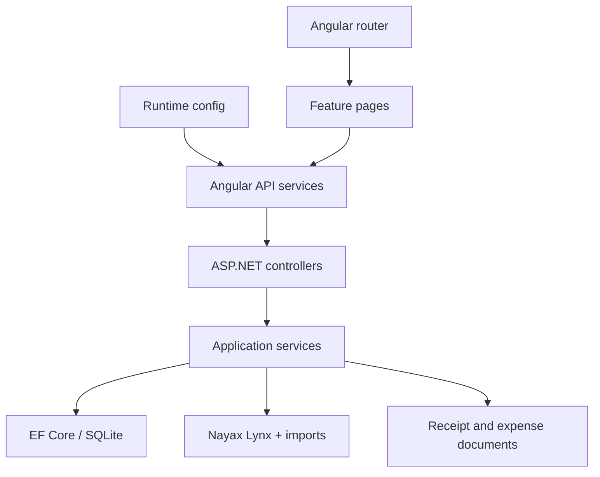
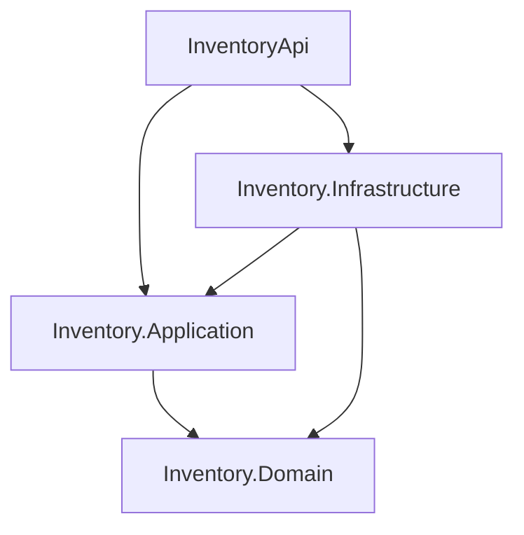
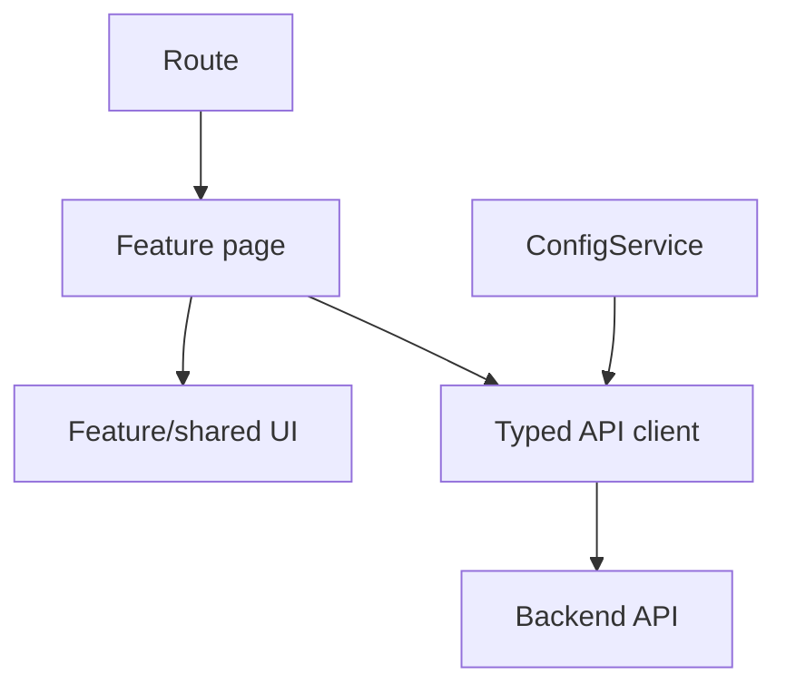
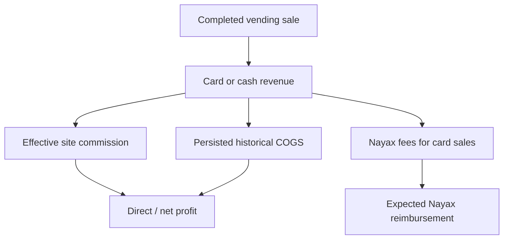

# InventoryApp architecture

## Purpose

InventoryApp is a modular full-stack application for operating a vending-machine business. It manages products, suppliers, purchasing documents, physical stock, supplier orders, machine replenishment, Nayax sales/imports, historical cost, fees, commissions, expenses, reconciliation, and management/accounting reports.

This document describes the repository at the `main` baseline inspected on 17 September 2026 and the intended incremental architecture. It is a guide for maintainers and coding agents; existing tests remain the executable specification.

## Runtime stack

| Area | Technology |
| --- | --- |
| Backend | ASP.NET Core Web API on .NET 10 |
| Persistence | EF Core 10, SQLite, code-first migrations |
| External integration | Nayax Lynx HTTP API and imported reimbursement/workbook data |
| Documents | Files beneath the API web root with metadata in SQLite |
| Frontend | Angular 19 standalone components, TypeScript, RxJS, Tailwind-based styling |
| Backend tests | xUnit, Moq, EF Core InMemory and SQLite |
| Hosting | Azure App Service API and Azure Static Web Apps frontend |
| Automation | GitHub Actions |

## Current repository structure

```text
InventoryApp/
├── backend/
│   ├── InventoryApi/
│   │   ├── Controllers/
│   │   ├── Data/
│   │   ├── DTOs/
│   │   ├── Integrations/Nayax/
│   │   ├── Migrations/
│   │   ├── Models/
│   │   ├── Services/
│   │   ├── Program.cs
│   │   └── InventoryApi.csproj
│   ├── Inventory.Domain/            NayaxFeeSettings rule, reporting policies/calculations (Inventory.Domain.Reporting.<Feature>), Purchases.PurchaseTotalValidationPolicy; other features not yet migrated
│   ├── Inventory.Application/       NayaxFeeSettings use cases/ports, reporting use cases/contracts (Inventory.Application.Reporting.<Feature>), Purchases.ComputePurchaseTotalValidation; other features not yet migrated
│   ├── Inventory.Infrastructure/    SystemClock adapter; other features not yet migrated
│   └── InventoryApi.Tests/
├── frontend/inventory-app/
│   ├── src/app/
│   │   ├── components/          Feature pages and shared UI
│   │   ├── models/              Shared TypeScript contracts
│   │   ├── services/            API clients and UI services
│   │   ├── app.config.ts        Angular providers and startup
│   │   └── app.routes.ts        Application routes
│   ├── src/assets/config.json       Runtime API configuration
│   ├── proxy.conf.json              Local API proxy
│   └── package.json
├── .github/workflows/
├── AGENTS.md
└── scripts/
```

The Angular application uses standalone components. `app.config.ts` registers the router, HTTP client, and a startup initializer that loads the API base URL. Routes currently load page components eagerly. Pages keep their own view state and call singleton services, which use `HttpClient` to reach the API.

The API's production dependency skeleton (`Inventory.Domain`, `Inventory.Application`, `Inventory.Infrastructure`) is wired into the `InventoryApi` composition root through `AddApplicationServices()`/`AddInfrastructureServices()` extension methods. The Nayax fee-settings slice (GET/POST `api/settings/nayax-processing-fee-rates`) is the first feature moved into this shape: `Inventory.Domain.NayaxFeeSettings.NayaxFeeRate` validates the configured rate, `Inventory.Application.NayaxFeeSettings` holds the `ListNayaxFeeRates`/`SaveNayaxFeeRate` use cases and the `INayaxFeeRateStore`/`IClock` ports, `Inventory.Infrastructure.Clock.SystemClock` implements `IClock`, and `SettingsController` only binds HTTP input and maps the use-case result. Because `AppDbContext` and its EF entities still live in `InventoryApi`, `INayaxFeeRateStore` is implemented by `InventoryApi.Adapters.Persistence.EfNayaxFeeRateStore` — a deliberately temporary API-owned adapter, registered directly in `Program.cs` rather than through `AddInfrastructureServices()`, so that `Inventory.Infrastructure` does not need to reference `InventoryApi`. It must move into `Inventory.Infrastructure` once `AppDbContext` and the shared persistence models relocate there. The bookkeeping report (GET `api/reports/bookkeeping`) is the second feature moved into this shape, following the same pattern: `Inventory.Domain.Reporting.Bookkeeping.BookkeepingProfitPolicy` computes profit/margin/GST/net-settlement from already-aggregated facts, `Inventory.Application.Reporting.Bookkeeping.GetBookkeepingReport` is the use case, `IBookkeepingReportFactsProvider` is its narrow port, and `InventoryApi.Adapters.Persistence.EfBookkeepingReportFactsProvider` is its temporary API-owned EF adapter (also composing the still-legacy `INayaxProcessingFeeService`/`ISiteCommissionService`). `ReportsController` calls `GetBookkeepingReport` directly for that endpoint; at that point in the migration, the legacy `ReportingService.GetBookkeepingAsync` delegated to the same use case so CSV/XLSX export and the GST report (which reuses bookkeeping's result) stayed on one authoritative implementation, until issue #92 removed `ReportingService` entirely (see below). The daily report (GET `api/reports/daily`) is the third feature moved into this shape, following the same pattern: `Inventory.Domain.Reporting.Daily.DailyRowPolicy` computes each day's profit/margin/reconciliation status from already-aggregated facts, reusing the shared `Inventory.Domain.Reporting.ReconciliationStatusPolicy` (placed there, alongside `ReportingCalculations`, so the still-legacy reconciliation report can reuse the same policy once it migrates instead of reimplementing it), `Inventory.Application.Reporting.Daily.GetDailyReport` is the use case, `IDailyReportFactsProvider` is its narrow port, and `InventoryApi.Adapters.Persistence.EfDailyReportFactsProvider` is its temporary API-owned EF adapter. Its completed-sale cost query and period-level imported-reimbursement summary are shared with `EfBookkeepingReportFactsProvider` through `InventoryApi.Adapters.Persistence.EfReportingSharedQueries` rather than duplicated a third time; its per-date reimbursement grouping is specific to daily and has no bookkeeping equivalent. `ReportsController` calls `GetDailyReport` directly for that endpoint; at that point in the migration, the legacy `ReportingService.GetDailyAsync` delegated to the same use case so CSV/XLSX export stayed on one authoritative implementation, until issue #92 removed `ReportingService` entirely (see below). The reconciliation report (GET `api/reports/reconciliation`) is the fourth feature moved into this shape, following the same pattern: `Inventory.Domain.Reporting.Reconciliation.ReconciliationPeriodPolicy` computes each period's (and the totals row's) gross/settlement difference and status from already-aggregated facts, reusing the shared `Inventory.Domain.Reporting.ReconciliationStatusPolicy` daily also calls, `Inventory.Application.Reporting.Reconciliation.GetReconciliationReport` is the use case, `IReconciliationReportFactsProvider` is its narrow port, and `InventoryApi.Adapters.Persistence.EfReconciliationReportFactsProvider` is its temporary API-owned EF adapter. Its completed and all-status sales queries are shared with `EfBookkeepingReportFactsProvider`/`EfDailyReportFactsProvider` through `EfReportingSharedQueries`; its per-reimbursement-period `Include` graph and card-gross fallback cascade are specific to reconciliation and have no bookkeeping or daily equivalent. `ReportsController` calls `GetReconciliationReport` directly for that endpoint; at that point in the migration, the legacy `ReportingService.GetReconciliationAsync` delegated to the same use case so CSV/XLSX export stayed on one authoritative implementation, until issue #92 removed `ReportingService` entirely (see below). The machine and product profitability reports (GET `api/reports/machine-profitability` and GET `api/reports/product-profitability`) are the fifth and sixth features moved into this shape, following the same pattern: `Inventory.Domain.Reporting.Profitability.ProfitabilityRowPolicy` computes the per-machine/per-product cost/gross-profit/margin gate shared by both reports, and `Inventory.Domain.Reporting.Profitability.MachineDirectProfitPolicy` computes machine profitability's direct-profit completeness rule (COGS complete, no missing Nayax fee rates, complete commission coverage), reusing the shared `ReportingCalculations`. `Inventory.Application.Reporting.MachineProfitability.GetMachineProfitabilityReport` and `Inventory.Application.Reporting.ProductProfitability.GetProductProfitabilityReport` are the use cases; `IMachineProfitabilityReportFactsProvider`/`IProductProfitabilityReportFactsProvider` are their narrow ports; `InventoryApi.Adapters.Persistence.EfMachineProfitabilityReportFactsProvider`/`EfProductProfitabilityReportFactsProvider` are their temporary API-owned EF adapters, reusing `EfReportingSharedQueries`' completed-sale query. The machine profitability adapter also composes the still-legacy `INayaxProcessingFeeService`/`ISiteCommissionService`; its site-commission resolution is shared with `EfBookkeepingReportFactsProvider` through `EfReportingSharedQueries.GetMachineCommissionsAsync`/`GetSiteCommissionAsync` rather than duplicated a third time, while its per-machine operating-expense breakdown has no equivalent in the already-migrated adapters and stayed local. Nayax product matching (`NayaxProductMatcher`, previously `InventoryApi.Services.NayaxProductMatcher` only) is deterministic Domain business logic and moved to `Inventory.Domain.Reporting.ProductMatching.ProductMatcher`, operating on a Domain-owned `ProductMatchCandidate(Id, Name)` rather than the persistence `Product` entity; the product profitability use case calls it directly on its own catalogue projection, and the EF adapter never calls it (matching stays out of the persistence adapter). `InventoryApi.Services.NayaxProductMatcher` (used by machine service, sale costing, inventory cost rebuild, import, and site commissions — outside this migration's scope) became a thin wrapper delegating to the same Domain implementation, so both stay on one authoritative matching algorithm instead of two. `ReportsController` calls `GetMachineProfitabilityReport`/`GetProductProfitabilityReport` directly for those endpoints; at that point in the migration, the legacy `ReportingService.GetMachineProfitabilityAsync`/`GetProductProfitabilityAsync` delegated to the same use cases so CSV/XLSX export and the dashboard report (which reuses product profitability's result) stayed on one authoritative implementation, until issue #92 removed `ReportingService` entirely (see below). GST, dashboard, and transactions have since moved too (see the reporting migration track below); every individual report family has migrated, and issue #92 completed the final shared-query audit: it found no further duplication to consolidate (every already-migrated adapter already shared what could be shared through `EfReportingSharedQueries`) and removed the legacy `InventoryApi.Services.ReportingService`/`IReportingService`. `Inventory.Application.Reporting.Export.GetReportExportRows` is now the one authoritative export-row-building step for every report, called directly by `ReportsController`'s single export endpoint; `InventoryApi.Adapters.Export.ReportExportFileWriter` is its only remaining CSV/XLSX byte-encoding adapter (ClosedXML stays out of Application). Every other feature implementation still lives in `InventoryApi`: controllers generally call service interfaces, while services use `AppDbContext` and, where required, Nayax or filesystem facilities. `Program.cs` is the composition root and applies EF Core migrations at startup.



## Current strengths

- Most feature controllers already depend on service interfaces.
- The backend has meaningful tests for products, stock, purchases, supplier orders, costing, imports, fees, commissions, machine profitability, reporting, and migrations.
- Nayax transaction status and payment-method classification are centralized.
- Historical sale cost and its provenance are persisted.
- Reconciliation and incomplete-data states are represented explicitly.
- The frontend has a centralized runtime API configuration, typed services, reusable report-page behavior, and shared toast/confirmation UI.
- Standalone Angular components keep feature code independent of NgModule structure.
- Backend CI restores, builds, and tests before a `main` deployment.

## Current pressure points

- HTTP, use cases, domain calculations, EF Core, Nayax, file storage, and export generation live in one project for every feature area still pending migration (purchases, machine services, inventory-cost transition, and the remaining direct-`AppDbContext` controllers/services). Reporting is no longer part of this pressure point: its use cases live in `Inventory.Application.Reporting.<Feature>` and its calculations in `Inventory.Domain.Reporting.<Feature>`; only its temporary EF/Nayax adapters, HTTP controller, and CSV/XLSX byte encoding remain in `InventoryApi`. `Purchases.PurchaseTotalValidationPolicy`/`ComputePurchaseTotalValidation` are the first pieces of the purchase slice to move out (see the [Purchase rename plan](#purchase-rename-plan)); the purchase upload/update/delete orchestration itself is still in `InventoryApi`.
- `PurchaseService`, the machine services, and the inventory-cost-transition services each combine orchestration and persistence, and are large.
- Operating-expense and site-commission controllers directly access `AppDbContext`; operating expenses also manipulate files. Fee-setting no longer does (see the Nayax fee-settings slice above), except through its temporary API-owned persistence adapter.
- `Product` contains persistence state, business calculations, and transient Nayax/UI fields.
- Several tests use EF Core InMemory where SQLite behavior may be more representative.
- All frontend routes are eager-loaded, and route definitions directly import every page component.
- Frontend contracts are split between a broad `models.ts` file and service-local report interfaces. `reporting.service.ts` is already a large multi-report API client.
- Some page components, especially administration and reporting pages, contain substantial orchestration and presentation logic.
- Report state is locally managed, but date-range logic and financial formatting can accidentally erase `null`/unknown meaning if reused without care.
- The frontend package has no automated test or lint command; its current validation gate is a production build.
- Branch protection and required-check configuration live in GitHub repository settings and must be enabled separately from source-controlled workflows.

These are reasons to improve boundaries, not reasons for a wholesale rewrite.

## Backend target: pragmatic Clean Architecture with vertical slices

The application remains a single deployable modular monolith. The intended projects are:

```text
backend/
├── InventoryApi/                    HTTP host and composition root
├── Inventory.Application/          Feature use cases and external ports
├── Inventory.Domain/               Business rules and domain types
├── Inventory.Infrastructure/       EF, Nayax, files, imports, exports
├── Inventory.UnitTests/            Pure domain/application tests
└── Inventory.IntegrationTests/     Database, API and adapter tests
```



### Inventory.Domain

Contains stable business language and deterministic rules:

- Products, reorder policy and inventory movements.
- Costing quantity/value and weighted-average calculations.
- Sale-cost status/source and costing results.
- Commission agreement semantics and calculations.
- Financial-year/date-range value types where appropriate.
- Pure reporting calculations such as GST extraction, gross profit, and margins.

It must not reference ASP.NET Core, EF Core, HTTP, filesystem APIs, ClosedXML, configuration, or concrete Nayax clients.

### Inventory.Application

Contains use cases grouped by feature, request/response contracts, validation, orchestration, and narrow ports:

```text
Inventory.Application/
├── Products/
├── Stock/
├── Purchases/
├── SupplierOrders/
├── Expenses/
├── Commissions/
├── Imports/
└── Reporting/
```

Examples include `CreateOperatingExpense`, `RecordCommissionPayment`, `ImportNayaxSales`, `GetBookkeepingReport`, `RebuildHistoricalCosts`, and `ComputePurchaseTotalValidation`.

Application code determines what must happen. It does not know the physical database, file path, HTTP endpoint, or spreadsheet library used to make it happen.

### Inventory.Infrastructure

Contains adapters and technical implementation:

- `AppDbContext`, entity configurations, migrations, and repositories/read stores.
- Nayax Lynx HTTP client and imported-file parsers.
- Document storage for receipts and operating expenses.
- CSV/XLSX report exporters.
- Clock/timezone adapter if introduced.

Use narrow feature-specific ports. A generic repository that leaks persistence semantics into every feature is not a goal.

### InventoryApi

Contains:

- Controllers and HTTP-specific models.
- Authentication/authorization and middleware.
- OpenAPI configuration.
- Dependency injection and application startup.
- HTTP error/result mapping.

Controllers do not implement accounting, inventory, persistence, or filesystem rules.

### API documentation policy

`Swashbuckle.AspNetCore` (`AddSwaggerGen`/`UseSwagger`/`UseSwaggerUI` in `Program.cs`) is intentionally retained to give local developers an interactive view of the API surface. It is registered only behind `app.Environment.IsDevelopment()`, so it never runs, and never exposes `/swagger`, outside the Development environment; its `SwaggerDoc` metadata carries only a title, version, and description, with no authentication scheme or configuration values. `dotnet-tools.json` keeps the matching `swashbuckle.aspnetcore.cli` local tool so a developer can export `swagger.json` manually with `dotnet swagger tofile` if needed.

No generated OpenAPI client is adopted (see [Runtime configuration and API contracts](#runtime-configuration-and-api-contracts)): the frontend uses manually maintained TypeScript contracts, and no `nswag.json` or `OpenApiReference` item exists anywhere in the repository. `Microsoft.Extensions.ApiDescription.Client` and `NSwag.ApiDescription.Client` were unused package references with no consumer and have been removed; re-add them only alongside an issue that deliberately adopts a generated client.

### External integration errors

External service failures are represented by a typed integration exception rather than by a raw transport exception or a silently empty result. `NayaxLynxClient` validates every Nayax response in one place and throws `NayaxUpstreamException`, which carries only the operation name, HTTP method, relative endpoint, and upstream status code.

The HTTP boundary maps that exception centrally. `NayaxUpstreamExceptionHandler` is an `IExceptionHandler` registered with `AddProblemDetails()` and `UseExceptionHandler()`; it returns `502 Bad Gateway` as `application/problem+json` with the current trace ID, and returns `false` for every other exception so unrelated failures keep their normal pipeline behaviour. Controllers and services do not catch Nayax transport errors individually.

Tokens, authorization headers, and raw upstream response bodies must never be logged or returned. A failed call logs the operation, method, endpoint, and numeric upstream status only; the public response carries a fixed title and detail and no exception information. An upstream failure must never be disguised as an empty collection, and caller cancellation must stay cancellation rather than becoming a `502`.

## Frontend architecture

The frontend is an application boundary in its own right. It owns navigation, interaction state, accessibility, presentation, and communication with the API. It does not own inventory or accounting truth.

### Current composition

| Area | Current responsibility |
| --- | --- |
| `app.component.*` | Application shell, primary navigation, report menu, router outlet, and toast host |
| `app.routes.ts` | Product, stock, supplier, machine, site, purchase, report, expense, and administration routes |
| `components/` | Routed feature pages plus a small set of shared components |
| `services/` | Typed HTTP calls, runtime configuration, toast state, and feature-specific client behavior |
| `models/models.ts` | Shared inventory, purchase, site, and machine contracts |
| Report base/classes | Common report filters, loading/error state, financial-year presets, and export behavior |
| `assets/config.json` | Deploy-time API base URL loaded before the application starts |

The application currently uses component-local state and RxJS-backed singleton services. That is appropriate for its present size. Do not introduce a global state library merely to reorganize files. Add one only when there is demonstrated cross-feature state, cache invalidation, or event-coordination complexity that local state and focused services cannot handle clearly.



### Target feature boundaries

Keep Angular standalone and migrate incrementally toward feature-local code:

```text
src/app/
├── core/
│   ├── config/                    Runtime configuration
│   └── http/                      Cross-cutting HTTP concerns only
├── layout/                            Application shell and navigation
├── shared/
│   ├── ui/                        Reusable presentation components
│   └── formatting/                Presentation-only helpers
├── features/
│   ├── products/
│   │   ├── pages/
│   │   ├── components/
│   │   ├── data-access/
│   │   └── models/
│   ├── stock/
│   ├── purchases/
│   ├── machines/
│   ├── sites/
│   ├── expenses/
│   ├── admin/
│   └── reports/
│       ├── shared/                Filters and report-page behavior
│       ├── bookkeeping/
│       ├── reconciliation/
│       └── profitability/
├── app.config.ts
└── app.routes.ts
```

This is a direction, not a required big-bang move. Move a feature when it is being changed, keep each move behavior-preserving, and avoid empty abstraction folders.

Use these ownership rules:

- **Pages** read route/query parameters, coordinate loading and mutation state, and compose the view.
- **Presentational components** receive typed inputs and emit user intent. They do not fetch unrelated application data.
- **Feature data-access services** own HTTP calls and transport mapping for one feature. They do not calculate financial results already supplied by the API.
- **Feature models** describe API contracts and view-specific types for that feature. Promote a type to `shared` only when multiple features genuinely use the same meaning.
- **Core services** are limited to application-wide infrastructure such as configuration and HTTP concerns. `core` is not a home for miscellaneous business logic.
- **The backend** remains authoritative for stock transitions, historical COGS, fees, commissions, reconciliation, and report calculations.

### Routing and loading

Routes are currently declared centrally and import every routed component eagerly. Preserve route URLs, but convert top-level features to `loadComponent` or feature route files as those areas are migrated. This keeps initial bundles smaller and creates an enforceable feature boundary without introducing NgModules.

The static host must rewrite unknown application paths to `index.html`; otherwise refreshing a deep link such as `/reports/bookkeeping` will bypass Angular and return a host-level 404. API paths must remain excluded from that fallback where the hosting topology requires it.

### Runtime configuration and API contracts

`ConfigService` loads `/assets/config.json` through an application initializer before feature services issue requests and falls back to `/api` if that load fails. `proxy.conf.json` forwards `/api` to `http://localhost:5000/` for local development; a deployed static config can provide the hosted API base URL. Do not hard-code API hosts in components or feature services.

Backend contract changes are full-stack changes. When an endpoint changes:

1. update the backend request/response DTO and its tests;
2. update the matching frontend type and feature client;
3. preserve optionality and `null` explicitly rather than coercing missing financial data to zero;
4. update the page, exports, and error/empty states that consume the contract;
5. verify both the API tests and Angular production build.

Until a generated OpenAPI client is deliberately adopted, keep manually maintained TypeScript contracts close to their feature client. Do not introduce a generated client incidentally in an unrelated feature.

### Financial presentation rules

The UI may format and explain backend results, but it must not recreate authoritative accounting formulas. In particular:

- Display sales, fees, commission, COGS, and profit values returned by the API.
- Preserve quality/status fields so partial, estimated, unmatched, or uncosted results remain visible.
- Use an unavailable/unknown presentation for nullable COGS or profit. A generic formatter that turns `null` into `$0.00` is unsafe for these fields.
- Keep card and cash amounts visibly distinct where settlement is discussed.
- Keep ex-GST, GST, and GST-inclusive fee amounts distinct.
- Send explicit inclusive date filters. Business-period interpretation remains based on `Australia/Sydney`, not the browser's accidental timezone.
- Keep on-screen reports and downloaded exports aligned to the same backend calculation path.

### Interaction and presentation

Every routed page should provide intentional loading, empty, error, and success states. Use shared toast notifications for transient mutation outcomes and inline errors when a report or form cannot be understood without the message. Confirm destructive actions and keep server validation details available to the user without exposing stack traces.

New UI must remain keyboard-operable, associate labels with controls, expose meaningful button/link names, and not rely on color alone for reconciliation or quality status.

Tailwind classes in templates, `src/styles.scss`, and component styles are the styling sources. `npm run build:styles` generates `src/styles.css` before Angular builds, so do not make a manual fix only in the generated CSS. Keep production bundle and component-style budgets in `angular.json` passing.

## Domain model and financial boundaries

### Sales and settlement

The application models distinct flows:



Gross sales and Nayax reimbursement are not interchangeable. Cash is business revenue but is outside the Nayax cashless settlement. Reimbursement reconciliation uses the covered transaction period rather than payout date. The accepted monetary tolerance is `$0.01`.

Nayax fee data is effective-dated and has two sources:

1. imported reimbursement fees, authoritative for covered dates;
2. configured fee-rate estimates for uncovered completed card transactions.

The sources must not overlap for the same day. Ex-GST, GST, and GST-inclusive amounts remain separate.

Site commissions use effective-dated agreements and one of three bases: gross sales, card sales, or sales excluding GST. Missing coverage and overlaps remain visible quality/configuration failures. The absence of any agreement for a site is a valid zero-commission state.

### Historical inventory cost

Physical storage stock and costing inventory answer different questions:

- `QuantityInStock`: stock physically held in storage/home and available to refill machines.
- `CostingQuantity`: total business-owned quantity still carrying inventory value.
- `InventoryValue`: remaining value used with `CostingQuantity` to derive AVCO.

A machine refill is an internal location transfer: it changes physical storage but does not consume business inventory value or create COGS. Completed sales and explicit cost-bearing write-offs consume costing inventory.

Historical sale cost precedence is:

1. persisted internal AVCO/ledger cost when reliable;
2. transaction-level Nayax Product Cost Price captured on that sale;
3. uncosted/unknown.

Current product cost and selling price are never substitutes for historical cost. Reports preserve partial COGS and quality counts and do not turn missing cost into zero.

### Profit levels

- Gross profit requires complete COGS and equals sales minus COGS.
- Direct profit also subtracts Nayax fees including GST, site commission, and directly attributable operating expenses.
- Whole-business net profit also includes shared costs such as receipt delivery/package costs and unallocated operating expenses.
- A machine-filtered view must not claim whole-business net profit when shared overhead has no allocation rule.

All report, dashboard, transaction-detail, CSV, and XLSX paths must call the same authoritative calculations.

### Time

- Australian financial year: 1 July to 30 June.
- Report date ranges are inclusive.
- Sale/authorization, reimbursement coverage, import, and payout dates are separate concepts.
- Business reporting timezone: `Australia/Sydney`.

Timezone migration is not part of an incidental feature. Changes require explicit boundary and daylight-saving tests.

## Data flow

### Product purchase and restock

1. A purchase and its purchase items record the source purchase.
2. Purchase-linked restock movements add physical and costing inventory at purchase cost.
3. Delivery/package amounts remain identifiable for whole-business reporting.
4. Supplier-order allocations are reconciled without fabricating purchase quantities.

#### Purchase rename plan

The canonical internal business term is now **Purchase**/**PurchaseItem**, not Receipt/ReceiptItem
(issue #60). The rename touched entity/service/component/DTO naming and the corresponding source file
names only; purchase accounting/inventory behaviour, the database schema, and the API/route contract
are unchanged (verified with `dotnet ef migrations has-pending-model-changes`, which reports no
pending changes).

The source files were renamed with `git mv` alongside their identifiers, so file names and type names
now agree:

| Renamed from | Renamed to |
| --- | --- |
| `backend/InventoryApi/Models/Receipt.cs` | `backend/InventoryApi/Models/Purchase.cs` |
| `backend/InventoryApi/Models/ReceiptItem.cs` | `backend/InventoryApi/Models/PurchaseItem.cs` |
| `backend/InventoryApi/Services/Interfaces/IReceiptService.cs` | `backend/InventoryApi/Services/Interfaces/IPurchaseService.cs` |
| `backend/InventoryApi/Services/ReceiptService.cs` | `backend/InventoryApi/Services/PurchaseService.cs` |
| `backend/InventoryApi/Controllers/ReceiptsController.cs` | `backend/InventoryApi/Controllers/PurchasesController.cs` |
| `backend/InventoryApi.Tests/Services/ReceiptServiceTests.cs` | `backend/InventoryApi.Tests/Services/PurchaseServiceTests.cs` |
| `frontend/.../services/receipt.service.ts` | `frontend/.../services/purchase.service.ts` |
| `frontend/.../components/receipts/` | `frontend/.../components/purchases/` |
| `frontend/.../components/purchases/receipt-list.component.{ts,html}` | `.../purchase-list.component.{ts,html}` |
| `frontend/.../components/purchases/receipt-upload.component.{ts,html}` | `.../purchase-upload.component.{ts,html}` |

The `wwwroot/receipts` upload folder, the database tables and migration history, and the
`/api/receipts` route are *not* file renames and deliberately keep their names; see the compatibility
table below.

##### OpenAPI compatibility

Swashbuckle derives schema ids from CLR type names and operation tags from controller names, so the
rename would otherwise have republished the document's `Receipt`, `ReceiptItem`, `ReceiptResponseDto`
and `ReceiptValidationDto` schemas and its `Receipts` tag under new `Purchase*` names — a breaking
change for generated clients even though the routes and JSON keys are identical.
`InventoryApi.Swagger.LegacyOpenApiCompatibility` is the compatibility boundary that prevents this: it
maps the renamed CLR types back to their published schema ids and pins `PurchasesController`'s
operations to the legacy `Receipts` tag, deferring to Swashbuckle's defaults for everything else. It
is registered through `SwaggerServiceCollectionExtensions.AddInventoryApiSwagger`, the single
registration shared by `Program.cs` and the contract tests, and is covered by
`InventoryApi.Tests.Swagger.LegacyOpenApiContractTests` (schema ids, tag, and the schemas the purchase
operations reference) and `InventoryApi.Tests.Controllers.PurchasesControllerRouteTests` (the effective
`api/receipts` base route and its GET/POST/PUT/DELETE/file endpoints, read from the MVC API explorer).

| Layer | Renamed to Purchase language | Left as a legacy/compatibility surface | Why |
| --- | --- | --- | --- |
| `Inventory.Domain` | `Purchases.PurchaseTotalValidationPolicy` (new) | — | New pure calculation; the one authoritative total-mismatch formula. |
| `Inventory.Application` | `Purchases.ComputePurchaseTotalValidation` (new) | — | Thin use case wrapping the Domain policy; `InventoryApi.Services.PurchaseService` calls it instead of duplicating the formula. |
| `InventoryApi.Models` | CLR types and files `Purchase.cs`, `PurchaseItem.cs` | DbSet properties `Receipts`/`ReceiptItems`, table names `Receipts`/`ReceiptItems` (now mapped explicitly with `ToTable`), `PurchaseItem.ReceiptId` column/property, `StockAdjustment.ReceiptItemId`/`ReceiptItem`, `SupplierOrderReceiptAllocation` (type and its `ReceiptItemId`/`ReceiptItem` members) | Schema/migration history must not change; `ReceiptId` and the `StockAdjustment`/`SupplierOrderReceiptAllocation` members are part of the JSON contract or are out of this issue's scope (supplier-order/stock-ledger naming belongs to the full slice above). |
| `InventoryApi.Services` | `PurchaseService : IPurchaseService` (files `PurchaseService.cs`/`IPurchaseService.cs`) | Physical upload folder stays `wwwroot/receipts` | Already-uploaded purchase document scans must stay reachable at their stored path. |
| `InventoryApi.Controllers` | `PurchasesController` (file `PurchasesController.cs`), explicit `[Route("api/receipts")]` | Route `api/receipts`, and the `Receipts` OpenAPI tag via `LegacyOpenApiCompatibility` | Preserves the existing, bookmarked API route (acceptance criterion). |
| `InventoryApi.DTOs` | `PurchaseItemDto`, `PurchaseCreateMetaDto`, `PurchaseValidationDto`, `PurchaseResponseDto` | `PurchaseResponseDto`'s `Receipt`/`Validation` property names (JSON keys `receipt`/`validation`), and the published OpenAPI schema ids `Receipt`/`ReceiptItem`/`ReceiptItemDto`/`ReceiptCreateMetaDto`/`ReceiptValidationDto`/`ReceiptResponseDto` | JSON property names and schema ids are part of the public API contract; only the CLR type names changed. |
| Frontend `models.ts`/`purchase.service.ts` | `Purchase`, `PurchaseItem`, `PurchaseValidation`, `PurchaseResponse`, `PurchaseService`, `PurchaseUploadPayload`/`PurchaseItemPayload`/`PurchaseUpdatePayload` (files `purchase.service.ts`, `components/purchases/purchase-{list,upload}.component.{ts,html}`) | JSON-bound fields `receipt`/`receiptId` | Matches the backend JSON contract above. |
| Frontend routing | Primary route `/purchases` (and `/purchases/new`) | `/receipts` and `/receipts/new` redirect to the new paths | Keeps existing bookmarks/links working while the URL bar now matches the "Purchases" nav label. |
| Supporting documents | Not renamed: `Purchase.FileName`/`StoredFileName`/`ContentType`/`FileSizeBytes`, the "Receipt or invoice" upload copy, `OperatingExpense` receipt-attachment naming | — | A purchase's attached scan/photo, and an operating expense's attachment, are supporting *documents*, a distinct concept from the Purchase business record (acceptance criterion). |

Out of scope for this rename (per issue #60): changing purchase accounting/inventory behaviour, the
purchase GST/BAS model, and any destructive migration/table rename. The compatibility surfaces listed
above are deliberate and stay as they are; renaming any of them would be a schema or public-contract
change needing its own issue, ideally combined with the rest of the Purchasing and costing slice
(item 6 above).

### Machine refill

1. A refill moves units out of storage.
2. The movement is linked to the machine when known.
3. It does not create an expense or COGS and does not reduce costing inventory/value.

### Sale import and costing

1. Imported transaction facts are persisted using the Nayax transaction identity.
2. Status and payment type are classified centrally.
3. Only completed sales enter sales/profit calculations.
4. Historical cost is persisted on each sale with its status and source.
5. Unknown products, statuses, payment methods, or missing costs remain visible.

### Reimbursement import and reconciliation

1. Preserve imported period, gross, device, fee, GST, adjustment, and net facts.
2. Match completed card sales within the reimbursement coverage period.
3. Compare both gross/count and expected/actual settlement.
4. Mark reconciled only within the `$0.01` tolerance.
5. Surface pending, unmatched, partial, unknown, or unsupported data.

## Incremental migration plan

Each step is a separate, passing pull request. Existing endpoints stay operational throughout.

Backend and frontend tracks can progress independently when their contracts do not change. A vertical feature change that touches both sides should still be delivered as one coherent, tested pull request.

### Backend migration track

1. **Safety baseline**
   - Add repository instructions, architecture documentation, and cross-platform validation scripts.
   - Correct documentation/CI drift in focused follow-up changes.

2. **Project skeleton** — done.
   - Added `Inventory.Domain`, `Inventory.Application`, and `Inventory.Infrastructure` projects, the allowed reference directions, no-op dependency-registration extensions wired into `InventoryApi`, and architecture tests that fail on a prohibited reverse dependency.
   - No feature was moved; every controller, service, model, and adapter still lives in `InventoryApi`.

3. **Nayax fee settings slice** — done.
   - Moved validation and use cases out of `SettingsController` into `Inventory.Domain.NayaxFeeSettings`/`Inventory.Application.NayaxFeeSettings`.
   - Proved the persistence port (`INayaxFeeRateStore`), a temporary API-owned EF adapter (`InventoryApi.Adapters.Persistence.EfNayaxFeeRateStore`), result mapping, DI registration, and the unit/Application/SQLite/API test pattern this migration will reuse.
   - The EF adapter remains temporarily in `InventoryApi` until `AppDbContext` and its persistence models move into `Inventory.Infrastructure`.

4. **Operating expenses slice**
   - Extract use cases, persistence, and `IDocumentStorage`.
   - Preserve atomic replacement/cleanup and upload validation behavior.

5. **Products and stock slice**
   - Move reorder and inventory-movement rules to Domain.
   - Preserve supplier-order projection and low-stock semantics.

6. **Purchasing and costing slice**
   - Migrate purchases, supplier orders, stock ledger, AVCO, rebuilding, and sale costing as one coherent area.
   - **Receipt-to-Purchase internal rename done** (issue #60), ahead of the full slice migration above. See
     [Purchase rename plan](#purchase-rename-plan) for the entity/service/component/DTO and source-file
     renames, the OpenAPI compatibility boundary, and the compatibility surfaces intentionally left on
     their legacy names. The rest of this slice — moving the purchase upload/update/delete orchestration
     itself, and the supplier-order/stock-ledger/AVCO code it touches, into
     `Inventory.Application`/`Inventory.Infrastructure` — remains future work.

7. **Reporting slices**
   - Split bookkeeping, daily, reconciliation, machine/product profitability, GST, dashboard, and transactions into separate query handlers.
   - Split CSV/XLSX formatting from report calculation.
   - **Contract placement done.** Report request/result contracts moved from `InventoryApi/DTOs/ReportingDtos.cs` into `Inventory.Application.Reporting.<Feature>` namespaces (`Shared`, `Bookkeeping`, `Daily`, `Reconciliation`, `MachineProfitability`, `ProductProfitability`, `Gst`, `Dashboard`, `Transactions`), with no JSON/API contract change.
   - **Bookkeeping slice done** (issue #43). `GetBookkeepingReport` (`Inventory.Application.Reporting.Bookkeeping`) and `BookkeepingProfitPolicy` (`Inventory.Domain.Reporting.Bookkeeping`) are the one authoritative implementation for `GET api/reports/bookkeeping`, its CSV/XLSX export, and the GST report that reuses its result. `ReportingCalculations`, `AustralianFyHelper`/`AustralianFinancialYear`, `ReportingRangeResolver`, and `ReportingQuality` moved to `Inventory.Domain.Reporting`/`Inventory.Application.Reporting.Shared` as the shared formulas every report family — migrated or not — now calls, so there is still exactly one implementation of each.
   - **Daily slice done** (issue #86). `GetDailyReport` (`Inventory.Application.Reporting.Daily`) and `DailyRowPolicy` (`Inventory.Domain.Reporting.Daily`) are the one authoritative implementation for `GET api/reports/daily` and its CSV/XLSX export. `ReconciliationStatusPolicy` moved to `Inventory.Domain.Reporting`, alongside `ReportingCalculations`, as the one reconciliation-status formula daily now calls; the reconciliation slice reuses the same policy instead of its own copy. `EfDailyReportFactsProvider`'s completed-sale cost query and period-level imported-reimbursement summary are shared with `EfBookkeepingReportFactsProvider` through `EfReportingSharedQueries` rather than duplicated a third time.
   - **Reconciliation slice done** (issue #87). `GetReconciliationReport` (`Inventory.Application.Reporting.Reconciliation`) and `ReconciliationPeriodPolicy` (`Inventory.Domain.Reporting.Reconciliation`) are the one authoritative implementation for `GET api/reports/reconciliation` and its CSV/XLSX export, for both individual period rows and the totals row (the totals row reuses the same policy over summed period facts rather than a second aggregation formula, since the underlying difference/expected-net formulas are linear). `ReconciliationPeriodPolicy` reuses the shared `Inventory.Domain.Reporting.ReconciliationStatusPolicy` daily also calls for the tolerance/pending/warning classification; its `OverallStatus` rollup of the independent gross and settlement statuses is reconciliation-specific and has no daily equivalent, so it was added alongside rather than folded into the shared policy. `IReconciliationReportFactsProvider` is its narrow port, and `EfReconciliationReportFactsProvider` is its temporary API-owned EF adapter, reusing `EfReportingSharedQueries`' completed and all-status sales queries; its per-reimbursement-period `Include` graph and card-gross fallback cascade (device payments, then account-level payment methods, then device gross, then the reimbursement total) are specific to reconciliation and stayed local to the adapter.
   - **Machine/product profitability slice done** (issue #88). `GetMachineProfitabilityReport`/`GetProductProfitabilityReport` (`Inventory.Application.Reporting.MachineProfitability`/`ProductProfitability`) are the one authoritative implementation for `GET api/reports/machine-profitability` and `GET api/reports/product-profitability` and their CSV/XLSX exports (and for the dashboard report, which reuses product profitability's result). `ProfitabilityRowPolicy` (`Inventory.Domain.Reporting.Profitability`) is the shared per-machine/per-product cost/gross-profit/margin gate both reports call; `MachineDirectProfitPolicy` is machine profitability's own completeness/direct-profit rule (COGS complete, no missing Nayax fee rates, complete commission coverage), mirroring `BookkeepingProfitPolicy`'s machine-filtered branch. `IMachineProfitabilityReportFactsProvider`/`IProductProfitabilityReportFactsProvider` are their narrow ports, and `EfMachineProfitabilityReportFactsProvider`/`EfProductProfitabilityReportFactsProvider` are their temporary API-owned EF adapters, reusing `EfReportingSharedQueries`' completed-sale query; the machine adapter also reuses `EfReportingSharedQueries.GetMachineCommissionsAsync`/`GetSiteCommissionAsync` (moved there from `EfBookkeepingReportFactsProvider`, which now calls the shared version too) rather than duplicating commission resolution a third time. Nayax product matching moved to `Inventory.Domain.Reporting.ProductMatching.ProductMatcher`, a pure algorithm over a Domain-owned `ProductMatchCandidate` rather than the persistence `Product` entity; the product profitability use case calls it directly, never the EF adapter. `InventoryApi.Services.NayaxProductMatcher`, still used by machine service, sale costing, inventory cost rebuild, import, and site commissions (outside this migration's scope), became a thin wrapper delegating to the same Domain implementation instead of a second copy of the algorithm. Dashboard and transactions have since moved too (see below); each was tracked as its own follow-up issue.
   - **GST accounting-aid slice done** (issue #89). `GetGstAccountingAid` (`Inventory.Application.Reporting.Gst`) is the one authoritative implementation for `GET api/reports/gst` and its CSV/XLSX export. It depends on the already-migrated bookkeeping use case through the Application-owned `IGetBookkeepingReport` interface (implemented by `GetBookkeepingReport`) and reuses its GST-on-sales/GST-on-fees figures rather than re-deriving them; `GstAccountingAidPolicy` (`Inventory.Domain.Reporting.Gst`) derives taxable sales, taxable fees, and net GST from those figures. `IGstReportFactsProvider` is its narrow port for the imported-summary data-quality flags (whether any imported rows and any GST/VAT classification cover the period) this report still needs, and `EfGstReportFactsProvider` is its temporary API-owned EF adapter, reusing `EfReportingSharedQueries.ImportedSummaryAsync` rather than duplicating the imported-summary query a further time. At that point in the migration, `ReportingService.GetGstAsync` was a thin delegator to `GetGstAccountingAid`, not a second implementation, until issue #92 later removed `ReportingService` entirely (see below).
   - **Dashboard slice done** (issue #90). `GetDashboardReport` (`Inventory.Application.Reporting.Dashboard`) is the one authoritative implementation for `GET api/reports/dashboard` and its CSV/XLSX export. It depends on the already-migrated bookkeeping and product profitability use cases through the Application-owned `IGetBookkeepingReport`/`IGetProductProfitabilityReport` interfaces (implemented by `GetBookkeepingReport`/`GetProductProfitabilityReport`) and reuses their sales, profit, fee, commission, operating-expense, and unmapped-product figures rather than re-deriving them; only the dashboard-specific reimbursement reconciliation is computed independently. `DashboardReimbursementPolicy` (`Inventory.Domain.Reporting.Dashboard`) derives the expected-versus-actual Nayax reimbursement difference and its "Pending"/"Reconciled"/"Needs Review" status from card sales, fees, and the imported net settlement; it reuses the shared `Inventory.Domain.Reporting.ReconciliationStatusPolicy` tolerance check the daily/reconciliation slices also call, but keeps its own three-state status vocabulary locally because it has no separate "Warning" state. `IDashboardReportFactsProvider` is its narrow port for the summary facts unique to the dashboard (completed-sale transaction/machine/product counts, the imported reimbursement facts, and commission completeness/warnings for its own data-quality notes), and `EfDashboardReportFactsProvider` is its temporary API-owned EF adapter, reusing `EfReportingSharedQueries`' completed-sale query, imported-summary query, and site-commission resolution rather than duplicating them a further time. `ReportsController` calls `GetDashboardReport` directly for that endpoint; at that point in the migration, the legacy `ReportingService.GetDashboardAsync` delegated to the same use case, and the `INayaxProcessingFeeService`/`ISiteCommissionService` dependencies it only needed for that orchestration were removed from `ReportingService`, so CSV/XLSX export stayed on one authoritative implementation, until issue #92 removed `ReportingService` entirely (see below).
   - **Transaction sales slice done** (issue #91), the last individual report family. `GetTransactionSalesReport` (`Inventory.Application.Reporting.Transactions`) is the one authoritative implementation for `GET api/reports/transactions` and its CSV/XLSX export, including the unpaginated export case. `Inventory.Domain.Reporting.Transactions.TransactionRowPolicy` derives each transaction's estimated Nayax fee (effective-dated rate lookup, unavailable when none covers the sale date) and site commission (effective-dated agreement lookup, unavailable when none covers the sale, overlapping when more than one does) and its resulting gross/direct profit, reusing the shared `ReportingCalculations`; `TransactionTotalsPolicy` aggregates those per-row results into the report totals. These per-transaction rules are deliberately separate from (not merged into) the aggregate bookkeeping/machine-profitability commission-completeness rules, since row-level and period-level coverage semantics differ. `Inventory.Application.Reporting.Transactions.GetTransactionSalesReport` resolves the requested date range/machine scope, retrieves facts through the narrow `ITransactionSalesReportFactsProvider` port, matches each raw Nayax product identifier/name to the catalogue through the shared `Inventory.Domain.Reporting.ProductMatching.ProductMatcher` (the same algorithm the product profitability slice uses), invokes the Domain row/totals policies, then applies status/payment/COGS/search filtering, user-selected sorting, pagination, page-size clamping (50/100/250, default 50), and filter-option construction as Application/presentation concerns. `EfTransactionSalesReportFactsProvider` is its temporary API-owned EF adapter; because transactions needs every status (not only completed sales, unlike every other migrated report), it does not reuse `EfReportingSharedQueries`' completed-sale query, and its site-name resolution from the live Nayax machine directory has no equivalent adapter to share it with. `ReportsController` calls `GetTransactionSalesReport` directly for that endpoint. This was the last individual report family in the sequence from issue #43.
   - **Shared-query audit and legacy service removal done** (issue #92), the final item in the sequence. The audit re-examined every `Ef<Feature>ReportFactsProvider` adapter for equivalent EF query helpers that earlier slices had not yet consolidated and found none: `EfReportingSharedQueries` already covers every completed-sale query, cost projection, imported-summary query, and site-commission resolution shared across bookkeeping/daily/reconciliation/machine-profitability/GST/dashboard, and the two helpers that looked similar but are not — `EfBookkeepingReportFactsProvider`'s business-wide receipt/operating-expense totals versus machine profitability's per-machine operating-expense breakdown, and `EfTransactionSalesReportFactsProvider`'s all-status query versus the shared completed-sale query — were deliberately kept separate and documented in place rather than forced into one shape. `Inventory.Application.Reporting.Export.GetReportExportRows` replaced the legacy `ReportingService`'s `ExportCsvAsync`/`ExportXlsxAsync` row-building: it calls the same eight migrated use cases directly and returns already-formatted rows (a `ReportExportTable`), never a re-derived value. `InventoryApi.Adapters.Export.ReportExportFileWriter` is the outer InventoryApi adapter that encodes those rows as CSV or XLSX bytes (ClosedXML stays out of `Inventory.Application`, per the architecture rule). `ReportsController`'s single `{report}/export` action now calls `GetReportExportRows` and `ReportExportFileWriter` instead of `IReportingService`. `InventoryApi.Services.ReportingService`/`Services.Interfaces.IReportingService` are gone: their dependency-injection registration (`Program.cs`), every production and test caller (the controller and every test), and both source files (`InventoryApi/Services/ReportingService.cs`, `InventoryApi/Services/Interfaces/IReportingService.cs`) were removed. An architecture test (`ProjectDependencyDirectionTests.No_other_source_file_references_the_removed_legacy_reporting_service`) proves no source file still references them.
   - **Transaction report streaming and bounded page buffering done** (issue #115). `EfTransactionSalesReportFactsProvider.GetFactsAsync` no longer completes its date/machine-filtered EF query with `ToListAsync` into a full transaction list before returning; `TransactionSalesReportFacts.Transactions` is now an `IAsyncEnumerable<TransactionSalesReportFactsRow>`, and the adapter streams rows one at a time from the EF query (`IQueryable.AsAsyncEnumerable()`) with cancellation propagated through the stream. `GetTransactionSalesReport.Handle` enumerates that stream exactly once: it product-matches and runs `TransactionRowPolicy` per raw row as it arrives, folds matching rows into `Inventory.Domain.Reporting.Transactions.TransactionTotalsAccumulator` instead of building an intermediate `TransactionTotalsRowInputs` list (`TransactionTotalsPolicy.Calculate` now delegates to the same accumulator, so batch and incremental accumulation share one formula path), and accumulates distinct site/product filter-option state in dictionaries rather than retaining every row. Totals, quality facts, and filter options still cover the complete date/machine scope exactly as before — this is a one-pass, full-scope streaming design, not page-size-bounded database work or SQL pagination/filter pushdown (both stay out of scope). For a paginated request (`paginate: true`), only the best `page * pageSize` sorted filtered-row candidates needed to answer that page are retained, using the new `Inventory.Application.Reporting.Shared.BoundedTopSelector<T>` fed a comparer equivalent to the existing `SortRows` ordering; for `paginate: false` (CSV/XLSX export), the complete filtered result set is still collected and sorted as before, since export intentionally returns everything.

8. **Remove legacy structure**
   - Done for reporting (issue #92): `InventoryApi.Services.ReportingService`, `InventoryApi.Services.Interfaces.IReportingService`, their dependency-injection registration, and every production and test caller were removed, and both source files were deleted. Reporting exports now run through `Inventory.Application.Reporting.Export.GetReportExportRows` for row building and `InventoryApi.Adapters.Export.ReportExportFileWriter` for CSV/XLSX byte encoding.
   - Still pending for every other feature area (products, stock, purchasing/costing, and the remaining direct-access controllers/services); only after each is migrated and tests prove equivalent behavior does this step complete overall.

### Frontend migration track

1. **Frontend safety baseline**
   - Add a pinned unit-test runner and lint command in a focused pull request.
   - Test runtime configuration and one representative feature client before moving files.

2. **Feature boundaries**
   - Move one routed area at a time under `features/<feature>`.
   - Keep pages, feature UI, contracts, and data access together and preserve public route URLs.

3. **Lazy top-level routes**
   - Convert migrated features to `loadComponent` or a small feature route file.
   - Verify direct navigation, refresh behavior, and production bundle budgets.

4. **Reporting slices**
   - Split the broad reporting client and service-local interfaces by report family.
   - Retain shared filters/export behavior without centralizing every report in another large class.
   - Preserve nullable financial values, quality counts, and backend/export parity.
   - **Contract placement done.** Report interfaces moved from `services/reporting.service.ts` into `features/reports/<feature>/models/` (`shared`, `bookkeeping`, `daily`, `reconciliation`, `machine-profitability`, `product-profitability`, `gst`, `dashboard`, `transactions`); `ReportingService` re-exports them from their new location so existing component imports are unaffected. The service itself, its HTTP calls, and the routed report pages/components have not moved into `features/reports/` yet.

5. **Large page decomposition**
   - Extract cohesive forms, tables, and panels from large administration and report pages.
   - Keep orchestration in the routed page and make child components input/output driven.

6. **Critical workflow coverage**
   - Add browser-level smoke tests for product maintenance, purchase/restock, machine refill, import, and a representative financial report.
   - Run frontend tests and the production build in pull-request validation before changing the deployment gate.

## Testing architecture

### Backend tests

Use three complementary levels:

1. **Pure unit tests** for calculations, policies, classification, and domain transitions.
2. **SQLite integration tests** for EF queries, constraints, transactions, ordering, migrations, and repositories.
3. **API/adapter tests** for HTTP contracts, Nayax mapping, file storage, imports, and report exports.

EF Core InMemory tests remain useful for fast service checks but must not be the only evidence for relational behavior.

Financial regression tests should cover at least:

- card/cash split and unknown payment type;
- completed, pending, refunded, cancelled/declined, and unknown status;
- complete and incomplete COGS;
- internal AVCO and Nayax fallback provenance;
- actual versus estimated fees and missing rates;
- commission bases, gaps, overlaps, and zero-agreement sites;
- reimbursement period and `$0.01` reconciliation boundary;
- machine-filtered versus whole-business profit;
- date/FY filters and export parity.

### Frontend tests

The current package has no automated test command, so the first frontend testing change must choose, configure, and pin the runner explicitly. The target test mix is:

1. **Pure unit tests** for date presets, display-only transformations, validation, and nullable financial presentation.
2. **HTTP client tests** for endpoint, query-parameter, request-body, response, and error mapping behavior.
3. **Component tests** for loading, empty, error, success, confirmation, and accessibility states.
4. **Router tests** for route parameters, redirects, lazy features, and direct report navigation.
5. **Browser smoke tests** for a small number of business-critical workflows against a controlled API/database.

Do not duplicate backend formula tests in Angular. Frontend assertions should prove that authoritative values and quality states are requested and presented correctly.

## Build and delivery

The canonical local validation entry points are `scripts/validate.ps1` and `scripts/validate.sh`. They restore, build, and test the backend and run a clean install plus production build for the frontend. `.github/workflows/validate.yml` runs the Bash entry point for every pull request targeting `develop` or `main` without deploying. When frontend test and lint scripts are added, these validation entry points and pull-request CI must call them.

Frontend build flow is:

1. `npm ci` installs the locked dependency graph.
2. `npm run build:styles` generates Tailwind output from `src/styles.scss` and template/TypeScript content.
3. `ng build` creates `dist/inventory-app` and enforces the production budgets in `angular.json`.
4. Azure Static Web Apps serves the compiled assets and runtime configuration; the host must provide Angular navigation fallback.

Current production delivery is triggered from `main`:

- `.github/workflows/vm-manager.yml` builds/tests and deploys the API.
- `.github/workflows/azure-static-web-apps-red-island-0c128c000.yml` builds/deploys the Angular frontend.

Consequently, automated engineering agents stop at a pull request. Merge and production deployment remain human-controlled. The branch flow, agent authority model, task states, and risk classification for automated changes are defined in [docs/automation.md](automation.md).

## Architectural decision rules

Use this order when considering new structure:

1. Can an existing feature/use case own the change?
2. Can a pure calculation or domain type express the rule?
3. Is an external port needed because the code crosses a database, HTTP, time, or filesystem boundary?
4. Is a new dependency measurably simpler than a local implementation?

Do not use Clean Architecture as a reason to introduce layers without behavior, duplicate models mechanically, or move a large class unchanged into a differently named project. The objective is explicit domain rules, replaceable external boundaries, reliable tests, and small changes that humans and agents can understand.

For frontend structure, ask the corresponding questions:

1. Which routed feature owns the behavior?
2. Is the code page orchestration, reusable presentation, API data access, or an API contract?
3. Is sharing based on proven reuse with the same meaning, or only on similar-looking code?
4. Does the API already own this business calculation?

Prefer a complete vertical change over disconnected backend and frontend abstractions. A feature is complete only when its contract, UI states, validation, tests, and any report/export implications agree.
