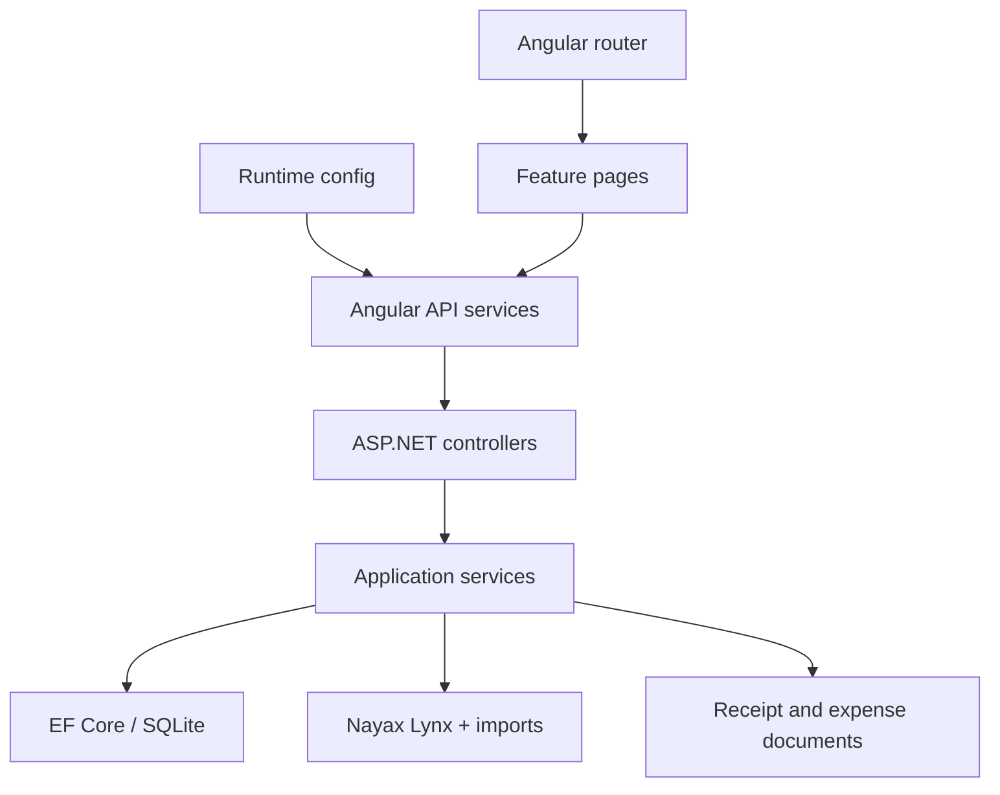
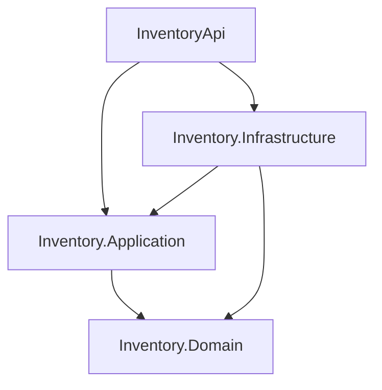
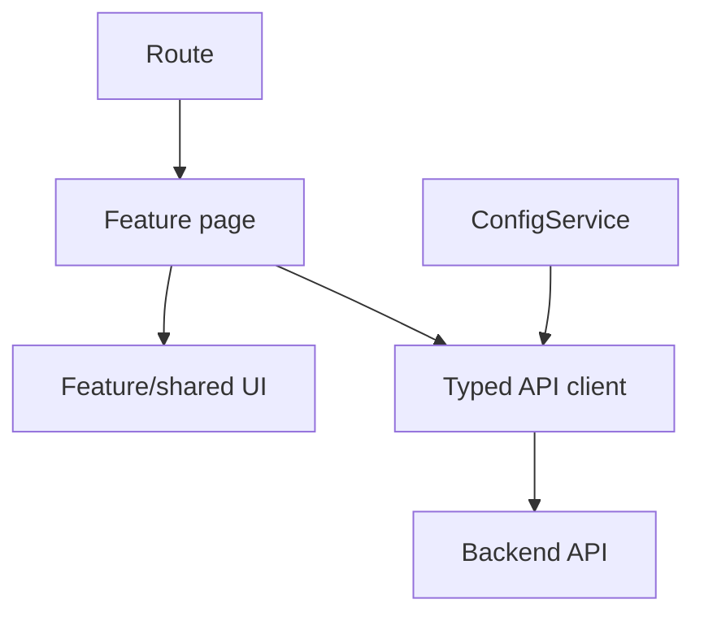
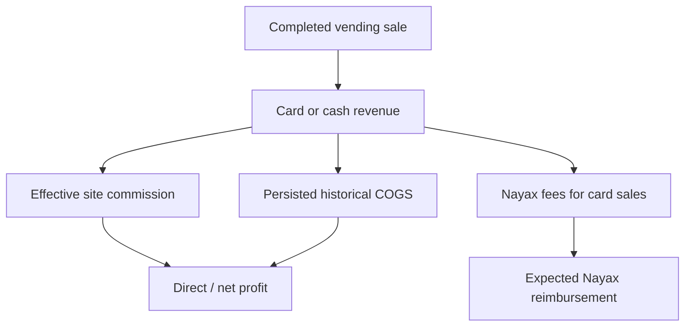

# InventoryApp architecture

## Purpose

InventoryApp is a modular full-stack application for operating a vending-machine business. It manages products, suppliers, purchasing documents, physical stock, supplier orders, machine replenishment, Nayax sales/imports, historical cost, fees, commissions, expenses, reconciliation, and management/accounting reports.

This document describes the repository at the `main` baseline inspected on 17 September 2026 and the intended incremental architecture. It is a guide for maintainers and coding agents; existing tests remain the executable specification.

## Runtime stack

| Area | Technology |
| --- | --- |
| Backend | ASP.NET Core Web API on .NET 10 |
| Persistence | EF Core 10, SQLite, code-first migrations |
| External integration | Nayax Lynx HTTP API and imported reimbursement/workbook data |
| Documents | Files beneath the API web root with metadata in SQLite |
| Frontend | Angular 19 standalone components, TypeScript, RxJS, Tailwind-based styling |
| Backend tests | xUnit, Moq, EF Core InMemory and SQLite |
| Hosting | Azure App Service API and Azure Static Web Apps frontend |
| Automation | GitHub Actions |

## Current repository structure

```text
InventoryApp/
├── backend/
│   ├── InventoryApi/
│   │   ├── Controllers/
│   │   ├── Data/
│   │   ├── DTOs/
│   │   ├── Integrations/Nayax/
│   │   ├── Migrations/
│   │   ├── Models/
│   │   ├── Services/
│   │   ├── Program.cs
│   │   └── InventoryApi.csproj
│   └── InventoryApi.Tests/
├── frontend/inventory-app/
│   ├── src/app/
│   │   ├── components/          Feature pages and shared UI
│   │   ├── models/              Shared TypeScript contracts
│   │   ├── services/            API clients and UI services
│   │   ├── app.config.ts        Angular providers and startup
│   │   └── app.routes.ts        Application routes
│   ├── src/assets/config.json       Runtime API configuration
│   ├── proxy.conf.json              Local API proxy
│   └── package.json
├── .github/workflows/
├── AGENTS.md
└── scripts/
```

The Angular application uses standalone components. `app.config.ts` registers the router, HTTP client, and a startup initializer that loads the API base URL. Routes currently load page components eagerly. Pages keep their own view state and call singleton services, which use `HttpClient` to reach the API.

The API is currently a single assembly. Controllers generally call service interfaces, while services use `AppDbContext` and, where required, Nayax or filesystem facilities. `Program.cs` is the composition root and applies EF Core migrations at startup.



## Current strengths

- Most feature controllers already depend on service interfaces.
- The backend has meaningful tests for products, stock, receipts, supplier orders, costing, imports, fees, commissions, machine profitability, reporting, and migrations.
- Nayax transaction status and payment-method classification are centralized.
- Historical sale cost and its provenance are persisted.
- Reconciliation and incomplete-data states are represented explicitly.
- The frontend has a centralized runtime API configuration, typed services, reusable report-page behavior, and shared toast/confirmation UI.
- Standalone Angular components keep feature code independent of NgModule structure.
- Backend CI restores, builds, and tests before a `main` deployment.

## Current pressure points

- HTTP, use cases, domain calculations, EF Core, Nayax, file storage, and export generation live in one project.
- `ReportingService` owns many report types, shared queries, reconciliation, and CSV/XLSX generation and has grown to roughly 110 KB.
- Receipt, machine, and inventory-cost-transition services combine orchestration and persistence and are large.
- Operating-expense, fee-setting, and site-commission controllers directly access `AppDbContext`; operating expenses also manipulate files.
- `Product` contains persistence state, business calculations, and transient Nayax/UI fields.
- Reporting contracts are concentrated in a large DTO file.
- Several tests use EF Core InMemory where SQLite behavior may be more representative.
- All frontend routes are eager-loaded, and route definitions directly import every page component.
- Frontend contracts are split between a broad `models.ts` file and service-local report interfaces. `reporting.service.ts` is already a large multi-report API client.
- Some page components, especially administration and reporting pages, contain substantial orchestration and presentation logic.
- Report state is locally managed, but date-range logic and financial formatting can accidentally erase `null`/unknown meaning if reused without care.
- The frontend package has no automated test or lint command; its current validation gate is a production build.
- The deployment workflows currently do not provide a complete backend-and-frontend validation gate for every pull request.

These are reasons to improve boundaries, not reasons for a wholesale rewrite.

## Backend target: pragmatic Clean Architecture with vertical slices

The application remains a single deployable modular monolith. The intended projects are:

```text
backend/
├── InventoryApi/                    HTTP host and composition root
├── Inventory.Application/          Feature use cases and external ports
├── Inventory.Domain/               Business rules and domain types
├── Inventory.Infrastructure/       EF, Nayax, files, imports, exports
├── Inventory.UnitTests/            Pure domain/application tests
└── Inventory.IntegrationTests/     Database, API and adapter tests
```



### Inventory.Domain

Contains stable business language and deterministic rules:

- Products, reorder policy and inventory movements.
- Costing quantity/value and weighted-average calculations.
- Sale-cost status/source and costing results.
- Commission agreement semantics and calculations.
- Financial-year/date-range value types where appropriate.
- Pure reporting calculations such as GST extraction, gross profit, and margins.

It must not reference ASP.NET Core, EF Core, HTTP, filesystem APIs, ClosedXML, configuration, or concrete Nayax clients.

### Inventory.Application

Contains use cases grouped by feature, request/response contracts, validation, orchestration, and narrow ports:

```text
Inventory.Application/
├── Products/
├── Stock/
├── Purchases/
├── SupplierOrders/
├── Expenses/
├── Commissions/
├── Imports/
└── Reporting/
```

Examples include `CreateOperatingExpense`, `RecordCommissionPayment`, `ImportNayaxSales`, `GetBookkeepingReport`, and `RebuildHistoricalCosts`.

Application code determines what must happen. It does not know the physical database, file path, HTTP endpoint, or spreadsheet library used to make it happen.

### Inventory.Infrastructure

Contains adapters and technical implementation:

- `AppDbContext`, entity configurations, migrations, and repositories/read stores.
- Nayax Lynx HTTP client and imported-file parsers.
- Document storage for receipts and operating expenses.
- CSV/XLSX report exporters.
- Clock/timezone adapter if introduced.

Use narrow feature-specific ports. A generic repository that leaks persistence semantics into every feature is not a goal.

### InventoryApi

Contains:

- Controllers and HTTP-specific models.
- Authentication/authorization and middleware.
- OpenAPI configuration.
- Dependency injection and application startup.
- HTTP error/result mapping.

Controllers do not implement accounting, inventory, persistence, or filesystem rules.

## Frontend architecture

The frontend is an application boundary in its own right. It owns navigation, interaction state, accessibility, presentation, and communication with the API. It does not own inventory or accounting truth.

### Current composition

| Area | Current responsibility |
| --- | --- |
| `app.component.*` | Application shell, primary navigation, report menu, router outlet, and toast host |
| `app.routes.ts` | Product, stock, supplier, machine, site, receipt, report, expense, and administration routes |
| `components/` | Routed feature pages plus a small set of shared components |
| `services/` | Typed HTTP calls, runtime configuration, toast state, and feature-specific client behavior |
| `models/models.ts` | Shared inventory, purchasing, site, machine, and receipt contracts |
| Report base/classes | Common report filters, loading/error state, financial-year presets, and export behavior |
| `assets/config.json` | Deploy-time API base URL loaded before the application starts |

The application currently uses component-local state and RxJS-backed singleton services. That is appropriate for its present size. Do not introduce a global state library merely to reorganize files. Add one only when there is demonstrated cross-feature state, cache invalidation, or event-coordination complexity that local state and focused services cannot handle clearly.



### Target feature boundaries

Keep Angular standalone and migrate incrementally toward feature-local code:

```text
src/app/
├── core/
│   ├── config/                    Runtime configuration
│   └── http/                      Cross-cutting HTTP concerns only
├── layout/                            Application shell and navigation
├── shared/
│   ├── ui/                        Reusable presentation components
│   └── formatting/                Presentation-only helpers
├── features/
│   ├── products/
│   │   ├── pages/
│   │   ├── components/
│   │   ├── data-access/
│   │   └── models/
│   ├── stock/
│   ├── receipts/
│   ├── machines/
│   ├── sites/
│   ├── expenses/
│   ├── admin/
│   └── reports/
│       ├── shared/                Filters and report-page behavior
│       ├── bookkeeping/
│       ├── reconciliation/
│       └── profitability/
├── app.config.ts
└── app.routes.ts
```

This is a direction, not a required big-bang move. Move a feature when it is being changed, keep each move behavior-preserving, and avoid empty abstraction folders.

Use these ownership rules:

- **Pages** read route/query parameters, coordinate loading and mutation state, and compose the view.
- **Presentational components** receive typed inputs and emit user intent. They do not fetch unrelated application data.
- **Feature data-access services** own HTTP calls and transport mapping for one feature. They do not calculate financial results already supplied by the API.
- **Feature models** describe API contracts and view-specific types for that feature. Promote a type to `shared` only when multiple features genuinely use the same meaning.
- **Core services** are limited to application-wide infrastructure such as configuration and HTTP concerns. `core` is not a home for miscellaneous business logic.
- **The backend** remains authoritative for stock transitions, historical COGS, fees, commissions, reconciliation, and report calculations.

### Routing and loading

Routes are currently declared centrally and import every routed component eagerly. Preserve route URLs, but convert top-level features to `loadComponent` or feature route files as those areas are migrated. This keeps initial bundles smaller and creates an enforceable feature boundary without introducing NgModules.

The static host must rewrite unknown application paths to `index.html`; otherwise refreshing a deep link such as `/reports/bookkeeping` will bypass Angular and return a host-level 404. API paths must remain excluded from that fallback where the hosting topology requires it.

### Runtime configuration and API contracts

`ConfigService` loads `/assets/config.json` through an application initializer before feature services issue requests and falls back to `/api` if that load fails. `proxy.conf.json` forwards `/api` to `http://localhost:5000/` for local development; a deployed static config can provide the hosted API base URL. Do not hard-code API hosts in components or feature services.

Backend contract changes are full-stack changes. When an endpoint changes:

1. update the backend request/response DTO and its tests;
2. update the matching frontend type and feature client;
3. preserve optionality and `null` explicitly rather than coercing missing financial data to zero;
4. update the page, exports, and error/empty states that consume the contract;
5. verify both the API tests and Angular production build.

Until a generated OpenAPI client is deliberately adopted, keep manually maintained TypeScript contracts close to their feature client. Do not introduce a generated client incidentally in an unrelated feature.

### Financial presentation rules

The UI may format and explain backend results, but it must not recreate authoritative accounting formulas. In particular:

- Display sales, fees, commission, COGS, and profit values returned by the API.
- Preserve quality/status fields so partial, estimated, unmatched, or uncosted results remain visible.
- Use an unavailable/unknown presentation for nullable COGS or profit. A generic formatter that turns `null` into `$0.00` is unsafe for these fields.
- Keep card and cash amounts visibly distinct where settlement is discussed.
- Keep ex-GST, GST, and GST-inclusive fee amounts distinct.
- Send explicit inclusive date filters. Business-period interpretation remains based on `Australia/Sydney`, not the browser's accidental timezone.
- Keep on-screen reports and downloaded exports aligned to the same backend calculation path.

### Interaction and presentation

Every routed page should provide intentional loading, empty, error, and success states. Use shared toast notifications for transient mutation outcomes and inline errors when a report or form cannot be understood without the message. Confirm destructive actions and keep server validation details available to the user without exposing stack traces.

New UI must remain keyboard-operable, associate labels with controls, expose meaningful button/link names, and not rely on color alone for reconciliation or quality status.

Tailwind classes in templates, `src/styles.scss`, and component styles are the styling sources. `npm run build:styles` generates `src/styles.css` before Angular builds, so do not make a manual fix only in the generated CSS. Keep production bundle and component-style budgets in `angular.json` passing.

## Domain model and financial boundaries

### Sales and settlement

The application models distinct flows:



Gross sales and Nayax reimbursement are not interchangeable. Cash is business revenue but is outside the Nayax cashless settlement. Reimbursement reconciliation uses the covered transaction period rather than payout date. The accepted monetary tolerance is `$0.01`.

Nayax fee data is effective-dated and has two sources:

1. imported reimbursement fees, authoritative for covered dates;
2. configured fee-rate estimates for uncovered completed card transactions.

The sources must not overlap for the same day. Ex-GST, GST, and GST-inclusive amounts remain separate.

Site commissions use effective-dated agreements and one of three bases: gross sales, card sales, or sales excluding GST. Missing coverage and overlaps remain visible quality/configuration failures. The absence of any agreement for a site is a valid zero-commission state.

### Historical inventory cost

Physical storage stock and costing inventory answer different questions:

- `QuantityInStock`: stock physically held in storage/home and available to refill machines.
- `CostingQuantity`: total business-owned quantity still carrying inventory value.
- `InventoryValue`: remaining value used with `CostingQuantity` to derive AVCO.

A machine refill is an internal location transfer: it changes physical storage but does not consume business inventory value or create COGS. Completed sales and explicit cost-bearing write-offs consume costing inventory.

Historical sale cost precedence is:

1. persisted internal AVCO/ledger cost when reliable;
2. transaction-level Nayax Product Cost Price captured on that sale;
3. uncosted/unknown.

Current product cost and selling price are never substitutes for historical cost. Reports preserve partial COGS and quality counts and do not turn missing cost into zero.

### Profit levels

- Gross profit requires complete COGS and equals sales minus COGS.
- Direct profit also subtracts Nayax fees including GST, site commission, and directly attributable operating expenses.
- Whole-business net profit also includes shared costs such as receipt delivery/package costs and unallocated operating expenses.
- A machine-filtered view must not claim whole-business net profit when shared overhead has no allocation rule.

All report, dashboard, transaction-detail, CSV, and XLSX paths must call the same authoritative calculations.

### Time

- Australian financial year: 1 July to 30 June.
- Report date ranges are inclusive.
- Sale/authorization, reimbursement coverage, import, and payout dates are separate concepts.
- Business reporting timezone: `Australia/Sydney`.

Timezone migration is not part of an incidental feature. Changes require explicit boundary and daylight-saving tests.

## Data flow

### Product purchase and restock

1. A receipt and receipt items record the source purchase.
2. Receipt-linked restock movements add physical and costing inventory at purchase cost.
3. Delivery/package amounts remain identifiable for whole-business reporting.
4. Supplier-order allocations are reconciled without fabricating purchase quantities.

### Machine refill

1. A refill moves units out of storage.
2. The movement is linked to the machine when known.
3. It does not create an expense or COGS and does not reduce costing inventory/value.

### Sale import and costing

1. Imported transaction facts are persisted using the Nayax transaction identity.
2. Status and payment type are classified centrally.
3. Only completed sales enter sales/profit calculations.
4. Historical cost is persisted on each sale with its status and source.
5. Unknown products, statuses, payment methods, or missing costs remain visible.

### Reimbursement import and reconciliation

1. Preserve imported period, gross, device, fee, GST, adjustment, and net facts.
2. Match completed card sales within the reimbursement coverage period.
3. Compare both gross/count and expected/actual settlement.
4. Mark reconciled only within the `$0.01` tolerance.
5. Surface pending, unmatched, partial, unknown, or unsupported data.

## Incremental migration plan

Each step is a separate, passing pull request. Existing endpoints stay operational throughout.

Backend and frontend tracks can progress independently when their contracts do not change. A vertical feature change that touches both sides should still be delivered as one coherent, tested pull request.

### Backend migration track

1. **Safety baseline**
   - Add repository instructions, architecture documentation, and cross-platform validation scripts.
   - Correct documentation/CI drift in focused follow-up changes.

2. **Project skeleton**
   - Add Domain, Application, and Infrastructure projects and dependency-registration extensions.
   - Move no complex feature merely to populate the projects.

3. **Nayax fee settings slice**
   - Move validation/use cases out of `SettingsController`.
   - Prove persistence port, result mapping, DI, and test patterns.

4. **Operating expenses slice**
   - Extract use cases, persistence, and `IDocumentStorage`.
   - Preserve atomic replacement/cleanup and upload validation behavior.

5. **Products and stock slice**
   - Move reorder and inventory-movement rules to Domain.
   - Preserve supplier-order projection and low-stock semantics.

6. **Purchasing and costing slice**
   - Migrate receipts, supplier orders, stock ledger, AVCO, rebuilding, and sale costing as one coherent area.

7. **Reporting slices**
   - Split bookkeeping, daily, reconciliation, machine/product profitability, GST, dashboard, and transactions into separate query handlers.
   - Split CSV/XLSX formatting from report calculation.

8. **Remove legacy structure**
   - Only after every feature is migrated and tests prove equivalent behavior.

### Frontend migration track

1. **Frontend safety baseline**
   - Add a pinned unit-test runner and lint command in a focused pull request.
   - Test runtime configuration and one representative feature client before moving files.

2. **Feature boundaries**
   - Move one routed area at a time under `features/<feature>`.
   - Keep pages, feature UI, contracts, and data access together and preserve public route URLs.

3. **Lazy top-level routes**
   - Convert migrated features to `loadComponent` or a small feature route file.
   - Verify direct navigation, refresh behavior, and production bundle budgets.

4. **Reporting slices**
   - Split the broad reporting client and service-local interfaces by report family.
   - Retain shared filters/export behavior without centralizing every report in another large class.
   - Preserve nullable financial values, quality counts, and backend/export parity.

5. **Large page decomposition**
   - Extract cohesive forms, tables, and panels from large administration and report pages.
   - Keep orchestration in the routed page and make child components input/output driven.

6. **Critical workflow coverage**
   - Add browser-level smoke tests for product maintenance, receipt/restock, machine refill, import, and a representative financial report.
   - Run frontend tests and the production build in pull-request validation before changing the deployment gate.

## Testing architecture

### Backend tests

Use three complementary levels:

1. **Pure unit tests** for calculations, policies, classification, and domain transitions.
2. **SQLite integration tests** for EF queries, constraints, transactions, ordering, migrations, and repositories.
3. **API/adapter tests** for HTTP contracts, Nayax mapping, file storage, imports, and report exports.

EF Core InMemory tests remain useful for fast service checks but must not be the only evidence for relational behavior.

Financial regression tests should cover at least:

- card/cash split and unknown payment type;
- completed, pending, refunded, cancelled/declined, and unknown status;
- complete and incomplete COGS;
- internal AVCO and Nayax fallback provenance;
- actual versus estimated fees and missing rates;
- commission bases, gaps, overlaps, and zero-agreement sites;
- reimbursement period and `$0.01` reconciliation boundary;
- machine-filtered versus whole-business profit;
- date/FY filters and export parity.

### Frontend tests

The current package has no automated test command, so the first frontend testing change must choose, configure, and pin the runner explicitly. The target test mix is:

1. **Pure unit tests** for date presets, display-only transformations, validation, and nullable financial presentation.
2. **HTTP client tests** for endpoint, query-parameter, request-body, response, and error mapping behavior.
3. **Component tests** for loading, empty, error, success, confirmation, and accessibility states.
4. **Router tests** for route parameters, redirects, lazy features, and direct report navigation.
5. **Browser smoke tests** for a small number of business-critical workflows against a controlled API/database.

Do not duplicate backend formula tests in Angular. Frontend assertions should prove that authoritative values and quality states are requested and presented correctly.

## Build and delivery

The canonical local validation entry points are `scripts/validate.ps1` and `scripts/validate.sh`. They restore, build, and test the backend and run a clean install plus production build for the frontend. When frontend test and lint scripts are added, these validation entry points and pull-request CI must call them.

Frontend build flow is:

1. `npm ci` installs the locked dependency graph.
2. `npm run build:styles` generates Tailwind output from `src/styles.scss` and template/TypeScript content.
3. `ng build` creates `dist/inventory-app` and enforces the production budgets in `angular.json`.
4. Azure Static Web Apps serves the compiled assets and runtime configuration; the host must provide Angular navigation fallback.

Current production delivery is triggered from `main`:

- `.github/workflows/vm-manager.yml` builds/tests and deploys the API.
- `.github/workflows/azure-static-web-apps-red-island-0c128c000.yml` builds/deploys the Angular frontend.

Consequently, automated engineering agents stop at a pull request. Merge and production deployment remain human-controlled.

## Architectural decision rules

Use this order when considering new structure:

1. Can an existing feature/use case own the change?
2. Can a pure calculation or domain type express the rule?
3. Is an external port needed because the code crosses a database, HTTP, time, or filesystem boundary?
4. Is a new dependency measurably simpler than a local implementation?

Do not use Clean Architecture as a reason to introduce layers without behavior, duplicate models mechanically, or move a large class unchanged into a differently named project. The objective is explicit domain rules, replaceable external boundaries, reliable tests, and small changes that humans and agents can understand.

For frontend structure, ask the corresponding questions:

1. Which routed feature owns the behavior?
2. Is the code page orchestration, reusable presentation, API data access, or an API contract?
3. Is sharing based on proven reuse with the same meaning, or only on similar-looking code?
4. Does the API already own this business calculation?

Prefer a complete vertical change over disconnected backend and frontend abstractions. A feature is complete only when its contract, UI states, validation, tests, and any report/export implications agree.
