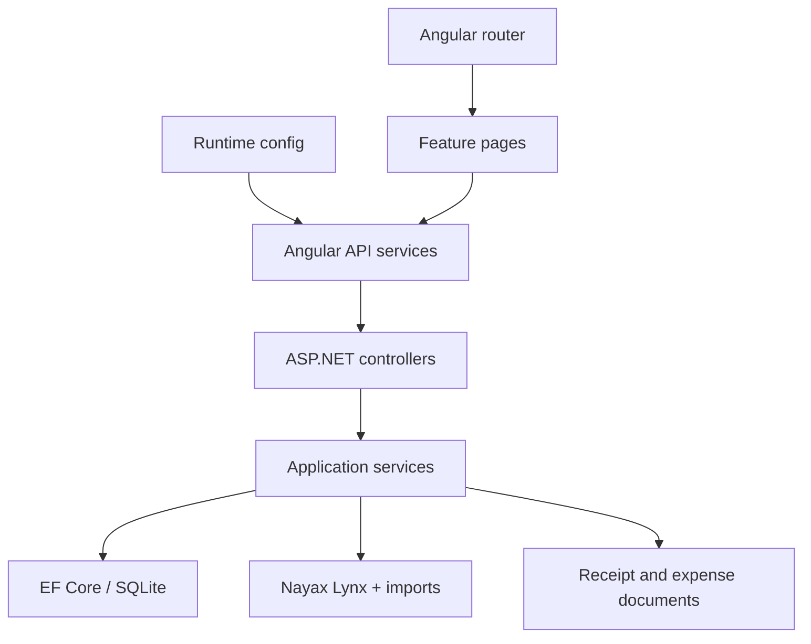
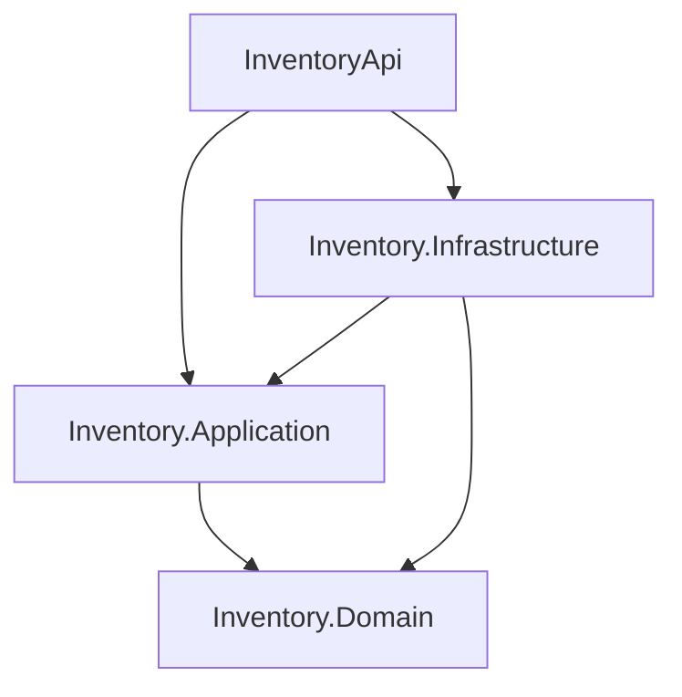
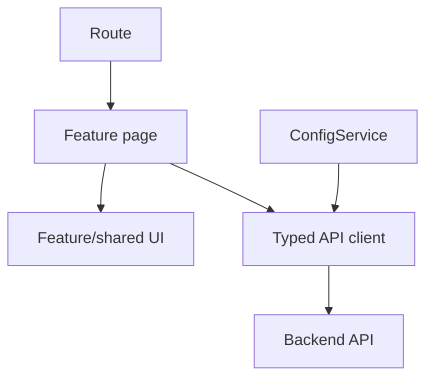
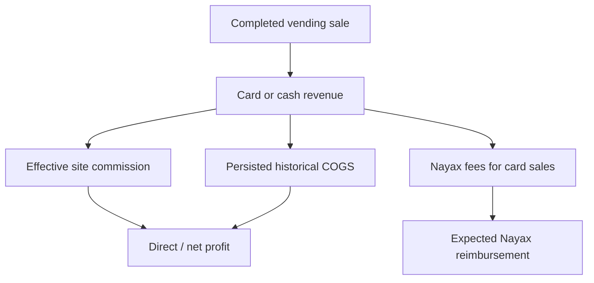

# InventoryApp architecture

## Purpose

InventoryApp is a modular full-stack application for operating a vending-machine business. It manages products, suppliers, purchasing documents, physical stock, supplier orders, machine replenishment, Nayax sales/imports, historical cost, fees, commissions, expenses, reconciliation, and management/accounting reports.

This document describes the repository at the `main` baseline inspected on 17 September 2026 and the intended incremental architecture. It is a guide for maintainers and coding agents; existing tests remain the executable specification.

## Runtime stack

| Area | Technology |
| --- | --- |
| Backend | ASP.NET Core Web API on .NET 10 |
| Persistence | EF Core 10, SQLite, code-first migrations |
| External integration | Nayax Lynx HTTP API and imported reimbursement/workbook data |
| Documents | Purchase and operating-expense files behind `IDocumentStorage`, with metadata in SQLite. `DocumentStorage:Provider` selects the implementation: `FileSystem` (the default) keeps them under the content root's `protected-files/`, outside the web root, with a legacy `wwwroot/{category}` read fallback; `AzureBlob` keeps them in a private Azure container under `tenants/{businessId}/...`, authenticated with a managed identity. Static-file middleware is disabled and no SAS or public URL is ever generated, so no document has an anonymous URL |
| Observability | Azure Monitor OpenTelemetry (`Azure.Monitor.OpenTelemetry.AspNetCore`) exporting requests, dependencies, metrics, `ILogger` logs and exceptions to Application Insights, registered only when `APPLICATIONINSIGHTS_CONNECTION_STRING` is configured. See [Observability and error telemetry](#observability-and-error-telemetry-issue-165) |
| Frontend | Angular 19 standalone components, TypeScript, RxJS, Tailwind-based styling |
| Backend tests | xUnit, Moq, EF Core InMemory and SQLite |
| Hosting | Azure App Service API and Azure Static Web Apps frontend |
| Automation | GitHub Actions |

### SQLite operating assumptions and scale strategy (issue #53)

The production database is the single SQLite file EF Core opens through
`ConnectionStrings:DefaultConnection` (`backend/InventoryApi/appsettings.json`), which defaults to
`Data Source=inventory.db` — a path relative to the API process's working directory
(`backend/InventoryApi/Program.cs`). No committed `appsettings.Production.json` overrides that
default; a different value can only come from an App Service application setting
(`ConnectionStrings__DefaultConnection`), which is Azure configuration outside this repository and
not verifiable from source.

**Where the file lives and what persists.** Azure App Service keeps exactly one directory durable
across process restarts and reboots, and shared across every instance if the plan ever scales to
more than one: `/home` (Windows: `d:\home`), mounted from the platform's own storage rather than
the ephemeral per-instance disk. A normal zip/package deployment through `azure/webapps-deploy@v2`
(`.github/workflows/vm-manager.yml`) extracts the published output under `/home/site/wwwroot`, so
the default relative `inventory.db` path resolves inside that persistent directory today, and the
file survives ordinary app restarts.

That default is fragile for two reasons this repository cannot verify from source, because they
are Azure App Service configuration, not code:

1. **Run-From-Package.** If the App Service is configured with `WEBSITE_RUN_FROM_PACKAGE=1` (a
   common App Service deployment mode), `wwwroot` is mounted **read-only** from the deployed
   package, and a relative `inventory.db` path would not be writable at all. Confirm this setting
   for the live app before relying on the default relative path.
2. **Deployment overwrite.** Even where `wwwroot` is writable, it is also the deployment target.
   Placing the database file inside the same directory the deployment pipeline writes to is an
   avoidable risk, independent of exactly how a given deployment happens to behave.

**Operational recommendation** (an App Service configuration change, not a code change — this
issue does not alter any production setting): point `ConnectionStrings__DefaultConnection` at an
absolute path outside `wwwroot` but still under the persistent `/home` mount, for example
`Data Source=/home/data/inventory.db`, and confirm `WEBSITE_RUN_FROM_PACKAGE` is unset or `0` for
this app. A human operator must make and verify this against the live App Service; it is not
something an automated agent may apply (`AGENTS.md` reserves Azure/App Service configuration
changes for humans).

**Concurrency and locking limits.** The API opens the database with `Microsoft.Data.Sqlite`'s
default journal mode (rollback journal, not WAL — nothing in `Program.cs` configures
`journal_mode`) and the driver's default busy timeout (`Default Timeout=30`, i.e. 30 seconds).
SQLite allows unlimited concurrent readers but only one writer at a time; a second writer blocks
for up to the busy timeout and then fails with `SQLITE_BUSY` rather than queuing indefinitely. In
this single-process deployment that is a soft limit on request latency under write-heavy
concurrent load (for example simultaneous imports and sale-costing writes), not a hard outage —
but it does not extend to multiple concurrently writing processes: **the App Service plan for this
app must stay pinned to a single instance (no scale-out) while SQLite remains the store.** SQLite's
file locking is unreliable over the kind of shared, network-backed storage `/home` becomes once
more than one instance mounts it, so running two instances against the same database file is not a
supported configuration.

**Monitoring signals that indicate SQLite pressure** — none of these are wired into automated
alerting today (that is future work, not part of this change), but are the observable evidence
worth watching for:

- `SQLITE_BUSY`/timeout exceptions in the application log
  (`Microsoft.Data.Sqlite.SqliteException` with `SqliteErrorCode == 5`), especially clustered
  around import or reconciliation jobs.
- API request latency growth specifically on write endpoints (imports, sale costing, purchases,
  stock adjustments) that does not correlate with CPU/memory pressure — a symptom of writers
  queued behind the single-writer lock rather than genuine compute cost.
- Database file size approaching the App Service plan's storage quota, or backup/restore
  durations (see below) growing enough to threaten the business's recovery-time expectations.

The first two are searchable in Application Insights once the connection string is configured (see
[Observability and error telemetry](#observability-and-error-telemetry-issue-165)); turning either
into an alert or a paging rule remains the future work this paragraph describes.
- Any deliberate move to more than one App Service instance for this app, which SQLite's
  single-writer, file-locking model does not support safely.

**Measurable triggers to migrate to a server database (Azure SQL or PostgreSQL).** Any one of
these is a concrete, evidence-based reason to plan the migration, not a speculative one:

1. The App Service plan needs more than one concurrently running instance (for availability or
   throughput) — SQLite cannot be safely shared across instances at all.
2. Recurring `SQLITE_BUSY` write-timeout errors under normal (non-incident) load, observed rather
   than anticipated.
3. A verified backup/restore cycle (see below) exceeds the business's acceptable recovery time
   because the file has grown large enough that a full-file backup and restore no longer fits the
   maintenance window.
4. A second live business is onboarded whose Nayax integration needs to run concurrently with the
   first (see [Tenant ownership](#tenant-ownership-issue-64): the Nayax client is single-tenant
   today) in a way that increases concurrent write load beyond what one SQLite writer sustains.

None of these are currently met; the current single-business, single-instance deployment is within
SQLite's supported envelope. This issue does not migrate the database (explicitly out of scope for
issue #53); it defines what would justify doing so.

**Where a server-database migration would live.** If one of the triggers above is met, the target
is a Clean Architecture change, not a drop-in connection-string swap. Since issue #307
`AppDbContext`, the EF entities (`Inventory.Infrastructure/Models`) and the migrations
(`Inventory.Infrastructure/Migrations`) are owned by `Inventory.Infrastructure`, which is where a
provider migration belongs too — behind the same narrow persistence ports this document already
describes for migrated features, so `Inventory.Domain` and `Inventory.Application` stay unaware of
which relational engine is in use.

What stays in `InventoryApi` is the provider *choice*, not the model: `Program.cs` holds the
`Microsoft.EntityFrameworkCore.Sqlite` package reference and the single `options.UseSqlite(...)`
call that reads `ConnectionStrings:DefaultConnection`, and `InventoryApi/Bootstrap` holds
`DatabaseSchemaStartup` and the `migrate-database` command. A provider swap therefore touches the
composition root and `Inventory.Infrastructure`, and must leave the EF entities and the applied
migration history alone.

**The `dotnet ef` arguments changed with that move.** The migrations project and the startup
project are now different projects, so the tooling needs both:

```bash
dotnet ef migrations add <Name> \
  --project backend/Inventory.Infrastructure \
  --startup-project backend/InventoryApi
dotnet ef migrations has-pending-model-changes \
  --project backend/Inventory.Infrastructure \
  --startup-project backend/InventoryApi
```

No `MigrationsAssembly` configuration is needed: EF Core resolves the migrations assembly from the
`DbContext`'s own assembly by default, and the context and its migrations are in the same project
(`MigrationRelocationTests.Inventory_Infrastructure_is_the_migrations_assembly` asserts exactly
that, so splitting them again fails a test rather than a deployment).

**Backup and restore procedure.** SQLite's Online Backup API — the same engine feature the
`sqlite3` CLI's `.backup` command and `Microsoft.Data.Sqlite`'s
`SqliteConnection.BackupDatabase` both call — copies a consistent snapshot of the database to a
new file without requiring the source connection, or the API process holding it, to stop.
`backend/InventoryApi.Tests/Operations/SqliteBackupRestoreTests.cs` proves this mechanically: it
backs up a live SQLite file while the source connection that created it stays open (mirroring a
running API process) and confirms the resulting copy passes `PRAGMA integrity_check` and contains
exactly the committed rows, then proves a second backup taken later, still without closing that
connection, reflects the writes committed in between.

**The supported command (issues #331 and #332).** `backend/InventoryApi`'s published executable has
a `backup-database` CLI mode, dispatched before the web host is built — the same early-command
pattern as `bootstrap-business` and `migrate-database`, so taking a backup and starting the API
are mutually exclusive paths through `Program.cs` and never run during normal startup. It takes
exactly one of two mutually exclusive modes: `--output <path>` retains a verified snapshot at a
path the operator names (issue #331), and `--upload` stages a verified snapshot, uploads it to the
private backup container, and removes the local copy (issue #332, described below). They are
mutually exclusive because they dispose of the snapshot in opposite ways; passing both is refused
rather than resolved by guessing. It opens the
same configured database the API would (`ConnectionStrings:DefaultConnection`, falling back to the
relative `Data Source=inventory.db` default — that relative default is not rejected merely for
being relative, only if the resolved file does not exist or cannot be opened), copies it with the
same Online Backup API described above (never a filesystem `cp`), and refuses an `--output` path
that already exists, matches the source, or sits inside the API's content root/web root, so a
snapshot can never land somewhere a redeploy or publish step would silently discard or overwrite
it. Once the snapshot is written it runs `PRAGMA integrity_check` itself and reports the result,
the snapshot's SHA-256, and the elapsed duration — without ever printing the connection string — and
exits non-zero on any failure:

```bash
dotnet InventoryApi.dll backup-database --output /home/data/backups/inventory-20260101T000000.db
```

This is the command the scheduled backup WebJob (issue #333, below) also calls; routine backups
are scheduled, not run by hand. Manual, one-off verification uses the identical command.
Retention/alerting and automated restore remain out of scope for this command — retention is a
storage-lifecycle policy and alerting is an Azure Monitor rule, both human-applied (see [Backup
retention, alerting and restore rehearsal](#backup-retention-alerting-and-restore-rehearsal-issue-334)
below), and restore stays the deliberate, human-run `sqlite3` procedure below.

**Uploading the verified snapshot off the instance (issue #332).** `backup-database --upload` is
the create-verify-upload workflow, in one command:

```bash
dotnet InventoryApi.dll backup-database --upload
```

It takes and verifies the snapshot exactly as the retained mode does — Online Backup API,
`PRAGMA integrity_check`, SHA-256 — but into a staging file under the OS temporary path
(`inventoryapp-backup-staging/`), which is outside the API's content root and `wwwroot`; the same
content-root guard that protects `--output` still checks the staged path rather than trusting it.
Each invocation stages into its own freshly named subdirectory of that staging root
(`run-<yyyyMMdd>T<HHmmss>Z-<random>/`) rather than straight into it, because the UTC instant is
precise only to the second: two runs that overlap — the scheduled job and an operator running the
command by hand, or a slow upload still in flight when the next run starts — must not contend for
one path, and neither run's cleanup may remove the other's snapshot while it is still being
uploaded. Only a snapshot that completed and passed verification is uploaded: the uploader accepts
a type that can only describe a verified snapshot, and re-hashes the staged file against the
checksum verification produced before sending a byte, so a staged copy that was replaced or
truncated in between is refused. The staged file (and any SQLite sidecar files) are removed in a
`finally` path after success, failure, or an exception such as an unreachable storage account,
followed by the run's own now-empty directory — the cleanup deletes only those paths, by name and
inside that directory, so another run's staged snapshot and anything an operator keeps in the
staging root are never touched. A cleanup that could not finish is reported and exits non-zero
rather than quietly leaving a complete copy of every business's data on the instance's disk. Exit
code is `0` only when the snapshot verified, the upload verified, and nothing was left behind.

Each run writes to a private container, under two prefixes:

| Object | Name | Written |
|---|---|---|
| Per-snapshot | `daily/inventory-<yyyyMMdd>T<HHmmss>Z.db` | Every run, from the snapshot's UTC instant |
| Per-month recovery point | `monthly/<YYYY-MM>/inventory-<YYYY-MM>.db` | On the first successful upload in that UTC calendar month |

The monthly recovery point is chosen by the upload itself, not by a storage lifecycle rule: a rule
can expire objects, but nothing in the account knows which daily snapshot a month should keep. The
name is deterministic from the month alone, and the write is a conditional create
(`If-None-Match: *`), so "is this the first upload of this month?" is answered by the service in
the same request that would write it. Three consequences matter operationally: a month whose first
scheduled run was missed still gets a recovery point from whichever verified snapshot arrives
first (including a manual `--upload` early in the month, which is acceptable because it is a
verified snapshot); a retry or any later upload in the same month leaves the existing monthly
object byte-for-byte unchanged and reports it as already present rather than as a failure; and no
object under either prefix is ever overwritten — an occupied `daily/` name stops the run instead.
The seam the uploader is written against (`IBackupBlobContainer`) has no delete and no overwrite
operation at all, so retention cannot be performed by this code path even accidentally.

Each uploaded object carries three pieces of metadata — `createdutc` (the snapshot's UTC instant),
`sha256` (the checksum verification computed) and `kind` (`daily` or `monthly`). They are
operational facts, readable from a storage browser; none describes, samples or summarises the data
inside the snapshot, and none is or can become a credential. The upload is then verified as
completed by reading each object's length and recorded checksum back and comparing them to the
snapshot that was sent — the content itself is never downloaded. A write the service accepted but
did not store as sent is reported as a failure, not as a recovery point.

**Required configuration, identity and container (issue #332).** Two non-secret settings, read
from App Service application settings or environment variables, and read only by this command:

```text
BackupStorage__BlobServiceUri=https://<storage-account>.blob.core.windows.net
BackupStorage__ContainerName=database-backups          # database-backups-dev for development
```

There is no account key, SAS token, client secret or storage connection string to configure, and
none is accepted: authentication is `DefaultAzureCredential` — the App Service's managed identity
when the scheduled job runs the command, and the operator's own Azure sign-in when they run it by
hand — and the configuration gate rejects a service URI carrying a query string or embedded
credentials, which is what a SAS token or an account key would look like. Nothing in the upload
path logs a credential; the command prints object names, byte counts, the checksum and the
integrity result, never a connection string or snapshot content. An unconfigured or unusable
destination is refused **before** any snapshot is taken, so an upload that cannot reach its
destination never spends time copying the database first.

The human prerequisites below are stated for a human to apply; **no production Azure resource,
role assignment or policy is created or changed by this repository or by any agent**, and the
deployment configuration is not visible here, so a human must verify it before rollout:

| # | Prerequisite | Why |
|---|---|---|
| 1 | A **private** container (for example `database-backups`), separate from the `business-documents` container | A snapshot is a complete copy of every business's data. Its own container keeps its access, retention and auditing independent of document storage, and no public/anonymous access is a hard requirement. |
| 2 | A storage account outside the App Service's own storage failure domain | A backup that lives only next to the database it protects does not survive whatever destroys the database. |
| 3 | **System-assigned managed identity** on the App Service | The command authenticates as the application itself, with no credential stored anywhere. |
| 4 | **`Storage Blob Data Contributor`** granted to that identity at the narrowest practical scope — preferably the backup container alone | Least privilege for what this flow actually does: create an object that does not exist and read object properties back. `Storage Blob Data Reader` cannot write; account-wide Contributor would also grant access to business documents. Delete is not required by this flow — retention is separate, human-controlled work. |
| 5 | Encryption confirmed: **at rest** by Azure Storage service-side encryption (AES-256, enabled on every account and not optional), and **in transit** by HTTPS/TLS — the configuration gate refuses any non-loopback endpoint that is not `https`, and "secure transfer required" should be enabled on the account | The snapshot contains financial and business records. Infrastructure-level encryption is the expectation for both states; the final encryption policy (including any customer-managed key) remains a human decision. |

The equivalent operator procedure, using the `sqlite3` CLI (the standard SQLite tool;
<https://sqlite.org/cli.html>) against the App Service's persistent database path, remains
available for a host where the published `dotnet` application is not on hand, or to rehearse the
underlying mechanism:

1. **Prefer a quiet window, but do not rely on stopping the app.** The Online Backup API produces
   a consistent snapshot even while writes continue; stopping the App Service first (or scaling to
   zero) removes any residual risk but is not required for backup correctness. Do not run a plain
   filesystem `cp` of the `.db` file while the app is running — unlike the backup API, a raw copy
   can capture a database file mid-write and is not guaranteed consistent.
2. **Take the backup:**

   ```bash
   sqlite3 /home/data/inventory.db ".backup '/home/data/backups/inventory-$(date +%Y%m%dT%H%M%S).db'"
   ```

3. **Verify the backup immediately**, before trusting it:

   ```bash
   sqlite3 /home/data/backups/inventory-<timestamp>.db "PRAGMA integrity_check;"
   ```

   A result other than a single `ok` row means the backup is not trustworthy; take it again.
4. **Store the verified backup somewhere other than the App Service's own `/home` mount** (for
   example downloaded to a workstation, or uploaded to separate storage) — a backup that lives only
   next to the database it protects does not survive whatever destroys the database.
   `backup-database --upload` is the supported, automated form of this step; this manual
   alternative exists for a host where the published `dotnet` application is not on hand.
5. **Restore** by stopping the API, replacing the live database file with the verified backup (or
   pointing the connection string at the restored file), and starting the API again:

   ```bash
   sqlite3 /home/data/backups/inventory-<timestamp>.db ".backup '/home/data/inventory.db'"
   ```

   Restoring does overwrite live data and must only be run deliberately, by a human, after
   confirming the target file is the one meant to be replaced — this is the one step in the
   sequence that is not safe to automate or run against a live app.

This procedure, and the non-destructive local check in the README, do not touch any production
connection string, credential, or data; every example above uses a placeholder path that a human
operator supplies for their own environment.

#### Scheduling the backup with an App Service WebJob (issue #333)

A backup must happen whether or not anyone signs in, which is the one workload in this application
that genuinely cannot stay request-driven (see [Azure Functions and background
workloads](#azure-functions-and-background-workloads-decision-criteria-issue-68)). The schedule is
a **triggered Linux App Service WebJob** that runs inside the App Service the API already runs in,
and it ships in the API's own `dotnet publish` output:

```text
backend/InventoryApi/App_Data/jobs/triggered/database-backup/
├── run.sh          # invokes the published executable's backup-database --upload
└── settings.job    # {"schedule": "0 0 15 * * *"} - daily at 15:00 UTC
```

App Service reads a triggered WebJob from `App_Data/jobs/triggered/<job name>/` under the deployed
site root, and that site root is the publish directory, so the two files are declared as publish
content in `InventoryApi.csproj` (`<Content Include="App_Data\jobs\**\*"
CopyToPublishDirectory="PreserveNewest" />`) and need an explicit declaration because the Web SDK's
default content globs cover `wwwroot`, `*.config` and `*.json` only. **Deploy Production** already
publishes that project and deploys the whole output directory, so the job reaches production with
the API and **no GitHub Actions workflow changed** (`.github/workflows/vm-manager.yml` builds and
tests only; it has not published or deployed since issue #343 — see [Build and
delivery](#build-and-delivery)). `App_Data` is not under `wwwroot` and is never served as static
content.

**The job holds no logic, no path and no setting.** `run.sh` invokes the one supported command,
from the application's own directory, and propagates its exit code:

```bash
dotnet InventoryApi.dll backup-database --upload
```

Five properties of that script are deliberate:

- **It names no database.** The database backed up is whatever
  `ConnectionStrings:DefaultConnection` resolves to for the API — an absolute path under `/home` if
  one is configured, or the relative default. The script passes no path and sets no connection
  string, and because it runs the command **from the published application's directory** a relative
  default resolves exactly where it resolves for the running API. Moving the database is therefore
  a configuration change only; nothing in the job has to be edited to follow it.
- **It finds the application rather than assuming its own working directory is it.** App Service
  copies a triggered WebJob's files to a temporary directory before running them, so the script
  looks for `InventoryApi.dll` in `WEBROOT_PATH` (when the platform provides it), then
  `$HOME/site/wwwroot`, then four levels above itself for a host that runs it in place. Not finding
  it fails the run; it never falls back to a guessed path.
- **Exit code is the contract.** `backup-database --upload` exits `0` only when the snapshot
  verified, the upload verified and the staged copy was removed, and the script exits with exactly
  that code, so a failed backup is a failed WebJob run in the job's history rather than a green run
  with a bad log line.
- **It logs the run and nothing sensitive.** A UTC-stamped `START` line, then either `COMPLETED` or
  `FAILED (<reason>)`, both with the elapsed duration. The artifact metadata an operator needs —
  the uploaded `daily/`/`monthly/` object names, the snapshot's SHA-256, its byte count and the
  integrity result — comes from the command's own output, which the job inherits, so there is one
  place that decides what a backup run reports and no second parser to keep in step. Neither the
  script nor the command prints a connection string, a credential, a query or any row of business
  data. The job's own failures use the same `FAILED (<reason>)` shape as the command's, so the
  failed-run alert below catches a job-level failure (the application not found, no `dotnet` host)
  as well as a command-level one.
- **It needs no monthly logic.** The month's single recovery point is created by the upload itself,
  on the first successful upload in each UTC calendar month, scheduled or manual (see above).

**Why 15:00 UTC, and why in the artifact.** The schedule lives in `settings.job` in the deployment
artifact rather than in portal configuration, so it is reviewable in a diff and survives a
redeploy. `settings.job` CRON has **six** fields starting at seconds, so `0 0 15 * * *` is
15:00:00 daily — a five-field expression would silently mean something else. 15:00 UTC is 01:00 or
02:00 in `Australia/Sydney` depending on daylight saving, which is outside trading hours for a
vending business, and it is the cadence the 36-hour missing-backup alert of issue #334 is specified
against. A WebJob's CRON is evaluated in UTC unless the app's `WEBSITE_TIME_ZONE` setting changes
the container's time zone, which is one of the settings a human must confirm below. Changing the
window means changing this file and re-confirming the alert window with it.

**Prerequisites, and what only a human can confirm.** This repository contains no Azure resource
configuration and cannot see the deployed App Service, so the rows below are the operating
assumptions this packaging is built on, each with the human check that confirms it against the live
app. **No agent and no workflow in this repository applies any of them.**

| # | Prerequisite | Why it matters | How a human confirms it |
|---|---|---|---|
| 1 | The app is a **code deployment of the publish output to a Linux App Service** (the mode `deploy-production.yml` performs with `azure/webapps-deploy`), not a custom container | A custom container image does not read `App_Data/jobs`, so the job would never be discovered and this packaging would be the wrong mechanism | The App Service's deployment/publish mode in the portal. If it is ever moved to a container, this job stops working and needs its own issue, not a quiet fix |
| 2 | **WebJobs are available on the plan and the job is listed after a deployment** | The schedule is inert if the platform never registers the job | After the first deployment carrying it, the WebJobs blade lists `database-backup` as `Triggered` with the `0 0 15 * * *` schedule |
| 3 | **Always On** is enabled, which requires **Basic or higher** (Free/Shared cannot) | A scheduled WebJob only fires while the app is running; an idle app that has been unloaded runs nothing, and the missed run is then only visible through issue #334's alert | Configuration → General settings → Always On = On, and the plan tier |
| 4 | The plan stays pinned to **one instance** | The database is a single SQLite file on the App Service's `/home` mount, which is why the whole deployment is single-instance (see above). Scaling out would also multiply the scheduled run | The plan's instance count and any autoscale rule |
| 5 | `ConnectionStrings__DefaultConnection` points at the **persistent, absolute** `/home` path the API actually uses | The job backs up exactly what the API reads. An absolute configured path removes the relative default's dependence on the working directory for both of them | The App Service application setting, read in the portal — never pasted into this repository, an issue or a pull request |
| 6 | `WEBSITE_RUN_FROM_PACKAGE`, if set, still exposes `App_Data/jobs` from the mounted package, and the database is **not** inside `wwwroot` | Run-from-package mounts `wwwroot` read-only; a database inside the deployment target is an avoidable risk either way (see the README) | The application setting, plus confirming the job appears and runs (row 2 and row 7) |
| 7 | The **first scheduled run succeeds end to end** | Everything above is an assumption until one real run has taken a snapshot, uploaded it and exited `0` | The job's run history and its log output, plus the new `daily/` object (and the month's `monthly/` object) in the backup container |
| 8 | The managed identity and backup container prerequisites of issue #332 are in place | The job authenticates as the application; it adds no credential of its own, and there is no secret in the WebJob | The prerequisite table above (private container, system-assigned identity, least-privilege `Storage Blob Data Contributor`) |

Two further notes a human should know when confirming row 2 and row 7. The platform runs a `.sh`
WebJob through a shell, so the script does not rely on its Unix executable bit surviving the
artifact upload, the zip deployment and the extraction — a chain this repository cannot control;
`.gitattributes` does pin the job's files to LF endings in every checkout, because a CRLF `run.sh`
would fail on its first line. And the WebJob is a second process reading the same SQLite file as
the API: that is a reader, not a second writer, and the Online Backup API is what makes it
consistent (see the top of this section), so it stays inside the single-writer envelope the
deployment already requires.

**What the repository verifies, and what it cannot.**
`backend/InventoryApi.Tests/Operations/BackupWebJobPackagingTests.cs` asserts the packaging and the
invocation: both files exist at the triggered-WebJob path, the project declares them as publish
content with `CopyToPublishDirectory` (the exact mechanism that puts them in the deployed artifact),
the schedule is the six-field daily 15:00 UTC expression, the script's executable lines name no
database path, connection string or `--output` destination, and — by running the real script under
`bash` against a fake `dotnet` and a throwaway application directory — that it invokes
`InventoryApi.dll backup-database --upload` from the application's directory, exits with the
command's own exit code, logs start, completion/failure and duration, and fails without invoking
anything when the application is not found. No test takes a backup, reaches Azure or runs
`dotnet publish`. **Nothing about the live plan, Always On, the connection string or the schedule
actually firing is verified from this repository**; those are rows 1-7 above.

#### Backup retention, alerting and restore rehearsal (issue #334)

Taking and uploading a verified snapshot (#331, #332) and scheduling it (#333) answer "does a
recovery point exist?". Three questions are left, and this subsection answers all three as
**design and operator instructions only**:

1. **Retention** — backup storage must stay bounded without losing the long-horizon recovery
   points, which is a storage-lifecycle question, not a compute one.
2. **Alerting** — a failed run and a run that never happened must both become visible, because an
   unnoticed gap in backups is only discovered when a restore is needed.
3. **Rehearsal** — a backup nobody has ever restored is an assumption, so restoring must be
   practised somewhere that is not production.

**Nothing here creates or changes an Azure resource.** This repository contains no Bicep,
Terraform or Azure resource configuration, and deliberately gains none in this change: the
lifecycle policy, the diagnostic settings, the action group and the two alert rules are **human
production setup steps**, listed with their verification in [Human production setup, and how to
verify it](#human-production-setup-and-how-to-verify-it) below. No agent and no workflow in this
repository may apply them. The values below (30 days, 12 months, 36 hours, the proposed severities
and destination) are proposals that a human confirms against the business's recovery point and
recovery time objectives before applying them; see [Decisions a human must confirm
first](#decisions-a-human-must-confirm-first).

**Retention: an Azure Blob lifecycle policy on the backup container.** Retention is expressed as a
storage-account lifecycle management policy, not as code. That choice is deliberate and matters for
safety: the lifecycle engine deletes as the storage *service*, so the App Service's managed
identity still needs nothing beyond the create/read permissions prerequisite 4 above grants it, the
`IBackupBlobContainer` seam still has no delete or overwrite operation, and no application code
path — scheduled or manual — can ever remove a recovery point. Retention and backup creation stay
in different hands on purpose.

The policy expires per-snapshot objects after 30 days and monthly recovery points after 12 months:

```json
{
  "rules": [
    {
      "enabled": true,
      "name": "expire-daily-database-snapshots-after-30-days",
      "type": "Lifecycle",
      "definition": {
        "filters": {
          "blobTypes": [ "blockBlob" ],
          "prefixMatch": [ "database-backups/daily/" ]
        },
        "actions": {
          "baseBlob": {
            "delete": { "daysAfterCreationGreaterThan": 30 }
          }
        }
      }
    },
    {
      "enabled": true,
      "name": "expire-monthly-recovery-points-after-12-months",
      "type": "Lifecycle",
      "definition": {
        "filters": {
          "blobTypes": [ "blockBlob" ],
          "prefixMatch": [ "database-backups/monthly/" ]
        },
        "actions": {
          "baseBlob": {
            "delete": { "daysAfterCreationGreaterThan": 365 }
          }
        }
      }
    }
  ]
}
```

Applying and reading it back (the operator's own Azure sign-in; `--policy @<file>` takes exactly
the JSON above):

```bash
az storage account management-policy create \
  --account-name <storage-account> --resource-group <resource-group> \
  --policy @backup-lifecycle-policy.json

az storage account management-policy show \
  --account-name <storage-account> --resource-group <resource-group>
```

Eight properties of that policy are decisions rather than syntax:

- **A lifecycle `prefixMatch` starts with the container name**, so the prefixes above must be
  edited to match whatever `BackupStorage__ContainerName` is actually set to. The development
  container (`database-backups-dev`) needs its own rules — a second prefix entry when it shares the
  account, or the same policy applied to its own account — because a policy is per storage account
  and a prefix is per container.
- **The two prefixes are disjoint and nothing broader is ever used.** A rule whose prefix were the
  container alone, or the shared `inventory-` file-name stem, would match both object families and
  expire the monthly recovery points after 30 days. The prefixes are the whole safety mechanism
  here, which is why the uploader writes two separate prefixes rather than one flat namespace.
- **The `kind` metadata (`daily`/`monthly`) cannot be used as a filter.** Lifecycle rules can match
  blob index tags, not blob metadata, and the uploader writes metadata. The prefix is therefore the
  only discriminator available, and the metadata stays what it was designed to be: an operational
  fact a human reads from a storage browser.
- **`daysAfterCreationGreaterThan`, not `daysAfterModificationGreaterThan`.** No object under
  either prefix is ever overwritten (an occupied `daily/` name stops the run; the monthly object is
  a conditional create), so creation is the snapshot's own instant and the only age that means
  anything. Measuring from a modification time would make retention depend on an event that by
  design never happens.
- **12 months is written as 365 days**, because the policy's unit is whole days. In a 12-month
  window containing 29 February the deletion therefore falls one day before the calendar
  anniversary; a human who wants the anniversary guaranteed sets 366 instead. This is an
  approximation that is documented rather than hidden.
- **Deletion is not instantaneous.** The lifecycle engine runs once a day, changes to a policy can
  take up to 24 hours to take effect and the first run after enabling can take up to 48 hours, so
  an object a day or two past its threshold is expected, not a policy failure. Nothing in the
  recovery design depends on prompt deletion.
- **Blob soft delete needs no extra action, and does not unbound retention.** With soft delete
  enabled on the account, an object the lifecycle engine deletes becomes a soft-deleted blob and is
  retained for the account's soft-delete retention period, after which the storage service
  permanently deletes it by itself. Nothing has to be added to the policy above to purge
  soft-deleted blobs, and no lifecycle action can target them. Retention therefore stays bounded:
  the only effects are that the container's billed size trails the policy by the soft-delete window,
  and that a mis-scoped prefix stays recoverable for that long. Enabling a short soft-delete window
  purely as that safety net is a reasonable human decision (see [Decisions a human must confirm
  first](#decisions-a-human-must-confirm-first)), and it is a decision, not a requirement. With soft
  delete off, a lifecycle delete is immediate and permanent and a mis-scoped prefix is
  unrecoverable — which is what the disjoint prefixes above exist to prevent.
- **Blob versioning and snapshots do need their own actions.** This is the case where the policy
  above would be genuinely incomplete. Previous versions and snapshots are not covered by a
  `baseBlob` action, so bounded retention requires adding the matching `version` and `snapshot`
  delete actions; without them those copies accumulate behind the expired current versions. Either
  feature can also change what happens to the current version — with versioning enabled a
  `baseBlob` delete turns the current version into a previous version rather than removing the data,
  and a base blob that still has an active snapshot is not removed by a `baseBlob` delete at all.
  Neither feature is enabled on the backup container by this design, and leaving both off is the
  recommendation: a backup object is written once and never modified, so a version or snapshot of it
  carries nothing the `daily/`/`monthly/` names do not already carry. A human who turns either on
  owns extending this policy in the same change and confirming with `az storage account
  management-policy show` that the extra actions are present.

**How a monthly recovery point survives daily expiry.** The 30-day rule and the 12-month rule
would be in conflict if the month's recovery point were a *reference* to a daily snapshot. It is
not, and three independent properties keep the two retention horizons from interacting:

1. **The monthly object is its own complete copy, written by the upload itself.** The uploader
   creates `monthly/<YYYY-MM>/inventory-<YYYY-MM>.db` on the **first successful upload of that UTC
   calendar month** — a full-content write, not a snapshot, a soft link, a tag or a server-side
   reference to a `daily/` object. Deleting every `daily/` object in that month leaves it
   byte-for-byte intact.
2. **It is created at the start of the month, not at the end of the daily horizon.** With the daily
   schedule of #333 the month's recovery point exists within a day of the month beginning, roughly
   29 days before the earliest `daily/` object of that month can reach 30 days. There is no window
   in which a month has no recovery point but its daily objects are already expiring, and no
   ordering dependency between the lifecycle engine and the backup job.
3. **The prefixes isolate the rules.** The daily rule cannot match a `monthly/` name, so the only
   way to lose a monthly point to retention is to broaden a prefix — the mistake the second bullet
   list above exists to prevent.

The consequence is a predictable recovery horizon: every day of the last 30 days, plus one verified
point per month for the last 12 months, and the oldest monthly point disappearing about a year
after the month it represents. The one case that produces no monthly recovery point at all is a
calendar month in which **no** upload ever succeeded — which is exactly what the missing-backup
alert below exists to make impossible to miss, rather than something retention can repair.

**Alerting: a failed run and a missing backup are two different signals.** The scheduled job can
fail in two shapes, and only covering both makes silence unambiguous (the observability criterion
in [Azure Functions and background workloads](#azure-functions-and-background-workloads-decision-criteria-issue-68)
demands exactly that: "nothing in the log" and "the job never started" must be distinguishable):

| Alert | What it catches | Source | Why this source |
|---|---|---|---|
| **Backup run failed** | A run that happened and reported failure: the command exited non-zero because the snapshot, its `PRAGMA integrity_check`, the upload, the upload's read-back verification, or the staged-copy cleanup failed | Log search over the App Service's `AppServiceConsoleLogs` diagnostic category in a Log Analytics workspace | App Service exposes no platform **metric** for a WebJob's exit code, so the non-zero result has to be observed through the job's log output. The `backup-database` command already prints a distinctive failure line before exiting non-zero |
| **No backup in 36 hours** | A run that never happened or produced nothing: the WebJob disabled, removed by a deployment, starved by Always On being off, the App Service stopped, or a "successful" run that wrote no object | Log search over `StorageBlobLogs` for successful writes under the `daily/` prefix | It observes the **artifact** rather than the job's own claim about itself. A job that cannot run also cannot report that it did not run, so the absence of a recovery point has to be detected somewhere other than in the job |

*Alert 1 — failed backup run.* Exit code is the contract: `backup-database` exits `0` only when the
snapshot verified, the upload verified and nothing was left behind, and the WebJob of #333 exits
with that code unchanged. The queryable manifestation of that exit code is the command's own
output, which the WebJob inherits — plus the job's own `FAILED (<reason>)` line, written in the same
shape for a failure before the command is reached (see [Scheduling the backup with an App Service
WebJob](#scheduling-the-backup-with-an-app-service-webjob-issue-333)):

```kusto
AppServiceConsoleLogs
| where _ResourceId =~ "<app-service-resource-id>"
| where ResultDescription contains "FAILED ("
    or ResultDescription contains "Database backup - REFUSED:"
    or ResultDescription contains "No snapshot was uploaded:"
    or ResultDescription contains "Staged copy     : NOT REMOVED"
| project TimeGenerated, ResultDescription
```

Rule settings: evaluation frequency 1 hour, time range **2 hours**, threshold "number of results
greater than 0", severity 2. The window is deliberately twice the frequency. A rule evaluates only
over log data that has already been ingested, and both ingestion and evaluation can be delayed, so
a window equal to the frequency does **not** guarantee that every minute is examined exactly once:
a failure line that lands after its own hour was evaluated would never be looked at again. The
overlapping hour means a failure line is normally examined twice and one failed run can notify
twice, which is accepted for the same reason as Alert 2's 36-hour window — for the business's last
line of defence a duplicate notification is a far cheaper mistake than a missed one. A human who
prefers at most one notification per failure sets the time range equal to the frequency instead,
and accepts that a late-ingested failure line can then be missed entirely. Two further caveats a
human must close when applying it: confirm which diagnostic category actually carries the job's
standard output on the deployed plan (on a Linux App Service the container's stdout/stderr lands in
`AppServiceConsoleLogs`) and re-check the query against one real failed run of the job, because
this alert was specified before the job that feeds it existed. Where
`APPLICATIONINSIGHTS_CONNECTION_STRING` is configured (see [Observability and error
telemetry](#observability-and-error-telemetry-issue-165)), the same `ILogger` output is also
queryable in Application Insights `traces`; the rule above deliberately does not depend on that,
because a backup alert should not be switched off by a telemetry setting.

*Alert 2 — no `daily/` object within 36 hours.* The query asks the storage account whether a new
per-snapshot object actually arrived:

```kusto
StorageBlobLogs
| where AccountName == "<storage-account>"
| where OperationName in ("PutBlob", "PutBlockList")
| where StatusText == "Success"
| where Uri contains "/database-backups/daily/"
| summarize uploads = count()
| where uploads == 0
```

Rule settings: evaluation frequency 1 hour, time range **36 hours**, threshold "number of results
greater than 0", severity 1. Three details are load-bearing:

- **`summarize` without a `by` clause returns one row even when nothing matched**, so `uploads == 0`
  produces a row to alert on. A query that merely filtered rows would return nothing in the failure
  case and fire no alert — the classic way a missing-signal alert silently never works.
- **Do not enable the rule's "alert on no data" option.** The healthy case legitimately returns no
  rows; treating no data as a failure would invert the alert.
- **36 hours is chosen against #333's daily 15:00 UTC schedule.** A 24-hour cadence means one
  missed or failed run leaves the newest recovery point 24 hours stale, and the alert fires 12
  hours after the missed run rather than waiting for a second consecutive miss. It therefore
  tolerates nothing worse than a single late run, while leaving enough slack for a slow upload or a
  rescheduled window not to page anyone. The trade-off is accepted deliberately: a single transient
  failure that the next run would have healed still raises one alert, which for the business's last
  line of defence is the right direction to err in.

Both rules need the same two prerequisites — a diagnostic setting on the **App Service** sending
`AppServiceConsoleLogs`, and one on the storage account's **blob service** sending `StorageWrite`,
both to the same Log Analytics workspace — plus an action group holding the destination. Two things
to note when enabling the storage setting: `StorageWrite` logs every write to the account,
including the `business-documents` container, so it carries business document object names (never
content, and never a credential) and has a volume and retention cost; and a short workspace
retention is appropriate for both reasons. The alert's action group must notify a human and must
**not** invoke an automation runbook, Logic App or Function that restores anything — see the
prohibition below.

**Restore rehearsal in a separate test location.** A recovery point is only proven by restoring it,
so the rehearsal below is the evidence that the backup chain works. It is deliberately a *copy*
procedure: every step reads from the backup container and writes only inside a throwaway directory,
and no step touches the live database file, the production connection string or production
configuration. A rehearsal needs no more than read access to the backup container (the operator's
own Azure sign-in with `Storage Blob Data Reader` is enough — it never writes to the container, and
must not be given a role that could).

1. **Choose the recovery point and record its facts.** The newest `daily/` object proves the
   current chain; a `monthly/` object proves the long-horizon one, and a rehearsal should
   occasionally use a monthly point rather than always the newest daily snapshot. Read back the
   object's `createdutc`, `sha256` and `kind` metadata:

   ```bash
   az storage blob metadata show --auth-mode login \
     --account-name <storage-account> --container-name database-backups \
     --name daily/inventory-<yyyyMMdd>T<HHmmss>Z.db
   ```

2. **Download into a dedicated, empty test location** — a workstation or a non-production host,
   outside any API content root, `wwwroot` and `/home/data`, and never over an existing file:

   ```bash
   rehearsal_dir="$HOME/restore-rehearsal/$(date -u +%Y%m%dT%H%M%SZ)"
   mkdir -p "$rehearsal_dir"
   az storage blob download --auth-mode login \
     --account-name <storage-account> --container-name database-backups \
     --name daily/inventory-<yyyyMMdd>T<HHmmss>Z.db \
     --file "$rehearsal_dir/inventory-restored.db"
   ```

3. **Verify the checksum** of the downloaded file against the `sha256` metadata from step 1 — the
   same checksum the upload verified before and after transfer, which is what makes this an
   end-to-end check of the whole path rather than of the download alone:

   ```bash
   sha256sum "$rehearsal_dir/inventory-restored.db"   # shasum -a 256 on macOS; Get-FileHash on Windows
   ```

   A mismatch ends the rehearsal: the object is not a recovery point, and that is an incident to
   investigate before the next scheduled run, not something to retry.
4. **Verify integrity**, which must return exactly one `ok` row:

   ```bash
   sqlite3 "$rehearsal_dir/inventory-restored.db" "PRAGMA integrity_check;"
   ```

5. **Run application-level checks against the copy.** Integrity only proves the file is a
   structurally sound SQLite database; these prove it is *this application's* database and that the
   current code can work with it:

   ```bash
   sqlite3 "$rehearsal_dir/inventory-restored.db" "PRAGMA foreign_key_check;"            # no rows
   sqlite3 "$rehearsal_dir/inventory-restored.db" \
     "SELECT MigrationId FROM __EFMigrationsHistory ORDER BY MigrationId DESC LIMIT 1;"

   ConnectionStrings__DefaultConnection="Data Source=$rehearsal_dir/inventory-restored.db" \
     dotnet InventoryApi.dll migrate-database --dry-run
   ```

   `migrate-database --dry-run` is an early CLI mode that never builds the web host and never
   applies anything, so it reports whether the snapshot's schema matches the deployed code —
   "already up to date", or the exact list of migrations a restore of this snapshot would need —
   while leaving the copy unmodified. Follow it with business-level spot checks that compare the
   copy against figures already known for a **closed** period: machine, product, sale and purchase
   row counts, the latest sale date, that every tenant-owned row still carries its owning business,
   and one or two report totals (a closed month's bookkeeping figures, for example) against what
   was recorded for that month. For a fuller rehearsal a non-production API instance can be pointed
   at the copy and the report loaded through the application; that instance must use its own
   non-production Nayax, Entra and storage settings, never production ones.
6. **Record the evidence.** A rehearsal that leaves no record cannot be relied on later. Note the
   date and operator, the object name and its `createdutc`/`kind`, the checksum comparison result,
   the `integrity_check` and `foreign_key_check` results, the pending-migration result, which
   business figures were compared, and the **elapsed wall-clock time from step 2 to the end of step
   5**. That duration is the measured input to the recovery-time trigger in [Measurable triggers to
   migrate to a server database](#sqlite-operating-assumptions-and-scale-strategy-issue-53) above —
   trigger 3 is otherwise an assumption nobody has tested.
7. **Delete the copy.** The download is a complete copy of every business's financial data. Remove
   the file and the rehearsal directory when the checks are done, never leave it on a shared
   machine, and never commit it:

   ```bash
   rm -rf "$rehearsal_dir"
   ```

Cadence is a human decision (see below), but the rehearsal should at least follow any change to the
backup, upload or restore path, any release that adds migrations touching large or financial
tables, and a regular calendar interval — quarterly is the proposal — so that the recovery-time
measurement stays current rather than historical.

**No automatic overwrite or restore of the live production database.** This is a prohibition, not a
preference, and it binds every participant:

- **No code path, CLI mode, WebJob, GitHub Actions workflow, alert action, automation runbook,
  script or agent may write to, overwrite or replace the live production database file.** The
  `backup-database` command only ever reads the database and writes a new snapshot; nothing in this
  repository restores one. Automating the restore is not a missing feature, it is excluded by
  design.
- **An alert must never trigger a restore.** The two alert rules above notify a human; their action
  group exists to tell somebody that recovery may be needed, and the decision about whether, from
  which recovery point, and when is the human's.
- **A restore is the deliberate, human-run procedure in step 5 of the operator procedure above** —
  stop the API, confirm the target file is the one meant to be replaced, write the verified backup
  over it, start the API again. It overwrites live business data, so it is run by a human who has
  confirmed the target, never by a schedule, a retry, a repair or a convenience script.
- **The rehearsal is not a restore and must never become one.** Every command in it names a
  throwaway path under the rehearsal directory; a rehearsal that writes to `/home/data/inventory.db`
  is a production restore performed by accident, which is why the download, the integrity check,
  the schema check and the cleanup all operate on the copy by name.
- **Recovery from a bad schema migration is a restore, decided by a human** (see
  [Build and delivery](#build-and-delivery)): neither startup nor `migrate-database` rolls a
  migration back, and a failed deployment never gives an agent authority to restore, revert or
  deploy (`AGENTS.md` § Security and deployment safeguards).

##### Human production setup, and how to verify it

Every row below is applied by a human in Azure. This repository creates none of them, has no
infrastructure-as-code to express them, and no agent may apply them; the verification column is how
the human proves the step actually took effect, since none of it is visible from this repository.

| # | Human setup step | How to verify it |
|---|---|---|
| 1 | Apply the lifecycle policy to the backup storage account, with the prefixes edited to the real container name | Read the policy back with `az storage account management-policy show` and compare it to the JSON above. There is no dry run for lifecycle, so also check the first expiry window: more than 31 days after enabling, `az storage blob list --auth-mode login --account-name <storage-account> --container-name database-backups --prefix daily/` should show no object older than about 31–32 days |
| 2 | Confirm the monthly recovery points survived the first daily expiry | The same `az storage blob list` with `--prefix monthly/` lists one object per calendar month since the uploader started, each with its own `createdutc`; none of them disappears when the daily objects of the same month do |
| 3 | Add a diagnostic setting on the App Service sending `AppServiceConsoleLogs` to a Log Analytics workspace | Run the Alert 1 query in Log Analytics over a window containing a known backup run and confirm the job's output is there at all — if the query returns nothing for a run that happened, the category is wrong, not the job |
| 4 | Add a diagnostic setting on the storage account's blob service sending `StorageWrite` to the same workspace | Run the Alert 2 query's body without the final two lines and confirm it lists the `daily/` writes of the last day |
| 5 | Create the action group with the confirmed destination | Use the action group's own test-notification feature and confirm the notification arrives |
| 6 | Create the two log search alert rules with the settings above | For Alert 2, evaluate the query over a window that is known to contain no `daily/` upload (any window before the backup job existed) and confirm it returns a row — this proves the missing-backup detection works without disabling anything in production. For Alert 1, confirm end to end on a **non-production** instance or development container by making a run fail there (for example an unreachable `BackupStorage__BlobServiceUri`); never break the production configuration to test an alert |
| 7 | Run the first restore rehearsal and record its evidence | The recorded rehearsal evidence from step 6 of the rehearsal procedure, including the measured duration |

##### Decisions a human must confirm first

These are not decided by this document, and the parent backup work (#330) is not operationally
complete until they are:

- **Recovery point objective.** The daily schedule of #333 implies up to 24 hours of lost work
  (36 hours before the alert fires). Confirm that is acceptable for a business whose data is
  financial, or change the schedule.
- **Recovery time objective.** Measured by the rehearsal, not assumed. Confirm the measured
  duration is acceptable; a rehearsal that exceeds it is trigger 3 for moving off single-file
  SQLite.
- **Retention values.** 30 days of daily snapshots and 12 months of monthly recovery points, and
  whether any longer-horizon or compliance retention applies to financial records.
- **Alert destination and severity.** Which person or address the action group notifies, and
  whether severity 1/2 matches how they are monitored.
- **Rehearsal cadence**, and who owns running it.
- **Optional blob soft delete** on the backup container as a safety net against a mis-scoped
  lifecycle prefix, and whether blob versioning and snapshots stay disabled on the account. Soft
  delete needs no change to the lifecycle policy; enabling versioning or snapshots does, and the
  policy must be extended in the same change.

## Current repository structure

```text
InventoryApp/
├── backend/
│   ├── InventoryApi/
│   │   ├── Adapters/
│   │   ├── Bootstrap/               DatabaseSchemaStartup and the human-invoked commands
│   │   ├── Controllers/
│   │   ├── DTOs/
│   │   ├── Program.cs               Composition root; chooses the SQLite provider
│   │   └── InventoryApi.csproj
│   ├── Inventory.Domain/            NayaxFeeSettings rule, reporting policies/calculations (Inventory.Domain.Reporting.<Feature>), Purchases.PurchaseTotalValidationPolicy; other features not yet migrated
│   ├── Inventory.Application/       NayaxFeeSettings use cases/ports, Categories/Suppliers use cases/ports, Nayax.INayaxLynxClient port/DTOs, reporting use cases/contracts (Inventory.Application.Reporting.<Feature>), Purchases.ComputePurchaseTotalValidation, the three Imports use cases (ImportPendingReimbursementXmlFiles, ImportNayaxProductCatalog, ImportNayaxSales) with their source/reader/store ports, Documents.IDocumentStorage, shared Inventory.Application.Time.IClock/IBusinessCalendar; other features not yet migrated
│   ├── Inventory.Infrastructure/    Data/AppDbContext.cs and Data/BusinessOwnershipEnforcer.cs, Models/ (EF entities and enums), Migrations/ (SQLite schema history) — all since issue #307; Nayax.NayaxLynxClient/NayaxLynxOptions (Nayax Lynx HTTP client) and Nayax.NayaxCatalogSnapshotProvider, SystemClock/SydneyBusinessCalendar adapters (Inventory.Infrastructure.Time), FileSystemDocumentStorage and AzureBlobDocumentStorage (Inventory.Infrastructure.Documents), FileSystemPendingReimbursementXmlSource and ClosedXmlNayaxSalesWorkbookReader (Inventory.Infrastructure.Imports), Reporting.ReportExportFileWriter (CSV/XLSX byte encoding), Sites.SiteNameResolver, the verified-snapshot blob uploader (Inventory.Infrastructure.Backups); other features not yet migrated
│   │   ├── Data/                    AppDbContext, tenant query filters, BusinessOwnershipEnforcer
│   │   ├── Migrations/              SQLite schema history and AppDbContextModelSnapshot
│   │   └── Models/                  EF entities and enums
│   └── InventoryApi.Tests/
├── frontend/inventory-app/
│   ├── src/app/
│   │   ├── components/          Feature pages and shared UI
│   │   ├── models/              Shared TypeScript contracts
│   │   ├── services/            API clients and UI services
│   │   ├── app.config.ts        Angular providers and startup
│   │   └── app.routes.ts        Application routes
│   ├── src/assets/config.json       Runtime API configuration
│   ├── proxy.conf.json              Local API proxy
│   └── package.json
├── .github/workflows/
├── AGENTS.md
└── scripts/
```

The Angular application uses standalone components. `app.config.ts` registers the router, HTTP client, and a startup initializer that loads the API base URL. Routes load their page components lazily with `loadComponent`, except the public `/auth` Entra redirect callback, which stays eagerly imported (see [Routing and loading](#routing-and-loading)). Pages keep their own view state and call singleton services, which use `HttpClient` to reach the API.

The API's production dependency skeleton (`Inventory.Domain`, `Inventory.Application`, `Inventory.Infrastructure`) is wired into the `InventoryApi` composition root through `AddApplicationServices()`/`AddInfrastructureServices()` extension methods. The Nayax fee-settings slice (GET/POST `api/settings/nayax-processing-fee-rates`) is the first feature moved into this shape: `Inventory.Domain.NayaxFeeSettings.NayaxFeeRate` validates the configured rate, `Inventory.Application.NayaxFeeSettings` holds the `ListNayaxFeeRates`/`SaveNayaxFeeRate` use cases and the `INayaxFeeRateStore` port (`SaveNayaxFeeRate` also takes the shared `Inventory.Application.Time.IClock` port, promoted out of this feature slice into a shared Application abstraction — see [Time](#time)), `Inventory.Infrastructure.Clock.SystemClock` implements `IClock`, and `SettingsController` only binds HTTP input and maps the use-case result. `INayaxFeeRateStore` is implemented by `InventoryApi.Adapters.Persistence.EfNayaxFeeRateStore` — a deliberately temporary API-owned adapter, registered directly in `Program.cs` rather than through `AddInfrastructureServices()`. It was API-owned originally because `AppDbContext` and the EF entities were; issue #307 moved those into `Inventory.Infrastructure`, so the only reason left is that this adapter family has not been moved yet (Persistence 7/8 and 8/8 of #153). Nothing blocks it any more: it already depends only on types `Inventory.Infrastructure` owns. The bookkeeping report (GET `api/reports/bookkeeping`) is the second feature moved into this shape, following the same pattern: `Inventory.Domain.Reporting.Bookkeeping.BookkeepingProfitPolicy` computes profit/margin/GST/net-settlement from already-aggregated facts, `Inventory.Application.Reporting.Bookkeeping.GetBookkeepingReport` is the use case, `IBookkeepingReportFactsProvider` is its narrow port, and `InventoryApi.Adapters.Persistence.EfBookkeepingReportFactsProvider` is its temporary API-owned EF adapter, now composing the Application-owned fee and commission use cases. `ReportsController` calls `GetBookkeepingReport` directly for that endpoint; at that point in the migration, the legacy `ReportingService.GetBookkeepingAsync` delegated to the same use case so CSV/XLSX export and the GST report (which reuses bookkeeping's result) stayed on one authoritative implementation, until issue #92 removed `ReportingService` entirely (see below). The daily report (GET `api/reports/daily`) is the third feature moved into this shape, following the same pattern: `Inventory.Domain.Reporting.Daily.DailyRowPolicy` computes each day's profit/margin/reconciliation status from already-aggregated facts, reusing the shared `Inventory.Domain.Reporting.ReconciliationStatusPolicy` (placed there, alongside `ReportingCalculations`, so the still-legacy reconciliation report can reuse the same policy once it migrates instead of reimplementing it), `Inventory.Application.Reporting.Daily.GetDailyReport` is the use case, `IDailyReportFactsProvider` is its narrow port, and `InventoryApi.Adapters.Persistence.EfDailyReportFactsProvider` is its temporary API-owned EF adapter. Its completed-sale cost query and period-level imported-reimbursement summary are shared with `EfBookkeepingReportFactsProvider` through `InventoryApi.Adapters.Persistence.EfReportingSharedQueries` rather than duplicated a third time; its per-date reimbursement grouping is specific to daily and has no bookkeeping equivalent. `ReportsController` calls `GetDailyReport` directly for that endpoint; at that point in the migration, the legacy `ReportingService.GetDailyAsync` delegated to the same use case so CSV/XLSX export stayed on one authoritative implementation, until issue #92 removed `ReportingService` entirely (see below). The reconciliation report (GET `api/reports/reconciliation`) is the fourth feature moved into this shape, following the same pattern: `Inventory.Domain.Reporting.Reconciliation.ReconciliationPeriodPolicy` computes each period's (and the totals row's) gross/settlement difference and status from already-aggregated facts, reusing the shared `Inventory.Domain.Reporting.ReconciliationStatusPolicy` daily also calls, `Inventory.Application.Reporting.Reconciliation.GetReconciliationReport` is the use case, `IReconciliationReportFactsProvider` is its narrow port, and `InventoryApi.Adapters.Persistence.EfReconciliationReportFactsProvider` is its temporary API-owned EF adapter. Its completed and all-status sales queries are shared with `EfBookkeepingReportFactsProvider`/`EfDailyReportFactsProvider` through `EfReportingSharedQueries`; its per-reimbursement-period `Include` graph and card-gross fallback cascade are specific to reconciliation and have no bookkeeping or daily equivalent. `ReportsController` calls `GetReconciliationReport` directly for that endpoint; at that point in the migration, the legacy `ReportingService.GetReconciliationAsync` delegated to the same use case so CSV/XLSX export stayed on one authoritative implementation, until issue #92 removed `ReportingService` entirely (see below). The machine and product profitability reports (GET `api/reports/machine-profitability` and GET `api/reports/product-profitability`) are the fifth and sixth features moved into this shape, following the same pattern: `Inventory.Domain.Reporting.Profitability.ProfitabilityRowPolicy` computes the per-machine/per-product cost/gross-profit/margin gate shared by both reports, and `Inventory.Domain.Reporting.Profitability.MachineDirectProfitPolicy` computes machine profitability's direct-profit completeness rule (COGS complete, no missing Nayax fee rates, complete commission coverage), reusing the shared `ReportingCalculations`. `Inventory.Application.Reporting.MachineProfitability.GetMachineProfitabilityReport` and `Inventory.Application.Reporting.ProductProfitability.GetProductProfitabilityReport` are the use cases; `IMachineProfitabilityReportFactsProvider`/`IProductProfitabilityReportFactsProvider` are their narrow ports; `InventoryApi.Adapters.Persistence.EfMachineProfitabilityReportFactsProvider`/`EfProductProfitabilityReportFactsProvider` are their temporary API-owned EF adapters, reusing `EfReportingSharedQueries`' completed-sale query. The machine profitability adapter also composes the migrated Application fee and commission use cases; its site-commission resolution is shared with `EfBookkeepingReportFactsProvider` through `EfReportingSharedQueries.GetMachineCommissionsAsync`/`GetSiteCommissionAsync` rather than duplicated a third time, while its per-machine operating-expense breakdown has no equivalent in the already-migrated adapters and stayed local. Nayax product matching (`NayaxProductMatcher`, previously `InventoryApi.Services.NayaxProductMatcher` only) is deterministic Domain business logic and moved to `Inventory.Domain.Reporting.ProductMatching.ProductMatcher`, operating on a Domain-owned `ProductMatchCandidate(Id, Name)` rather than the persistence `Product` entity; the product profitability use case calls it directly on its own catalogue projection, and the EF adapter never calls it (matching stays out of the persistence adapter). `InventoryApi.Services.NayaxProductMatcher` (used by machine service, sale costing, inventory cost rebuild, import, and site commissions — outside that migration's scope) first became a thin wrapper delegating to the same Domain implementation, so both stayed on one authoritative matching algorithm instead of two, and issue #301 then deleted the wrapper once its last callers (the uploaded sales import, `EfLatestNayaxSalesStore` and `EfInventoryCostLedgerStore`) called the Domain matcher on their own candidate projections. `ReportsController` calls `GetMachineProfitabilityReport`/`GetProductProfitabilityReport` directly for those endpoints; at that point in the migration, the legacy `ReportingService.GetMachineProfitabilityAsync`/`GetProductProfitabilityAsync` delegated to the same use cases so CSV/XLSX export and the dashboard report (which reuses product profitability's result) stayed on one authoritative implementation, until issue #92 removed `ReportingService` entirely (see below). GST, dashboard, and transactions have since moved too (see the reporting migration track below); every individual report family has migrated, and issue #92 completed the final shared-query audit: it found no further duplication to consolidate (every already-migrated adapter already shared what could be shared through `EfReportingSharedQueries`) and removed the legacy `InventoryApi.Services.ReportingService`/`IReportingService`. `Inventory.Application.Reporting.Export.GetReportExportRows` is now the one authoritative export-row-building step for every report, called directly by `ReportsController`'s single export endpoint; its CSV/XLSX byte encoding sits behind the Application-owned `Inventory.Application.Reporting.Export.IReportExportFileWriter` port, implemented by `Inventory.Infrastructure.Reporting.ReportExportFileWriter` since issue #306 and registered by `AddInfrastructureServices()`, so the controller injects the port and ClosedXML stays out of both `Inventory.Application` and `InventoryApi` (which no longer references the package at all). The Nayax Lynx HTTP client/configuration boundary (issue #49) also moved into this shape: `Inventory.Application.Nayax` holds the configuration-agnostic `INayaxLynxClient` port and its DTOs, and `Inventory.Infrastructure.Nayax` holds the concrete adapter — `NayaxLynxClient`, the one typed `NayaxLynxOptions` contract (`BaseUrl`, `OperatorId`, `AccessToken`), and `NayaxLynxConfiguration`, which validates the non-secret fields at startup and resolves `AccessToken` by preferring the consolidated `NayaxLynx:AccessToken` configuration key over the legacy `Nayax:Token` key so the already deployed Key Vault/App Service secret (`Nayax__Token`) keeps working without a coordinated rollout. `NayaxUpstreamException` (see [External integration errors](#external-integration-errors)) lives in `Inventory.Infrastructure.Nayax` rather than alongside the port, because it carries HTTP-specific diagnostics that `CleanArchitectureDependencyTests` forbids `Inventory.Application` from depending on. `Program.cs` binds `NayaxLynxOptions` from configuration, resolves `AccessToken`, and registers the client through `AddNayaxLynxClient()`, which also attaches the bounded timeout/retry/circuit-breaker policy (issue #48; see [HTTP resilience policy](#http-resilience-policy)). `NayaxCatalogSnapshotProvider` and the remaining Nayax-consuming InventoryApi resident (`EfTransactionSalesReportFactsProvider`) depend only on the relocated `INayaxLynxClient` port and its DTOs, not on the concrete client or its configuration; the snapshot provider itself left `InventoryApi.Adapters.Nayax` for `Inventory.Infrastructure.Nayax` with issue #306, because reading the remote catalogue needs no `AppDbContext`. `ImportService` no longer appears in that list either: issue #300 moved its product catalogue import to `Inventory.Application.Imports.ImportNayaxProductCatalog` and removed its `INayaxLynxClient` dependency, and issue #301 moved its last endpoint, the uploaded Nayax sales import, to `Inventory.Application.Imports.ImportNayaxSales` and deleted the service outright. The migrated `Inventory.Application.Commissions.GetSiteCommissionReport` use case and the inventory-cost transition use cases (issue #298, which replaced `InventoryCostTransitionService`) also consume that port; the product, site and machine services that used to appear in this list no longer call Nayax at all, because issues #240/#241 moved their live reads into `Inventory.Application` use cases that depend on the same port. What still lives in `InventoryApi` is the EF adapter family under `Adapters/Persistence`, which calls `Inventory.Infrastructure`'s `AppDbContext` from the API project until Persistence 7/8 and 8/8 of #153 relocate it. `Program.cs` is the composition root, and it is also where the persistence *provider* is chosen: it holds the `UseSqlite` call and the connection string, while the model, the entities and the migration history are owned by `Inventory.Infrastructure` (issue #307). Startup delegates schema handling to `DatabaseSchemaStartup`, where Development, `Testing`, and Production all auto-migrate (issue #201; another non-Production environment may too, under an explicit override), and a database whose migration attempt fails does not complete startup rather than serving requests against a schema its code does not match. Migrations may also still be applied explicitly by a human with the `migrate-database` command (dry run first), for diagnostics or ahead of a deployment window.


```mermaid
flowchart TD
    Router["Angular router"] --> UI["Feature pages"]
    Config["Runtime config"] --> Clients["Angular API services"]
    UI --> Clients
    Clients --> API["ASP.NET controllers"]
    API --> Services["Application services"]
    Services --> DB["EF Core / SQLite"]
    Services --> Nayax["Nayax Lynx + imports"]
    Services --> Files["Receipt and expense documents"]
```

## Current strengths

- Most feature controllers already depend on service interfaces.
- The backend has meaningful tests for products, stock, purchases, supplier orders, costing, imports, fees, commissions, machine profitability, reporting, and migrations.
- Nayax transaction status and payment-method classification are centralized.
- Historical sale cost and its provenance are persisted.
- Reconciliation and incomplete-data states are represented explicitly.
- The frontend has a centralized runtime API configuration, typed services, reusable report-page behavior, and shared toast/confirmation UI.
- Standalone Angular components keep feature code independent of NgModule structure.
- Every production deployment runs complete repository validation on the exact `main` commit before deploying it (Deploy Production, issue #343).
- `AppDbContext` no longer enables `UseLazyLoadingProxies()` (issue #52). Every navigation an endpoint serialises or a service reads after materialization is loaded explicitly with `Include`/`ThenInclude` (for example `EfProductCatalogStore`, which serves both the product endpoints and the machine product listing, and `EfPurchaseStore.UpdateAsync`) or, where the caller may still change the owning foreign key afterwards, with a single explicit `Entry(...).Reference(...).LoadAsync()` once the final value is known (`EfOperatingExpenseStore.UpdateAsync`, formerly `OperatingExpensesController.Update`/`UpdateWithAttachment` before the operating-expenses slice moved persistence into that adapter). What a request loads from the database is visible in its query, not implied by which properties a response happens to touch.

## Current pressure points

- HTTP, use cases, domain calculations, EF Core, Nayax, file storage, and export generation live in one project for every feature area still pending migration (the remaining direct-`AppDbContext` controllers and the temporary API-owned persistence adapters). Reporting is no longer part of this pressure point: its use cases live in `Inventory.Application.Reporting.<Feature>` and its calculations in `Inventory.Domain.Reporting.<Feature>`; only its temporary EF/Nayax adapters, HTTP controller, and CSV/XLSX byte encoding remain in `InventoryApi`. `Purchases.PurchaseTotalValidationPolicy`/`ComputePurchaseTotalValidation` were the first pieces of the purchase slice to move out (see the [Purchase rename plan](#purchase-rename-plan)); the purchase and supplier-order upload/update/delete orchestration followed in issue #281, and issue #304 removed the last `InventoryApi` services for them, so only their temporary EF adapters, their HTTP controllers, and the API-owned response DTOs remain here.
- The machine, site, purchase and inventory-cost-transition services no longer exist either: the transition services moved to `Inventory.Application.Costing` (issue #298), `PurchaseService`/`SupplierOrderService` were deleted by issue #304, and `MachineService`/`SiteService` by issue #302, leaving `EfPurchaseStore`/`EfSupplierOrderStore` and `EfMachineDashboardFactsStore`/`EfSiteFactsStore` as the documented temporary API-owned persistence adapters.
- The site-commission controller still directly accesses `AppDbContext`. Fee-setting, categories/suppliers, and operating expenses no longer do (see the Nayax fee-settings slice above and the Operating expenses slice below), except through each slice's temporary API-owned persistence adapter.
- `Product` contains persistence state, business calculations, and transient Nayax/UI fields.
- Several tests use EF Core InMemory where SQLite behavior may be more representative.
- Frontend contracts are split between a broad `models.ts` file and service-local report interfaces. `reporting.service.ts` is already a large multi-report API client.
- Some page components, especially administration and reporting pages, contain substantial orchestration and presentation logic.
- Report state is locally managed, but date-range logic and financial formatting can accidentally erase `null`/unknown meaning if reused without care.
- Frontend component/router/browser-smoke test coverage (categories 3-5 in [Frontend tests](#frontend-tests) below) is still absent; only pure-function unit tests (category 1) exist so far.
- Branch protection and required-check configuration live in GitHub repository settings and must be enabled separately from source-controlled workflows.

These are reasons to improve boundaries, not reasons for a wholesale rewrite.

## Backend target: pragmatic Clean Architecture with vertical slices

The application remains a single deployable modular monolith. The intended projects are:

```text
backend/
├── InventoryApi/                    HTTP host and composition root
├── Inventory.Application/          Feature use cases and external ports
├── Inventory.Domain/               Business rules and domain types
├── Inventory.Infrastructure/       EF, Nayax, files, imports, exports
├── Inventory.UnitTests/            Pure domain/application tests
└── Inventory.IntegrationTests/     Database, API and adapter tests
```


```mermaid
flowchart TD
    Api["InventoryApi"] --> Application["Inventory.Application"]
    Api --> Infrastructure["Inventory.Infrastructure"]
    Infrastructure --> Application
    Infrastructure --> Domain["Inventory.Domain"]
    Application --> Domain
```

### Inventory.Domain

Contains stable business language and deterministic rules:

- Products, reorder policy and inventory movements.
- Costing quantity/value and weighted-average calculations.
- Sale-cost status/source and costing results.
- Commission agreement semantics and calculations.
- Financial-year/date-range value types where appropriate.
- Pure reporting calculations such as GST extraction, gross profit, and margins.

It must not reference ASP.NET Core, EF Core, HTTP, filesystem APIs, ClosedXML, configuration, or concrete Nayax clients.

### Inventory.Application

Contains use cases grouped by feature, request/response contracts, validation, orchestration, and narrow ports:

```text
Inventory.Application/
├── Products/
├── Stock/
├── Purchases/
├── SupplierOrders/
├── Expenses/
├── Commissions/
├── Imports/
└── Reporting/
```

Examples include `CreateOperatingExpense`, `RecordCommissionPayment`, `ImportNayaxSales`, `GetBookkeepingReport`, `RebuildHistoricalCosts`, and `ComputePurchaseTotalValidation`.

Application code determines what must happen. It does not know the physical database, file path, HTTP endpoint, or spreadsheet library used to make it happen.

#### Concurrency inside one request: the scoped EF context (issue #313)

A use case may overlap independent *remote* work, but never two operations on its own persistence
scope. `AppDbContext` and the EF-backed ports over it are registered scoped
(`backend/InventoryApi/Program.cs`), so every call a use case makes into such a port during one
request reaches the same `DbContext` instance — and a `DbContext` supports only one operation at a
time; starting a second before the first completes throws. SQLite's synchronous async implementation
usually finishes the first call before the second begins, which hides the defect in tests and local
runs while a genuinely asynchronous provider rejects it, so this is a source-level rule rather than
something a passing test suite demonstrates.

- **Concurrency is correct for independent remote reads.** The bounded per-site/per-machine
  `INayaxLynxClient.GetMachineProductsAsync` fan-out shares no `DbContext` and stays a `Task.WhenAll`
  fan-out. Do not serialize remote requests to avoid a database problem they do not cause.
- **Serialize or batch the scoped reads.** Either await the port calls one at a time
  (`ResolveMachineProductPricing`, `GetSiteProducts`), or replace an overlapping per-item read with one
  scoped read whose facts are distributed in memory (`GetSiteSummaries` loads every site's recent
  completed sales once, for the whole fleet's machine ids, then selects each site's own sales from the
  result by machine id). Batching must not widen what is loaded beyond the caller's own tenant: the
  read stays scoped by the central `AppDbContext` query filters, never by an ad hoc `BusinessId`
  predicate (see [Tenant ownership](#tenant-ownership-issue-64)).
- **Do not create a second context, an unscoped read, or a background scope** to make a concurrent
  shape work. That bypasses the request's tenant scope and its change tracking, and is a boundary
  violation rather than a performance trade-off.
- **Keep cancellation and failure behaviour.** Pass the request's `CancellationToken` into every call,
  await every task that was started so one side's failure cannot leave another unobserved, and let the
  failure propagate: a partial result must never be returned as a complete one.

Call-sequence regression tests are what hold this in place; see
[Backend tests](#backend-tests) for the yielding-recorder pattern they use.

### Inventory.Infrastructure

Contains adapters and technical implementation:

- `AppDbContext` and its entity configurations/tenant query filters (`Inventory.Infrastructure/Data`), the `BusinessOwnershipEnforcer` that guards every `SaveChanges`, the EF entities and enums (`Inventory.Infrastructure/Models`), and the EF Core migrations plus `AppDbContextModelSnapshot` (`Inventory.Infrastructure/Migrations`) — all relocated from `InventoryApi` by issue #307 with no schema change and no migration renamed. This project owns the `Microsoft.EntityFrameworkCore`/`Microsoft.EntityFrameworkCore.Relational` package references; the SQLite provider and the connection string stay in the composition root (see [InventoryApi](#inventoryapi)), so swapping the relational engine does not mean moving the model.
- The read stores and report facts providers behind the Application's ports. These are still API-owned under `InventoryApi/Adapters/Persistence` as the last part of the documented transitional exception; they move here in Persistence 7/8 and 8/8 of #153.
- Nayax Lynx HTTP client (`Inventory.Infrastructure.Nayax.NayaxLynxClient`) and imported-file parsers, plus the remote half of the Nayax catalog reconciliation (`Inventory.Infrastructure.Nayax.NayaxCatalogSnapshotProvider`, behind the Application's `CatalogReconciliation.INayaxCatalogSnapshotProvider` port; issues #55/#306).
- Document storage for purchase documents and operating-expense attachments (`Inventory.Infrastructure.Documents.FileSystemDocumentStorage` and `AzureBlobDocumentStorage`, behind the Application's `Documents.IDocumentStorage` port; see [Document storage](#document-storage)).
- CSV/XLSX report exporters (`Inventory.Infrastructure.Reporting.ReportExportFileWriter`, behind the Application's `Reporting.Export.IReportExportFileWriter` port; issue #306). It owns ClosedXML together with `Imports.ClosedXmlNayaxSalesWorkbookReader` and encodes already-formatted rows only - it never derives or recomputes a report value.
- The site display name derived from a site's Nayax machine names (`Inventory.Infrastructure.Sites.SiteNameResolver`, behind the Application's `Sites.ISiteNameResolver` port; issue #306). Nayax identifies a site with `CustomerID` but publishes no site name, so deriving one is an adapter's job, not a domain rule.
- Clock/timezone adapter (`Inventory.Infrastructure.Clock.SystemClock`, `Inventory.Infrastructure.Time.SydneyBusinessCalendar`; see [Time](#time)).

Use narrow feature-specific ports. A generic repository that leaks persistence semantics into every feature is not a goal.

### InventoryApi

Contains:

- Controllers and HTTP-specific models.
- Authentication/authorization and middleware.
- OpenAPI configuration.
- Dependency injection and application startup.
- HTTP error/result mapping.
- The persistence *provider* decision: the `Microsoft.EntityFrameworkCore.Sqlite` reference, the single `options.UseSqlite(ConnectionStrings:DefaultConnection)` call in `Program.cs`, and the `Microsoft.EntityFrameworkCore.Design` reference the `dotnet ef` tooling needs. The model itself is not here (issue #307).
- The startup schema decision and the human-invoked commands in `InventoryApi/Bootstrap`: `DatabaseSchemaStartup`, `migrate-database`, `bootstrap-business`, `migrate-documents` and the database backup commands.

Controllers do not implement accounting, inventory, persistence, or filesystem rules.

**InventoryApi owns no persistence model (issue #307).** `InventoryApi/Data`, `InventoryApi/Models`
and `InventoryApi/Migrations` no longer exist;
`ProjectDependencyDirectionTests.InventoryApi_owns_no_db_context_persistence_model_or_migration`
fails if any of them comes back, and its positive counterpart asserts the relocated files really are
in `Inventory.Infrastructure`. A migration generated with the wrong `--project` therefore fails a
test instead of quietly creating a second schema history.

**No controller names the persistence model (issue #305).** Since the last controller slice of #153,
no file under `InventoryApi/Controllers` references the EF entity namespace at all: a controller
binds and validates the API-owned request contracts in `InventoryApi.DTOs`, invokes an
`Inventory.Application` use case, and serialises an API-owned response DTO that a response mapper in
`InventoryApi/Adapters/Mapping` projected from the use case's record. An EF entity reached the wire
on these endpoints only because the controller could name it, which is also what would have made
moving `AppDbContext` into `Inventory.Infrastructure` a client-visible contract change rather than
the relocation issue #307 was able to make it.
`ProjectDependencyDirectionTests.No_controller_references_the_persistence_models`
(`backend/InventoryApi.Tests/Architecture/`) enforces it over the git-tracked controller files
against the current namespace, `Inventory.Infrastructure.Models`, and fails on a fully qualified
`Inventory.Infrastructure.Models.X` reference as well as on a `using` directive, so the rule cannot
be satisfied by qualifying the type instead of importing it.

The persistence model is still reachable from two deliberate, named places in the API project: the
Swagger compatibility boundary (see [OpenAPI documentation](#openapi-documentation)), and the
stock-adjustment reason/source members of the stock DTOs - `InventoryApi.DTOs.StockAdjustmentDto.Reason`
on the request side and `InventoryApi.DTOs.ProductStockAdjustmentResponse.Reason`/`Source` on the
response side. Their wire enums are the ones that boundary keeps published:
`Inventory.Infrastructure.Models.StockAdjustmentReason`/`StockAdjustmentSource` are reached from the pinned
`StockAdjustment` response component and from the legacy `Product` component the pinned
purchase/supplier-order schemas reference, so a same-named API-owned copy makes Swashbuckle fail
document generation with a duplicate-schema-id error, and renaming or duplicating the published
component is an API-contract change issue #305 excludes. This is a **temporary compatibility
exception**, not a target state: those two enums move with the persistence models under #153/#154,
not before them, and `InventoryApi.Tests.Swagger.StockAndExpenseSchemaContractTests` fails as soon as
the pinned components stop publishing them, which is the signal that the stock DTOs can become fully
API-owned with no document change.

#### Temporary API-owned exception and its enforcement (issue #145)

`InventoryApi/Services` held the
use-case/domain logic that predates the `Inventory.Domain`/`Inventory.Application` split; the folder
no longer exists. Inventory movement recording and the product cost rebuild (issue #296), sale
costing with its backfills (issue #297) and the inventory-cost transition (issue #298) have already
left it for `Inventory.Application.Costing`, and the pending reimbursement XML import (issue #299),
the Nayax product catalogue import (issue #300) and the uploaded Nayax sales import (issue #301) for
`Inventory.Application.Imports`. Imports have left it entirely: issue #301 deleted
`ImportService`/`IImportService` with the last of the three, so no import endpoint is served from
this folder any more. The products
delegator has left it entirely too: issue #303 deleted `ProductService`/`IProductService` and their
registration, so `ProductsController` now injects the `Inventory.Application.Products` use cases
directly and serialises the API-owned `InventoryApi.DTOs.ProductResponse` instead of the EF `Product`
entity (item 6 of the [Backend migration track](#backend-migration-track)). The purchases and
supplier-orders delegators followed: issue #304 deleted
`PurchaseService`/`IPurchaseService`/`SupplierOrderService`/`ISupplierOrderService` and their
registrations, so `PurchasesController`/`SupplierOrdersController` inject the
`Inventory.Application.Purchases`/`Inventory.Application.SupplierOrders` use cases directly and
serialise the API-owned `InventoryApi.DTOs.PurchaseResponse`/`SupplierOrderResponse` instead of the EF
`Purchase`/`SupplierOrder` entities (item 7 of the same track). The Sites/Machines delegators were
last: issue #302 deleted `MachineService`/`IMachineService`/`SiteService`/`ISiteService` and their
registrations, so `MachinesController`/`SitesController` inject the
`Inventory.Application.Machines`/`Inventory.Application.Sites` use cases directly and the machine
endpoints serialise the API-owned `InventoryApi.DTOs.MachineResponse` and the shared
`InventoryApi.DTOs.ProductResponse` instead of the `Machine`/`Product` types (item 9 of the same
track). The last file went with the non-EF adapters: issue #306 merged
`Services/SiteNameResolver.cs` - the pure site-name-from-machine-names helper - and its
`Adapters/Persistence/SiteNameResolverAdapter` wrapper into
`Inventory.Infrastructure.Sites.SiteNameResolver`, so `InventoryApi/Services` and
`Services/Interfaces` are both gone and the allow-list that froze the folder is empty. The two controllers that had no
delegator left to remove but still named the persistence model were last: issue #305 pointed
`StockController` at the API-owned `InventoryApi.DTOs.ProductStockAdjustmentResponse` and gave the
operating-expense DTOs an API-owned `InventoryApi.DTOs.OperatingExpenseCategory`, which closed the
`InventoryApi/Controllers` side of this exception entirely (see "No controller names the persistence
model" above).
`InventoryApi/Adapters/{Persistence,Mapping}` hold the
temporary, API-owned adapters (`EfNayaxFeeRateStore`, the `Ef<Feature>ReportFactsProvider` family,
`EfInventoryMovementStore`/`EfInventoryCostLedgerStore`, `EfSaleCostingStore`,
`EfInventoryCostTransitionStore`, `EfInventoryCostRepairStore`, `EfNayaxSalesImportStore`,
`ProductRecordResponseMapper` (the products DTO projection, and
since issue #302 the machine-slot projection onto the same DTO),
`PurchaseResponseMapper`/`SupplierOrderResponseMapper` (the purchase and supplier-order DTO
projections), `MachineResponseMapper`/`SiteResponseMapper` (the machine dashboard and site DTO
projections, issue #302; the entity-shaped `ProductResponseMapper` they replaced is deleted),
`StockAdjustmentResponseMapper` (the stock-movement DTO projection, entity-shaped until issue #305),
...) that implement
or feed `Inventory.Application`
ports until Persistence 7/8 and 8/8 of #153 relocate them - see the
per-slice detail under [Backend migration track](#backend-migration-track). The `Adapters/Export`
and `Adapters/Nayax` folders are gone with issue #306, which moved the three adapters that needed no
`AppDbContext` into `Inventory.Infrastructure`: `ReportExportFileWriter` (now behind the
`IReportExportFileWriter` port), `NayaxCatalogSnapshotProvider` and the site-name resolver. Issue
#307 then moved `AppDbContext`, the EF entities and the migrations there too, so what is left under
`Adapters/Persistence` is EF-coupled and DTO-mapping work that no longer has a dependency reason to
be API-owned at all: it reaches *into* `Inventory.Infrastructure` for everything it touches, and
relocating it is the last step of this exception. Both halves are deliberate,
temporary exceptions to "controllers are thin and InventoryApi holds no use-case/domain logic", not
places for new business logic to land. The remaining legacy adapters are removed or
relocated by issues #153/#154 after the feature-by-feature migrations in #146-#151.

**Financial and classification ownership (issues #150/#153/#154).**
`EffectiveFinancialConfiguration`, `SiteCommissionCalculator`, `PaymentMethodClassifier`, and
`NayaxTransactionStatusClassifier` were temporary `InventoryApi.Services` residents, not permanent
exceptions to the target architecture. Issue #150 moved their deterministic effective-date,
commission, payment-method, and transaction-status rules into `Inventory.Domain`, using
Domain-owned inputs and types rather than EF entities. It also moved commission
and processing-fee orchestration into `Inventory.Application`, reusing the existing NayaxFeeSettings
contracts and use cases rather than reimplementing that slice.

Entity-specific queries such as `CompletedSalePredicate` over the persistence `NayaxSales` model
belong in persistence adapters, not Domain. They may stay in documented temporary API-owned
adapters until Persistence 7/8 and 8/8 of #153 move those adapters to `Inventory.Infrastructure`,
which already owns `AppDbContext` and the entities they query (issue #307). The API-owned
`EfNayaxSalesQueries` keeps the completed-sale expression there. Reporting, Sites/Machines,
commission, costing and import consumers now use the authoritative migrated rules; in particular,
#151 can classify transaction statuses without depending on the legacy API service,
`EfLatestNayaxSalesStore` uses the same status rule, and Products'
`ResolveMachineProductPricing` resolves commission/fee through the shared Sites financial port.
The temporary EF adapters (`EfSiteCommissionStore`, `EfNayaxProcessingFeeFactsProvider`,
`EfNayaxSalesQueries`, and the existing reporting/Sites/Machines adapters) remain API-owned only
until #153 relocates persistence. Row-level and aggregate-report coverage policies remain distinct.
The obsolete API implementations and their exact legacy-services allow-list entries were removed
after migrating their callers.

`Inventory.Application.Commissions.GetSiteCommissionReport` and the agreement/payment use cases
orchestrate the commission endpoints through `ISiteCommissionStore`.
`Inventory.Application.NayaxProcessingFees.GetNayaxProcessingFees` uses
`INayaxProcessingFeeFactsProvider` and the existing `INayaxFeeRateStore`.
`Inventory.Domain.FinancialConfiguration.NayaxProcessingFeePolicy` owns the actual-versus-estimated
fee and GST calculations. The controller routes and DTO contracts are unchanged, and the per-sale
transaction-row fee/commission policy remains distinct from aggregate report coverage and
completeness rules.

Issue #154 runs after these migrations and #153, removes the temporary exceptions, and proves
that no financial/classification business logic remains in the API. The API retains the HTTP
boundary responsibilities listed above (including authentication, middleware, error mapping and
startup/composition); these do not permit legacy business services to remain indefinitely.

What issue #145 adds is enforcement that the `InventoryApi/Services` side of the exception stops
growing silently. `ProjectDependencyDirectionTests.Only_the_documented_legacy_services_remain_in_InventoryApi_Services`
(`backend/InventoryApi.Tests/Architecture/`) freezes the exact, named set of git-tracked files in
that folder; the moment a file is added, removed, or renamed there, the
test fails and names the mismatch. A new slice's use-case or domain logic must go into
`Inventory.Application`/`Inventory.Domain` instead of extending the legacy folder; growing the
exception is still possible, but only as a conscious, reviewed edit to both that allow-list and this
paragraph, never as a silent side effect of an unrelated change. Shrinking it follows the same rule:
issue #296 removed `InventoryCostService.cs`, `InventoryCostRebuildService.cs`,
`InventoryCostRebuildResult.cs`, `Interfaces/IInventoryCostService.cs` and
`Interfaces/IInventoryCostRebuildService.cs` from the allow-list in the same change that deleted them,
issue #297 likewise removed `SaleCostingService.cs` and `Interfaces/ISaleCostingService.cs`,
issue #298 removed `InventoryCostTransitionService.cs` and `Interfaces/IInventoryCostTransitionService.cs`,
issue #299 removed `ImportService.Xml.cs` in the same change that migrated the pending
reimbursement XML import, issue #300 removed `ImportService.Products.cs` in the same change that
migrated the Nayax product catalogue import, issue #301 removed the last four import entries -
`ImportService.cs`, `ImportService.NayaxSales.cs`, `Interfaces/IImportService.cs` and
`NayaxSalesWorkbook.cs` - in the same change that migrated the uploaded Nayax sales import, and
issue #303 removed `ProductService.cs`
and `Interfaces/IProductService.cs` in the same change that pointed `ProductsController` at the
Products use cases and gave the product endpoints their own response DTO, and issue #304 removed
`PurchaseService.cs`, `SupplierOrderService.cs`, `Interfaces/IPurchaseService.cs` and
`Interfaces/ISupplierOrderService.cs` in the same change that did the same for
`PurchasesController`/`SupplierOrdersController`. Issue #302 removed `MachineService.cs`,
`SiteService.cs`, `Interfaces/IMachineService.cs` and `Interfaces/ISiteService.cs` in the same
change that pointed `MachinesController`/`SitesController` at the Machines and Sites use cases and
gave the machine endpoints API-owned response DTOs, which also emptied the `Interfaces` folder.
The allow-list is therefore empty. Its last entry, `SiteNameResolver.cs`, left with the non-EF
adapter relocation rather than with a delegator (issue #306): the pure site-name-from-machine-names
helper and the `Adapters/Persistence/SiteNameResolverAdapter` wrapper that implemented
`ISiteNameResolver` for it merged into `Inventory.Infrastructure.Sites.SiteNameResolver`, which
`AddInfrastructureServices()` registers and which `EfTransactionSalesReportFactsProvider` calls
through the same static entry point it used before. With nothing left, the test now asserts that
`InventoryApi/Services` stays gone: a file appearing under it fails here and must go to
`Inventory.Application`/`Inventory.Domain` (use-case or domain logic) or `Inventory.Infrastructure`
(an adapter) instead, and reviving the folder stays a conscious, reviewed edit to both the
allow-list and this paragraph.
`NayaxProductMatcher.cs` left the list with the import (issue #301): its last callers - the uploaded
sales import, `EfLatestNayaxSalesStore` and `EfInventoryCostLedgerStore` - now call the Domain
`Inventory.Domain.Reporting.ProductMatching.ProductMatcher` on their own candidate projections, so
the wrapper over the persistence `Product` entity had no reason to exist.
`InventoryApi/Adapters/*` is not
frozen the same way: unlike `Services`, adding a new temporary EF/Nayax/export adapter there for a
migrating slice (mirroring `EfNayaxFeeRateStore`) is the established, expected pattern for this
migration track, not scope creep - it implements an `Inventory.Application`-owned port rather than
containing use-case logic itself.

`CleanArchitectureDependencyTests` (same directory) is the complementary, compiled-assembly side of
the boundary: `Domain_must_not_depend_on_Application_Infrastructure_or_Api`,
`Application_must_not_depend_on_Infrastructure_or_Api`, and `Infrastructure_must_not_depend_on_Api`
cover the `InventoryApi` reference direction; `Infrastructure_must_not_depend_on_ASP_NET_HTTP_types`
(added by issue #145) keeps the ASP.NET Core web-host surface (`HttpContext`, middleware, MVC types)
out of `Inventory.Infrastructure` now that it is a real target for adapters, alongside the existing
rules keeping ASP.NET Core, EF Core, `HttpClient`, and ClosedXML types out of `Inventory.Domain` and
`Inventory.Application`. `Inventory.Infrastructure` may still depend on EF Core and outbound HTTP
clients (`System.Net.Http`) - those are exactly what an adapter is for - it is only the ASP.NET Core
web-request-pipeline surface that must stay confined to `InventoryApi`.

### Authentication and authorization

Authentication/authorization is an `InventoryApi`/frontend boundary concern (issue #38). Identity-provider types stay confined to that boundary:

- **Backend.** `Program.cs` registers `AddAuthentication(JwtBearerDefaults.AuthenticationScheme).AddMicrosoftIdentityWebApi(builder.Configuration.GetSection("AzureAd"))` and calls `UseAuthentication()` before `UseAuthorization()`. Every controller carries `[Authorize]` plus `[RequiredScope("access_as_user")]` (`Microsoft.Identity.Web.Resource`), so a request without a bearer token is rejected `401 Unauthorized` and a request whose token lacks the delegated `access_as_user` scope is rejected `403 Forbidden`, both by ASP.NET Core's authentication/authorization middleware before any controller action runs. The non-secret `AzureAd` configuration (`Instance`, `TenantId`, `ClientId`, `Scopes`) lives in `appsettings.json`; the `ClientId` is the API app registration's public application ID, used only to validate the token audience, never a client secret. `Microsoft.Identity.Web`/`Microsoft.AspNetCore.Authorization`/JWT types are used only in `InventoryApi` (`Program.cs` and controllers) and must never appear in `Inventory.Domain` or `Inventory.Application`; if a use case ever needs the caller's identity, define a narrow neutral Application port instead of exposing Microsoft identity-provider types across that boundary.
- **Frontend.** The Angular SPA authenticates through MSAL (`@azure/msal-angular`, `@azure/msal-browser`). `frontend/inventory-app/src/app/auth-config.ts` defines the SPA/API Entra application IDs, the delegated `access_as_user` scope (`loginRequest`), and `buildProtectedResourceMap(apiBaseUrl)`, which keys MSAL's protected-resource map off `ConfigService.apiBaseUrl` rather than a hard-coded host. `app.config.ts` wires `MsalInterceptor` (attaches `Authorization: Bearer <token>` to matching requests), `MsalGuard` (redirect-based route protection), and `MSAL_INTERCEPTOR_CONFIG` (built from that dynamic map), so the bearer token is attached correctly whether `ConfigService.apiBaseUrl` resolves to the local dev proxy (`/api`) or the deployed Azure API's absolute URL — see [Runtime configuration and API contracts](#runtime-configuration-and-api-contracts). `app.routes.ts` applies `MsalGuard` to every application route except the public `/auth` callback route (`AuthCallbackComponent`), which must stay reachable without authentication so the Entra redirect can complete. `AppComponent` drives sign-in/sign-out (`MsalService.loginRedirect`/`logoutRedirect`) and reflects the active account in the header.
- **Protected documents.** Static-file middleware does not run controller authorization, so an uploaded document under `wwwroot` would be downloadable by anyone who knew its generated file name no matter what `[Authorize]` says. `Program.cs` therefore registers no static-file middleware at all — the API serves no public assets, since the Angular application is a separate Azure Static Web App — and `Inventory.Infrastructure.Documents.FileSystemDocumentStorage` stores purchase documents and operating-expense supporting documents under `{ContentRoot}/protected-files/{category}/`, outside the web root. The only way to read one is `GET /api/purchases/{id}/file` or `GET /api/operating-expenses/{id}/attachment` — the sole, canonical OperatingExpense attachment route; the legacy `GET /api/operating-expenses/{id}/receipt` alias was removed (issue #61) once verification confirmed no in-repository or external caller used it, with no deprecation period. Documents uploaded before this rule still sit in `wwwroot/{category}` and stay readable and deletable through the same endpoints (the adapter falls back to that location) but no longer have an anonymous URL. Because these endpoints require a bearer token, the frontend must fetch them through `HttpClient` (`PurchaseService.getFile`, `OperatingExpenseService.getAttachment`, both `responseType: 'blob'`) and render them from an object URL; an `<a href>`/`` pointing straight at the endpoint is a plain browser request that carries no token and gets `401`.
- **Authentication is not ownership.** Accepting users from multiple Microsoft Entra tenants (`TenantId: "common"`) establishes *who* the caller is. *What they may see* is decided separately by business ownership, described below.

### Tenant ownership (issue #64)

Authentication answers "who is this?". Tenant ownership answers "whose data is this?", and the two are deliberately not the same question. An Entra directory tenant is not a vending business: the mapping between them is application-owned data, so the business a caller belongs to is a decision this application makes and can audit, not one inherited from the token.

**Identity and membership.** The actor is identified by the validated `(tid, oid)` claim pair — never by email, display name, or the Entra directory tenant alone, all of which are mutable or shared. `BusinessMembership` rows map an actor to one application-owned `Business`. `BusinessMembershipResolutionPolicy` (Domain) decides the outcome: exactly one active membership on an active business resolves; none, or several, denies. Ambiguity is denied rather than resolved by picking one, because silently choosing a business is how data ends up in the wrong ledger.

**Layering.** Claims parsing stays at the API boundary (`EntraActorIdentityAccessor`, the only implementation of the Application's `IAuthenticatedActorAccessor` port). `ICurrentBusinessProvider` is the Application-facing abstraction; `Inventory.Domain` and `Inventory.Application` never reference ASP.NET claims or principals. EF query filters and `SaveChanges` enforcement are persistence concerns and live with the `AppDbContext` adapter.

**Per-request resolution.** `BusinessScopeMiddleware` runs after authentication and before the endpoint, resolves membership once, and publishes the answer into the request-scoped `BusinessScope`. An authenticated caller with no usable membership gets `403` and never reaches an action; the response carries no detail about why, because telling an unrecognised caller whether a business exists is information they have not earned. `IBusinessScope` exists as a separate synchronous port because query filters and `SaveChanges` cannot await a membership lookup.

**Fail closed.** `BusinessScope` starts denied and can only move forward to a resolved business, once. A denied scope yields a `null` business ID, and the filters compare with `==`, so an unresolved caller matches no row. "No current business" must never be read as "no filter" — that would convert a resolution bug into a cross-business leak. A scope cannot be repointed mid-request.

**Tenant-owned versus global.** Everything persisted is tenant-owned — products, categories, suppliers, purchases and items, stock adjustments, supplier orders and allocations, sales, imports and their children, expenses, commissions, fee rates, costing transition records and report facts — except three structural exceptions: `Business` (the boundary itself), `BusinessMembership` (what resolves the boundary, so filtering it would be circular), and `BusinessBackfillAudit` (operational evidence about the rollout, which must stay readable precisely when a run assigned rows to the wrong business). There is no "global reference data": the enum-like constants live in code as C# enums, not tables. `BusinessOwnershipCoverageTests` enforces this — a new entity with no ownership fails the build rather than quietly arriving unfiltered.

**Central read enforcement.** `AppDbContext.ConfigureBusinessOwnership` walks the model rather than naming entities: every `IBusinessOwned` type gets a required business key, an index leading with it, and a global query filter. A new tenant-owned entity is protected the day it implements the interface. There is no per-entity list to forget and no controller `Where` clause that could be omitted on one endpoint — which is why adding redundant filters in controllers or services is discouraged rather than merely unnecessary.

**Central write enforcement.** Query filters protect reads only. `BusinessOwnershipEnforcer` runs on both `SaveChanges` overloads and enforces four rules: new rows are **stamped** with the caller's business (callers never supply it); inserts, updates, and deletes of another business's row are **rejected**, which is what stops a detached entity attached by ID from slipping through to an `UPDATE`; the business key is **immutable**, so a record cannot be moved between businesses; and every foreign key between tenant-owned entities must **stay inside one business**. The relationship rule is driven by EF model metadata, not a hand-written list, so a new foreign key is covered as soon as it is mapped. Resolving a principal's owner deliberately uses `IgnoreQueryFilters`, because a principal in another business must be reported as a boundary violation rather than mistaken for "does not exist".

**Tenant-scoped uniqueness.** Constraints over externally supplied values are scoped by business, because two businesses may legitimately hold the same external value: Nayax transaction IDs, import file hashes, site commission agreements, fee effective dates, and costing baselines. `NayaxSales` consequently has its own local key with `TransactionID` unique *per business* — a remote identifier is an external identity, not a primary key. This also keeps import de-duplication correct: one business must never be told its own import is a duplicate because another imported the same bytes first, and a shared remote ID must never cause one business's import to update another's row.

**Protected documents.** A document's bytes live outside the database, so hiding the row is not enough. Retrieval always resolves the tenant-owned parent record first — `GET /api/purchases/{id}/file` and `GET /api/operating-expenses/{id}/attachment` both go through the filtered `DbSet` — and the stored file name is read from that record, never from the request. No endpoint accepts a file name or path as input, and `FileSystemDocumentStorage` reduces any stored name with `Path.GetFileName` and then proves the result is inside the category folder, so a crafted value cannot escape it. Knowing another business's purchase ID, attachment ID, stored file name, and on-disk path therefore yields nothing.

**The unrestricted-context rule.** `new AppDbContext(options)` is fail-closed. Unrestricted, all-business access requires passing `UnscopedBusinessScope.Instance` explicitly, so every such place is greppable. Outside tests it exists only in the three human-invoked commands — `migrate-database`, `bootstrap-business` and `migrate-documents`, the last of which reads every business's document metadata to migrate it (see [Document storage](#document-storage)). No controller, service, or request path may run unrestricted; a composition-root test pins down that the DI container never produces an unscoped context.

**Schema and data are separate steps, and only the data step is exclusively human-controlled.** `DatabaseSchemaStartup` decides per environment: Production, Development, and `Testing` all migrate automatically and fail closed if the attempt fails (issue #201); any other non-Production environment does so only under the `Database:AllowAutomaticMigrationUnsafeOutsideDevelopment` override. Migrations never assign ownership, automatically or otherwise. The backfill is exclusively `bootstrap-business`, run by a human: deterministic, idempotent (it touches only unassigned rows), restartable, transactional, dry-runnable, and verified by before/after counts and financial totals, with a `BusinessBackfillAudit` record of what it did. `TenantOwnershipReadiness` reports at startup whether ownership has actually been bootstrapped, so "all my data is gone" cannot be the first symptom of an unfinished rollout.

**Known limits of this rollout.** One business is live. The Nayax client still uses a single operator/token configuration, so remote identifiers and imports are not partitioned per business; a second live business must wait until they are. The database foreign keys from `BusinessId` to `Businesses` are a deliberate, still-outstanding deferral — see `docs/tenant-rollout.md`. Issue #39 (document storage) consumes this ownership key and must not introduce blob storage before it.

### Document storage

Uploaded business documents reach storage through one Application port,
`Inventory.Application.Documents.IDocumentStorage` (issue #39, checkpoint 1). It takes a
`DocumentCategory` — `PurchaseDocument` or `ExpenseAttachment` — and the server-generated stored
file name already held on the tenant-owned purchase or operating-expense record, and offers
`SaveAsync`, `OpenReadAsync` and `DeleteAsync`. It exposes no filesystem path, no container or
URL, no `IWebHostEnvironment`, and no business identifier: ownership is resolved before a call
reaches the port, by loading the parent record through the tenant-filtered `AppDbContext`, so the
#64 boundary is what decides whether a document may be touched at all.
`Inventory.Application.Purchases.UploadPurchase`/`DeletePurchase` (issue #281) and, since the
operating-expenses slice (issue #50),
`Inventory.Application.Expenses.CreateOperatingExpense`/`UpdateOperatingExpense`/`DeleteOperatingExpense`
compose `SaveAsync` and `DeleteAsync` around their own database work to replace a document, which
is what keeps cleanup-on-failure ordering visible at the call site rather than hidden in storage.

`Inventory.Infrastructure.Documents.FileSystemDocumentStorage` writes new documents to
`{ContentRoot}/protected-files/{category}/`, reads them back from there or, failing that, from
the legacy `{WebRoot}/{category}/` location, and refuses to overwrite an existing document or to
leave a partially written one behind. Category folders keep their legacy names (`receipts`,
`expenses`) because persisted metadata refers to documents by stored file name alone.

`Inventory.Infrastructure.Documents.AzureBlobDocumentStorage` (issue #39, checkpoint 2) is the
second implementation. It keys every document by the business that owns it:

```text
tenants/{businessId}/purchases/{storedFileName}
tenants/{businessId}/expenses/{storedFileName}
```

The `businessId` is read from `IBusinessScope` — the trusted per-request scope issue #64
publishes from the authenticated actor's membership — and never from a route, query, form,
header, JSON body or file name; `IDocumentStorage` deliberately has no parameter that could
carry one. A denied scope and the deliberate `Unscoped` opt-out both refuse: a document belongs
to exactly one business, so there is no prefix that could stand in for "all of them", and
cross-business maintenance work needs its own explicit path rather than a mode of the request
path. `BlobDocumentPath` reduces an untrusted stored name to its last path segment before it can
reach the service, because the Blob service canonicalises nothing and a `..` in a name would
otherwise be a real blob under a different prefix. Uploads use `overwrite: false`, so the
service itself refuses to replace an existing document; a blob is readable only once its upload
is committed, so a failed upload leaves nothing behind and the adapter deliberately does not
delete on failure. The container is private and no SAS or public URL is generated.

The SDK sits behind a small seam, `IDocumentBlobContainer`, implemented by `AzureBlobContainer`.
That is what lets the adapter's rules — tenant-scoped names, no overwrite, missing blob means
`null` — be tested without Azure credentials or a network.

**Migrating documents to Blob storage.** `migrate-documents`
(`InventoryApi/Bootstrap/DocumentMigrationCommand`) copies the documents already on disk into the
Blob container, as a human-invoked command run with `--dry-run` to inspect and `--apply` to copy.
Exactly one of the two must be given: unlike the other commands, a bare invocation is refused
rather than treated as a dry run. The web host never performs it.

Ownership comes from the database and nowhere else: each document's business is read from the
persisted purchase or operating-expense record that owns it, never from a folder name, a file
name, a blob name or the command line. A record whose `BusinessId` is unusable is reported and
left alone rather than filed under a default. The command therefore reads through
`UnscopedBusinessScope.Instance` — it must see every business at once — but it is emphatically
not a request: it uses `IDocumentMigrationDestination`, a separate Infrastructure abstraction
that takes an explicit `BusinessId`, rather than `IDocumentStorage`, which has no such parameter
and whose Azure adapter correctly refuses to run unscoped. Keys are built with the same
`BlobDocumentPath` the running application uses, so a migrated document lands where the API will
later look for it.

Sources are resolved exactly as a live download resolves them — protected storage first, then the
legacy web root — by reusing `FileSystemDocumentStorage`. Each document is fingerprinted by
streaming SHA-256 and size: an absent destination is written create-if-absent and then read back
and verified before it counts as `Migrated`; a destination already holding the same bytes is
`AlreadyPresent`, which is what makes a rerun safe; a destination holding *different* bytes is a
`Collision`, never overwritten, renamed or deleted. Missing sources, unusable business ids and
failed verifications are reported per document with the record type, id, business, stored name
and reason — and nothing about the document's contents. The command requires
`DocumentStorage:Provider=AzureBlob` and refuses to run against the filesystem default, which
would otherwise copy every document from the filesystem back to the filesystem and report
success. It exits `0` when nothing is unresolved (a dry run's pending work is not a problem) and
`1` when any document is missing, collided, unowned or failed, so an apply can be gated on a
clean dry run.

A failure reaching the destination — container missing, authorization refused, account disabled,
service unavailable — aborts the whole run rather than becoming a few documents' `Failed`. Those
failures are about the destination rather than the document being copied, and reporting them per
item would print the most misleading summary the command could produce. Recovery is to fix the
destination and run again, which is safe because the migration is idempotent. A document's
`Failed` therefore always means something narrower and specific to it: its copy could not be read
back, or did not match its source.

It never deletes or modifies a source document, and never writes to the database: the stored file
name is the link between record and document, and moving bytes is not a reason to change it.
Retiring the filesystem copies and the legacy fallback is a separate human decision, after a
verified migration. [docs/document-storage-rollout.md](document-storage-rollout.md) is the
operational runbook for the whole rollout — prerequisites, the dry-run review gate, verification,
the separate runtime switch, and the rollback.

**Configuration and provider selection.** `Program.cs` binds the non-secret `DocumentStorage`
section and passes it, with the host's content and web roots, to
`AddDocumentStorage`:

```text
DocumentStorage__Provider=AzureBlob
DocumentStorage__BlobServiceUri=https://<storage-account>.blob.core.windows.net
DocumentStorage__ContainerName=business-documents        # business-documents-dev for development
```

An absent provider means `FileSystem`, which is what every environment ran before the setting
existed. An unrecognised provider, or an `AzureBlob` provider with a missing, non-absolute or
plaintext endpoint, a missing container, or an endpoint carrying a query string or credentials
(what a SAS token or an embedded key looks like), throws while the container is being built.
There is deliberately no fallback from `AzureBlob` to the filesystem: an application that could
not reach its configured storage would otherwise look healthy while writing business documents
to a local disk nobody backs up. Authentication is `DefaultAzureCredential` throughout — the App
Service's system-assigned managed identity in Azure, the developer's own Azure sign-in locally —
so no account key, SAS token, client secret or storage connection string is ever configured.
`FileSystemDocumentStorage` stays registered as a concrete type under either provider, because
switching the provider does not move the documents already on disk.

### API documentation policy

`Swashbuckle.AspNetCore` (`AddSwaggerGen`/`UseSwagger`/`UseSwaggerUI` in `Program.cs`) is intentionally retained to give local developers an interactive view of the API surface. It is registered only behind `app.Environment.IsDevelopment()`, so it never runs, and never exposes `/swagger`, outside the Development environment; its `SwaggerDoc` metadata carries only a title, version, and description, with no authentication scheme or configuration values. `dotnet-tools.json` keeps the matching `swashbuckle.aspnetcore.cli` local tool so a developer can export `swagger.json` manually with `dotnet swagger tofile` if needed.

No generated OpenAPI client is adopted (see [Runtime configuration and API contracts](#runtime-configuration-and-api-contracts)): the frontend uses manually maintained TypeScript contracts, and no `nswag.json` or `OpenApiReference` item exists anywhere in the repository. `Microsoft.Extensions.ApiDescription.Client` and `NSwag.ApiDescription.Client` were unused package references with no consumer and have been removed; re-add them only alongside an issue that deliberately adopts a generated client.

### External integration errors

External service failures are represented by a typed integration exception rather than by a raw transport exception or a silently empty result. `Inventory.Infrastructure.Nayax.NayaxLynxClient` validates every Nayax response in one place and throws `Inventory.Infrastructure.Nayax.NayaxUpstreamException`, which carries only the operation name, HTTP method, relative endpoint, and upstream status code. The exception lives in Infrastructure, not alongside the `INayaxLynxClient` port in `Inventory.Application`, because it carries HTTP-specific diagnostics that `CleanArchitectureDependencyTests` forbids Application from depending on.

The HTTP boundary maps that exception centrally. `NayaxUpstreamExceptionHandler` is an `IExceptionHandler` registered with `AddProblemDetails()` and `UseExceptionHandler()`; it returns `502 Bad Gateway` as `application/problem+json` with the current trace ID, and returns `false` for every other exception so unrelated failures keep their normal pipeline behaviour. Controllers and services do not catch Nayax transport errors individually.

Tokens, authorization headers, and raw upstream response bodies must never be logged or returned. A failed call logs the operation, method, endpoint, and numeric upstream status only; the public response carries a fixed title and detail and no exception information. An upstream failure must never be disguised as an empty collection, and caller cancellation must stay cancellation rather than becoming a `502`.

Issue #165 made that log entry explicit at the HTTP boundary: an unreachable or refusing Nayax is an infrastructure failure an operator has to be able to find in retained telemetry, so `NayaxUpstreamExceptionHandler` logs each claimed exception exactly once at `Error` with the structured `NayaxOperation`, `UpstreamMethod`, `NayaxEndpoint` and `UpstreamStatus` properties the exception was designed to carry, plus the request's own `Method`, `Path` and `TraceId`. **The exception object is deliberately not attached to that entry.** `NayaxUpstreamException`'s own message is safe, but its inner exception is whatever the transport threw, and a transport exception's message is text this application did not compose: it can repeat a request header or an upstream response body verbatim. Logging only composed fields is what makes the "never log a token, an authorization header, or a sensitive upstream payload" rule structural rather than a review habit, and the operation name already identifies the call site exactly, so little diagnostic value is given up. An exception this handler does not claim is not logged here either — it belongs to whichever handler does claim it, and double logging would double the telemetry cost.

#### HTTP resilience policy

`Inventory.Infrastructure.Nayax.NayaxResilienceHandler` (issue #48) is a `DelegatingHandler` registered by `AddNayaxLynxClient` (`.AddHttpMessageHandler<NayaxResilienceHandler>()`), so every call `NayaxLynxClient` makes through its `HttpClient` passes through it first. It sits entirely below `NayaxLynxClient`, which is unchanged: `NayaxLynxClient` still inspects the final `HttpResponseMessage` exactly as before and has no knowledge that some calls were retried underneath it, and retry/timeout/circuit-breaker types (`Polly.*`) never appear in `INayaxLynxClient` or any other Application-facing contract.

It composes three bounded Polly v8 strategies, built once per handler instance (`NayaxResilienceOptions` holds the tunables - fixed engineering constants, not environment configuration, so there is nothing here for `appsettings.json`/README to document):

- **Timeout** (innermost): each individual HTTP attempt is bounded (10 seconds by default). Polly's timeout strategy distinguishes an attempt that ran out of time from the caller cancelling: if the request's own `CancellationToken` (not the internal per-attempt one) is what fired, the original `OperationCanceledException` propagates unchanged and is never retried, never counted as a circuit-breaker failure, and never becomes a `502` - preserving the caller-cancellation rule above. An attempt that genuinely times out surfaces as `Polly.Timeout.TimeoutRejectedException`, which the retry/circuit-breaker layers above treat as transient.
- **Retry** (outermost, so each retried attempt is individually timed and circuit-broken): up to 3 retries with exponential, jittered backoff (250ms base), applied **only to idempotent requests** (`GET`/`HEAD`) - a request's `HttpMethod` decides this once, at the top of the handler. `CreateMachineProductsAsync`'s `POST` is never retried, because retrying an unsafe write without proven idempotency is exactly the failure mode this issue was written to avoid. A retryable outcome is a network failure (`HttpRequestException`), an attempt timeout (`TimeoutRejectedException`), or an upstream status of `408`, `429`, or any `5xx`; every other 4xx status (authentication, authorization, validation, not-found, conflict) is a terminal failure on the first attempt, and the caller's cancellation is excluded from all of this, per the timeout bullet above. A response that is abandoned in favour of a retry is disposed immediately so its connection is not leaked.
- **Circuit breaker** (middle): once at least 8 sampled outcomes in a rolling 30-second window are transient failures at a 50%+ ratio, the circuit opens for 15 seconds and every call in that window fails fast with `Polly.CircuitBreaker.BrokenCircuitException` without an upstream HTTP attempt at all - so a sustained Nayax outage is not retried into indefinitely. The breaker shares the same transient-failure definition as retry and observes both `GET` and `POST` traffic (it does not retry, so it carries no idempotency risk of its own).

None of these three strategies changes what a *successful* retry-exhausted or breaker-open call ultimately looks like to a caller: a final non-success `HttpResponseMessage` still reaches `NayaxLynxClient.EnsureNayaxSuccess` unchanged and becomes `NayaxUpstreamException`/`502` exactly as before; an unwrapped exception (`HttpRequestException`, `TimeoutRejectedException`, `BrokenCircuitException`) that survives retries still reaches `GlobalExceptionHandler` as a generic `500` with no Nayax-specific handling, the same place an untranslated provider SDK exception already lands per the exception-ownership table below. The retry-attempt and circuit-open/close log lines carry only the attempt number, the request's relative path, and the HTTP status/break duration - never a token, an authorization header, or a response body.

### Domain and application error mapping

Issue #59 replaced ad hoc, per-controller exception handling with a small typed strategy and two more centrally registered `IExceptionHandler`s, alongside the untouched Nayax handler above. Issue #163 then audited every custom exception in the backend and consolidated ownership so each one is defined in the layer that owns the failure it reports, never in `InventoryApi`.

#### Exception ownership table

| Layer | Owns | Examples | Escapes to the caller as |
| --- | --- | --- | --- |
| `Inventory.Domain` (`Inventory.Domain.Exceptions`) | Domain invariants: a deliberate business-rule/input check, or a request that conflicts with the current state of the data | `DomainException` (abstract root), `DomainValidationException`, `DomainConflictException`, `InsufficientStockException` | `400`/`409` via `DomainExceptionHandler`, message verbatim |
| `Inventory.Application` | Use-case-specific failures that are not domain invariants: a feature's own request validation or an access-control refusal | `Tenancy.BusinessAccessDeniedException` | Not claimed by a handler today; propagates to `GlobalExceptionHandler` as a generic `500` unless a future use case's controller catches it deliberately |
| `Inventory.Infrastructure` | Provider-specific failures (EF Core, Azure Blob, filesystem, HTTP, Nayax), translated to a plain answer or a narrow typed exception at that layer's own boundary so the provider SDK's exception type and message never cross it | `Nayax.NayaxUpstreamException`; `Documents.AzureBlobContainer` translates `Azure.RequestFailedException` by `ErrorCode` into a `bool`/`null` return and lets every other Azure failure propagate untranslated (never re-wrapped, never given a caller-safe message) | `502` via `NayaxUpstreamExceptionHandler` for Nayax; an untranslated provider failure (a missing container, a revoked role assignment) reaches `GlobalExceptionHandler` as a generic `500` with no SDK detail |
| `InventoryApi` | No business exceptions. Only `IExceptionHandler` implementations that translate an already-thrown exception to HTTP `ProblemDetails` | `DomainExceptionHandler`, `NayaxUpstreamExceptionHandler`, `GlobalExceptionHandler` | n/a - these are the translators, not the failures |

The allowed dependency direction is the same one enforced everywhere else in this document - `Inventory.Domain` ← `Inventory.Application` ← `Inventory.Infrastructure` ← `InventoryApi` - so a domain exception may be thrown from any layer, but only `Inventory.Domain` may *define* one, `Inventory.Application` may define a use-case-specific one without reaching into `Inventory.Domain`'s hierarchy, and a provider-specific exception must never leave `Inventory.Infrastructure` for `Inventory.Application`, `Inventory.Domain`, or `InventoryApi` to see its concrete type or raw message. `CleanArchitectureDependencyTests.No_new_business_exception_is_defined_in_InventoryApi` enforces the `InventoryApi` row: it freezes an explicit allow-list of exceptions that predate this rule and are intimately coupled to code that has not migrated out of `InventoryApi` yet (`Bootstrap.PendingMigrationsException`, `Bootstrap.DatabaseMigrationFailedException` (issue #201, added alongside the pending-migrations one for the same reason), and `Data.CrossBusinessAccessException`, all coupled to `AppDbContext`), and fails if any other exception type is added there. `InventoryCostDataQualityException`, a developer-facing `InvalidOperationException` subclass rather than a caller-safe type, was on that list until issue #296 moved it to `Inventory.Application.Costing` with the product cost rebuild use case that throws it; the HTTP boundary still does not map it.

`Inventory.Domain.Exceptions` defines a small, documented hierarchy with no ASP.NET Core reference, matching the Clean Architecture rule that a Domain failure must not know about HTTP: the abstract `DomainException` root (a deliberate business-rule failure, never a programming error, an infrastructure fault, or an unexpected condition), `DomainValidationException` for a deliberate business-rule/input check, `DomainConflictException` for a request that cannot proceed because of the current state of the data (an overlapping agreement, a concurrent change), and `InsufficientStockException`, which specializes `DomainConflictException` because the conflicting state it reports is a stock level rather than an overlapping record. Their messages are written for the caller and must never carry an internal path, identifier, or another actor's data. `DomainValidationException` and `InsufficientStockException` are sealed; `DomainConflictException` stays unsealed so a future specialization can join it the same way `InsufficientStockException` did.

`InventoryApi/Http/DomainExceptionHandler.cs` publishes an exception's own message to the caller, so it may only claim exception types whose contract guarantees that message is caller-safe. Exactly three qualify: `DomainValidationException` and `InsufficientStockException` become `400 Bad Request`, and `DomainConflictException` becomes `409 Conflict`. `InsufficientStockException` qualifies because its message is a fixed sentence plus an available-stock count the caller is already entitled to see; its arm in the handler's `Classify` switch must stay listed ahead of `DomainConflictException`'s, because a C# type-pattern switch matches in source order and `InsufficientStockException` is now a subclass of `DomainConflictException` - without that ordering (and a matching exclusion in the conflict-logging check) it would silently fall back to `DomainConflictException`'s `409`-and-log-a-warning behaviour instead of keeping its own established `400`, unlogged one. Every `ProblemDetails` response carries the current trace ID and a `message` extension equal to `detail`, kept for the existing frontend error handling that already reads `error.message` for this migration (see `machine-detail.component.ts`). A validation outcome is not logged; a conflict is logged once at `Warning` with the trace ID, because it may indicate a real race between two callers, but it is still an expected outcome rather than a server error - `InsufficientStockException` is excluded from that logging despite being a `DomainConflictException` by inheritance, because its established behaviour predates that inheritance.

**The handler must never claim a framework-wide base type such as `ArgumentException` or `InvalidOperationException`, and it must never claim a provider-specific infrastructure exception.** Because `UseExceptionHandler()` is registered ahead of the rest of the request pipeline, a type-based rule here applies to the whole application, not only to the controllers that were migrated. `ArgumentException` and `InvalidOperationException` are thrown throughout the BCL, EF Core, and this application's own infrastructure — `BusinessScope.Resolve`'s tenant-scope double-resolve guard, `BusinessId.From`, `EffectiveFinancialConfiguration.ResolveAgreement`, `GetReportExportRows`, `InventoryCostDataQualityException` — with messages written for a developer, not an API client. Claiming them would turn unrelated internal failures into public `400` responses that echo an internal message and are never logged, and would silently downgrade a tenant-isolation bug from a loud `500` to a quiet `400`. They therefore fall through to `GlobalExceptionHandler` as logged, generic `500`s, and `DomainExceptionHandlerTests` locks that in for `ArgumentException`, `ArgumentNullException`, `ArgumentOutOfRangeException`, `InvalidOperationException`, and an `InvalidOperationException` subclass. A provider SDK exception (an Azure `RequestFailedException` `AzureBlobContainer` did not recognize, an EF Core `DbUpdateException`) that reaches this far is exactly the same case: it is neither claimed here nor given a caller-safe message anywhere, so it reaches `GlobalExceptionHandler` as a logged, generic `500` with no SDK type name, error code, or connection detail in the response body - the policy that keeps infrastructure-specific exceptions from ever escaping into the API's public contract.

The consequence for a throw site is explicit: **a check whose message is meant for the caller must throw `DomainValidationException` or `DomainConflictException` itself.** Migrating a controller to the centralized mapping therefore means converting the deliberate validation throws in the service behind it, not widening the handler. Anything else stays an ordinary framework exception and stays a generic `500`.

`InventoryApi/Http/GlobalExceptionHandler.cs` is the catch-all last resort, registered after the other two. Anything neither handler claims is logged exactly once at `Error` with the exception and the same trace ID returned to the client, and answers with a fixed, generic `500` `ProblemDetails` that carries no exception message, type name, or stack trace. Caller cancellation is excluded from that logging and left to ASP.NET Core's normal handling, mirroring the same principle already documented above for Nayax upstream cancellation.

That log entry names its request context as the structured `Method`, `Path` and `TraceId` properties (issue #165), so Azure Monitor exports them as queryable custom dimensions and an operator can start from the trace ID a caller quotes. The request context stops at the method and the path on purpose: the query string and the request headers are the two parts of a request that routinely carry a credential — a bearer token, a cookie — and retained telemetry is the worst place for either. See [Observability and error telemetry](#observability-and-error-telemetry-issue-165).

Not-found handling is unchanged by this work: controllers continue to return `NotFound()` directly for a missing resource, and this issue introduces no typed not-found exception.

Migrating a controller to the centralized mapping never changes its status code or message; the only observable difference is that the response body for a migrated action becomes a `ProblemDetails` object (`application/problem+json`) instead of a bare JSON string, which is why the `message` extension above exists. `StockController.Adjust`, `InventoryCostTransitionsController` (all four actions), and `SupplierOrdersController.Create` were migrated this way, and the deliberate validation throws in what was then `StockService.Adjust` (now `Inventory.Domain.Stock.ManualStockAdjustmentPolicy`, issue #282), what was then `InventoryCostTransitionService` (now `Inventory.Domain.Costing.InventoryCostTransitionPolicy` and the `Inventory.Application.Costing` transition use cases, issue #298), and `SupplierOrderService.Create` were converted from `ArgumentException`/`InvalidOperationException` to `DomainValidationException` so those actions keep the exact `400` and message they returned before. `SiteCommissionsController.SaveAgreement`'s overlapping-agreement check moved from returning `Conflict(...)` directly to throwing `DomainConflictException`, still producing `409` with the same message. `ProductsController.Update`, `PurchasesController`, and `ImportsController.ImportNayaxSales` still catch their own exceptions and were intentionally left for a later, separate change. `OperatingExpensesController` no longer catches anything itself: the operating-expenses slice (issue #50) moved its attachment save/cleanup-on-failure try/catch into `Inventory.Application.Expenses.CreateOperatingExpense`/`UpdateOperatingExpense` as a side effect of the Clean Architecture migration, which is exactly the "way to run that cleanup from outside the controller" this paragraph used to call out as still missing; its validation failures are returned as explicit result values rather than thrown, so the controller still needs no exception mapping to keep its `400 Bad Request` behavior.

### Observability and error telemetry (issue #165)

Error handling decides what the caller sees; observability decides what the operator can still find afterwards. The two are deliberately separate concerns here: the exception handlers above own translation and the log entry's content, and this section owns where that entry goes.

**One pipeline, registered in one place.** `InventoryApi/Observability/ObservabilityServiceCollectionExtensions.cs` is the only telemetry registration in the application. `Program.cs` calls `AddInventoryApiTelemetry(builder.Configuration)` before anything else is built, and it calls `AddOpenTelemetry().UseAzureMonitor(...)` from the Microsoft-supported `Azure.Monitor.OpenTelemetry.AspNetCore` distribution. The distribution brings incoming ASP.NET Core requests, outgoing `HttpClient` dependencies (which is how every Nayax Lynx call is recorded), the SQL dependencies its `SqlClient` instrumentation supports, runtime/HTTP metrics, and every `ILogger` log with its attached exception — all correlated by trace/operation ID. The classic `Microsoft.ApplicationInsights.AspNetCore` SDK is **not** referenced: two instrumentation pipelines in one process double the cost and emit duplicate requests, dependencies and exceptions that no longer correlate with each other. `TelemetryCompositionTests` asserts both the absence of that package reference and that nothing registers a `Microsoft.ApplicationInsights` service.

**The boundary.** Telemetry is composition-root infrastructure, not an application concern. `Inventory.Domain`, `Inventory.Application` and `Inventory.Infrastructure` know nothing about Application Insights, OpenTelemetry or a telemetry client; they log through `Microsoft.Extensions.Logging.ILogger` and throw. Nothing in this application calls a telemetry client directly for an ordinary log, which is what lets telemetry be switched off, reconfigured or replaced by editing one file. Adding a direct telemetry-client call in a feature would reintroduce the coupling this boundary exists to prevent.

**Configuration-gated, and optional by design.** The connection string comes from the single App Service application setting `APPLICATIONINSIGHTS_CONNECTION_STRING`; it is a secret, so no value for it exists anywhere in this repository, and the Application Insights resource itself is created and connected by a human in Azure rather than by repository automation. With that setting absent — or present but blank, which is what a cleared App Service setting looks like — nothing OpenTelemetry-related is registered at all and the API starts and serves requests exactly as it did before. That is a deliberate asymmetry with document storage, where an incomplete `AzureBlob` configuration fails startup: storage is a dependency the API needs in order to do its job, whereas telemetry is diagnostics, and an application that refuses to start because it cannot report on itself is worse than one that runs unreported. Local development and the whole automated test suite run with no connection string.

**Trace correlation flow.** `Activity.Current` is created by the ASP.NET Core instrumentation at the start of the request, so one identifier already ties the request, its dependencies, its logs and its exceptions together:

```text
request arrives -> ASP.NET Core instrumentation starts an Activity (W3C traceparent)
  -> use case logs through ILogger            -> exported with the Activity's trace ID
  -> Nayax HttpClient call                    -> child dependency span, same trace ID
  -> an exception escapes
       -> IExceptionHandler logs once at Error/Warning with TraceId = Activity.Current.Id
       -> ProblemDetails returns the same traceId to the caller
```

The identifier returned to the caller is `Activity.Current?.Id`, falling back to `HttpContext.TraceIdentifier` when no activity is running (which is what the unit tests exercise). A W3C `Activity.Id` is `00-<trace-id>-<span-id>-<flags>`, and Application Insights indexes the middle segment as `operation_Id` — so a caller's quoted `traceId` locates every record for that request, which is what the KQL queries in README.md § Observability and error diagnostics do. The response still carries no stack trace, exception type or unexpected exception message: the trace ID is the entire channel between the caller and the server-side detail.

**Logging levels are part of the design, not a preference.** Everything that passes the configured levels is exported and retained, so the levels decide both the bill and whether anything is findable. `backend/InventoryApi/appsettings.json` holds the deployed policy — application code at `Information`, framework and Azure SDK categories at `Warning`, the per-query EF Core `Database.Command` log suppressed, `Microsoft.EntityFrameworkCore.Migrations` and `Microsoft.Hosting.Lifetime` kept at `Information` because automatic Production migration (issue #201) and host start/stop are audit records — and `appsettings.Development.json` raises the suppressed categories again for local debugging, where nothing is exported. No category may sit below `Warning`; silencing a category's warnings and errors would hide a real failure from the only place anyone can look after the fact. `LoggingLevelPolicyTests` reads the committed files and enforces that, so a change to the deployed levels has to be deliberate.

**What must never reach a log.** The same rule as the public response, for the same reason, with retention added: a log entry may carry only context the application composed. No Nayax token, `Authorization` header, cookie, connection string, document content, customer record or sensitive business data, and therefore no request query string and no request headers — the handlers add the request method and path and nothing else. The Nayax handler additionally omits the exception object, for the reason given under [External integration errors](#external-integration-errors). `GlobalExceptionHandlerTests` and `NayaxUpstreamExceptionHandlerTests` assert this over the structured properties as well as the rendered message, because an exported custom dimension leaks just as well as a message does.

## Frontend architecture

The frontend is an application boundary in its own right. It owns navigation, interaction state, accessibility, presentation, and communication with the API. It does not own inventory or accounting truth.

### Current composition

| Area | Current responsibility |
| --- | --- |
| `app.component.*` | Application shell, primary navigation, report menu, router outlet, and toast host |
| `app.routes.ts` | Product, stock, supplier, machine, site, purchase, report, expense, and administration routes |
| `components/` | Routed feature pages plus a small set of shared components |
| `services/` | Typed HTTP calls, runtime configuration, toast state, and feature-specific client behavior |
| `models/models.ts` | Shared inventory, purchase, site, and machine contracts |
| Report base/classes | Common report filters, loading/error state, financial-year presets, and export behavior |
| `assets/config.json`, `api-base-url.ts` | Deployed API base URL and the local-vs-deployed resolution rule applied before the application starts |
| `auth-config.ts`, `auth/auth-callback.component.ts` | MSAL configuration, delegated `access_as_user` scope, protected-resource map, and the public Entra redirect callback route |

The application currently uses component-local state and RxJS-backed singleton services. That is appropriate for its present size. Do not introduce a global state library merely to reorganize files. Add one only when there is demonstrated cross-feature state, cache invalidation, or event-coordination complexity that local state and focused services cannot handle clearly.


```mermaid
flowchart TD
    Route["Route"] --> Page["Feature page"]
    Page --> View["Feature/shared UI"]
    Page --> Client["Typed API client"]
    Config["ConfigService"] --> Client
    Client --> API["Backend API"]
```

### Target feature boundaries

Keep Angular standalone and migrate incrementally toward feature-local code:

```text
src/app/
├── core/
│   ├── config/                    Runtime configuration
│   └── http/                      Cross-cutting HTTP concerns only
├── layout/                            Application shell and navigation
├── shared/
│   ├── ui/                        Reusable presentation components
│   └── formatting/                Presentation-only helpers
├── features/
│   ├── products/
│   │   ├── pages/
│   │   ├── components/
│   │   ├── data-access/
│   │   └── models/
│   ├── stock/
│   ├── purchases/
│   ├── machines/
│   ├── sites/
│   ├── expenses/
│   ├── admin/
│   └── reports/
│       ├── shared/                Filters and report-page behavior
│       ├── bookkeeping/
│       ├── reconciliation/
│       └── profitability/
├── app.config.ts
└── app.routes.ts
```

This is a direction, not a required big-bang move. Move a feature when it is being changed, keep each move behavior-preserving, and avoid empty abstraction folders.

Use these ownership rules:

- **Pages** read route/query parameters, coordinate loading and mutation state, and compose the view.
- **Presentational components** receive typed inputs and emit user intent. They do not fetch unrelated application data.
- **Feature data-access services** own HTTP calls and transport mapping for one feature. They do not calculate financial results already supplied by the API.
- **Feature models** describe API contracts and view-specific types for that feature. Promote a type to `shared` only when multiple features genuinely use the same meaning.
- **Core services** are limited to application-wide infrastructure such as configuration and HTTP concerns. `core` is not a home for miscellaneous business logic.
- **The backend** remains authoritative for stock transitions, historical COGS, fees, commissions, reconciliation, and report calculations.

### Page composition boundary (issue #191)

Page and detail components (the components routed directly in `app.routes.ts`, whether via the
eager `component:` property or `loadComponent`) are primarily composition/orchestration
boundaries: they read route/query parameters, hold the page's own loading/error/selection state,
call feature data-access services for the page's own data, and lay out child components. They are
not the place for every new workflow to accumulate.

When a new piece of UI is a **distinct workflow** with its own substantial UI, plus its own
state, actions, and loading/error lifecycle (for example, a dialog with its own open/close state
that previews data, lets the operator make selections, and calls an API to apply them), implement
it as a dedicated feature component rather than adding it directly to the page component. This is
a responsibility/architecture rule, not a line-count limit: a page that is long because it lays
out many small, focused pieces of composition is fine; a page that owns a second workflow's
dialog state, API calls, and notifications alongside its own is the pattern to avoid, however
short that added code looks in a diff.

The preferred parent/child interaction is `@Input`/`@Output`, not a shared service or two-way
binding built for this purpose:

- **Inputs** pass the required context the child needs (for example, `[machineId]`).
- **Outputs** notify the parent only of a meaningful change that requires it to refresh or
  coordinate (for example, `(restockApplied)`); the child does not reach back into the parent's
  state or services to do this itself.

The Sync Restock workflow on `MachineDetailComponent` is the worked example this rule
generalizes; see [Nayax machine-stock event import and Sync Restock reconciliation (issue
#183)](#nayax-machine-stock-event-import-and-sync-restock-reconciliation-issue-183), "Frontend",
for the full description of `MachineRestockSyncComponent` and how `MachineDetailComponent`
composes it.

**Automated guard.** `frontend/inventory-app/src/app/architecture/page-composition.guard.ts`
(tested by the co-located `page-composition.guard.spec.ts`) enforces the one part of this rule a
static check can catch narrowly and deterministically without a line-count proxy: it reads every
component that `app.routes.ts` routes to directly, resolves that component's own template (inline
or via `templateUrl`), and fails if that template itself authors `role="dialog"` markup. A page that
composes a dialog workflow through a child component's selector (as `MachineDetailComponent` does
for `<app-machine-restock-sync>`) never trips it, because the dialog markup then lives in the
child's own template, not the page's; a page that grows its own inline dialog back in — the exact
shape of the regression this issue was opened to prevent — fails immediately. This guard
deliberately does not attempt to detect every way a page could accumulate a second workflow's
state and actions (no static check on this codebase's current tooling can do that narrowly and
without false positives); the broader responsibility rule above stays a documentation/review
concern, per the known-constraints guidance that a brittle heuristic is worse than an honestly
partial enforceable rule.

### Routing and loading

Routes are declared centrally in `app.routes.ts`. Every top-level route loads its component with `loadComponent` (issue #65), except the public `/auth` Entra redirect callback, which stays eagerly imported because it is the landing route for an in-progress authentication redirect, not a migrated feature area. This keeps initial bundles smaller and creates an enforceable feature boundary without introducing NgModules. Preserve route URLs, guards, and parameters when adding or changing a route.

`/machines` (issue #385) is a dedicated, authenticated list page, `MachineListComponent`, that reads the same `MachineService.getAll()` machine-summary contract the home dashboard already uses, applies a client-side name/number search against the loaded list (there is no server-side filter on that endpoint), and never triggers a Nayax sales sync as a side effect of opening the page — it only reads whatever summary data is already persisted. Selecting a machine on this page navigates to the existing `/machines/:id` detail route (`MachineDetailComponent`), which is unchanged; `/machines` is a drill-down entry point into that existing page, not a replacement for it. The root sidebar/header link to `/machines` is deferred to a separate navigation-shell task.

Two routes may load one page when an older URL has to keep working: `/stock-history` and the
preserved product entry point `/products/:id/stock` both load `StockHistoryPageComponent`, which
reads the product to preselect from either the query string or the route parameter (see [Global Stock
History](#global-stock-history-issue-384)). The older URL keeps its own address rather than being
redirected, so existing links and bookmarks stay valid.

`/sites` (issue #386) is a standalone, authenticated list page that loads every site summary through the existing `SiteService.getAll()` contract, offers client-side search/filter by site name, and drills down into the existing `/sites/:id/products` route when a site is selected. It does not change the `Site` summary contract, the site-products workflow, or wire a sidebar/header entry point; that final navigation link is deferred to the navigation-shell task (#383).

The static host must rewrite unknown application paths to `index.html`; otherwise refreshing a deep link such as `/reports/bookkeeping` or the Entra redirect landing on `/auth` will bypass Angular and return a host-level 404. `frontend/inventory-app/src/staticwebapp.config.json` (copied to the deployed output root by the `assets` build option) declares that Azure Static Web Apps `navigationFallback`, rewriting unmatched paths to `/index.html` while excluding `/assets/*` and static file extensions.

**Admin decomposition (issue #388, Admin split 1/3).** `AdminComponent` is being decomposed into
dedicated routed pages one workflow at a time; `/admin` keeps hosting every Admin workflow that
has not yet moved out and links to the ones that have. `/admin/nayax-settings`
(`NayaxSettingsComponent`) and `/admin/site-commission-agreements`
(`SiteCommissionAgreementsComponent`) are the first two moves: each owns the form and history/
table UI for its workflow, but calls `NayaxSettingsService`, `ReportingService`, and
`SiteService` exactly as `AdminComponent` did, so the Nayax processing-fee and site-commission
API boundaries, effective-dating, and financial calculations are unchanged.

**Admin Imports (issue #389, Admin split 2/3).** `/admin/imports` (`AdminImportsComponent`) is the
authenticated UI entry point for the three supported import workflows, moved out of
`AdminComponent`: the Nayax sales file upload (`.xlsx`, `.xls`, `.csv`) with its CSV template
download, the product catalogue refresh, and the pending reimbursement XML import. The page is an
entry point only — it calls the same `ImportService` methods (`POST api/imports/nayax-sales`,
`POST api/imports/products`, `POST api/imports/pending-xml`) with the same request shapes, keeps
the same client-side extension validation, template columns/sample row, success and failure
messages, and the same single `loading` flag that disables every import action while one is in
flight. No import boundary or contract changed with the move: Nayax sales parsing and timestamp
semantics, import deduplication, product matching, reimbursement parsing and persistence all stay
exactly where they were (see [Uploaded transaction export import (issue
#301)](#uploaded-transaction-export-import-issue-301), [Reimbursement import and
reconciliation](#reimbursement-import-and-reconciliation) and [Nayax product catalogue import
(issue #300)](#nayax-product-catalogue-import-issue-300)). `/admin` keeps the maintenance
workflows that have not moved yet (historical cost recovery, AVCO transition, Costing Repair) and
links to the pages that have; the
final Admin navigation grouping and the root application navigation in `app.component.html` remain
the separate navigation-shell task (#383).

### Runtime configuration and API contracts

`ConfigService` resolves the API base URL through an application initializer, before feature services issue requests, and is the single source of truth for it. On `localhost`/`127.0.0.1` it resolves to `/api`, which `proxy.conf.json` forwards to `http://localhost:5000/`; on any other origin it uses `apiBaseUrl` from `/assets/config.json`, falling back to `/api` if that load fails or yields nothing usable (`api-base-url.ts` holds that framework-free resolution rule). No one therefore edits the tracked `assets/config.json` to move between local development and deployment. Do not hard-code API hosts in components or feature services.

`ConfigService` fetches `/assets/config.json` with a dedicated `HttpClient` built on the raw `HttpBackend`, bypassing the interceptor chain. This is an ordering requirement, not a preference: `MSAL_INTERCEPTOR_CONFIG` is built from `ConfigService.apiBaseUrl` when `MsalInterceptor` is first constructed, which an intercepted configuration request would trigger before the initializer had finished, permanently freezing the protected-resource map on the fallback value. MSAL's protected-resource map is built from that same resolved value (`auth-config.ts`'s `buildProtectedResourceMap`) rather than a fixed host, so the bearer token attaches correctly in both local and deployed environments.

Backend contract changes are full-stack changes. When an endpoint changes:

1. update the backend request/response DTO and its tests;
2. update the matching frontend type and feature client;
3. preserve optionality and `null` explicitly rather than coercing missing financial data to zero;
4. update the page, exports, and error/empty states that consume the contract;
5. verify both the API tests and Angular production build.

Until a generated OpenAPI client is deliberately adopted, keep manually maintained TypeScript contracts close to their feature client. Do not introduce a generated client incidentally in an unrelated feature.

### Financial presentation rules

The UI may format and explain backend results, but it must not recreate authoritative accounting formulas. In particular:

- Display sales, fees, commission, COGS, and profit values returned by the API.
- Preserve quality/status fields so partial, estimated, unmatched, or uncosted results remain visible.
- Use an unavailable/unknown presentation for nullable COGS or profit. A generic formatter that turns `null` into `$0.00` is unsafe for these fields.
- Keep card and cash amounts visibly distinct where settlement is discussed.
- Keep ex-GST, GST, and GST-inclusive fee amounts distinct.
- Send explicit inclusive date filters. Business-period interpretation remains based on `Australia/Sydney`, not the browser's accidental timezone.
- Keep on-screen reports and downloaded exports aligned to the same backend calculation path.

### Interaction and presentation

Every routed page should provide intentional loading, empty, error, and success states. Use shared toast notifications for transient mutation outcomes and inline errors when a report or form cannot be understood without the message. Confirm destructive actions and keep server validation details available to the user without exposing stack traces.

New UI must remain keyboard-operable, associate labels with controls, expose meaningful button/link names, and not rely on color alone for reconciliation or quality status.

Tailwind classes in templates, `src/styles.scss`, and component styles are the styling sources. `npm run build:styles` generates `src/styles.css` before Angular builds, so do not make a manual fix only in the generated CSS. Keep production bundle and component-style budgets in `angular.json` passing.

## Domain model and financial boundaries

### Sales and settlement

The application models distinct flows:


```mermaid
flowchart TD
    Sale["Completed vending sale"] --> Revenue["Card or cash revenue"]
    Revenue --> Cogs["Persisted historical COGS"]
    Revenue --> Fees["Nayax fees for card sales"]
    Revenue --> Commission["Effective site commission"]
    Fees --> Settlement["Expected Nayax reimbursement"]
    Commission --> Profit["Direct / net profit"]
    Cogs --> Profit
```

Gross sales and Nayax reimbursement are not interchangeable. Cash is business revenue but is outside the Nayax cashless settlement. Reimbursement reconciliation uses the covered transaction period rather than payout date. The accepted monetary tolerance is `$0.01`.

Nayax fee data is effective-dated and has two sources:

1. imported reimbursement fees, authoritative for covered dates;
2. configured fee-rate estimates for uncovered completed card transactions.

The sources must not overlap for the same day. Ex-GST, GST, and GST-inclusive amounts remain separate.

Site commissions use effective-dated agreements and one of three bases: gross sales, card sales, or sales excluding GST. Missing coverage and overlaps remain visible quality/configuration failures. The absence of any agreement for a site is a valid zero-commission state.

### Product selling price

`Product.UnitPrice` is the catalog default/list selling price, synced one-way from the Nayax product catalog's `RetailPrice` field by `Inventory.Application.Imports.ImportNayaxProductCatalog` (issue #57; the use case was `ImportService.ImportProductsAsync` until issue #300 migrated it — see [Nayax product catalogue import](#nayax-product-catalogue-import-issue-300)). It is a display/default value, not a calculation input: no reporting, profit, or costing calculation in `Inventory.Application`/`Inventory.Domain` reads it. It is distinct from:

- `Product.AverageUnitCost` and the AVCO/historical-cost ledger — purchase cost, not selling price;
- `Product.MachinePrice` (`[NotMapped]` on the entity, and a machine-slot value on `ProductResponse`) — the machine-specific live price, sourced from the per-machine Nayax `RetailPrice` (`NayaxMachineProduct.RetailPrice`) by `ListMachineProducts`/`GetSiteProducts`;
- the Nayax `ProductCostPrice` field on an imported sale (`NayaxSales.NayaxProductCostPrice`) — a genuine cost value used for historical COGS, never a selling price. The catalogue import previously set `UnitPrice` from this cost field by mistake; it now uses the catalog `RetailPrice` instead.

**The JSON field this value is imported from is unverified (open human decision).** The Nayax developer portal documents `GET /v1/operators/{OperatorID}/products` as returning `ProductDefaultRetailPrice` and documents no `RetailPrice` field on that endpoint; `RetailPrice` is documented only on the machine-product endpoints (`GET /v1/machines/{MachineID}/machineProducts`), which is what `NayaxMachineProduct.RetailPrice` and `Product.MachinePrice` above correctly use. The operator-catalogue DTO `Inventory.Application.Nayax.NayaxProduct.RetailPrice` nevertheless binds the JSON name `RetailPrice`, so if the live operator response matches the published contract this import reads `null` and writes `UnitPrice` as `0`. Confirming the live payload requires an actual operator response, which an agent may not fetch, so under `AGENTS.md` § Nayax contract verification this contract is recorded as **not verified** rather than accepted: issue #300 carried the pre-existing mapping over unchanged, and changing the JSON name is a `Product.UnitPrice` semantics change needing a human decision, its own issue, a live-payload check and a backfill decision. Until that decision is made, treat an imported `UnitPrice` of `0` as possibly a mapping artefact rather than a real Nayax price.

The public property name `UnitPrice` is retained for API/contract compatibility. Only the Nayax catalog import may change its value; `Inventory.Application.Products.UpdateProduct` (whose `ProductUpdateFields` carries no price at all) and the product edit UI treat it as Nayax-managed and read-only. It is never an inventory-valuation input: the home Dashboard's "Inventory Value" tile is a backend-authoritative cost valuation (see [Dashboard "Inventory Value" tile](#dashboard-inventory-value-tile-issue-42) below, issue #42), and a `quantityInStock * unitPrice` selling-price valuation must not be introduced anywhere.

### Historical inventory cost

Physical storage stock and costing inventory answer different questions:

- `QuantityInStock`: stock physically held in storage/home and available to refill machines.
- `CostingQuantity`: total business-owned quantity still carrying inventory value.
- `InventoryValue`: remaining value used with `CostingQuantity` to derive AVCO.

A machine refill is an internal location transfer: it changes physical storage but does not consume business inventory value or create COGS. Completed sales and explicit cost-bearing write-offs consume costing inventory. Costing inventory the business held but never recorded is restored only by an explicit [costing repair](#costing-repairs-issue-359), which changes costing quantity and value alone - never physical stock.

Historical sale cost precedence is:

1. persisted internal AVCO/ledger cost when reliable;
2. transaction-level Nayax Product Cost Price captured on that sale;
3. uncosted/unknown.

Current product cost and selling price are never substitutes for historical cost. Reports preserve partial COGS and quality counts and do not turn missing cost into zero.

The weighted-average cost rules are Domain-owned (issue #295, child 1 of #149).
`Inventory.Domain.Costing.WeightedAverageCostReplay` replays a product's Domain-owned cost events
(`CostReplayAdjustment` stock movements, `CostReplaySale` completed sales and `CostReplayRepair`
costing repairs, strictly after an optional `CostReplayBaseline` cutoff) in timestamp order - ties:
costing repairs, then costed restocks, then machine refills, then sales, then other movements, then
source ID - and returns the physical/costing quantity, inventory value, unrounded average unit cost,
the cost assigned to each movement and sale, the position each repair landed on, the completed sales
it could not cost, and its `CostDataQualityIssue`s. `CostDataQualityIssueCodes.IsFatal` is the one fatal/non-fatal split
(`MissingOpening`, `UnknownCost`, `NegativePhysicalStock` and `NegativeCostingStock` are fatal;
`LegacyUnlinkedCostedRestock` is not). `Inventory.Domain.Costing.StockMovementCostPolicy` is the
movement unit/total cost rule (an outgoing movement uses the current average cost while costing
quantity is positive, a restock uses its purchase unit cost, otherwise no cost) and rejects negative
physical stock with `InsufficientStockException`. Neither takes an
`Inventory.Infrastructure.Models` entity or an EF type.

Movement recording and the product cost rebuild are Application use cases (issue #296, child 2 of
#149) that orchestrate those Domain rules; they replaced the removed
`InventoryApi.Services.InventoryCostService`/`IInventoryCostService` and
`InventoryCostRebuildService`/`IInventoryCostRebuildService`/`InventoryCostRebuildResult`, unchanged
in behaviour:

- `Inventory.Application.Costing.RecordInventoryMovement` (`IRecordInventoryMovement`) rejects a
  negative purchase cost, costs the movement through `StockMovementCostPolicy` and stages the
  product's new physical stock with the costed, auditable movement (reason, source, machine,
  eat-before date and notes) through the narrow `IInventoryMovementStore` port. It never saves.
- `Inventory.Application.Costing.RebuildProductCost` (`IRebuildProductCost`) loads the product's
  ledger - movements, completed sales, costing repairs and the latest baseline - through the narrow
  `IInventoryCostLedgerStore` port, replays it with
  `WeightedAverageCostReplay` and decides what to persist: every replayed movement's running position
  and assigned cost, the ledger cost of completed sales at or after the requested recost date, and
  the product's physical/costing position - but it decides before it stages, so this happens only
  when the history has no fatal issue. A fatal issue stages nothing at all (issue #362) and throws
  `Inventory.Application.Costing.InventoryCostDataQualityException` instead, leaving the caller's
  unit of work untouched for that product, which is what lets a caller rebuilding several products
  catch the failure and still save the ones that replayed cleanly. A dry run loads
  untracked rows, stages nothing and never throws for data quality. No rounding is applied and a
  repeated rebuild over the same history yields the same result. `GetAverageUnitCostAtAsync` replays
  the read-only ledger as of a sale time and returns `null` for an unknown product or a fatal history.
  It also returns `InventoryCostRebuildResult` and its `InventoryCostDataQualityIssue`s.
- `RebuildCostingOnlyAsync` is the same replay and the same decide-before-staging rule with a
  narrower mandate, and exists for the [costing repair](#costing-repairs-issue-359) apply: it stages
  the product's costing quantity, inventory value and average unit cost and the recosted sale costs,
  and stages no physical quantity (`ProductCostPosition.PhysicalQuantity` of `null` leaves the stored
  one alone, the way a null assigned movement cost does) and no movement outcome at all. The
  replayed physical quantity is still reported in the result, just not persisted. Every other
  caller - purchase, Take Inventory count, machine refill apply, product edit, sales sync and import -
  keeps calling `RebuildAsync`, which still synchronises the product's physical quantity and every
  movement's running position from the replay.
- Their ports are implemented by the temporary API-owned adapters
  `InventoryApi.Adapters.Persistence.EfInventoryMovementStore` and `EfInventoryCostLedgerStore` (same
  reason as every other `InventoryApi/Adapters/Persistence` adapter: `AppDbContext` and the
  persistence models still live in `InventoryApi`, until #153). They only run the
  unchanged EF queries through `AppDbContext`'s business query filter, map rows to the Domain replay
  inputs, and write the use case's decisions back to exactly those tracked rows; they never save,
  open a transaction or decide a cost.
- Neither use case owns a transaction. The callers - `EfStockAdjustmentStore`,
  `EfInventoryCountAdjustmentStore` (Take Inventory), `EfMachineStockEventStore`, `EfPurchaseStore`,
  `EfProductStore`, `EfLatestNayaxSalesStore`, the sale-costing use cases (issue #297), the
  inventory-cost transition apply use cases (issue #298), and the uploaded sales import (issue #301) -
  keep their existing transaction around a movement and the rebuild it triggers, so both still
  commit or roll back together.

Sale costing and its backfills are Application use cases since issue #297; see
[Sale import and costing](#sale-import-and-costing).

The inventory-cost transition - the one-time cutover that records each product's opening costing
baseline - is Domain/Application-owned since issue #298 (child 4 of #149, which completes the #149
costing migration). It replaced the removed `InventoryApi.Services.InventoryCostTransitionService`/
`IInventoryCostTransitionService`, unchanged in behaviour:

- `Inventory.Domain.Costing.InventoryCostTransitionPolicy` holds the deterministic rules: a machine's
  stock for a product is the sum over its slots of `PAR - MissingStockByMDB` (a slot missing either
  value, or outside `0..PAR`, is rejected); the opening costing quantity is verified home stock plus
  every machine's stock, valued at the opening average unit cost; the legacy physical replay's
  discrepancy against home stock is recorded as a data-quality note, never corrected; a stored
  preview may be applied once and only within 30 minutes; and a preview is stale when home stock, the
  legacy replay or any machine's stock changed, when its values no longer follow from its inputs,
  or (all products) when the eligible products or an average unit cost changed. Every check throws
  `DomainValidationException` with the message the API has always returned.
  `Inventory.Domain.Costing.InventoryCostBaselineSource` mirrors the persisted
  `Inventory.Infrastructure.Models.InventoryCostBaselineSource` value-for-value (a parity test enforces this).
- `Inventory.Application.Costing.PreviewInventoryCostTransition`, `ApplyInventoryCostTransition`,
  `PreviewAllInventoryCostTransitions` and `ApplyAllInventoryCostTransitions` orchestrate them, and own
  the request/response contracts moved unchanged in name and shape from the removed
  `InventoryApi/DTOs/InventoryCostTransitionDtos.cs`. A preview reads Nayax machine stock through the
  existing `INayaxLynxClient` port (a Nayax failure propagates unchanged and stores nothing), fixes the
  cutoff after that read through the `IClock` port, and stores its snapshot. An apply runs in one
  transaction: it re-reads the stored preview, rebuilds it from current data and rejects a stale one,
  saves each baseline exactly as previewed, marks the preview applied and runs the `IRebuildProductCost`
  rebuild from the cutoff, so a failure anywhere rolls all of it back. Baselines keep their cutoff
  semantics for `CostSale` and for `PurchaseCostTransitionPolicy`'s pre-cutover purchase guards, which
  read the same persisted baselines.
- The narrow `IInventoryCostTransitionStore` port (transaction, baseline lookup, products, legacy
  replay sums, preview drafts, baselines, save) is implemented by the temporary API-owned
  `InventoryApi.Adapters.Persistence.EfInventoryCostTransitionStore`, which keeps the former EF
  queries and baseline mapping behind `AppDbContext`'s business query filter and ownership stamp; it
  moves to `Inventory.Infrastructure` with `AppDbContext` (#153). `InventoryCostTransitionsController`
  calls the four use cases directly with unchanged routes (`POST api/admin/inventory-cost-transition/
  preview`, `apply`, `preview-all`, `apply-all`), request/response JSON, status codes and messages.

#### Costing repairs (issue #359)

A costing repair is the one supported way to restore costing history that was never recorded. It
exists for a single situation: physical stock the business genuinely held was never valued in the
ledger - an incomplete opening or acquisition history - so `WeightedAverageCostReplay` reports
`UnknownCost`/`MissingOpening` for the completed sales that depend on it, and every later write to
that product (purchase, count, refill apply, sales sync) fails on the same fatal issue. Restock,
Correction, Damaged, Expired and MachineRefill are physical movements and keep their meanings, so
none of them can express "the costing history was incomplete" without misstating physical stock; a
repair is the explicit, auditable, costing-only alternative. It is never inferred - not from
machine-refill gaps, not from Nayax events, never from the product's current cost or selling price -
and it never substitutes for a real purchase, correction or write-off.

- **It is costing-only, and append-only.** `Inventory.Infrastructure.Models.InventoryCostRepair` is tenant-owned
  (`IBusinessOwned`, so filtered, indexed and stamped centrally) and stores the product, the UTC
  effective instant, a positive quantity, a non-negative unit cost, the total value, the reason, the
  creation time and the creating identity as the validated Entra `(tid, oid)` pair - the same
  identity convention as `BusinessMembership`, and deliberately no email or display name. Applying
  one changes `CostingQuantity`/`InventoryValue` and historical sale costs only: never
  `Product.QuantityInStock`, machine quantities, `StockAdjustment` rows, MachineRefill history or a
  transition baseline. There is no update or delete path anywhere - no use case, port method or
  endpoint - because an applied repair is a historical fact that was recorded; the migration that
  adds the table backfills nothing.
- **Costing-only is enforced by what the apply stages, not by convention.** A full rebuild restates
  the product's physical quantity and every movement's running position from the replay, so routing
  a repair through it would overwrite `Product.QuantityInStock` with the replayed quantity whenever
  the two differ - which is exactly the state a product needing a repair tends to be in. The apply
  therefore calls `RebuildCostingOnlyAsync` (same ledger, same `WeightedAverageCostReplay`, same
  decide-before-staging rule - not a second costing algorithm), which stages the costing position
  and the recosted sale costs and nothing else. Two consequences are deliberate and visible in
  `EfInventoryCostRepairStoreTests.A_repair_changes_neither_physical_stock_nor_a_stored_movement`:
  a stored physical quantity that disagrees with the movement history stays as it is, still reported
  as a data-quality issue rather than silently corrected by a repair; and a stock movement after the
  repair keeps its stored `UnitCost`/`TotalCost` and running-position snapshot even when the repaired
  ledger could now cost it, because #359 recosts completed sales only and excludes changing stock
  adjustments. The product's own position does account for those movements - the replay consumes
  them - so the gap is in the movement's audit snapshot, not in the valuation. The next ordinary
  rebuild (a purchase, count, refill apply, product edit or sales sync for that product) refreshes
  those snapshots; recosting a movement from a repair would need its own issue.
- **`Inventory.Domain.Costing.CostingRepairPolicy`** holds the rules, each throwing
  `DomainValidationException`: quantity > 0, unit cost >= 0 (zero allowed - free stock is a real
  acquisition), a reason that is neither empty nor a placeholder, an effective instant strictly after
  the product's transition cutoff (the replay ignores everything at or before it, so a repair there
  would silently do nothing), and a placement that actually reaches the sale it must cover.
- **Placement is judged by the replay's own ordering**, through
  `WeightedAverageCostReplay.ReplaysBefore`, not by comparing timestamps in the use case. Sale
  authorization times are machine-local (Sydney) while movement and repair times are UTC, and the
  replay compares them without converting (existing behaviour, unchanged here), so the only
  trustworthy question is where the replay itself puts the two events. A repair replays first at its
  own instant, because it is the opening it restores: anything else at that instant - a restock, a
  refill, the very sale being covered - must already see the repaired value.
- **`Inventory.Application.Costing.PreviewInventoryCostRepair`** persists nothing, not even a draft.
  It replays the ledger twice through the shared `InventoryCostRepairProjection` - as it stands, and
  with the proposed repair - and reports the costing quantity/value immediately before the repair,
  the quantity/value it adds, the resulting average unit cost, the first completed sale the ledger
  cannot cost today, whether the repair replays before it, the projected costing quantity/value, and
  the fatal issues a partial repair would leave behind.
- **`ApplyInventoryCostRepair`** runs in one transaction, and in one order deliberately: the
  authoritative ledger read, the expected-state comparison and the write are a single operation.
  Because the preview stores nothing, the stale-preview model of
  `PreviewInventoryCostTransition`/`ApplyInventoryCostTransition` is carried by
  `Inventory.Domain.Costing.CostLedgerFingerprint` rather than a stored draft: a deterministic
  SHA-256 over everything the replay consumes (product position, movements, completed sales, existing
  repairs, baseline), with timestamps as ticks and decimals normalised, which the preview reports and
  the apply recomputes and requires to match. It then enforces the placement rule, appends the
  repair, and rebuilds costing-only through the existing `IRebuildProductCost` path from the repair's
  effective instant. The rebuild decides before it stages (issue #362), so a repair that leaves any
  fatal data-quality issue fails and persists nothing at all - a partial repair cannot half-cost a
  product.
- **The narrow `IInventoryCostRepairStore` port** (transaction, product lookup, append, history,
  save) is implemented by the temporary API-owned
  `InventoryApi.Adapters.Persistence.EfInventoryCostRepairStore`; it moves to
  `Inventory.Infrastructure` with `AppDbContext` (#153). The replay inputs themselves come from
  `IInventoryCostLedgerStore`, whose `InventoryCostLedger` now carries the product's repairs, so a
  preview, an apply and a rebuild all read one ledger. `GetInventoryCostRepairHistory` returns a
  product's repairs newest effective first (ties by most recently recorded), and reports a product
  belonging to another business exactly as it reports one that does not exist.
- **The HTTP surface (issue #360)** is `InventoryApi.Controllers.InventoryCostRepairsController`,
  three thin adapters over the use cases above, following `InventoryCostTransitionsController`:

  | Endpoint | Request | Success response |
  | --- | --- | --- |
  | `POST api/admin/inventory-cost-repair/preview` | `InventoryCostRepairRequest` (`productId`, `effectiveAt`, `quantity`, `unitCost`, `reason`) | `200` `InventoryCostRepairPreview`, complete: the before/after and projected costing positions, the resulting average unit costs, `firstUncostableSale`, `replaysBeforeFirstUncostableSale`, `remainingFatalIssues` and the `ledgerFingerprint` the apply requires back. Persists nothing. |
  | `POST api/admin/inventory-cost-repair/apply` | `ApplyInventoryCostRepairRequest` - the same proposal plus the `ledgerFingerprint` the preview reported | `200` `InventoryCostRepairApplied`: the stored `repair` record (including `createdAt` and the creating `(tid, oid)` pair) and the product's rebuilt `costingQuantity`, `inventoryValue`, `averageUnitCost` and `recostedSaleCount`. |
  | `GET api/admin/inventory-cost-repair/{productId}` | - | `200` the product's `InventoryCostRepairRecord` list, newest effective first. |

  The controller binds a request, invokes one use case with the request's cancellation token and
  returns its result unchanged. It holds no costing logic, no EF query, no transaction, no
  recomputation of an Application result and no business filter of its own - ownership is the
  central query filter and `SaveChanges` stamp, so another business's product is invisible and is
  reported exactly like a product that does not exist (`400`, `Product {id} does not exist.`).
  There is no update, delete or reversal endpoint, because a repair has no such path.
- **Error contract.** Nothing is caught at the boundary. Every deliberate refusal - quantity, unit
  cost, reason, the transition cutoff, placement before the sale being covered, a repair that would
  leave the history fatally incomplete, and a **stale preview** whose fingerprint no longer matches
  the ledger - is a `DomainValidationException`, so `DomainExceptionHandler` answers `400`
  ProblemDetails with the Application's caller-safe message in `detail` and in the `message`
  extension the Angular client reads, plus a `traceId`. A stale preview is deliberately part of
  that `400` contract and not a `409`: the HTTP boundary does not reclassify what the use case
  decided. An authenticated caller with no usable business membership is `BusinessScopeMiddleware`'s
  `403`, and an unexpected failure stays unmapped - `GlobalExceptionHandler`'s logged, generic `500`
  with no exception message - with the apply's transaction leaving no repair behind.
- **Timestamps.** `effectiveAt` is a UTC instant in both directions. `CostingRepairPolicy`
  normalises what the request named - an offset-bearing value is converted, and a timezone-less one
  is read as UTC (issue #359's policy, unchanged) - so the preview, the apply and the history all
  report the UTC spelling of the instant the caller meant. The machine-local sale time versus UTC
  movement time mismatch the replay already carries is untouched by #360; placement is still judged
  by the replay's own ordering, not by comparing those timestamps.
- **Authorization** is the same as the inventory-cost transition - authenticated, `access_as_user`,
  and any member of the business - because the application has no admin role; adding one is out of
  scope. Applying a repair changes historical COGS for later sales, so production use needs human
  scrutiny. `InventoryCostRepairApiTests` exercises all of this through the real request pipeline on
  relational SQLite: the JSON contracts, the fingerprint round trip, the `400` mappings, the UTC
  timestamps, the unauthenticated and missing-scope refusals, and two businesses proving a
  cross-business product is indistinguishable from a missing one.
- **The UI (issue #361)** is `frontend/inventory-app/src/app/components/admin/costing-repair/
  costing-repair.component.ts`'s standalone `CostingRepairComponent`, composed into `AdminComponent`
  through `[products]` rather than grown inside the page component, per [Page composition
  boundary](#page-composition-boundary-issue-191): it owns the whole preview/apply/history
  workflow's own form, loading and error state, and its own calls to the three endpoints above.
  The effective date/time is entered and displayed in Sydney time and converted to/from the UTC
  instant the contract carries through `zonedDateTimeToUtc`/`currentDateTimeInTimeZone`/
  `toDateTimeLocalValue`/`fromDateTimeLocalValue` (added to `business-time-zone.ts` alongside the
  existing `startOfDayUtc`, which issue #361 re-expressed as `zonedDateTimeToUtc` called with a
  midnight time-of-day so the two stay one conversion, not two). Apply always resubmits exactly the
  previewed proposal object - never the form's current field values - matching the inventory-cost
  transition UI's own apply call; a stale-preview `400` (or any other apply failure) clears the
  shown preview so Apply is disabled until a fresh preview is taken, consistent with the use case's
  own "preview again" message. Preview and history responses are guarded by a per-kind request
  sequence number and their subscriptions are cancelled on a product change, so a late response for
  a previously selected product (including after A -> B -> A switching) is discarded and cannot
  touch the current loading or error state; history is cleared on every selection change; Apply
  refuses a preview whose product is not the one currently selected; and the product selector is
  disabled while an apply is in flight. The operator's effective time goes through
  `resolveZonedDateTime`, not `zonedDateTimeToUtc`: a wall-clock time in the October daylight-saving
  gap (`nonexistent`) or the April repeated hour (`ambiguous`) is rejected with a form message
  before any preview call, so the effective time is never silently moved or guessed;
  `zonedDateTimeToUtc`/`startOfDayUtc` keep their normalising behaviour for start-of-day callers. The product dropdown reuses the product list `AdminComponent`
  already loads for the inventory-cost transition section; #361 does not add a per-product
  fatal-issue list of its own - the Dashboard's existing aggregate unknown-cost
  count/completeness indicator (see [Dashboard "Inventory Value" tile](#dashboard-inventory-value-tile-issue-42))
  remains the signal that a product may need one, and the preview itself reports whether the
  selected product still has a fatal issue once the proposed repair is applied.

#### Dashboard "Inventory Value" tile (issue #42)

The home Dashboard's "Inventory Value" tile (`DashboardComponent`, distinct from the reporting
dashboard at `/reports/dashboard`, `GetDashboardReport`) represents the business-owned perpetual
inventory value described above - the sum of every product's persisted `InventoryValue` (the AVCO
valuation the `RebuildProductCost` use case maintains) - not `QuantityInStock * UnitPrice` retail value
and not home/storage stock quantity on its own.

The backend is authoritative: `Inventory.Domain.Reporting.Dashboard.InventoryValuationPolicy`
aggregates the per-product values, `Inventory.Application.Reporting.Dashboard.GetInventoryValuationSummary`
is the use case (retrieving them through the narrow `IInventoryValuationFactsProvider` port, whose
temporary EF adapter is `InventoryApi.Adapters.Persistence.EfInventoryValuationFactsProvider`), and
`ProductsController` exposes it as `GET /api/products/inventory-value-summary`. A product's
`InventoryValue` is `null` only when it has never had a cost rebuild run for it - a genuinely
unknown cost, not a zero one - so the policy makes the whole total unavailable
(`InventoryValuationSummaryDto.IsComplete = false`, `TotalInventoryValue = null`) whenever any
product's cost is unknown, rather than silently summing only the known ones. Angular
(`DashboardComponent`) only displays the returned total and status - it performs no valuation
calculation of its own - showing "Unavailable" plus how many of how many products are missing cost
data instead of a real `$0.00` when costing is incomplete.

#### Home dashboard coordinated Sites/Machines sales sync (issue #187)

The home Dashboard's Sites and Machines sections both display sales figures derived from
persisted `NayaxSales` rows, so they must read the same freshness boundary. Latest-Nayax-sales
synchronization is an explicit, shared operation, not a side effect of loading either section, and it
follows the Clean Architecture direction rather than growing what was then the legacy
`InventoryApi/Services` folder: `Inventory.Application.SalesSync.SyncLatestNayaxSales` is the use
case that owns it. It
discovers the machines and reads their last sales through the existing `INayaxLynxClient` port (so no
Nayax HTTP detail reaches the use case), reads every machine's sales before anything is persisted so
one coordinated refresh is stored in a single save, and then asks its narrow Application-owned
`ILatestNayaxSalesStore` port to persist the batch and - only when a completed sale actually affected
a product - to rebuild that product's inventory costs.
`InventoryApi.Adapters.Persistence.EfLatestNayaxSalesStore` is that port's temporary API-owned EF
adapter (same reason as every other `InventoryApi/Adapters/Persistence` adapter: `AppDbContext` and
the `NayaxSales` model still live in `InventoryApi`). It holds the unchanged
import rules extracted from the former `MachineService.SaveMachinesLastSalesAsync` - transaction dedup
by `TransactionID`, Nayax product matching (through the Domain `ProductMatcher` directly since issue
#301 removed the `NayaxProductMatcher` wrapper; the matching semantics, candidate selection and
business scoping are unchanged), the settlement-value completed/cancelled default,
historical costing through the Application `ICostSale` use case (issue #297), and the `IRebuildProductCost` rebuild for products whose
transition-baseline cutoff a newly imported completed sale follows - and enriches an already stored
transaction only where its product match or status is still missing, so an imported status or cost is
never overwritten, and neither is its stored instant.

The one rule here that issue #380 changed is which payload field the stored sale instant comes from:
the authoritative `AuthorizationDateTimeGMT`, normalized once at the integration boundary, rather
than the machine-local `MachineAuthorizationTime` payload field it had been read from. A payload item
carrying no authoritative GMT instant is not imported at all rather than imported at a guessed time.
See [Nayax sale timestamps](#nayax-sale-timestamps-issue-380).

The persist step and the rebuild step have deliberately different failure boundaries. The sales
batch is one save, but the rebuild is per product (issue #362): the sales are already persisted and
no later sync reconsiders them, so one product's unreplayable cost history must not discard the
rebuilds the same batch produced for the other products - that silently left their costing quantity
and value stale until their own next sale. `EfLatestNayaxSalesStore.RebuildInventoryCostsAsync`
therefore rebuilds every affected product it can, saves them in one `SaveChangesAsync`, leaves a
product whose replay has a fatal issue exactly as it was (the rebuild use case stages nothing for
it), and only then raises the collected failures together as one
`InventoryCostDataQualityException`. The failure is never swallowed: like any other fatal costing
data-quality failure it is an internal data-integrity error, so it still surfaces as a logged,
generic `500`. Products a previous failed sync left stale recover on their next rebuild, because a
rebuild always replays the product's full history after its transition baseline.

`NayaxSalesSyncController` is a thin adapter that invokes the use case and maps it
to `POST /api/nayax-sales-sync` (204); a Nayax upstream failure still surfaces as the centralized
`502` from `NayaxUpstreamExceptionHandler`. The machine listing (`ListMachineDashboard`, then still
`MachineService.GetAll()`) no longer imports latest sales
itself; its only responsibility is calculating machine sales/profit from whatever `NayaxSales` rows
are already persisted, exactly as the site listing (`GetSiteSummaries`) already did.

`DashboardComponent.refreshSalesDashboard()` (Angular) calls
`NayaxSalesSyncService.syncLatest()` once and, only after it resolves, loads `MachineService.getAll()`
and `SiteService.getAll()` - so Sites and Machines always calculate from the same synchronized
`NayaxSales` snapshot instead of racing each other. If the synchronization call fails, the
component still loads Sites and Machines from whatever `NayaxSales` data is already persisted
(never fabricating zero sales) and sets `isSalesSyncFailed`, which the template surfaces as a
banner so the UI never silently presents both sections as freshly synchronized.

### Profit levels

- Gross profit requires complete COGS and equals sales minus COGS.
- Direct profit also subtracts Nayax fees including GST, site commission, and directly attributable operating expenses.
- Whole-business net profit also includes shared costs such as receipt delivery/package costs and unallocated operating expenses.
- A machine-filtered view must not claim whole-business net profit when shared overhead has no allocation rule.

All report, dashboard, transaction-detail, CSV, and XLSX paths must call the same authoritative calculations.

### Time

- Australian financial year: 1 July to 30 June.
- Report date ranges are inclusive.
- Sale/authorization, reimbursement coverage, import, and payout dates are separate concepts.
- Business reporting timezone: `Australia/Sydney`.

Timezone migration is not part of an incidental feature. Changes require explicit boundary and daylight-saving tests.

Time acquisition and timezone conversion are external boundaries, not pure calculations, so their port lives in `Inventory.Application` and their implementation lives in `Inventory.Infrastructure` (issue #44): `Inventory.Application.Time.IClock` (promoted from the NayaxFeeSettings-scoped port the first Clean Architecture slice introduced) is the narrow port for the current UTC instant, implemented by `Inventory.Infrastructure.Clock.SystemClock`. `Inventory.Application.Time.IBusinessCalendar` converts a UTC instant to its `Australia/Sydney` business calendar date (`ToBusinessDate`) and resolves the UTC instant of the start of a Sydney business day (`StartOfBusinessDayUtc`), so a caller can derive inclusive-date-range UTC boundaries without ever touching `TimeZoneInfo` itself; `Inventory.Infrastructure.Time.SydneyBusinessCalendar` implements it using `TimeZoneInfo.FindSystemTimeZoneById("Australia/Sydney")`, which resolves the platform's IANA timezone database and therefore already accounts for daylight-saving transitions. `Inventory.Domain` still owns only the deterministic, timezone-free date-range/financial-year rules (`AustralianFinancialYear`, `ReportingRangeResolver`) and must not reference `TimeZoneInfo`, server-local time, or an infrastructure clock implementation. `GetSiteCommissionReport`'s commission-due "Overdue" determination uses `IBusinessCalendar` outside the clock's original NayaxFeeSettings feature, replacing a server-local `DateTime.Today` comparison with the injected Sydney business date. Storage keeps true UTC instants (`MachineAuthorizationTime`, `CreatedAt`/`UpdatedAt`, and similar timestamp columns); `IBusinessCalendar` is what turns a stored instant into the Sydney calendar date a report or a due-date comparison actually means, and no historical timestamp is reinterpreted or rewritten by this abstraction. That storage invariant is a rule about what the column must hold, not evidence about what an external payload means, and for `NayaxSales.MachineAuthorizationTime` it is not yet met by every row (rows stored before issue #380, and new sales from an uploaded export without a usable GMT value, are unverified): for a timestamp that arrives from Nayax, the invariant is established by the normalization described in [Nayax sale timestamps](#nayax-sale-timestamps-issue-380) below, and never inferred from the EF Core mapping, from this document, or from the column's name.

**No host clock inside Domain or Application (issue #310).** `Inventory.Domain` and `Inventory.Application` acquire the current time only through those two ports; the architecture test `InventoryApi.Tests.Architecture.TimeAcquisitionTests` fails if either project's source reads `DateTime.Now`, `DateTime.UtcNow` or `DateTime.Today` (see [Testing architecture](#backend-tests)). The last six such reads were removed with the guard:

- **The Sites and Machines dashboards use the Sydney business day.** `Inventory.Application.Machines.MachineDashboardWindow` resolves the dashboards' six rolling comparison periods (today, week-to-date, the previous comparable week, last full week, month-to-date, two weeks ago) once per request: it takes the current instant from `IClock`, converts it to the Sydney business date with `IBusinessCalendar.ToBusinessDate`, feeds *that* date to the unchanged `Inventory.Domain.Machines.MachineDashboardPeriods` arithmetic, and converts each resulting business-day boundary back to a UTC instant with `IBusinessCalendar.StartOfBusinessDayUtc` (a completed week's inclusive end is the following business day's start minus one millisecond, so a week containing a transition still ends when the next Sydney day begins). The period boundaries are UTC instants because the sales facts they select are UTC instants: `NayaxSales.MachineAuthorizationTime` is a persisted true UTC instant, normalized from the Nayax payload's authoritative GMT field at ingestion (see [Nayax sale timestamps](#nayax-sale-timestamps-issue-380) below — issue #380 corrected this; the `AppDbContext` `DateTimeKind.Utc` conversion described under **Serialised instant identity at the persistence boundary** restores in-memory `Kind` metadata only and is not what makes the value UTC), so period and sale are compared in one time base with no conversion at the comparison site. `GetSiteSummaries`, `ListMachineDashboard` and `GetMachineDashboard` each resolve one window per request — `ListMachineDashboard` no longer reads the clock once per machine, so every machine in a listing is aggregated over identical periods — and `IMachineDashboardFactsStore.GetFactsAsync` takes that resolved window instead of a bare "now", which keeps the decision of *which* business day the dashboard means in the use case and leaves `EfMachineDashboardFactsStore` to select sales between the instants it is handed. The owner decided (2 October 2026) that these dashboards report the Sydney business day, not server-local time.
  - *Both endpoints of a comparison period are resolved in Sydney time, never by shifting the current UTC instant.* The previous comparable week ends the same elapsed trading time into the previous Sydney business week as now is into the current one, measured from each week's own Monday-midnight instant. Subtracting seven days from the current UTC instant instead would break across a daylight-saving transition, where the two weeks begin an hour apart in UTC: on the Monday after a transition the subtraction lands *before* the previous week began, and the comparison period is empty. The end is also held at the previous week's own last instant, because the week daylight saving ends is 169 hours long and a longer current week would otherwise push the comparable period into the current one.
  - *Each period also carries the Sydney business dates it covers* (`MachineDashboardPeriodUtc.FirstBusinessDate`/`LastBusinessDate`), describing the same period as its instants, because the dashboard's financial inputs are measured in both bases: revenue and commission by instant, Nayax processing fees by business date (see the fee paragraph below).
- **Effective-dated commission and Nayax fee lookups use `IBusinessCalendar.Today`.** `Inventory.Application.Products.ResolveMachineProductPricing` and `Inventory.Application.Sites.GetSiteProducts` select the site commission agreement and the Nayax processing fee rate for the Sydney business date, consistent with the repository's Australia/Sydney reporting-date rule and with `GetSiteCommissionReport`. On a UTC host the Sydney date is a day ahead for ten to eleven hours of every day, which previously priced a slot with the previous day's configuration whenever a new rate took effect. The pricing formulas and the existing missing/overlapping-configuration handling are unchanged.
- **`UploadPurchase` defaults a missing purchase date to `IClock.UtcNow`.** The stored value for a given instant is unchanged: a purchase date the client omitted is still recorded as the upload instant, deliberately not reduced to a business-calendar date.

**A dashboard period's revenue and its Nayax processing fees cover the same period (issue #310).** The fee lookup (`IGetNayaxProcessingFees`/`NayaxProcessingFeePolicy`) is a **date-range** contract — imported fee data is authoritative per day it covers, and an uncovered completed card transaction is estimated at the rate effective on its day — so it cannot simply be handed two instants: truncating a Sydney period's boundaries to whole UTC dates widens the fee window to every UTC day the period touches, and a sale from the previous Sydney evening is then excluded from today's revenue while still being charged against today's profit. The dashboard therefore asks for a `NayaxProcessingFeeBusinessPeriod`: the period's exact UTC instants *and* the Sydney business dates it covers. `GetNayaxProcessingFees.HandleBusinessPeriod` selects the completed sales between those instants — the same selection the revenue total makes — and buckets each by its Sydney business date (`CompletedCardTransaction.FeeDate`, resolved through `IBusinessCalendar`, not by the adapter that read the sale) so that the day whose imported fee covers a sale and the rate that estimates it are the day the period counted its revenue in; the imported-reimbursement day allocation is bounded by the same business dates. Reports keep the calendar-date `Handle` overload with their own date filters unchanged: `FeeDate` is null there, which means the date part of the sale instant exactly as before.

What issue #310 did **not** change is how an already-stored instant is resolved to a business date further down the calculation, and the guard above does not cover it: it is scoped to how the *current* time is acquired. One such place remains, unchanged and tracked as follow-up work:

- Per-sale effective-dated resolution compares a sale's raw UTC instant (or its UTC date) against agreement and rate effective dates rather than against the sale's Sydney business date — `EfMachineDashboardFactsStore`'s per-sale `EffectiveFinancialConfiguration.ResolveAgreement` call and the equivalent per-sale commission coverage checks in the report facts adapters.

**Frontend operator-facing instant rendering contract (issues #216-#218, #230-#232).** Every value the
Angular frontend displays is one of two kinds, and the two are never rendered the same way. A true
instant - a moment in time that is meaningful independent of any calendar, such as a server-supplied,
UTC-persisted/transmitted `StockAdjustment.createdAt`/`effectiveAt`, a Nayax stock-sync event's
`eventDateTimeGmt`, a transaction's `transactionDate`, an inventory-cost transition's `cutoffAt`, or
the Pick List's own client-captured "As of" snapshot instant (never sent to or from the server) - is
never rendered with Angular's built-in `date` pipe (which formats in the browser's own, accidental,
local time zone). Instead it is rendered through the standalone `BusinessDateTimePipe`
(`frontend/inventory-app/src/app/formatting/business-date-time.pipe.ts`), which formats the instant in
`Australia/Canberra` - the same `BUSINESS_TIME_ZONE` IANA identifier `startOfDayUtc` uses for the
reverse conversion - through `Intl.DateTimeFormat`, so AEST/AEDT is resolved from the platform
timezone database rather than a fixed `+10`/`+11` offset. The displayed clock value is then correct
regardless of the operator's own browser timezone, but only because the JSON the pipe receives
carries UTC identity: that half of the contract is the backend's, described immediately below. A true
date-only business-calendar value - a
purchase/expected date, an expense date, a report period boundary, a commission effective/payment
date, a payout date modelled as a date, or a supplier price-history purchase date - carries no time
component that could be shifted and is rendered with the ordinary `date` pipe (e.g. `'dd/MM/yyyy'`/
`'mediumDate'`) exactly as before; `BusinessDateTimePipe` is never applied to these. Transaction Sales
(`TransactionSalesReportComponent`), the Admin inventory-cost transition preview/batch-preview cutoff
timestamps (`AdminComponent`), the costing-repair preview/history effective and recorded timestamps
(`CostingRepairComponent`, issue #361), and the Pick List snapshot (`PickListComponent`) use
`BusinessDateTimePipe` for this reason; `MachineRestockSyncComponent`'s reconciliation table (issue
#231) and the Stock History movement timestamp (issue #230) already did - the latter now on
`StockHistoryPageComponent`, the global Stock History page that replaced the product-specific
`StockHistoryComponent` (issue #384) and renders the same `createdAt` instant the same way.

**Serialised instant identity at the persistence boundary (issues #230, #232, #237).** A frontend
formatter can only be correct if the instant it is given is unambiguous, so the API must never
serialise a true instant without a `Z`/offset. Microsoft's SQLite provider - the only provider this
API runs against, see `Program.cs` - does not round-trip `DateTimeKind`: a `DateTime` read back from
the database always materialises as `DateTimeKind.Unspecified`, and `System.Text.Json` then writes it
with no timezone designator, which `BusinessDateTimePipe`'s `new Date(value)` parses as
**browser-local** time instead of UTC. A persisted-UTC instant column that reaches the API as an
instant therefore carries a narrow EF Core value conversion in `AppDbContext` that re-specifies
`DateTimeKind.Utc` on read: `StockAdjustment.CreatedAt` (issue #230, Stock History),
`NayaxSales.MachineAuthorizationTime` (issue #232, the Transaction Sales `transactionDate`), and
`NayaxMachineStockEvent.EventDateTimeGmt` (issue #237, the Sync Restock preview's
`eventDateTimeGmt`). `EventDateTimeGmt` is normalised to UTC once already, at Nayax import
(`SyncMachineStockFromNayax.AsUtc`, issue #217); the conversion only restores the `Kind` a fresh
SQLite read loses on every later Sync Restock preview request, so import normalisation, the 24-hour
possible-duplicate heuristic, From-date filtering (issue #218), reconciliation, `EventLogID`
idempotency, and inventory/costing are unaffected. The conversion writes the value through unchanged,
so no stored byte, comparison, ordering, SQL translation, cost/COGS derivation or historical
timestamp is affected - only in-memory `Kind` metadata - and no migration or backfill is involved.
Conversely, a value *derived* from such an instant as a business-calendar **date** is reduced back to
a `Kind`-free date at the point of derivation, so restoring instant identity never turns a date-only
API field into a UTC instant a browser west of UTC would render as the previous day: see
`EfDailyReportFactsProvider`'s per-day grouping (the daily report row `date`) and
`NayaxProcessingFeeService`'s fee coverage day (`estimatedFeeFromDate`). Backend regression tests for
all three columns run against a real SQLite connection, because EF Core's InMemory provider keeps the
original CLR object and does not reproduce the `Kind` loss at all: `StockHistoryTimestampContractTests`,
`TransactionSalesTimestampContractTests`, and `SyncRestockTimestampContractTests`.

#### Nayax sale timestamps (issue #380)

A Nayax sale timestamp crosses four distinct stages, and conflating any two of them moves revenue
between business days. They are kept separate deliberately.

**1. The external representation is not UTC.** The authoritative contract is Nayax's own published
one for `GET /v1/machines/{MachineID}/lastSales`
([Get Last Sales for Machine by MachineID](https://devzone.nayax.com/reference/lynx/machines/get-last-sales-for-machine-by-machineid),
read through the Nayax documentation MCP server — see AGENTS.md § Nayax contract verification). It
carries two authorization timestamps:

| Payload field | Documented meaning | Status here |
| --- | --- | --- |
| `AuthorizationDateTimeGMT` | "The date and time when the transaction was authorized, in GMT." | **Authoritative instant.** The only sale timestamp this integration may persist. |
| `MachineAuthorizationTime` | "The local date and time when the machine authorized the transaction." | Machine-local wall clock, no offset. A raw imported fact; never a sale instant. |

Two things follow, and both are load-bearing:

- The upstream field named `MachineAuthorizationTime` is **not** UTC. Nothing about our own storage
  can establish otherwise: the `AppDbContext` `DateTimeKind.Utc` conversion is `Kind` metadata on
  read, the column name is a historical artefact, and the documented sample payload even prints the
  machine-local field with a trailing `Z` and equal to the GMT field — which is exactly why a `Z` on
  that field proves nothing.
- Machine-local time cannot be converted to an instant from this payload at all. Nayax's only
  machine timezone metadata is `MachineTimeZoneOffset` on the machine basic-info endpoints, a bare
  `number` offset with no daylight-saving rule, and `GET /v1/timeZones` returns DST-aware zone
  records only by offset, not per machine. Reading `AuthorizationDateTimeGMT` is therefore what makes
  the sale instant correct across a daylight-saving transition **without** any fixed `+10`/`+11`
  assumption. A fixed-offset conversion is prohibited.

**2. Normalization happens once, at the integration boundary.**
`Inventory.Application.Nayax.NayaxLastSalesReport` models `AuthorizationDateTimeGmt` as a nullable
`DateTimeOffset`, because the payload carries an explicit offset, and exposes the one conversion:
`AuthorizationInstantUtc => AuthorizationDateTimeGmt?.UtcDateTime`. `DateTimeOffset.UtcDateTime` is
offset-aware and idempotent — a `Z` value is returned unchanged, a `+11:00` value becomes the same
physical instant, and applying it again cannot shift anything — so a transaction re-encountered by
the rolling last-sales window, or re-uploaded in an export, can never be shifted twice.
`EfLatestNayaxSalesStore` writes that instant and **fails closed**: a payload item carrying no
authoritative GMT value is not imported at a guessed or defaulted time, and the rolling window
returns the transaction again on the next refresh. An already stored transaction's instant is never
rewritten; only its missing product match and status are enriched, exactly as before.

**3. Persistence keeps a true UTC instant.** `NayaxSales.MachineAuthorizationTime` is that instant.
The column name is unchanged — renaming it is a migration and an API-contract change, not a timezone
fix — but it holds the GMT-derived instant, not the identically named payload field. Dedup by
business + `TransactionID`, status enrichment, product matching, sale costing and the
cost-rebuild cutoff semantics are all unchanged; only which payload field supplies the instant
changed.

**4. Reporting converts UTC to the Sydney business calendar.** Nothing downstream converts a
timezone itself: dashboard periods are Sydney business-day boundaries expressed as UTC instants
([the dashboard rule above](#time)), the Nayax processing fee engine buckets a sale by
`IBusinessCalendar.ToBusinessDate`, and Transaction Sales hands the instant itself to the frontend's
`BusinessDateTimePipe`. One instant, one conversion port.

The daily report (`GET api/reports/daily` and its CSV/XLSX export) follows the same rule. Its
requested `from`/`to` are inclusive Sydney business dates: `EfDailyReportFactsProvider` selects the
completed and all-status sales from `IBusinessCalendar.StartOfBusinessDayUtc(from)` up to, exclusively,
`StartOfBusinessDayUtc(to + 1 day)` — 23, 24 or 25 hours per day — and puts each sale on the row of
its `IBusinessCalendar.ToBusinessDate`, kept `Kind`-free so the row `date` stays date-only. Each
row's Nayax processing fees, and the period's fee totals, are asked of the fee use case as a
business-day period (`HandleBusinessPeriod`) over exactly those instants, so a day's revenue, COGS,
status counts and fee estimate all describe the same Sydney day. Imported reimbursement coverage
dates are date-only values and keep plain calendar-date bounds: they are not timezone-shifted. The
shared `EfReportingSharedQueries` helpers are unchanged — only the bounds the daily adapter passes
them changed — so no other report's selection moved. Before issue #380 the daily report bucketed and
filtered by the UTC date of the instant, so a sale in the first 10–11 hours of a Sydney day landed on
the previous day's row; the owner decided on PR #392 that this belongs to #380's acceptance
criteria. `DailyReportSydneyBusinessDayTests` covers both ends of a normal AEST day, a normal AEDT
day and the 23- and 25-hour daylight-saving days.

Transaction Sales still filters its `from`/`to` by the UTC date of the instant
(`EfTransactionSalesReportFactsProvider`); every row it returns carries the true instant and is shown
on the correct Sydney date, but a sale in the first 10–11 hours of the first requested Sydney day is
outside the requested range, and one in the same hours of the day after the last requested day is
inside it. That filter was left unchanged by #380 and is an open follow-up.

**The uploaded export is the one unverified path.** Nayax publishes the timezone semantics of the
Lynx API's sales fields but publishes no contract for the downloadable transaction export's columns.
`ClosedXmlNayaxSalesWorkbookReader` reads an `AuthorizationDateTimeGMT` column as an instant,
including the ISO/offset-carrying form a GMT column is written in, and reports what the column held
for each row (`NayaxSalesImportRow.AuthorizationDateTimeGmtInput`: no column, blank, malformed or
valid). It reads the export's own `MachineAuthorizationTime` column exactly as earlier imports read
it, unconverted. Offset-aware parsing is deliberately scoped to the GMT column: an offset on the
machine-local column would contradict what that field means. `ImportNayaxSales` then decides the
instant with a fixed precedence:

1. A **valid** GMT value is the authoritative instant, for a new sale and for a stored one alike, so
   it may correct an older stored instant through the ordinary update and cost-rebuild path (the
   affected product is replayed from the earlier of its old and new instants).
2. Otherwise a **stored** sale keeps the instant it already holds; the row's other facts (status,
   product, settlement value, cost price under the existing rule) still update it. A later export
   without a usable GMT value therefore cannot move a sale the latest-sales synchronization stored at
   its authoritative instant — and since that synchronization never rewrites a stored instant,
   nothing would ever move it back.
3. A **new** sale whose GMT value is present but **malformed** is skipped and counted, never imported
   at the machine-local column: the export claimed an authoritative instant and it could not be read.
4. A **new** sale from an export **without** the GMT column, or with a **blank** GMT cell, is imported
   at the export's own `MachineAuthorizationTime` value as earlier imports did. That value's timezone
   is **unverified**: it is not converted with an invented timezone and is not claimed to satisfy the
   true-UTC invariant above, so such a sale may sit on the wrong Sydney day. Whether such rows should
   be refused instead is an open owner decision (refusing them would stop importing exports that have
   always imported); the operator action that removes the ambiguity is to include the
   `AuthorizationDateTimeGMT` column in the export.

**Rows ingested before this fix are left exactly as they are.** A persisted instant carries no record
of which field or which ingestion path produced it, and no stored value can be converted back without
inventing the machine's daylight-saving-aware zone, so no bulk shift is applied — the repository rule
that a correction must be explicit, idempotent and observable (AGENTS.md § Database and migrations)
rules out doing it implicitly. The affected population is identifiable only against authoritative
evidence: for a transaction Nayax still returns, a stored `MachineAuthorizationTime` that differs
from that transaction's current `AuthorizationDateTimeGMT` is affected, and the difference is the
correction. Deploying this fix, and the live last-sales refresh, do **not** repair any existing
row: the synchronization never rewrites a stored instant. Repairing older rows needs an
operator-supplied authoritative source — a Nayax transaction export covering the period **with** the
`AuthorizationDateTimeGMT` column — re-imported through the ordinary uploaded-export path, which
applies the correction immediately (it is not a dry run and shows no preview), updates the stored
transaction in place rather than duplicating it, and replays the affected products' costs through the
existing rebuild rules. A reviewed, previewable remediation that lists each transaction's old and
proposed instant and Sydney date before applying anything does not exist yet and is follow-up work.
Until older rows are repaired, dashboards and reports may put them on the wrong Sydney day by the
machine's UTC offset; sales stored after this fix from the live synchronization or from an export
carrying a valid GMT value hold verified instants, while new sales from an export without one remain
unverified as described above.

**Regression coverage.** `NayaxSaleTimestampContractTests` (relational SQLite) pins the persisted
instant to the GMT field, reproduces the production symptom — a 23:30 Sydney sale on Sunday
4 October 2026, the evening daylight saving started, staying in Sunday and last week instead of
moving into Monday/today — and classifies instants either side of that Sydney midnight, across the
skipped hour, on both passes of the repeated hour when daylight saving ended on 5 April 2026, and on
an ordinary AEST and AEDT day. `NayaxSalesExportTimestampTests` covers the reader's GMT parsing and
its no-column/blank/malformed/valid reporting; `NayaxSaleMixedPathTimestampTests` (relational SQLite)
covers the import precedence across both ingestion paths — live sync, then an export of the same
transaction without GMT, then live sync again, keeping the authoritative instant with one sale — plus
blank and malformed GMT on a stored sale, a malformed GMT value on a new sale, a valid GMT value
correcting an older stored instant with the affected product replayed, and replay idempotency.
`DailyReportSydneyBusinessDayTests` covers the daily report's Sydney business days.

## Data flow

### Product purchase and restock

1. A purchase and its purchase items record the source purchase.
2. Purchase-linked restock movements add physical and costing inventory at purchase cost.
3. Delivery/package amounts remain identifiable for whole-business reporting.
4. Supplier-order allocations are reconciled without fabricating purchase quantities.

Manual stock adjustments (`EfStockAdjustmentStore`), Take Inventory
(`EfInventoryCountAdjustmentStore`) and machine Sync Restock (`EfMachineStockEventStore`) record
their movement through `Inventory.Application.Costing.IRecordInventoryMovement`. Purchase
create/update/delete (`EfPurchaseStore`, whose purchase-linked restock movements still come from
`PurchaseStockMovementPolicy`) and product creation with a costed initial stock (`EfProductStore`)
write their movements as before. All five then rebuild the affected product's cost through
`Inventory.Application.Costing.IRebuildProductCost` inside the same transaction as before (issue
#296; see [Historical inventory cost](#historical-inventory-cost)). None of them applies a costing
rule of its own.

#### Reorder-alert machine-product fan-out (issue #47)

The low-stock endpoints (`GET /api/products/alerts/low-stock`, and
`GET /api/products?lowStockOnly=true`) previously called `INayaxLynxClient.GetMachineProductsAsync`
once per machine in an unbounded sequential loop, inside the legacy
`InventoryApi.Services.ProductService.LowStock`. That fan-out and its aggregation now live in
`Inventory.Application.Reorder.CalculateReorderNeeds`, the low-stock listing's only remaining
production coupling to Nayax for this endpoint: it fetches the current machine fleet through
`INayaxLynxClient.GetMachinesAsync`, then issues the per-machine `GetMachineProductsAsync` calls with
bounded parallelism (`Parallel.ForEachAsync`, `MaxDegreeOfParallelism =
CalculateReorderNeeds.MaxConcurrentMachineRequests`, currently 4 - a fixed engineering constant chosen
for headroom against Nayax rate limits given the small current machine fleet, not environment
configuration), summing `MissingStockByMDB` per product ID exactly as the sequential loop did.
`Inventory.Application.Reorder.IOutstandingSupplierOrderQuantityStore` is the narrow port for the
outstanding (not cancelled, not fully received) supplier-order quantity per product the use case also
returns; `InventoryApi.Adapters.Persistence.EfOutstandingSupplierOrderQuantityStore` is its temporary
API-owned EF adapter, for the same `AppDbContext` reason as the other `Ef*` adapters in this document.
The caller applies both returned dictionaries onto its already-filtered product list unchanged
(`MachineReplenishmentNeed`, `OnOrderQuantity`, and the `NeedToOrder`/`IsReorderAlert` values they
feed are untouched), then keeps the search/category/supplier filtering, reorder-alert filtering, and
sort itself - issue #47 moved only the external-integration orchestration and the outstanding-order
query out of the legacy service, not the reorder math. Issue #240 then moved that caller itself out of
`ProductService.LowStock` into `Inventory.Application.Products.ListLowStockProducts`, and the reorder
math into `Inventory.Domain.Products.ProductReorderPolicy`, without changing either (see backend
migration track item 6).

Bounded parallelism, not a cache/snapshot, was chosen deliberately: the current machine fleet is small,
so the safety/consistency cost of a stale snapshot and the freshness/invalidation semantics it would
need is not justified by the fan-out this issue measured (one sequential `GetMachineProductsAsync` call
per machine). A future machine-fleet growth that makes bounded parallelism insufficient should revisit
this decision explicitly rather than layering a cache on top of it silently.

Cancellation and typed error handling are unchanged in kind, extended in scope:
`CalculateReorderNeeds.Handle` accepts and propagates a `CancellationToken` through
`GetMachinesAsync`, every bounded `GetMachineProductsAsync` call, and the outstanding-order query (the
legacy sequential loop never accepted one, because neither `ProductService.LowStock` nor
`ProductsController`'s two calling actions did before this issue). A failing per-machine call - a typed
`Inventory.Infrastructure.Nayax.NayaxUpstreamException` (see [External integration
errors](#external-integration-errors)) or a genuine cancellation - propagates out of `Handle` unchanged;
`Parallel.ForEachAsync` never assembles a completed-looking aggregate once one machine's call has
failed, so a caller never receives a partial reorder calculation presented as a complete one.

#### Pick List backend projection (issue #221)

`GET /api/pick-list?machineIds=...` (`InventoryApi.Controllers.PickListController`, thin: it only
binds/validates the query string and maps the result) is a **read-only restock-planning projection**
for the Pick List UI's future frontend phase (parent issue #212). It is `Inventory.Application.PickList.GetPickList`,
a second, independent consumer of the same `INayaxLynxClient.GetMachineProductsAsync` source and
PAR/`MissingStockByMDB` arithmetic `Inventory.Application.Machines.ListMachineProducts` already
uses to show one machine's current stock and restock target - it does not introduce a competing
restock formula. For the caller's selected machines (never the whole fleet), it fans the per-machine
`GetMachineProductsAsync` calls out with the same bounded parallelism
`Inventory.Application.Reorder.CalculateReorderNeeds.MaxConcurrentMachineRequests` already established
for the reorder-alert fan-out above, aggregates each product's current/target/pick-quantity per
machine (summing duplicate MDB-slot mappings within a machine exactly as `CalculateReorderNeeds`
already does for `MissingStockByMDB`), and looks up each product's physical storage quantity through
the narrow `IPickListStorageStockStore` port (`InventoryApi.Adapters.Persistence.EfPickListStorageStockStore`,
a temporary API-owned `AppDbContext` adapter following the same pattern as
`EfOutstandingSupplierOrderQuantityStore`, scoped by the same central tenant query filter as every
other `_db.Products` read - it adds no per-call business filter of its own). A product with no
matching row in that tenant-scoped lookup is excluded from the result rather than assigned a
fabricated zero storage quantity, so the tenant boundary can never be papered over as a data gap.

The projection returns, per product: its physical `QuantityInStock` (untouched), the total quantity
to pick across the selected machines, and a storage-shortage quantity (`max(0, total to pick -
QuantityInStock)`) projected when the combined pick quantity would exceed what is physically on the
shelf; and per selected machine: current quantity, target/capacity, and quantity to pick (the same
clamped-to-zero `MissingStockByMDB` value, so a machine already at or above its target always
contributes zero). Executing the query performs no EF/database mutation and creates no
`MachineRefill`, costing, or inventory movement; actual restocking remains the existing refill/restock
workflows, and Nayax remains the read-only source for the machine-stock facts this projection reuses.
The Pick List Angular page, its machine chips/filter controls, and any persisted
picked/unpicked completion state are out of scope for this projection and remain frontend-phase work.

#### Pick List frontend page (issue #222)

`PickListComponent` (`frontend/inventory-app/src/app/components/pick-list`, routed at `/pick-list`)
is a thin, entirely client-side consumer of the read-only `GET /api/pick-list` projection above: it
restates none of its arithmetic. Every piece of state the page adds on top of that projection -
the applied machine/product filter selections, the matrix data for the applied machines, and which
positive-pick cells the operator has marked picked (`pickedCells`) - lives only in the component
instance. None of it is written to `localStorage`, a query parameter, or any backend store, so it is
lost on every page refresh or navigation away, by design: the page is a planning aid, not a record
of what was actually picked. The page calls no endpoint besides this projection and the existing
read-only machine/product list endpoints: no selection, filter, or pick/unpick interaction ever
calls a mutation endpoint, so the page can never create a `MachineRefill`, a stock adjustment, or any
other inventory movement.

**Staged filter model (issue #226).** Products and Machines are both compact checkbox-style
multi-select dropdown filters (`MultiSelectDropdownComponent`,
`frontend/inventory-app/src/app/components/shared/multi-select-dropdown.component.ts`), sharing one
reusable trigger/panel/Select-all implementation rather than duplicating it per filter - a
`role="group"` panel of native checkboxes plus a tri-state "Select all" checkbox (checked/indeterminate/
unchecked reflecting all/some/none of the current options selected), closing on Escape or an outside
click, and a trigger label that summarizes the selection ("All products", "4 products selected", ...).
It is a presentation-only component: it never owns filtering/fetch semantics, only reports the
`selectedIds` the operator has checked through a `selectedIdsChange` output, per the [page composition
boundary](#page-composition-boundary-issue-191) rule of composing a distinct piece of UI as a child
rather than growing it inline in the page template. The panel's row layout also belongs to the shared
component, not to the Products/Machines call sites: "Select all" and every option render the same
`.msd-row`/`.msd-checkbox`/`.msd-label` structure, so their checkboxes share one fixed-width column
and all label text starts at the same x-position, with long labels truncating inside the scrollable
option list. Those three rules are component-scoped styles rather than utility classes because the
global `input, select, textarea` rule in `src/styles.scss` gives every input full width and
form-field padding, which would otherwise size each checkbox differently per row.

`PickListComponent` keeps two selections per filter: `stagedProductIds`/`stagedMachineIds` (what the
dropdowns currently show checked) and `appliedProductIds`/`appliedMachineIds` (what the matrix, chips,
totals and progress are actually computed from). Every dropdown checkbox change updates only the
staged arrays; nothing about the displayed matrix or picked/unpicked state changes until the operator
clicks **Apply**. Apply copies both staged selections into the applied selections together and
compares the new and previous applied machine ids: only a changed machine selection re-requests
`GET /api/pick-list` (for the newly applied machine ids) and then reconciles `pickedCells` against the
response, dropping any picked mark whose product/machine cell no longer exists or no longer has a
positive quantity to pick. An unchanged machine selection with only a product-filter change never
re-requests the projection - `visibleProducts()` simply filters the already-fetched
`pickListProducts` by `appliedProductIds` - so product filtering stays client-side and picked marks
for filtered-out rows are preserved, not dropped, since the underlying cells are still valid and only
hidden from view. Applying an empty staged machine selection clears the matrix locally without calling
the backend, the same as it did before this issue. Products defaults to every product id staged and
applied (so the initial trigger reads "All products" and the matrix starts unfiltered); Machines
defaults to no ids staged or applied, so the page still requires an explicit Apply before it fetches
anything. The Selected Machines chips remain as a read-only summary of `appliedMachineIds`; removing a
chip updates both the applied and staged machine selections (so the dropdown reflects the removal too)
and re-fetches or clears the matrix exactly as an Apply with a changed machine selection would. Reset
clears both the staged and applied Products/Machines selections back to those same defaults, along
with the matrix data, `pickedCells`, and the snapshot timestamp.

**Matrix table layout.** The matrix lives in one bounded scroll area (`max-h-[70vh] overflow-auto`),
so a long product list scrolls vertically inside the card while many machine columns still scroll
horizontally in the same area. Every header cell - Product, Total to Pick and each applied machine
column - is individually `sticky top-0` with an opaque background and a z-index above the body cells,
so the whole header row stays visible while rows scroll under it without showing through. The
`<thead>` element itself, the filter panel and the Selected Machines card are deliberately not
sticky. Sticky positioning does not participate in table column sizing, so header and body keep
identical column widths; the header's bottom rule is an inset box shadow on each header cell, because
the collapsed `divide-y` border between `<thead>` and `<tbody>` scrolls away with the body.

#### Supplier Orders frontend page (issue #387)

Supplier orders moved from a Products-area child view to a dedicated Purchases workflow page,
`SupplierOrdersComponent` (`frontend/inventory-app/src/app/components/purchases`, routed at
`/purchases/orders`). It is a thin consumer of the existing `SupplierOrderService` and the
existing `GET /api/supplierorders` contract: it introduces no new service, DTO, endpoint, or
supplier-order business rule. `GET /api/supplierorders` already returns only active orders
(`Ordered`/`PartiallyReceived`; `Received` and `Cancelled` are excluded in `EfSupplierOrderStore`),
so the page states on screen that it shows open orders only, and its supplier/reference search and
Ordered/Partially-received status filter are purely client-side presentation filters over that
already-active set, not new query parameters on the endpoint. Listing received or cancelled orders
remains out of scope; it needs a new API contract. The page's Receive/Create Purchase and Cancel
actions are unchanged from the previous Products-area view: Receive navigates to
`/purchases/new?supplierOrderId=<id>` (the existing `PurchaseUploadComponent` prefill workflow,
unchanged) and Cancel calls `SupplierOrderService.cancel`.

**Compatibility treatment of the old Products "On Order" entry point.** The Products-area
`ProductOnOrderComponent` (previously routed at `/products/on-order`) was removed rather than kept
as a second, diverging listing of the same active orders: `/products/on-order` is now a `redirectTo`
route alias to `/purchases/orders` in `app.routes.ts`, so an existing bookmark or link still lands on
the (now single) Supplier Orders implementation instead of a stale duplicate. `ProductsShellComponent`'s
"On order" tab links directly to `/purchases/orders`. `PurchaseUploadComponent` navigates back to
`/purchases/orders` (rather than the old `/products/on-order`) after a receipt that started from a
supplier order, and its "Unable to load supplier order" and Cancel links point at the same new page.

#### Supplier product price history and comparison (issue #63)

The Purchasing/Suppliers vertical slice derives a per-product supplier price comparison from actual,
immutable `PurchaseItem.UnitCost` history joined to its owning Purchase's date, title/reference, and
supplier, rather than adding a separate quoted/current-price table: `Product`'s existing primary
`SupplierId` is a default for ordering, not the source of this comparison, and every supplier a
product was ever actually bought from remains visible. `Inventory.Domain.Purchases.SupplierPriceComparisonPolicy`
is the one authoritative calculation: it selects the lowest and most recent recorded unit cost with
deterministic tie-breaks (lowest-cost ties break to the earliest occurrence; latest-date ties break to
the higher purchase item id), computes the absolute/percentage difference between them - leaving the
percentage unset rather than dividing by a zero lowest cost - and returns every recorded entry
newest-first without discarding a tied record. `Inventory.Application.Purchases.GetProductPriceComparison`
is the use case; `Inventory.Application.Purchases.IProductPurchasePriceHistoryProvider` is the narrow
port a product's actual Purchase-item history is read through, implemented by the temporary API-owned
`InventoryApi.Adapters.Persistence.EfProductPurchasePriceHistoryProvider` (see [Temporary API-owned
exception and its enforcement](#temporary-api-owned-exception-and-its-enforcement-issue-145)) until
`AppDbContext` moves into `Inventory.Infrastructure`. `ProductsController`'s
`GET /api/products/{id}/price-history` and the Angular `app-product-price-history` feature component
(composed into the product-edit page's at-a-glance summary and "View price history" drill-down, per
[Page composition boundary](#page-composition-boundary-issue-191)) only fetch and present this result.

This comparison is historical/quoted guidance, never a substitute for AVCO, `Product.UnitPrice`, or a
live supplier quote: it never feeds inventory costing, and a supplier-order creation flow that shows it
for reference must not let it silently overwrite an entered order price/cost. A Purchase with no
supplier recorded stays visible in the comparison and history with an explicit null/"None" source
rather than being omitted.

Product Profitability's **Last Cost**/**Lowest Cost**/**Saving per unit** columns (issue #207) are the
same purchasing insight surfaced on the report used to compare sales performance against purchasing
opportunity, not a second lowest/latest-cost algorithm. `Inventory.Application.Reporting.ProductProfitability.GetProductProfitabilityReport`
fetches every matched row's actual Purchase history in one bulk call through the narrow
`IProductPurchaseCostFactsProvider` port (implemented by the temporary API-owned
`InventoryApi.Adapters.Persistence.EfProductPurchaseCostFactsProvider`, avoiding a per-product query),
then applies the same authoritative `SupplierPriceComparisonPolicy.Evaluate` this section describes to
each product's entries, so the report and the product's own price-history view always agree on latest
cost, lowest cost, supplier, and tie-break behaviour. The result populates
`ProductProfitabilityRowDto.LastCost`/`LastCostSupplierName`/`LowestCost`/`LowestCostSupplierName`/`SavingPerUnit`,
which stay purchasing intelligence only: they never feed `CostOfGoods`, `GrossProfit`, `MarginPercent`,
or any other historical costing/valuation figure the report already computes from completed-sale
costing data, and an unmapped sale group's raw Nayax product identifier is never used to look up
Purchase history. A product with no recorded Purchase history reports these fields as null, which
`ProductReportComponent` (`frontend/inventory-app/src/app/components/reports/product-report.component.ts`)
renders as `—` rather than a fabricated zero; the Last/Lowest Cost cells show the supplier underneath
the cost, and the export (`GetReportExportRows`) deliberately does not add these fields to the CSV/XLSX
column contract - they stay a UI-only presentation, matching the issue's frontend presentation intent
of pairing currency and supplier text in one report cell.

#### Purchase rename plan

The canonical internal business term is **Purchase**/**PurchaseItem**, not Receipt/ReceiptItem
(issue #60). The rename touched entity/service/component/DTO naming and the corresponding source file
names; purchase accounting/inventory behaviour and the database schema are unchanged (verified with
`dotnet ef migrations has-pending-model-changes`, which reports no pending changes).

The source files were renamed with `git mv` alongside their identifiers, so file names and type names
now agree:

| Renamed from | Renamed to |
| --- | --- |
| `backend/InventoryApi/Models/Receipt.cs` | `backend/InventoryApi/Models/Purchase.cs` (moved to `backend/Inventory.Infrastructure/Models/` by issue #307) |
| `backend/InventoryApi/Models/ReceiptItem.cs` | `backend/InventoryApi/Models/PurchaseItem.cs` (moved to `backend/Inventory.Infrastructure/Models/` by issue #307) |
| `backend/InventoryApi/Services/Interfaces/IReceiptService.cs` | `backend/InventoryApi/Services/Interfaces/IPurchaseService.cs` (deleted by issue #304) |
| `backend/InventoryApi/Services/ReceiptService.cs` | `backend/InventoryApi/Services/PurchaseService.cs` (deleted by issue #304) |
| `backend/InventoryApi/Controllers/ReceiptsController.cs` | `backend/InventoryApi/Controllers/PurchasesController.cs` |
| `backend/InventoryApi.Tests/Services/ReceiptServiceTests.cs` | `backend/InventoryApi.Tests/Services/PurchaseServiceTests.cs`, retargeted onto the use cases as `PurchaseUseCaseTests.cs` by issue #304 |
| `frontend/.../services/receipt.service.ts` | `frontend/.../services/purchase.service.ts` |
| `frontend/.../components/receipts/` | `frontend/.../components/purchases/` |
| `frontend/.../components/purchases/receipt-list.component.{ts,html}` | `.../purchase-list.component.{ts,html}` |
| `frontend/.../components/purchases/receipt-upload.component.{ts,html}` | `.../purchase-upload.component.{ts,html}` |

The `receipts` upload folder name, the database tables and migration history stay on their legacy
names; see the compatibility table below. (That upload folder has since moved out of `wwwroot` to
`{ContentRoot}/protected-files/receipts` for the authorization boundary described in
[Authentication and authorization](#authentication-and-authorization); only its location changed, not
its name.)

Because InventoryApp is a single-user application with no supported external API client, issue #127
removed the compatibility surfaces that existed only to preserve old bookmarks and generated clients:
the HTTP route, JSON wrapper key, and published OpenAPI names are now canonical Purchase language
end to end. Database/table/migration compatibility, listed in the table below, is a separate,
deliberately preserved concern and was not touched.

##### OpenAPI documentation

`PurchasesController` no longer pins an explicit legacy route; its `[Route("api/purchases")]`
publishes the canonical route, and the tag still comes from Swashbuckle's default controller-name
derivation — there is no `LegacyOpenApiCompatibility`/`UseLegacyReceiptNames` step in
`SwaggerServiceCollectionExtensions.AddInventoryApiSwagger` any more. The published document carries
the `Purchase`/`PurchaseItem`/`PurchaseResponseDto`/`PurchaseValidationDto` schema ids and the
`Purchases` tag, with no remaining `Receipt*` schema id or `Receipts` tag.

The `Purchase`/`PurchaseItem` ids are **public contract, not a reflection of the current CLR
names**. Issue #304 replaced the serialised EF `Purchase`/`PurchaseItem` entities with the API-owned
`InventoryApi.DTOs.PurchaseResponse`/`PurchaseItemResponse`, and Swashbuckle derives the published
description from the CLR types: it would otherwise have renamed both schemas, added a `required`
list from the DTOs' C# `required` members, and repointed the nested `product`/`supplier` objects at
the DTOs' own `ProductResponse`/`SupplierResponse`. All three are API-contract changes, which issue
#304 excludes, and byte-identical runtime JSON does not excuse them, because a generated client
reads the document rather than the payload.

`InventoryApi.Swagger.PublishedResponseSchemaContract` is the **Swagger compatibility boundary**
that holds the published description still. It does four narrowly scoped things:

- maps `PurchaseResponse`/`PurchaseItemResponse` and the equivalent
  `SupplierOrderResponse`/`SupplierOrderLineResponse` pair on the supplier-order endpoints back onto
  the `Purchase`/`PurchaseItem`/`SupplierOrder`/`SupplierOrderLine` ids, by wrapping Swashbuckle's
  own schema-id selector so every other type keeps the default CLR-name derivation;
- clears the `required` list on exactly those four schemas, leaving the C# members `required`, where
  they stop a response mapper forgetting a field at compile time;
- inside exactly those four schemas, replaces a property that references `ProductResponse` or
  `SupplierResponse` with the schema Swashbuckle generates for the legacy
  `Inventory.Infrastructure.Models.Product`/`Supplier` entity, so `product` keeps pointing at
  `#/components/schemas/Product` and `supplier` at
  `#/components/schemas/Supplier`. Because the replacement runs through the generator rather than
  rewriting a reference string, the referenced component is registered with its complete shape —
  including its own nested `category`/`supplier`/`stockAdjustments` references — instead of dangling;
- describes the stock history/adjust operations' response with the schema of the legacy
  `Inventory.Infrastructure.Models.StockAdjustment` entity (issue #305), through an operation filter rather than
  a schema-id redirect. Those two actions return the API-owned
  `InventoryApi.DTOs.ProductStockAdjustmentResponse`, whose own schema id the product endpoints
  already publish as the item type of `ProductResponse.stockAdjustments` (issue #303), and one CLR
  type cannot carry two schema ids — so the *response* is substituted instead of the id, and both
  operations keep describing `#/components/schemas/StockAdjustment`. The substitution regenerates the
  schema from the legacy type with the same generator call Swashbuckle makes for a declared response
  type (substituting the element type inside the declared `IEnumerable<T>` for the history
  endpoint), so the published media types, status codes, content types and request body come out
  exactly as the base branch generated them; nothing else about the operation is touched. A pinned
  response description is only honest while the type that actually serialises is schema-identical to
  it and its payload byte-identical, which `StockAndExpenseSchemaContractTests` and
  `InventoryApi.Tests.DTOs.StockAdjustmentResponseJsonContractTests` assert respectively.

This boundary is where the API project names the EF entity namespace
(`Inventory.Infrastructure.Models` since issue #307) for presentation purposes deliberately. The controllers and the use cases are free of it - since issue #305 no file under
`InventoryApi/Controllers` references it at all, enforced by
`ProjectDependencyDirectionTests.No_controller_references_the_persistence_models` - and the DTOs and
response mappers name it for exactly one thing: the `StockAdjustmentReason`/`StockAdjustmentSource`
wire enums that the stock request DTO (`InventoryApi.DTOs.StockAdjustmentDto.Reason`) and the stock
response DTO (`ProductStockAdjustmentResponse.Reason`/`Source`) carry, and that this boundary itself
keeps published - from the pinned `StockAdjustment` response component and from the legacy `Product`
component's `stockAdjustments` reference. An API-owned enum of the same simple name cannot coexist
with those references - Swashbuckle fails document generation with
`Can't use schemaId "$StockAdjustmentReason" ...` - so those two enums are pinned here until the
persistence models relocate under #153/#154, and
`InventoryApi.Tests.Swagger.StockAndExpenseSchemaContractTests` reproduces that exact collision and
records the reachability that forces it. Nothing global changes: `ProductResponse` and
`SupplierResponse` keep the contracts the product and supplier endpoints already published - since
issue #302 `ProductResponse` is what the machine-product endpoint publishes too, and the legacy
`Product` component is registered only by this boundary now, for the pinned schemas that reference
it - and if an endpoint ever publishes the EF entity one of the four pinned ids belonged to,
Swashbuckle fails document generation with a duplicate-schema-id error rather than renaming one of
them silently.

`InventoryApi.Tests.Swagger.PurchaseOpenApiContractTests` (schema ids, tag, and the schemas the
purchase operations reference), `InventoryApi.Tests.Swagger.PublishedResponseSchemaContractTests`
and `InventoryApi.Tests.Controllers.PurchasesControllerRouteTests` (the effective `api/purchases`
base route and its GET/POST/PUT/DELETE/file endpoints, read from the MVC API explorer) cover this
contract. `PublishedResponseSchemaContractTests` compares the whole published schema of
`Purchase`/`PurchaseItem`/`SupplierOrder`/`SupplierOrderLine` **literally** with the contract
generated before the DTOs replaced the entities — no substitution is applied to excuse a difference
— and additionally asserts the nested `product`/`supplier` reference targets, the complete base
shape of the `Supplier` and `Product` components they point at, that every published property
reference resolves, that `ProductResponse`/`SupplierResponse` are untouched by the boundary, that
the internal DTO names and a requiredness declaration are absent, and that no Receipt-named schema
or tag exists.

| Layer | Canonical Purchase language | Left as a legacy/compatibility surface | Why |
| --- | --- | --- | --- |
| `Inventory.Domain` | `Purchases.PurchaseTotalValidationPolicy` | — | New pure calculation; the one authoritative total-mismatch formula. |
| `Inventory.Application` | `Purchases.ComputePurchaseTotalValidation` | — | Thin use case wrapping the Domain policy; `PurchasesController` calls it directly (issue #304) instead of duplicating the formula. |
| The EF entity namespace (`InventoryApi.Models` then, `Inventory.Infrastructure.Models` since issue #307) | CLR types and files `Purchase.cs`, `PurchaseItem.cs` | DbSet properties `Receipts`/`ReceiptItems`, table names `Receipts`/`ReceiptItems` (mapped explicitly with `ToTable`), `PurchaseItem.ReceiptId` column/property, `StockAdjustment.ReceiptItemId`/`ReceiptItem`, `SupplierOrderReceiptAllocation` (type and its `ReceiptItemId`/`ReceiptItem` members) | Schema/migration history must not change. These are persistence compatibility, not client/API compatibility, and issue #307's relocation did not touch them: it moved the files and their namespace, leaving every table, column, index and migration id exactly as it was. |
| Purchase orchestration | `Inventory.Application.Purchases.*` and `InventoryApi.Adapters.Persistence.EfPurchaseStore`; the `PurchaseService : IPurchaseService` delegator this row used to name was deleted by issue #304 | Physical upload folder keeps the name `receipts` (`FileSystemDocumentStorage.PurchaseDocumentsFolderName`), now under `{ContentRoot}/protected-files/` rather than `wwwroot/` | Already-uploaded purchase document scans must stay reachable by their stored file name; the storage adapter still falls back to the old `wwwroot/receipts` location. Renaming the on-disk category needs its own verified file-migration. |
| `InventoryApi.Controllers` | `PurchasesController` (file `PurchasesController.cs`), `[Route("api/purchases")]` | — | The route is now canonical; there is no supported external client left to preserve `api/receipts` for. |
| `InventoryApi.DTOs` | `PurchaseItemDto`, `PurchaseCreateMetaDto`, `PurchaseValidationDto`, `PurchaseResponseDto` (JSON keys `purchase`/`validation`), and since issue #304 the API-owned `PurchaseResponse`/`PurchaseItemResponse` the `purchase` key carries | — | The `receipt`/`validation` wrapper existed only for old clients; `PurchaseResponseDto`'s property is now named `Purchase`. `PurchaseItemResponse.ReceiptId` keeps the persistence-facing JSON name, as the entity's did. |
| Frontend `models.ts`/`purchase.service.ts` | `Purchase`, `PurchaseItem`, `PurchaseValidation`, `PurchaseResponse` (`purchase` field), `PurchaseService` (canonical `/purchases` base URL), `PurchaseUploadPayload`/`PurchaseItemPayload`/`PurchaseUpdatePayload` | JSON-bound field `receiptId` on `PurchaseItem` | `receiptId` matches the backend `PurchaseItem.ReceiptId` persistence/JSON contract above, which is out of this issue's scope. |
| Frontend routing | `/purchases`, `/purchases/new` and `/purchases/orders` (issue #387) are the supported purchase routes | `/products/on-order` redirects to `/purchases/orders` (issue #387) | The `/receipts` and `/receipts/new` redirect aliases were removed; there is no supported bookmark to preserve. `/products/on-order` keeps its old bookmark working instead of a second supplier-order listing. |
| Supporting documents | Not renamed: `Purchase.FileName`/`StoredFileName`/`ContentType`/`FileSizeBytes`, the "Receipt or invoice" upload copy, `OperatingExpense` receipt-attachment naming | — | A purchase's attached scan/photo, and an operating expense's attachment, are supporting *documents*, a distinct concept from the Purchase business record. |

Out of scope for the Purchase/Products contract cleanup (per issues #60 and #127): changing purchase
accounting/inventory behaviour, the purchase GST/BAS model, any destructive migration/table rename,
the on-disk purchase-document category, and the `InventoryCostTransitionBaseline` workflow. The
separate OperatingExpense `/{id}/receipt` alias was removed by issue #61; see the "Protected
documents" bullet under
[Authentication and authorization](#authentication-and-authorization) for the current OperatingExpense
attachment route. The persistence compatibility surfaces listed above are deliberate and stay as they are;
renaming any of them would be a schema
change needing its own issue, ideally combined with the rest of the Purchasing and costing slice
(item 6 above).

### Machine refill

1. A refill moves units out of storage.
2. The movement is linked to the machine when known.
3. It does not create an expense or COGS and does not reduce costing inventory/value.
4. Two sources exist: an operator-entered manual restock (`StockAdjustmentSource.Manual`, the
   long-standing per-product Restock action on the machine-detail page) and an imported Nayax
   Sync Restock event (`StockAdjustmentSource.Nayax`, issue #183, described below). Both use
   `StockAdjustmentReason.MachineRefill` and the same movement logic; `StockAdjustment.Source`
   is what keeps them distinguishable in the audit trail. Manual restocking remains the supported
   fallback for when Nayax is unavailable or a machine/MDB is not yet mapped; Sync Restock is the
   preferred path when a Nayax stock-adjustment alert already reports the physical event.

### Global Stock History (issue #384)

Stock History is one page over every product's movements, not one page per product. `/stock-history`
(`StockHistoryPageComponent`) lists the persisted `StockAdjustment` history across the whole
catalogue, newest first, and narrows it by product, date range, reason, machine and source. It is a
**read** over the movements the flows above persisted: nothing here recalculates, rewrites or
synthesises a movement, and no second stock-adjustment implementation exists.

**The API boundary is one bounded, tenant-scoped query.**
`GET /api/stock-history` (`StockHistoryController`, thin) binds the filter and invokes
`Inventory.Application.Stock.ListStockHistory`, which answers a `StockHistoryPage` through the
`IStockAdjustmentStore.QueryHistoryAsync` port (implemented by the temporary API-owned
`InventoryApi.Adapters.Persistence.EfStockAdjustmentStore`, as the rest of that port already is).
The response is the API-owned `InventoryApi.DTOs.StockHistoryPageResponse`/`StockHistoryEntryResponse`
pair - never an EF entity - following the pattern issue #305 established for the product-specific
stock endpoints, and `InventoryApi.Tests.Swagger.StockHistoryOpenApiContractTests` pins the published
operation, its parameters and both components. The entry carries the owning product's `productName`,
read in the same query, because a cross-product listing has to label every row and the alternative is
the per-product fan-out this endpoint exists to replace. It does not carry `effectiveAt` (see below).
`reason`/`source` stay the one published `StockAdjustmentReason`/`StockAdjustmentSource` vocabulary,
for the compatibility reason recorded in [the stock API-owned-response
entry](#backend-migration-track).

**The result is bounded by the server, not by the client.** A movement history grows without limit,
so `Inventory.Application.Stock.StockHistoryPaging` resolves the requested page: a missing, zero or
negative page size becomes the default (50) and anything above the maximum (200) is clamped to it,
rather than refused. The response echoes the `page`/`pageSize` actually served plus the filtered
`totalCount` and `hasMore`, so the page can offer paging without a second count request, and
`EfStockAdjustmentStore` orders by `CreatedAt` descending with the movement id as a tie-break, which
makes successive pages a stable partition even for movements recorded in the same instant.

**One instant drives ordering, the date filter and the displayed time: `StockAdjustment.CreatedAt`.**
It is the instant the product-specific history has always ordered by, it is persisted as UTC and
keeps its UTC identity at the persistence boundary (see [Serialised instant identity at the
persistence boundary](#time)), and the frontend renders it with `BusinessDateTimePipe`. The date
filter is a pair of **`Australia/Sydney` calendar days**, not instants: the client sends calendar
dates and `ListStockHistory` converts them through `IBusinessCalendar.StartOfBusinessDayUtc` into the
UTC instant the first day begins (inclusive) and the instant the day after the last one begins
(exclusive), so a 23-hour or 25-hour Sydney day across a daylight-saving transition is still covered
whole - `ListStockHistoryTests` pins both transitions. `EffectiveAt` drives neither the ordering nor
the filter and is not published by this query.

**Mutation stays where it was.** The selected-product workflow on the page is
`StockAdjustmentFormComponent`, a dedicated feature component (see [Page composition
boundary](#page-composition-boundary-issue-191)) that posts to the existing
`POST /api/products/{productId}/stock`. That endpoint remains the single authority on costing, the
required restock unit cost, correction sign handling, insufficient-stock validation and
reason/source semantics; the global page adds no stock mutation of its own and the product-specific
`GET`/`POST api/products/{productId}/stock` contracts are unchanged.

**The product entry point maps onto the global page.** Every existing product "Stock" link points at
`/products/:id/stock`. That route now loads `StockHistoryPageComponent` with the product preselected
from the `:id` route parameter - the same state as `/stock-history?productId=123`, which is the
canonical URL - so existing links, bookmarks and deep links keep working and arrive at the global
experience filtered to that product, with its adjustment form. The former
`stock-history.component.ts` page it replaced is gone; its adjustment form moved into
`StockAdjustmentFormComponent` unchanged. A preselected product that is not in the current product
list still has its movements listed, but no adjustment form, because an adjustment needs a product
the catalogue can resolve.

Tenant isolation is the central query filter's, as everywhere else: the query adds no `BusinessId`
predicate of its own, and `EfStockHistoryQueryTests` proves with two synthetic businesses (plus an
unresolved caller) that neither the rows, the total count, nor an explicit request for another
business's product id can cross the boundary.

### Take Inventory (issue #245)

Take Inventory (`/take-inventory`, `TakeInventoryComponent`) is a compact per-product table for
counting physical storage stock (`QuantityInStock`) across the whole catalogue, distinct from a
machine refill: a refill is an internal transfer *out of* storage to a vending machine, while a
count difference here is a correction *to* storage itself, so it must never use
`StockAdjustmentReason.MachineRefill`. `Adjustment = CountedStock - CurrentStock`, resolved by the
deterministic `Inventory.Domain.InventoryCounting.InventoryCountAdjustmentPolicy`:

1. **Counted = Current.** No stock movement. This is the same outcome whether the operator clicks
   the clickable Current Stock value to confirm an unchanged count (a pure frontend/session
   interaction - it never calls the backend) or types the same value into Counted Stock and clicks
   Apply (which does call the backend and returns a `Confirmed` outcome with no persisted
   `StockAdjustment`). Either way the green/confirmed row state is frontend/session state only: it
   is not written to any backend session/history model, and this repository deliberately has none
   for inventory counting - a durable count-session record would be its own schema change and issue.
2. **Counted > Current.** The positive difference reuses the existing positive physical-stock
   Restock movement (`StockAdjustmentReason.Restock`, the same operation `StockController`'s manual
   Restock action already applies), at the same restock-cost suggestion that action already offers
   (last purchase cost, else average unit cost). When neither is available, Apply is refused with a
   validation error rather than assuming a zero or fabricated cost.
3. **Counted < Current.** The negative difference reuses the existing Correction movement
   (`StockAdjustmentReason.Correction`).

Both non-zero cases persist an ordinary `StockAdjustment` through the same
`IRecordInventoryMovement.RecordAsync`/`IRebuildProductCost.RebuildAsync` transaction every
other stock movement in this document uses, so a successful count difference is auditable in the
existing Stock History view exactly like a manual Restock or Correction - there is no separate
audit trail for Take Inventory.

`InventoryCountController`'s `POST /api/products/{id}/inventory-count/apply` is thin;
`Inventory.Application.InventoryCounting.ApplyInventoryCount` is the use case, reading and applying
through the narrow `IInventoryCountAdjustmentStore` port (implemented by the temporary API-owned
`InventoryApi.Adapters.Persistence.EfInventoryCountAdjustmentStore`, the same pattern as
`EfMachineStockEventStore`). The request carries both the counted quantity and the current quantity
the operator counted against (`ExpectedCurrentStock`); the use case re-reads the authoritative
current quantity at the mutation boundary and throws `DomainConflictException` (409) when it no
longer matches, instead of silently applying a delta against a quantity that has since changed
underneath a stale UI row. An invalid count or a missing restock-cost suggestion throws
`DomainValidationException` (400). Both map to a `ProblemDetails` response through the existing
central `DomainExceptionHandler`, described under [Domain and application error
mapping](#domain-and-application-error-mapping).

### Sale import and costing

1. Imported transaction facts are persisted using the Nayax transaction identity.
2. Status and payment type are classified centrally.
3. Only completed sales enter sales/profit calculations.
4. Historical cost is persisted on each sale with its status and source.
5. Unknown products, statuses, payment methods, or missing costs remain visible.

Sales reach the application two ways, and both follow those five rules: the operator uploads a Nayax
transaction export (`POST api/imports/nayax-sales`, below), and the home dashboard synchronises each
machine's latest transactions (see [Home dashboard coordinated Sites/Machines sales
sync](#home-dashboard-coordinated-sitesmachines-sales-sync-issue-187)).

#### Uploaded transaction export import (issue #301)

`POST api/imports/nayax-sales` is `Inventory.Application.Imports.ImportNayaxSales` (issue #301,
child 3 of 3 of #151), moved unchanged in behaviour out of
`InventoryApi.Services.ImportService.ImportNayaxSalesFromExcelAsync`:

- **The use case** reads the upload's rows, decides per row whether it is importable, persists it as
  a new or updated sale, costs it, and finally replays the inventory cost of every product a
  completed sale affected. It owns the reported counts (`NayaxSalesImportResult`, moved here from
  `InventoryApi.Services.Interfaces` with no JSON change): a row without a positive transaction
  identifier, a positive machine identifier *and* an authorization time is counted as skipped and
  stays visible, never imported with a guessed identity. The instant it imports at follows the
  precedence in [Nayax sale timestamps](#nayax-sale-timestamps-issue-380): a valid
  `AuthorizationDateTimeGMT` value is authoritative and may correct a stored instant; without one a
  stored sale keeps its instant, a new sale with a malformed GMT value is skipped, and only a new sale
  from an export without a usable GMT value is imported at the export's own unverified, unconverted
  `MachineAuthorizationTime` column. A transaction this business already holds
  is updated in place rather than counted again, and an update never erases a transaction cost price
  the business already has - a row that simply does not carry the column leaves the stored one in
  place, while every other imported fact is overwritten, exactly as the legacy loop did. Statuses
  are classified by the Domain `NayaxTransactionStatusClassifier` and products matched by the Domain
  `Inventory.Domain.Reporting.ProductMatching.ProductMatcher` on the store's candidate projection;
  neither status identifiers nor matching rules are reimplemented. An export carrying no data row at
  all reads nothing and writes nothing, not even the catalogue.
- **Workbook/CSV parsing** sits behind the `INayaxSalesWorkbookReader` port, implemented by
  `Inventory.Infrastructure.Imports.ClosedXmlNayaxSalesWorkbookReader` - a real Infrastructure
  adapter, not a temporary API-owned one, for the same reason as
  `FileSystemPendingReimbursementXmlSource`: it needs no `AppDbContext`, only the uploaded bytes.
  ClosedXML therefore moved to `Inventory.Infrastructure`, and the former
  `InventoryApi.Services.NayaxSalesWorkbook` CSV-to-worksheet conversion moved into the adapter with
  it. The adapter keeps the parsing decisions imported financial data depends on: headers matched on
  letters and digits only (so `Product Cost Price`, `ProductCostPrice` and `product_cost_price` are
  one column, with `ProductCost`/`CostPrice` additionally accepted for the transaction cost),
  invariant-culture numbers, an unparsable number left `null` rather than zero (the one exception
  being an absent settlement value, which the legacy import read as `0`), and an instant taken from
  a date cell, an Excel serial number, or the export's own `d/M/yyyy h:mm:ss tt` text and otherwise
  left `null` so the row is skipped. Unlike the pending-XML source, a read failure is deliberately
  *not* translated into a plain answer: a corrupt upload stays a failure (ClosedXML's
  `FileFormatException`, which the controller's `InvalidOperationException` handling does not claim,
  so it reaches `GlobalExceptionHandler` as a generic `500` exactly as before) rather than being
  reported to the operator as an import of zero rows. A CSV, by contrast, is always readable, so
  unusable CSV content surfaces as skipped rows.
- **Persistence** sits behind the narrow `INayaxSalesImportStore` port (the product candidates, the
  existing-transaction lookup, staging an added or updated sale, staging a decided cost, the
  affected products' transition cutoffs, and save), implemented by the temporary API-owned
  `InventoryApi.Adapters.Persistence.EfNayaxSalesImportStore`, which must move into
  `Inventory.Infrastructure` once #153 relocates persistence. It decides nothing. The
  existing-transaction lookup is the same tenant-filtered `NayaxSales` query as before, with no
  business predicate of its own, so a remote `TransactionID` two businesses both hold is an insert
  for the importing business rather than an update of somebody else's sale; ownership of a new row is
  stamped centrally on save.
- **Costing and the replay** use the Application contracts: `ICostSale` (issue #297) decides each
  sale's historical cost and provenance, and `IRebuildProductCost.RebuildAsync` (issue #296) replays
  an affected product's cost from the earliest completed sale that touched it, but only for a product
  whose transition-baseline cutoff that instant actually follows.
- **The save order and its failure behaviour are unchanged, and deliberately differ from the
  latest-sales sync's.** The imported and updated sales are saved first, the affected products are
  replayed next, and the replayed costs are saved last, so a fatal `InventoryCostDataQualityException`
  in the replay aborts the replay loop and prevents the second save: the sales stay saved and no
  rebuilt cost is. Issue #362's per-product catch-and-continue is **not** applied here, because that
  sync can never reconsider a sale it has already stored whereas re-uploading the export runs this
  import again; whole-import atomicity would be its own change. Both behaviours are pinned by
  regression tests.
- `ImportsController.ImportNayaxSales` calls the use case directly; the route, the
  `NayaxSalesImportResult` response shape, the status codes and both `400 Bad Request` validation
  messages ("An Excel file is required." for a missing or empty upload, "Only .xlsx, .xls, or .csv
  files are supported." for an unsupported format) are unchanged. The `IFormFile` stays at the HTTP
  boundary: the use case receives only `NayaxSalesFileInput` (the uploaded name and a way to open the
  bytes, the same shape `PurchaseFileInput`/`ExpenseAttachmentInput` use) and opens and disposes the
  stream itself. The format rule still throws `InvalidOperationException`, which this action still
  catches, rather than the `DomainValidationException` the centralized mapping would want: that would
  change the response body from a bare JSON string to `ProblemDetails`, which is the separate later
  change [Domain and application error mapping](#domain-and-application-error-mapping) already
  records for this action.

Historical sale costing and its backfills are `Inventory.Application.Costing` use cases (issue #297,
child 3 of #149), moved unchanged in behaviour from the removed
`InventoryApi.Services.SaleCostingService`/`ISaleCostingService`:

- `CostSale` (`ICostSale`) decides one sale's cost and provenance. A sale that is not completed is
  left uncosted and pending. A completed sale already costed or legacy-estimated with both costs
  present is kept unless forced. Otherwise the precedence is the inventory-ledger (AVCO) cost from
  `IRebuildProductCost.GetAverageUnitCostAtAsync` (skipped for an unmatched product or a sale at or
  before the product's transition-baseline cutoff), then the persisted transaction-level Nayax
  `Product Cost Price`, then uncosted: `Error` for an unmatched product or a negative Nayax cost,
  `Pending` otherwise. It matches the product with the Domain
  `Inventory.Domain.Reporting.ProductMatching.ProductMatcher` directly. Its Application-owned
  `SaleCostStatus`/`SaleCostOrigin` mirror the persisted `SaleCostingStatus`/`SaleCostSource`
  ordinal-for-ordinal (a parity test enforces this).
- `CostPendingSales` costs every pending completed sale, optionally for one matched product, and
  saves once.
- `BackfillSaleCosts` (`POST api/sale-costing/backfill`) re-costs completed sales through
  `CostSale`. Without `force` it counts already costed or legacy-estimated sales as finalized and
  leaves them untouched. `BackfillNayaxHistoricalSaleCosts` (`POST
  api/sale-costing/nayax-cost-backfill/dry-run` and `/apply`) costs pending or error sales (any status
  with `force`) that have a non-negative persisted Nayax export cost, optionally within an
  authorization-time range or for one product. It reads only the cost the Nayax transaction import
  already persisted and makes no Nayax API call, so a Nayax outage cannot fail or partially apply
  it. For both backfills a dry run loads untracked rows and stages and saves nothing, and repeating
  an applied run yields the same costs.
- The narrow `ISaleCostingStore` port (product candidates, transition cutoff, completed-sale
  selection, stage and save) is implemented by the temporary API-owned
  `InventoryApi.Adapters.Persistence.EfSaleCostingStore`, which keeps the former EF queries behind
  `AppDbContext`'s business query filter and writes each decision back onto exactly the loaded row.
  The API-owned `NayaxSaleCosting` mapping lets `EfNayaxSalesImportStore` (the uploaded transaction
  export, issue #301) and
  `EfLatestNayaxSalesStore` cost the `NayaxSales` entity they are importing through `ICostSale`
  without changing their own transactions or the #187 synchronization boundary.
  `SaleCostingController` calls the backfill use cases directly with unchanged routes,
  request/response shapes and status codes. The pass-through `GetAverageUnitCostAtAsync` is
  `IRebuildProductCost.GetAverageUnitCostAtAsync`.

### Reimbursement import and reconciliation

1. Preserve imported period, gross, device, fee, GST, adjustment, and net facts.
2. Match completed card sales within the reimbursement coverage period.
3. Compare both gross/count and expected/actual settlement.
4. Mark reconciled only within the `$0.01` tolerance.
5. Surface pending, unmatched, partial, unknown, or unsupported data.

The import side of that flow (`POST api/imports/pending-xml`) is the
`Inventory.Application.Imports.ImportPendingReimbursementXmlFiles` use case (issue #299, child 1 of
3 of #151), moved unchanged in behaviour from the removed
`InventoryApi.Services.ImportService.ImportPendingXmlFilesAsync`:

- **The use case** walks the pending queue and, per file, reads it, skips it when this business has
  already imported the same bytes, otherwise persists it, and removes it from the queue either way.
  It owns the reported counts (`ImportedFileImportResult`, moved here from
  `InventoryApi.Services.Interfaces` with no JSON change): a file that could not be read, parsed or
  removed is counted as failed and stays in the queue rather than being silently dropped, a file
  whose hash is already present is counted as skipped, and the reimbursement rows of a file that was
  persisted but then could not be removed are still counted as imported - the same counter order the
  legacy loop had. A persistence failure is deliberately not caught and still propagates.
- **Discovery and parsing** sit behind the `IPendingReimbursementXmlSource` port, implemented by
  `Inventory.Infrastructure.Imports.FileSystemPendingReimbursementXmlSource` - a real Infrastructure
  adapter, not a temporary API-owned one, because it needs no `AppDbContext`. It resolves
  `{WebRootPath}/ImportedFiles` from the `PendingReimbursementXmlOptions` host paths the composition
  root supplies through `AddPendingReimbursementXmlSource()` (the same arrangement
  [Document storage](#document-storage) uses, so no filesystem path reaches the Application layer),
  and keeps the parsing decisions imported financial data depends on: invariant-culture numbers and
  dates, a date without an offset assumed to be UTC, a numeric attribute read as a boolean when it
  parses to a non-zero integer, an unparsable number or date left `null` rather than zero, every
  attribute preserved as raw JSON, a root `row` element treated as the single row, and a bare
  `row` fragment retried wrapped in a root element. Filesystem and XML failures are translated here
  and never cross the port: an unreadable, malformed or row-less file is logged (by file name, never
  by server path) and answered as `null`, and a file that cannot be deleted as `false`, matching the
  "translated to a plain answer at that layer's own boundary" rule in the
  [exception ownership table](#exception-ownership-table). Caller cancellation is excluded from that
  translation and stays cancellation.
- **Persistence** sits behind the narrow `IImportedReimbursementStore` port (the hash question plus
  one atomic write of the file with its reimbursement/device/device-payment/fee/payment-method
  graph), implemented by the temporary API-owned
  `InventoryApi.Adapters.Persistence.EfImportedReimbursementStore`, which must move into
  `Inventory.Infrastructure` once #153 relocates persistence. The duplicate lookup is the same
  tenant-filtered `ImportedFiles` query as before, with no business predicate of its own, so
  file-hash idempotency stays per business: two businesses may legitimately import the same file and
  neither is told its own first import is a duplicate. Ownership is stamped centrally on save.
- `ImportsController.ImportPendingXmlFiles` calls the use case directly; the route, the
  `ImportedFileImportResult` response shape and the status codes are unchanged. The action now also
  binds the request's `CancellationToken` and passes it through both ports, which the legacy
  signature did not. This was the first of the three import endpoints to leave `IImportService`; the
  product catalogue import followed under issue #300 (see [Nayax product catalogue
  import](#nayax-product-catalogue-import-issue-300)) and the uploaded sales import under issue #301
  (see [Uploaded transaction export import](#uploaded-transaction-export-import-issue-301)), which
  deleted `ImportService`/`IImportService` entirely.

### Nayax product catalogue import (issue #300)

`POST api/imports/products` is a one-way sync of the Nayax operator catalogue into the local
product and category tables. It is `Inventory.Application.Imports.ImportNayaxProductCatalog`
(issue #300, child 2 of 3 of #151), moved unchanged in behaviour out of
`InventoryApi.Services.ImportService.ImportProductsAsync`:

- The use case reads the operator's products and product groups through the existing
  `Inventory.Application.Nayax.INayaxLynxClient` port, as one concurrent fan-out of two independent
  remote calls, and projects them onto the catalogue fields the import owns. A failed Nayax read
  propagates and nothing is applied, so a partial remote snapshot can never be persisted as a
  complete catalogue. A product group with no `ProductGroupID`, or with a blank `ProductGroupName`,
  becomes no category - the same two guards the legacy implementation applied.
- `INayaxProductCatalogImportStore` is its narrow persistence port, implemented by the temporary
  API-owned `InventoryApi.Adapters.Persistence.EfNayaxProductCatalogImportStore`, which must move
  into `Inventory.Infrastructure` once #153 relocates persistence. The Products slice ports from
  issue #240 are deliberately not reused or widened here: `IProductStore.CreateAsync` creates a
  locally keyed product (with its initial stock adjustment and cost rebuild) from operator input,
  and `IProductCatalogStore` reads the enriched catalogue graph an API response needs, while this
  import upserts a product whose primary key *is* the remote Nayax product identifier and touches
  only the Nayax-managed catalogue fields.
- The read-decide-write sequence stays inside that adapter, step for step as the legacy method ran
  it, rather than being decomposed into Application-level orchestration - the same ownership
  precedent `EfPurchaseStore`'s multi-step writes follow. The two catalogue reads the legacy method
  started concurrently on that shared context are now awaited one at a time (see
  [Concurrency inside one request](#concurrency-inside-one-request-the-scoped-ef-context-issue-313)).
  That keeps the new-versus-existing decision and the write it feeds together *within one request*,
  and nothing more: this import has no cross-request isolation, and the single scoped `AppDbContext`
  provides none. Its reads run outside the transaction `SaveChangesAsync` opens, with no lock, no
  expected-state comparison and no concurrency token, so two overlapping imports can both decide the
  same product is new (the later `SaveChanges` then fails on its primary key) and a local catalogue
  edit committed between the read and the write is overwritten by whichever writer commits last.
  This is the legacy behaviour, carried over unchanged; making the import safe under concurrent
  callers needs an explicit transaction or concurrency token and is a behaviour change for its own
  issue.
- Only four fields are Nayax-managed: `Name`, `Description`, `UnitPrice` (from the catalogue
  `RetailPrice`, never the Nayax `ProductCostPrice` - see
  [Product selling price](#product-selling-price), including the unverified field name recorded
  there) and `CategoryId`, plus `UpdatedAt`. Stock,
  costing, supplier and the operator's own catalogue edits are local state the import does not
  write. A new product is created with `RestockTo` 0 and the import instant as its `CreatedAt`; an
  existing category is never renamed, only a missing one is created; and a local product Nayax
  stopped returning is never removed (that drift is reported by the catalog reconciliation report
  below). Every row an import creates or updates now carries the same import instant, taken once
  from the shared `Inventory.Application.Time.IClock` port instead of a per-row `DateTime.UtcNow`.
- Reads and writes are scoped to the caller's business by the central `AppDbContext` query filters
  and `BusinessOwnershipEnforcer` alone, with no business predicate of its own. Because
  `Product.Id`/`Category.Id` *are* the Nayax identifiers and are the single-column primary keys,
  the catalogue itself is not partitioned per business; that is the known single-operator Nayax
  limit recorded in [Tenant ownership](#tenant-ownership-issue-64), not something this slice
  changed. What is pinned by test is that one business's import never reads, rewrites or deletes
  another business's catalogue row.
- `ImportsController.ImportProducts` calls the use case directly; the route, the constant `true`
  `200 OK` body and the status codes are unchanged. The action now also binds the request's
  `CancellationToken` and passes it through the Nayax and persistence calls, which the legacy
  signature did not. `ImportService.Products.cs` and `IImportService.ImportProductsAsync` are gone,
  and `ImportService` no longer takes an `INayaxLynxClient` at all - the legacy service's last
  Nayax dependency left with this import.

### Nayax catalog source-state reconciliation

Local catalog data and live Nayax data can drift: a product or machine can be renamed, remapped, or
stop being returned by Nayax entirely. `GET api/data-quality/nayax-catalog-reconciliation` (issue
#55) compares the two and reports a source state per identity for human review; it never deletes or
changes a local record on the basis of what Nayax currently returns.

`Inventory.Domain.CatalogReconciliation.SourceReconciliationState` defines five states, resolved
deterministically by `CatalogReconciliationPolicy` in priority order so at most one state applies to
an identity:

1. **ConflictingIdentity** - the identity is genuinely ambiguous, either because Nayax returns more
   than one entry for the identifier in one snapshot, or because local history records more than one
   name for it at its most recent observation, so no single current local name can be determined.
2. **MissingRemotely** - a local record exists but Nayax no longer returns the identifier. This is a
   data-quality signal, not deletion: the local product/machine history is untouched.
3. **Added** - Nayax returns the identifier but there is no local record of it yet.
4. **MappingChanged** - both sides have the identifier but disagree on their *current* name (a rename
   or remap), after stripping a parenthetical Nayax price/code suffix the same way
   `ProductMatcher.NormalizeName` already does for sale-to-product matching, so formatting-only
   differences are not reported as changes.
5. **Present** - local and remote agree on identity and current name.

Only the latest reliable local name takes part in the comparison. Earlier names are carried
separately as `HistoricalLocalNames` on every reported row (most recently used first) and appended to
the row's note as context; they never decide a state on their own. A completed historical rename is
therefore ordinary history: once the latest local name agrees with Nayax again the identity is
`Present`, and a later disagreement still surfaces as `MappingChanged` instead of being masked by a
permanent conflict.

Products are compared directly (`Product.Id` is the persisted Nayax product identifier; see
[Nayax product catalogue import](#nayax-product-catalogue-import-issue-300), which already never
removes a local product Nayax stops returning). Machines have no persisted entity at all - the
machine dashboard use cases build a machine as a live
Nayax view - so a machine's local history is derived from its recorded `NayaxSales` rows: the
`MachineName` on the most recent `MachineAuthorizationTime` is the latest reliable local name, any
other distinct `MachineName` for the same `MachineID` becomes a historical name, and the current name
counts as ambiguous - the only local `ConflictingIdentity` evidence - only when that most recent
authorization time itself carries more than one distinct `MachineName`.

This is a vertical slice on the current dependency skeleton: `SourceReconciliationState`,
`CatalogReconciliationPolicy`, and the plain `RemoteCatalogEntry`/`LocalCatalogEntry` value types are
deterministic `Inventory.Domain` rules with no Nayax or EF Core dependency.
`Inventory.Application.CatalogReconciliation.GetNayaxCatalogReconciliation` is the use case, reading
through the narrow `INayaxCatalogSnapshotProvider`/`ILocalCatalogSnapshotProvider` ports.
`Inventory.Infrastructure.Nayax.NayaxCatalogSnapshotProvider` (backed by `INayaxLynxClient`, an
`Inventory.Application.Nayax` port implemented by `Inventory.Infrastructure.Nayax.NayaxLynxClient`
since issue #49) is a real Infrastructure adapter: issue #306 moved it out of
`InventoryApi.Adapters.Nayax`, where it had stayed only because relocating it was outside issue
#49's scope rather than because of any dependency-direction constraint, and
`AddInfrastructureServices()` now registers it. Its local counterpart,
`InventoryApi.Adapters.Persistence.EfLocalCatalogSnapshotProvider` (backed by `AppDbContext`),
remains a temporary API-owned adapter, following the same pattern as `EfNayaxFeeRateStore`, until
#153 relocates persistence. `DataQualityController` only binds the request and returns the use
case's `CatalogReconciliationReportDto`.

### Nayax machine-stock event import and Sync Restock reconciliation (issue #183)

Nayax already records a physical machine restock/adjustment as a machine alert (Lynx Event 501,
"Stock Adjust for Machine"). This feature imports that alert as an external fact and lets an
operator reconcile it into storage inventory, instead of the operator re-entering the same refill
by hand. Nayax remains authoritative for the physical stock-adjustment fact; InventoryApp remains
responsible for storage inventory, costing, restock planning, and reporting. The workflow never
writes machine stock back to Nayax, and it never treats Nayax `PAR` as guaranteed physical slot
capacity - PAR/`MissingStockByMDB` already drive the existing live machine product listing
projection (`Inventory.Application.Machines.ListMachineProducts`), and this feature does not change
that meaning.

1. **Fetch.** `INayaxLynxClient.GetMachineLastAlertsAsync` (`Inventory.Application.Nayax`,
   implemented by `Inventory.Infrastructure.Nayax.NayaxLynxClient`) is a typed, cancellation-aware
   read of the machine's last-reported alerts, following the same controlled upstream-error
   handling (`NayaxUpstreamException`/`NayaxUpstreamExceptionHandler`) as every other Lynx call.
   Its item type, `NayaxMachineAlert`, maps every field of the documented
   [Get Machine Last Alerts](https://devzone.nayax.com/reference/lynx/machines/get-machine-last-alerts)
   response (`GET /v1/machines/{MachineID}/lastAlerts`) with explicit `JsonPropertyName` attributes
   and the documented types/nullability. The fields this feature relies on are `EventLogID` (the
   upstream event identity), `EventCode`, `EventDateTimeGMT` (the canonical event instant; a value
   without an offset is treated as UTC), `EventDateTimeVMC` (the machine clock, kept as source data
   only) and `EventData` (the raw text the parser reads, never modified). The descriptive fields
   (`EventDescription`, `EventSourceName`, `EventGroupName`, `EventCategoryName`, ...) keep their
   documented meanings and are not substituted for one another. Only Event 501 rows are relevant
   to this feature.
2. **Parse.** `Inventory.Domain.Nayax.NayaxStockAdjustmentEventParser` is a deterministic, EF/HTTP-
   free parser for the alert's `EventData` text. It anchors on the literal `Product MDB:` marker
   rather than the free-text employee/user-name prefix that precedes it, so it does not depend on
   that prefix's presence or format. The supported form is
   `Product MDB: <mdb> | <product name> | <signed quantity>`; anything else fails to parse.
3. **Persist as an imported fact.** `Inventory.Infrastructure.Models.NayaxMachineStockEvent` is a tenant-owned
   entity (`AppDbContext.NayaxMachineStockEvents`) holding the upstream `EventLogID`
   (`NayaxEventLogId`), machine, `EventDateTimeGMT` (`EventDateTimeGmt`, UTC),
   `EventDateTimeVMC` (`EventDateTimeVmc`), event code, the raw `EventData` verbatim, and the
   complete source alert serialised as JSON with Nayax's documented field names
   (`RawSourceMetadata`) for audit, the parsed MDB/product name/signed quantity, the matched
   local `ProductId` where available, a match status (`Matched`/`NeedsReview` with a reason), and
   a processing status (`Unprocessed`/`Applied` with a processed timestamp and the resulting
   `StockAdjustment.Id`). `(BusinessId, NayaxEventLogId)` is
   unique, the same external-identity pattern as `NayaxSales.TransactionID` - so re-fetching the
   same alert can never create a second deduction.
4. **Match Machine + MDB, validate by name.** `Inventory.Application.MachineStockSync.SyncMachineStockFromNayax`
   reads the machine's MDB positions from the same live `INayaxLynxClient.GetMachineProductsAsync`
   projection `Inventory.Application.Machines.ListMachineProducts` already uses, and the deterministic Domain rule
   `Inventory.Domain.Nayax.NayaxMachineStockMatchPolicy` resolves the parsed MDB to its
   `NayaxProductID` and then to the local product by that id (`Product.Id` is the Nayax product
   identifier catalog-wide, as elsewhere in this document). The alert's product name is only a
   tolerant validation check, normalised through the same authoritative
   `Inventory.Domain.Reporting.ProductMatching.ProductMatcher.NormalizeName` used for
   sale-to-product matching. An unknown MDB or a material name mismatch is `NeedsReview` and never
   causes a movement. The same product may legitimately occupy more than one MDB on one machine;
   each event stays individually auditable, and the preview groups them by product to show the
   combined requested storage impact.
5. **Preview before anything changes.** The machine-detail page's **Sync Restock** action
   (`MachineRestockSyncComponent`) opens a reconciliation dialog and calls
   `POST /api/machines/{id}/sync-restock`, which fetches, imports, and returns a reconciliation
   preview (`NayaxMachineStockSyncPreviewDto`) - it never changes storage inventory itself. The
   preview is shown only inside that dialog, never inline on the page. Already-
   applied events are excluded from the preview list; an empty result carries a clear message
   rather than an empty table. For each pending event the preview shows the parsed quantity, the
   matched product's current storage quantity, whether it is a **positive refill** or a **negative
   discrepancy** (`NayaxMachineStockImpactPolicy`), and - for a positive refill that exceeds
   available storage - the unaccounted difference. A positive event is also flagged **possible
   duplicate** (`NayaxMachineStockDuplicatePolicy`) when a manual (`StockAdjustmentSource.Manual`)
   `MachineRefill` for the same machine/product/quantity was recorded within a 24-hour window; this
   is a signal for human resolution, not an automatic merge or block - the ordinary Apply action
   refuses it until the operator explicitly resolves it (issue #196, next step).
6. **A flagged possible duplicate requires explicit resolution before it can move storage
   (issue #196).** `NayaxStockEventPreviewDto.DuplicateResolution` (`Inventory.Domain.Nayax.
   NayaxDuplicateResolution`: `None`/`ReconciledManually`/`AppliedAsSeparateRestock`) is the
   persisted, auditable outcome of that choice, distinct from `ProcessingStatus` (which only
   tracks whether a storage movement was created). While unresolved, the dialog shows the event
   visually distinct (its possible-duplicate badge and comparison context, including the matching
   manual refill) with two explicit per-row actions, alongside the ordinary selectable checkbox -
   the possible-duplicate flag is a suggestion for human resolution, not a precondition (issue
   #242, next step), so the checkbox stays enabled even while unresolved, but the event is never
   pre-selected or presented as an ordinary Apply item until it is resolved:
   - **Already recorded manually** calls `POST /api/machines/{id}/sync-restock/resolve-duplicate`
     with `AlreadyRecordedManually`. `Inventory.Application.MachineStockSync.
     ResolveMachineStockDuplicate` reconciles the event (`DuplicateResolution =
     ReconciledManually`, `DuplicateResolvedAt` stamped, `MatchedManualStockAdjustmentId` set to
     the matching manual `StockAdjustment.Id`) without ever creating a `MachineRefill`/
     `StockAdjustment`, changing `QuantityInStock`, or touching costing. The event stays
     `Unprocessed` (no movement occurred) but is excluded from the preview's product-impact
     totals, since it will never draw down storage.
   - **Apply as separate restock** calls the same endpoint with `ApplyAsSeparateRestock`, an
     explicit override confirming the two events are different physical restocks. It applies the
     event through the same `IRecordInventoryMovement`/`MachineRefill` path as an
     ordinary apply (reducing storage exactly once) and additionally stamps
     `DuplicateResolution = AppliedAsSeparateRestock` and `MatchedManualStockAdjustmentId` in the
     same transaction, so the override itself remains auditable alongside the movement it created.

   The safety rule is enforced in `Inventory.Domain.Nayax.NayaxMachineStockApplyPolicy.Decide`,
   not only by the checkbox eligibility: an unresolved flagged duplicate now decides
   `DuplicateRequiresResolution` and a reconciled one decides `ReconciledDuplicate`, so a direct
   `POST /api/machines/{id}/sync-restock/apply` call gets the same protection as the UI. Both
   resolution actions are idempotent - repeating either request re-reads the already-settled state
   and returns the same outcome without creating another movement or changing storage again. The
   original imported Nayax event row is never deleted or rewritten by either resolution; only the
   duplicate-resolution columns and, for an override, the ordinary `Applied` columns are added to
   it.
6a. **Bulk "Already recorded manually" for any eligible unresolved event, suggested or not (issue
    #242).** The possible-duplicate flag above is only a suggestion for human resolution; it is
    never a precondition for this resolution. The operator may explicitly check any unresolved,
    not-yet-reconciled event's checkbox - ready to apply, Needs Review, a negative discrepancy, an
    insufficient-storage event, or a flagged-but-unresolved possible duplicate - and resolve every
    selected one in a single **Already recorded manually (N)** action distinct from **Apply
    selected**; an already-reconciled event (shown only when Show reconciled is on) stays
    checkbox-ineligible. The dialog calls `POST /api/machines/{id}/sync-restock/resolve-manual`
    with the selected event ids; `Inventory.Application.MachineStockSync.
    ResolveMachineStockEventsAsAlreadyRecorded` resolves each id independently through the same
    idempotent `IMachineStockEventStore.ReconcileAsManualDuplicateAsync` primitive
    `ResolveMachineStockDuplicate` uses for one flagged duplicate - linking the matching manual
    `StockAdjustment.Id` when `NayaxMachineStockDuplicatePolicy.FindPossibleDuplicate` finds one,
    or leaving it `null` when the operator is resolving an event the app never flagged - and
    returns every id's own outcome in a `NayaxMachineStockApplyResponseDto`, the same batch
    response shape `ApplyMachineStockSync` already returns. An event that already has an applied
    Nayax movement is reported `NotApplicable`, never silently reconciled or skipped; one invalid
    or already-settled id in the same request never blocks or changes the outcome of the others,
    following the same per-event batch shape `ApplyMachineStockSync` established (step 7, below).
    Checking a box never itself reconciles anything - only this explicit action does - and
    **Select all applicable** is unrelated: it still selects only the checkbox-eligible ids
    `isReadyToApply` computes, for **Apply selected**.
7. **Apply only what is accepted.** `POST /api/machines/{id}/sync-restock/apply` runs
   `Inventory.Application.MachineStockSync.ApplyMachineStockSync` over exactly the event ids the
   operator selects, one at a time, each in its own transaction. `NayaxMachineStockApplyPolicy` is
   the deterministic Domain rule that decides each one. A validated positive event is applied
   through the same `IRecordInventoryMovement` movement logic as every other stock
   adjustment, as a `StockAdjustmentReason.MachineRefill` with
   `StockAdjustmentSource.Nayax` - it reduces `QuantityInStock` but never touches costing
   quantity/value, the same invariant an internal transfer already preserves. If the requested
   quantity exceeds available storage, the event is left `Unprocessed` (not partially applied, and
   storage is never made negative); the operator corrects storage or records the missing purchase
   through the existing inventory/purchase workflows and retries. A negative event is never
   "applied" at all - it is retained as a discrepancy/shrinkage candidate for review and never
   increases storage. A failure while applying one event (for example, a costing-rebuild data-
   quality failure) rolls back that event's own transaction only, so it is never left marked
   processed without its inventory movement, and it does not stop the other selected events in the
   batch from applying.
8. **Manual restocking is the preserved fallback.** The existing per-product Restock action on the
   machine-detail page (`MachineDetailComponent.restockProduct`) is unchanged and remains available
   for a Nayax outage or a machine/MDB Sync Restock cannot yet resolve. `StockAdjustment.Source`
   (`Manual` by default, `Nayax` only when set by the sync-apply path) is what keeps a manual and a
   Nayax-sourced refill distinguishable in the stock history/audit trail, even though both share
   `StockAdjustmentReason.MachineRefill`.
9. **Filter and bulk-select the working list as history grows (issue #206).** As imported Event 501
   history accumulates, `MachineRestockSyncComponent` sends a **From date** and a **Show
   reconciled** filter with every `POST /api/machines/{id}/sync-restock` call
   (`fromDate`/`includeReconciled` query parameters), so the operator normally works a bounded
   recent window instead of the whole history. `MachinesController` passes them straight through to
   `SyncMachineStockFromNayax.Handle`, which passes them straight through to
   `IMachineStockEventStore.GetUnprocessedEventsAsync` - the single query-boundary `WHERE` clause
   that bounds `EventDateTimeGMT` (the same canonical event timestamp used everywhere else in this
   feature, never a second interpretation) and excludes events already resolved
   `ReconciledManually` unless Show reconciled is on. The store returns a `MachineStockEventsPage`
   pairing the filtered events with `HiddenReconciledCount` - reconciled events in the date window
   Show reconciled is currently hiding - which the preview exposes as
   `NayaxMachineStockSyncPreviewDto.HiddenReconciledCount` for the dialog's compact visible/hidden
   status line. From date defaults, in the browser only, to three calendar days before the
   operator's current Australia/Canberra business date (issue #218; before that fix it used the
   browser's own local date, which is not necessarily the same calendar day; shortened from seven
   days to three by issue #242); a caller that omits
   it (a direct API call, or every test in `MachineStockSyncTests` written before this issue) gets
   the original unfiltered behaviour, since `null` means "no lower bound" rather than any
   server-side default. Neither filter deletes, rewrites, or reclassifies any imported event or
   touches the Apply/duplicate-resolution safety policies - they only change what one preview
   response returns, and turning Show reconciled back off does not undo a reconciliation. **Select
   all applicable** selects exactly the checkbox-eligible ids `isReadyToApply` already computes
   (Matched, a positive quantity, sufficient storage, and `DuplicateResolution.None` with no
   unresolved possible duplicate) among the events the current filters return; unchecking it clears
   the bulk selection locally without changing any event. Because every preview fetch - the initial
   open, a filter change, and the post-apply/post-resolve refresh - recomputes the selection from
   the events actually returned, a hidden or now-ineligible event can never stay selected across a
   filter change. Pagination was considered and deliberately not added: filtering the query
   boundary this way is the requested first step, and nothing so far shows it is insufficient.
10. **Timestamp contract: UTC storage, Australia/Canberra operator boundary (issues #216, #217,
    #218).** Every persisted/compared instant in this feature -
    `NayaxMachineStockEvent.EventDateTimeGMT`, `StockAdjustment.EffectiveAt`, `ProcessedAt`/
    `DuplicateResolvedAt` - is a true UTC instant: `SyncMachineStockFromNayax.AsUtc` normalizes
    Nayax's own `EventDateTimeGMT` (documented as already GMT) exactly once at import, and every
    server-set timestamp is `DateTime.UtcNow`. `NayaxMachineStockDuplicatePolicy`'s 24-hour
    possible-duplicate window, and every other elapsed-time comparison in this feature, operate on
    these normalized instants: `DateTime` subtraction and the comparison operators are
    `DateTimeKind`-agnostic, so as long as both sides are already the same physical UTC instant the
    comparison is correct regardless of `DateTimeKind` labelling - audited and locked in by
    regression tests in `MachineStockSyncTests`/`NayaxMachineStockSyncPoliciesTests` (issue #217)
    with no production defect found or code changed. The operator-facing boundary is
    `Australia/Canberra` - the same IANA identifier `BusinessDateTimePipe` uses to display
    `StockAdjustment.createdAt` (issue #216) - in both directions: display formats a stored UTC
    instant into Canberra wall-clock time through `Intl.DateTimeFormat`, and the Sync Restock
    **From date** input interprets the operator's chosen calendar date as Canberra midnight and
    converts it to the equivalent UTC instant (`startOfDayUtc` in
    `frontend/inventory-app/src/app/formatting/business-time-zone.ts`) before it is ever compared to
    `EventDateTimeGMT` (issue #218). Both directions resolve AEST/AEDT from the platform's IANA
    timezone database rather than a fixed UTC offset, so a daylight-saving transition shifts the
    computed instant by exactly the hour the transition itself changes, never a hard-coded `+10`/
    `+11`. `MachinesController.SyncRestock` binds `fromDate` as `DateTimeOffset`, not a plain
    `DateTime` (issue #218): ASP.NET Core's default `DateTime` query-string conversion reinterprets
    a `Z`-suffixed UTC instant against the server process's own local time zone
    (`TimeZoneInfo.Local`), silently shifting the compared value whenever that process is not itself
    running in UTC, exactly the server-local date shift this application's timestamp rules prohibit;
    `DateTimeOffset` carries its own offset, so its `UtcDateTime` is the operator's exact chosen
    instant regardless of the server's local time zone (`SyncRestockFromDateQueryBindingTests`,
    `MachinesControllerTests`).

This is a vertical slice on the current dependency skeleton, following the same shape as [Nayax
catalog source-state reconciliation](#nayax-catalog-source-state-reconciliation) above. Nothing in
this feature is added to the legacy `InventoryApi/Services` layer:

- **Domain.** `NayaxStockAdjustmentEventParser`, the Event 501 code constant, and the
  `NayaxMachineStockMatchPolicy`/`NayaxMachineStockImpactPolicy`/`NayaxMachineStockDuplicatePolicy`/
  `NayaxMachineStockApplyPolicy` rules, plus the `NayaxStockEventMatchStatus`/
  `NayaxStockEventProcessingStatus`/`NayaxDuplicateResolution`/`NayaxDuplicateResolutionChoice`
  states, are deterministic `Inventory.Domain.Nayax` types with no Nayax, HTTP, or EF Core
  dependency.
- **Application.** `Inventory.Application.MachineStockSync` owns the use cases
  (`SyncMachineStockFromNayax`, `ApplyMachineStockSync`, `ResolveMachineStockDuplicate` -
  issue #196 - and `ResolveMachineStockEventsAsAlreadyRecorded` - the bulk equivalent, issue
  #242), their request/response DTOs, and the narrow `IMachineStockEventStore` persistence
  port (extended with `ReconcileAsManualDuplicateAsync` - whose matched-manual-adjustment
  parameter became nullable under issue #242, for a bulk-resolved event the app never flagged -
  and an `ApplyRefillAsync` that also persists the duplicate-resolution columns, and with
  `GetUnprocessedEventsAsync`'s `fromDateGmt`/`includeReconciled` filters and
  `MachineStockEventsPage` result - issue #206). The Nayax read stays on the existing
  `Inventory.Application.Nayax.INayaxLynxClient` port.
- **Infrastructure/adapters.** `Inventory.Infrastructure.Nayax.NayaxLynxClient` remains the Nayax
  HTTP adapter. `InventoryApi.Adapters.Persistence.EfMachineStockEventStore` implements the
  persistence port over `AppDbContext`, owns the per-event transaction, and reuses
  the Application `IRecordInventoryMovement`/`IRebuildProductCost` use cases (issue #296) so the
  refill inherits the established movement and costing invariants instead of re-implementing them.
  Like `EfSupplierStore` and `EfLocalCatalogSnapshotProvider`, it is a temporary API-owned adapter
  only because the adapter family has not moved yet; `AppDbContext` and the persistence models
  themselves went to `Inventory.Infrastructure` in issue #307.
- **API.** `MachinesController` binds the request, invokes the use case, and returns its result;
  `POST /api/machines/{id}/sync-restock/resolve-duplicate` (issue #196) is the third, equally thin
  binding for `ResolveMachineStockDuplicate`, and `POST /api/machines/{id}/sync-restock/resolve-manual`
  (issue #242) is the fourth, for the bulk `ResolveMachineStockEventsAsAlreadyRecorded`.
  `POST /api/machines/{id}/sync-restock` additionally
  binds the optional `fromDate`/`includeReconciled` query parameters (issue #206) and passes
  `fromDate?.UtcDateTime` straight through to the use case; the controller does no filtering itself.
  `fromDate` is declared `DateTimeOffset?`, not `DateTime?` (issue #218), so the UTC instant the
  frontend already computed cannot be reinterpreted against the server process's own local time
  zone.
- **Frontend.** The Sync Restock workflow is its own standalone component,
  `components/machines/machine-restock-sync/MachineRestockSyncComponent`, following the [large page
  decomposition](#frontend-migration-track) step: it owns the reconciliation dialog's open state,
  the preview state, the syncing/applying/resolving/bulk-resolving state, the selected event ids,
  the From date/Show reconciled filter state (issue #206), the apply-eligibility check (which now
  also excludes an unresolved *or already-reconciled* duplicate), the separate bulk
  manual-resolution eligibility check `isEligibleForManualResolution` (issue #242 - any event with
  `DuplicateResolution.None`, a materially wider set than `isReadyToApply`), its API calls, and its
  own notifications. The dialog follows the existing `ConfirmationDialogComponent` pattern (an
  `*ngIf` backdrop with `role="dialog"`/`aria-modal`, closed by its Close controls, Escape, or an
  outside click, but not while an apply or a bulk resolve is in flight); its body scrolls so a long
  event list never pushes the Close/Apply/Already-recorded-manually actions off screen. Opening the
  dialog resets From date to three calendar days before the operator's current Australia/Canberra
  business date (issue #218; shortened from seven days by issue #242) and Show reconciled to
  off; changing either filter, and the
  post-apply/post-resolve refresh, all fetch through the same `refreshPreview`, so the selection is
  always recomputed from the events the current filters actually return - `isReadyToApply` alone,
  never the wider bulk-resolution eligibility, so a Needs Review or flagged-duplicate event is
  never left silently pre-selected for either action.
  `MachineDetailComponent` composes it as
  `<app-machine-restock-sync [machineId]="machine?.machineID" (restockApplied)="refreshProducts()">`
  and stays responsible only for the machine-details page, reloading its product table when the
  component reports that at least one event was actually applied. The child's `isReadyToApply` only
  decides which checkboxes are pre-selected and count towards **Select all applicable**/**Apply
  selected**; `isEligibleForManualResolution` alone decides which checkboxes an operator may tick
  for **Already recorded manually**. Either way, the backend use case remains the sole authority
  over whether an event moves storage inventory or is reconciled.

Migrating the rest of `InventoryApi/Services` was unrelated, larger, out-of-scope work for this
feature, tracked by the incremental migration plan below; that folder has since been emptied and
removed (issue #306).

Scheduling this sync automatically, writing to Nayax, auto-creating purchases/receipts to cover an
insufficient-storage shortfall, and auto-deciding the accounting/tax treatment of a negative
discrepancy are all explicitly out of scope for this feature.

## Incremental migration plan

Each step is a separate, passing pull request. Existing endpoints stay operational throughout.

Backend and frontend tracks can progress independently when their contracts do not change. A vertical feature change that touches both sides should still be delivered as one coherent, tested pull request.

### Backend migration track

The per-issue notes below record each step as it was delivered, so they name types by the namespace
those types had at the time. One of them has since changed: issue #307 (child 6 of 8 of #153) moved
the EF entities from `InventoryApi.Models` to `Inventory.Infrastructure.Models`, `AppDbContext` from
`InventoryApi.Data` to `Inventory.Infrastructure.Data`, and the migrations from
`InventoryApi.Migrations` to `Inventory.Infrastructure.Migrations`. Read an earlier step's
`InventoryApi.Models.X` as today's `Inventory.Infrastructure.Models.X`; the type, the table and the
behaviour are the same, only the owning project changed. Sections outside this track describe the
code as it is now.

1. **Safety baseline**
   - Add repository instructions, architecture documentation, and cross-platform validation scripts.
   - Correct documentation/CI drift in focused follow-up changes.

2. **Project skeleton** — done.
   - Added `Inventory.Domain`, `Inventory.Application`, and `Inventory.Infrastructure` projects, the allowed reference directions, no-op dependency-registration extensions wired into `InventoryApi`, and architecture tests that fail on a prohibited reverse dependency.
   - The boundary is enforced from two directions, both in `backend/InventoryApi.Tests/Architecture/`: `ProjectDependencyDirectionTests` reads the `.csproj` files, so it catches a forbidden `ProjectReference` that is declared but not yet used (the compiler would trim it from assembly metadata); `CleanArchitectureDependencyTests` uses NetArchTest against the compiled assemblies, so it catches a forbidden dependency that arrives without a new project reference - through a transitive package or a shared source file - and also keeps ASP.NET Core, EF Core, `HttpClient` and ClosedXML types out of `Inventory.Domain` and `Inventory.Application`.
   - No feature was moved; every controller, service, model, and adapter still lives in `InventoryApi`.

3. **Nayax fee settings slice** — done.
   - Moved validation and use cases out of `SettingsController` into `Inventory.Domain.NayaxFeeSettings`/`Inventory.Application.NayaxFeeSettings`.
   - Proved the persistence port (`INayaxFeeRateStore`), a temporary API-owned EF adapter (`InventoryApi.Adapters.Persistence.EfNayaxFeeRateStore`), result mapping, DI registration, and the unit/Application/SQLite/API test pattern this migration will reuse.
   - The EF adapter remains temporarily in `InventoryApi` until `AppDbContext` and its persistence models move into `Inventory.Infrastructure`.

4. **Categories and suppliers slice** — done (issue #146), the first of the feature-by-feature
   migrations tracked by issues #146-#151 (see the [Temporary API-owned
   exception](#temporary-api-owned-exception-and-its-enforcement-issue-145) above). `CategoryService`/`ICategoryService`
   and `SupplierService`/`ISupplierService` (`InventoryApi/Services`) had no deterministic business
   rule to extract into `Inventory.Domain` — no required-field validation, no uniqueness
   enforcement (`Category.Name`/`Supplier.Name` are indexed but not unique, and creating a
   duplicate name is still allowed, exactly as before), no computed value - so unlike
   `NayaxFeeRate`, this slice adds no `Inventory.Domain` code; its plain persisted records
   (`Inventory.Application.Categories.CategoryRecord`, `Inventory.Application.Suppliers.SupplierRecord`)
   live in Application, following the same precedent `NayaxFeeRateRecord` set. `ListCategories`/`GetCategory`
   and `ListSuppliers`/`GetSupplier`/`CreateSupplier`/`UpdateSupplier`/`DeleteSupplier`
   (`Inventory.Application.Categories`/`Inventory.Application.Suppliers`) are the use cases; `ICategoryStore`/`ISupplierStore`
   are their narrow ports; `InventoryApi.Adapters.Persistence.EfCategoryStore`/`EfSupplierStore` are
   their temporary API-owned EF adapters, following the same pattern as `EfNayaxFeeRateStore`.
   `CategoriesController`/`SuppliersController` only bind HTTP input and map use-case results;
   routes, request/response JSON shapes, status codes, and the (absent) uniqueness behavior are
   unchanged. `InventoryApi.Services.CategoryService`/`ICategoryService` and
   `InventoryApi.Services.SupplierService`/`ISupplierService` were removed once both controllers
   migrated, and `ProjectDependencyDirectionTests.Only_the_documented_legacy_services_remain_in_InventoryApi_Services`'s
   allow-list was updated to match.

5. **Operating expenses slice** — done (issue #50), following the same pattern as the Nayax
   fee-settings and categories/suppliers slices above.
   - **`IDocumentStorage` done** (issue #39, checkpoint 1): the storage port and its filesystem
     adapter are in place for both purchase documents and operating-expense attachments; see
     [Document storage](#document-storage). Checkpoint 2 added the tenant-scoped Azure Blob
     adapter behind the same port and the `DocumentStorage:Provider` selection; migrating the
     documents already on disk is still to come. `OperatingExpensesController` already used this
     port before this slice, and keeps doing so unchanged - this slice did not introduce a second
     storage boundary.
   - `Inventory.Domain.Expenses.OperatingExpenseDetails` validates an expense's descriptive/financial
     fields (required description, non-negative amounts, service-period ordering) and
     `Inventory.Domain.Expenses.ExpenseAttachmentPolicy` validates a candidate attachment's size and
     extension and resolves its content type - the two deterministic rules the controller used to
     enforce inline. `Inventory.Domain.Expenses.ExpenseCategory` mirrors
     `InventoryApi.Models.OperatingExpenseCategory` member-for-member so Domain never references the
     InventoryApi enum; since issue #305 the API-owned `InventoryApi.DTOs.OperatingExpenseCategory`
     the endpoints bind and serialise mirrors both, so the HTTP boundary never references the
     persistence enum either. All three convert by a plain cast - the Domain/API pair at the
     controller boundary, the Domain/persistence pair inside `EfOperatingExpenseStore` - and
     `InventoryApi.Tests.DTOs.OperatingExpenseJsonContractTests` asserts member for member and value
     for value that they stay in step, because a category added to or renamed in only one of them
     would silently remap stored expenses.
   - `Inventory.Application.Expenses` holds the `ListOperatingExpenses`/`GetOperatingExpense`/
     `GetOperatingExpenseAttachment`/`CreateOperatingExpense`/`UpdateOperatingExpense`/
     `DeleteOperatingExpense` use cases, their request/result contracts
     (`OperatingExpenseFields`/`OperatingExpenseFilter`/`OperatingExpenseRecord`/
     `OperatingExpenseListItem`/`OperatingExpenseAttachmentMetadata`/`ExpenseAttachmentInput`/
     `OperatingExpenseAttachmentResult`), and the `IOperatingExpenseStore` port. `CreateOperatingExpense`/
     `UpdateOperatingExpense` validate first, then save a new attachment through the existing
     `Inventory.Application.Documents.IDocumentStorage` port before persisting, and delete it again if
     persistence then fails - the same validate-before-write, delete-on-failure order the retired
     controller used - so atomicity and cleanup behavior are unchanged. `UpdateOperatingExpense` deletes
     the previous attachment only after the replacement is durably persisted, for the same reason.
   - At the time of that slice `AppDbContext` and its EF entities still lived in `InventoryApi`
     (issue #307 later moved them to `Inventory.Infrastructure`), so `IOperatingExpenseStore`
     is implemented by `InventoryApi.Adapters.Persistence.EfOperatingExpenseStore` - a deliberately
     temporary API-owned adapter, registered directly in `Program.cs` rather than through
     `AddInfrastructureServices()`, following the same precedent as `EfNayaxFeeRateStore`/
     `EfCategoryStore`/`EfSupplierStore`. It must move into `Inventory.Infrastructure` once `AppDbContext`
     and the shared persistence models relocate there. Its `UpdateAsync` reloads the `Supplier`
     navigation explicitly, against the final `SupplierId`, once the update is saved (issue #52).
   - `OperatingExpensesController` only binds HTTP/form/file input, invokes the use cases, and maps
     results/status codes; `InventoryApi.DTOs.OperatingExpenseResponse` replaced the EF entity it used
     to serialize directly for the single-record endpoints, with the same keys, order, and nested
     supplier shape (`OperatingExpenseReportRowDto` already existed for the list endpoint and is
     unchanged). Routes, multipart field names, status codes, and GST amount semantics are unchanged.
   - **The category is API-owned too** (issue #305, child 4 of 8 of #153). The expense DTOs - the
     request `OperatingExpenseDto`, the single-record `OperatingExpenseResponse` and the listing
     `OperatingExpenseReportRowDto` - carry `InventoryApi.DTOs.OperatingExpenseCategory` instead of
     the identically named persistence enum, so the controller no longer names `InventoryApi.Models`
     for anything (it was the last reference there apart from the category). The published
     `OperatingExpenseCategory` component is unchanged, because the API-owned enum derives the same
     schema id with the same integer values and the persistence enum has left the generated document
     entirely - nothing publishes the `OperatingExpense` entity, which is why this swap is possible
     here and is not possible for the stock-adjustment enums (item 6 below). Routes, query-parameter
     names, status codes, validation messages and JSON are unchanged;
     `InventoryApi.Tests.DTOs.OperatingExpenseJsonContractTests` pins the serialised keys, the
     per-member numeric values on both the response and the listing row, the bound request values and
     the three-way enum parity, `InventoryApi.Tests.Swagger.StockAndExpenseSchemaContractTests` pins
     the published component and every reference to it, and
     `OperatingExpensesControllerRouteTests` pins the eight effective routes.

6. **Products and stock slice**
   - Move reorder and inventory-movement rules to Domain.
   - Preserve supplier-order projection and low-stock semantics.
   - **Reorder-alert machine-product fan-out done** (issue #47). The `ProductService.LowStock`
     machine-product orchestration - fetching the machine fleet and aggregating each machine's
     `GetMachineProductsAsync` result - moved into `Inventory.Application.Reorder.CalculateReorderNeeds`,
     with the outstanding supplier-order-quantity query behind the narrow
     `IOutstandingSupplierOrderQuantityStore` port. See [Reorder-alert machine-product
     fan-out](#reorder-alert-machine-product-fan-out-issue-47). `ProductService.LowStock` itself and the
     reorder formulas then moved too, under issue #240 below; the rest of this slice's
     inventory-movement rules (the stock-adjustment reason/source vocabulary and the movement rules
     that branch on it) remain future work.
   - **Product orchestration and machine-product listing done** (issue #240, a child of the
     #147 umbrella; sibling to the Sites/Machines dashboard slice, issue #241). Every product endpoint
     and the machine product listing are now orchestrated in `Inventory.Application`, with their
     deterministic rules in `Inventory.Domain` and their persistence behind narrow ports:
     - **Domain.** `Inventory.Domain.Products.ProductRestockPolicy` and `ProductInitialCostPolicy`
       validate the low-stock-threshold/restock-to and initial-unit-cost invariants the former
       `InventoryApi.Services.ProductService.Create`/`Update` enforced inline (rules and messages
       unchanged). `ProductReorderPolicy` holds the reorder formulas (projected stock, `NeedToOrder`,
       `IsLowStock`, `IsReorderAlert`) that used to be computed properties on the `Product` persistence
       entity, unchanged; it is now the one authoritative implementation, called both by
       `ListLowStockProducts` (to select and rank the alerts) and by the entity's own computed
       properties (which the API still serialises), so the two can never disagree.
       `MachineProductPricingPolicy` is the pure per-row suggested net-proceeds/break-even-price
       formula, unchanged from the former inline calculation in `MachineService.GetMachineProducts`.
     - **Application.** `Inventory.Application.Products.CreateProduct`/`UpdateProduct`/`DeleteProduct`,
       `ListProducts`/`GetProduct`/`ListLowStockProducts`, and
       `Inventory.Application.Machines.ListMachineProducts` are the use cases. `ListProducts` keeps the
       former `GetAll` behaviour that `lowStockOnly=true` *replaces* the plain listing with the
       reorder-alert listing rather than narrowing it. `ListLowStockProducts` enriches the filtered
       catalogue with the live machine replenishment need and outstanding supplier-order quantity from
       `CalculateReorderNeeds` (issue #47), clamps a negative outstanding quantity at zero, filters to
       the alerting products and ranks them by `NeedToOrder` descending then name - the same steps the
       legacy service performed. `ListMachineProducts` makes the same two `INayaxLynxClient` calls in
       the same order with the same arguments, drops a Nayax mapping with no matching local product,
       overlays the machine slot's price/commission/MDB/PAR facts, and orders by MDB code.
     - **Ports and adapters.** `IProductStore` (create/update/delete) and `IProductCatalogStore`
       (reads: filtered by-name listing, unordered listing, single lookup) are the narrow persistence
       ports; `InventoryApi.Adapters.Persistence.EfProductStore`/`EfProductCatalogStore` are their
       temporary API-owned EF adapters, following the same precedent as
       `EfCategoryStore`/`EfOperatingExpenseStore`, and must move into `Inventory.Infrastructure` once
       `AppDbContext` and the shared persistence models relocate there. `EfProductCatalogStore` keeps
       the former queries' exact shape - the same `Include` graph, the same search/category/supplier
       predicates, the same ordering and change-tracking choices - and is scoped only by the central
       `AppDbContext` tenant query filters, never by a predicate of its own. `ResolveMachineProductPricing`
       resolves commission and fee through the site dashboard's existing
       `ISiteFactsStore.ResolveCardCommissionAsync`/`ResolveEffectiveFeeExGstAsync` port rather than a
       third copy of the `EffectiveFinancialConfiguration`/`SiteCommissionCalculator` lookup; it awaits
       those two reads one at a time, because both land on the same scoped `AppDbContext`, which
       supports one operation at a time.
     - **Stale-state handling.** `UpdateProduct` still answers not-found before validating, exactly as
       the retired inline check did, so an unknown id wins over an invalid request body. That existence
       check is only a read, so the authoritative not-found answer is `IProductStore.UpdateAsync`'s own
       outcome: a product deleted between the check and the write reports not-found (HTTP 404) instead
       of a success the API would answer as 204.
     - **API boundary.** `ProductsController`/`MachinesController` and the `Product` API response shape
       are unchanged. `ProductService`/`IProductService` and `MachineService`/`IMachineService` were not
       deleted (the same transitional shape the Sites/Machines slice used), but each method is now only
       a mapping step: it invokes the owning use case and maps the Application record back to the
       `Product`/`Machine` response through `InventoryApi.Adapters.Mapping.ProductResponseMapper`.
       Neither service holds an `AppDbContext`, a Nayax client, a query or a rule any more. Replacing
       the entity-shaped response with a dedicated response DTO, and deleting the two delegators, was
       tracked with the other legacy-delegator removals (#153), not here, because this slice had to keep
       the response contract byte-for-byte identical; the products half of that landed in issue #303
       below, and the Sites/Machines half in issue #302 (item 9 below), which deleted both delegators
       and the entity-shaped `ProductResponseMapper` with them.
     - Machine product rows are matched back to their pricing results positionally, not by a
       product-id-keyed lookup, because one machine can list the same catalogue product in more than
       one slot at a different price.
     - The stock-adjustment reason/source vocabulary this slice deferred migrated under issue #282
       below: `ProductStockAdjustmentRecord.Reason`/`.Source` now carry the authoritative
       `Inventory.Domain.Stock.StockAdjustmentReason`/`StockAdjustmentSource` enums instead of raw
       integers, with no change to the serialized API shape (System.Text.Json still emits the same
       numeric value for an enum it would for a plain `int`).
   - **Products delegator removed and the product response is API-owned** (issue #303, child 2 of 8
     of #153). `ProductsController` injects `ListProducts`, `GetProduct`, `ListLowStockProducts`,
     `CreateProduct`, `UpdateProduct` and `DeleteProduct` directly; `ProductService`,
     `IProductService` and their registration are deleted, and the
     `Only_the_documented_legacy_services_remain_in_InventoryApi_Services` allow-list shrank by both
     files in the same change.
     - **Response contract.** `InventoryApi.DTOs.ProductResponse` (with
       `ProductStockAdjustmentResponse`, and the existing `CategoryResponse`/`SupplierResponse` for
       its nested detail) replaced the EF `Product` entity the product endpoints used to serialise.
       `InventoryApi.Adapters.Mapping.ProductRecordResponseMapper` projects a `ProductRecord` onto it.
       Routes, status codes, validation messages and JSON are unchanged - same keys in the same
       order, the same category/supplier nesting, the same stock-adjustment history, and the same
       derived `needToOrder`/`isLowStock`/`isReorderAlert`/`projectedStockForReorder` values, which
       the response still computes through `Inventory.Domain.Products.ProductReorderPolicy` rather
       than carrying as data. The machine-slot fields (`machinePrice`, `commissionValue`, `mdbCode`,
       ...) that the catalogue endpoints have always emitted at their defaults were reproduced as
       constants so the response stays byte-identical; issue #302 (item 9 below) put a
       `[JsonIgnore]`d `MachineSlotOverlay` behind them, defaulting to the same values, so the
       machine-product endpoint could share this response without changing either endpoint's bytes
       or its published schema.
       `InventoryApi.Tests.DTOs.ProductJsonContractTests` compares the serialised bytes of the new
       response with the entity shape it replaced, for a fully populated and a bare product.
     - **Approved error-path narrowing in `PUT /api/products/{id}`.** The one deliberate status-code
       change in this slice, approved by the repository owner in the review of PR #355. Every outcome
       a client can cause is unchanged - 204 on success, 404 for an unknown id (still answered before
       validation), 400 with the same message for invalid restock settings - because `UpdateProduct`
       reports validation as an `UpdateProductOutcome`. The delegator instead signalled validation by
       throwing `InvalidOperationException`, which forced the action to wrap the call in a broad
       `catch (InvalidOperationException)` that also turned an unexpected failure from below the use
       case (an exhausted connection pool, a programming error) into a 400 echoing that exception's
       internal message. That catch is gone, so such a failure now reaches `GlobalExceptionHandler`
       and is logged once and answered as a generic 500 with no exception message - the same shape
       issue #59 gave `StockController` (§ "Domain and application error mapping"). `ProductsControllerTests`
       pins both halves: the unexpected store failure propagates uncaught, and an invalid request
       still answers the unchanged 400 without the store being written to.
     - **Not in this slice.** `Adapters/Mapping/ProductResponseMapper.cs` was left untouched: the
       machine-product response still used it, and issue #302 owned that migration together with
       `SiteService`/`MachineService` - it has since deleted both the mapper and the delegators. The
       `price-history` existence check now uses `GetProduct`
       directly and keeps its 404. `CreateProduct` is injected but has no route to invoke it - the
       API has never exposed a product-create endpoint, and adding one would be a contract change.
   - **Stock slice done** (issue #282, a child of the #148 umbrella; sibling to the Purchases and
     Supplier Orders slice, issue #281). Stock history, manual stock-adjustment orchestration, and the
     restock-cost-suggestion path move into Domain/Application ownership, completing the
     stock-adjustment reason/source vocabulary handoff #240 deferred (item 6 above) and giving Take
     Inventory (#245) one authoritative restock-cost-suggestion path to consume instead of its own
     dependency on the legacy service.
     - **Domain.** `Inventory.Domain.Stock.StockAdjustmentReason`/`StockAdjustmentSource` mirror
       `InventoryApi.Models.StockAdjustmentReason`/`StockAdjustmentSource` member-for-member, the same
       convention `Inventory.Domain.Expenses.ExpenseCategory`/`Inventory.Domain.SupplierOrders.SupplierOrderStatus`
       already established for their own persistence enums; their numeric values are persisted and
       unchanged. `ManualStockAdjustmentPolicy` validates a manual adjustment request - a Correction
       must remove stock, and a positive Restock must carry a non-negative unit cost - reusing the
       exact messages the former `InventoryApi.Services.StockService.Adjust` inline checks threw.
       `RestockCostSuggestionPolicy` is the one authoritative restock-cost-suggestion priority (the
       latest purchase unit cost, else the product's average unit cost when valid, else none), given
       already-queried facts; its three `Source` string constants (`"LastPurchase"`/`"AverageUnitCost"`/`"None"`)
       are what `RestockCostSuggestionDto.Source` has always serialized and are unchanged.
     - **Application.** `Inventory.Application.Stock.GetStockHistory`/`GetRestockCostSuggestion`/`AdjustStock`
       are the use cases; `IStockAdjustmentStore` is their narrow persistence port.
       `IGetRestockCostSuggestion` is `GetRestockCostSuggestion`'s public contract, the same
       cross-slice-dependency precedent `Inventory.Application.Reporting.Bookkeeping.IGetBookkeepingReport`
       established, so `EfInventoryCountAdjustmentStore` (Take Inventory, issue #245) depends on the
       use case's contract rather than the concrete class or the retired `IStockService`, and reuses
       this one authoritative restock-cost-suggestion path instead of duplicating the rule itself, as
       it always has.
     - **Ports and adapters.** `InventoryApi.Adapters.Persistence.EfStockAdjustmentStore` is a
       temporary API-owned EF adapter, following the same precedent as `EfPurchaseStore`/`EfProductStore`,
       and must move into `Inventory.Infrastructure` once `AppDbContext` and the shared persistence
       models relocate there. It records the movement and rebuilds the cost through the Application
       `IRecordInventoryMovement.RecordAsync`/`IRebuildProductCost.RebuildAsync` use cases (issue
       #296; formerly `IInventoryCostService.ApplyMovement`/`IInventoryCostRebuildService.RebuildAsync`)
       exactly as the former `StockService.Adjust` did, inside the same begin/save/rebuild/save/commit
       transaction shape, and stamps `StockAdjustmentSource.Manual`, the machine id, and the eat-before date the
       same way the former service did.
       `InventoryApi.Adapters.Mapping.StockAdjustmentResponseMapper` mapped the Application record back
       onto the `StockAdjustment` entity shape `StockController`'s history/adjust
       actions have always serialized, the same response-mapper precedent `ProductResponseMapper` and the
       then entity-shaped `PurchaseResponseMapper` (since issue #304 a DTO projection)
       established, so the migration changed no response key or status code. Issue #305 then replaced
       the entity it built with the API-owned `ProductStockAdjustmentResponse` (see the entry below),
       so no production code maps a stock read model onto a persistence entity any more.
     - **API boundary.** `StockController` binds HTTP input, invokes the use cases, and maps results
       through the response mapper; its routes, request/response JSON shapes, and status codes are
       unchanged. `InventoryApi.Services.StockService`/`Services.Interfaces.IStockService` had no other
       callers once `StockController` and `EfInventoryCountAdjustmentStore` migrated, so - unlike the
       Products/Purchases slices, which left a thin delegator because their response contract needed
       byte-for-byte reconstruction through a still-present entity-returning service - both files were
       deleted outright, the same full-removal precedent the categories/suppliers slice (item 4 above)
       established once its last caller migrated. `ProjectDependencyDirectionTests.Only_the_documented_legacy_services_remain_in_InventoryApi_Services`'s
       allow-list was updated to match.
     - Reused unchanged from issue #281: purchase-linked restock movements still persist through the
       same `StockAdjustment` reason/source vocabulary this slice gives a typed Domain home to; this
       slice did not reopen Purchase/Supplier Order orchestration.
   - **Stock responses are API-owned and no controller names the persistence model** (issue #305,
     child 4 of 8 of #153; the operating-expense half is item 5 above).
     - **Response contract.** `StockController`'s `GET`/`POST api/products/{productId}/stock` actions
       serialise the API-owned `InventoryApi.DTOs.ProductStockAdjustmentResponse` -
       the same wire shape the product endpoints have published for a movement in a product's history
       since issue #303, reused rather than copied, so the two places a client reads a stock movement
       cannot drift apart. `StockAdjustmentResponseMapper` projects the Application
       `StockAdjustmentRecord` onto it instead of rebuilding the `InventoryApi.Models.StockAdjustment`
       entity. Routes, status codes, the centralized `DomainExceptionHandler` responses, the
       "Product not found"/"Invalid product or resulting quantity" messages, the
       `restock-cost-suggestion` endpoint and the JSON are unchanged: the same keys in the same order,
       the same explicit nulls, and the same persisted numeric `reason`/`source` values - the owning
       business and the `Product`/`ReceiptItem` navigations were `[JsonIgnore]`d on the entity and are
       simply absent from the response.
       `InventoryApi.Tests.DTOs.StockAdjustmentResponseJsonContractTests` compares the serialised
       bytes of the response with the entity shape it replaced, for a populated and a sparse case, and
       asserts every reason and source value member by member; `StockControllerRouteTests` pins the
       three effective routes.
     - **Published OpenAPI: unchanged.** The generated document comes out exactly as `develop`
       generated it, because the issue requires the published contract to be preserved and a schema
       reference is client-visible even when the payload is byte-identical. The Swagger compatibility
       boundary describes both stock operations' response with the legacy `StockAdjustment` schema
       (see [OpenAPI documentation](#openapi-documentation)): a schema-id redirect was not available,
       because the product endpoints already publish `ProductStockAdjustmentResponse` under its own id
       as the item type of `ProductResponse.stockAdjustments` and one CLR type cannot carry two ids,
       so the response itself is substituted through an operation filter. `StockAndExpenseSchemaContractTests`
       compares the three stock operations whole - response reference, status codes, content types,
       path parameters and request body - and the `StockAdjustment`, `StockAdjustmentDto`,
       `StockAdjustmentReason`, `StockAdjustmentSource` and `RestockCostSuggestionDto` components
       whole, against the base branch's generated contract, and asserts that the pinned response
       component and the `ProductStockAdjustmentResponse` the endpoints actually serialise are
       schema-identical, so the pinned description cannot become a lie.
     - **Why the reason/source enums stayed: a temporary compatibility exception.** Both stock DTOs
       still carry the `InventoryApi.Models` enums - `StockAdjustmentDto.Reason` on the request side
       and `ProductStockAdjustmentResponse.Reason`/`Source` on the response side - the only
       presentation use of the persistence model left outside the Swagger compatibility boundary.
       The published document carries one `StockAdjustmentReason` and one `StockAdjustmentSource`
       component, derived from those CLR enums and reached from the request body, from the pinned
       `StockAdjustment` response component and from the legacy `Product` component the boundary
       regenerates for the pinned purchase/supplier-order schemas. An API-owned enum of the same
       simple name therefore makes Swashbuckle fail document generation with
       `Can't use schemaId "$StockAdjustmentReason" for type "$InventoryApi.Models.StockAdjustmentReason"`,
       and renaming the published component or publishing a second one is an API-contract change this
       issue excludes; changing the entity's own property type is outside the issue's file scope.
       `StockAndExpenseSchemaContractTests` reproduces that exact collision through the application's
       own schema generator and pins the reachability that causes it, so whoever retires the pinned
       legacy components with the persistence models (#153/#154) is told there that the enums can move
       with them. While the exception stands, both sides of the vocabulary are pinned:
       `InventoryApi.Tests.DTOs.StockAdjustmentRequestJsonContractTests` asserts the reason each
       numeric value in a request body binds to and that the persistence and Domain reason/source
       enums agree member for member and value for value (the controller and the response mapper
       convert by a plain cast), and `StockAdjustmentResponseJsonContractTests` asserts the serialised
       values.
     - **The controller guard.** With these two controllers migrated, no file under
       `InventoryApi/Controllers` references `InventoryApi.Models`, and
       `ProjectDependencyDirectionTests.No_controller_references_the_persistence_models` enforces it
       (see [InventoryApi](#inventoryapi)).
     - **Not in this slice.** Stock-movement and expense rules, the schema, the entities and
       `EfStockAdjustmentStore`/`EfOperatingExpenseStore` are untouched, `AppDbContext` and the
       adapters stay where they are, and the `StockAdjustment`/`OperatingExpense` entities remain the
       persistence model. `ProductRecordResponseMapper` keeps building the same response for the
       product endpoints from its own `ProductStockAdjustmentRecord`; the two records are distinct
       Application contracts and merging them is not this issue's scope.
   - **Global Stock History read slice done** (issue #384), on top of the two entries above rather
     than reopening them. `Inventory.Application.Stock.ListStockHistory` is the use case,
     `IStockAdjustmentStore.QueryHistoryAsync` the port it reads through, `StockHistoryPaging` the
     server-side page bound, and `StockHistoryController`/`StockHistoryResponseMapper` the thin HTTP
     boundary onto the API-owned `StockHistoryPageResponse`. No controller gains a persistence-model
     reference, no stock mutation, costing rule, entity or migration changes, and the existing
     `api/products/{productId}/stock` contracts are untouched. See [Global Stock
     History](#global-stock-history-issue-384) for the query, the Sydney-day date boundaries, the
     bounding contract and the frontend route mapping.

7. **Purchasing and costing slice**
   - Migrate purchases, supplier orders, stock ledger, AVCO, rebuilding, and sale costing as one coherent area.
   - **Receipt-to-Purchase internal rename done** (issue #60), ahead of the full slice migration above,
     **and its client/API compatibility shims removed** (issue #127). See
     [Purchase rename plan](#purchase-rename-plan) for the entity/service/component/DTO and source-file
     renames, the canonical `api/purchases` contract, and the persistence compatibility surfaces
     intentionally left on their legacy names.
   - **Purchases and Supplier Orders orchestration done** (issue #281, a child of the #148 umbrella;
     sibling to the Stock child, issue #282, migrated separately - see item 6 above). The
     costing-rebuild orchestration itself was migrated later by issue #296 (`IRebuildProductCost`,
     see item 7); sale costing followed in issue #297 (also item 7).
     - **Domain.** `Inventory.Domain.Purchases.PurchaseItemFormatPolicy` validates a purchase line's
       product/quantity/cost shape (the inline check the former `PurchaseService.ValidateItemsAsync`
       made); `PurchaseStockMovementPolicy` holds the restock stock-movement quantity/total-cost
       arithmetic (including the checked integer cast); `PurchaseCostTransitionPolicy` decides the three
       pre-cutover-history guards the former service computed inline once its database facts were
       fetched - the conflicting-baseline lookup, whether a purchase's existing movements include a
       preserved one, whether a proposed date/item change on a preserved purchase is allowed, and which
       movement in a deletion is protected. `Inventory.Domain.SupplierOrders.SupplierOrderLineValidationPolicy`
       validates a new order's lines (positive whole-unit quantities, distinct products), reusing the
       former `SupplierOrderService.Create` rules and their `DomainValidationException` messages
       unchanged (issue #59). `SupplierOrderFulfillmentAllocationPolicy` is the pure FIFO
       purchase-to-outstanding-order-line matching algorithm the former
       `PurchaseService.AllocateSupplierOrderFulfillmentAsync` ran inline, given the same
       already-queried, already-filtered, already-ordered (oldest order date, then order id, then line
       id) candidate lines; `SupplierOrderStatusPolicy` is the received/partially-received/ordered
       rollup the former `RecalculateSupplierOrderFulfillmentAsync` computed, and never answers
       `Cancelled` - the caller leaves a cancelled order's status untouched, exactly as before.
       `Inventory.Domain.SupplierOrders.SupplierOrderStatus` mirrors `InventoryApi.Models.SupplierOrderStatus`
       member-for-member, the same convention `Inventory.Domain.Expenses.ExpenseCategory` uses for
       `OperatingExpenseCategory`, so Domain/Application never reference the InventoryApi enum.
     - **Application.** `Inventory.Application.Purchases.ListPurchases`/`GetPurchase`/`GetPurchaseFile`/
       `UploadPurchase`/`UpdatePurchase`/`DeletePurchase` are the purchase use cases, and
       `Inventory.Application.SupplierOrders.ListActiveSupplierOrders`/`GetSupplierOrder`/
       `CreateSupplierOrder`/`CancelSupplierOrder` the supplier-order ones; `IPurchaseStore`/
       `ISupplierOrderStore` are their narrow persistence ports. `UploadPurchase` runs the same
       validation order the former `PurchaseService.Upload` did - file extension/size, supplier
       existence, item format, item product existence, then the cost-transition-baseline conflict -
       entirely before saving the document, then persists through the store and deletes the document
       again if that fails, the same validate-before-write, delete-on-failure shape the operating-expenses
       slice established. `CreateSupplierOrder` reuses `IDocumentStorage` for nothing (orders carry no
       file) and otherwise mirrors the former service's validation order (quantity shape, then supplier
       existence, then duplicate/unknown product) exactly. `GetPurchaseFile` moved the
       buffer-into-memory document read the former `PurchaseService.GetFile` did into the Application
       layer, following `GetOperatingExpenseAttachment`'s precedent of resolving the tenant-owned parent
       record before opening its document.
     - **Ports and adapters.** `InventoryApi.Adapters.Persistence.EfPurchaseStore`/`EfSupplierOrderStore`
       are temporary API-owned EF adapters, following the same precedent as `EfProductStore`/
       `EfOperatingExpenseStore`, and must move into `Inventory.Infrastructure` once `AppDbContext` and
       the shared persistence models relocate there. Per this issue's target ownership, their multi-step
       writes - `EfPurchaseStore.CreateAsync`/`UpdateAsync`/`DeleteAsync`'s purchase/item/stock-movement
       persistence, supplier-order receipt-allocation insert/removal, and fulfillment-status
       recalculation, all as one transaction - stay in the adapter rather than being decomposed into
       Application-level orchestration, exactly mirroring the former `PurchaseService`'s transaction
       boundaries step for step; only the deterministic decisions inside them call the Domain policies
       above instead of recomputing the same logic inline. `UpdatePurchase`/`DeletePurchase`'s Application
       use cases are consequently thin pass-throughs to their store methods, the same shape
       `UpdateOperatingExpense`'s simpler field-only update already established for an EF-coupled write.
       Receipt purchase documents continue through the existing `Inventory.Application.Documents.IDocumentStorage`
       port under `DocumentCategory.PurchaseDocument` - no second storage boundary was introduced.
     - **API boundary.** `PurchasesController`/`SupplierOrdersController` and the `Purchase`/`SupplierOrder`
       API response shapes are unchanged. `InventoryApi.Services.PurchaseService`/`IPurchaseService` and
       `SupplierOrderService`/`ISupplierOrderService` were not deleted by this slice (the same transitional
       shape `ProductService`/`IProductService` left in place for issue #240 and issue #303 has since
       removed): each method now only maps the
       request onto the migrated use case and maps the Application record back to the unchanged response
       entity through `InventoryApi.Adapters.Mapping.PurchaseResponseMapper`/`SupplierOrderResponseMapper`,
       following `ProductResponseMapper`'s precedent - every key, nesting level, and the cases where the
       former service left a navigation (`Purchase.Supplier`, `PurchaseItem.Product`) unloaded are
       reproduced exactly, including `SupplierOrderLine.OutstandingQuantity`'s computed value, which
       needs its reconstructed line wired back to its reconstructed parent order even though that
       navigation is `[JsonIgnore]`d. Neither service held an `AppDbContext`, a query, or a rule of its
       own, and both were deleted by issue #304 below.
     - Reused unchanged from issue #63: `Inventory.Domain.Purchases.PurchaseTotalValidationPolicy`,
       `Inventory.Application.Purchases.ComputePurchaseTotalValidation`/`GetProductPriceComparison`,
       and `IProductPurchasePriceHistoryProvider`. Purchase stock movements still persist through the
       existing `StockAdjustment` reason/source vocabulary unchanged - this slice maps Domain allocation
       results onto that same persisted shape rather than introducing a second one; the vocabulary's
       typed Domain home and `StockService`/`IStockService`'s migration followed separately in sibling
       issue #282 (item 6 above).
   - **Purchases and Supplier Orders delegators removed and their responses are API-owned** (issue
     #304, child 3 of 8 of #153). `PurchasesController` injects `ListPurchases`, `GetPurchase`,
     `GetPurchaseFile`, `UploadPurchase`, `UpdatePurchase`, `DeletePurchase` and
     `ComputePurchaseTotalValidation` directly, and `SupplierOrdersController` injects
     `ListActiveSupplierOrders`, `GetSupplierOrder`, `CreateSupplierOrder` and `CancelSupplierOrder`.
     `PurchaseService`, `SupplierOrderService`, `IPurchaseService`, `ISupplierOrderService` and their
     two registrations are deleted, and the
     `Only_the_documented_legacy_services_remain_in_InventoryApi_Services` allow-list shrank by all
     four files in the same change. `IFormFile` stays at the HTTP boundary: the controller is the only
     place that sees it and adapts it to `PurchaseFileInput`, and it still parses the multipart
     `items` JSON string itself.
     - **Response contract.** `InventoryApi.DTOs.PurchaseResponse`/`PurchaseItemResponse` and
       `SupplierOrderResponse`/`SupplierOrderLineResponse` replaced the EF `Purchase`/`PurchaseItem`
       and `SupplierOrder`/`SupplierOrderLine` entities these endpoints used to serialise, with
       `PurchaseResponseMapper`/`SupplierOrderResponseMapper` rewritten to project the Application
       records onto them; neither controller nor mapper references `InventoryApi.Models` any more.
       Routes, status codes, validation messages, the document-download behaviour and the JSON are
       unchanged - same keys in the same order, the same `purchase`/`validation` envelope, the same
       absent-navigation nulls, and the same derived `lineTotal` and `outstandingQuantity`.
       The nested product on a purchase item and a supplier-order line is the same
       `InventoryApi.DTOs.ProductResponse` the product endpoints serialise, as it was the same
       `Product` entity before; the published document still describes it as the legacy `Product`
       component, which the OpenAPI bullet below covers. `SupplierOrderResponse.Status` carries
       `Inventory.Domain.SupplierOrders.SupplierOrderStatus`, which mirrors the InventoryApi enum
       member-for-member, so the numeric value on the wire is unchanged.
       `InventoryApi.Tests.DTOs.PurchaseResponseJsonContractTests`/`SupplierOrderJsonContractTests`
       compare the serialised bytes of the new responses with the entity shapes they replaced.
     - **One outstanding-quantity rule.** `SupplierOrderLine.OutstandingQuantity` was a computed
       property on the entity. It is now
       `Inventory.Domain.SupplierOrders.SupplierOrderLineOutstandingPolicy`, which both
       `SupplierOrderLineResponse` and the entity call, so the value a client reads cannot drift from
       the value the persistence model reports - the same arrangement `Product.NeedToOrder` has with
       `ProductReorderPolicy`. It stays distinct from the aggregate per-product on-order quantity
       `IOutstandingSupplierOrderQuantityStore` sums for the reorder calculation.
     - **The published OpenAPI document stayed behind.** Swashbuckle derives schema ids from CLR
       names, `required` from C# `required` members, and a nested object's reference from that
       member's CLR type, so the replacement would by itself have renamed the published
       `Purchase`/`PurchaseItem`/`SupplierOrder`/`SupplierOrderLine` schemas after the internal
       DTOs, added a requiredness declaration the document never carried, and repointed the nested
       `product`/`supplier` objects at `ProductResponse`/`SupplierResponse` - API-contract changes
       this issue excludes, which byte-identical runtime JSON does not excuse because a generated
       client reads the document, not the payload.
       `InventoryApi.Swagger.PublishedResponseSchemaContract` is the Swagger compatibility boundary
       that reverses all three: it maps the four response DTOs back onto the published ids, keeps
       their requiredness out of the document, and regenerates the legacy
       `InventoryApi.Models.Product`/`Supplier` schemas for the nested `product`/`supplier`
       properties of those four schemas only, so they keep referencing
       `#/components/schemas/Product` and `#/components/schemas/Supplier` with complete, registered
       shapes. That is where the API project names `InventoryApi.Models` for presentation purposes
       deliberately - the controllers and use cases stay free of it, as this issue requires, and the
       stock DTOs and their response mapper keep naming only the stock-adjustment wire enums this
       boundary itself publishes (issue #305) - and nothing global changes, so the
       `ProductResponse`/`SupplierResponse` contracts the product and supplier endpoints publish are
       untouched. Each of the four schemas therefore comes out equal to the base branch's, which the
       regression tests compare literally. See
       [OpenAPI documentation](#openapi-documentation) under the Purchase rename plan for the
       mechanism and the regression tests. No `Receipt*` schema id or `Receipts` tag reappeared.
     - **Not in this slice.** `EfPurchaseStore`/`EfSupplierOrderStore` stay API-owned temporary
       adapters until `AppDbContext` relocates, purchase totals/validation, supplier-order
       reallocation and document storage are untouched, and the `Purchase`/`SupplierOrder` entities
       remain the persistence model.
  - **Costing Domain rules done** (issue #295, child 1 of 4 of #149). The weighted-average replay
    (`Inventory.Domain.Costing.WeightedAverageCostReplay`, with its Domain-owned event, baseline,
    outcome and data-quality issue types and the `CostDataQualityIssueCodes.IsFatal` split) and the
    stock-movement cost rule with its negative-stock guard (`StockMovementCostPolicy`) moved out of
    the former private `InventoryCostRebuildService.Replay`/`ApplyAdjustmentCost`/`AverageUnitCost`/
    `IsFatal` and the inline `InventoryCostService.ApplyMovement` logic, unchanged; see
    [Historical inventory cost](#historical-inventory-cost). Both services keep their public
    interfaces, behaviour and exceptions and now delegate to the Domain rules. The rebuild,
    sale-costing and cost-transition orchestration remains in `InventoryApi.Services` pending the
    remaining #149 children; no file was added to or removed from `InventoryApi/Services`.
  - **Inventory movement and cost rebuild done** (issue #296, child 2 of 4 of #149).
    `Inventory.Application.Costing.RecordInventoryMovement` (`IRecordInventoryMovement`, over the
    narrow `IInventoryMovementStore` port) and `RebuildProductCost` (`IRebuildProductCost`, over the
    narrow `IInventoryCostLedgerStore` port, with `InventoryCostRebuildResult`,
    `InventoryCostDataQualityIssue` and `InventoryCostDataQualityException`) replaced
    `InventoryApi.Services.InventoryCostService`/`IInventoryCostService` and
    `InventoryCostRebuildService`/`IInventoryCostRebuildService`/`InventoryCostRebuildResult`,
    unchanged in behaviour; see [Historical inventory cost](#historical-inventory-cost). The temporary
    API-owned adapters `InventoryApi.Adapters.Persistence.EfInventoryMovementStore` and
    `EfInventoryCostLedgerStore` implement the ports. `EfStockAdjustmentStore`,
    `EfInventoryCountAdjustmentStore`, `EfMachineStockEventStore`, `EfPurchaseStore`,
    `EfProductStore` and `EfLatestNayaxSalesStore`, and the then-not-yet-migrated `SaleCostingService`,
    `InventoryCostTransitionService` and `ImportService`, consume the Application contracts and keep
    their transactions unchanged (the transition has since migrated too, and the import's successor
    `ImportNayaxSales` consumes the same contracts, see below). The five removed files and their DI registrations are gone, and
    their entries were removed from the `Only_the_documented_legacy_services_remain_in_InventoryApi_Services`
    allow-list and (for `InventoryCostDataQualityException`, now Application-owned) from the
    `No_new_business_exception_is_defined_in_InventoryApi` allow-list. Sale costing (child 3) and the
    inventory-cost transition (child 4) followed below.
  - **Sale costing and backfills done** (issue #297, child 3 of 4 of #149).
    `Inventory.Application.Costing.CostSale` (`ICostSale`), `CostPendingSales`, `BackfillSaleCosts`
    and `BackfillNayaxHistoricalSaleCosts`, over the narrow `ISaleCostingStore` port implemented by
    the temporary API-owned `InventoryApi.Adapters.Persistence.EfSaleCostingStore`, replaced
    `InventoryApi.Services.SaleCostingService`/`ISaleCostingService`, unchanged in behaviour; see
    [Sale import and costing](#sale-import-and-costing). They call the Domain `ProductMatcher`
    directly instead of `NayaxProductMatcher`, and own the `SaleCostingBackfillResult` and
    `NayaxCostBackfillResult` response records (moved from `InventoryApi/DTOs` with no JSON change).
    `SaleCostingController`, `EfLatestNayaxSalesStore` and the uploaded sales import (then
    `ImportService`, now `ImportNayaxSales`) consume the Application
    contracts. Both removed files and their DI registration are gone, and their entries were
    removed from the `Only_the_documented_legacy_services_remain_in_InventoryApi_Services`
    allow-list. The inventory-cost transition (child 4) followed below.
  - **Inventory-cost transition done** (issue #298, child 4 of 4 of #149; **this completes the #149
    costing slice**). The deterministic preview building and draft/stale-preview validation moved to
    `Inventory.Domain.Costing.InventoryCostTransitionPolicy` (with the Domain mirror
    `InventoryCostBaselineSource`), and the orchestration to the
    `Inventory.Application.Costing.PreviewInventoryCostTransition`, `ApplyInventoryCostTransition`,
    `PreviewAllInventoryCostTransitions` and `ApplyAllInventoryCostTransitions` use cases, over the
    narrow `IInventoryCostTransitionStore` port implemented by the temporary API-owned
    `InventoryApi.Adapters.Persistence.EfInventoryCostTransitionStore` and the existing
    `INayaxLynxClient` port for Nayax machine stock; see
    [Historical inventory cost](#historical-inventory-cost). They replaced
    `InventoryApi.Services.InventoryCostTransitionService`/`IInventoryCostTransitionService`,
    unchanged in behaviour, and own the transition request/response records (moved from
    `InventoryApi/DTOs/InventoryCostTransitionDtos.cs` with no JSON change).
    `InventoryCostTransitionsController` calls the use cases directly with unchanged routes, status
    codes and messages. Both removed files and their DI registration are gone, and their entries
    were removed from the `Only_the_documented_legacy_services_remain_in_InventoryApi_Services`
    allow-list. No costing orchestration remains in `InventoryApi.Services`.

8. **Reporting slices**
   - Split bookkeeping, daily, reconciliation, machine/product profitability, GST, dashboard, and transactions into separate query handlers.
   - Split CSV/XLSX formatting from report calculation.
   - **Contract placement done.** Report request/result contracts moved from `InventoryApi/DTOs/ReportingDtos.cs` into `Inventory.Application.Reporting.<Feature>` namespaces (`Shared`, `Bookkeeping`, `Daily`, `Reconciliation`, `MachineProfitability`, `ProductProfitability`, `Gst`, `Dashboard`, `Transactions`), with no JSON/API contract change.
   - **Bookkeeping slice done** (issue #43). `GetBookkeepingReport` (`Inventory.Application.Reporting.Bookkeeping`) and `BookkeepingProfitPolicy` (`Inventory.Domain.Reporting.Bookkeeping`) are the one authoritative implementation for `GET api/reports/bookkeeping`, its CSV/XLSX export, and the GST report that reuses its result. `ReportingCalculations`, `AustralianFyHelper`/`AustralianFinancialYear`, `ReportingRangeResolver`, and `ReportingQuality` moved to `Inventory.Domain.Reporting`/`Inventory.Application.Reporting.Shared` as the shared formulas every report family — migrated or not — now calls, so there is still exactly one implementation of each.
   - **Daily slice done** (issue #86). `GetDailyReport` (`Inventory.Application.Reporting.Daily`) and `DailyRowPolicy` (`Inventory.Domain.Reporting.Daily`) are the one authoritative implementation for `GET api/reports/daily` and its CSV/XLSX export. `ReconciliationStatusPolicy` moved to `Inventory.Domain.Reporting`, alongside `ReportingCalculations`, as the one reconciliation-status formula daily now calls; the reconciliation slice reuses the same policy instead of its own copy. `EfDailyReportFactsProvider`'s completed-sale cost query and period-level imported-reimbursement summary are shared with `EfBookkeepingReportFactsProvider` through `EfReportingSharedQueries` rather than duplicated a third time.
   - **Reconciliation slice done** (issue #87). `GetReconciliationReport` (`Inventory.Application.Reporting.Reconciliation`) and `ReconciliationPeriodPolicy` (`Inventory.Domain.Reporting.Reconciliation`) are the one authoritative implementation for `GET api/reports/reconciliation` and its CSV/XLSX export, for both individual period rows and the totals row (the totals row reuses the same policy over summed period facts rather than a second aggregation formula, since the underlying difference/expected-net formulas are linear). `ReconciliationPeriodPolicy` reuses the shared `Inventory.Domain.Reporting.ReconciliationStatusPolicy` daily also calls for the tolerance/pending/warning classification; its `OverallStatus` rollup of the independent gross and settlement statuses is reconciliation-specific and has no daily equivalent, so it was added alongside rather than folded into the shared policy. `IReconciliationReportFactsProvider` is its narrow port, and `EfReconciliationReportFactsProvider` is its temporary API-owned EF adapter, reusing `EfReportingSharedQueries`' completed and all-status sales queries; its per-reimbursement-period `Include` graph and card-gross fallback cascade (device payments, then account-level payment methods, then device gross, then the reimbursement total) are specific to reconciliation and stayed local to the adapter.
   - **Machine/product profitability slice done** (issue #88). `GetMachineProfitabilityReport`/`GetProductProfitabilityReport` (`Inventory.Application.Reporting.MachineProfitability`/`ProductProfitability`) are the one authoritative implementation for `GET api/reports/machine-profitability` and `GET api/reports/product-profitability` and their CSV/XLSX exports (and for the dashboard report, which reuses product profitability's result). `ProfitabilityRowPolicy` (`Inventory.Domain.Reporting.Profitability`) is the shared per-machine/per-product cost/gross-profit/margin gate both reports call; `MachineDirectProfitPolicy` is machine profitability's own completeness/direct-profit rule (COGS complete, no missing Nayax fee rates, complete commission coverage), mirroring `BookkeepingProfitPolicy`'s machine-filtered branch. `IMachineProfitabilityReportFactsProvider`/`IProductProfitabilityReportFactsProvider` are their narrow ports, and `EfMachineProfitabilityReportFactsProvider`/`EfProductProfitabilityReportFactsProvider` are their temporary API-owned EF adapters, reusing `EfReportingSharedQueries`' completed-sale query; the machine adapter also reuses `EfReportingSharedQueries.GetMachineCommissionsAsync`/`GetSiteCommissionAsync` (moved there from `EfBookkeepingReportFactsProvider`, which now calls the shared version too) rather than duplicating commission resolution a third time. Nayax product matching moved to `Inventory.Domain.Reporting.ProductMatching.ProductMatcher`, a pure algorithm over a Domain-owned `ProductMatchCandidate` rather than the persistence `Product` entity; the product profitability use case calls it directly, never the EF adapter. `InventoryApi.Services.NayaxProductMatcher`, then still used by machine service, sale costing, inventory cost rebuild, import, and site commissions (outside that migration's scope), became a thin wrapper delegating to the same Domain implementation instead of a second copy of the algorithm; issue #301 deleted the wrapper once its last callers used the Domain matcher directly. Dashboard and transactions have since moved too (see below); each was tracked as its own follow-up issue.
   - **GST accounting-aid slice done** (issue #89). `GetGstAccountingAid` (`Inventory.Application.Reporting.Gst`) is the one authoritative implementation for `GET api/reports/gst` and its CSV/XLSX export. It depends on the already-migrated bookkeeping use case through the Application-owned `IGetBookkeepingReport` interface (implemented by `GetBookkeepingReport`) and reuses its GST-on-sales/GST-on-fees figures rather than re-deriving them; `GstAccountingAidPolicy` (`Inventory.Domain.Reporting.Gst`) derives taxable sales, taxable fees, and net GST from those figures. `IGstReportFactsProvider` is its narrow port for the imported-summary data-quality flags (whether any imported rows and any GST/VAT classification cover the period) this report still needs, and `EfGstReportFactsProvider` is its temporary API-owned EF adapter, reusing `EfReportingSharedQueries.ImportedSummaryAsync` rather than duplicating the imported-summary query a further time. At that point in the migration, `ReportingService.GetGstAsync` was a thin delegator to `GetGstAccountingAid`, not a second implementation, until issue #92 later removed `ReportingService` entirely (see below).
   - **Dashboard slice done** (issue #90). `GetDashboardReport` (`Inventory.Application.Reporting.Dashboard`) is the one authoritative implementation for `GET api/reports/dashboard` and its CSV/XLSX export. It depends on the already-migrated bookkeeping and product profitability use cases through the Application-owned `IGetBookkeepingReport`/`IGetProductProfitabilityReport` interfaces (implemented by `GetBookkeepingReport`/`GetProductProfitabilityReport`) and reuses their sales, profit, fee, commission, operating-expense, and unmapped-product figures rather than re-deriving them; only the dashboard-specific reimbursement reconciliation is computed independently. `DashboardReimbursementPolicy` (`Inventory.Domain.Reporting.Dashboard`) derives the expected-versus-actual Nayax reimbursement difference and its "Pending"/"Reconciled"/"Needs Review" status from card sales, fees, and the imported net settlement; it reuses the shared `Inventory.Domain.Reporting.ReconciliationStatusPolicy` tolerance check the daily/reconciliation slices also call, but keeps its own three-state status vocabulary locally because it has no separate "Warning" state. `IDashboardReportFactsProvider` is its narrow port for the summary facts unique to the dashboard (completed-sale transaction/machine/product counts, the imported reimbursement facts, and commission completeness/warnings for its own data-quality notes), and `EfDashboardReportFactsProvider` is its temporary API-owned EF adapter, reusing `EfReportingSharedQueries`' completed-sale query, imported-summary query, and site-commission resolution rather than duplicating them a further time. `ReportsController` calls `GetDashboardReport` directly for that endpoint; at that point in the migration, the legacy `ReportingService.GetDashboardAsync` delegated to the same use case, and the `INayaxProcessingFeeService`/`ISiteCommissionService` dependencies it only needed for that orchestration were removed from `ReportingService`, so CSV/XLSX export stayed on one authoritative implementation, until issue #92 removed `ReportingService` entirely (see below).
   - **Transaction sales slice done** (issue #91), the last individual report family. `GetTransactionSalesReport` (`Inventory.Application.Reporting.Transactions`) is the one authoritative implementation for `GET api/reports/transactions` and its CSV/XLSX export, including the unpaginated export case. `Inventory.Domain.Reporting.Transactions.TransactionRowPolicy` derives each transaction's estimated Nayax fee (effective-dated rate lookup, unavailable when none covers the sale date) and site commission (effective-dated agreement lookup, unavailable when none covers the sale, overlapping when more than one does) and its resulting gross/direct profit, reusing the shared `ReportingCalculations`; `TransactionTotalsPolicy` aggregates those per-row results into the report totals. These per-transaction rules are deliberately separate from (not merged into) the aggregate bookkeeping/machine-profitability commission-completeness rules, since row-level and period-level coverage semantics differ. `Inventory.Application.Reporting.Transactions.GetTransactionSalesReport` resolves the requested date range/machine scope, retrieves facts through the narrow `ITransactionSalesReportFactsProvider` port, matches each raw Nayax product identifier/name to the catalogue through the shared `Inventory.Domain.Reporting.ProductMatching.ProductMatcher` (the same algorithm the product profitability slice uses), invokes the Domain row/totals policies, then applies status/payment/COGS/search filtering, user-selected sorting, pagination, page-size clamping (50/100/250, default 50), and filter-option construction as Application/presentation concerns. `EfTransactionSalesReportFactsProvider` is its temporary API-owned EF adapter; because transactions needs every status (not only completed sales, unlike every other migrated report), it does not reuse `EfReportingSharedQueries`' completed-sale query, and its site-name resolution from the live Nayax machine directory has no equivalent adapter to share it with. `ReportsController` calls `GetTransactionSalesReport` directly for that endpoint. This was the last individual report family in the sequence from issue #43.
   - **Shared-query audit and legacy service removal done** (issue #92), the final item in the sequence. The audit re-examined every `Ef<Feature>ReportFactsProvider` adapter for equivalent EF query helpers that earlier slices had not yet consolidated and found none: `EfReportingSharedQueries` already covers every completed-sale query, cost projection, imported-summary query, and site-commission resolution shared across bookkeeping/daily/reconciliation/machine-profitability/GST/dashboard, and the two helpers that looked similar but are not — `EfBookkeepingReportFactsProvider`'s business-wide receipt/operating-expense totals versus machine profitability's per-machine operating-expense breakdown, and `EfTransactionSalesReportFactsProvider`'s all-status query versus the shared completed-sale query — were deliberately kept separate and documented in place rather than forced into one shape. `Inventory.Application.Reporting.Export.GetReportExportRows` replaced the legacy `ReportingService`'s `ExportCsvAsync`/`ExportXlsxAsync` row-building: it calls the same eight migrated use cases directly and returns already-formatted rows (a `ReportExportTable`), never a re-derived value. `InventoryApi.Adapters.Export.ReportExportFileWriter` was the outer InventoryApi adapter that encoded those rows as CSV or XLSX bytes (ClosedXML stays out of `Inventory.Application`, per the architecture rule); issue #306 moved it to `Inventory.Infrastructure.Reporting.ReportExportFileWriter` behind the Application-owned `IReportExportFileWriter` port. `ReportsController`'s single `{report}/export` action calls `GetReportExportRows` and that port instead of `IReportingService`. `InventoryApi.Services.ReportingService`/`Services.Interfaces.IReportingService` are gone: their dependency-injection registration (`Program.cs`), every production and test caller (the controller and every test), and both source files (`InventoryApi/Services/ReportingService.cs`, `InventoryApi/Services/Interfaces/IReportingService.cs`) were removed. An architecture test (`ProjectDependencyDirectionTests.No_other_source_file_references_the_removed_legacy_reporting_service`) proves no source file still references them.
   - **Transaction report streaming and bounded page buffering done** (issue #115). `EfTransactionSalesReportFactsProvider.GetFactsAsync` no longer completes its date/machine-filtered EF query with `ToListAsync` into a full transaction list before returning; `TransactionSalesReportFacts.Transactions` is now an `IAsyncEnumerable<TransactionSalesReportFactsRow>`, and the adapter streams rows one at a time from the EF query (`IQueryable.AsAsyncEnumerable()`) with cancellation propagated through the stream. `GetTransactionSalesReport.Handle` enumerates that stream exactly once: it product-matches and runs `TransactionRowPolicy` per raw row as it arrives, folds matching rows into `Inventory.Domain.Reporting.Transactions.TransactionTotalsAccumulator` instead of building an intermediate `TransactionTotalsRowInputs` list (`TransactionTotalsPolicy.Calculate` now delegates to the same accumulator, so batch and incremental accumulation share one formula path), and accumulates distinct site/product filter-option state in dictionaries rather than retaining every row. Totals, quality facts, and filter options still cover the complete date/machine scope exactly as before — this is a one-pass, full-scope streaming design, not page-size-bounded database work or SQL pagination/filter pushdown (both stay out of scope). For a paginated request (`paginate: true`), only the best `page * pageSize` sorted filtered-row candidates needed to answer that page are retained, using the new `Inventory.Application.Reporting.Shared.BoundedTopSelector<T>` fed a comparer equivalent to the existing `SortRows` ordering; for `paginate: false` (CSV/XLSX export), the complete filtered result set is still collected and sorted as before, since export intentionally returns everything.

9. **Sites and Machines dashboard slice done** (issue #241, a child of the #147 umbrella; #240 migrates Products separately). `SiteService.GetAll`/`GetProducts` and `MachineService.GetById`/`GetAll` are the migrated endpoints; `MachineService.GetMachineProducts` was left to the sibling Products migration because it returned the EF `Product` entity directly, and issue #240 has since migrated it in full to `Inventory.Application.Machines.ListMachineProducts` - see item 6 above.
   - `Inventory.Domain.Sites.SiteStockPolicy` computes a site's overall stock percentage and its low/empty product alert counts from already-fetched machine-product facts; `Inventory.Domain.Sites.SiteProductPricingPolicy` computes the site product preview's average retail price and estimated card-sale profit, given an already-resolved per-item commission amount and fee rate. `Inventory.Domain.Machines.MachineDashboardPeriods` is the pure today/week-to-date/previous-comparable-week/last-week/month-to-date/two-weeks-ago range arithmetic, moved out of the former `MachineService` statics unchanged; `Inventory.Domain.Machines.MachineDashboardDirectProfitPolicy` and `MachineProfitabilityStatusPolicy` are the machine dashboard's period direct-profit and status-message rules, given already-resolved facts. Both direct-profit policies are deliberately kept separate from `Inventory.Domain.Reporting.Profitability.MachineDirectProfitPolicy`, which answers the same question at report-row (aggregate period) granularity rather than the dashboard's fixed rolling periods, matching the precedent the reporting slice already documented for row-level versus aggregate rules.
   - `Inventory.Application.Sites.GetSiteSummaries`/`GetSiteProducts` and `Inventory.Application.Machines.ListMachineDashboard`/`GetMachineDashboard` are the use cases, calling `INayaxLynxClient` with the same bounded per-site/per-machine fan-out (`Task.WhenAll` over each site's/machine's `GetMachineProductsAsync` calls) the former services used. `Inventory.Application.Sites.ISiteFactsStore`/`ISiteNameResolver` and `Inventory.Application.Machines.IMachineDashboardFactsStore` are their narrow ports. Issue #150 moved commission/fee resolution and payment/status classification to Domain-owned rules and Application use cases/ports; these consumers use those authorities rather than API service wrappers. The ports return already-resolved decimal/boolean facts rather than raw agreements: `ISiteFactsStore.ResolveCardCommissionAsync` takes the distinct candidate retail prices appearing in a site's machine products and returns the commission amount already resolved for each (the exact per-price Domain commission calculation computes each entry, not a re-derived multiplier), and `IMachineDashboardFactsStore.GetFactsAsync` returns each rolling period's already-resolved gross revenue and direct-profit inputs plus the profitability-status inputs, mirroring the former per-sale commission-resolution loop and its exact short-circuiting (an ambiguous or gap-covered agreement, or a missing site mapping with sales present, skips the Nayax fee lookup entirely, exactly as before) fact for fact. `ResolveMachineProductPricing` uses the same Sites financial port, while `EfLatestNayaxSalesStore` uses the Domain transaction-status classifier.
   - **Scoped EF reads serialized (issue #313).** The Nayax fan-out above is unchanged and still concurrent, but no two `ISiteFactsStore` calls are ever in flight together, because the store is scoped and its EF adapter shares one `AppDbContext` (see [Concurrency inside one request: the scoped EF context](#concurrency-inside-one-request-the-scoped-ef-context-issue-313)). `GetSiteProducts` awaits its cost-basis, commission and fee reads one at a time instead of starting all three and joining them with `Task.WhenAll`. `GetSiteSummaries` no longer builds its per-site summaries concurrently: it reads the catalogue activity facts, then loads every site's recent completed sales through one scoped read over the whole fleet's machine ids with the same 16-day lookback each per-site read used, and distributes them per machine in memory, so the per-site aggregation itself is pure. Site-name ordering, machine counts, stock percentages, alert counts, per-site revenue attribution, financial-configuration handling, the API routes and response JSON, and exception behaviour are unchanged; tenancy is unchanged too, since the batched read is still scoped only by the central `AppDbContext` query filters. The focused regression tests live in `backend/InventoryApi.Tests/Application/Sites/` (call-sequence recorders plus the behavioural assertions) and in `EfSiteFactsStoreTenancyTests` (the batched completed-sales read loads no other business's sales).
   - `InventoryApi.Adapters.Persistence.EfSiteFactsStore`/`EfMachineDashboardFactsStore`, `EfSiteCommissionStore`, `EfNayaxProcessingFeeFactsProvider`, and `EfNayaxSalesQueries` are temporary API-owned adapters because they depend on `AppDbContext` and persistence models. `SiteNameResolverAdapter` was one of them until issue #306, which found it had no `AppDbContext` dependency at all and merged it into `Inventory.Infrastructure.Sites.SiteNameResolver`. Entity-specific EF query expressions remain in these persistence adapters until Persistence 7/8 and 8/8 of #153 move the adapters themselves into `Inventory.Infrastructure`, which issue #307 already did for `AppDbContext`, the entities and the migrations; they implement Application-owned ports and apply the authoritative Domain rules. The existing report facts adapters likewise compose the migrated commission and fee use cases and Domain rules.
   - `InventoryApi.Services.SiteService`/`MachineService` were not deleted by this slice: it left them as thin delegators that only mapped the migrated use cases' results to the unchanged `SiteSummaryDto`/`SiteProductDto`/`Machine`/`Product` API contracts — the same transitional "legacy service delegates to the new use case" shape the reporting slices used before issue #92's final removal — and physically deleting them was left as explicit follow-up work, tracked the same way issue #92 was a separate, later step after every report family had migrated.
   - **Sites/Machines delegators removed and the machine responses are API-owned** (issue #302, child 1 of 8 of #153).
     - **Controllers.** `SitesController` injects `GetSiteSummaries`/`GetSiteProducts` and `MachinesController` injects `GetMachineDashboard`/`ListMachineDashboard`/`ListMachineProducts` directly, alongside the four machine-stock-sync use cases it already held. `SiteService`, `MachineService`, `ISiteService`, `IMachineService` and their two DI registrations in `Program.cs` are deleted; the use cases were already registered by `AddApplicationServices()`. Neither controller names `InventoryApi.Models` any more, and the `Only_the_documented_legacy_services_remain_in_InventoryApi_Services` allow-list shrank by all four files in the same change.
     - **Response contract.** `InventoryApi.DTOs.MachineResponse` replaced the `InventoryApi.Models.Machine` type the dashboard endpoints serialised, and the machine-product endpoint now serialises the same API-owned `InventoryApi.DTOs.ProductResponse` the catalogue endpoints have served since issue #303 instead of the EF `Product` entity. `InventoryApi.Adapters.Mapping.MachineResponseMapper` projects a `MachineSummary` onto the former; `ProductRecordResponseMapper` gained a `MachineProductRecord` overload that builds the catalogue shape and overlays the slot's price, raw Nayax commission metadata, MDB code, capacity and resolved suggested pricing on it, with the slot's own stock replacing the product's storage stock. The entity-shaped `Adapters/Mapping/ProductResponseMapper.cs` is deleted, so no production code maps a product read model back onto an entity. `SiteResponseMapper` does the site projections the delegator did; the site DTOs were already API-owned, so the site JSON never involved an entity.
       - One wire shape, not two: the machine-slot values live in a `MachineSlotOverlay` that `ProductResponse` carries as a `[JsonIgnore]` member and exposes through the same six derived properties the catalogue response already published. That is why `/api/products` is byte-identical *and* schema-identical - Swashbuckle describes a property with no setter as `readOnly`, which all six have always been - while a machine slot can fill them. The derived `needToOrder`/`isLowStock`/`isReorderAlert`/`projectedStockForReorder` values still come from `Inventory.Domain.Products.ProductReorderPolicy` over whichever stock the response carries, exactly as the entity computed them.
       - Routes, status codes and JSON are unchanged: the same keys in the same order (including `machineID`/`actorID`, which a `MachineId`/`ActorId` member would silently have renamed), the same explicit nulls for an unavailable profit or suggestion, and the same 404 for a machine Nayax does not return. `InventoryApi.Tests.DTOs.MachineJsonContractTests` compares the serialised bytes of both responses with the entity shapes they replaced, for a populated and a sparse case each; `MachineAndSiteRouteTests` pins the seven machine and two site routes through the MVC API explorer.
     - **Published OpenAPI.** The one client-visible change is in the generated document, not the payload: the dashboard operations now describe `MachineResponse` where they described `Machine`, and the machine-product operation describes `ProductResponse` where it described `Product` - the same schema-id derivation issue #303 settled when a migrated endpoint took its own response DTO. The legacy `Product` component stays published for the pinned purchase/supplier-order schemas that reference it (see [OpenAPI documentation](#openapi-documentation)); `Machine` is no longer published at all, since nothing serialises it. `PublishedResponseSchemaContractTests` pins both halves of that, and pins the unchanged `ProductResponse` property list, requiredness and `readOnly` set.
     - **Not in this slice.** The `Machine` type itself stays in `InventoryApi/Models`, unreferenced by the application and marked as such, because it is the reference value the contract tests compare the new response against and #302's acceptance criteria name the four service files to remove, not it; removing it belongs to item 11's legacy-structure cleanup. The dashboard rules, the Nayax fan-out, the `DateTime.Now` acquisition (issue #310 above), the schema and the API contracts are untouched, and `AppDbContext` and the adapters stay where they are. The actions keep their exact signatures, so the two reads that passed `CancellationToken.None` through the delegator still do; threading a real request token through them would change cancellation behaviour and belongs with the remaining `AppDbContext` migration.
   - **Business-day clock acquisition done** (issue #310). This slice originally left the server-local `DateTime.Now`/`DateTime.Today` acquisition in place and moved only the range *arithmetic* to `MachineDashboardPeriods`; issue #310 removed the host-clock reads. `Inventory.Application.Machines.MachineDashboardWindow` now resolves the six rolling periods once per request from the `Australia/Sydney` business day through `IClock`/`IBusinessCalendar` and expresses their boundaries as UTC instants, the time base `MachineAuthorizationTime` is stored in; `IMachineDashboardFactsStore.GetFactsAsync` takes that window instead of a bare "now". `GetSiteSummaries` resolves one window per request (as it has read one instant per request since #313 batched its sales read), and `ListMachineDashboard` now resolves one per request instead of one per machine, so every machine in a listing shares identical periods. `GetSiteProducts` and `ResolveMachineProductPricing` select their effective-dated commission/fee configuration with `IBusinessCalendar.Today`. Each period also carries the Sydney business dates it covers, which is how the Nayax processing fee it subtracts is charged to exactly the sales its revenue counts. See [Time](#time) above for the complete rule and the architecture test that enforces it.

10. **Imports slices done** (umbrella issue #151, three children; **this completes the #151 imports
    slice** - no import endpoint is served from `InventoryApi/Services` any more)
    - **Pending reimbursement XML import done** (issue #299, child 1 of 3). `POST api/imports/pending-xml`
      is now the `Inventory.Application.Imports.ImportPendingReimbursementXmlFiles` use case, over the
      `IPendingReimbursementXmlSource` discovery/parsing port and the narrow
      `IImportedReimbursementStore` persistence port; see
      [Reimbursement import and reconciliation](#reimbursement-import-and-reconciliation) for the
      full behaviour, including the preserved file-hash idempotency, parsing decisions and
      imported/skipped/failed counting. Unlike every slice before it, its non-persistence adapter is a
      real `Inventory.Infrastructure` resident (`Inventory.Infrastructure.Imports.FileSystemPendingReimbursementXmlSource`,
      registered with `AddPendingReimbursementXmlSource()`) rather than a temporary API-owned one,
      because filesystem discovery and XML parsing need no `AppDbContext`; only
      `InventoryApi.Adapters.Persistence.EfImportedReimbursementStore` stays API-owned until #153
      relocates persistence. This slice added no `Inventory.Domain` code: the import persists raw
      imported facts and derives no accounting value, and the reconciliation rules that consume them
      were already migrated with the reporting slices. `ImportService.Xml.cs` and
      `IImportService.ImportPendingXmlFilesAsync` are gone, with the
      `Only_the_documented_legacy_services_remain_in_InventoryApi_Services` allow-list updated in the
      same change; `ImportsController`'s other two actions and the rest of `IImportService` were
      left untouched by that slice (both have since migrated, under issues #300 and #301 below).
    - **Nayax product catalogue import done** (issue #300, child 2 of 3). `POST api/imports/products`
      is now the `Inventory.Application.Imports.ImportNayaxProductCatalog` use case, over the
      existing `Inventory.Application.Nayax.INayaxLynxClient` port and the new narrow
      `INayaxProductCatalogImportStore` persistence port, implemented by the temporary API-owned
      `InventoryApi.Adapters.Persistence.EfNayaxProductCatalogImportStore`; see
      [Nayax product catalogue import](#nayax-product-catalogue-import-issue-300) for the full
      behaviour, including the preserved new/existing upsert, the untouched local stock/costing
      state, the never-renamed existing category and the `Product.UnitPrice` retail-price semantics.
      Like child 1, this slice adds no `Inventory.Domain` code: the import persists raw remote
      catalogue facts and derives no accounting value. The Products slice ports from issue #240 were
      deliberately not reused or widened for an upsert keyed by the remote identifier, and the
      read-decide-write sequence stays in the adapter, mirroring the legacy transaction step for
      step (the same ownership precedent `EfPurchaseStore` follows). `ImportService.Products.cs` and
      `IImportService.ImportProductsAsync` are gone, with the
      `Only_the_documented_legacy_services_remain_in_InventoryApi_Services` allow-list updated in
      the same change, and `ImportService` no longer takes an `INayaxLynxClient`;
      `ImportsController`'s remaining two actions are untouched.
    - **Uploaded Nayax sales import done** (issue #301, child 3 of 3, **completing #151**).
      `POST api/imports/nayax-sales` is now the `Inventory.Application.Imports.ImportNayaxSales` use
      case, over the new `INayaxSalesWorkbookReader` parsing port and the new narrow
      `INayaxSalesImportStore` persistence port; see
      [Uploaded transaction export import](#uploaded-transaction-export-import-issue-301) for the
      full behaviour, including the preserved skipped-row rule, dedup/update counting, the
      never-erased transaction cost price, the Domain status classification and product matching, and
      the save/replay/save order whose fatal-replay behaviour stays deliberately distinct from issue
      #362's latest-sales sync. Like child 1, its parsing adapter
      (`Inventory.Infrastructure.Imports.ClosedXmlNayaxSalesWorkbookReader`, registered by
      `AddInfrastructureServices()`) is a real `Inventory.Infrastructure` resident, because reading
      uploaded bytes needs no `AppDbContext`; ClosedXML moved into that project with it, while only
      `InventoryApi.Adapters.Persistence.EfNayaxSalesImportStore` stays API-owned until #153
      relocates persistence. Like both earlier children, this slice adds no `Inventory.Domain` code:
      it persists raw imported facts and reuses the existing Domain status/matching rules and the
      `ICostSale`/`IRebuildProductCost` contracts from #296/#297 for everything derived.
      `ImportService.cs`, `ImportService.NayaxSales.cs`, `Interfaces/IImportService.cs`,
      `NayaxSalesWorkbook.cs` and `NayaxProductMatcher.cs` are all gone with their DI registration,
      with the `Only_the_documented_legacy_services_remain_in_InventoryApi_Services` allow-list
      updated in the same change; `EfLatestNayaxSalesStore` and `EfInventoryCostLedgerStore`, the
      matcher wrapper's other two callers, now call the Domain `ProductMatcher` on their own
      candidate projections with their matching semantics, candidate selection and business scoping
      unchanged, and the #187 synchronization boundary otherwise untouched.

11. **Remove legacy structure**
    - Done for reporting (issue #92): `InventoryApi.Services.ReportingService`, `InventoryApi.Services.Interfaces.IReportingService`, their dependency-injection registration, and every production and test caller were removed, and both source files were deleted. Reporting exports now run through `Inventory.Application.Reporting.Export.GetReportExportRows` for row building and, since issue #306, `Inventory.Infrastructure.Reporting.ReportExportFileWriter` behind the `IReportExportFileWriter` port for CSV/XLSX byte encoding.
    - Done for stock (issue #282, item 6 above): `InventoryApi.Services.StockService`, `InventoryApi.Services.Interfaces.IStockService`, their dependency-injection registration, and every production and test caller were removed, and both source files were deleted.
    - Done for imports (issue #301, item 10 above): `InventoryApi.Services.ImportService` (both partials), `InventoryApi.Services.Interfaces.IImportService`, the API-owned `NayaxSalesWorkbook` and `NayaxProductMatcher` helpers, their dependency-injection registration, and every production and test caller were removed, and all five source files were deleted.
    - Done for products (issue #303, item 6 above) and for purchases and supplier orders (issue #304, item 7 above): `ProductService`/`IProductService`, `PurchaseService`/`IPurchaseService` and `SupplierOrderService`/`ISupplierOrderService`, their dependency-injection registrations, and every production and test caller were removed, the source files were deleted, and each slice's endpoints moved to an API-owned response DTO in the same change.
    - Done for sites and machines (issue #302, item 9 above): `SiteService`/`ISiteService` and `MachineService`/`IMachineService`, their dependency-injection registrations, and every production and test caller were removed, all four source files and the entity-shaped `Adapters/Mapping/ProductResponseMapper.cs` were deleted, and the machine endpoints moved to API-owned response DTOs in the same change. `InventoryApi/Services` was left holding only the shared `SiteNameResolver` helper (removed by issue #306 below) and `InventoryApi/Services/Interfaces` no longer exists. The now-unreferenced `InventoryApi.Models.Machine` response type is left in place as the contract tests' reference value, named here as the one piece of legacy structure this step still owns for machines.
    - Done for the controller boundary as a whole (issue #305, items 5 and 6 above): `StockController` and `OperatingExpensesController` were the last two controllers that named `InventoryApi.Models`, and they now bind and serialise API-owned DTOs (`ProductStockAdjustmentResponse`, `OperatingExpenseCategory`). No file under `InventoryApi/Controllers` references the persistence model, and `ProjectDependencyDirectionTests.No_controller_references_the_persistence_models` fails if one starts to. The published OpenAPI document is unchanged: the Swagger compatibility boundary describes the stock responses with the legacy `StockAdjustment` schema they have always published. The legacy structure this step still owns here is the persistence model itself - including the `StockAdjustmentReason`/`StockAdjustmentSource` wire enums both stock DTOs keep naming, on the request side as well as the response side, which cannot become API-owned while the Swagger compatibility boundary still publishes them (see [InventoryApi](#inventoryapi)).
    - **Non-EF adapters relocated and `InventoryApi/Services` removed** (issue #306, child 5 of 8 of #153). The three API-owned adapters that never needed `AppDbContext` are now real `Inventory.Infrastructure` residents, registered by `AddInfrastructureServices()` instead of directly in `Program.cs`:
      - **Report export.** CSV/XLSX byte encoding sits behind the new Application-owned `Inventory.Application.Reporting.Export.IReportExportFileWriter` port, implemented by `Inventory.Infrastructure.Reporting.ReportExportFileWriter`; `ReportsController` injects the port instead of calling the former static `InventoryApi.Adapters.Export.ReportExportFileWriter`. The encoding is unchanged line for line, so the downloaded bytes, the two content types (`text/csv`, `application/vnd.openxmlformats-officedocument.spreadsheetml.sheet`) and the `{report}.{format}` file names are identical; `InventoryApi.Tests.Infrastructure.Reporting.ReportExportFileWriterTests` pins the exact CSV payload and compares it cell by cell with the XLSX, and `ReportsControllerExportTests` pins the transport contract. With the writer gone, `InventoryApi` dropped its ClosedXML package reference - `Inventory.Infrastructure` holds the only one, alongside `ClosedXmlNayaxSalesWorkbookReader` from issue #301 - so an accidental ClosedXML reference in the API project now fails to compile.
      - **Nayax catalog snapshot.** `NayaxCatalogSnapshotProvider` moved to `Inventory.Infrastructure.Nayax`, beside the `NayaxLynxClient` it reads through, with its mapping and its empty-string-for-a-missing-name rule untouched (both fields are documented as nullable in the Nayax contract for `GET /v1/operators/{OperatorID}/products` and `GET /v1/machines`). The EF half, `EfLocalCatalogSnapshotProvider`, stays API-owned until the adapter family moves in Persistence 7/8 and 8/8 of #153 (issue #307 having since moved `AppDbContext` itself).
      - **Site names.** `Services/SiteNameResolver.cs` and the `Adapters/Persistence/SiteNameResolverAdapter` wrapper merged into one `Inventory.Infrastructure.Sites.SiteNameResolver` implementing `ISiteNameResolver`, keeping the static `FromMachines` entry point that `EfTransactionSalesReportFactsProvider` calls from inside its static row iterator, so the site dashboard, the commission report and the transaction report still share one rule. `InventoryApi/Services` and `InventoryApi/Adapters/{Export,Nayax}` no longer exist, and the `Only_the_documented_legacy_services_remain_in_InventoryApi_Services` allow-list is empty in the same change, which turns that test into a guard that the folder stays gone (see [Temporary API-owned exception](#temporary-api-owned-exception-and-its-enforcement-issue-145)).

      Nothing about Nayax HTTP behaviour, report contents, the schema or the API contracts changed, and no EF adapter or `AppDbContext` moved - those are #153's remaining persistence children.
    - **`AppDbContext`, the EF entities and the migrations relocated** (issue #307, child 6 of 8 of #153). `InventoryApi/Data`, `InventoryApi/Models` and `InventoryApi/Migrations` are gone; they are now `Inventory.Infrastructure/Data` (`AppDbContext` with its tenant query filters, `BusinessOwnershipEnforcer`, `CrossBusinessAccessException`), `Inventory.Infrastructure/Models` and `Inventory.Infrastructure/Migrations`, with the namespaces renamed to match. `Inventory.Infrastructure` took the `Microsoft.EntityFrameworkCore`/`Microsoft.EntityFrameworkCore.Relational` package references; `InventoryApi` kept the SQLite provider, the `Design` package and the one `UseSqlite` call, because choosing a provider and a connection string is a composition-root decision.
      - **Nothing about the database changed.** No migration was added, renamed, regenerated or reordered: the diff over `Migrations/` is two to four lines per file - the `using` and `namespace` directives - and the schema operations and the per-migration `.Designer.cs` historical models, including their entity-type name strings, are byte-identical to the previous ones. Only `AppDbContextModelSnapshot.cs`, the live snapshot EF regenerates on every `migrations add`, had its entity-type names updated to the new namespace so it still describes the mapped model. `MigrationRelocationTests` pins all of this: the 38 historical migration ids in order, `Inventory.Infrastructure` as the migrations assembly, no pending model changes, and a database migrated by the existing history having nothing left to apply and nothing re-applied on a second `Migrate()`.
      - **`DbInitializer` was deleted** rather than moved. Its only caller was a commented-out line in `Program.cs`, and it called `EnsureCreated()`, which `AGENTS.md` forbids as a substitute for migrations.
      - **Both validation scripts follow the path.** `migrations_dir` (`scripts/validate.sh`) and `$MigrationsRelativePath` (`scripts/validate.ps1`) point at `backend/Inventory.Infrastructure/Migrations`, so `dotnet format` still excludes generated migration code and reformats none of it. The `.editorconfig` `[**/Migrations/*.cs]` scope and `scripts/deployment-migration-preflight.mjs`'s `^backend/(?:.+/)?Migrations/` pattern were already path-agnostic and needed no change.
      - **Tenant isolation is untouched.** The global query filters and the `SaveChanges` enforcement moved as files, not as behaviour, and the existing relational two-business isolation tests cover them unchanged.
      - The EF adapters under `InventoryApi/Adapters/Persistence` deliberately stayed put; they are Persistence 7/8 and 8/8.
    - Still pending for the remaining feature areas (the unreferenced `Machine` entity leftover above, and the remaining direct-access controllers/services); only after each is migrated and tests prove equivalent behavior does this step complete overall.

### Frontend migration track

1. **Frontend safety baseline**
   - **Done.** Lint (`ng lint`, issue #129) and a pinned unit/component test runner (Jest via `jest-preset-angular`, issue #45) are both wired into `npm run lint`/`npm run test` and the validation scripts.
   - Test runtime configuration and one representative feature client before moving files.

2. **Feature boundaries**
   - Move one routed area at a time under `features/<feature>`.
   - Keep pages, feature UI, contracts, and data access together and preserve public route URLs.

3. **Lazy top-level routes**
   - Convert migrated features to `loadComponent` or a small feature route file.
   - Verify direct navigation, refresh behavior, and production bundle budgets.
   - **Done for every top-level route (issue #65).** All routes in `app.routes.ts` use `loadComponent`, except the public `/auth` callback, which is not a migrated feature area and stays eagerly imported. This step preceded the file-move step above: components still live under `components/`, not yet under `features/<feature>`, so this reflects route-loading behavior only, not the target `src/app/features/` layout.

4. **Reporting slices**
   - Split the broad reporting client and service-local interfaces by report family.
   - Retain shared filters/export behavior without centralizing every report in another large class.
   - Preserve nullable financial values, quality counts, and backend/export parity.
   - **Contract placement done.** Report interfaces moved from `services/reporting.service.ts` into `features/reports/<feature>/models/` (`shared`, `bookkeeping`, `daily`, `reconciliation`, `machine-profitability`, `product-profitability`, `gst`, `dashboard`, `transactions`); `ReportingService` re-exports them from their new location so existing component imports are unaffected. The service itself, its HTTP calls, and the routed report pages/components have not moved into `features/reports/` yet.

5. **Large page decomposition**
   - Extract cohesive forms, tables, and panels from large administration and report pages.
   - Keep orchestration in the routed page and make child components input/output driven.

6. **Critical workflow coverage**
   - Add browser-level smoke tests for product maintenance, purchase/restock, machine refill, import, and a representative financial report.
   - Run frontend tests and the production build in pull-request validation before changing the deployment gate.

## Testing architecture

### Backend tests

Use three complementary levels:

1. **Pure unit tests** for calculations, policies, classification, and domain transitions.
2. **SQLite integration tests** for EF queries, constraints, transactions, ordering, migrations, and repositories.
3. **API/adapter tests** for HTTP contracts, Nayax mapping, file storage, imports, and report exports.

EF Core InMemory tests remain useful for fast service checks but must not be the only evidence for relational behavior.

**Call-sequence (yielding-recorder) tests.** Some defects are about *when* calls happen rather than what they return; two operations overlapping on one request-scoped `AppDbContext` is the current example (see [Concurrency inside one request: the scoped EF context](#concurrency-inside-one-request-the-scoped-ef-context-issue-313)). Neither an InMemory nor a relational SQLite test can prove that one, because SQLite's synchronous async implementation completes each call before the next one starts. Such behavior is tested instead with an in-memory fake of the port that records a `start:`/`end:` marker per call, tracks how many calls were ever in flight at once, and awaits `Task.Yield()` before completing — so an implementation that starts two calls before awaiting either produces an interleaved trace and a concurrency count above one. `ResolveMachineProductPricingTests`' call-sequence recorder and the Sites equivalents (`backend/InventoryApi.Tests/Application/Sites/RecordingSiteFactsStore.cs`, plus `RecordingNayaxLynxClient`, which gates its machine-product calls so a serialized fan-out fails rather than hangs) are the examples. Pair them with the behavioral assertions the serialization must not change — per-site totals and revenue attribution, ordering, failure propagation, and the relational two-business isolation tests — so a concurrency fix cannot silently drop a site or move revenue between sites.

**Source-scanning architecture tests.** Most architecture rules are checked against the compiled assemblies (`CleanArchitectureDependencyTests`) or the project files (`ProjectDependencyDirectionTests`), but some rules are invisible to both. `TimeAcquisitionTests.Domain_and_Application_acquire_the_current_time_only_through_the_time_ports` (issue #310) fails if any `Inventory.Domain` or `Inventory.Application` source file reads `DateTime.Now`, `DateTime.UtcNow` or `DateTime.Today` instead of injecting `IClock`/`IBusinessCalendar` (see [Time](#time)); it scans the source text because these are property reads on `DateTime` itself, a type the inner layers legitimately depend on everywhere, so a type-level dependency rule cannot distinguish them. `ProjectDependencyDirectionTests.No_other_source_file_references_the_removed_legacy_reporting_service` scans source for the same reason, and so does `ProjectDependencyDirectionTests.No_controller_references_the_persistence_models` (issue #305): `InventoryApi` legitimately depends on the EF entity namespace (`Inventory.Infrastructure.Models` since issue #307) everywhere else in the project, so only a file-scoped source scan can say that the `Controllers` folder does not (see [InventoryApi](#inventoryapi)). `ProjectDependencyDirectionTests.InventoryApi_owns_no_db_context_persistence_model_or_migration` and its positive counterpart (issue #307) read `git ls-files` for a related reason: a project no longer *containing* a folder is a fact about the committed tree, not about either assembly. A new rule of this kind names the offending file and line in its failure message, so the fix is the injection or removal it asks for, never a weakened rule.

**Composition and committed-configuration tests.** Some decisions live in the composition root or in a settings file rather than in a class with behaviour. `InventoryApi.Tests.Observability.TelemetryCompositionTests` asserts what `AddInventoryApiTelemetry` registers — and, for the missing-connection-string case, that it registers nothing — by inspecting the `IServiceCollection` rather than by building the OpenTelemetry providers, so no test ever constructs an exporter or sends telemetry anywhere; `TelemetryStartupTests` then hosts the real application both with and without a synthetic, non-secret connection string. `LoggingLevelPolicyTests` reads the committed `appsettings.json`/`appsettings.Development.json` instead of a hosted application, because the value that matters is the one that ships to a deployed environment (see [Observability and error telemetry](#observability-and-error-telemetry-issue-165)).

Behaviour that depends on the business timezone is tested with a fixed clock and the real `Inventory.Infrastructure.Time.SydneyBusinessCalendar` (`InventoryApi.Tests.Application.Time.FixedSydneyTime`), not with `FakeBusinessCalendar`, whose conversion is deliberately an identity. A timezone change must cover a UTC instant that falls on a different Sydney date (14:30 UTC, for example) and both daylight-saving transitions — `MachineDashboardWindowTests`, `GetSiteSummariesTests`, `GetSiteProductsTests` and `ResolveMachineProductPricingTests` are the examples. A change to how an *external* timestamp becomes an instant is covered at the ingestion boundary over a real SQLite connection as well, because the persisted instant is what every report later reads back: `NayaxSaleTimestampContractTests` (issue #380) deserializes documented Nayax payloads, persists them through the real `EfLatestNayaxSalesStore`, and classifies the result through `FixedSydneyTime` on both transitions, the skipped hour, both passes of the repeated hour, and ordinary AEST/AEDT days.

Most controller tests instantiate the controller directly and never exercise ASP.NET Core's middleware pipeline. Proving the `[Authorize]`/`[RequiredScope]` HTTP boundary (issue #38) instead requires a real pipeline: `AuthenticationBoundaryTests` (`backend/InventoryApi.Tests/Controllers/`) hosts the app with `WebApplicationFactory<Program>`, swapping `AppDbContext` for a shared open in-memory SQLite connection so `Program.cs`'s startup schema step (`DatabaseSchemaStartup.EnsureSchema`) succeeds, then asserts that an unauthenticated request to a representative protected endpoint — including the receipt and operating-expense document endpoints — returns `401`, and that a file placed in the web root has no anonymous static URL. `Program.cs` exposes a trailing `public partial class Program;` solely so `WebApplicationFactory<Program>` can reference it from the test assembly.

Financial regression tests should cover at least:

- card/cash split and unknown payment type;
- completed, pending, refunded, cancelled/declined, and unknown status;
- complete and incomplete COGS;
- internal AVCO and Nayax fallback provenance;
- actual versus estimated fees and missing rates;
- commission bases, gaps, overlaps, and zero-agreement sites;
- reimbursement period and `$0.01` reconciliation boundary;
- machine-filtered versus whole-business profit;
- date/FY filters and export parity.

### Frontend tests

The package uses Jest (`jest-preset-angular`) as its pinned unit/component test runner, run with `npm run test` (`frontend/inventory-app/jest.config.js`, `tsconfig.spec.json`, `setup-jest.ts`). `jest-preset-angular@14.x` is the version pinned for the current Angular 19/TypeScript 5.6 dependency tree; it requires Jest `^29`, which is also what `@angular-devkit/build-angular`'s own optional peer dependency expects, so a newer `jest-preset-angular`/Jest major (built for Angular 20+/Jest 30) would reintroduce the peer conflict this pin avoids. The target test mix is:

1. **Pure unit tests** for date presets, display-only transformations, validation, and nullable financial presentation. **Started**: `auth-config.spec.ts`, `report-formatting.spec.ts`, and `filter-request-trigger.spec.ts` cover the MSAL protected-resource/API-base-URL resolution, nullable money/percent formatting, and the search-debounce/immediate-trigger RxJS contract.
2. **HTTP client tests** for endpoint, query-parameter, request-body, response, and error mapping behavior.
3. **Component tests** for loading, empty, error, success, confirmation, and accessibility states.
4. **Router tests** for route parameters, redirects, lazy features, and direct report navigation.
5. **Browser smoke tests** for a small number of business-critical workflows against a controlled API/database.

Do not duplicate backend formula tests in Angular. Frontend assertions should prove that authoritative values and quality states are requested and presented correctly.

## Build and delivery

The canonical local validation entry points are `scripts/validate.ps1` and `scripts/validate.sh`. They restore, build, and test the backend and run a clean install, lint, Jest unit/component tests, and a production build for the frontend. `.github/workflows/validate.yml` runs the Bash entry point for every pull request targeting `develop` or `main` without deploying.

Frontend build flow is:

1. `npm ci` installs the locked dependency graph.
2. `npm run build:styles` generates Tailwind output from `src/styles.scss` and template/TypeScript content.
3. `ng build` creates `dist/inventory-app` and enforces the production budgets in `angular.json`.
4. Azure Static Web Apps serves the compiled assets and runtime configuration; the host must provide Angular navigation fallback.

`main` holds approved, releasable code; a push or merge to `main` deploys nothing (issue #343):

- `.github/workflows/vm-manager.yml` builds and tests the API on every push to `develop` and `main`, without deploying.
- `.github/workflows/deploy-production.yml` (**Deploy Production**) is the only path to production, and only a human starts it, from `main`, for one exact commit. It validates that commit with `scripts/validate.sh`, runs a migration preflight that lists the EF Core migrations production startup is expected to apply (derived from the repository by comparing the release with the last production release recorded after a successful health check, because the runner cannot read the production SQLite database), builds the API package and the Angular bundle once from that commit, deploys the API, waits for `/health/ready`, records that healthy backend as the next baseline, and only then deploys the prebuilt frontend bundle to Azure Static Web Apps. Backend and frontend therefore always come from the same commit, and a failed backend deployment or health check stops the frontend.
- The API package is the complete `dotnet publish` output of `backend/InventoryApi`, deployed whole, so publish content is how operational assets reach production without a workflow change. The scheduled database backup WebJob (issue #333) ships that way, as `App_Data/jobs/triggered/database-backup/` inside the package; see [Scheduling the backup with an App Service WebJob](#scheduling-the-backup-with-an-app-service-webjob-issue-333). Activating it in the App Service — Always On, the plan, confirming the job is listed and its first run succeeded — stays human work, like every other production setting.

Consequently, automated engineering agents stop at a pull request. Merge and production deployment remain human-controlled. The branch flow, agent authority model, task states, and risk classification for automated changes are defined in [docs/automation.md](automation.md).

Deploying the API restarts the process, and that restart is how its database schema changes (issue #54, revised by issue #201). `InventoryApi/Bootstrap/DatabaseSchemaStartup.EnsureSchema` runs at startup and decides per environment:

- **Production, Development, and `Testing`** all apply pending migrations automatically. A failed apply throws `DatabaseMigrationFailedException`, naming the environment and the pending migrations, and startup does not complete — the API never serves requests against a schema its code does not match. Development and `Testing` do this because their database is disposable; Production does it because issue #201 restored the pre-issue-#64 automatic-migration policy for normal deployments, now that the tenancy rollout issue #64 protected is complete.
- **Any other non-Production environment** (an ephemeral integration or Staging environment, for example) applies nothing by default and throws `PendingMigrationsException`, naming the pending migrations and the command to apply them, unless the `Database:AllowAutomaticMigrationUnsafeOutsideDevelopment` configuration override is `true` for that disposable database.

The separate, human-invoked `migrate-database` command (`InventoryApi/Bootstrap/DatabaseMigrationCommand`), run with `--dry-run` to inspect and `--apply` to migrate, remains available for diagnostics and manual use — inspecting what a pending deployment will apply, or applying a high-risk migration ahead of a deployment window under review — but is no longer mandatory before a normal Production deployment. Recovery from a bad apply, automatic or manual, is restoring a verified backup taken beforehand; neither startup nor the command rolls a migration back. Concurrent same-machine startups (an overlapping restart during a deployment, for example) are not separately locked: EF Core's `Database.Migrate()` re-reads the applied-migrations history when it runs rather than trusting an earlier snapshot, and SQLite's single-writer lock (see [SQLite operating assumptions and scale strategy](#sqlite-operating-assumptions-and-scale-strategy-issue-53) above) already serializes the two attempts, which `DatabaseSchemaStartupTests.Concurrent_production_startups_do_not_race_to_apply_the_same_migration_twice` exercises against a real on-disk database. See `docs/tenant-rollout.md` for the worked historical example and `AGENTS.md` § Database and migrations for the current invariant.

## Azure Functions and background workloads: decision criteria (issue #68)

**Decision: no Azure Functions yet.** No workload this application runs today, and none that is already planned, justifies adding a Function App. Every background or scheduled workload in the inventory below is served by one of three mechanisms that already exist: an operator-triggered HTTP endpoint on the API, a CLI mode of the published `InventoryApi` executable, or the scheduled Linux App Service WebJob of issue #333, which invokes that same executable inside the App Service this application already runs in. A Function App would add a second deployment unit, a second managed identity and role assignment to grant, a second configuration and secret surface, a second place a schedule can be defined, and a second telemetry source to wire up — while removing work from none of those three. It would also be unable to do the one thing most of these workloads exist to do: write to the database. The production store is a single SQLite file on the App Service's own persistent `/home` mount, and SQLite's file locking is not supported across concurrently writing processes on that shared storage, which is why the plan must stay pinned to a single instance (see [SQLite operating assumptions and scale strategy](#sqlite-operating-assumptions-and-scale-strategy-issue-53)). An out-of-process Function writing the same file is not a configuration detail to be solved later; it is outside the supported operating envelope of the current store.

This section records the assessment the decision was made against, the criteria any future proposal must answer, the conditions that would reverse the decision, and the boundary rule a Function must obey if one is ever approved.

### Status and scope of this decision

This is an architecture decision only. It creates no Azure resource, no Function App, no deployment workflow and no proof of concept, and it does not authorize one; a concrete candidate needs its own separately approved issue, and a production implementation would be High-risk work for a human to review. It also does not replace or reopen the WebJob approach chosen in issue #333. "Background workload" here means work that is not a single synchronous step inside one API request: scheduled jobs, long-running operations an operator starts and waits for, and maintenance commands run against the deployed instance.

### Current and planned workloads

This is the inventory the decision was made against. "Request-driven" means a signed-in operator starts the work from the Angular application and waits for its result — it is not a schedule, and must not be described as one.

| Workload | How it runs | Status | Needs another host? |
|---|---|---|---|
| Verified SQLite snapshot — `backup-database --output` | `InventoryApi` CLI mode dispatched before the web host is built; human-run | Implemented (#331) | No. The published executable already is the job. |
| Verified snapshot upload to the private backup container — `backup-database --upload` | Same CLI mode, authenticating with `DefaultAzureCredential`: the App Service managed identity when a job runs it, the operator's own Azure sign-in when run by hand | Implemented (#332) | No. |
| Scheduling that backup and upload | A triggered Linux App Service WebJob packaged into the existing `dotnet publish` output (`App_Data/jobs/triggered/database-backup/`), invoking `backup-database --upload` daily at 15:00 UTC and exiting with the command's own exit code | Implemented (#333); human App Service activation and verification outstanding — see [Scheduling the backup with an App Service WebJob](#scheduling-the-backup-with-an-app-service-webjob-issue-333) | No. The WebJob runs inside the App Service plan already paid for, ships with the existing deployment artifact, reaches the same `/home` database file, and inherits the same managed identity and application settings. This is the only workload in the table that genuinely cannot stay request-driven — a backup must happen whether or not anyone signs in — and it is the one a Function would most plausibly claim, so it is assessed explicitly under each criterion below. |
| Backup retention, alerting and restore runbook | No compute at all. Retention is an Azure Blob lifecycle policy executed by the storage service, the two alerts are Azure Monitor log search rules, and restore stays a deliberate, human-run procedure with a non-production rehearsal; all of it is applied by a human, and the uploader's seam (`IBackupBlobContainer`) still exposes no delete and no overwrite, so retention cannot be performed by that code path even accidentally | Designed and documented (#334); human Azure setup outstanding — see [Backup retention, alerting and restore rehearsal](#backup-retention-alerting-and-restore-rehearsal-issue-334) | No, and no compute host either. Retention turned out to be a storage-lifecycle question, which is why it needs neither a WebJob nor a Function. |
| Latest Nayax sales synchronization — `Inventory.Application.SalesSync.SyncLatestNayaxSales` | Request-driven: `POST /api/nayax-sales-sync`, called once by the home dashboard before it loads Sites and Machines (#187) | Implemented, request-driven | No. Its result is precisely what the operator is waiting to see; moving it onto a schedule would decouple the refresh from the screen that needs it, and would not remove the request-driven path. |
| Machine stock event import and Sync Restock reconciliation — `Inventory.Application.MachineStockSync` | Request-driven from the machines feature (#183) | Implemented, request-driven | No. |
| Nayax product catalogue import — `Inventory.Application.Imports.ImportNayaxProductCatalog` | Request-driven: `ImportsController` (#300) | Implemented, request-driven | No. |
| Pending reimbursement XML import — `Inventory.Application.Imports.ImportPendingReimbursementXmlFiles` | Request-driven: `ImportsController`, over files the operator has supplied | Implemented, request-driven | No. |
| Historical inventory cost rebuild — `Inventory.Application.Costing.IRebuildProductCost` | In-process, invoked by the use case whose write invalidated a product's costs (for example an imported completed sale) | Implemented | No. |
| Database schema migration | `DatabaseSchemaStartup` at API startup, plus the human-run `migrate-database` command | Implemented (#54, revised by #201) | No. |

Two properties of the existing automation model matter to this assessment. First, no GitHub Actions workflow in this repository runs on a schedule: workflows are triggered by pull requests, pushes, or a human dispatch, and **Deploy Production** is human-started for one exact commit (see [Build and delivery](#build-and-delivery) and `docs/automation.md`). CI is a validation and delivery mechanism, not an operational scheduler; it has no route to the production database and must not acquire one. Second, every workload above except the backup schedule is started by a human — an operator in the application, or an operator on the instance. The gap between those two facts is exactly one slot wide, and issue #333 fills it with a WebJob.

### Decision criteria for any future background workload

Any proposal to move a workload onto a different host must answer all seven criteria. Each states what to ask, what the existing model already provides, and therefore what a Function would have to beat.

#### Frequency

How often must the work run, and what is the acceptable staleness of its result? Prefer the upstream's own push mechanism over polling, and never poll more often than the source changes. Two constraints bound any answer here: the single App Service instance with a single-writer SQLite file and a 30-second busy timeout, so a heavy write workload effectively runs alone; and overlap, since a workload that takes five minutes must not be scheduled every five minutes — measure end-to-end duration at realistic data volume before choosing an interval. Schedule heavy work in a quiet window (issue #333's backup runs at 15:00 UTC, early morning in Sydney) so it does not compete with interactive requests for the writer lock.

*What the current model gives:* a WebJob expresses an arbitrary cron schedule in the deployment artifact. A Function's timer trigger expresses the same schedule and is not more capable. Frequency alone never justifies a new host.

#### Retries

Which failures are transient, how many times is the work retried, and with what backoff? Retry only on transient conditions — HTTP 5xx, network timeouts, `SQLITE_BUSY` — and never on authentication failures, HTTP 4xx, or validation errors, which need a human or a code change rather than another attempt. Use bounded exponential backoff with jitter and a cap on total attempts, and stop retrying a consistently failing dependency rather than flooding it.

*What the current model gives:* calls to Nayax already pass through `Inventory.Infrastructure.Nayax.NayaxResilienceHandler` (issue #48; see [HTTP resilience policy](#http-resilience-policy)) — bounded per-attempt timeout, bounded retry, and a circuit breaker — regardless of which host invokes the use case, because the policy is attached to the HTTP client, not to the trigger. A whole-run retry is the scheduler's job, and a WebJob that exits non-zero is a failed run that the next scheduled run follows. A Function's retry policy would duplicate, not improve, the per-call layer that already exists.

#### Idempotency

Can the work be run twice — by a retry, by an overlapping schedule, or by an operator repeating it by hand — without corrupting data? This is a property of the use case, not of the host, and it is the property that makes every other criterion tractable. Use the upstream entity's own identifier for duplicate detection rather than a timestamp or sequence number; upsert configuration and catalogue data, but insert financial transactions with explicit deduplication and never upsert a recorded amount, because changing one is a correction with its own audit trail; wrap each logical unit in one transaction so a failure leaves no partial state; never implement an import as truncate-and-reload.

*What the current model gives:* the implemented workloads already behave this way. `SyncLatestNayaxSales` deduplicates by `TransactionID` and only enriches a stored transaction where its match or status is still missing. `backup-database --upload` refuses to overwrite an occupied `daily/` object name and creates the month's single `monthly/` recovery point with a conditional create (`If-None-Match: *`), so a repeat run in the same month reports the existing object as already present instead of as a failure, and overlapping runs stage into separate directories. A Function changes none of this; a Function that reimplemented any of it would be the duplication this decision exists to prevent.

#### Secrets

What credentials does the work need, where do they live, and how many places must hold them? The standing rule is that a credential belongs in Azure configuration — App Service application settings or Key Vault — never in the repository, never in a log line, and never in an error message or artifact metadata, and that managed identity is preferred over any stored credential wherever the platform supports it.

*What the current model gives:* the backup upload and document storage have **no secret at all** — both authenticate with `DefaultAzureCredential`, the configuration gate rejects a service URI carrying a query string or embedded credentials (which is what a SAS token or account key would look like), and nothing in the upload path logs a credential. The one real secret in this system is the Nayax Lynx access token, resolved by `NayaxLynxConfiguration` from `NayaxLynx:AccessToken`, falling back to the already deployed Key Vault/App Service secret `Nayax__Token`. A Function App is a separate application: it would need its own managed identity, its own `Storage Blob Data Contributor` assignment on the backup container, its own copy of the Nayax token reference, and its own Functions-runtime storage account. That is strictly more credential surface to grant, rotate and audit, in exchange for no capability the WebJob lacks — the WebJob runs under the App Service's existing identity and reads the settings already configured for it. On this criterion the current model is not merely adequate; it is safer.

#### Observability

How does an operator learn that the work ran, that it succeeded, and what it did — and how do they diagnose it when it did not? Log the workload name, a per-run correlation identifier, the tenant/business, key inputs, duration and outcome as structured fields; on failure log the exception, how far the run got, the attempt number and the decision taken; and never log credentials, Nayax tokens, connection strings or imported row content. Silence must never be ambiguous: "nothing in the log" and "the job never started" must be distinguishable.

*What the current model gives:* the API and its CLI commands log through `ILogger` to the App Service log stream, and `backup-database` already reports object names, byte counts, the SHA-256 and the integrity result while never printing a connection string or snapshot content; the WebJob of issue #333 logs start, completion or failure, and duration, and WebJob run history is visible in the App Service itself. Centralized error telemetry (Azure Monitor OpenTelemetry) is planned in issue #165 and not implemented today — which is an argument against a second host rather than for one, since a Function would be a second emitter to instrument before the first one is even wired up. Alerting on a missed or failed backup is specified by issue #334: two log search rules, one on the
job's non-zero result and one on the absence of a `daily/` object within 36 hours, with the rules
themselves applied by a human (see [Backup retention, alerting and restore
rehearsal](#backup-retention-alerting-and-restore-rehearsal-issue-334)).

#### Cost

What does the work consume, and what does hosting it cost beyond the work itself? For the work: minimize billed or quota-limited external calls (batch, import incrementally, cache stable data), avoid N+1 queries and full scans, stream or page large files so memory stays bounded regardless of input size, and do not run two workloads that fetch the same data. For the host: count the whole bill, not the compute — a Function App adds a deployment unit, a runtime storage account, CI/CD surface, role assignments and an operational surface to monitor.

*What the current model gives:* a WebJob consumes the App Service plan that is already paid for and already running, and ships inside the publish output the existing deployment already carries, so its marginal infrastructure cost is zero (its prerequisite is Always On on an appropriate plan, which issue #333 owns). No measured workload in the table is large enough that the compute itself, rather than the hosting, is the cost driver.

#### Failure recovery

This is a distinct question from retries, and must be answered separately: **after the retries are exhausted and the run is abandoned, how does the system get back to a correct state?** Every workload must declare one of three recovery modes, and the declaration is part of its design, not an afterthought:

1. **Self-healing** — the next scheduled run restores correctness with no human action. The backup upload is this: a missed run loses that day's snapshot, and the next successful upload still establishes the month's recovery point if none exists yet, because the monthly name is deterministic from the month and written as a conditional create. The cost of a missed run is a widened recovery window, which is bounded and visible, not a corrupted state.
2. **Operator replay** — correctness is restored by re-running the same operation by hand, which is safe precisely because the workload is idempotent. Every request-driven import in the table is this: a failed catalogue import, sales sync or reimbursement import leaves no partial state, because each unit commits as one transaction, and the operator simply runs it again.
3. **Runbook** — recovery needs a documented human procedure because it is not safe to automate. Database restore is this, deliberately: it overwrites live data and must only be run by a human who has confirmed the target file (see the restore procedure in [SQLite operating assumptions and scale strategy](#sqlite-operating-assumptions-and-scale-strategy-issue-53)). Issue #334 defines that runbook, its non-production rehearsal and the alerting that tells an operator recovery is needed, and restates that no code path, workflow, alert action or agent may restore the live database (see [Backup retention, alerting and restore rehearsal](#backup-retention-alerting-and-restore-rehearsal-issue-334)).

A workload that fits none of these three is not ready to be scheduled on any host, and moving it to a Function would not make it ready. A failure that is invisible is the worst outcome in every mode, which is why the observability criterion and #334's alerting are prerequisites for trusting a schedule, not enhancements to it.

### Why "no Functions yet" is the answer today

Applying the seven criteria to the inventory: six of the seven are satisfied by the existing model for every workload listed, and the seventh — secrets — is actively better in the existing model, because the backup path carries no credential at all and a Function App would introduce an identity, a role assignment and a token reference that do not exist today. The only workload that needs a non-interactive trigger is the scheduled backup, and a WebJob provides that trigger inside the existing host, with access to the `/home` database file that an out-of-process Function could not safely write anyway. No workload is blocked by the current API/automation model. Adding a second host would therefore buy no capability and cost deployment, identity, configuration and observability surface — so the default stated in issue #68 stands: **no Functions yet.**

### What would change this decision

The decision is not permanent. Any one of the following is a genuine reason to re-open it, as a new issue with its own risk classification:

- The store moves off single-file SQLite to a server database (the trigger conditions are listed in [SQLite operating assumptions and scale strategy](#sqlite-operating-assumptions-and-scale-strategy-issue-53)), removing the single-writer, single-instance constraint that currently makes an out-of-process writer unsupportable.
- A workload must run when the App Service is not running, or must survive the API being down — a WebJob cannot, because it is hosted by that App Service.
- A genuinely event-driven trigger appears that the API cannot receive, such as a queue or blob-created event with its own delivery and dead-letter semantics, where re-implementing the trigger inside the API would be the worse design.
- A workload's resource profile is so different from the API's that co-tenancy in one plan harms interactive latency, and the measurement to prove it exists.
- Scheduling needs outgrow a WebJob's cron — fan-out, per-tenant parallelism, or durable multi-step orchestration with checkpointing.

Scale ambition, architectural fashion, and "we might need it later" are explicitly not reasons; issue #68 records that constraint and this decision keeps it.

### If a Function is ever approved: the minimal boundary

No candidate is approved today, so there is no function boundary to define yet. When one is proposed, these rules bind it, and a proposal that cannot satisfy them is not approved:

1. **A Function is an additional host, never a second home for business logic.** It is a trigger adapter in exactly the sense `InventoryApi`'s controllers are: it binds a trigger to an input, invokes an existing `Inventory.Application` use case, and maps the result. Controllers and triggers sit at the same layer and must stay equally thin.
2. **No business rule may be copied into it.** Accounting, costing, matching, reconciliation and inventory rules live in `Inventory.Domain` and `Inventory.Application` and are invoked, not reimplemented. If a workload needs a rule the Application layer does not expose yet, the rule is added there first and the API and the Function both call it — the architecture tests in `backend/InventoryApi.Tests/Architecture` enforce the dependency direction this depends on.
3. **Ports and adapters are reused, not duplicated.** The Function composes `Inventory.Infrastructure` adapters through the same registration extensions the API uses. A second Nayax client, a second blob client or a second persistence adapter is a defect, not a deployment convenience.
4. **The boundary is the smallest unit of work that is idempotent on its own.** One trigger invokes one use case that is safe to re-run, so the host's retry and the operator's replay are the same operation.
5. **No shared SQLite writer.** While the store is the single SQLite file, a Function must not open it. A Function that needs to write is blocked on the store change, not on the Function App.
6. **Its secrets, telemetry and failure-recovery mode are specified before it is built**, under the criteria above, and its production resources, role assignments and deployment remain human-controlled work in a separately approved High-risk issue.

### Follow-up work

- Issue #333 — scheduling the existing verified backup and upload with an App Service WebJob, now implemented and packaged into the API's publish output; see [Scheduling the backup with an App Service WebJob](#scheduling-the-backup-with-an-app-service-webjob-issue-333). This decision endorsed that approach and does not reopen it; the App Service prerequisites it depends on (Always On, the plan, the first verified run) are human work.
- Issue #334 — backup retention, alerting and the restore runbook, now designed in [Backup retention, alerting and restore rehearsal](#backup-retention-alerting-and-restore-rehearsal-issue-334); the alerting that makes a missed or failed scheduled run visible, which the failure-recovery criterion above depends on, is specified there and applied in Azure by a human.
- Issue #165 — Azure Monitor OpenTelemetry error observability; it is the centralized telemetry the observability criterion currently lacks.

### Implementing a background workload under the current decision

Until something on the "what would change this decision" list happens, implement background work as follows:

1. Put the work in `Inventory.Application` as a use case that returns an explicit result (outcome and counts), with its external boundaries behind narrow ports.
2. Invoke it from the thinnest possible adapter: a controller for operator-triggered work, an early-dispatch CLI mode in `InventoryApi` for maintenance work that must run without the web host (the pattern `backup-database`, `migrate-database` and `bootstrap-business` already share), and the WebJob of issue #333 for scheduled work, which calls that same CLI mode rather than containing logic of its own.
3. Keep external calls, database access and file I/O out of the adapter, and let a failure surface through the existing centralized mapping (see [External integration errors](#external-integration-errors)) rather than a bespoke handler.
4. State the workload's idempotency guarantee and its failure-recovery mode (self-healing, operator replay, or runbook) in the pull request, and log enough structured context for an operator to tell success, failure and "never ran" apart.

## Architectural decision rules

Use this order when considering new structure:

1. Can an existing feature/use case own the change?
2. Can a pure calculation or domain type express the rule?
3. Is an external port needed because the code crosses a database, HTTP, time, or filesystem boundary?
4. Is a new dependency measurably simpler than a local implementation?

Do not use Clean Architecture as a reason to introduce layers without behavior, duplicate models mechanically, or move a large class unchanged into a differently named project. The objective is explicit domain rules, replaceable external boundaries, reliable tests, and small changes that humans and agents can understand.

For frontend structure, ask the corresponding questions:

1. Which routed feature owns the behavior?
2. Is the code page orchestration, reusable presentation, API data access, or an API contract?
3. Is sharing based on proven reuse with the same meaning, or only on similar-looking code?
4. Does the API already own this business calculation?

Prefer a complete vertical change over disconnected backend and frontend abstractions. A feature is complete only when its contract, UI states, validation, tests, and any report/export implications agree.
