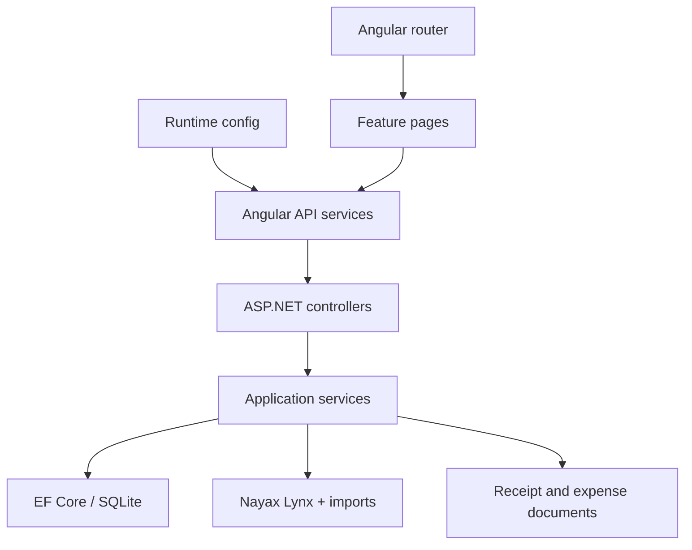
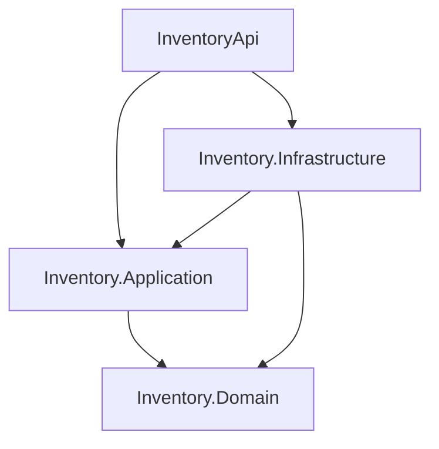
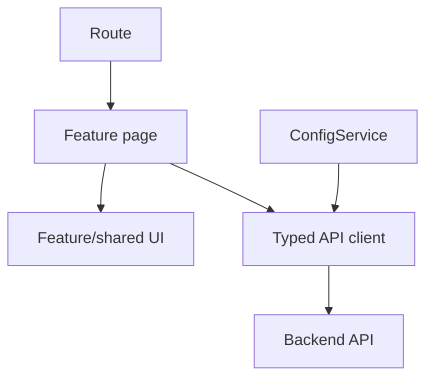
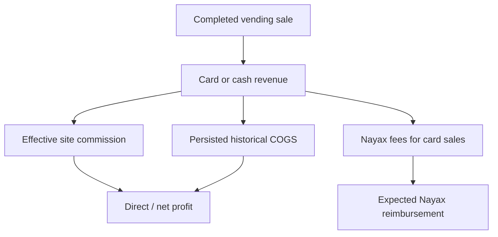

# InventoryApp architecture

## Purpose

InventoryApp is a modular full-stack application for operating a vending-machine business. It manages products, suppliers, purchasing documents, physical stock, supplier orders, machine replenishment, Nayax sales/imports, historical cost, fees, commissions, expenses, reconciliation, and management/accounting reports.

This document describes the repository at the `main` baseline inspected on 17 September 2026 and the intended incremental architecture. It is a guide for maintainers and coding agents; existing tests remain the executable specification.

## Runtime stack

| Area | Technology |
| --- | --- |
| Backend | ASP.NET Core Web API on .NET 10 |
| Persistence | EF Core 10, SQLite, code-first migrations |
| External integration | Nayax Lynx HTTP API and imported reimbursement/workbook data |
| Documents | Purchase and operating-expense files behind `IDocumentStorage`, with metadata in SQLite. `DocumentStorage:Provider` selects the implementation: `FileSystem` (the default) keeps them under the content root's `protected-files/`, outside the web root, with a legacy `wwwroot/{category}` read fallback; `AzureBlob` keeps them in a private Azure container under `tenants/{businessId}/...`, authenticated with a managed identity. Static-file middleware is disabled and no SAS or public URL is ever generated, so no document has an anonymous URL |
| Observability | Azure Monitor OpenTelemetry (`Azure.Monitor.OpenTelemetry.AspNetCore`) exporting requests, dependencies, metrics, `ILogger` logs and exceptions to Application Insights, registered only when `APPLICATIONINSIGHTS_CONNECTION_STRING` is configured. See [Observability and error telemetry](#observability-and-error-telemetry-issue-165) |
| Frontend | Angular 19 standalone components, TypeScript, RxJS, Tailwind-based styling |
| Backend tests | xUnit, Moq, EF Core InMemory and SQLite |
| Hosting | Azure App Service API and Azure Static Web Apps frontend |
| Automation | GitHub Actions |

### SQLite operating assumptions and scale strategy (issue #53)

The production database is the single SQLite file EF Core opens through
`ConnectionStrings:DefaultConnection` (`backend/InventoryApi/appsettings.json`), which defaults to
`Data Source=inventory.db` — a path relative to the API process's working directory
(`backend/InventoryApi/Program.cs`). No committed `appsettings.Production.json` overrides that
default; a different value can only come from an App Service application setting
(`ConnectionStrings__DefaultConnection`), which is Azure configuration outside this repository and
not verifiable from source.

**Where the file lives and what persists.** Azure App Service keeps exactly one directory durable
across process restarts and reboots, and shared across every instance if the plan ever scales to
more than one: `/home` (Windows: `d:\home`), mounted from the platform's own storage rather than
the ephemeral per-instance disk. A normal zip/package deployment through `azure/webapps-deploy@v2`
(`.github/workflows/vm-manager.yml`) extracts the published output under `/home/site/wwwroot`, so
the default relative `inventory.db` path resolves inside that persistent directory today, and the
file survives ordinary app restarts.

That default is fragile for two reasons this repository cannot verify from source, because they
are Azure App Service configuration, not code:

1. **Run-From-Package.** If the App Service is configured with `WEBSITE_RUN_FROM_PACKAGE=1` (a
   common App Service deployment mode), `wwwroot` is mounted **read-only** from the deployed
   package, and a relative `inventory.db` path would not be writable at all. Confirm this setting
   for the live app before relying on the default relative path.
2. **Deployment overwrite.** Even where `wwwroot` is writable, it is also the deployment target.
   Placing the database file inside the same directory the deployment pipeline writes to is an
   avoidable risk, independent of exactly how a given deployment happens to behave.

**Operational recommendation** (an App Service configuration change, not a code change — this
issue does not alter any production setting): point `ConnectionStrings__DefaultConnection` at an
absolute path outside `wwwroot` but still under the persistent `/home` mount, for example
`Data Source=/home/data/inventory.db`, and confirm `WEBSITE_RUN_FROM_PACKAGE` is unset or `0` for
this app. A human operator must make and verify this against the live App Service; it is not
something an automated agent may apply (`AGENTS.md` reserves Azure/App Service configuration
changes for humans).

**Concurrency and locking limits.** The API opens the database with `Microsoft.Data.Sqlite`'s
default journal mode (rollback journal, not WAL — nothing in `Program.cs` configures
`journal_mode`) and the driver's default busy timeout (`Default Timeout=30`, i.e. 30 seconds).
SQLite allows unlimited concurrent readers but only one writer at a time; a second writer blocks
for up to the busy timeout and then fails with `SQLITE_BUSY` rather than queuing indefinitely. In
this single-process deployment that is a soft limit on request latency under write-heavy
concurrent load (for example simultaneous imports and sale-costing writes), not a hard outage —
but it does not extend to multiple concurrently writing processes: **the App Service plan for this
app must stay pinned to a single instance (no scale-out) while SQLite remains the store.** SQLite's
file locking is unreliable over the kind of shared, network-backed storage `/home` becomes once
more than one instance mounts it, so running two instances against the same database file is not a
supported configuration.

**Monitoring signals that indicate SQLite pressure** — none of these are wired into automated
alerting today (that is future work, not part of this change), but are the observable evidence
worth watching for:

- `SQLITE_BUSY`/timeout exceptions in the application log
  (`Microsoft.Data.Sqlite.SqliteException` with `SqliteErrorCode == 5`), especially clustered
  around import or reconciliation jobs.
- API request latency growth specifically on write endpoints (imports, sale costing, purchases,
  stock adjustments) that does not correlate with CPU/memory pressure — a symptom of writers
  queued behind the single-writer lock rather than genuine compute cost.
- Database file size approaching the App Service plan's storage quota, or backup/restore
  durations (see below) growing enough to threaten the business's recovery-time expectations.

The first two are searchable in Application Insights once the connection string is configured (see
[Observability and error telemetry](#observability-and-error-telemetry-issue-165)); turning either
into an alert or a paging rule remains the future work this paragraph describes.
- Any deliberate move to more than one App Service instance for this app, which SQLite's
  single-writer, file-locking model does not support safely.

**Measurable triggers to migrate to a server database (Azure SQL or PostgreSQL).** Any one of
these is a concrete, evidence-based reason to plan the migration, not a speculative one:

1. The App Service plan needs more than one concurrently running instance (for availability or
   throughput) — SQLite cannot be safely shared across instances at all.
2. Recurring `SQLITE_BUSY` write-timeout errors under normal (non-incident) load, observed rather
   than anticipated.
3. A verified backup/restore cycle (see below) exceeds the business's acceptable recovery time
   because the file has grown large enough that a full-file backup and restore no longer fits the
   maintenance window.
4. A second live business is onboarded whose Nayax integration needs to run concurrently with the
   first (see [Tenant ownership](#tenant-ownership-issue-64): the Nayax client is single-tenant
   today) in a way that increases concurrent write load beyond what one SQLite writer sustains.

None of these are currently met; the current single-business, single-instance deployment is within
SQLite's supported envelope. This issue does not migrate the database (explicitly out of scope for
issue #53); it defines what would justify doing so.

**Where a server-database migration would live.** If one of the triggers above is met, the target
is a Clean Architecture change, not a drop-in connection-string swap. Since issue #307
`AppDbContext`, the EF entities (`Inventory.Infrastructure/Models`) and the migrations
(`Inventory.Infrastructure/Migrations`) are owned by `Inventory.Infrastructure`, which is where a
provider migration belongs too — behind the same narrow persistence ports this document already
describes for migrated features, so `Inventory.Domain` and `Inventory.Application` stay unaware of
which relational engine is in use.

What stays in `InventoryApi` is the provider *choice*, not the model: `Program.cs` holds the
`Microsoft.EntityFrameworkCore.Sqlite` package reference and the single `options.UseSqlite(...)`
call that reads `ConnectionStrings:DefaultConnection`, and `InventoryApi/Bootstrap` holds
`DatabaseSchemaStartup` and the `migrate-database` command. A provider swap therefore touches the
composition root and `Inventory.Infrastructure`, and must leave the EF entities and the applied
migration history alone.

**The `dotnet ef` arguments changed with that move.** The migrations project and the startup
project are now different projects, so the tooling needs both:

```bash
dotnet ef migrations add <Name> \
  --project backend/Inventory.Infrastructure \
  --startup-project backend/InventoryApi
dotnet ef migrations has-pending-model-changes \
  --project backend/Inventory.Infrastructure \
  --startup-project backend/InventoryApi
```

No `MigrationsAssembly` configuration is needed: EF Core resolves the migrations assembly from the
`DbContext`'s own assembly by default, and the context and its migrations are in the same project
(`MigrationRelocationTests.Inventory_Infrastructure_is_the_migrations_assembly` asserts exactly
that, so splitting them again fails a test rather than a deployment).

**Backup and restore procedure.** SQLite's Online Backup API — the same engine feature the
`sqlite3` CLI's `.backup` command and `Microsoft.Data.Sqlite`'s
`SqliteConnection.BackupDatabase` both call — copies a consistent snapshot of the database to a
new file without requiring the source connection, or the API process holding it, to stop.
`backend/Inventory.IntegrationTests/Operations/SqliteBackupRestoreTests.cs` proves this mechanically: it
backs up a live SQLite file while the source connection that created it stays open (mirroring a
running API process) and confirms the resulting copy passes `PRAGMA integrity_check` and contains
exactly the committed rows, then proves a second backup taken later, still without closing that
connection, reflects the writes committed in between.

**The supported command (issues #331 and #332).** `backend/InventoryApi`'s published executable has
a `backup-database` CLI mode, dispatched before the web host is built — the same early-command
pattern as `bootstrap-business` and `migrate-database`, so taking a backup and starting the API
are mutually exclusive paths through `Program.cs` and never run during normal startup. It takes
exactly one of two mutually exclusive modes: `--output <path>` retains a verified snapshot at a
path the operator names (issue #331), and `--upload` stages a verified snapshot, uploads it to the
private backup container, and removes the local copy (issue #332, described below). They are
mutually exclusive because they dispose of the snapshot in opposite ways; passing both is refused
rather than resolved by guessing. It opens the
same configured database the API would (`ConnectionStrings:DefaultConnection`, falling back to the
relative `Data Source=inventory.db` default — that relative default is not rejected merely for
being relative, only if the resolved file does not exist or cannot be opened), copies it with the
same Online Backup API described above (never a filesystem `cp`), and refuses an `--output` path
that already exists, matches the source, or sits inside the API's content root/web root, so a
snapshot can never land somewhere a redeploy or publish step would silently discard or overwrite
it. Once the snapshot is written it runs `PRAGMA integrity_check` itself and reports the result,
the snapshot's SHA-256, and the elapsed duration — without ever printing the connection string — and
exits non-zero on any failure:

```bash
dotnet InventoryApi.dll backup-database --output /home/data/backups/inventory-20260101T000000.db
```

This is the command the scheduled backup WebJob (issue #333, below) also calls; routine backups
are scheduled, not run by hand. Manual, one-off verification uses the identical command.
Retention/alerting and automated restore remain out of scope for this command — retention is a
storage-lifecycle policy and alerting is an Azure Monitor rule, both human-applied (see [Backup
retention, alerting and restore rehearsal](#backup-retention-alerting-and-restore-rehearsal-issue-334)
below), and restore stays the deliberate, human-run `sqlite3` procedure below.

**Uploading the verified snapshot off the instance (issue #332).** `backup-database --upload` is
the create-verify-upload workflow, in one command:

```bash
dotnet InventoryApi.dll backup-database --upload
```

It takes and verifies the snapshot exactly as the retained mode does — Online Backup API,
`PRAGMA integrity_check`, SHA-256 — but into a staging file under the OS temporary path
(`inventoryapp-backup-staging/`), which is outside the API's content root and `wwwroot`; the same
content-root guard that protects `--output` still checks the staged path rather than trusting it.
Each invocation stages into its own freshly named subdirectory of that staging root
(`run-<yyyyMMdd>T<HHmmss>Z-<random>/`) rather than straight into it, because the UTC instant is
precise only to the second: two runs that overlap — the scheduled job and an operator running the
command by hand, or a slow upload still in flight when the next run starts — must not contend for
one path, and neither run's cleanup may remove the other's snapshot while it is still being
uploaded. Only a snapshot that completed and passed verification is uploaded: the uploader accepts
a type that can only describe a verified snapshot, and re-hashes the staged file against the
checksum verification produced before sending a byte, so a staged copy that was replaced or
truncated in between is refused. The staged file (and any SQLite sidecar files) are removed in a
`finally` path after success, failure, or an exception such as an unreachable storage account,
followed by the run's own now-empty directory — the cleanup deletes only those paths, by name and
inside that directory, so another run's staged snapshot and anything an operator keeps in the
staging root are never touched. A cleanup that could not finish is reported and exits non-zero
rather than quietly leaving a complete copy of every business's data on the instance's disk. Exit
code is `0` only when the snapshot verified, the upload verified, and nothing was left behind.

Each run writes to a private container, under two prefixes:

| Object | Name | Written |
|---|---|---|
| Per-snapshot | `daily/inventory-<yyyyMMdd>T<HHmmss>Z.db` | Every run, from the snapshot's UTC instant |
| Per-month recovery point | `monthly/<YYYY-MM>/inventory-<YYYY-MM>.db` | On the first successful upload in that UTC calendar month |

The monthly recovery point is chosen by the upload itself, not by a storage lifecycle rule: a rule
can expire objects, but nothing in the account knows which daily snapshot a month should keep. The
name is deterministic from the month alone, and the write is a conditional create
(`If-None-Match: *`), so "is this the first upload of this month?" is answered by the service in
the same request that would write it. Three consequences matter operationally: a month whose first
scheduled run was missed still gets a recovery point from whichever verified snapshot arrives
first (including a manual `--upload` early in the month, which is acceptable because it is a
verified snapshot); a retry or any later upload in the same month leaves the existing monthly
object byte-for-byte unchanged and reports it as already present rather than as a failure; and no
object under either prefix is ever overwritten — an occupied `daily/` name stops the run instead.
The seam the uploader is written against (`IBackupBlobContainer`) has no delete and no overwrite
operation at all, so retention cannot be performed by this code path even accidentally.

Each uploaded object carries three pieces of metadata — `createdutc` (the snapshot's UTC instant),
`sha256` (the checksum verification computed) and `kind` (`daily` or `monthly`). They are
operational facts, readable from a storage browser; none describes, samples or summarises the data
inside the snapshot, and none is or can become a credential. The upload is then verified as
completed by reading each object's length and recorded checksum back and comparing them to the
snapshot that was sent — the content itself is never downloaded. A write the service accepted but
did not store as sent is reported as a failure, not as a recovery point.

**Required configuration, identity and container (issue #332).** Two non-secret settings, read
from App Service application settings or environment variables, and read only by this command:

```text
BackupStorage__BlobServiceUri=https://<storage-account>.blob.core.windows.net
BackupStorage__ContainerName=database-backups          # database-backups-dev for development
```

There is no account key, SAS token, client secret or storage connection string to configure, and
none is accepted: authentication is `DefaultAzureCredential` — the App Service's managed identity
when the scheduled job runs the command, and the operator's own Azure sign-in when they run it by
hand — and the configuration gate rejects a service URI carrying a query string or embedded
credentials, which is what a SAS token or an account key would look like. Nothing in the upload
path logs a credential; the command prints object names, byte counts, the checksum and the
integrity result, never a connection string or snapshot content. An unconfigured or unusable
destination is refused **before** any snapshot is taken, so an upload that cannot reach its
destination never spends time copying the database first.

The human prerequisites below are stated for a human to apply; **no production Azure resource,
role assignment or policy is created or changed by this repository or by any agent**, and the
deployment configuration is not visible here, so a human must verify it before rollout:

| # | Prerequisite | Why |
|---|---|---|
| 1 | A **private** container (for example `database-backups`), separate from the `business-documents` container | A snapshot is a complete copy of every business's data. Its own container keeps its access, retention and auditing independent of document storage, and no public/anonymous access is a hard requirement. |
| 2 | A storage account outside the App Service's own storage failure domain | A backup that lives only next to the database it protects does not survive whatever destroys the database. |
| 3 | **System-assigned managed identity** on the App Service | The command authenticates as the application itself, with no credential stored anywhere. |
| 4 | **`Storage Blob Data Contributor`** granted to that identity at the narrowest practical scope — preferably the backup container alone | Least privilege for what this flow actually does: create an object that does not exist and read object properties back. `Storage Blob Data Reader` cannot write; account-wide Contributor would also grant access to business documents. Delete is not required by this flow — retention is separate, human-controlled work. |
| 5 | Encryption confirmed: **at rest** by Azure Storage service-side encryption (AES-256, enabled on every account and not optional), and **in transit** by HTTPS/TLS — the configuration gate refuses any non-loopback endpoint that is not `https`, and "secure transfer required" should be enabled on the account | The snapshot contains financial and business records. Infrastructure-level encryption is the expectation for both states; the final encryption policy (including any customer-managed key) remains a human decision. |

The equivalent operator procedure, using the `sqlite3` CLI (the standard SQLite tool;
<https://sqlite.org/cli.html>) against the App Service's persistent database path, remains
available for a host where the published `dotnet` application is not on hand, or to rehearse the
underlying mechanism:

1. **Prefer a quiet window, but do not rely on stopping the app.** The Online Backup API produces
   a consistent snapshot even while writes continue; stopping the App Service first (or scaling to
   zero) removes any residual risk but is not required for backup correctness. Do not run a plain
   filesystem `cp` of the `.db` file while the app is running — unlike the backup API, a raw copy
   can capture a database file mid-write and is not guaranteed consistent.
2. **Take the backup:**

   ```bash
   sqlite3 /home/data/inventory.db ".backup '/home/data/backups/inventory-$(date +%Y%m%dT%H%M%S).db'"
   ```

3. **Verify the backup immediately**, before trusting it:

   ```bash
   sqlite3 /home/data/backups/inventory-<timestamp>.db "PRAGMA integrity_check;"
   ```

   A result other than a single `ok` row means the backup is not trustworthy; take it again.
4. **Store the verified backup somewhere other than the App Service's own `/home` mount** (for
   example downloaded to a workstation, or uploaded to separate storage) — a backup that lives only
   next to the database it protects does not survive whatever destroys the database.
   `backup-database --upload` is the supported, automated form of this step; this manual
   alternative exists for a host where the published `dotnet` application is not on hand.
5. **Restore** by stopping the API, replacing the live database file with the verified backup (or
   pointing the connection string at the restored file), and starting the API again:

   ```bash
   sqlite3 /home/data/backups/inventory-<timestamp>.db ".backup '/home/data/inventory.db'"
   ```

   Restoring does overwrite live data and must only be run deliberately, by a human, after
   confirming the target file is the one meant to be replaced — this is the one step in the
   sequence that is not safe to automate or run against a live app.

This procedure, and the non-destructive local check in the README, do not touch any production
connection string, credential, or data; every example above uses a placeholder path that a human
operator supplies for their own environment.

**Database operations that change stored business data are named maintenance operations, never ad hoc
SQL.** `bootstrap-business`, `migrate-documents`, the historical GST classification Preview/Apply, the
costing repair and the [Nayax sale timestamp repair](#nayax-sale-timestamp-repair-preview-then-apply-issue-472)
are the shape every such operation takes: an explicit, reviewable preview; an apply bound to that
preview and refused when the database moved underneath it; an audit row naming what changed, from
which verified source, and which operator confirmed it; and idempotence, so running it again after it
succeeded changes nothing. None of them is reachable by submitting SQL, and the platform diagnostics
API must never become their execution path (AGENTS.md § Architecture rules, § Database and
migrations).

Two of this procedure's steps are load-bearing for such an operation, and the repair runbook below
names them explicitly: **step 2 and 3 - a verified snapshot taken and `PRAGMA integrity_check`ed
before the apply** - are the recovery point, because an apply that succeeded is not undone by the
application (there is no reversal path for an audited historical correction, by design); and **step 5
- the deliberate, human-run restore** - is the only rollback for a repair an operator later judges
wrong. Inside one apply, rollback is the database transaction: a failure leaves nothing behind, which
is a different guarantee from undoing a committed repair and must not be confused with it.

#### Scheduling the backup with an App Service WebJob (issue #333)

A backup must happen whether or not anyone signs in, which is the one workload in this application
that genuinely cannot stay request-driven (see [Azure Functions and background
workloads](#azure-functions-and-background-workloads-decision-criteria-issue-68)). The schedule is
a **triggered Linux App Service WebJob** that runs inside the App Service the API already runs in,
and it ships in the API's own `dotnet publish` output:

```text
backend/InventoryApi/App_Data/jobs/triggered/database-backup/
├── run.sh          # invokes the published executable's backup-database --upload
└── settings.job    # {"schedule": "0 0 15 * * *"} - daily at 15:00 UTC
```

App Service reads a triggered WebJob from `App_Data/jobs/triggered/<job name>/` under the deployed
site root, and that site root is the publish directory, so the two files are declared as publish
content in `InventoryApi.csproj` (`<Content Include="App_Data\jobs\**\*"
CopyToPublishDirectory="PreserveNewest" />`) and need an explicit declaration because the Web SDK's
default content globs cover `wwwroot`, `*.config` and `*.json` only. **Deploy Production** already
publishes that project and deploys the whole output directory, so the job reaches production with
the API and **no GitHub Actions workflow changed** (`.github/workflows/vm-manager.yml` builds and
tests only; it has not published or deployed since issue #343 — see [Build and
delivery](#build-and-delivery)). `App_Data` is not under `wwwroot` and is never served as static
content.

**The job holds no logic, no path and no setting.** `run.sh` invokes the one supported command,
from the application's own directory, and propagates its exit code:

```bash
dotnet InventoryApi.dll backup-database --upload
```

Five properties of that script are deliberate:

- **It names no database.** The database backed up is whatever
  `ConnectionStrings:DefaultConnection` resolves to for the API — an absolute path under `/home` if
  one is configured, or the relative default. The script passes no path and sets no connection
  string, and because it runs the command **from the published application's directory** a relative
  default resolves exactly where it resolves for the running API. Moving the database is therefore
  a configuration change only; nothing in the job has to be edited to follow it.
- **It finds the application rather than assuming its own working directory is it.** App Service
  copies a triggered WebJob's files to a temporary directory before running them, so the script
  looks for `InventoryApi.dll` in `WEBROOT_PATH` (when the platform provides it), then
  `$HOME/site/wwwroot`, then four levels above itself for a host that runs it in place. Not finding
  it fails the run; it never falls back to a guessed path.
- **Exit code is the contract.** `backup-database --upload` exits `0` only when the snapshot
  verified, the upload verified and the staged copy was removed, and the script exits with exactly
  that code, so a failed backup is a failed WebJob run in the job's history rather than a green run
  with a bad log line.
- **It logs the run and nothing sensitive.** A UTC-stamped `START` line, then either `COMPLETED` or
  `FAILED (<reason>)`, both with the elapsed duration. The artifact metadata an operator needs —
  the uploaded `daily/`/`monthly/` object names, the snapshot's SHA-256, its byte count and the
  integrity result — comes from the command's own output, which the job inherits, so there is one
  place that decides what a backup run reports and no second parser to keep in step. Neither the
  script nor the command prints a connection string, a credential, a query or any row of business
  data. The job's own failures use the same `FAILED (<reason>)` shape as the command's, so the
  failed-run alert below catches a job-level failure (the application not found, no `dotnet` host)
  as well as a command-level one.
- **It needs no monthly logic.** The month's single recovery point is created by the upload itself,
  on the first successful upload in each UTC calendar month, scheduled or manual (see above).

**Why 15:00 UTC, and why in the artifact.** The schedule lives in `settings.job` in the deployment
artifact rather than in portal configuration, so it is reviewable in a diff and survives a
redeploy. `settings.job` CRON has **six** fields starting at seconds, so `0 0 15 * * *` is
15:00:00 daily — a five-field expression would silently mean something else. 15:00 UTC is 01:00 or
02:00 in `Australia/Sydney` depending on daylight saving, which is outside trading hours for a
vending business, and it is the cadence the 36-hour missing-backup alert of issue #334 is specified
against. A WebJob's CRON is evaluated in UTC unless the app's `WEBSITE_TIME_ZONE` setting changes
the container's time zone, which is one of the settings a human must confirm below. Changing the
window means changing this file and re-confirming the alert window with it.

**Prerequisites, and what only a human can confirm.** This repository contains no Azure resource
configuration and cannot see the deployed App Service, so the rows below are the operating
assumptions this packaging is built on, each with the human check that confirms it against the live
app. **No agent and no workflow in this repository applies any of them.**

| # | Prerequisite | Why it matters | How a human confirms it |
|---|---|---|---|
| 1 | The app is a **code deployment of the publish output to a Linux App Service** (the mode `deploy-production.yml` performs with `azure/webapps-deploy`), not a custom container | A custom container image does not read `App_Data/jobs`, so the job would never be discovered and this packaging would be the wrong mechanism | The App Service's deployment/publish mode in the portal. If it is ever moved to a container, this job stops working and needs its own issue, not a quiet fix |
| 2 | **WebJobs are available on the plan and the job is listed after a deployment** | The schedule is inert if the platform never registers the job | After the first deployment carrying it, the WebJobs blade lists `database-backup` as `Triggered` with the `0 0 15 * * *` schedule |
| 3 | **Always On** is enabled, which requires **Basic or higher** (Free/Shared cannot) | A scheduled WebJob only fires while the app is running; an idle app that has been unloaded runs nothing, and the missed run is then only visible through issue #334's alert | Configuration → General settings → Always On = On, and the plan tier |
| 4 | The plan stays pinned to **one instance** | The database is a single SQLite file on the App Service's `/home` mount, which is why the whole deployment is single-instance (see above). Scaling out would also multiply the scheduled run | The plan's instance count and any autoscale rule |
| 5 | `ConnectionStrings__DefaultConnection` points at the **persistent, absolute** `/home` path the API actually uses | The job backs up exactly what the API reads. An absolute configured path removes the relative default's dependence on the working directory for both of them | The App Service application setting, read in the portal — never pasted into this repository, an issue or a pull request |
| 6 | `WEBSITE_RUN_FROM_PACKAGE`, if set, still exposes `App_Data/jobs` from the mounted package, and the database is **not** inside `wwwroot` | Run-from-package mounts `wwwroot` read-only; a database inside the deployment target is an avoidable risk either way (see the README) | The application setting, plus confirming the job appears and runs (row 2 and row 7) |
| 7 | The **first scheduled run succeeds end to end** | Everything above is an assumption until one real run has taken a snapshot, uploaded it and exited `0` | The job's run history and its log output, plus the new `daily/` object (and the month's `monthly/` object) in the backup container |
| 8 | The managed identity and backup container prerequisites of issue #332 are in place | The job authenticates as the application; it adds no credential of its own, and there is no secret in the WebJob | The prerequisite table above (private container, system-assigned identity, least-privilege `Storage Blob Data Contributor`) |

Two further notes a human should know when confirming row 2 and row 7. The platform runs a `.sh`
WebJob through a shell, so the script does not rely on its Unix executable bit surviving the
artifact upload, the zip deployment and the extraction — a chain this repository cannot control;
`.gitattributes` does pin the job's files to LF endings in every checkout, because a CRLF `run.sh`
would fail on its first line. And the WebJob is a second process reading the same SQLite file as
the API: that is a reader, not a second writer, and the Online Backup API is what makes it
consistent (see the top of this section), so it stays inside the single-writer envelope the
deployment already requires.

**What the repository verifies, and what it cannot.**
`backend/Inventory.IntegrationTests/Operations/BackupWebJobPackagingTests.cs` asserts the packaging and the
invocation: both files exist at the triggered-WebJob path, the project declares them as publish
content with `CopyToPublishDirectory` (the exact mechanism that puts them in the deployed artifact),
the schedule is the six-field daily 15:00 UTC expression, the script's executable lines name no
database path, connection string or `--output` destination, and — by running the real script under
`bash` against a fake `dotnet` and a throwaway application directory — that it invokes
`InventoryApi.dll backup-database --upload` from the application's directory, exits with the
command's own exit code, logs start, completion/failure and duration, and fails without invoking
anything when the application is not found. No test takes a backup, reaches Azure or runs
`dotnet publish`. **Nothing about the live plan, Always On, the connection string or the schedule
actually firing is verified from this repository**; those are rows 1-7 above.

#### Backup retention, alerting and restore rehearsal (issue #334)

Taking and uploading a verified snapshot (#331, #332) and scheduling it (#333) answer "does a
recovery point exist?". Three questions are left, and this subsection answers all three as
**design and operator instructions only**:

1. **Retention** — backup storage must stay bounded without losing the long-horizon recovery
   points, which is a storage-lifecycle question, not a compute one.
2. **Alerting** — a failed run and a run that never happened must both become visible, because an
   unnoticed gap in backups is only discovered when a restore is needed.
3. **Rehearsal** — a backup nobody has ever restored is an assumption, so restoring must be
   practised somewhere that is not production.

**Nothing here creates or changes an Azure resource.** This repository contains no Bicep,
Terraform or Azure resource configuration, and deliberately gains none in this change: the
lifecycle policy, the diagnostic settings, the action group and the two alert rules are **human
production setup steps**, listed with their verification in [Human production setup, and how to
verify it](#human-production-setup-and-how-to-verify-it) below. No agent and no workflow in this
repository may apply them. The values below (30 days, 12 months, 36 hours, the proposed severities
and destination) are proposals that a human confirms against the business's recovery point and
recovery time objectives before applying them; see [Decisions a human must confirm
first](#decisions-a-human-must-confirm-first).

**Retention: an Azure Blob lifecycle policy on the backup container.** Retention is expressed as a
storage-account lifecycle management policy, not as code. That choice is deliberate and matters for
safety: the lifecycle engine deletes as the storage *service*, so the App Service's managed
identity still needs nothing beyond the create/read permissions prerequisite 4 above grants it, the
`IBackupBlobContainer` seam still has no delete or overwrite operation, and no application code
path — scheduled or manual — can ever remove a recovery point. Retention and backup creation stay
in different hands on purpose.

The policy expires per-snapshot objects after 30 days and monthly recovery points after 12 months:

```json
{
  "rules": [
    {
      "enabled": true,
      "name": "expire-daily-database-snapshots-after-30-days",
      "type": "Lifecycle",
      "definition": {
        "filters": {
          "blobTypes": [ "blockBlob" ],
          "prefixMatch": [ "database-backups/daily/" ]
        },
        "actions": {
          "baseBlob": {
            "delete": { "daysAfterCreationGreaterThan": 30 }
          }
        }
      }
    },
    {
      "enabled": true,
      "name": "expire-monthly-recovery-points-after-12-months",
      "type": "Lifecycle",
      "definition": {
        "filters": {
          "blobTypes": [ "blockBlob" ],
          "prefixMatch": [ "database-backups/monthly/" ]
        },
        "actions": {
          "baseBlob": {
            "delete": { "daysAfterCreationGreaterThan": 365 }
          }
        }
      }
    }
  ]
}
```

Applying and reading it back (the operator's own Azure sign-in; `--policy @<file>` takes exactly
the JSON above):

```bash
az storage account management-policy create \
  --account-name <storage-account> --resource-group <resource-group> \
  --policy @backup-lifecycle-policy.json

az storage account management-policy show \
  --account-name <storage-account> --resource-group <resource-group>
```

Eight properties of that policy are decisions rather than syntax:

- **A lifecycle `prefixMatch` starts with the container name**, so the prefixes above must be
  edited to match whatever `BackupStorage__ContainerName` is actually set to. The development
  container (`database-backups-dev`) needs its own rules — a second prefix entry when it shares the
  account, or the same policy applied to its own account — because a policy is per storage account
  and a prefix is per container.
- **The two prefixes are disjoint and nothing broader is ever used.** A rule whose prefix were the
  container alone, or the shared `inventory-` file-name stem, would match both object families and
  expire the monthly recovery points after 30 days. The prefixes are the whole safety mechanism
  here, which is why the uploader writes two separate prefixes rather than one flat namespace.
- **The `kind` metadata (`daily`/`monthly`) cannot be used as a filter.** Lifecycle rules can match
  blob index tags, not blob metadata, and the uploader writes metadata. The prefix is therefore the
  only discriminator available, and the metadata stays what it was designed to be: an operational
  fact a human reads from a storage browser.
- **`daysAfterCreationGreaterThan`, not `daysAfterModificationGreaterThan`.** No object under
  either prefix is ever overwritten (an occupied `daily/` name stops the run; the monthly object is
  a conditional create), so creation is the snapshot's own instant and the only age that means
  anything. Measuring from a modification time would make retention depend on an event that by
  design never happens.
- **12 months is written as 365 days**, because the policy's unit is whole days. In a 12-month
  window containing 29 February the deletion therefore falls one day before the calendar
  anniversary; a human who wants the anniversary guaranteed sets 366 instead. This is an
  approximation that is documented rather than hidden.
- **Deletion is not instantaneous.** The lifecycle engine runs once a day, changes to a policy can
  take up to 24 hours to take effect and the first run after enabling can take up to 48 hours, so
  an object a day or two past its threshold is expected, not a policy failure. Nothing in the
  recovery design depends on prompt deletion.
- **Blob soft delete needs no extra action, and does not unbound retention.** With soft delete
  enabled on the account, an object the lifecycle engine deletes becomes a soft-deleted blob and is
  retained for the account's soft-delete retention period, after which the storage service
  permanently deletes it by itself. Nothing has to be added to the policy above to purge
  soft-deleted blobs, and no lifecycle action can target them. Retention therefore stays bounded:
  the only effects are that the container's billed size trails the policy by the soft-delete window,
  and that a mis-scoped prefix stays recoverable for that long. Enabling a short soft-delete window
  purely as that safety net is a reasonable human decision (see [Decisions a human must confirm
  first](#decisions-a-human-must-confirm-first)), and it is a decision, not a requirement. With soft
  delete off, a lifecycle delete is immediate and permanent and a mis-scoped prefix is
  unrecoverable — which is what the disjoint prefixes above exist to prevent.
- **Blob versioning and snapshots do need their own actions.** This is the case where the policy
  above would be genuinely incomplete. Previous versions and snapshots are not covered by a
  `baseBlob` action, so bounded retention requires adding the matching `version` and `snapshot`
  delete actions; without them those copies accumulate behind the expired current versions. Either
  feature can also change what happens to the current version — with versioning enabled a
  `baseBlob` delete turns the current version into a previous version rather than removing the data,
  and a base blob that still has an active snapshot is not removed by a `baseBlob` delete at all.
  Neither feature is enabled on the backup container by this design, and leaving both off is the
  recommendation: a backup object is written once and never modified, so a version or snapshot of it
  carries nothing the `daily/`/`monthly/` names do not already carry. A human who turns either on
  owns extending this policy in the same change and confirming with `az storage account
  management-policy show` that the extra actions are present.

**How a monthly recovery point survives daily expiry.** The 30-day rule and the 12-month rule
would be in conflict if the month's recovery point were a *reference* to a daily snapshot. It is
not, and three independent properties keep the two retention horizons from interacting:

1. **The monthly object is its own complete copy, written by the upload itself.** The uploader
   creates `monthly/<YYYY-MM>/inventory-<YYYY-MM>.db` on the **first successful upload of that UTC
   calendar month** — a full-content write, not a snapshot, a soft link, a tag or a server-side
   reference to a `daily/` object. Deleting every `daily/` object in that month leaves it
   byte-for-byte intact.
2. **It is created at the start of the month, not at the end of the daily horizon.** With the daily
   schedule of #333 the month's recovery point exists within a day of the month beginning, roughly
   29 days before the earliest `daily/` object of that month can reach 30 days. There is no window
   in which a month has no recovery point but its daily objects are already expiring, and no
   ordering dependency between the lifecycle engine and the backup job.
3. **The prefixes isolate the rules.** The daily rule cannot match a `monthly/` name, so the only
   way to lose a monthly point to retention is to broaden a prefix — the mistake the second bullet
   list above exists to prevent.

The consequence is a predictable recovery horizon: every day of the last 30 days, plus one verified
point per month for the last 12 months, and the oldest monthly point disappearing about a year
after the month it represents. The one case that produces no monthly recovery point at all is a
calendar month in which **no** upload ever succeeded — which is exactly what the missing-backup
alert below exists to make impossible to miss, rather than something retention can repair.

**Alerting: a failed run and a missing backup are two different signals.** The scheduled job can
fail in two shapes, and only covering both makes silence unambiguous (the observability criterion
in [Azure Functions and background workloads](#azure-functions-and-background-workloads-decision-criteria-issue-68)
demands exactly that: "nothing in the log" and "the job never started" must be distinguishable):

| Alert | What it catches | Source | Why this source |
|---|---|---|---|
| **Backup run failed** | A run that happened and reported failure: the command exited non-zero because the snapshot, its `PRAGMA integrity_check`, the upload, the upload's read-back verification, or the staged-copy cleanup failed | Log search over the App Service's `AppServiceConsoleLogs` diagnostic category in a Log Analytics workspace | App Service exposes no platform **metric** for a WebJob's exit code, so the non-zero result has to be observed through the job's log output. The `backup-database` command already prints a distinctive failure line before exiting non-zero |
| **No backup in 36 hours** | A run that never happened or produced nothing: the WebJob disabled, removed by a deployment, starved by Always On being off, the App Service stopped, or a "successful" run that wrote no object | Log search over `StorageBlobLogs` for successful writes under the `daily/` prefix | It observes the **artifact** rather than the job's own claim about itself. A job that cannot run also cannot report that it did not run, so the absence of a recovery point has to be detected somewhere other than in the job |

*Alert 1 — failed backup run.* Exit code is the contract: `backup-database` exits `0` only when the
snapshot verified, the upload verified and nothing was left behind, and the WebJob of #333 exits
with that code unchanged. The queryable manifestation of that exit code is the command's own
output, which the WebJob inherits — plus the job's own `FAILED (<reason>)` line, written in the same
shape for a failure before the command is reached (see [Scheduling the backup with an App Service
WebJob](#scheduling-the-backup-with-an-app-service-webjob-issue-333)):

```kusto
AppServiceConsoleLogs
| where _ResourceId =~ "<app-service-resource-id>"
| where ResultDescription contains "FAILED ("
    or ResultDescription contains "Database backup - REFUSED:"
    or ResultDescription contains "No snapshot was uploaded:"
    or ResultDescription contains "Staged copy     : NOT REMOVED"
| project TimeGenerated, ResultDescription
```

Rule settings: evaluation frequency 1 hour, time range **2 hours**, threshold "number of results
greater than 0", severity 2. The window is deliberately twice the frequency. A rule evaluates only
over log data that has already been ingested, and both ingestion and evaluation can be delayed, so
a window equal to the frequency does **not** guarantee that every minute is examined exactly once:
a failure line that lands after its own hour was evaluated would never be looked at again. The
overlapping hour means a failure line is normally examined twice and one failed run can notify
twice, which is accepted for the same reason as Alert 2's 36-hour window — for the business's last
line of defence a duplicate notification is a far cheaper mistake than a missed one. A human who
prefers at most one notification per failure sets the time range equal to the frequency instead,
and accepts that a late-ingested failure line can then be missed entirely. Two further caveats a
human must close when applying it: confirm which diagnostic category actually carries the job's
standard output on the deployed plan (on a Linux App Service the container's stdout/stderr lands in
`AppServiceConsoleLogs`) and re-check the query against one real failed run of the job, because
this alert was specified before the job that feeds it existed. Where
`APPLICATIONINSIGHTS_CONNECTION_STRING` is configured (see [Observability and error
telemetry](#observability-and-error-telemetry-issue-165)), the same `ILogger` output is also
queryable in Application Insights `traces`; the rule above deliberately does not depend on that,
because a backup alert should not be switched off by a telemetry setting.

*Alert 2 — no `daily/` object within 36 hours.* The query asks the storage account whether a new
per-snapshot object actually arrived:

```kusto
StorageBlobLogs
| where AccountName == "<storage-account>"
| where OperationName in ("PutBlob", "PutBlockList")
| where StatusText == "Success"
| where Uri contains "/database-backups/daily/"
| summarize uploads = count()
| where uploads == 0
```

Rule settings: evaluation frequency 1 hour, time range **36 hours**, threshold "number of results
greater than 0", severity 1. Three details are load-bearing:

- **`summarize` without a `by` clause returns one row even when nothing matched**, so `uploads == 0`
  produces a row to alert on. A query that merely filtered rows would return nothing in the failure
  case and fire no alert — the classic way a missing-signal alert silently never works.
- **Do not enable the rule's "alert on no data" option.** The healthy case legitimately returns no
  rows; treating no data as a failure would invert the alert.
- **36 hours is chosen against #333's daily 15:00 UTC schedule.** A 24-hour cadence means one
  missed or failed run leaves the newest recovery point 24 hours stale, and the alert fires 12
  hours after the missed run rather than waiting for a second consecutive miss. It therefore
  tolerates nothing worse than a single late run, while leaving enough slack for a slow upload or a
  rescheduled window not to page anyone. The trade-off is accepted deliberately: a single transient
  failure that the next run would have healed still raises one alert, which for the business's last
  line of defence is the right direction to err in.

Both rules need the same two prerequisites — a diagnostic setting on the **App Service** sending
`AppServiceConsoleLogs`, and one on the storage account's **blob service** sending `StorageWrite`,
both to the same Log Analytics workspace — plus an action group holding the destination. Two things
to note when enabling the storage setting: `StorageWrite` logs every write to the account,
including the `business-documents` container, so it carries business document object names (never
content, and never a credential) and has a volume and retention cost; and a short workspace
retention is appropriate for both reasons. The alert's action group must notify a human and must
**not** invoke an automation runbook, Logic App or Function that restores anything — see the
prohibition below.

**Restore rehearsal in a separate test location.** A recovery point is only proven by restoring it,
so the rehearsal below is the evidence that the backup chain works. It is deliberately a *copy*
procedure: every step reads from the backup container and writes only inside a throwaway directory,
and no step touches the live database file, the production connection string or production
configuration. A rehearsal needs no more than read access to the backup container (the operator's
own Azure sign-in with `Storage Blob Data Reader` is enough — it never writes to the container, and
must not be given a role that could).

1. **Choose the recovery point and record its facts.** The newest `daily/` object proves the
   current chain; a `monthly/` object proves the long-horizon one, and a rehearsal should
   occasionally use a monthly point rather than always the newest daily snapshot. Read back the
   object's `createdutc`, `sha256` and `kind` metadata:

   ```bash
   az storage blob metadata show --auth-mode login \
     --account-name <storage-account> --container-name database-backups \
     --name daily/inventory-<yyyyMMdd>T<HHmmss>Z.db
   ```

2. **Download into a dedicated, empty test location** — a workstation or a non-production host,
   outside any API content root, `wwwroot` and `/home/data`, and never over an existing file:

   ```bash
   rehearsal_dir="$HOME/restore-rehearsal/$(date -u +%Y%m%dT%H%M%SZ)"
   mkdir -p "$rehearsal_dir"
   az storage blob download --auth-mode login \
     --account-name <storage-account> --container-name database-backups \
     --name daily/inventory-<yyyyMMdd>T<HHmmss>Z.db \
     --file "$rehearsal_dir/inventory-restored.db"
   ```

3. **Verify the checksum** of the downloaded file against the `sha256` metadata from step 1 — the
   same checksum the upload verified before and after transfer, which is what makes this an
   end-to-end check of the whole path rather than of the download alone:

   ```bash
   sha256sum "$rehearsal_dir/inventory-restored.db"   # shasum -a 256 on macOS; Get-FileHash on Windows
   ```

   A mismatch ends the rehearsal: the object is not a recovery point, and that is an incident to
   investigate before the next scheduled run, not something to retry.
4. **Verify integrity**, which must return exactly one `ok` row:

   ```bash
   sqlite3 "$rehearsal_dir/inventory-restored.db" "PRAGMA integrity_check;"
   ```

5. **Run application-level checks against the copy.** Integrity only proves the file is a
   structurally sound SQLite database; these prove it is *this application's* database and that the
   current code can work with it:

   ```bash
   sqlite3 "$rehearsal_dir/inventory-restored.db" "PRAGMA foreign_key_check;"            # no rows
   sqlite3 "$rehearsal_dir/inventory-restored.db" \
     "SELECT MigrationId FROM __EFMigrationsHistory ORDER BY MigrationId DESC LIMIT 1;"

   ConnectionStrings__DefaultConnection="Data Source=$rehearsal_dir/inventory-restored.db" \
     dotnet InventoryApi.dll migrate-database --dry-run
   ```

   `migrate-database --dry-run` is an early CLI mode that never builds the web host and never
   applies anything, so it reports whether the snapshot's schema matches the deployed code —
   "already up to date", or the exact list of migrations a restore of this snapshot would need —
   while leaving the copy unmodified. Follow it with business-level spot checks that compare the
   copy against figures already known for a **closed** period: machine, product, sale and purchase
   row counts, the latest sale date, that every tenant-owned row still carries its owning business,
   and one or two report totals (a closed month's bookkeeping figures, for example) against what
   was recorded for that month. For a fuller rehearsal a non-production API instance can be pointed
   at the copy and the report loaded through the application; that instance must use its own
   non-production Nayax, Entra and storage settings, never production ones.
6. **Record the evidence.** A rehearsal that leaves no record cannot be relied on later. Note the
   date and operator, the object name and its `createdutc`/`kind`, the checksum comparison result,
   the `integrity_check` and `foreign_key_check` results, the pending-migration result, which
   business figures were compared, and the **elapsed wall-clock time from step 2 to the end of step
   5**. That duration is the measured input to the recovery-time trigger in [Measurable triggers to
   migrate to a server database](#sqlite-operating-assumptions-and-scale-strategy-issue-53) above —
   trigger 3 is otherwise an assumption nobody has tested.
7. **Delete the copy.** The download is a complete copy of every business's financial data. Remove
   the file and the rehearsal directory when the checks are done, never leave it on a shared
   machine, and never commit it:

   ```bash
   rm -rf "$rehearsal_dir"
   ```

Cadence is a human decision (see below), but the rehearsal should at least follow any change to the
backup, upload or restore path, any release that adds migrations touching large or financial
tables, and a regular calendar interval — quarterly is the proposal — so that the recovery-time
measurement stays current rather than historical.

**No automatic overwrite or restore of the live production database.** This is a prohibition, not a
preference, and it binds every participant:

- **No code path, CLI mode, WebJob, GitHub Actions workflow, alert action, automation runbook,
  script or agent may write to, overwrite or replace the live production database file.** The
  `backup-database` command only ever reads the database and writes a new snapshot; nothing in this
  repository restores one. Automating the restore is not a missing feature, it is excluded by
  design.
- **An alert must never trigger a restore.** The two alert rules above notify a human; their action
  group exists to tell somebody that recovery may be needed, and the decision about whether, from
  which recovery point, and when is the human's.
- **A restore is the deliberate, human-run procedure in step 5 of the operator procedure above** —
  stop the API, confirm the target file is the one meant to be replaced, write the verified backup
  over it, start the API again. It overwrites live business data, so it is run by a human who has
  confirmed the target, never by a schedule, a retry, a repair or a convenience script.
- **The rehearsal is not a restore and must never become one.** Every command in it names a
  throwaway path under the rehearsal directory; a rehearsal that writes to `/home/data/inventory.db`
  is a production restore performed by accident, which is why the download, the integrity check,
  the schema check and the cleanup all operate on the copy by name.
- **Recovery from a bad schema migration is a restore, decided by a human** (see
  [Build and delivery](#build-and-delivery)): neither startup nor `migrate-database` rolls a
  migration back, and a failed deployment never gives an agent authority to restore, revert or
  deploy (`AGENTS.md` § Security and deployment safeguards).

##### Human production setup, and how to verify it

Every row below is applied by a human in Azure. This repository creates none of them, has no
infrastructure-as-code to express them, and no agent may apply them; the verification column is how
the human proves the step actually took effect, since none of it is visible from this repository.

| # | Human setup step | How to verify it |
|---|---|---|
| 1 | Apply the lifecycle policy to the backup storage account, with the prefixes edited to the real container name | Read the policy back with `az storage account management-policy show` and compare it to the JSON above. There is no dry run for lifecycle, so also check the first expiry window: more than 31 days after enabling, `az storage blob list --auth-mode login --account-name <storage-account> --container-name database-backups --prefix daily/` should show no object older than about 31–32 days |
| 2 | Confirm the monthly recovery points survived the first daily expiry | The same `az storage blob list` with `--prefix monthly/` lists one object per calendar month since the uploader started, each with its own `createdutc`; none of them disappears when the daily objects of the same month do |
| 3 | Add a diagnostic setting on the App Service sending `AppServiceConsoleLogs` to a Log Analytics workspace | Run the Alert 1 query in Log Analytics over a window containing a known backup run and confirm the job's output is there at all — if the query returns nothing for a run that happened, the category is wrong, not the job |
| 4 | Add a diagnostic setting on the storage account's blob service sending `StorageWrite` to the same workspace | Run the Alert 2 query's body without the final two lines and confirm it lists the `daily/` writes of the last day |
| 5 | Create the action group with the confirmed destination | Use the action group's own test-notification feature and confirm the notification arrives |
| 6 | Create the two log search alert rules with the settings above | For Alert 2, evaluate the query over a window that is known to contain no `daily/` upload (any window before the backup job existed) and confirm it returns a row — this proves the missing-backup detection works without disabling anything in production. For Alert 1, confirm end to end on a **non-production** instance or development container by making a run fail there (for example an unreachable `BackupStorage__BlobServiceUri`); never break the production configuration to test an alert |
| 7 | Run the first restore rehearsal and record its evidence | The recorded rehearsal evidence from step 6 of the rehearsal procedure, including the measured duration |

##### Decisions a human must confirm first

These are not decided by this document, and the parent backup work (#330) is not operationally
complete until they are:

- **Recovery point objective.** The daily schedule of #333 implies up to 24 hours of lost work
  (36 hours before the alert fires). Confirm that is acceptable for a business whose data is
  financial, or change the schedule.
- **Recovery time objective.** Measured by the rehearsal, not assumed. Confirm the measured
  duration is acceptable; a rehearsal that exceeds it is trigger 3 for moving off single-file
  SQLite.
- **Retention values.** 30 days of daily snapshots and 12 months of monthly recovery points, and
  whether any longer-horizon or compliance retention applies to financial records.
- **Alert destination and severity.** Which person or address the action group notifies, and
  whether severity 1/2 matches how they are monitored.
- **Rehearsal cadence**, and who owns running it.
- **Optional blob soft delete** on the backup container as a safety net against a mis-scoped
  lifecycle prefix, and whether blob versioning and snapshots stay disabled on the account. Soft
  delete needs no change to the lifecycle policy; enabling versioning or snapshots does, and the
  policy must be extended in the same change.

## Current repository structure

```text
InventoryApp/
├── backend/
│   ├── InventoryApi/                HTTP boundary and composition root only; the folder set is frozen by ApiLayerOwnershipTests (issue #154)
│   │   ├── Adapters/Mapping/        Response-DTO projections only; no persistence adapter since issue #309
│   │   ├── Adapters/Nayax/          E2ETestNayaxLynxClient, the test double the E2ETest host registers (issue #46)
│   │   ├── Adapters/PlatformDiagnostics/  The ILogger audit adapter, here because the event carries the request correlation id (issue #336)
│   │   ├── App_Data/jobs/           The App Service WebJob that triggers the backup command (issue #333)
│   │   ├── Auth/                    Authentication, authorization, BusinessScopeMiddleware, the E2E test host's scheme and fixture
│   │   ├── Bootstrap/               DatabaseSchemaStartup and the human-invoked commands (host-owned, calling Infrastructure services)
│   │   ├── Controllers/
│   │   ├── DTOs/                    API-owned transport contracts
│   │   ├── Http/                    Exception handlers (ProblemDetails mapping) and the liveness/readiness health checks
│   │   ├── Observability/           Application Insights telemetry registration (issue #165)
│   │   ├── Properties/              Launch and service-dependency settings
│   │   ├── Swagger/                 OpenAPI configuration and the published-schema compatibility boundary
│   │   ├── Program.cs               Composition root; chooses the SQLite provider
│   │   └── InventoryApi.csproj
│   ├── Inventory.Domain/            NayaxFeeSettings rule, reporting policies/calculations (Inventory.Domain.Reporting.<Feature>), Purchases.PurchaseTotalValidationPolicy; other features not yet migrated
│   ├── Inventory.Application/       NayaxFeeSettings use cases/ports, Categories/Suppliers use cases/ports, Nayax.INayaxLynxClient port/DTOs, reporting use cases/contracts (Inventory.Application.Reporting.<Feature>), Purchases.ComputePurchaseTotalValidation, the three Imports use cases (ImportPendingReimbursementXmlFiles, ImportNayaxProductCatalog, ImportNayaxSales) with their source/reader/store ports, Documents.IDocumentStorage, shared Inventory.Application.Time.IClock/IBusinessCalendar; other features not yet migrated
│   ├── Inventory.Infrastructure/    Data/AppDbContext.cs and Data/BusinessOwnershipEnforcer.cs, Models/ (EF entities and enums), Migrations/ (SQLite schema history) — all since issue #307; Reporting.Persistence.Ef<Feature>…FactsProvider (the ten reporting EF fact providers), Reporting.Persistence.EfReportingSharedQueries and Data.EfNayaxSalesQueries — all since issue #308; Persistence.Ef<Feature>Store/Provider (every other EF persistence adapter) and Persistence.NayaxSaleCosting — all since issue #309; Nayax.NayaxLynxClient/NayaxLynxOptions (Nayax Lynx HTTP client) and Nayax.NayaxCatalogSnapshotProvider, SystemClock/CurrentBusinessCalendar/ZonedBusinessCalendar adapters (Inventory.Infrastructure.Time), FileSystemDocumentStorage and AzureBlobDocumentStorage (Inventory.Infrastructure.Documents), FileSystemPendingReimbursementXmlSource and ClosedXmlNayaxSalesWorkbookReader (Inventory.Infrastructure.Imports), Reporting.ReportExportFileWriter (CSV/XLSX byte encoding), Sites.SiteNameResolver, the verified-snapshot blob uploader (Inventory.Infrastructure.Backups); other features not yet migrated
│   │   ├── Data/                    AppDbContext, tenant query filters, BusinessOwnershipEnforcer, EfNayaxSalesQueries
│   │   ├── Migrations/              SQLite schema history and AppDbContextModelSnapshot
│   │   ├── Models/                  EF entities and enums
│   │   ├── Persistence/             Every non-reporting EF adapter behind an Application persistence port (issue #309)
│   │   └── Reporting/Persistence/   The reporting EF fact providers and their shared queries (issue #308)
│   ├── Inventory.UnitTests/         Pure Domain/Application tests; references only Inventory.Domain and Inventory.Application (issue #311)
│   └── Inventory.IntegrationTests/  Database, API, adapter, migration, bootstrap and architecture tests (issue #311)
├── frontend/inventory-app/
│   ├── src/app/
│   │   ├── components/          Feature pages and shared UI
│   │   ├── layout/              Application shell navigation: sidebar, navigation data, user menu, shared breadcrumbs (breadcrumbs/)
│   │   ├── models/              Shared TypeScript contracts
│   │   ├── services/            API clients and UI services
│   │   ├── auth/                Entra redirect callback and the browser authentication providers
│   │   ├── app.config.ts        Angular providers and startup
│   │   └── app.routes.ts        Application routes
│   ├── src/assets/config.json       Runtime API configuration
│   ├── proxy.conf.json              Local API proxy
│   ├── e2e/                         Opt-in Playwright end-to-end suite: its own npm project
│   └── package.json
├── .github/workflows/
├── AGENTS.md
└── scripts/
```

The Angular application uses standalone components. `app.config.ts` registers the router, HTTP client, and a startup initializer that loads the API base URL. Routes load their page components lazily with `loadComponent`, except the public `/auth` Entra redirect callback, which stays eagerly imported (see [Routing and loading](#routing-and-loading)). Pages keep their own view state and call singleton services, which use `HttpClient` to reach the API.

The API's production dependency skeleton (`Inventory.Domain`, `Inventory.Application`, `Inventory.Infrastructure`) is wired into the `InventoryApi` composition root through `AddApplicationServices()`/`AddInfrastructureServices()` extension methods. The Nayax fee-settings slice (GET/POST `api/settings/nayax-processing-fee-rates`) is the first feature moved into this shape: `Inventory.Domain.NayaxFeeSettings.NayaxFeeRate` validates the configured rate, `Inventory.Application.NayaxFeeSettings` holds the `ListNayaxFeeRates`/`SaveNayaxFeeRate` use cases and the `INayaxFeeRateStore` port (`SaveNayaxFeeRate` also takes the shared `Inventory.Application.Time.IClock` port, promoted out of this feature slice into a shared Application abstraction — see [Time](#time)), `Inventory.Infrastructure.Clock.SystemClock` implements `IClock`, and `SettingsController` only binds HTTP input and maps the use-case result. `INayaxFeeRateStore` is implemented by `Inventory.Infrastructure.Persistence.EfNayaxFeeRateStore`, registered by `AddInfrastructureServices()`. It was an API-owned adapter in `InventoryApi/Adapters/Persistence` for most of this migration, because `AppDbContext` and the EF entities were API-owned too; issue #307 moved those into `Inventory.Infrastructure`, issue #308 took the reporting half of the adapter family, and issue #309 (Persistence 8/8 of #153) took this one with the rest. The bookkeeping report (GET `api/reports/bookkeeping`) is the second feature moved into this shape, following the same pattern: `Inventory.Domain.Reporting.Bookkeeping.BookkeepingProfitPolicy` computes profit/margin/GST/net-settlement from already-aggregated facts, `Inventory.Application.Reporting.Bookkeeping.GetBookkeepingReport` is the use case, `IBookkeepingReportFactsProvider` is its narrow port, and `Inventory.Infrastructure.Reporting.Persistence.EfBookkeepingReportFactsProvider` is its EF adapter (API-owned until issue #308 relocated it), now composing the Application-owned fee and commission use cases. `ReportsController` calls `GetBookkeepingReport` directly for that endpoint; at that point in the migration, the legacy `ReportingService.GetBookkeepingAsync` delegated to the same use case so CSV/XLSX export and the GST report (which reuses bookkeeping's result) stayed on one authoritative implementation, until issue #92 removed `ReportingService` entirely (see below). The daily report (GET `api/reports/daily`) is the third feature moved into this shape, following the same pattern: `Inventory.Domain.Reporting.Daily.DailyRowPolicy` computes each day's profit/margin/reconciliation status from already-aggregated facts, reusing the shared `Inventory.Domain.Reporting.ReconciliationStatusPolicy` (placed there, alongside `ReportingCalculations`, so the still-legacy reconciliation report can reuse the same policy once it migrates instead of reimplementing it), `Inventory.Application.Reporting.Daily.GetDailyReport` is the use case, `IDailyReportFactsProvider` is its narrow port, and `Inventory.Infrastructure.Reporting.Persistence.EfDailyReportFactsProvider` is its EF adapter (API-owned until issue #308 relocated it). Its completed-sale cost query and period-level imported-reimbursement summary are shared with `EfBookkeepingReportFactsProvider` through `Inventory.Infrastructure.Reporting.Persistence.EfReportingSharedQueries` rather than duplicated a third time; its per-date reimbursement grouping is specific to daily and has no bookkeeping equivalent. `ReportsController` calls `GetDailyReport` directly for that endpoint; at that point in the migration, the legacy `ReportingService.GetDailyAsync` delegated to the same use case so CSV/XLSX export stayed on one authoritative implementation, until issue #92 removed `ReportingService` entirely (see below). The reconciliation report (GET `api/reports/reconciliation`) is the fourth feature moved into this shape, following the same pattern: `Inventory.Domain.Reporting.Reconciliation.ReconciliationPeriodPolicy` computes each period's (and the totals row's) gross/settlement difference and status from already-aggregated facts, reusing the shared `Inventory.Domain.Reporting.ReconciliationStatusPolicy` daily also calls, `Inventory.Application.Reporting.Reconciliation.GetReconciliationReport` is the use case, `IReconciliationReportFactsProvider` is its narrow port, and `Inventory.Infrastructure.Reporting.Persistence.EfReconciliationReportFactsProvider` is its EF adapter (API-owned until issue #308 relocated it). Its completed and all-status sales queries are shared with `EfBookkeepingReportFactsProvider`/`EfDailyReportFactsProvider` through `EfReportingSharedQueries`; its per-reimbursement-period `Include` graph and card-gross fallback cascade are specific to reconciliation and have no bookkeeping or daily equivalent. `ReportsController` calls `GetReconciliationReport` directly for that endpoint; at that point in the migration, the legacy `ReportingService.GetReconciliationAsync` delegated to the same use case so CSV/XLSX export stayed on one authoritative implementation, until issue #92 removed `ReportingService` entirely (see below). The machine and product profitability reports (GET `api/reports/machine-profitability` and GET `api/reports/product-profitability`) are the fifth and sixth features moved into this shape, following the same pattern: `Inventory.Domain.Reporting.Profitability.ProfitabilityRowPolicy` computes the per-machine/per-product cost/gross-profit/margin gate shared by both reports, and `Inventory.Domain.Reporting.Profitability.MachineDirectProfitPolicy` computes machine profitability's direct-profit completeness rule (COGS complete, no missing Nayax fee rates, complete commission coverage), reusing the shared `ReportingCalculations`. `Inventory.Application.Reporting.MachineProfitability.GetMachineProfitabilityReport` and `Inventory.Application.Reporting.ProductProfitability.GetProductProfitabilityReport` are the use cases; `IMachineProfitabilityReportFactsProvider`/`IProductProfitabilityReportFactsProvider` are their narrow ports; `Inventory.Infrastructure.Reporting.Persistence.EfMachineProfitabilityReportFactsProvider`/`EfProductProfitabilityReportFactsProvider` are their EF adapters (API-owned until issue #308 relocated them), reusing `EfReportingSharedQueries`' completed-sale query. The machine profitability adapter also composes the migrated Application fee and commission use cases; its site-commission resolution is shared with `EfBookkeepingReportFactsProvider` through `EfReportingSharedQueries.GetMachineCommissionsAsync`/`GetSiteCommissionAsync` rather than duplicated a third time, while its per-machine operating-expense breakdown has no equivalent in the already-migrated adapters and stayed local. Nayax product matching (`NayaxProductMatcher`, previously `InventoryApi.Services.NayaxProductMatcher` only) is deterministic Domain business logic and moved to `Inventory.Domain.Reporting.ProductMatching.ProductMatcher`, operating on a Domain-owned `ProductMatchCandidate(Id, Name)` rather than the persistence `Product` entity; the product profitability use case calls it directly on its own catalogue projection, and the EF adapter never calls it (matching stays out of the persistence adapter). `InventoryApi.Services.NayaxProductMatcher` (used by machine service, sale costing, inventory cost rebuild, import, and site commissions — outside that migration's scope) first became a thin wrapper delegating to the same Domain implementation, so both stayed on one authoritative matching algorithm instead of two, and issue #301 then deleted the wrapper once its last callers (the uploaded sales import, `EfLatestNayaxSalesStore` and `EfInventoryCostLedgerStore`) called the Domain matcher on their own candidate projections. `ReportsController` calls `GetMachineProfitabilityReport`/`GetProductProfitabilityReport` directly for those endpoints; at that point in the migration, the legacy `ReportingService.GetMachineProfitabilityAsync`/`GetProductProfitabilityAsync` delegated to the same use cases so CSV/XLSX export and the dashboard report (which reuses product profitability's result) stayed on one authoritative implementation, until issue #92 removed `ReportingService` entirely (see below). GST, dashboard, and transactions have since moved too (see the reporting migration track below); every individual report family has migrated, and issue #92 completed the final shared-query audit: it found no further duplication to consolidate (every already-migrated adapter already shared what could be shared through `EfReportingSharedQueries`) and removed the legacy `InventoryApi.Services.ReportingService`/`IReportingService`. `Inventory.Application.Reporting.Export.GetReportExportRows` is now the one authoritative export-row-building step for every report, called directly by `ReportsController`'s single export endpoint; its CSV/XLSX byte encoding sits behind the Application-owned `Inventory.Application.Reporting.Export.IReportExportFileWriter` port, implemented by `Inventory.Infrastructure.Reporting.ReportExportFileWriter` since issue #306 and registered by `AddInfrastructureServices()`, so the controller injects the port and ClosedXML stays out of both `Inventory.Application` and `InventoryApi` (which no longer references the package at all). The Nayax Lynx HTTP client/configuration boundary (issue #49) also moved into this shape: `Inventory.Application.Nayax` holds the configuration-agnostic `INayaxLynxClient` port and its DTOs, and `Inventory.Infrastructure.Nayax` holds the concrete adapter — `NayaxLynxClient`, the one typed `NayaxLynxOptions` contract (`BaseUrl`, `OperatorId`, `AccessToken`), and `NayaxLynxConfiguration`, which validates the non-secret fields at startup and resolves `AccessToken` by preferring the consolidated `NayaxLynx:AccessToken` configuration key over the legacy `Nayax:Token` key so the already deployed Key Vault/App Service secret (`Nayax__Token`) keeps working without a coordinated rollout. `NayaxUpstreamException` (see [External integration errors](#external-integration-errors)) lives in `Inventory.Infrastructure.Nayax` rather than alongside the port, because it carries HTTP-specific diagnostics that `CleanArchitectureDependencyTests` forbids `Inventory.Application` from depending on. `Program.cs` binds `NayaxLynxOptions` from configuration, resolves `AccessToken`, and registers the client through `AddNayaxLynxClient()`, which also attaches the bounded timeout/retry/circuit-breaker policy (issue #48; see [HTTP resilience policy](#http-resilience-policy)). `NayaxCatalogSnapshotProvider` and the transaction sales report's fact provider (`EfTransactionSalesReportFactsProvider`, an InventoryApi resident until issue #308) depend only on the relocated `INayaxLynxClient` port and its DTOs, not on the concrete client or its configuration; the snapshot provider itself left `InventoryApi.Adapters.Nayax` for `Inventory.Infrastructure.Nayax` with issue #306, because reading the remote catalogue needs no `AppDbContext`. `ImportService` no longer appears in that list either: issue #300 moved its product catalogue import to `Inventory.Application.Imports.ImportNayaxProductCatalog` and removed its `INayaxLynxClient` dependency, and issue #301 moved its last endpoint, the uploaded Nayax sales import, to `Inventory.Application.Imports.ImportNayaxSales` and deleted the service outright. The migrated `Inventory.Application.Commissions.GetSiteCommissionReport` use case and the inventory-cost transition use cases (issue #298, which replaced `InventoryCostTransitionService`) also consume that port; the product, site and machine services that used to appear in this list no longer call Nayax at all, because issues #240/#241 moved their live reads into `Inventory.Application` use cases that depend on the same port. No EF adapter lives in `InventoryApi` any more: the reporting fact providers and their shared queries went to `Inventory.Infrastructure.Reporting.Persistence` in Persistence 7/8 (issue #308) with the completed-sale predicate `EfNayaxSalesQueries` to `Inventory.Infrastructure.Data`, and the remaining feature stores went to `Inventory.Infrastructure.Persistence` in Persistence 8/8 (issue #309), which removed `InventoryApi/Adapters/Persistence` altogether. `Program.cs` is the composition root, and it is also where the persistence *provider* is chosen: it holds the `UseSqlite` call and the connection string, while the model, the entities and the migration history are owned by `Inventory.Infrastructure` (issue #307). Startup delegates schema handling to `DatabaseSchemaStartup`, where Development, `Testing`, and Production all auto-migrate (issue #201; another non-Production environment may too, under an explicit override), and a database whose migration attempt fails does not complete startup rather than serving requests against a schema its code does not match. Migrations may also still be applied explicitly by a human with the `migrate-database` command (dry run first), for diagnostics or ahead of a deployment window.


```mermaid
flowchart TD
    Router["Angular router"] --> UI["Feature pages"]
    Config["Runtime config"] --> Clients["Angular API services"]
    UI --> Clients
    Clients --> API["ASP.NET controllers"]
    API --> Services["Application services"]
    Services --> DB["EF Core / SQLite"]
    Services --> Nayax["Nayax Lynx + imports"]
    Services --> Files["Receipt and expense documents"]
```

## Current strengths

- Most feature controllers already depend on service interfaces.
- The backend has meaningful tests for products, stock, purchases, supplier orders, costing, imports, fees, commissions, machine profitability, reporting, and migrations.
- Nayax transaction status and payment-method classification are centralized.
- Historical sale cost and its provenance are persisted.
- Reconciliation and incomplete-data states are represented explicitly.
- The frontend has a centralized runtime API configuration, typed services, reusable report-page behavior, and shared toast/confirmation UI.
- Standalone Angular components keep feature code independent of NgModule structure.
- Every production deployment runs complete repository validation on the exact `main` commit before deploying it (Deploy Production, issue #343).
- `AppDbContext` no longer enables `UseLazyLoadingProxies()` (issue #52). Every navigation an endpoint serialises or a service reads after materialization is loaded explicitly with `Include`/`ThenInclude` (for example `EfProductCatalogStore`, which serves both the product endpoints and the machine product listing, and `EfPurchaseStore.UpdateAsync`) or, where the caller may still change the owning foreign key afterwards, with a single explicit `Entry(...).Reference(...).LoadAsync()` once the final value is known (`EfOperatingExpenseStore.UpdateAsync`, formerly `OperatingExpensesController.Update`/`UpdateWithAttachment` before the operating-expenses slice moved persistence into that adapter). What a request loads from the database is visible in its query, not implied by which properties a response happens to touch.

## Current pressure points

- ~~HTTP, use cases and domain calculations still live in one project.~~ **Resolved (issue #154).** `InventoryApi` is the HTTP boundary and composition root only; no business service, use-case orchestration, financial/classification rule or persistence implementation remains in it, and `ApiLayerOwnershipTests` fails if one returns — see [InventoryApi](#inventoryapi). EF Core, Nayax, file storage and export generation left first: issue #306 moved the non-EF adapters, issue #307 `AppDbContext`, the EF entities and the migrations, and issues #308/#309 the whole EF adapter family. Reporting had already left: its use cases live in `Inventory.Application.Reporting.<Feature>`, its calculations in `Inventory.Domain.Reporting.<Feature>`, its CSV/XLSX byte encoding in `Inventory.Infrastructure.Reporting` (issue #306) and, since issue #308, its EF/Nayax fact providers in `Inventory.Infrastructure.Reporting.Persistence`; only its HTTP controller remains in `InventoryApi`. `Purchases.PurchaseTotalValidationPolicy`/`ComputePurchaseTotalValidation` were the first pieces of the purchase slice to move out (see the [Purchase rename plan](#purchase-rename-plan)); the purchase and supplier-order upload/update/delete orchestration followed in issue #281, and issue #304 removed the last `InventoryApi` services for them, so only their HTTP controllers and the API-owned response DTOs remain here.
- The machine, site, purchase and inventory-cost-transition services no longer exist either: the transition services moved to `Inventory.Application.Costing` (issue #298), `PurchaseService`/`SupplierOrderService` were deleted by issue #304, and `MachineService`/`SiteService` by issue #302; their EF adapters (`EfPurchaseStore`/`EfSupplierOrderStore` and `EfMachineDashboardFactsStore`/`EfSiteFactsStore`) were the documented temporary API-owned persistence adapters until issue #309 relocated them to `Inventory.Infrastructure.Persistence`.
- ~~The site-commission controller still directly accesses `AppDbContext`.~~ **Resolved.** No controller accesses a `DbContext`: the commission endpoints go through `Inventory.Application.Commissions` and `ISiteCommissionStore`, whose EF adapter is Infrastructure-owned since issue #309, exactly as fee settings, categories/suppliers and operating expenses do. Issue #154's `DbContext` rule pins it for every controller at once rather than per slice.
- `Product` contains persistence state, business calculations, and transient Nayax/UI fields.
- Several tests use EF Core InMemory where SQLite behavior may be more representative.
- Frontend contracts are split between a broad `models.ts` file and service-local report interfaces. `reporting.service.ts` is already a large multi-report API client.
- Some page components, especially administration and reporting pages, contain substantial orchestration and presentation logic.
- Report state is locally managed, but date-range logic and financial formatting can accidentally erase `null`/unknown meaning if reused without care.
- Frontend component and router test coverage (categories 3-4 in [Frontend tests](#frontend-tests) below) is still thin. Category 5 is no longer absent: issue #46 added a browser-level end-to-end suite over the most valuable workflows, but it is an opt-in command rather than part of repository validation, so it does not protect a change unless somebody runs it.
- Branch protection and required-check configuration live in GitHub repository settings and must be enabled separately from source-controlled workflows.

These are reasons to improve boundaries, not reasons for a wholesale rewrite.

## Backend target: pragmatic Clean Architecture with vertical slices

The application remains a single deployable modular monolith. This is the structure the backend now
has, not only the one it is heading for: the migration track below is complete through its final
enforcement step (issue #154), and the only items still open are the two persistence-model and
published-contract leftovers named in [Remove legacy structure](#backend-migration-track) item 11.
The projects are:

```text
backend/
├── InventoryApi/                    HTTP host and composition root
├── Inventory.Application/          Feature use cases and external ports
├── Inventory.Domain/               Business rules and domain types
├── Inventory.Infrastructure/       EF, Nayax, files, imports, exports
├── Inventory.UnitTests/            Pure domain/application tests
└── Inventory.IntegrationTests/     Database, API and adapter tests
```


```mermaid
flowchart TD
    Api["InventoryApi"] --> Application["Inventory.Application"]
    Api --> Infrastructure["Inventory.Infrastructure"]
    Infrastructure --> Application
    Infrastructure --> Domain["Inventory.Domain"]
    Application --> Domain
```

### Inventory.Domain

Contains stable business language and deterministic rules:

- Products, reorder policy and inventory movements.
- Costing quantity/value and weighted-average calculations.
- Sale-cost status/source and costing results.
- Commission agreement semantics and calculations.
- Financial-year/date-range value types where appropriate.
- Pure reporting calculations such as GST extraction, gross profit, and margins.
- Purchase GST classification vocabulary, the purchase input-GST rule, its reporting-period aggregation and the purchase line identity rule (`Inventory.Domain.Gst`, `Purchases.PurchaseGstPolicy`, `Reporting.Gst.PurchaseInputGstPolicy`, `Purchases.PurchaseLineIdentityPolicy`; see [Purchase GST classification](#purchase-gst-classification-issue-429) and [Purchase input GST in the GST accounting aid](#purchase-input-gst-in-the-gst-accounting-aid-issue-432)).

It must not reference ASP.NET Core, EF Core, HTTP, filesystem APIs, ClosedXML, configuration, or concrete Nayax clients.

### Inventory.Application

Contains use cases grouped by feature, request/response contracts, validation, orchestration, and narrow ports:

```text
Inventory.Application/
├── Products/
├── Stock/
├── Purchases/
├── SupplierOrders/
├── Expenses/
├── Commissions/
├── Imports/
└── Reporting/
```

Examples include `CreateOperatingExpense`, `RecordCommissionPayment`, `ImportNayaxSales`, `GetBookkeepingReport`, `RebuildHistoricalCosts`, and `ComputePurchaseTotalValidation`.

Application code determines what must happen. It does not know the physical database, file path, HTTP endpoint, or spreadsheet library used to make it happen.

#### Concurrency inside one request: the scoped EF context (issue #313)

A use case may overlap independent *remote* work, but never two operations on its own persistence
scope. `AppDbContext` and the EF-backed ports over it are registered scoped
(`backend/InventoryApi/Program.cs`), so every call a use case makes into such a port during one
request reaches the same `DbContext` instance — and a `DbContext` supports only one operation at a
time; starting a second before the first completes throws. SQLite's synchronous async implementation
usually finishes the first call before the second begins, which hides the defect in tests and local
runs while a genuinely asynchronous provider rejects it, so this is a source-level rule rather than
something a passing test suite demonstrates.

- **Concurrency is correct for independent remote reads.** The bounded per-site/per-machine
  `INayaxLynxClient.GetMachineProductsAsync` fan-out shares no `DbContext` and stays a `Task.WhenAll`
  fan-out. Do not serialize remote requests to avoid a database problem they do not cause.
- **Serialize or batch the scoped reads.** Either await the port calls one at a time
  (`ResolveMachineProductPricing`, `GetSiteProducts`), or replace an overlapping per-item read with one
  scoped read whose facts are distributed in memory (`GetSiteSummaries` loads every site's recent
  completed sales once, for the whole fleet's machine ids, then selects each site's own sales from the
  result by machine id). Batching must not widen what is loaded beyond the caller's own tenant: the
  read stays scoped by the central `AppDbContext` query filters, never by an ad hoc `BusinessId`
  predicate (see [Tenant ownership](#tenant-ownership-issue-64)).
- **Do not create a second context, an unscoped read, or a background scope** to make a concurrent
  shape work. That bypasses the request's tenant scope and its change tracking, and is a boundary
  violation rather than a performance trade-off.
- **Keep cancellation and failure behaviour.** Pass the request's `CancellationToken` into every call,
  await every task that was started so one side's failure cannot leave another unobserved, and let the
  failure propagate: a partial result must never be returned as a complete one.

Call-sequence regression tests are what hold this in place; see
[Backend tests](#backend-tests) for the yielding-recorder pattern they use.

### Inventory.Infrastructure

Contains adapters and technical implementation:

- `AppDbContext` and its entity configurations/tenant query filters (`Inventory.Infrastructure/Data`), the `BusinessOwnershipEnforcer` that guards every `SaveChanges`, the EF entities and enums (`Inventory.Infrastructure/Models`), and the EF Core migrations plus `AppDbContextModelSnapshot` (`Inventory.Infrastructure/Migrations`) — all relocated from `InventoryApi` by issue #307 with no schema change and no migration renamed. This project owns the `Microsoft.EntityFrameworkCore`/`Microsoft.EntityFrameworkCore.Relational` package references; the SQLite provider and the connection string stay in the composition root (see [InventoryApi](#inventoryapi)), so swapping the relational engine does not mean moving the model.
- The report facts providers behind the Application's reporting ports (`Inventory.Infrastructure/Reporting/Persistence`, namespace `Inventory.Infrastructure.Reporting.Persistence`): the ten `Ef<Feature>…FactsProvider` adapters for bookkeeping, daily, reconciliation, machine/product profitability, GST, dashboard, inventory valuation, transaction sales and Nayax processing fees, plus the `EfReportingSharedQueries` helpers they share — all relocated from `InventoryApi/Adapters/Persistence` by issue #308 with no query, report or schema change, and registered by `AddInfrastructureServices()` instead of in `Program.cs`. The completed-sale predicate they filter on is `Inventory.Infrastructure.Data.EfNayaxSalesQueries`, next to `AppDbContext`, because the costing and commission adapters call it too - they were still API-owned when issue #308 placed it there, and issue #309 brought them into the same assembly.
- Every other EF adapter behind an Application persistence port (`Inventory.Infrastructure/Persistence`, namespace `Inventory.Infrastructure.Persistence`): the 29 `Ef<Feature>Store`/`Ef<Feature>Provider` adapters for tenancy membership, Nayax fee settings, site commissions, categories, suppliers, operating expenses, products and the product catalogue, purchases and supplier orders, inventory movements/cost ledger/sale costing/cost transitions/costing repairs, stock adjustments, site and machine dashboard facts, purchase-price history and bulk purchase-cost facts, the local catalogue snapshot, machine stock events, outstanding supplier-order quantities, Pick List storage stock, latest Nayax sales, Take Inventory adjustments, and the three imports — plus the `NayaxSaleCosting` entity/contract mapping the two sale-importing adapters share. All relocated from `InventoryApi/Adapters/Persistence` by issue #309 (Persistence 8/8 of #153) with no query, transaction, schema or API change, and registered by `AddInfrastructureServices()` instead of in `Program.cs`. `InventoryApi/Adapters/Persistence` no longer exists, so `InventoryApi` owns no persistence implementation at all; `PersistenceAdapterOwnershipTests` and `ReportingAdapterOwnershipTests` pin that. Adapters written since that move land in the same folder for the same reason — `EfNayaxConnectionStore` (issue #518) is the current one.
- Nayax Lynx HTTP client (`Inventory.Infrastructure.Nayax.NayaxLynxClient`) and imported-file parsers, plus the remote half of the Nayax catalog reconciliation (`Inventory.Infrastructure.Nayax.NayaxCatalogSnapshotProvider`, behind the Application's `CatalogReconciliation.INayaxCatalogSnapshotProvider` port; issues #55/#306).
- Encryption of a business's own stored Nayax access token (`Inventory.Infrastructure.Nayax.AesGcmNayaxTokenProtector` and the fail-closed `UnconfiguredNayaxTokenProtector`, behind the Infrastructure-internal `INayaxTokenProtector`; issue #518). Deliberately *not* an Application port: the cipher, the keys and their configuration are adapter concerns, which is what keeps Key Vault out of the inner layers. See [Per-business Nayax connection](#per-business-nayax-connection-issue-518).
- Document storage for purchase documents and operating-expense attachments (`Inventory.Infrastructure.Documents.FileSystemDocumentStorage` and `AzureBlobDocumentStorage`, behind the Application's `Documents.IDocumentStorage` port; see [Document storage](#document-storage)).
- CSV/XLSX report exporters (`Inventory.Infrastructure.Reporting.ReportExportFileWriter`, behind the Application's `Reporting.Export.IReportExportFileWriter` port; issue #306). It owns ClosedXML together with `Imports.ClosedXmlNayaxSalesWorkbookReader` and encodes already-formatted rows only - it never derives or recomputes a report value.
- The site display name derived from a site's Nayax machine names (`Inventory.Infrastructure.Sites.SiteNameResolver`, behind the Application's `Sites.ISiteNameResolver` port; issue #306). Nayax identifies a site with `CustomerID` but publishes no site name, so deriving one is an adapter's job, not a domain rule.
- Clock/timezone adapter (`Inventory.Infrastructure.Clock.SystemClock`, `Inventory.Infrastructure.Time.CurrentBusinessCalendar` over `ZonedBusinessCalendar`; see [Time](#time)).

Use narrow feature-specific ports. A generic repository that leaks persistence semantics into every feature is not a goal.

### InventoryApi

Contains:

- Controllers and HTTP-specific models.
- Authentication/authorization and middleware.
- OpenAPI configuration.
- Dependency injection and application startup.
- HTTP error/result mapping.
- The persistence *provider* decision: the `Microsoft.EntityFrameworkCore.Sqlite` reference, the single `options.UseSqlite(ConnectionStrings:DefaultConnection)` call in `Program.cs`, and the `Microsoft.EntityFrameworkCore.Design` reference the `dotnet ef` tooling needs. The model itself is not here (issue #307).
- The startup schema decision and the human-invoked commands in `InventoryApi/Bootstrap`: `DatabaseSchemaStartup`, `migrate-database`, `bootstrap-business`, `migrate-documents`, `migrate-nayax-connection` and the database backup commands.

Controllers do not implement accounting, inventory, persistence, or filesystem rules.

**That list is now the complete and enforced ownership of this project (issue #154).** With every
slice of #145-#153 migrated, `InventoryApi` is the HTTP boundary and the composition root and holds
nothing else: no business service, no use-case orchestration, no financial or classification rule,
and no persistence implementation. `ApiLayerOwnershipTests`
(`backend/Inventory.IntegrationTests/Architecture/`) is where that is enforced rather than merely
described, and each rule below fails by naming the offending type, file or line:

- **No business service.** No type in the assembly has a name ending in `Service`. The composition
  root's own `...ServiceCollectionExtensions`/`...Extensions` helpers are deliberately not matched:
  registering a service is composition, implementing one is not.
- **Neither retired layer folder.** No git-tracked file under `InventoryApi/Services` or
  `InventoryApi/Adapters/Persistence`. Use-case and domain logic belongs in
  `Inventory.Application`/`Inventory.Domain`, an EF adapter in `Inventory.Infrastructure`.
- **Only the folders listed above.** The project's top-level git-tracked folders are frozen as an
  exact set, each mapped to one of these responsibilities — `Adapters`, `App_Data`, `Auth`,
  `Bootstrap`, `Controllers`, `DTOs`, `Http`, `Observability`, `Properties`, `Swagger`. Adding or
  removing one is a decision about what the HTTP boundary is for, made here and in that test
  together.
- **Every controller delegates.** Each controller is constructed with at least one
  `Inventory.Application` dependency, so a controller that reimplemented a rule inline — taking
  nothing but an `ILogger` and computing the answer itself — fails rather than quietly satisfying
  every negative rule. Only the constructor parameters answer this question, with generic
  arguments and element types unwrapped so a use case injected as `IEnumerable<T>` still counts. An
  `Inventory.Application` type in an action's parameter or return type does *not* satisfy it: a
  controller applying a rule at the boundary itself would still bind and serialise the records a use
  case returns, so counting its whole declared surface would answer "yes" for exactly the controller
  this rule exists to catch. A regression fixture in the test holds that distinction in place.
- **A `DbContext` only in the composition root and the operator commands.** Checked against the
  compiled assembly, so a doc comment explaining why a type must *not* touch EF (as
  `BusinessScopeMiddleware` does) is not read as the violation it forbids. Exactly four namespaces
  may depend on `Microsoft.EntityFrameworkCore` or `Inventory.Infrastructure.Data`: the global
  namespace `Program.cs` compiles into (the `AddDbContext`/`UseSqlite` provider decision and the one
  scope that runs the startup schema step), `InventoryApi.Bootstrap` (the operator-only boundary
  below), `InventoryApi.Http.HealthChecks` (the readiness probe, which exists to prove database
  connectivity) and `InventoryApi.Auth.E2ETesting` (the disposable E2E host's fixture). Widening
  that set is a decision about where unmediated or unrestricted data access may live, and therefore
  a human one.
- **No `DbSet` at all.** Enforced as an absolute over the git-tracked sources, in code and in
  comments alike: the mapped model's query surface belongs to `Inventory.Infrastructure.Data.AppDbContext`.
- **No persistence type in a controller's declared surface** — not a constructor parameter, injected
  field, property, action parameter or return type, including the ones wrapped in
  `Task<>`/`ActionResult<>`/`IEnumerable<>`. This is the metadata counterpart of the source scan
  under "No controller names the persistence model" below, and neither subsumes the other: a source
  scan cannot see an entity arriving through an aliased or generic type, and a declared-surface scan
  cannot see a local variable.
- **The financial and classification rules stay Domain-owned.** `EffectiveFinancialConfiguration`,
  `SiteCommissionCalculator`, `PaymentMethodClassifier` and `NayaxTransactionStatusClassifier` are
  declared exactly once each, in `Inventory.Domain.FinancialConfiguration`, in no other production
  assembly, and no file under `InventoryApi` even names one — the endpoints call the migrated
  `Inventory.Application` use cases, which apply them. See
  [Financial and classification ownership](#temporary-api-owned-exception-and-its-enforcement-issue-145)
  below.
- **No entity query expression in the inner layers.** `Inventory.Domain` and
  `Inventory.Application` declare no `IQueryable` and no `Expression<Func<...>>`: a port returns
  already-materialised facts, which is what lets a use case be tested with a fake and a Domain rule
  with plain values.
- **No reference to the retired `InventoryApi.Services` namespace** anywhere in the project, so no
  stale dependency-injection registration or `using` directive can point at code that no longer
  exists. The inner layers keep naming it in their own doc comments on purpose, recording which
  legacy implementation each migrated use case replaced.

These complement rather than restate the per-slice ownership tests: `ProjectDependencyDirectionTests`
reads the `.csproj` files and the git-tracked controller sources, `CleanArchitectureDependencyTests`
checks the compiled layer-to-layer direction, and `PersistenceAdapterOwnershipTests`/
`ReportingAdapterOwnershipTests` pin where each relocated adapter ended up.

**InventoryApi owns no persistence model (issue #307) and no persistence adapter (issue #309).**
`InventoryApi/Data`, `InventoryApi/Models` and `InventoryApi/Migrations` no longer exist;
`ProjectDependencyDirectionTests.InventoryApi_owns_no_db_context_persistence_model_or_migration`
fails if any of them comes back, and its positive counterpart asserts the relocated files really are
in `Inventory.Infrastructure`. A migration generated with the wrong `--project` therefore fails a
test instead of quietly creating a second schema history. `InventoryApi/Adapters/Persistence` is
gone the same way: `PersistenceAdapterOwnershipTests.InventoryApi_owns_no_persistence_adapter_folder`
fails if a file appears under it, its positive counterpart asserts the 29 adapters and
`NayaxSaleCosting` really are under `Inventory.Infrastructure/Persistence`, and a third test fails if
`Program.cs` names any of them again. A new EF adapter belongs in `Inventory.Infrastructure`, beside
`AppDbContext`. What the composition root keeps is the *provider* decision above - the
`AddDbContext`/`UseSqlite` call and the connection string - which a host calling
`AddInfrastructureServices()` must still make.

**The `Bootstrap` commands stay thin host commands (issue #309).** `BusinessBootstrapper`,
`DocumentMigrator`, `DatabaseMigrationCommand`, `NayaxConnectionMigrator` (issue #519), the
database backup commands and `DatabaseSchemaStartup` were reviewed with the adapter relocation and
deliberately left in
`InventoryApi/Bootstrap`: they keep calling `Inventory.Infrastructure` services directly, and none of
their persistence logic moved into an Infrastructure service. They are not request-path persistence
adapters - they implement no `Inventory.Application` port, nothing injects them, and each command is
reachable only from the argument branches at the top of `Program.cs`, before the web host is built -
and what they depend on is already Infrastructure-owned: `AppDbContext` and its
`BusinessOwnershipEnforcer` (issue #307), `Inventory.Infrastructure.Documents.Migration`'s
`IDocumentMigrationDestination`, and `Inventory.Infrastructure.Backups`' verified-snapshot uploader.
Two properties argue against turning them into reusable Infrastructure services. First, the three
commands that construct an `AppDbContext` with `UnscopedBusinessScope.Instance`
(`bootstrap-business`, `migrate-database`, `migrate-documents`) are the only code in the repository
permitted to do so (AGENTS.md § Tenant ownership and data isolation); keeping them in the project no
request is served from is what keeps that opt-in visibly exceptional, where an injectable
Infrastructure service would put unrestricted access one DI registration away from a request path.
Second, their work - an EF-model-driven ownership backfill, a cross-business document copy, an
operator-facing migration dry run, a snapshot verification, a one-time credential move - is a
deliberate one-off operation with console output and an exit code, not a port a use case calls.
Their behaviour, argument parsing, transaction boundaries and audit output are unchanged by issue
#309.
`migrate-nayax-connection` is the newest of them and deliberately takes neither property of the
first: it constructs no unrestricted context at all, because every read and write of the credential
goes through a context scoped to the one business it resolved (see
[Migrating the Nayax connection](#migrating-the-nayax-connection-issue-519)).

**No controller names the persistence model (issue #305).** Since the last controller slice of #153,
no file under `InventoryApi/Controllers` references the EF entity namespace at all: a controller
binds and validates the API-owned request contracts in `InventoryApi.DTOs`, invokes an
`Inventory.Application` use case, and serialises an API-owned response DTO that a response mapper in
`InventoryApi/Adapters/Mapping` projected from the use case's record. An EF entity reached the wire
on these endpoints only because the controller could name it, which is also what would have made
moving `AppDbContext` into `Inventory.Infrastructure` a client-visible contract change rather than
the relocation issue #307 was able to make it.
`ProjectDependencyDirectionTests.No_controller_references_the_persistence_models`
(`backend/Inventory.IntegrationTests/Architecture/`) enforces it over the git-tracked controller files
against the current namespace, `Inventory.Infrastructure.Models`, and fails on a fully qualified
`Inventory.Infrastructure.Models.X` reference as well as on a `using` directive, so the rule cannot
be satisfied by qualifying the type instead of importing it.

The persistence model is still reachable from two deliberate, named places in the API project: the
Swagger compatibility boundary (see [OpenAPI documentation](#openapi-documentation)), and the
stock-adjustment reason/source members of the stock DTOs - `InventoryApi.DTOs.StockAdjustmentDto.Reason`
on the request side and `InventoryApi.DTOs.ProductStockAdjustmentResponse.Reason`/`Source` on the
response side. Their wire enums are the ones that boundary keeps published:
`Inventory.Infrastructure.Models.StockAdjustmentReason`/`StockAdjustmentSource` are reached from the pinned
`StockAdjustment` response component and from the legacy `Product` component the pinned
purchase/supplier-order schemas reference, so a same-named API-owned copy makes Swashbuckle fail
document generation with a duplicate-schema-id error, and renaming or duplicating the published
component is an API-contract change issue #305 excludes. This is a **temporary compatibility
exception**, not a target state, and `InventoryApi.Tests.Swagger.StockAndExpenseSchemaContractTests`
fails as soon as the pinned components stop publishing them, which is the signal that the stock DTOs
can become fully API-owned with no document change.

**Issue #154 deliberately did not retire it.** Earlier text said these two enums would move with the
persistence models under #153/#154; that was wrong about #154, whose explicit exclusions forbid an
API contract change. Retiring the exception means either renaming the published
`StockAdjustmentReason`/`StockAdjustmentSource` components or duplicating them under a second schema
id, because a same-named API-owned copy makes Swashbuckle fail document generation with a
duplicate-schema-id error — a client-visible change to the published document, not a refactor. It is
also the narrowest form the exception can take: both are wire enums on API-owned DTOs, reached only
inside a controller method body through a DTO member, and the enforcement above forbids an entity in
a controller's own signature precisely so this one case cannot grow into the general one. Retiring it
needs its own issue, with the contract decision made explicitly — a deliberate component rename with
its own contract tests, or the whole stock-adjustment reason/source vocabulary becoming API-owned at
the same time the published document changes.

#### Temporary API-owned exception and its enforcement (issue #145)

**This exception is closed (issue #154).** The section below is the record of how it was opened,
shrunk slice by slice and finally removed; it is history, not a live deviation. Nothing in
`InventoryApi` is now permitted to be a temporary resident, and what enforces that is the rule set
under [InventoryApi](#inventoryapi) above rather than the allow-list described here. One documented
compatibility exception survives it, deliberately and with its own reasoning: the Swagger published-schema
boundary and the two stock-DTO wire enums it keeps publishing, which cannot be retired without the API
contract change #154 excludes.

`InventoryApi/Services` held the
use-case/domain logic that predates the `Inventory.Domain`/`Inventory.Application` split; the folder
no longer exists. Inventory movement recording and the product cost rebuild (issue #296), sale
costing with its backfills (issue #297) and the inventory-cost transition (issue #298) have already
left it for `Inventory.Application.Costing`, and the pending reimbursement XML import (issue #299),
the Nayax product catalogue import (issue #300) and the uploaded Nayax sales import (issue #301) for
`Inventory.Application.Imports`. Imports have left it entirely: issue #301 deleted
`ImportService`/`IImportService` with the last of the three, so no import endpoint is served from
this folder any more. The products
delegator has left it entirely too: issue #303 deleted `ProductService`/`IProductService` and their
registration, so `ProductsController` now injects the `Inventory.Application.Products` use cases
directly and serialises the API-owned `InventoryApi.DTOs.ProductResponse` instead of the EF `Product`
entity (item 6 of the [Backend migration track](#backend-migration-track)). The purchases and
supplier-orders delegators followed: issue #304 deleted
`PurchaseService`/`IPurchaseService`/`SupplierOrderService`/`ISupplierOrderService` and their
registrations, so `PurchasesController`/`SupplierOrdersController` inject the
`Inventory.Application.Purchases`/`Inventory.Application.SupplierOrders` use cases directly and
serialise the API-owned `InventoryApi.DTOs.PurchaseResponse`/`SupplierOrderResponse` instead of the EF
`Purchase`/`SupplierOrder` entities (item 7 of the same track). The Sites/Machines delegators were
last: issue #302 deleted `MachineService`/`IMachineService`/`SiteService`/`ISiteService` and their
registrations, so `MachinesController`/`SitesController` inject the
`Inventory.Application.Machines`/`Inventory.Application.Sites` use cases directly and the machine
endpoints serialise the API-owned `InventoryApi.DTOs.MachineResponse` and the shared
`InventoryApi.DTOs.ProductResponse` instead of the `Machine`/`Product` types (item 9 of the same
track). The last file went with the non-EF adapters: issue #306 merged
`Services/SiteNameResolver.cs` - the pure site-name-from-machine-names helper - and its
`Adapters/Persistence/SiteNameResolverAdapter` wrapper into
`Inventory.Infrastructure.Sites.SiteNameResolver`, so `InventoryApi/Services` and
`Services/Interfaces` are both gone and the allow-list that froze the folder is empty. The two controllers that had no
delegator left to remove but still named the persistence model were last: issue #305 pointed
`StockController` at the API-owned `InventoryApi.DTOs.ProductStockAdjustmentResponse` and gave the
operating-expense DTOs an API-owned `InventoryApi.DTOs.OperatingExpenseCategory`, which closed the
`InventoryApi/Controllers` side of this exception entirely (see "No controller names the persistence
model" above).
`InventoryApi/Adapters` now holds no adapter the migration left behind. Its `Mapping` folder is the
HTTP boundary's own response-DTO projection work, and the two other folders beside it are API-owned
by nature rather than by deferral: `Adapters/Nayax` holds `E2ETestNayaxLynxClient`, the test double
the dedicated `E2ETest` host registers in place of the real Nayax client so an end-to-end run has
nothing configured that could reach the live operator account (see
[End-to-end testing authentication](#end-to-end-testing-authentication-issue-46)), and
`Adapters/PlatformDiagnostics` holds `LoggingPlatformDiagnosticsAudit`, which is in this layer
because the audit event it emits carries the request's correlation id (see
[Platform diagnostics](#platform-diagnostics-issue-336)). `Mapping` holds the response-DTO projections
`ProductRecordResponseMapper` (the products DTO projection, and
since issue #302 the machine-slot projection onto the same DTO),
`PurchaseResponseMapper`/`SupplierOrderResponseMapper` (the purchase and supplier-order DTO
projections), `MachineResponseMapper`/`SiteResponseMapper` (the machine dashboard and site DTO
projections, issue #302; the entity-shaped `ProductResponseMapper` they replaced is deleted),
`StockAdjustmentResponseMapper` (the stock-movement DTO projection, entity-shaped until issue #305)
and `StockHistoryResponseMapper`. Those feed `Inventory.Application` results onto API-owned
contracts at the HTTP boundary, which is where they belong - see the
per-slice detail under [Backend migration track](#backend-migration-track).

The `Persistence` half of this exception is closed. `Adapters/Export`
and `Adapters/Nayax` went with issue #306, which moved the three adapters that needed no
`AppDbContext` into `Inventory.Infrastructure`: `ReportExportFileWriter` (now behind the
`IReportExportFileWriter` port), `NayaxCatalogSnapshotProvider` and the site-name resolver. Issue
#307 then moved `AppDbContext`, the EF entities and the migrations there too, which left the
adapters under `Adapters/Persistence` with no dependency reason to be API-owned at all - they
reached *into* `Inventory.Infrastructure` for everything they touched. Issue #308 moved the ten
`Ef<Feature>ReportFactsProvider` adapters, `EfNayaxProcessingFeeFactsProvider` and
`EfReportingSharedQueries` into `Inventory.Infrastructure.Reporting.Persistence` with the
completed-sale predicate `EfNayaxSalesQueries` into `Inventory.Infrastructure.Data`, and issue #309
moved the remaining 29 feature stores and `NayaxSaleCosting` into
`Inventory.Infrastructure.Persistence`, deleting `InventoryApi/Adapters/Persistence`. `Program.cs`
registers none of them; `AddInfrastructureServices()` does. What remains of the whole exception is
`Adapters/Mapping` above, which is not a temporary deviation but the HTTP boundary's own work, plus
the Swagger compatibility boundary and the two stock-DTO wire enums named under
[InventoryApi](#inventoryapi), which #154 kept for the contract reason recorded there and bounded
rather than retired. Neither is a place for new business logic to land.

**Financial and classification ownership (issues #150/#153/#154).**
`EffectiveFinancialConfiguration`, `SiteCommissionCalculator`, `PaymentMethodClassifier`, and
`NayaxTransactionStatusClassifier` were temporary `InventoryApi.Services` residents, not permanent
exceptions to the target architecture. Issue #150 moved their deterministic effective-date,
commission, payment-method, and transaction-status rules into `Inventory.Domain`, using
Domain-owned inputs and types rather than EF entities. It also moved commission
and processing-fee orchestration into `Inventory.Application`, reusing the existing NayaxFeeSettings
contracts and use cases rather than reimplementing that slice.

Entity-specific queries such as `CompletedSalePredicate` over the persistence `NayaxSales` model
belong in persistence adapters, not Domain. Since issue #308 the completed-sale expression lives in
`Inventory.Infrastructure.Data.EfNayaxSalesQueries`, beside the `AppDbContext` and the entities it
queries (issue #307) and beside the reporting adapters that moved with it; the costing and
commission adapters that also call it followed into `Inventory.Infrastructure.Persistence` in
Persistence 8/8 of #153 (issue #309).
`Inventory.Domain.FinancialConfiguration.NayaxTransactionStatusIds.Completed` remains the
one authoritative "status 12 is an approved sale" rule the expression applies, which is why the
expression itself is persistence and not a second status rule. Reporting, Sites/Machines,
commission, costing and import consumers now use the authoritative migrated rules; in particular,
#151 can classify transaction statuses without depending on the legacy API service,
`EfLatestNayaxSalesStore` uses the same status rule, and Products'
`ResolveMachineProductPricing` resolves commission/fee through the shared Sites financial port.
None of those adapters is API-owned any more: `EfNayaxProcessingFeeFactsProvider` and
`EfNayaxSalesQueries` left with the reporting half in issue #308, and `EfSiteCommissionStore` with
the Sites/Machines fact stores in Persistence 8/8 of #153 (issue #309), which completed the
relocation this paragraph used to describe as outstanding — see item 9 of the
[Backend migration track](#backend-migration-track). Row-level and aggregate-report coverage
policies remain distinct.
The obsolete API implementations and their exact legacy-services allow-list entries were removed
after migrating their callers.

Issue #154 narrowed `EfNayaxSalesQueries` back to `internal`. Issue #308 had to make it `public`
while the sale-costing, inventory-cost-ledger and site-commission stores calling its predicate were
still API-owned; with all three in the same assembly since #309, the completed-sale expression can no
longer be taken out of the layer that can translate it — a caller outside `Inventory.Infrastructure`
now fails to compile rather than failing a review. `ApiLayerOwnershipTests` asserts both that the type
is not externally visible and that `Inventory.Domain`/`Inventory.Application` declare no `IQueryable`
or expression tree of their own, which is the general form of the same rule.

`Inventory.Application.Commissions.GetSiteCommissionReport` and the agreement/payment use cases
orchestrate the commission endpoints through `ISiteCommissionStore`.
`Inventory.Application.NayaxProcessingFees.GetNayaxProcessingFees` uses
`INayaxProcessingFeeFactsProvider` and the existing `INayaxFeeRateStore`.
`Inventory.Domain.FinancialConfiguration.NayaxProcessingFeePolicy` owns the actual-versus-estimated
fee and GST calculations. The controller routes and DTO contracts are unchanged, and the per-sale
transaction-row fee/commission policy remains distinct from aggregate report coverage and
completeness rules.

Issue #154 ran after these migrations and #153 and proved the outcome rather than asserting it:
`EffectiveFinancialConfiguration`, `SiteCommissionCalculator`, `PaymentMethodClassifier` and
`NayaxTransactionStatusClassifier` are each declared exactly once, in
`Inventory.Domain.FinancialConfiguration`, in no other production assembly, and no file under
`InventoryApi` names any of them — so there is no second answer to what a sale earned, or to whether
it was card, cash or completed, reachable from an endpoint. #241's transitional use of these helpers
through the API services was never a permanent exception, and the rules above make reintroducing one
a test failure. The API retains the HTTP boundary responsibilities listed under
[InventoryApi](#inventoryapi) — authentication, authorization, middleware, HTTP error/result mapping,
OpenAPI, the persistence *provider* decision, the startup schema decision and the human-invoked
operator commands — and nothing in this enforcement narrows them; what it removes is any room for a
legacy business service beside them.

What issue #145 added was enforcement that the `InventoryApi/Services` side of the exception stopped
growing silently. `ProjectDependencyDirectionTests.Only_the_documented_legacy_services_remain_in_InventoryApi_Services`
(`backend/Inventory.IntegrationTests/Architecture/`) froze the exact, named set of git-tracked files in
that folder; the moment a file was added, removed, or renamed there, the
test failed and named the mismatch. A new slice's use-case or domain logic had to go into
`Inventory.Application`/`Inventory.Domain` instead of extending the legacy folder; growing the
exception stayed possible, but only as a conscious, reviewed edit to both that allow-list and this
paragraph, never as a silent side effect of an unrelated change. Shrinking it followed the same rule:
issue #296 removed `InventoryCostService.cs`, `InventoryCostRebuildService.cs`,
`InventoryCostRebuildResult.cs`, `Interfaces/IInventoryCostService.cs` and
`Interfaces/IInventoryCostRebuildService.cs` from the allow-list in the same change that deleted them,
issue #297 likewise removed `SaleCostingService.cs` and `Interfaces/ISaleCostingService.cs`,
issue #298 removed `InventoryCostTransitionService.cs` and `Interfaces/IInventoryCostTransitionService.cs`,
issue #299 removed `ImportService.Xml.cs` in the same change that migrated the pending
reimbursement XML import, issue #300 removed `ImportService.Products.cs` in the same change that
migrated the Nayax product catalogue import, issue #301 removed the last four import entries -
`ImportService.cs`, `ImportService.NayaxSales.cs`, `Interfaces/IImportService.cs` and
`NayaxSalesWorkbook.cs` - in the same change that migrated the uploaded Nayax sales import, and
issue #303 removed `ProductService.cs`
and `Interfaces/IProductService.cs` in the same change that pointed `ProductsController` at the
Products use cases and gave the product endpoints their own response DTO, and issue #304 removed
`PurchaseService.cs`, `SupplierOrderService.cs`, `Interfaces/IPurchaseService.cs` and
`Interfaces/ISupplierOrderService.cs` in the same change that did the same for
`PurchasesController`/`SupplierOrdersController`. Issue #302 removed `MachineService.cs`,
`SiteService.cs`, `Interfaces/IMachineService.cs` and `Interfaces/ISiteService.cs` in the same
change that pointed `MachinesController`/`SitesController` at the Machines and Sites use cases and
gave the machine endpoints API-owned response DTOs, which also emptied the `Interfaces` folder.
The allow-list is therefore empty. Its last entry, `SiteNameResolver.cs`, left with the non-EF
adapter relocation rather than with a delegator (issue #306): the pure site-name-from-machine-names
helper and the `Adapters/Persistence/SiteNameResolverAdapter` wrapper that implemented
`ISiteNameResolver` for it merged into `Inventory.Infrastructure.Sites.SiteNameResolver`, which
`AddInfrastructureServices()` registers and which `EfTransactionSalesReportFactsProvider` calls
through the same static entry point it used before.
`NayaxProductMatcher.cs` left the list with the import (issue #301): its last callers - the uploaded
sales import, `EfLatestNayaxSalesStore` and `EfInventoryCostLedgerStore` - now call the Domain
`Inventory.Domain.Reporting.ProductMatching.ProductMatcher` on their own candidate projections, so
the wrapper over the persistence `Product` entity had no reason to exist.
While the migration ran, `InventoryApi/Adapters/*` was deliberately not frozen the same way: unlike
`Services`, adding a temporary EF/Nayax/export adapter there for a migrating slice (mirroring
`EfNayaxFeeRateStore`) was the established, expected pattern for the track, not scope creep - it
implemented an `Inventory.Application`-owned port rather than containing use-case logic itself. That
latitude ended with the track: a new adapter now belongs in `Inventory.Infrastructure`, beside
`AppDbContext`, and `Adapters/Persistence` is one of the two folders #154 forbids outright.

**Issue #154 replaced that allow-list with enforcement.** An empty allow-list can only prove that
one folder name stays unused; it says nothing about a business service landing somewhere else in the
project under a different path, which is exactly what a closed exception needs to rule out. The
test above is therefore gone, and `ApiLayerOwnershipTests` states the rule positively instead - no
type named `*Service` anywhere in the assembly, neither retired folder, only the documented
top-level folders, every controller constructed with a use case, a `DbContext` only in the four named
namespaces, no `DbSet`, no persistence type in a controller's surface, the four financial rules
Domain-only and unnamed at the boundary, no entity query expression in Domain or Application, and no
reference to the retired namespace. See [InventoryApi](#inventoryapi) for the full rule set and what
each one is for. Acceptance criterion 7 of that issue was verified by introducing a deliberate
violation of every rule - a legacy service with a `DbSet` and an `AppDbContext` dependency under
`InventoryApi/Services`, a duplicate `SiteCommissionCalculator`, a controller taking no use case and
publishing the EF `Product` entity, an `IQueryable` in `Inventory.Domain`, and a publicly visible
completed-sale predicate - confirming all eleven rules failed and named the offender, then removing
it.

`CleanArchitectureDependencyTests` (same directory) is the complementary, compiled-assembly side of
the boundary: `Domain_must_not_depend_on_Application_Infrastructure_or_Api`,
`Application_must_not_depend_on_Infrastructure_or_Api`, and `Infrastructure_must_not_depend_on_Api`
cover the `InventoryApi` reference direction; `Infrastructure_must_not_depend_on_ASP_NET_HTTP_types`
(added by issue #145) keeps the ASP.NET Core web-host surface (`HttpContext`, middleware, MVC types)
out of `Inventory.Infrastructure` now that it is a real target for adapters, alongside the existing
rules keeping ASP.NET Core, EF Core, `HttpClient`, and ClosedXML types out of `Inventory.Domain` and
`Inventory.Application`. `Inventory.Infrastructure` may still depend on EF Core and outbound HTTP
clients (`System.Net.Http`) - those are exactly what an adapter is for - it is only the ASP.NET Core
web-request-pipeline surface that must stay confined to `InventoryApi`.

### Authentication and authorization

Authentication/authorization is an `InventoryApi`/frontend boundary concern (issue #38). Identity-provider types stay confined to that boundary:

- **Backend.** `Program.cs` calls `AddInventoryApiAuthentication(...)`, which registers `AddAuthentication(JwtBearerDefaults.AuthenticationScheme).AddMicrosoftIdentityWebApi(builder.Configuration.GetSection("AzureAd"))` for every environment except the dedicated end-to-end testing host (see [End-to-end testing authentication](#end-to-end-testing-authentication-issue-46) below), and calls `UseAuthentication()` before `UseAuthorization()`. Every controller carries `[Authorize]` plus `[RequiredScope("access_as_user")]` (`Microsoft.Identity.Web.Resource`), so a request without a bearer token is rejected `401 Unauthorized` and a request whose token lacks the delegated `access_as_user` scope is rejected `403 Forbidden`, both by ASP.NET Core's authentication/authorization middleware before any controller action runs. The non-secret `AzureAd` configuration (`Instance`, `TenantId`, `ClientId`, `Scopes`) lives in `appsettings.json`; the `ClientId` is the API app registration's public application ID, used only to validate the token audience, never a client secret. `Microsoft.Identity.Web`/`Microsoft.AspNetCore.Authorization`/JWT types are used only in `InventoryApi` (`Program.cs` and controllers) and must never appear in `Inventory.Domain` or `Inventory.Application`; if a use case ever needs the caller's identity, define a narrow neutral Application port instead of exposing Microsoft identity-provider types across that boundary.
- **Frontend.** The Angular SPA authenticates through MSAL (`@azure/msal-angular`, `@azure/msal-browser`). `frontend/inventory-app/src/app/auth-config.ts` defines the SPA/API Entra application IDs, the delegated `access_as_user` scope (`loginRequest`), and `buildProtectedResourceMap(apiBaseUrl)`, which keys MSAL's protected-resource map off `ConfigService.apiBaseUrl` rather than a hard-coded host. `src/app/auth/browser-auth-providers.ts` wires `MsalInterceptor` (attaches `Authorization: Bearer <token>` to matching requests), `MsalGuard` (redirect-based route protection), and `MSAL_INTERCEPTOR_CONFIG` (built from that dynamic map), and `app.config.ts` spreads those providers into the application config, so the bearer token is attached correctly whether `ConfigService.apiBaseUrl` resolves to the local dev proxy (`/api`) or the deployed Azure API's absolute URL — see [Runtime configuration and API contracts](#runtime-configuration-and-api-contracts). `app.routes.ts` applies `MsalGuard` to every application route except the public `/auth` callback route (`AuthCallbackComponent`), which must stay reachable without authentication so the Entra redirect can complete. `AppComponent` drives sign-in/sign-out (`MsalService.loginRedirect`/`logoutRedirect`) and reflects the active account in the header.
- **Protected documents.** Static-file middleware does not run controller authorization, so an uploaded document under `wwwroot` would be downloadable by anyone who knew its generated file name no matter what `[Authorize]` says. `Program.cs` therefore registers no static-file middleware at all — the API serves no public assets, since the Angular application is a separate Azure Static Web App — and `Inventory.Infrastructure.Documents.FileSystemDocumentStorage` stores purchase documents and operating-expense supporting documents under `{ContentRoot}/protected-files/{category}/`, outside the web root. The only way to read one is `GET /api/purchases/{id}/file` or `GET /api/operating-expenses/{id}/attachment` — the sole, canonical OperatingExpense attachment route; the legacy `GET /api/operating-expenses/{id}/receipt` alias was removed (issue #61) once verification confirmed no in-repository or external caller used it, with no deprecation period. Documents uploaded before this rule still sit in `wwwroot/{category}` and stay readable and deletable through the same endpoints (the adapter falls back to that location) but no longer have an anonymous URL. Because these endpoints require a bearer token, the frontend must fetch them through `HttpClient` (`PurchaseService.getFile`, `OperatingExpenseService.getAttachment`, both `responseType: 'blob'`) and render them from an object URL; an `<a href>`/`` pointing straight at the endpoint is a plain browser request that carries no token and gets `401`.
- **Authentication is not ownership.** Accepting users from multiple Microsoft Entra tenants (`TenantId: "common"`) establishes *who* the caller is. *What they may see* is decided separately by business ownership, described below.

#### End-to-end testing authentication (issue #46)

There is exactly one exception to the two bullets above, and it exists so the browser-level end-to-end suite can reach protected pages and endpoints without an interactive Entra sign-in — which issue #46 explicitly does not test. Everything about it is in `backend/InventoryApi/Auth/E2ETesting/`.

**The gate.** `E2ETestEnvironment.IsEnabled` is the only way into any of it, and it answers `true` for exactly one hosting environment name, `E2ETest`, compared ordinally. The decision is made from the host the process was started as, before any request exists: no header, query string, route value, cookie or request body takes part in it, there is no endpoint that turns it on, and there is no configuration key that can. A near-miss name (`e2etest`, `E2ETest2`) is not that environment. The `E2ETest` host is a local test host only; it is never deployed, and `deploy-production.yml` deploys the API with its own environment.

**What the host swaps, and nothing else.** `AddInventoryApiAuthentication` (`InventoryApiAuthenticationExtensions`) makes one either/or decision: the E2E host registers `E2ETestAuthenticationHandler` and no other scheme, and **every** other environment — Production, Development, the backend suite's `Testing`, and any future one — registers exactly the real `AddMicrosoftIdentityWebApi` bearer scheme this composition always registered. There is no public method that registers the test scheme, so no other part of the application can add it to a host. The same gate also registers `E2ETestNayaxLynxClient` (`Adapters/Nayax/`) in place of the real Nayax HTTP client, so the E2E host has nothing configured that could call the live operator account, and `E2ETestFixture` seeds the suite's two synthetic businesses into the disposable database that host was pointed at.

**It authenticates; it does not authorise.** The synthetic principal carries the same `(tid, oid)` claim pair and the same `scp: access_as_user` scope a real access token carries, from a closed, compile-time set of three synthetic actors (`E2ETestActors`). Everything after authentication is the production pipeline: `[Authorize]`, `[RequiredScope]`, `BusinessScopeMiddleware`, the `BusinessMembership` lookup, the tenant query filters and `BusinessOwnershipEnforcer`. One of the three actors is deliberately given no membership, so the suite proves that an authenticated caller outside every business is refused `403`. The `X-E2E-Test-Actor` header only chooses between those three already-permitted identities, exactly as a bearer token identifies a user; a missing, unknown, blank or repeated value authenticates nobody and the request is answered `401`. The fixture itself never runs unscoped: businesses and memberships are not tenant-owned rows, and every tenant-owned row it writes goes through a `BusinessScope` resolved to one business, so `UnscopedBusinessScope` stays reserved for the three human-invoked commands.

**The frontend half is a build replacement, not a runtime flag.** `src/app/auth/browser-auth-providers.ts` holds the real MSAL wiring (`MSAL_INSTANCE`, `MsalGuard`, `MsalInterceptor`, …) that `app.config.ts` spreads into the application config. The `e2e` build configuration in `angular.json` — and only that configuration — replaces that one module with `browser-auth-providers.e2e.ts`, which lets the router through, stubs `MsalService`/`MsalBroadcastService` so no MSAL call reaches `login.microsoftonline.com`, and registers no HTTP interceptor and therefore attaches no token. A production or development bundle does not contain that module at all, so there is nothing in it to enable.

**What proves it.** `backend/Inventory.IntegrationTests/Auth/E2ETestAuthenticationCompositionTests` pins the gate and what each environment registers; `E2ETestAuthenticationFailsClosedTests` hosts the real pipeline as Production, Development, `Testing`, `Staging` and `e2etest` and asserts the synthetic header authenticates nobody (`401`), the scheme is not registered, and no fixture data is seeded; `E2ETestAuthenticationTests` hosts the E2E environment and asserts the `401`/`403`/`200` boundary and two-business isolation by listing and by id. `browser-auth-providers.spec.ts` asserts the production module keeps the real guard and interceptor and that the replacement is declared in one build configuration only. All of these run in `scripts/validate.sh`; the Playwright suite itself does not (see [Frontend tests](#frontend-tests)).

### Tenant ownership (issue #64)

Authentication answers "who is this?". Tenant ownership answers "whose data is this?", and the two are deliberately not the same question. An Entra directory tenant is not a vending business: the mapping between them is application-owned data, so the business a caller belongs to is a decision this application makes and can audit, not one inherited from the token.

**Identity and membership.** The actor is identified by the validated `(tid, oid)` claim pair — never by email, display name, or the Entra directory tenant alone, all of which are mutable or shared. `BusinessMembership` rows map an actor to one application-owned `Business`. `BusinessMembershipResolutionPolicy` (Domain) decides the outcome: exactly one active membership on an active business resolves; none, or several, denies. Ambiguity is denied rather than resolved by picking one, because silently choosing a business is how data ends up in the wrong ledger.

**Layering.** Claims parsing stays at the API boundary (`EntraActorIdentityAccessor`, the only implementation of the Application's `IAuthenticatedActorAccessor` port). `ICurrentBusinessProvider` is the Application-facing abstraction; `Inventory.Domain` and `Inventory.Application` never reference ASP.NET claims or principals. EF query filters and `SaveChanges` enforcement are persistence concerns and live with the `AppDbContext` adapter.

**Per-request resolution.** `BusinessScopeMiddleware` runs after authentication and before the endpoint, resolves membership once, and publishes the answer into the request-scoped `BusinessScope`. An authenticated caller with no usable membership gets `403` and never reaches an action; the response carries no detail about why, because telling an unrecognised caller whether a business exists is information they have not earned. `IBusinessScope` exists as a separate synchronous port because query filters and `SaveChanges` cannot await a membership lookup.

**Fail closed.** `BusinessScope` starts denied and can only move forward to a resolved business, once. A denied scope yields a `null` business ID, and the filters compare with `==`, so an unresolved caller matches no row. "No current business" must never be read as "no filter" — that would convert a resolution bug into a cross-business leak. A scope cannot be repointed mid-request.

**Tenant-owned versus global.** Everything persisted is tenant-owned — products, categories, suppliers, purchases and items, stock adjustments, supplier orders and allocations, sales, imports and their children, expenses, commissions, fee rates, costing transition records, each business's own Nayax credentials (issue #518) and report facts — except three structural exceptions: `Business` (the boundary itself), `BusinessMembership` (what resolves the boundary, so filtering it would be circular), and `BusinessBackfillAudit` (operational evidence about the rollout, which must stay readable precisely when a run assigned rows to the wrong business). There is no "global reference data": the enum-like constants live in code as C# enums, not tables. `BusinessOwnershipCoverageTests` enforces this — a new entity with no ownership fails the build rather than quietly arriving unfiltered.

**Central read enforcement.** `AppDbContext.ConfigureBusinessOwnership` walks the model rather than naming entities: every `IBusinessOwned` type gets a required business key, an index leading with it, and a global query filter. A new tenant-owned entity is protected the day it implements the interface. There is no per-entity list to forget and no controller `Where` clause that could be omitted on one endpoint — which is why adding redundant filters in controllers or services is discouraged rather than merely unnecessary.

**Central write enforcement.** Query filters protect reads only. `BusinessOwnershipEnforcer` runs on both `SaveChanges` overloads and enforces four rules: new rows are **stamped** with the caller's business (callers never supply it); inserts, updates, and deletes of another business's row are **rejected**, which is what stops a detached entity attached by ID from slipping through to an `UPDATE`; the business key is **immutable**, so a record cannot be moved between businesses; and every foreign key between tenant-owned entities must **stay inside one business**. The relationship rule is driven by EF model metadata, not a hand-written list, so a new foreign key is covered as soon as it is mapped. Resolving a principal's owner deliberately uses `IgnoreQueryFilters`, because a principal in another business must be reported as a boundary violation rather than mistaken for "does not exist".

**Tenant-scoped uniqueness.** Constraints over externally supplied values are scoped by business, because two businesses may legitimately hold the same external value: Nayax transaction IDs, import file hashes, site commission agreements, fee effective dates, and costing baselines. `NayaxSales` consequently has its own local key with `TransactionID` unique *per business* — a remote identifier is an external identity, not a primary key. This also keeps import de-duplication correct: one business must never be told its own import is a duplicate because another imported the same bytes first, and a shared remote ID must never cause one business's import to update another's row.

**Protected documents.** A document's bytes live outside the database, so hiding the row is not enough. Retrieval always resolves the tenant-owned parent record first — `GET /api/purchases/{id}/file` and `GET /api/operating-expenses/{id}/attachment` both go through the filtered `DbSet` — and the stored file name is read from that record, never from the request. No endpoint accepts a file name or path as input, and `FileSystemDocumentStorage` reduces any stored name with `Path.GetFileName` and then proves the result is inside the category folder, so a crafted value cannot escape it. Knowing another business's purchase ID, attachment ID, stored file name, and on-disk path therefore yields nothing.

**The unrestricted-context rule.** `new AppDbContext(options)` is fail-closed. Unrestricted, all-business access requires passing `UnscopedBusinessScope.Instance` explicitly, so every such place is greppable. Outside tests it exists only in the three human-invoked commands — `migrate-database`, `bootstrap-business` and `migrate-documents`, the last of which reads every business's document metadata to migrate it (see [Document storage](#document-storage)). Being a human-invoked command is not what grants it: `migrate-nayax-connection` (issue #519) is a fourth such command and constructs no unrestricted context at all, because it needs none — the tenancy tables it reads to resolve the target business carry no tenant filter, and the credential itself is read and written through a context scoped to that one business (see [Migrating the Nayax connection](#migrating-the-nayax-connection-issue-519)). No controller, service, or request path may run unrestricted; a composition-root test pins down that the DI container never produces an unscoped context. The platform diagnostics API (issue #336) does **not** change this and is deliberately not implemented with it: a diagnostics request carries a *denied* `BusinessScope`, so the query filters and `BusinessOwnershipEnforcer` stay in force and it reads nothing at all through `AppDbContext`. Its cross-business read is a separate read-only SQLite connection restricted by SQLite's own authorizer — see [Platform diagnostics](#platform-diagnostics-issue-336) for the exception's exact boundaries.

**Schema and data are separate steps, and only the data step is exclusively human-controlled.** `DatabaseSchemaStartup` decides per environment: Production, Development, and `Testing` all migrate automatically and fail closed if the attempt fails (issue #201); any other non-Production environment does so only under the `Database:AllowAutomaticMigrationUnsafeOutsideDevelopment` override. Migrations never assign ownership, automatically or otherwise. The backfill is exclusively `bootstrap-business`, run by a human: deterministic, idempotent (it touches only unassigned rows), restartable, transactional, dry-runnable, and verified by before/after counts and financial totals, with a `BusinessBackfillAudit` record of what it did. `TenantOwnershipReadiness` reports at startup whether ownership has actually been bootstrapped, so "all my data is gone" cannot be the first symptom of an unfinished rollout.

**Known limits of this rollout.** One business is live. The Nayax **credential** is no longer part of that limit: issue #518 added the per-business storage, issue #519 the human-run `migrate-nayax-connection` command that moves the existing credential into it, and issue #520 made the client read the current business's own operator id and token on every call with no global fallback — see [Per-business Nayax credentials](#per-business-nayax-credentials-issue-520). What is still outstanding before a second business goes live is the rest of #328's self-service work, above all the Owner-facing connection wizard and re-test endpoints of issue #506: today a business's credential reaches the database only through that human-run command, so there is no supported way for a second business to connect its own Nayax account. Running the command is a human step, described in `docs/tenant-rollout.md` § Migrating the Nayax connection into the business. The database foreign keys from `BusinessId` to `Businesses` are a deliberate, still-outstanding deferral — see `docs/tenant-rollout.md`. Issue #39 (document storage) consumes this ownership key and must not introduce blob storage before it.

### Platform diagnostics (issue #336)

The tenant boundary above fails closed, and that is exactly why it is hard to investigate a problem *in* it: a row assigned to the wrong business, or a child row whose parent is in another business, is invisible to the only caller who would notice. Issue #336 adds one explicitly authorized, read-only, audited path for that investigation, and nothing else. It is the single documented exception to "no cross-business request path", and every sentence below is part of the boundary rather than a description of it.

**Who. A separately configured identity, held outside the data.** Authority is an Entra `(tid, oid)` pair in configuration (`PlatformAdmin:DirectoryTenantId`, `PlatformAdmin:ObjectId`), resolved once at startup through the same `ActorIdentity.TryCreate` normalisation the membership lookup uses, so every spelling of a GUID matches and a malformed or half-filled setting identifies nobody. It is deliberately **not** a `BusinessMembership` row, a business role, an email address or a display name: the point is that this authority cannot be created, moved or destroyed by the rows it exists to investigate, and that it is not reachable from any request input. **Both values empty is the shipped state and means nobody is a platform administrator** — the policy then denies every caller, including a legitimate business member.

**How it is enforced. Twice, independently.** `PlatformAdminAuthorizationHandler` answers the named `PlatformDiagnostics` policy from `IAuthenticatedActorAccessor` — the same single `(tid, oid)` parse the membership path uses, so there is one answer to "who is calling" rather than two that could disagree. `[Authorize(Policy = PlatformAdminPolicy.Name)]` on `AdminDiagnosticsController` has the authorization middleware evaluate it before any action runs, and `BusinessScopeMiddleware` then re-evaluates the same policy itself before letting the request past the `BusinessMembership` requirement. The second check is not redundancy for its own sake: a membership bypass that rested on the authorization middleware having run earlier in the pipeline would be one pipeline edit away from applying to a caller nobody authorised. Eligibility for the bypass is marked by `PlatformDiagnosticsEndpointAttribute`, which grants nothing on its own — the marker decides *which* endpoints may ask, and the policy decides the answer.

**What the bypass is, and is not.** It is a bypass of the membership requirement only. A bypassed request carries a **denied** `BusinessScope`, so the tenant query filters and `BusinessOwnershipEnforcer` are fully in force for it and it reads nothing whatsoever through `AppDbContext`. Every other endpoint keeps the behaviour it had: the configured platform administrator, who has no membership, still receives `403` from `/api/products` and every other business route, and an ordinary member's access is unchanged.

**The two endpoints.**

```text
GET  /api/admin/diagnostics/access   capability signal: { authorized, crossBusinessScope, limits }
POST /api/admin/diagnostics/query    { sql } -> a bounded, truncation-flagged result
```

`access` exists for the UI in issue #335 and exposes no tenant data at all — reaching it *is* the signal, and the body carries only the server's limits. `query` takes one statement and nothing else: no page size, no row count, no timeout and no business identifier, so there is no request input that could widen or loosen anything. `crossBusinessScope` is `true` in both contracts because this path reads across every business by design, and saying so in the contract is what keeps it from being a surprise.

**The super-admin page (issue #335).** `/admin/diagnostics` is the Angular page in front of those two endpoints, and it is presentation only: it adds no authority, no limit and no second access rule. The sidebar's `Admin` group offers its link only while `GET /api/admin/diagnostics/access` has confirmed the signed-in actor, and the page itself asks the same endpoint on arrival and renders a refusal instead of the query form when it is refused — but **neither is the boundary, and the design depends on that rather than on hiding the link**. Entering the URL directly reaches the page, and reaches nothing else: `MsalGuard` requires only a signed-in actor, exactly as on every other route, and the policy on `POST /api/admin/diagnostics/query` re-decides authority on every single request. There is deliberately no frontend role, claim, flag or cached verdict that could grant access and then diverge from the configured Entra `(tid, oid)` identity: `PlatformDiagnosticsAccessService` asks the API, treats a refusal, a failure, an unanswered probe and a body that does not confirm access all as "no", and never reports a capability the API did not confirm.

The page says what it is before it knows who is asking: cross-business scope, read-only, repair out of scope, every query audited. It publishes the server's own limits — the 5-second ceiling, the 500-row cap, the 1 MiB response cap and the 16 KiB SQL cap — from the `access` body rather than restating them, lists the permitted table/column surface as help text while saying the server is what decides, and offers only read-only examples. Every outcome the contract can report has its own visible state: a complete result, a timeout, a refusal with its denial reason, a provider failure, and a truncated read labelled **incomplete** with the cap that stopped it — the row cap and the response-byte cap separately, because a byte cap reached before 500 rows is exactly the case a row count alone would misrepresent. Result values and server messages are rendered through Angular interpolation only, never as markup. The statement and its results live in component state while the page is open and nowhere else: no `localStorage`, `sessionStorage`, cookie, URL, toast or console, because they describe data across every business. The query-shape fingerprint the response carries is shown so a result on screen can be matched to its audit entry without the statement appearing in either. Per [Page composition boundary](#page-composition-boundary-issue-191) the routed `PlatformDiagnosticsComponent` resolves the capability and composes `PlatformDiagnosticsQueryComponent`, which owns the statement, the submission and every outcome.

**The permitted data surface.** `Inventory.Application.PlatformDiagnostics.PlatformDiagnosticsDataSurface` is an allowlist of table *and column* pairs, with no wildcard over current or future columns. The physical names are verified against the mappings on `develop` — `Purchase` is mapped to `Receipts` and `PurchaseItem` to `ReceiptItems`, and `PurchaseItem.ReceiptId` / `StockAdjustment.ReceiptItemId` keep their legacy names:

```text
Businesses(Id)
Categories(Id, BusinessId)
Suppliers(Id, BusinessId)
Products(Id, BusinessId, CategoryId, SupplierId)
Receipts(Id, BusinessId, SupplierId)
ReceiptItems(Id, BusinessId, ReceiptId, ProductId)
StockAdjustments(Id, BusinessId, ProductId, ReceiptItemId)
```

Every entry is an identity or foreign-key column, which is what an orphan or cross-business ownership investigation needs and all it needs. No name, note, amount, quantity, timestamp or free-text column is on it; `Businesses` exposes only `Id`, not the trading name. `BusinessMemberships` (Entra identity data), the `Nayax*` and `Imported*` tables (raw remote payloads, and where issue #327's token configuration would land), SQLite's own schema tables and everything else are absent. **A new table, or a new column on a listed table, is denied automatically** until a separately reviewed change adds it here.

**How the surface is enforced: inside SQLite, not by reading the SQL.** `Inventory.Infrastructure.PlatformDiagnostics.SqliteDiagnosticsQueryExecutor` opens its own connection to the same configured data source and puts four independent barriers in front of the statement:

1. `Mode=ReadOnly`, so the database file is never opened for writing;
2. `PRAGMA query_only`, so the connection refuses to start a write transaction even if it had been;
3. `SQLITE_LIMIT_ATTACHED = 0`, so `ATTACH` cannot reach another database file — including the live one, opened writable;
4. `SqliteDiagnosticsAuthorizer`, installed through `sqlite3_set_authorizer` and consulted during `sqlite3_prepare` for every table, column, function and operation the statement actually reaches.

The authorizer is why the acceptance criterion "do not rely on regex rejection alone" is met structurally. It sees the *resolved* statement, not its text: a column reached through a join, an alias, a correlated subquery, an `IN` list, a `CASE` expression, an `ORDER BY`, a `HAVING` clause or a `WITH` clause arrives as the same `SQLITE_READ` on the same physical column as a direct reference, so there is no spelling of a forbidden read that gets past it. Everything not explicitly permitted is denied: writes, DDL, `PRAGMA`, `ATTACH`/`DETACH`, transaction control, schema metadata, and every SQL function outside a small documented set of aggregates and null handling — which is what keeps `load_extension`, `readfile`/`writefile`, `zeroblob`/`randomblob` and the `sqlite_version` introspection family out. A denial fails preparation with `SQLITE_AUTH` rather than returning `SQLITE_IGNORE`, because substituting `NULL` for a forbidden column would silently answer a different question than the one asked. Nothing is permitted by *name*, which is why the rowid spellings `rowid`, `oid` and `_rowid_` are not special-cased: SQLite resolves them against the table's declared columns first, so they mean the internal row identifier only while no real column carries that name, and a migration adding one (`ALTER TABLE Products ADD COLUMN oid TEXT`) would otherwise turn the spelling into a way to read a brand-new unlisted column. When such a reference really is the internal row identifier, SQLite reports it to the callback under the name of the table's `INTEGER PRIMARY KEY` — `Id` on every table of this surface — so an ordinary `SELECT rowid FROM Products` is allowed on the surface's own terms and a shadowing column is denied like any other new one. `Pooling=false` means no connection — and so no residual callback or interrupted-statement state — is ever reused.

`DiagnosticsSqlShape` adds the one thing a callback inside SQLite cannot answer: that *one* statement was submitted, and that it was submitted as a read. It is a character walk that tracks string literals, quoted identifiers and comments, so a semicolon inside a literal and a keyword inside an identifier are read as data and a name rather than as structure. It is explicitly not the access boundary and is not trusted as one.

**The limits, all server-side and none raisable by a caller.** 5 seconds for preparation, execution and result reading together; 500 result rows; 1 MiB for the complete serialized response body, counted as JSON bytes while rows are read; 16 KiB of submitted UTF-8 SQL, rejected before preparation. `PlatformDiagnosticsQueryLimits.Create` clamps with `Math.Min`, so configuration and the test suite can make them *tighter* and nothing can make them looser. Reading stops at the row or byte cap and the response reports `truncated` with the reason, because a prefix must never be presented as the complete answer.

**Timeout and cancellation interrupt SQLite, not the HTTP wait.** A progress handler is installed for the life of the query and aborts the virtual machine when the deadline passes or the caller's token trips, and the token additionally calls `sqlite3_interrupt`. Both reach into the running statement, which is what makes an expensive query that never produces a first row interruptible — a plain `await` timeout would return while SQLite kept stepping, and `CommandTimeout` alone only bounds lock waiting. The reader and the connection are disposed on every path, so an interrupted query leaves nothing holding the database and the next query opens cleanly.

**Audit: one structured log event per query, and no table.** `LoggingPlatformDiagnosticsAudit` writes one `ILogger` `Information` event for every query — including a refused one, which is precisely what an investigation into misuse would look for, and including one whose execution threw instead of returning an outcome, which `RunDiagnosticsQuery` audits as `Failed` before letting the exception propagate — carrying the actor's `(tid, oid)`, the timestamp, the request/correlation id, a SHA-256 fingerprint of the *normalized query shape*, the duration, the row count, the cross-business scope flag and the outcome. It never carries the raw SQL, a result row, a column value, a business name or any credential. There is deliberately **no audit table and no migration**: an audit row written into the same database the query reads would be evidence kept inside the thing it is evidence about, would need an owner for a non-tenant-owned table, and would make a read-only request a write. **The log destination and retention period are platform configuration — Application Insights when `APPLICATIONINSIGHTS_CONNECTION_STRING` is set, the App Service log stream otherwise — and they are set on that resource, not in this repository. The application therefore cannot assert that its audit trail is durable, and does not: a human must verify the destination and retention before relying on this API's audit trail.**

**Repair is out of scope, and must stay a separate, named operation.** This API is read-only and is not an execution path for anything else. Any future data repair must be a separately reviewed, named maintenance operation with a preview/dry-run step and explicit verification — the shape [`bootstrap-business`](#tenant-ownership-issue-64), [`migrate-documents`](#document-storage) and `InventoryCostRepair` already use: explicit, auditable, idempotent or safely restartable, and covered by regression tests. A repair must never be reachable by submitting SQL. Issue #62's [Historical GST Preview/Apply](#historical-gst-classification-preview-and-apply-issue-433) and issue #472's [Nayax sale timestamp repair](#nayax-sale-timestamp-repair-preview-then-apply-issue-472) are separate, business-scoped maintenance workflows and neither depends on this API.

**What proves it.** `Inventory.UnitTests/Application/PlatformDiagnostics` covers the surface contract, the shape check, the limits and their clamping, and the use case's audit behaviour. `Inventory.IntegrationTests/Infrastructure/PlatformDiagnostics/SqliteDiagnosticsQueryExecutorTests` runs against a real migrated SQLite file: permitted reads across two businesses, forbidden columns and tables through joins, subqueries, aliases and expressions, forbidden functions, every write and DDL shape refused with the row counts proving nothing changed, `PRAGMA`/`ATTACH`/transaction control refused, the row and byte caps, a costly permitted query interrupted at its deadline with the next query still working, request cancellation, and a column added to a permitted table after the fact staying inaccessible — including one named `rowid`, `oid` or `_rowid_`, which must be refused rather than mistaken for the internal row identifier. `Inventory.IntegrationTests/Auth/PlatformAdminAuthorizationTests`, `PlatformAdminCompositionTests`, `PlatformDiagnosticsResponseSizeTests` and `BusinessScopeMiddlewarePlatformDiagnosticsTests` cover the HTTP boundary, the shipped unconfigured state, the serialized-byte cap, and the middleware's independent policy re-check.

### Per-business Nayax connection (issue #518)

Issue #518 — a slice of #500, under the contract of #328 — added the **storage** a per-business
connection needs, and nothing else: when it shipped, the Nayax integration was still configured once
for the whole application (`NayaxLynx:OperatorId` and a configured bearer token), no consumer read
the new record, and application behaviour was unchanged. Issue #520 is what made the client read it;
this section describes the storage, and
[Per-business Nayax credentials](#per-business-nayax-credentials-issue-520) describes its use.

**One row per business, owned centrally.** `BusinessNayaxConnection` (`Inventory.Infrastructure/Models`)
holds the operator id, the encrypted access token, the id of the key that encrypted it, the
connection status, the credential revision, and the last-tested and updated instants. It implements
`IBusinessOwned`, so it is filtered, indexed and stamped by the same mechanisms as every other
tenant-owned entity, with no predicate of its own anywhere; the additive
`AddBusinessNayaxConnections` migration creates the table and a **unique index on `BusinessId`**, so
"one connection per business" is a schema guarantee rather than an adapter convention. The migration
stores and infers nothing — moving the existing configured credential is the human-run
`migrate-nayax-connection` command of issue #519, described in
[Migrating the Nayax connection](#migrating-the-nayax-connection-issue-519) — so every business
starts with no row at all, which is what `NotConfigured` means.
`BusinessNayaxConnections` is deliberately **not** on the [platform diagnostics](#platform-diagnostics-issue-336)
allow-list and must not be added to it.

**Encryption lives in Infrastructure, behind `INayaxTokenProtector`.** `AesGcmNayaxTokenProtector`
encrypts with AES-256-GCM, a fresh random nonce per encryption, and stores
`base64(nonce || tag || ciphertext)` with the key id in its own column. Authenticated encryption is
the point: a tampered ciphertext fails its tag check and throws rather than decrypting to a
different token that would then be sent to Nayax, and a per-save nonce means the column cannot
reveal that two businesses configured the same credential. The key id travels with the ciphertext so
a key can be rotated without re-encrypting every row at once — new ciphertext uses
`NayaxTokenProtection:ActiveKeyId`, older ciphertext keeps naming the key that produced it, and
removing a key from configuration is what retires it and makes anything still naming it
undecryptable on purpose. Every failure refuses: an unknown key id, a malformed value and a failed
tag check all raise `NayaxTokenProtectionException`, and no message or log event ever carries a
token, a ciphertext or key material. `Inventory.Application` and `Inventory.Domain` know none of
this — the composition root reads the key configuration and calls `AddNayaxTokenProtection`, exactly
as it does for the Nayax HTTP client's options — so Key Vault stays out of the inner layers. An
environment with no key configured gets the fail-closed `UnconfiguredNayaxTokenProtector`: the API
starts and runs normally, and only storing or reading a per-business token fails, because
provisioning the key is a human step (see README.md § Configuration and secrets). Since issue #520
that is what every Nayax call does, so in an environment that uses Nayax a missing key means the
Nayax features fail closed until a human provisions one — and nothing else does.

**`CredentialRevision` is what makes a status write safe.** The Application port is
`Inventory.Application.Nayax.INayaxConnectionStore`, implemented by
`Inventory.Infrastructure.Persistence.EfNayaxConnectionStore`. A credential save increments the
revision in the database, resets the status to `PendingPermissions` and clears the last-tested
instant, so a newly stored token can never inherit the previous token's test result; the first save
creates the row at revision 1. A save is atomic, and it takes part in a transaction its caller has
already begun on the same context instead of committing on its own, which is what lets
`migrate-nayax-connection` make the save and the status write that follows it one change (see
[Migrating the Nayax connection](#migrating-the-nayax-connection-issue-519)); with no transaction in
progress a save still gets its own. A permission test result carries the revision it was produced for,
and applying it is **one conditional statement** — `UPDATE … WHERE BusinessId = @b AND
CredentialRevision = @r`, where the business predicate is contributed by the central query filter
and the revision predicate by the caller's expected value. Zero rows matched means an operator saved
different credentials while the test was running: the result is discarded, not written, and one
structured `ILogger` warning records it with the business id and the two revisions and nothing else.
That is also why this adapter refuses to run without a single resolved business —
`ExecuteUpdate` executes in the database without passing through `BusinessOwnershipEnforcer`, so an
unscoped context would be the one way such a statement could carry no business predicate at all.

**Reading the secret is a separate call.** `FindAsync` returns a `NayaxConnection` that cannot hold
a token, which is what every status read uses; only `FindCredentialAsync` decrypts, and it returns
`NayaxConnectionCredential`, deliberately a class with a redacting `ToString` rather than a record,
because a record's generated `ToString` would put the token into the first log line or assertion
message that rendered it. An undecryptable credential throws rather than reading as absent or
empty.

**What proves it.** `Inventory.IntegrationTests/Infrastructure/Nayax/NayaxTokenProtectorTests`
covers the round trip and key id, ciphertext that differs from the plaintext and from a second save
of the same token, tampered and malformed values, an unknown key id, rotation across two keys, the
unconfigured protector and the startup validation of the key section.
`Inventory.IntegrationTests/Adapters/Persistence/EfNayaxConnectionStoreTests` runs on relational
SQLite: revision 1 on first save, the increment and cleared test result on a later save, the applied
and the discarded status result with the log event's exact properties, the statement shape itself,
two-business isolation for reading, decrypting, saving and status writes, two overlapping saves
leaving the last committed credentials, a save inside a caller's transaction landing only when that
caller commits, a retired key and a tampered ciphertext failing closed, a
denied and an unscoped context writing nothing, and the unique index refusing a second row.
`AddBusinessNayaxConnectionsMigrationTests` is the upgrade test from the previous migration.

### Migrating the Nayax connection (issue #519)

The record #518 added starts empty, and the credential it is for is live in production
configuration. `migrate-nayax-connection` is the human-run command that moves it: the fourth
early-command branch in `Program.cs`, alongside `bootstrap-business`, `migrate-database` and
`migrate-documents`, so starting the API and moving a credential can never be the same action. The
operator procedure, the cutover window around issue #520 and when the global settings may be
removed are in `docs/tenant-rollout.md` § Migrating the Nayax connection into the business; what
follows is why it is built this way.

**It reads the same configuration the client reads, and writes only through #518's store.**
`NayaxConnectionMigrationCommand` binds `NayaxLynxOptions` and resolves the token through
`NayaxLynxConfiguration.ResolveAccessToken`, the same function the composition root uses, so the
command cannot hold a second opinion about where the live credential lives. It then hands the
plaintext token to `INayaxConnectionStore.SaveCredentialAsync` exactly once. Encryption, the key id
and the credential revision stay entirely inside the #518 adapter; nothing here knows a cipher.

**It uses no unrestricted context** — see [the unrestricted-context rule](#tenant-ownership-issue-64).
`NayaxConnectionMigrator` resolves and verifies the business through a *denied* context, which can
read `Businesses`, `BusinessMemberships` and `BusinessBackfillAudits` because those are the
deliberately global tenancy tables, and reaches no tenant-owned row at all. The credential is then
read and written through a context scoped to that one resolved business, so the central query
filters and `BusinessOwnershipEnforcer` are in force for every statement, and the adapter's own
refusal to run without a single resolved business is satisfied honestly rather than bypassed.

**A dry run writes nothing, rather than writing and rolling back.** `bootstrap-business` measures by
doing the work inside a transaction and rolling it back, because its numbers are counts across every
owned table. Here the whole change is two values and a status, so it can be reported exactly without
writing: a dry run opens no transaction on the credential table and the status it reports for
"after" is declared as a prediction.

**`Ready`, not `PendingPermissions`, and the command never calls Nayax.** Every save through the
store lands on `PendingPermissions` — a freshly stored token is never assumed to work — so the
command applies a status result for the exact revision it just wrote, through the same conditional
`TryApplyStatusResultAsync` path a real permission test uses. The evidence is production use rather
than a live test, which is also why the instant recorded is when that was adopted. A revision that
moved in between discards the result rather than describing credentials it was not produced for, and
the command reports that rather than claiming success.

**An apply is one transaction, so a partial state is not something it can leave.** Storing the
credential and marking the connection `Ready` are two statements, and a command that committed the
first and then failed the second would leave a credential whose status was never written while
reporting a failure — the database changed by a run that says it refused. `NayaxConnectionMigrator`
therefore opens one transaction on the business-scoped context and does everything inside it: the
authoritative read of what the business holds, the comparison against the configured credential, the
save, the `Ready` status write and the read-back. It commits only once the connection is actually
`Ready`. A refusal, a status result the revision guard discarded, and a failed read or write all
roll it back, so a run that reports anything other than success has written nothing at all, and
recovering from one is simply running the command again rather than repairing a half-finished
change. Putting the read inside that transaction is also what makes the "never replace a credential
I did not recognise" refusal a decision about the state the write lands on, rather than about a
state that may have been superseded since; the conditional status write still carries the revision
it was produced for as well. The one ending the transaction cannot decide is a commit that itself
fails: the database then holds the whole change or none of it, and the result says exactly that
(`CommitFailed`, reported as an unknown database state) instead of claiming either. Every result
carries a `DatabaseState` of `Unchanged`, `Changed` or `Unknown`, and the printed report states it
in words on success and failure alike, so a refusal can never be read as a partial write.

**Refusals, and what makes a re-run a true no-op.** It refuses when the configuration holds no
operator id or token; when the schema has pending migrations; when tenant ownership is not
bootstrapped — which is where "more than one business exists" lands, since `TenantOwnershipReadiness`
requires exactly one active business with a usable membership and no unassigned rows; when no
`BusinessBackfillAudit` row names that business, so it is not demonstrably the one
`bootstrap-business` adopted; when a *different* operator id or token is already stored, because
replacing a credential something else stored is a human decision; and when the token cannot be
encrypted or the stored ciphertext cannot be decrypted, which fails closed rather than overwriting
a credential nothing could read. A business already holding exactly the configured pair, marked
`Ready`, is left completely untouched — the row is not rewritten, so not even the ciphertext changes
and the revision does not move. The same pair stored but not yet `Ready` has only its status
written.

**The token never leaves the ciphertext column.** It is in no result member, no message, no
exception and no printed line — not as a length, a prefix or a hash. The operator id is printed,
because it is a remote identity an operator has to be able to confirm, and whether the stored token
matches the configured one is printed as a plain yes/no.
`Inventory.IntegrationTests/Bootstrap/NayaxConnectionMigrationTests` asserts that directly: it
sweeps every reachable outcome's message, record `ToString`, printed report and captured log entries
for both the configured and a second token, and sweeps every column of the credential table for the
plaintext. Its fixture is built by running the real `BusinessBootstrapper`, because "bootstrapped"
means that command's outcome — a migrated-but-unbootstrapped database is not merely empty, since a
migration seeds a `NayaxProcessingFeeRate` with no owner.

The same tests pin the atomicity, with the credential replaced between the save and the `Ready`
write: on the first-save path the apply leaves no row at all, on the status-only path the row that
was committed before it comes out byte-for-byte unchanged, a status write that fails outright takes
the save back with it, the apply that follows a rolled-back one stores the credential at revision 1
as a first apply would, and every ending reports its database state — only a failed commit is
allowed to report `Unknown`, and no refusal may claim a write it did not make.

### Per-business Nayax credentials (issue #520)

Issue #520 — the last slice of #500, under the contract of #328 — is what makes the record of #518
the thing every Nayax call authenticates with. Before it, `AddNayaxLynxClient` registered one typed
`HttpClient` with the globally configured operator id and bearer token baked in at construction, and
about 27 non-test files depended on the resulting `INayaxLynxClient`. After it, **the only global
Nayax setting left is `NayaxLynx:BaseUrl`**, and there is no fallback to a global credential or to
another business's: a business either has its own usable connection or its Nayax features fail
closed.

**The credential is resolved per call, centrally, and no consumer learns that.** `INayaxLynxClient`
is unchanged, so none of those ~27 consumers changed either. What changed is one step inside
`Inventory.Infrastructure.Nayax.NayaxLynxClient`: every operation starts by resolving
`Inventory.Application.Nayax.INayaxRequestCredentialProvider`, and applies the result to *that
request* — the `Authorization: Bearer` header Nayax documents
([Security & Token](https://devzone.nayax.com/docs/manage-data-operations/lynx-api/security)) and the
`OperatorID` path parameter of the operator endpoints, which are built from the same resolved
credential so the token and the operator id can never belong to different businesses. Nothing
credential-shaped is held on the shared `HttpClient`, in the container, or in the client's own
fields, which is what makes the boundary structural rather than careful: there is no place for one
business's token to outlive its request. `NayaxLynxClient` queries no EF Core; the provider
(`NayaxRequestCredentialProvider`, in `Inventory.Application`, scoped per request) reads #518's
`INayaxConnectionStore`, which reads the business the `AppDbContext` tenant filters already resolved.
A caller with no resolved business reads nothing and therefore calls nothing.

**The status gate is a Domain rule, and it is an allow-list.**
`Inventory.Domain.Nayax.NayaxConnectionStatusGate.AllowsOrdinaryOperations` is the one place that
decides: `Ready` and `PendingPermissions` may run ordinary operations, `NotConfigured` and
`NeedsAttention` may not, and a status value outside the declared vocabulary — which is what a cast
integer or a hand-edited row can produce — is refused rather than assumed usable. `PendingPermissions`
is deliberately allowed: the credentials are stored and may well work, and refusing every call until
something had tested them would make a freshly connected business look broken. **The status is read
before the token is decrypted**, so a refused state never handles the secret at all, and the gate is
a decision taken before the risky step rather than after it. The provider caches nothing, so the
call after a status change sees the new status.

**A refusal is a stable error the frontend can show.** `NayaxNotConnectedException` (Application)
carries the fixed sentence of `NayaxNotConnectedException.StableMessage`, the stable code
`nayax_not_connected`, and the connection's own status;
`InventoryApi.Http.NayaxConnectionExceptionHandler` maps it, and
`NayaxPermissionNotGrantedException`/`nayax_permission_not_granted`, to `409 Conflict`
`application/problem+json` with `detail`, the `message` extension the existing frontend error
handling reads, the `code`, and — for a connection failure — `nayaxConnectionStatus`. **Neither
becomes `401` or `403`**: those statuses describe the *caller's* Entra token and business membership,
and a signed-in member whose business has not connected Nayax is perfectly entitled to the feature.
Neither is a `502` either — Nayax answered correctly, or was never called, and retrying would not
help. Each is logged once at `Warning` with the error code, the status or refused operation, and the
request's method, path and trace id; the operator id, the token and the upstream body appear in
neither the response nor the log. Making each individual Nayax screen degrade gracefully around this
error is issue #329 and is deliberately not part of this change.

**401 and 403 mean different things, because Nayax documents them differently**
([App tokens troubleshooting](https://devzone.nayax.com/docs/manage-data-operations/lynx-api/app-tokens)):

- **401 — the token is invalid or has expired.** That is a verdict on the stored credentials, so the
  connection moves to `NeedsAttention` through #518's conditional update, and the caller gets the
  stable "not connected" error because that is now the connection's state. The revision written is
  **the one read when the call started**, never whatever is stored when the answer arrives: a 401
  answering a call that used revision N, arriving after revision N+1 was saved, matches no row and is
  discarded (with the store's structured "stale Nayax status result discarded" event) rather than
  marking a token an operator has just fixed as broken. The recorded instant becomes the connection's
  last test result, because a 401 in production traffic is exactly a test of those credentials.
- **403 — the token's scopes do not cover this resource or action.** That is a verdict on one
  feature, not on the credentials, so **nothing writes a status**. While the credentials have not been
  tested since they were saved (`PendingPermissions`), it surfaces as the per-feature "Nayax hasn't
  granted permission for this" error, which is what lets the rest of the integration keep working. A
  403 against credentials that were tested and worked stays the ordinary upstream failure it was
  before this change: the issue defines the per-feature error for the unverified state, and widening
  it would change an established mapping without an issue asking for it.

Every other non-success status is unchanged: one log line with safe fields and
`NayaxUpstreamException` for the HTTP boundary's controlled `502` (see
[External integration errors](#external-integration-errors)), caller cancellation stays cancellation
and writes no status, and the resilience handler underneath is untouched — a 401 or 403 was never
retryable and still is not.

**The re-test read is a separate port, and that is enforced.** Issue #506's Owner-only re-test has to
be able to test credentials the gate refuses — otherwise `NeedsAttention` would be unrecoverable, as
nothing could ever check the stored token again — so `INayaxConnectionRetestCredentialProvider`
decrypts regardless of status and returns the revision it read, for the result to be applied back to
the exact credentials it tested. It is a **separate interface** rather than a second method on the
gated provider, because an ordinary consumer that could reach it would have a way to use credentials
the gate refuses. `Inventory.IntegrationTests/Architecture/NayaxRetestCredentialBoundaryTests` pins
that against the compiled assemblies: only the port, its implementation and the registration may name
it, the gated port's surface is frozen at its two members, `NayaxLynxClient` depends on the gated
port, and one test proves the dependency rule can actually see a dependent. #506's endpoint adds
itself to that allow-list as a reviewed edit.

**Startup needs no credential.** `NayaxLynxConfiguration.ValidateNonSecretFields` no longer requires
an operator id, and `NayaxLynxConfiguration.BuildBaseAddress` is what `AddNayaxLynxClient` validates
and configures the typed client's base address from, so an API with no Nayax credential in
configuration at all starts and serves every non-Nayax feature normally. The global
`NayaxLynx:OperatorId`/`AccessToken` (and the legacy `Nayax:Token`) are read by exactly one thing
now, the human-run `migrate-nayax-connection` command of
[issue #519](#migrating-the-nayax-connection-issue-519); removing them from an environment is the
human step described in `docs/tenant-rollout.md`. **Deploying this change makes Nayax unavailable
for a business whose credential has not been moved into its record**, scheduled syncs included, which
is why that command is run around the deploy rather than later.

**What proves it.** `Inventory.UnitTests/Domain/Nayax/NayaxConnectionStatusGateTests` covers every
declared status, undeclared values, and that a new status cannot be added without a decision here.
`Inventory.UnitTests/Application/Nayax/NayaxRequestCredentialProviderTests` covers each status
through the gate, that a refused status never decrypts the token, a missing record, a credential that
disappears mid-call, an undecryptable credential propagating rather than reading as "not connected",
the 401 write and its discarded stale-revision case, two businesses resolving their own credentials,
and that rendering a resolved credential never prints the token;
`NayaxConnectionRetestCredentialProviderTests` covers the gate-free read at every status.
`Inventory.IntegrationTests/Infrastructure/Nayax/NayaxLynxClientConnectionGateTests` covers the
client's side: no HTTP call at all for a refused connection, the bearer token and operator path
parameter, the 401 report and its revision, the 403 split, that no 401/403 response body or token
reaches an exception or a log, and cancellation. `NayaxLynxClientPerBusinessCredentialTests` runs the
real client over the real provider, the real store and real AES-GCM encryption on relational SQLite
with two businesses: each business's own operator id and token on the wire, a business with no record
failing closed while the other is connected, a denied caller calling nothing, each status deciding
whether a call happens, a 401 marking only the calling business's row, the call after a 401 being
refused by the gate, a 403 leaving the row byte-for-byte unchanged, a credential replaced *while the
request is in flight* leaving the new revision's status alone, and an existing consumer
(`NayaxCatalogSnapshotProvider`) working unchanged. `NayaxConnectionExceptionHandlerTests` pins the
`409` contract and its log; `NayaxLynxClientDependencyInjectionTests` pins the base address, that
registration needs no credential and registers none, and that the registered client is built from the
provider.

### Document storage

Uploaded business documents reach storage through one Application port,
`Inventory.Application.Documents.IDocumentStorage` (issue #39, checkpoint 1). It takes a
`DocumentCategory` — `PurchaseDocument` or `ExpenseAttachment` — and the server-generated stored
file name already held on the tenant-owned purchase or operating-expense record, and offers
`SaveAsync`, `OpenReadAsync` and `DeleteAsync`. It exposes no filesystem path, no container or
URL, no `IWebHostEnvironment`, and no business identifier: ownership is resolved before a call
reaches the port, by loading the parent record through the tenant-filtered `AppDbContext`, so the
#64 boundary is what decides whether a document may be touched at all.
`Inventory.Application.Purchases.UploadPurchase`/`DeletePurchase` (issue #281) and, since the
operating-expenses slice (issue #50),
`Inventory.Application.Expenses.CreateOperatingExpense`/`UpdateOperatingExpense`/`DeleteOperatingExpense`
compose `SaveAsync` and `DeleteAsync` around their own database work to replace a document, which
is what keeps cleanup-on-failure ordering visible at the call site rather than hidden in storage.

`Inventory.Infrastructure.Documents.FileSystemDocumentStorage` writes new documents to
`{ContentRoot}/protected-files/{category}/`, reads them back from there or, failing that, from
the legacy `{WebRoot}/{category}/` location, and refuses to overwrite an existing document or to
leave a partially written one behind. Category folders keep their legacy names (`receipts`,
`expenses`) because persisted metadata refers to documents by stored file name alone.

`Inventory.Infrastructure.Documents.AzureBlobDocumentStorage` (issue #39, checkpoint 2) is the
second implementation. It keys every document by the business that owns it:

```text
tenants/{businessId}/purchases/{storedFileName}
tenants/{businessId}/expenses/{storedFileName}
```

The `businessId` is read from `IBusinessScope` — the trusted per-request scope issue #64
publishes from the authenticated actor's membership — and never from a route, query, form,
header, JSON body or file name; `IDocumentStorage` deliberately has no parameter that could
carry one. A denied scope and the deliberate `Unscoped` opt-out both refuse: a document belongs
to exactly one business, so there is no prefix that could stand in for "all of them", and
cross-business maintenance work needs its own explicit path rather than a mode of the request
path. `BlobDocumentPath` reduces an untrusted stored name to its last path segment before it can
reach the service, because the Blob service canonicalises nothing and a `..` in a name would
otherwise be a real blob under a different prefix. Uploads use `overwrite: false`, so the
service itself refuses to replace an existing document; a blob is readable only once its upload
is committed, so a failed upload leaves nothing behind and the adapter deliberately does not
delete on failure. The container is private and no SAS or public URL is generated.

The SDK sits behind a small seam, `IDocumentBlobContainer`, implemented by `AzureBlobContainer`.
That is what lets the adapter's rules — tenant-scoped names, no overwrite, missing blob means
`null` — be tested without Azure credentials or a network.

**Migrating documents to Blob storage.** `migrate-documents`
(`InventoryApi/Bootstrap/DocumentMigrationCommand`) copies the documents already on disk into the
Blob container, as a human-invoked command run with `--dry-run` to inspect and `--apply` to copy.
Exactly one of the two must be given: unlike the other commands, a bare invocation is refused
rather than treated as a dry run. The web host never performs it.

Ownership comes from the database and nowhere else: each document's business is read from the
persisted purchase or operating-expense record that owns it, never from a folder name, a file
name, a blob name or the command line. A record whose `BusinessId` is unusable is reported and
left alone rather than filed under a default. The command therefore reads through
`UnscopedBusinessScope.Instance` — it must see every business at once — but it is emphatically
not a request: it uses `IDocumentMigrationDestination`, a separate Infrastructure abstraction
that takes an explicit `BusinessId`, rather than `IDocumentStorage`, which has no such parameter
and whose Azure adapter correctly refuses to run unscoped. Keys are built with the same
`BlobDocumentPath` the running application uses, so a migrated document lands where the API will
later look for it.

Sources are resolved exactly as a live download resolves them — protected storage first, then the
legacy web root — by reusing `FileSystemDocumentStorage`. Each document is fingerprinted by
streaming SHA-256 and size: an absent destination is written create-if-absent and then read back
and verified before it counts as `Migrated`; a destination already holding the same bytes is
`AlreadyPresent`, which is what makes a rerun safe; a destination holding *different* bytes is a
`Collision`, never overwritten, renamed or deleted. Missing sources, unusable business ids and
failed verifications are reported per document with the record type, id, business, stored name
and reason — and nothing about the document's contents. The command requires
`DocumentStorage:Provider=AzureBlob` and refuses to run against the filesystem default, which
would otherwise copy every document from the filesystem back to the filesystem and report
success. It exits `0` when nothing is unresolved (a dry run's pending work is not a problem) and
`1` when any document is missing, collided, unowned or failed, so an apply can be gated on a
clean dry run.

A failure reaching the destination — container missing, authorization refused, account disabled,
service unavailable — aborts the whole run rather than becoming a few documents' `Failed`. Those
failures are about the destination rather than the document being copied, and reporting them per
item would print the most misleading summary the command could produce. Recovery is to fix the
destination and run again, which is safe because the migration is idempotent. A document's
`Failed` therefore always means something narrower and specific to it: its copy could not be read
back, or did not match its source.

It never deletes or modifies a source document, and never writes to the database: the stored file
name is the link between record and document, and moving bytes is not a reason to change it.
Retiring the filesystem copies and the legacy fallback is a separate human decision, after a
verified migration. [docs/document-storage-rollout.md](document-storage-rollout.md) is the
operational runbook for the whole rollout — prerequisites, the dry-run review gate, verification,
the separate runtime switch, and the rollback.

**Configuration and provider selection.** `Program.cs` binds the non-secret `DocumentStorage`
section and passes it, with the host's content and web roots, to
`AddDocumentStorage`:

```text
DocumentStorage__Provider=AzureBlob
DocumentStorage__BlobServiceUri=https://<storage-account>.blob.core.windows.net
DocumentStorage__ContainerName=business-documents        # business-documents-dev for development
```

An absent provider means `FileSystem`, which is what every environment ran before the setting
existed. An unrecognised provider, or an `AzureBlob` provider with a missing, non-absolute or
plaintext endpoint, a missing container, or an endpoint carrying a query string or credentials
(what a SAS token or an embedded key looks like), throws while the container is being built.
There is deliberately no fallback from `AzureBlob` to the filesystem: an application that could
not reach its configured storage would otherwise look healthy while writing business documents
to a local disk nobody backs up. Authentication is `DefaultAzureCredential` throughout — the App
Service's system-assigned managed identity in Azure, the developer's own Azure sign-in locally —
so no account key, SAS token, client secret or storage connection string is ever configured.
`FileSystemDocumentStorage` stays registered as a concrete type under either provider, because
switching the provider does not move the documents already on disk.

### API documentation policy

`Swashbuckle.AspNetCore` (`AddSwaggerGen`/`UseSwagger`/`UseSwaggerUI` in `Program.cs`) is intentionally retained to give local developers an interactive view of the API surface. It is registered only behind `app.Environment.IsDevelopment()`, so it never runs, and never exposes `/swagger`, outside the Development environment; its `SwaggerDoc` metadata carries only a title, version, and description, with no authentication scheme or configuration values. `dotnet-tools.json` keeps the matching `swashbuckle.aspnetcore.cli` local tool so a developer can export `swagger.json` manually with `dotnet swagger tofile` if needed.

No generated OpenAPI client is adopted (see [Runtime configuration and API contracts](#runtime-configuration-and-api-contracts)): the frontend uses manually maintained TypeScript contracts, and no `nswag.json` or `OpenApiReference` item exists anywhere in the repository. `Microsoft.Extensions.ApiDescription.Client` and `NSwag.ApiDescription.Client` were unused package references with no consumer and have been removed; re-add them only alongside an issue that deliberately adopts a generated client.

### External integration errors

External service failures are represented by a typed integration exception rather than by a raw transport exception or a silently empty result. `Inventory.Infrastructure.Nayax.NayaxLynxClient` validates every Nayax response in one place and throws `Inventory.Infrastructure.Nayax.NayaxUpstreamException`, which carries only the operation name, HTTP method, relative endpoint, and upstream status code. The exception lives in Infrastructure, not alongside the `INayaxLynxClient` port in `Inventory.Application`, because it carries HTTP-specific diagnostics that `CleanArchitectureDependencyTests` forbids Application from depending on.

The HTTP boundary maps that exception centrally. `NayaxUpstreamExceptionHandler` is an `IExceptionHandler` registered with `AddProblemDetails()` and `UseExceptionHandler()`; it returns `502 Bad Gateway` as `application/problem+json` with the current trace ID, and returns `false` for every other exception so unrelated failures keep their normal pipeline behaviour. Controllers and services do not catch Nayax transport errors individually.

Not every Nayax failure is an upstream one. Since issue #520 two of them are statements about the *current business's own* Nayax connection rather than about the remote service — it has no usable credential, or Nayax refused one feature for lack of permission — and those are Application-owned exceptions mapped to `409 Conflict` by a second handler, `NayaxConnectionExceptionHandler`. They are deliberately neither `502` (Nayax answered correctly, or was never called) nor `401`/`403` (which describe the caller's own token and membership). See [Per-business Nayax credentials](#per-business-nayax-credentials-issue-520) for the complete contract.

Tokens, authorization headers, and raw upstream response bodies must never be logged or returned. A failed call logs the operation, method, endpoint, and numeric upstream status only; the public response carries a fixed title and detail and no exception information. An upstream failure must never be disguised as an empty collection, and caller cancellation must stay cancellation rather than becoming a `502`.

Issue #165 made that log entry explicit at the HTTP boundary: an unreachable or refusing Nayax is an infrastructure failure an operator has to be able to find in retained telemetry, so `NayaxUpstreamExceptionHandler` logs each claimed exception exactly once at `Error` with the structured `NayaxOperation`, `UpstreamMethod`, `NayaxEndpoint` and `UpstreamStatus` properties the exception was designed to carry, plus the request's own `Method`, `Path` and `TraceId`. **The exception object is deliberately not attached to that entry.** `NayaxUpstreamException`'s own message is safe, but its inner exception is whatever the transport threw, and a transport exception's message is text this application did not compose: it can repeat a request header or an upstream response body verbatim. Logging only composed fields is what makes the "never log a token, an authorization header, or a sensitive upstream payload" rule structural rather than a review habit, and the operation name already identifies the call site exactly, so little diagnostic value is given up. An exception this handler does not claim is not logged here either — it belongs to whichever handler does claim it, and double logging would double the telemetry cost.

#### HTTP resilience policy

`Inventory.Infrastructure.Nayax.NayaxResilienceHandler` (issue #48) is a `DelegatingHandler` registered by `AddNayaxLynxClient` (`.AddHttpMessageHandler<NayaxResilienceHandler>()`), so every call `NayaxLynxClient` makes through its `HttpClient` passes through it first. It sits entirely below `NayaxLynxClient`, which is unchanged: `NayaxLynxClient` still inspects the final `HttpResponseMessage` exactly as before and has no knowledge that some calls were retried underneath it, and retry/timeout/circuit-breaker types (`Polly.*`) never appear in `INayaxLynxClient` or any other Application-facing contract.

It composes three bounded Polly v8 strategies, built once per handler instance (`NayaxResilienceOptions` holds the tunables - fixed engineering constants, not environment configuration, so there is nothing here for `appsettings.json`/README to document):

- **Timeout** (innermost): each individual HTTP attempt is bounded (10 seconds by default). Polly's timeout strategy distinguishes an attempt that ran out of time from the caller cancelling: if the request's own `CancellationToken` (not the internal per-attempt one) is what fired, the original `OperationCanceledException` propagates unchanged and is never retried, never counted as a circuit-breaker failure, and never becomes a `502` - preserving the caller-cancellation rule above. An attempt that genuinely times out surfaces as `Polly.Timeout.TimeoutRejectedException`, which the retry/circuit-breaker layers above treat as transient.
- **Retry** (outermost, so each retried attempt is individually timed and circuit-broken): up to 3 retries with exponential, jittered backoff (250ms base), applied **only to idempotent requests** (`GET`/`HEAD`) - a request's `HttpMethod` decides this once, at the top of the handler. `CreateMachineProductsAsync`'s `POST` is never retried, because retrying an unsafe write without proven idempotency is exactly the failure mode this issue was written to avoid. A retryable outcome is a network failure (`HttpRequestException`), an attempt timeout (`TimeoutRejectedException`), or an upstream status of `408`, `429`, or any `5xx`; every other 4xx status (authentication, authorization, validation, not-found, conflict) is a terminal failure on the first attempt, and the caller's cancellation is excluded from all of this, per the timeout bullet above. A response that is abandoned in favour of a retry is disposed immediately so its connection is not leaked.
- **Circuit breaker** (middle): once at least 8 sampled outcomes in a rolling 30-second window are transient failures at a 50%+ ratio, the circuit opens for 15 seconds and every call in that window fails fast with `Polly.CircuitBreaker.BrokenCircuitException` without an upstream HTTP attempt at all - so a sustained Nayax outage is not retried into indefinitely. The breaker shares the same transient-failure definition as retry and observes both `GET` and `POST` traffic (it does not retry, so it carries no idempotency risk of its own).

None of these three strategies changes what a *successful* retry-exhausted or breaker-open call ultimately looks like to a caller: a final non-success `HttpResponseMessage` still reaches `NayaxLynxClient.EnsureNayaxSuccessAsync` unchanged and becomes `NayaxUpstreamException`/`502` exactly as before — except for the two statuses that describe the business's own connection rather than the remote service, which that method classifies instead (issue #520, [Per-business Nayax credentials](#per-business-nayax-credentials-issue-520)) and which were never retryable anyway; an unwrapped exception (`HttpRequestException`, `TimeoutRejectedException`, `BrokenCircuitException`) that survives retries still reaches `GlobalExceptionHandler` as a generic `500` with no Nayax-specific handling, the same place an untranslated provider SDK exception already lands per the exception-ownership table below. The retry-attempt and circuit-open/close log lines carry only the attempt number, the request's relative path, and the HTTP status/break duration - never a token, an authorization header, or a response body.

### Domain and application error mapping

Issue #59 replaced ad hoc, per-controller exception handling with a small typed strategy and two more centrally registered `IExceptionHandler`s, alongside the untouched Nayax handler above. Issue #163 then audited every custom exception in the backend and consolidated ownership so each one is defined in the layer that owns the failure it reports, never in `InventoryApi`.

#### Exception ownership table

| Layer | Owns | Examples | Escapes to the caller as |
| --- | --- | --- | --- |
| `Inventory.Domain` (`Inventory.Domain.Exceptions`) | Domain invariants: a deliberate business-rule/input check, or a request that conflicts with the current state of the data | `DomainException` (abstract root), `DomainValidationException`, `DomainConflictException`, `InsufficientStockException` | `400`/`409` via `DomainExceptionHandler`, message verbatim |
| `Inventory.Application` | Use-case-specific failures that are not domain invariants: a feature's own request validation, an access-control refusal, or an integration the current business has not made usable | `Tenancy.BusinessAccessDeniedException`; `Nayax.NayaxNotConnectedException` and `Nayax.NayaxPermissionNotGrantedException` (issue #520) | The two Nayax connection failures become `409` via `NayaxConnectionExceptionHandler`, which publishes the fixed, caller-safe sentence each type declares as a constant. Anything else here is not claimed by a handler and propagates to `GlobalExceptionHandler` as a generic `500` unless a use case's controller catches it deliberately |
| `Inventory.Infrastructure` | Provider-specific failures (EF Core, Azure Blob, filesystem, HTTP, Nayax), translated to a plain answer or a narrow typed exception at that layer's own boundary so the provider SDK's exception type and message never cross it | `Nayax.NayaxUpstreamException`; `Documents.AzureBlobContainer` translates `Azure.RequestFailedException` by `ErrorCode` into a `bool`/`null` return and lets every other Azure failure propagate untranslated (never re-wrapped, never given a caller-safe message) | `502` via `NayaxUpstreamExceptionHandler` for Nayax; an untranslated provider failure (a missing container, a revoked role assignment) reaches `GlobalExceptionHandler` as a generic `500` with no SDK detail |
| `InventoryApi` | No business exceptions. Only `IExceptionHandler` implementations that translate an already-thrown exception to HTTP `ProblemDetails` | `DomainExceptionHandler`, `NayaxConnectionExceptionHandler`, `NayaxUpstreamExceptionHandler`, `GlobalExceptionHandler` | n/a - these are the translators, not the failures |

The allowed dependency direction is the same one enforced everywhere else in this document - `Inventory.Domain` ← `Inventory.Application` ← `Inventory.Infrastructure` ← `InventoryApi` - so a domain exception may be thrown from any layer, but only `Inventory.Domain` may *define* one, `Inventory.Application` may define a use-case-specific one without reaching into `Inventory.Domain`'s hierarchy, and a provider-specific exception must never leave `Inventory.Infrastructure` for `Inventory.Application`, `Inventory.Domain`, or `InventoryApi` to see its concrete type or raw message. `CleanArchitectureDependencyTests.No_new_business_exception_is_defined_in_InventoryApi` enforces the `InventoryApi` row: it freezes an explicit allow-list of exceptions that predate this rule and are intimately coupled to code that has not migrated out of `InventoryApi` yet (`Bootstrap.PendingMigrationsException`, `Bootstrap.DatabaseMigrationFailedException` (issue #201, added alongside the pending-migrations one for the same reason), and `Data.CrossBusinessAccessException`, all coupled to `AppDbContext`), and fails if any other exception type is added there. `InventoryCostDataQualityException`, a developer-facing `InvalidOperationException` subclass rather than a caller-safe type, was on that list until issue #296 moved it to `Inventory.Application.Costing` with the product cost rebuild use case that throws it; the HTTP boundary still does not map it.

`Inventory.Domain.Exceptions` defines a small, documented hierarchy with no ASP.NET Core reference, matching the Clean Architecture rule that a Domain failure must not know about HTTP: the abstract `DomainException` root (a deliberate business-rule failure, never a programming error, an infrastructure fault, or an unexpected condition), `DomainValidationException` for a deliberate business-rule/input check, `DomainConflictException` for a request that cannot proceed because of the current state of the data (an overlapping agreement, a concurrent change), and `InsufficientStockException`, which specializes `DomainConflictException` because the conflicting state it reports is a stock level rather than an overlapping record. Their messages are written for the caller and must never carry an internal path, identifier, or another actor's data. `DomainValidationException` and `InsufficientStockException` are sealed; `DomainConflictException` stays unsealed so a future specialization can join it the same way `InsufficientStockException` did.

`InventoryApi/Http/DomainExceptionHandler.cs` publishes an exception's own message to the caller, so it may only claim exception types whose contract guarantees that message is caller-safe. Exactly three qualify: `DomainValidationException` and `InsufficientStockException` become `400 Bad Request`, and `DomainConflictException` becomes `409 Conflict`. `InsufficientStockException` qualifies because its message is a fixed sentence plus an available-stock count the caller is already entitled to see; its arm in the handler's `Classify` switch must stay listed ahead of `DomainConflictException`'s, because a C# type-pattern switch matches in source order and `InsufficientStockException` is now a subclass of `DomainConflictException` - without that ordering (and a matching exclusion in the conflict-logging check) it would silently fall back to `DomainConflictException`'s `409`-and-log-a-warning behaviour instead of keeping its own established `400`, unlogged one. Every `ProblemDetails` response carries the current trace ID and a `message` extension equal to `detail`, kept for the existing frontend error handling that already reads `error.message` for this migration (see `machine-detail.component.ts`). A validation outcome is not logged; a conflict is logged once at `Warning` with the trace ID, because it may indicate a real race between two callers, but it is still an expected outcome rather than a server error - `InsufficientStockException` is excluded from that logging despite being a `DomainConflictException` by inheritance, because its established behaviour predates that inheritance.

**The handler must never claim a framework-wide base type such as `ArgumentException` or `InvalidOperationException`, and it must never claim a provider-specific infrastructure exception.** Because `UseExceptionHandler()` is registered ahead of the rest of the request pipeline, a type-based rule here applies to the whole application, not only to the controllers that were migrated. `ArgumentException` and `InvalidOperationException` are thrown throughout the BCL, EF Core, and this application's own infrastructure — `BusinessScope.Resolve`'s tenant-scope double-resolve guard, `BusinessId.From`, `EffectiveFinancialConfiguration.ResolveAgreement`, `GetReportExportRows`, `InventoryCostDataQualityException` — with messages written for a developer, not an API client. Claiming them would turn unrelated internal failures into public `400` responses that echo an internal message and are never logged, and would silently downgrade a tenant-isolation bug from a loud `500` to a quiet `400`. They therefore fall through to `GlobalExceptionHandler` as logged, generic `500`s, and `DomainExceptionHandlerTests` locks that in for `ArgumentException`, `ArgumentNullException`, `ArgumentOutOfRangeException`, `InvalidOperationException`, and an `InvalidOperationException` subclass. A provider SDK exception (an Azure `RequestFailedException` `AzureBlobContainer` did not recognize, an EF Core `DbUpdateException`) that reaches this far is exactly the same case: it is neither claimed here nor given a caller-safe message anywhere, so it reaches `GlobalExceptionHandler` as a logged, generic `500` with no SDK type name, error code, or connection detail in the response body - the policy that keeps infrastructure-specific exceptions from ever escaping into the API's public contract.

The consequence for a throw site is explicit: **a check whose message is meant for the caller must throw `DomainValidationException` or `DomainConflictException` itself.** Migrating a controller to the centralized mapping therefore means converting the deliberate validation throws in the service behind it, not widening the handler. Anything else stays an ordinary framework exception and stays a generic `500`.

`InventoryApi/Http/GlobalExceptionHandler.cs` is the catch-all last resort, registered after the other two. Anything neither handler claims is logged exactly once at `Error` with the exception and the same trace ID returned to the client, and answers with a fixed, generic `500` `ProblemDetails` that carries no exception message, type name, or stack trace. Caller cancellation is excluded from that logging and left to ASP.NET Core's normal handling, mirroring the same principle already documented above for Nayax upstream cancellation.

That log entry names its request context as the structured `Method`, `Path` and `TraceId` properties (issue #165), so Azure Monitor exports them as queryable custom dimensions and an operator can start from the trace ID a caller quotes. The request context stops at the method and the path on purpose: the query string and the request headers are the two parts of a request that routinely carry a credential — a bearer token, a cookie — and retained telemetry is the worst place for either. See [Observability and error telemetry](#observability-and-error-telemetry-issue-165).

Not-found handling is unchanged by this work: controllers continue to return `NotFound()` directly for a missing resource, and this issue introduces no typed not-found exception.

Migrating a controller to the centralized mapping never changes its status code or message; the only observable difference is that the response body for a migrated action becomes a `ProblemDetails` object (`application/problem+json`) instead of a bare JSON string, which is why the `message` extension above exists. `StockController.Adjust`, `InventoryCostTransitionsController` (all four actions), and `SupplierOrdersController.Create` were migrated this way, and the deliberate validation throws in what was then `StockService.Adjust` (now `Inventory.Domain.Stock.ManualStockAdjustmentPolicy`, issue #282), what was then `InventoryCostTransitionService` (now `Inventory.Domain.Costing.InventoryCostTransitionPolicy` and the `Inventory.Application.Costing` transition use cases, issue #298), and `SupplierOrderService.Create` were converted from `ArgumentException`/`InvalidOperationException` to `DomainValidationException` so those actions keep the exact `400` and message they returned before. `SiteCommissionsController.SaveAgreement`'s overlapping-agreement check moved from returning `Conflict(...)` directly to throwing `DomainConflictException`, still producing `409` with the same message. `ProductsController.Update`, `PurchasesController`, and `ImportsController.ImportNayaxSales` still catch their own exceptions and were intentionally left for a later, separate change. `OperatingExpensesController` no longer catches anything itself: the operating-expenses slice (issue #50) moved its attachment save/cleanup-on-failure try/catch into `Inventory.Application.Expenses.CreateOperatingExpense`/`UpdateOperatingExpense` as a side effect of the Clean Architecture migration, which is exactly the "way to run that cleanup from outside the controller" this paragraph used to call out as still missing; its validation failures are returned as explicit result values rather than thrown, so the controller still needs no exception mapping to keep its `400 Bad Request` behavior.

### Observability and error telemetry (issue #165)

Error handling decides what the caller sees; observability decides what the operator can still find afterwards. The two are deliberately separate concerns here: the exception handlers above own translation and the log entry's content, and this section owns where that entry goes.

**One pipeline, registered in one place.** `InventoryApi/Observability/ObservabilityServiceCollectionExtensions.cs` is the only telemetry registration in the application. `Program.cs` calls `AddInventoryApiTelemetry(builder.Configuration)` before anything else is built, and it calls `AddOpenTelemetry().UseAzureMonitor(...)` from the Microsoft-supported `Azure.Monitor.OpenTelemetry.AspNetCore` distribution. The distribution brings incoming ASP.NET Core requests, outgoing `HttpClient` dependencies (which is how every Nayax Lynx call is recorded), the SQL dependencies its `SqlClient` instrumentation supports, runtime/HTTP metrics, and every `ILogger` log with its attached exception — all correlated by trace/operation ID. The classic `Microsoft.ApplicationInsights.AspNetCore` SDK is **not** referenced: two instrumentation pipelines in one process double the cost and emit duplicate requests, dependencies and exceptions that no longer correlate with each other. `TelemetryCompositionTests` asserts both the absence of that package reference and that nothing registers a `Microsoft.ApplicationInsights` service.

**The boundary.** Telemetry is composition-root infrastructure, not an application concern. `Inventory.Domain`, `Inventory.Application` and `Inventory.Infrastructure` know nothing about Application Insights, OpenTelemetry or a telemetry client; they log through `Microsoft.Extensions.Logging.ILogger` and throw. Nothing in this application calls a telemetry client directly for an ordinary log, which is what lets telemetry be switched off, reconfigured or replaced by editing one file. Adding a direct telemetry-client call in a feature would reintroduce the coupling this boundary exists to prevent.

**Configuration-gated, and optional by design.** The connection string comes from the single App Service application setting `APPLICATIONINSIGHTS_CONNECTION_STRING`; it is a secret, so no value for it exists anywhere in this repository, and the Application Insights resource itself is created and connected by a human in Azure rather than by repository automation. With that setting absent — or present but blank, which is what a cleared App Service setting looks like — nothing OpenTelemetry-related is registered at all and the API starts and serves requests exactly as it did before. That is a deliberate asymmetry with document storage, where an incomplete `AzureBlob` configuration fails startup: storage is a dependency the API needs in order to do its job, whereas telemetry is diagnostics, and an application that refuses to start because it cannot report on itself is worse than one that runs unreported. Local development and the whole automated test suite run with no connection string.

**Trace correlation flow.** `Activity.Current` is created by the ASP.NET Core instrumentation at the start of the request, so one identifier already ties the request, its dependencies, its logs and its exceptions together:

```text
request arrives -> ASP.NET Core instrumentation starts an Activity (W3C traceparent)
  -> use case logs through ILogger            -> exported with the Activity's trace ID
  -> Nayax HttpClient call                    -> child dependency span, same trace ID
  -> an exception escapes
       -> IExceptionHandler logs once at Error/Warning with TraceId = Activity.Current.Id
       -> ProblemDetails returns the same traceId to the caller
```

The identifier returned to the caller is `Activity.Current?.Id`, falling back to `HttpContext.TraceIdentifier` when no activity is running (which is what the unit tests exercise). A W3C `Activity.Id` is `00-<trace-id>-<span-id>-<flags>`, and Application Insights indexes the middle segment as `operation_Id` — so a caller's quoted `traceId` locates every record for that request, which is what the KQL queries in README.md § Observability and error diagnostics do. The response still carries no stack trace, exception type or unexpected exception message: the trace ID is the entire channel between the caller and the server-side detail.

**Logging levels are part of the design, not a preference.** Everything that passes the configured levels is exported and retained, so the levels decide both the bill and whether anything is findable. `backend/InventoryApi/appsettings.json` holds the deployed policy — application code at `Information`, framework and Azure SDK categories at `Warning`, the per-query EF Core `Database.Command` log suppressed, `Microsoft.EntityFrameworkCore.Migrations` and `Microsoft.Hosting.Lifetime` kept at `Information` because automatic Production migration (issue #201) and host start/stop are audit records — and `appsettings.Development.json` raises the suppressed categories again for local debugging, where nothing is exported. No category may sit below `Warning`; silencing a category's warnings and errors would hide a real failure from the only place anyone can look after the fact. `LoggingLevelPolicyTests` reads the committed files and enforces that, so a change to the deployed levels has to be deliberate.

**What must never reach a log.** The same rule as the public response, for the same reason, with retention added: a log entry may carry only context the application composed. No Nayax token, `Authorization` header, cookie, connection string, document content, customer record or sensitive business data, and therefore no request query string and no request headers — the handlers add the request method and path and nothing else. The Nayax handler additionally omits the exception object, for the reason given under [External integration errors](#external-integration-errors). `GlobalExceptionHandlerTests` and `NayaxUpstreamExceptionHandlerTests` assert this over the structured properties as well as the rendered message, because an exported custom dimension leaks just as well as a message does.

## Frontend architecture

The frontend is an application boundary in its own right. It owns navigation, interaction state, accessibility, presentation, and communication with the API. It does not own inventory or accounting truth.

### Current composition

| Area | Current responsibility |
| --- | --- |
| `app.component.*` | Application shell: header with the sidebar collapse control and the signed-in user control, the sidebar, the routed page region, MSAL redirect/account handling, and the toast/loading hosts |
| `layout/` | Primary navigation: `navigation.ts` (the navigation data and its pure active-route rules), `sidebar-nav.component.*`, `user-menu.component.ts` |
| `app.routes.ts` | Product, stock, supplier, machine, site, purchase, report, expense, and administration routes |
| `components/` | Routed feature pages plus a small set of shared components |
| `services/` | Typed HTTP calls, runtime configuration, toast state, and feature-specific client behavior |
| `models/models.ts` | Shared inventory, purchase, site, and machine contracts |
| Report base/classes | Common report filters, loading/error state, financial-year presets, and export behavior |
| `assets/config.json`, `api-base-url.ts` | Deployed API base URL and the local-vs-deployed resolution rule applied before the application starts |
| `auth-config.ts`, `auth/auth-callback.component.ts` | MSAL configuration, delegated `access_as_user` scope, protected-resource map, and the public Entra redirect callback route |

The application currently uses component-local state and RxJS-backed singleton services. That is appropriate for its present size. Do not introduce a global state library merely to reorganize files. Add one only when there is demonstrated cross-feature state, cache invalidation, or event-coordination complexity that local state and focused services cannot handle clearly.


```mermaid
flowchart TD
    Route["Route"] --> Page["Feature page"]
    Page --> View["Feature/shared UI"]
    Page --> Client["Typed API client"]
    Config["ConfigService"] --> Client
    Client --> API["Backend API"]
```

### Application shell and navigation (issue #391)

The shell is a left sidebar plus a slim header, and it is the only navigation system in the
application: the former horizontal header menu and its `<details>` report dropdown are gone, and
`app.component.scss` (which still styled that header) was deleted with them. Three files own it,
and they are the first realized part of the target `layout/` folder described below:

| File | Responsibility |
| --- | --- |
| `layout/navigation.ts` | The navigation data (`primaryNavigation`) and the pure matching rules `navLinks`, `activeNavRoute` and `activeNavGroup` |
| `layout/sidebar-nav.component.*` | Renders that data, owns which groups are expanded, and resolves the active entry from the router |
| `layout/user-menu.component.ts` | The top-right signed-in user control: the active account and a sign-out item, or a sign-in button |
| `app.component.*` | The shell layout, the sidebar open/collapsed state and its handlers, the narrow layout's top-bar opener, the wide-versus-narrow layout decision, and the MSAL identity it passes to the user menu |

`primaryNavigation` is a `NavItem[]` of direct links (`Dashboard`, `Pick List`, `Machines`,
`Sites`, `Expenses`) and expandable groups (`Products`, `Purchases`, `Reports`, `Admin`). A group
heading is a `<button>` that toggles its children and is deliberately not a destination, so no
group needs an overview page. **Every `route` must be a real page already declared in
`app.routes.ts`**: `navigation.spec.ts` compares the two and fails on a destination invented ahead
of the page that serves it, which is how the navigation stays free of placeholder
Users/Roles/Audit/Settings/Profile entries. `/admin` itself keeps its own address
and its `AdminComponent` link hub — the sidebar is now the primary way into the dedicated Admin
pages (six at issue #391, joined by `Historical GST Classification` in issue #433 and
`Nayax Sale Timestamp Repair` in issue #487), and `/admin`
remains a valid bookmark that the home Dashboard's "Open Admin" action and each dedicated page's
"Back to Admin" link still reach.

**One conditional destination (issue #335).** `Platform Diagnostics` (`/admin/diagnostics`) is the
only entry that is not in `primaryNavigation`: `navigationFor(hasPlatformDiagnosticsAccess)`
appends it to the end of the `Admin` group, and only `GET /api/admin/diagnostics/access` can say
yes. `SidebarNavComponent` starts from `navigationFor(false)`, asks
`PlatformDiagnosticsAccessService` once, and re-resolves the active entry when the answer arrives;
a refusal, a failure and an unanswered probe all leave the navigation everyone else gets, silently,
because a navigation menu is not the place to report that one capability could not be checked. The
link is presentation and never a boundary — the route and both endpoints are independently
authorized, so a hidden link hides a page rather than protecting one (see [Platform
diagnostics](#platform-diagnostics-issue-336)). Everything else about the shell is unchanged: the
groups, their order, the matching rules and the active-state behaviour below all stay as issue #391
left them.

**Active state.** `activeNavRoute` resolves the current URL to the most specific matching entry,
rather than relying on `routerLinkActive`, because several destinations are prefixes of each other:
`/purchases` highlights `Purchases` while `/purchases/orders` highlights `Supplier Orders`, and a
detail URL such as `/machines/7`, `/sites/3/products` or `/products/12/edit` stays highlighted on
its list page. The active link carries `aria-current="page"`, and `activeNavGroup` keeps the owning
group expanded and visibly active. A URL outside the navigation (`/auth`) highlights nothing.

**Collapse and the narrow layout.** One `isSidebarOpen` flag drives both layouts, because the
control an operator reaches for is the same in each. `AppComponent` reads the same `lg`
(`min-width: 1024px`) breakpoint the Tailwind classes use through `window.matchMedia` and keeps
listening for changes:

- **Wide layout:** the sidebar is always part of the page. The toggle expands it to labels or
  collapses it to a compact icon rail, whose labels stay in the accessibility tree (`sr-only` plus
  a `title`) so the names are never lost. A collapsed rail has no room for a submenu, so a group
  heading then asks the shell to expand (`expandRequested`) instead of opening one invisibly.
- **Narrow layout:** the sidebar becomes a dismissible overlay drawer that is not rendered while
  closed, so it is never left off-screen but focusable. It is dismissed by its own close control,
  by the backdrop, by `Escape` (which returns focus to the top bar's opener), and by choosing a
  destination. It never falls back to a horizontal menu.

Crossing the breakpoint re-applies that default: a wide layout opens with labels, a narrow one
starts dismissed so the drawer never covers the page the operator asked for.

**Where the toggle is rendered (issue #456).** There is exactly one toggle at a time, and the
layout alone decides where it is. On a **wide** layout it is in the sidebar's own header row,
beside the app title, and reports back through `collapseToggled`; the shell's top bar renders no
toggle at all, so nothing floats detached above the menu. Collapsed to the rail that header row
drops the title and centres the control alone, with a negative horizontal margin that lets it reach
the 44x44 CSS-pixel minimum touch target inside a `w-16` rail whose padding would otherwise leave
40px — the sidebar can therefore always be reopened, by pointer or by keyboard. On a **narrow**
layout the sidebar is a drawer that is not on the page, so there is no header row to hold a
control and the opener stays in the shell's top bar; that is also the element `closeSidebar()`
returns focus to. The drawer's own close control is unchanged in behaviour and sized to the same
44x44 target. None of this moved state: `AppComponent` keeps the one `isSidebarOpen` flag,
`toggleSidebar`/`expandSidebar`/`closeSidebar`/`onSidebarNavigated` and the `Escape` handler, and
`SidebarNavComponent` still decides nothing about layout.

**Semantics.** Every control is a native `<button>` or `<a>`, so it is keyboard operable and picks
up the global `:focus-visible` outline defined in `styles.scss`; the sidebar toggle, the top-bar
opener and each group heading expose `aria-expanded` and (while their target is rendered)
`aria-controls`. The sidebar is a single `nav[aria-label="Primary"]` landmark, and that `<nav>`
carries the `primary-navigation` id both toggles point `aria-controls` at — the id is on the
navigation container itself rather than on the component's `display: contents` host. Each toggle's
accessible name states the action rather than the state (`Collapse navigation` / `Expand
navigation`, `Open navigation menu` / `Close navigation menu`). The routed page sits in a `<main>`
beside the sidebar with its own responsive width and padding, so nothing is hidden behind the
sidebar or the sticky header.

**Authentication is unchanged.** `AppComponent` still owns the MSAL redirect handling, active
account resolution and `loginRedirect`/`logoutRedirect` calls; `UserMenuComponent` is presentation
only and reports the two intents the application actually has. It invents no profile or account
destination. The public `/auth` callback route and `MsalGuard` on every other route are untouched.

Adding a navigation entry is therefore a data change in `layout/navigation.ts` once the page and
its route exist — not a template change in the shell.

**Material styling (issue #413).** The shell's look follows the #410 tokens and the #411
`app-icon` component; none of the behaviour described above changed.

- **Sidebar.** `sidebar-nav.component.html` renders a white panel (`rounded-md-card`, `shadow-md`)
  that floats with a `1rem` margin from the viewport edge on a wide layout; the narrow drawer keeps
  the same panel without the margin. Its own top section shows the app name, and the collapse
  control beside it (issue #456), above a `border-md-gray-200` divider. Each top-level link and
  group heading declares a decorative icon name in `NavItem.icon` (`layout/navigation.ts`) —
  presentation data only, rendered through `<app-icon [name]="item.icon" variant="outlined">` — and
  items are `text-md-body text-md-gray-800` with a `hover:bg-md-gray-100` state. The active link
  gets the `bg-md-dark-gradient` background with white text and (because `app-icon` fills with
  `currentColor`) a white icon; its parent group heading stays expanded and keeps a
  `bg-md-gray-100` highlight while one of its pages is open. Collapsed to the icon-only rail, each
  label keeps its accessible name as `sr-only` text (the behaviour above), not a styling change.
- **Outlined navigation glyphs (issue #456).** The sidebar is the one caller that asks `app-icon`
  for the `outlined` variant, and it asks for it everywhere a glyph appears — each destination,
  each group heading, the collapse/expand control and the drawer's close control — so the expanded
  desktop sidebar, the collapsed rail and the mobile drawer all draw the same unfilled geometry.
  The glyphs are the official Material Icons Outlined files, not filled paths thinned with a CSS
  stroke (see [Icon component](#icon-component-issues-411-and-456)). Nothing outside the sidebar
  changed: a Dashboard stat card, a report control and an action button all still render the
  default Rounded set. The group disclosure markers stay the existing `▴`/`▾` text characters —
  they are not Material glyphs and are not part of this icon set.
- **Sidebar height fills the available viewport (issue #455).** The white panel's height is not
  driven by its menu content: `app.component.html`'s shell row (`flex flex-1 items-stretch`)
  stretches the sidebar to the full height of that row, which the surrounding `min-h-screen`
  flex column already sizes to the viewport height minus the header, so no component adds a
  second, unconditional `100vh`. `SidebarNavComponent`'s host renders as `display: contents`
  (`host: { class: 'contents' }`) so it contributes no box of its own between the shell and the
  visible `<nav>` panel — without that, the host's own block box would absorb the stretched
  height and leave the white panel sized to its content, which is the bug this fixed. The panel's
  own `overflow-y-auto` then scrolls the navigation list internally, inside the stretched height,
  whenever expanded groups or a short browser window make it taller than the available space, so
  every entry (including nested `Admin` children) stays reachable without growing the page.
- **Top bar and user menu.** `app.component.html`'s header has no background of its own, so it
  shows the `bg-md-gray-100` canvas the shell's root element sets; `user-menu.component.ts` renders
  its open panel as a compact dropdown (`rounded-md-card`, `shadow-md`). The main content wrapper
  carries the same canvas colour and the #410 page padding (`p-4 sm:p-6`) so a restyled page's cards
  sit on the light grey canvas.
- **Main content width (issue #454).** The main content wrapper has no `max-width` or centering of
  its own: it fills whatever space the flex row beside the sidebar leaves it, at any sidebar state
  (expanded, collapsed, or the narrow drawer) and at any desktop width, with only the #410 page
  padding as a gutter. A data-heavy page (Products, Dashboard, Purchases, Reconciliation,
  Transaction Sales) therefore uses the full main-area width; it does not reintroduce a capped,
  centered column.
- **Page content containers fill that width too (issue #478).** A routed page's own outer content
  container — the `.card` an edit or upload page wraps its form in — carries no `max-w-*` and no
  `mx-auto` either, so the page is as wide as the content area the shell leaves it. The short
  controls inside it are laid out in a responsive column grid (one column, two from `md`, three
  from `xl`, with a textarea spanning the row at `md`) rather than stretched across the whole page;
  `product-form.component.html`, `purchase-upload.component.html`,
  `purchase-edit/purchase-edit-page.component.html` and
  `stock-adjustment-form.component.html` are the worked examples. A narrower `max-w-*` remains
  correct, and stays, on the things it genuinely serves: dialogs and modals, the sidebar, menus and
  dropdowns, toasts, a single filter control or table cell, a readable explanatory paragraph, and a
  report's label/value summary panel (`card-body max-w-xl`), where a full-width line would put the
  label and its figure at opposite ends of the screen. This is a page-level content choice in each
  template, not something the shell imposes or forbids.
- **Sign-in callback.** `auth-callback.component.ts` centres a `.card` on the canvas background
  instead of a bare paragraph; its logic is still just the static "Signing you in..." message.

### Breadcrumbs (issue #457)

A shared breadcrumb renders once, in `app.component.html` immediately above `<router-outlet>`, so
it sits above every routed page's own `.page-title` without any page template rendering its own
copy. Three files own it, alongside the shell files above:

| File | Responsibility |
| --- | --- |
| `layout/breadcrumbs/breadcrumb-routes.ts` | The route → label/parent mapping (`breadcrumbRoutes`) and the pure `buildBreadcrumbTrail`/`buildTrailFrom` that turn a URL into a trail |
| `layout/breadcrumbs/breadcrumb.service.ts` | `BreadcrumbService`: the one live label a routed page may contribute from data it already loaded, reset to `null` on every `NavigationStart` |
| `layout/breadcrumbs/breadcrumbs.component.ts` | Renders the trail for the router's current URL, recomputed on every `NavigationEnd` and on `BreadcrumbService`'s label |

**Metadata, not URL splitting.** `breadcrumb-routes.ts` is a small, explicit mapping — the same
convention `layout/navigation.ts` uses for the sidebar — of each nested route pattern (for example
`/machines/:id`) to a current-page label and an optional `parent` (`{ label, path? }`). It is
deliberately a separate mapping from `primaryNavigation`: the sidebar's `Products`/`Purchases`/
`Reports`/`Admin` groups are headings that are not themselves a route, while a breadcrumb parent
must be the real page that owns the child route (`/products`, `/purchases`, `/reports`, `/admin`,
`/machines`, `/sites`), so the two metadata sets name the same areas without being interchangeable.
A route with no entry — every top-level list page, the Dashboard, and the two URLs that load the
cross-cutting global Stock History page (`/stock-history`, `/products/:id/stock`, see [Routing and
loading](#routing-and-loading)) — renders no breadcrumb: `buildBreadcrumbTrail` returns an empty
trail for an unmapped URL and for an entry with no `parent`, because a one-item trail adds no
hierarchy. Nothing here ever derives a label by splitting the URL or reading browser history.

**Links, text, and the current page.** A parent with a `path` renders as a real `routerLink`; a
`parent` entry with no `path` renders as plain, non-link text — the "non-routable group" case the
acceptance criteria asks the mapping to support, exercised today only by a constructed fixture in
`breadcrumb-routes.spec.ts` because every current parent (`Products`, `Machines`, `Sites`,
`Purchases`, `Reports`, `Admin`) happens to have a real landing route. The current page is always
the trail's last item, is always plain text, and is the only item ever carrying
`aria-current="page"`; `BreadcrumbsComponent` never routes a `current` item through `routerLink`
even when the matched entry also has a `path`. Authorization is unaffected: every parent `path` is
an existing route already behind `MsalGuard` and its own API authorization, exactly as a sidebar
link is, so a breadcrumb exposes no name or route a guard would otherwise hide, and bypasses no
guard, because it only ever links to a destination that was already reachable.

**The live label, and why it cannot leak.** `/machines/:id` is today's one dynamic entry
(`dynamic: true`): `MachineDetailComponent` calls `BreadcrumbService.setCurrentPageLabel(machine
?.machineName ?? null)` from inside the same `machine$` pipeline its template already subscribes
to through `| async` — one `tap`, zero extra requests. `BreadcrumbsComponent` shows that live label
only while it is non-null and the matched entry is `dynamic`; otherwise it shows the entry's static
`label` (`Machine details` here), which is what covers both the initial load and a failed load.
Because `BreadcrumbService` resets the label to `null` on every `Router` `NavigationStart`, moving
from `/machines/5` to `/machines/9` on the same reused `MachineDetailComponent` instance shows
`Machine details` again the instant navigation starts, never `5`'s stale name, until `9`'s own
`machine$` emission supplies the new one. `/sites/:id/products` and the `/purchases/new` "receiving
a supplier order" variant stay on their static labels for now — `dynamic` is available to either
without touching `BreadcrumbsComponent` if a future issue asks for it.

**Responsive behaviour.** Every current trail is exactly two items (parent, current): no mapped
route is nested more than one level below a page that itself has no further parent. "Shorten a long
trail to the immediate parent plus current page" is therefore already the full trail, and
`.breadcrumb-list` (`styles.scss`) uses `flex-wrap` rather than a forced single line, so a long
label wraps onto a second line at a narrow width instead of causing horizontal overflow or being cut
off — nothing is hidden or ellipsized, so the full label stays in the accessible tree and visible at
every width. A third breadcrumb level, if one is ever needed, would need `buildTrailFrom` to return
more than two items and a collapsing rule for which middle item to hide first; neither exists yet
because no current route needs it.

**Semantics.** The root element is one `nav[aria-label="Breadcrumb"]` landmark holding an `<ol>`;
each separator is a `span[aria-hidden="true"]` between list items, never read by assistive
technology. A parent link is a real `<a routerLink>`, so it is keyboard-operable and picks up the
same global `:focus-visible` outline every other link uses (see [Application shell and
navigation](#application-shell-and-navigation-issue-391) and `styles.scss`); nothing here needs a
bespoke focus style.

### Target feature boundaries

Keep Angular standalone and migrate incrementally toward feature-local code:

```text
src/app/
├── core/
│   ├── config/                    Runtime configuration
│   └── http/                      Cross-cutting HTTP concerns only
├── layout/                            Application shell and navigation (started, issue #391)
├── shared/
│   ├── ui/                        Reusable presentation components
│   └── formatting/                Presentation-only helpers
├── features/
│   ├── products/
│   │   ├── pages/
│   │   ├── components/
│   │   ├── data-access/
│   │   └── models/
│   ├── stock/
│   ├── purchases/
│   ├── machines/
│   ├── sites/
│   ├── expenses/
│   ├── admin/
│   └── reports/
│       ├── shared/                Filters and report-page behavior
│       ├── bookkeeping/
│       ├── reconciliation/
│       └── profitability/
├── app.config.ts
└── app.routes.ts
```

This is a direction, not a required big-bang move. Move a feature when it is being changed, keep each move behavior-preserving, and avoid empty abstraction folders.

Use these ownership rules:

- **Pages** read route/query parameters, coordinate loading and mutation state, and compose the view.
- **Presentational components** receive typed inputs and emit user intent. They do not fetch unrelated application data.
- **Feature data-access services** own HTTP calls and transport mapping for one feature. They do not calculate financial results already supplied by the API.
- **Feature models** describe API contracts and view-specific types for that feature. Promote a type to `shared` only when multiple features genuinely use the same meaning.
- **Core services** are limited to application-wide infrastructure such as configuration and HTTP concerns. `core` is not a home for miscellaneous business logic.
- **The backend** remains authoritative for stock transitions, historical COGS, fees, commissions, reconciliation, and report calculations.

### Page composition boundary (issue #191)

Page and detail components (the components routed directly in `app.routes.ts`, whether via the
eager `component:` property or `loadComponent`) are primarily composition/orchestration
boundaries: they read route/query parameters, hold the page's own loading/error/selection state,
call feature data-access services for the page's own data, and lay out child components. They are
not the place for every new workflow to accumulate.

When a new piece of UI is a **distinct workflow** with its own substantial UI, plus its own
state, actions, and loading/error lifecycle (for example, a dialog with its own open/close state
that previews data, lets the operator make selections, and calls an API to apply them), implement
it as a dedicated feature component rather than adding it directly to the page component. This is
a responsibility/architecture rule, not a line-count limit: a page that is long because it lays
out many small, focused pieces of composition is fine; a page that owns a second workflow's
dialog state, API calls, and notifications alongside its own is the pattern to avoid, however
short that added code looks in a diff.

The preferred parent/child interaction is `@Input`/`@Output`, not a shared service or two-way
binding built for this purpose:

- **Inputs** pass the required context the child needs (for example, `[machineId]`).
- **Outputs** notify the parent only of a meaningful change that requires it to refresh or
  coordinate (for example, `(restockApplied)`); the child does not reach back into the parent's
  state or services to do this itself.

The Sync Restock workflow on `MachineDetailComponent` is the worked example this rule
generalizes; see [Nayax machine-stock event import and Sync Restock reconciliation (issue
#183)](#nayax-machine-stock-event-import-and-sync-restock-reconciliation-issue-183), "Frontend",
for the full description of `MachineRestockSyncComponent` and how `MachineDetailComponent`
composes it.

**Automated guard.** `frontend/inventory-app/src/app/architecture/page-composition.guard.ts`
(tested by the co-located `page-composition.guard.spec.ts`) enforces the one part of this rule a
static check can catch narrowly and deterministically without a line-count proxy: it reads every
component that `app.routes.ts` routes to directly, resolves that component's own template (inline
or via `templateUrl`), and fails if that template itself authors `role="dialog"` markup. A page that
composes a dialog workflow through a child component's selector (as `MachineDetailComponent` does
for `<app-machine-restock-sync>`) never trips it, because the dialog markup then lives in the
child's own template, not the page's; a page that grows its own inline dialog back in — the exact
shape of the regression this issue was opened to prevent — fails immediately. This guard
deliberately does not attempt to detect every way a page could accumulate a second workflow's
state and actions (no static check on this codebase's current tooling can do that narrowly and
without false positives); the broader responsibility rule above stays a documentation/review
concern, per the known-constraints guidance that a brittle heuristic is worse than an honestly
partial enforceable rule.

### Routing and loading

Routes are declared centrally in `app.routes.ts`. Every top-level route loads its component with `loadComponent` (issue #65), except the public `/auth` Entra redirect callback, which stays eagerly imported because it is the landing route for an in-progress authentication redirect, not a migrated feature area. This keeps initial bundles smaller and creates an enforceable feature boundary without introducing NgModules. Preserve route URLs, guards, and parameters when adding or changing a route. Which of these routes the sidebar offers, and under which group, is navigation data in `layout/navigation.ts` (see [Application shell and navigation](#application-shell-and-navigation-issue-391)); a route always keeps working by direct URL whether or not it appears there. Separately, whether a route shows a parent breadcrumb above its page title, and under which label, is `layout/breadcrumbs/breadcrumb-routes.ts` (see [Breadcrumbs](#breadcrumbs-issue-457)) — a third piece of navigation metadata, alongside `app.routes.ts` and `layout/navigation.ts`, that a new nested page should be added to when it has a meaningful parent.

`/machines` (issue #385) is a dedicated, authenticated list page, `MachineListComponent`, that reads the same `MachineService.getAll()` machine-summary contract the home dashboard already uses, applies a client-side name/number search against the loaded list (there is no server-side filter on that endpoint), and never triggers a Nayax sales sync as a side effect of opening the page — it only reads whatever summary data is already persisted. Selecting a machine on this page navigates to the existing `/machines/:id` detail route (`MachineDetailComponent`), which is unchanged; `/machines` is a drill-down entry point into that existing page, not a replacement for it. `Machines` is a top-level link in the sidebar (issue #391; see [Application shell and navigation](#application-shell-and-navigation-issue-391)).

Two routes may load one page when an older URL has to keep working: `/stock-history` and the
preserved product entry point `/products/:id/stock` both load `StockHistoryPageComponent`, which
reads the product to preselect from either the query string or the route parameter (see [Global Stock
History](#global-stock-history-issue-384)). The older URL keeps its own address rather than being
redirected, so existing links and bookmarks stay valid.

`/sites` (issue #386) is a standalone, authenticated list page that loads every site summary through the existing `SiteService.getAll()` contract, offers client-side search/filter by site name, and drills down into the existing `/sites/:id/products` route when a site is selected. It does not change the `Site` summary contract or the site-products workflow; `Sites` is a top-level link in the sidebar (issue #391).

`/purchases/:id/edit` (issue #475) is the dedicated Edit purchase page, `PurchaseEditPageComponent`,
which replaced the editor the purchases table used to expand inline. It is a three-segment pattern,
so it cannot shadow the two-segment `/purchases/new` and `/purchases/orders` in either declaration
order, and it loads its purchase from the route id rather than from navigation state — a bookmarked
edit URL and a refresh both work, and Save and Cancel both return to `/purchases`. See [Purchase
edit page](#purchase-edit-page-issue-475) for the page, its states and what moved out of the list.

The static host must rewrite unknown application paths to `index.html`; otherwise refreshing a deep link such as `/reports/bookkeeping` or the Entra redirect landing on `/auth` will bypass Angular and return a host-level 404. `frontend/inventory-app/src/staticwebapp.config.json` (copied to the deployed output root by the `assets` build option) declares that Azure Static Web Apps `navigationFallback`, rewriting unmatched paths to `/index.html` while excluding `/assets/*` and static file extensions.

**Admin decomposition (issue #388, Admin split 1/3).** `AdminComponent` was decomposed into
dedicated routed pages one workflow at a time; while the split was in progress `/admin` kept
hosting every Admin workflow that had not yet moved out and linked to the ones that had.
`/admin/nayax-settings`
(`NayaxSettingsComponent`) and `/admin/site-commission-agreements`
(`SiteCommissionAgreementsComponent`) are the first two moves: each owns the form and history/
table UI for its workflow, but calls `NayaxSettingsService`, `ReportingService`, and
`SiteService` exactly as `AdminComponent` did, so the Nayax processing-fee and site-commission
API boundaries, effective-dating, and financial calculations are unchanged.

**Admin Imports (issue #389, Admin split 2/3).** `/admin/imports` (`AdminImportsComponent`) is the
authenticated UI entry point for the three supported import workflows, moved out of
`AdminComponent`: the Nayax sales file upload (`.xlsx`, `.xls`, `.csv`) with its CSV template
download, the product catalogue refresh, and the pending reimbursement XML import. The page is an
entry point only — it calls the same `ImportService` methods (`POST api/imports/nayax-sales`,
`POST api/imports/products`, `POST api/imports/pending-xml`) with the same request shapes, keeps
the same client-side extension validation, template columns/sample row, success and failure
messages, and the same single `loading` flag that disables every import action while one is in
flight. No import boundary or contract changed with the move: Nayax sales parsing and timestamp
semantics, import deduplication, product matching, reimbursement parsing and persistence all stay
exactly where they were (see [Uploaded transaction export import (issue
#301)](#uploaded-transaction-export-import-issue-301), [Reimbursement import and
reconciliation](#reimbursement-import-and-reconciliation) and [Nayax product catalogue import
(issue #300)](#nayax-product-catalogue-import-issue-300)). `Imports` is one entry in the sidebar's
`Admin` group (issue #391).

**Admin costing and maintenance pages (issue #390, Admin split 3/3).** The three remaining
maintenance workflows now have their own authenticated routes, which completes the decomposition:

| Route | Page component | Authoritative boundary it calls |
| --- | --- | --- |
| `/admin/historical-cost-recovery` | `HistoricalCostRecoveryComponent`, composing `HistoricalCostRecoveryWorkflowComponent` | `ReportingService.backfillNayaxSaleCosts(dryRun)` (`POST api/sale-costing/nayax-cost-backfill/dry-run`/`apply`) |
| `/admin/avco-transition` | `AvcoTransitionComponent`, composing `AvcoTransitionWorkflowComponent` through `[products]`/`(baselinesSaved)` | `InventoryCostTransitionService` `preview`/`apply`/`preview-all`/`apply-all` (the one-time opening-baseline cutover described in [Historical inventory cost](#historical-inventory-cost)) |
| `/admin/costing-repair` | `CostingRepairPageComponent`, composing the existing `CostingRepairComponent` through `[products]` | `InventoryCostRepairService` preview/apply/history (see [Costing repairs (issue #359)](#costing-repairs-issue-359)) |

All three routed components are composition boundaries, not workflow owners, per [Page
composition boundary (issue #191)](#page-composition-boundary-issue-191): each page renders its
heading and the warning about the mutating action, loads the product list its selector needs where
there is one, and composes a dedicated feature component that owns that workflow's form, preview,
apply, confirmation, notifications and loading/error state. The workflow components are
`HistoricalCostRecoveryWorkflowComponent`, `AvcoTransitionWorkflowComponent` and the pre-existing
`CostingRepairComponent` of issue #361. The parent/child contract is `@Input`/`@Output` only:
`AvcoTransitionComponent` and `CostingRepairPageComponent` pass `[products]`, and
`AvcoTransitionWorkflowComponent` raises `(baselinesSaved)` after a saved baseline so the page
reloads the products whose `averageUnitCost` may have changed, rather than reaching back into the
page's state or `ProductService` itself.

The workflows call the same service methods with the same request shapes, confirmation prompts,
result counts and messages the Admin page used, so no eligibility rule, cost-source precedence,
AVCO policy, costing formula, idempotency guard or persistence step is reimplemented or
reinterpreted in a page or workflow component: the entry points moved, the contracts and the
mutating-action safeguards did not. Apply still resubmits exactly the previewed object rather than
the form's current values, on both the AVCO transition and the costing repair.
`AvcoTransitionComponent` and `CostingRepairPageComponent` load the product list through
`ProductService.getAll()` for their workflow's product selector, as `AdminComponent` did for both
workflows.

**Historical GST Classification (issue #433)** joined the same group afterwards and follows the same
shape:

| Route | Page component | Authoritative boundary it calls |
| --- | --- | --- |
| `/admin/historical-gst-classification` | `HistoricalGstClassificationComponent`, composing `HistoricalGstClassificationWorkflowComponent` | `HistoricalGstClassificationService` `preview`/`apply` (`POST api/admin/historical-gst-classification/preview`/`apply`, see [Historical GST classification](#historical-gst-classification-preview-and-apply-issue-433)) |

Its page needs no `@Input` at all, because the action is whole-business rather than per product: the
workflow component owns the Preview/Apply actions, the confirmation, the reported counts and the
loading/error lifecycle, and the page renders only the heading and the warning. The workflow
calculates nothing - no eligibility rule, precedence, GST divisor, rounding rule or stale-preview
rule exists in the frontend - and carries the preview's `fingerprint` back unchanged. It previews
nothing on arrival: this maintenance action runs only because a person pressed Preview and then
Apply.

**Nayax Sale Timestamp Repair (issue #487)** is the Admin UI over issue #472's Preview/Apply API,
and follows the same shape again:

| Route | Page component | Authoritative boundary it calls |
| --- | --- | --- |
| `/admin/nayax-sale-timestamp-repair` | `NayaxSaleTimestampRepairComponent`, composing `NayaxSaleTimestampRepairWorkflowComponent` | `NayaxSaleTimestampRepairService` `preview`/`apply` (`POST api/admin/nayax-sale-timestamp-repair/preview`/`apply`, see [Nayax sale timestamp repair](#nayax-sale-timestamp-repair-preview-then-apply-issue-472)) |

The page renders the heading and the warning and composes the workflow; the workflow owns the source
form, the optional reconciliation window, both requests, the confirmation, the expiry handling and
every reported outcome, and composes three display components of its own —
`NayaxSaleTimestampRepairPreviewComponent` (the plan), `NayaxSaleTimestampRepairRowsComponent` (the
examined-sales table with its client-side outcome filter, search and paging) and
`NayaxSaleTimestampRepairResultComponent` (the applied counts and audit rows, with its
`(verifyRequested)` output back to the workflow). The whole page calculates nothing: no timestamp is
parsed or shifted, no Sydney business date is converted, no outcome is classified and no revenue,
rebuild-eligibility or reconciliation figure is derived in Angular. See [Nayax sale timestamp repair:
Preview then Apply](#nayax-sale-timestamp-repair-preview-then-apply-issue-472), "The Admin page", for
what the page offers and refuses.

**Platform Diagnostics (issue #335)** adds the one Admin route that is not offered to every
operator:

| Route | Page component | Authoritative boundary it calls |
| --- | --- | --- |
| `/admin/diagnostics` | `PlatformDiagnosticsComponent`, composing `PlatformDiagnosticsQueryComponent` through `[limits]` | `PlatformDiagnosticsService` `access`/`query` (`GET api/admin/diagnostics/access`, `POST api/admin/diagnostics/query`, see [Platform diagnostics](#platform-diagnostics-issue-336)) |

Its guard is the ordinary `MsalGuard`, because platform-admin authority is not a frontend
concern: the API decides it per request, so the route is reachable by URL and simply shows a
refusal instead of the query form. The page resolves the capability and the server's limits from
`access`, states the cross-business, read-only scope before it knows who is asking, and composes
the workflow component that owns the statement and every reported outcome. The sidebar link exists
only while that same endpoint confirms access (see [Application shell and
navigation](#application-shell-and-navigation-issue-391)), and `PlatformDiagnosticsAccessService`
is the only thing that answers that question — there is no frontend role source. Nothing here
calculates, caches or persists anything: no limit is restated, no result is written to browser
storage or a log, and no value is rendered as markup.

With this split `AdminComponent` is a link hub only: it holds no workflow state, no service
dependency and no second copy of any Admin tool, so it no longer owns duplicate costing, import or
configuration logic. It deliberately keeps its own `/admin` address rather than redirecting to
`/admin/nayax-settings`, because the home Dashboard's "Open Admin" action and each
dedicated page's "Back to Admin" link point at it. The sidebar's `Admin` group (issue #391) is now
the primary way into the eight dedicated pages, so `AdminComponent` is a second, still valid entry
point rather than the only one; the root shell no longer links to `/admin` itself, because the
group heading replaced that single header link. `/admin/diagnostics` is the exception in the other
direction: the hub links to the eight pages every operator has and not to it, because that page is
offered only to the configured platform administrator and only the diagnostics API can say who
that is. It is reached from the sidebar group, or by URL, and links back to the hub like every
other dedicated page.

### Runtime configuration and API contracts

`ConfigService` resolves the API base URL through an application initializer, before feature services issue requests, and is the single source of truth for it. On `localhost`/`127.0.0.1` it resolves to `/api`, which `proxy.conf.json` forwards to `http://localhost:5000/`; on any other origin it uses `apiBaseUrl` from `/assets/config.json`, falling back to `/api` if that load fails or yields nothing usable (`api-base-url.ts` holds that framework-free resolution rule). No one therefore edits the tracked `assets/config.json` to move between local development and deployment. Do not hard-code API hosts in components or feature services.

`ConfigService` fetches `/assets/config.json` with a dedicated `HttpClient` built on the raw `HttpBackend`, bypassing the interceptor chain. This is an ordering requirement, not a preference: `MSAL_INTERCEPTOR_CONFIG` is built from `ConfigService.apiBaseUrl` when `MsalInterceptor` is first constructed, which an intercepted configuration request would trigger before the initializer had finished, permanently freezing the protected-resource map on the fallback value. MSAL's protected-resource map is built from that same resolved value (`auth-config.ts`'s `buildProtectedResourceMap`) rather than a fixed host, so the bearer token attaches correctly in both local and deployed environments.

Backend contract changes are full-stack changes. When an endpoint changes:

1. update the backend request/response DTO and its tests;
2. update the matching frontend type and feature client;
3. preserve optionality and `null` explicitly rather than coercing missing financial data to zero;
4. update the page, exports, and error/empty states that consume the contract;
5. verify both the API tests and Angular production build.

Until a generated OpenAPI client is deliberately adopted, keep manually maintained TypeScript contracts close to their feature client. Do not introduce a generated client incidentally in an unrelated feature.

### Financial presentation rules

The UI may format and explain backend results, but it must not recreate authoritative accounting formulas. In particular:

- Display sales, fees, commission, COGS, and profit values returned by the API.
- Preserve quality/status fields so partial, estimated, unmatched, or uncosted results remain visible.
- Show a data-quality warning only for an actual problem in the requested scope, and hide the section when there is none. Normal calculation methodology belongs in a report's own expandable "How this report is calculated" help, and a figure that is an estimate stays labelled as one beside the figure itself — see [Bookkeeping data-quality diagnostics and calculation help](#bookkeeping-data-quality-diagnostics-and-calculation-help-issue-476).
- Keep an ordinary transaction outcome out of the warning section. Pending, refunded and cancelled/declined transactions are normal payment results and are presented as neutral counts, while an absent or unrecognised status ID stays a warning — see [Reconciliation diagnostics, exclusions and the adjustments assumption](#reconciliation-diagnostics-exclusions-and-the-adjustments-assumption-issue-477).
- Keep an unimplemented input visible as an assumption beside the figure it affects, never as a verified value and never only inside collapsed help.
- Use an unavailable/unknown presentation for nullable COGS or profit. A generic formatter that turns `null` into `$0.00` is unsafe for these fields.
- Keep card and cash amounts visibly distinct where settlement is discussed.
- Keep ex-GST, GST, and GST-inclusive fee amounts distinct.
- Send explicit inclusive date filters. Business-period interpretation remains based on the business's own configured timezone (issue #499), not the browser's accidental timezone.
- Keep on-screen reports and downloaded exports aligned to the same backend calculation path.

### Interaction and presentation

Every routed page should provide intentional loading, empty, error, and success states. Use shared toast notifications for transient mutation outcomes and inline errors when a report or form cannot be understood without the message. Confirm destructive actions and keep server validation details available to the user without exposing stack traces.

New UI must remain keyboard-operable, associate labels with controls, expose meaningful button/link names, and not rely on color alone for reconciliation or quality status.

Tailwind classes in templates, `src/styles.scss`, and component styles are the styling sources. `npm run build:styles` generates `src/styles.css` before Angular builds, so do not make a manual fix only in the generated CSS. Keep production bundle and component-style budgets in `angular.json` passing.

#### Visual language: Material Dashboard tokens and shared classes (issue #410)

The frontend has one shared visual language, recreated from Material Dashboard 3 v3.2.0 with darker text variants so all text meets WCAG 2.2 AA. It lives in exactly two files:

- `frontend/inventory-app/tailwind.config.js` — the design tokens, and the only place a colour, gradient, shadow, radius or type size is defined;
- `frontend/inventory-app/src/styles.scss` — the shared component classes, built from those tokens with `@apply`.

`frontend/inventory-app/src/app/design-system/` holds two rendering fixtures, both neutral sample content and neither linked from the sidebar:

- `DesignSystemShowcaseComponent` renders every shared class in one place. It is the reference rendering when the visual language changes, and it is what puts the shared classes into the generated `styles.css`. It is deliberately absent from `app.routes.ts` entirely.
- `WidgetGalleryComponent` (issue #411) renders the shared widgets and the whole bundled icon set so the series' required screenshots can be taken from the real components inside the real shell. It reaches the router through `designSystemRoutes` in `design-system.routes.ts`, which returns **an empty route list in every optimized build** and the single `__design-system/widgets` path only on the unoptimized dev and `e2e` servers; `design-system.routes.spec.ts` asserts both branches. It calls no API and holds no business logic.

**Visual evidence.** `frontend/inventory-app/e2e/playwright.visual.config.ts` plus `e2e/visual/` screenshot at 1440px and 390px and write the PNGs to version-controlled directories under `docs/screenshots/`. `shared-widgets.visual.ts` captures the design-system fixture — the confirmation dialog, the loading indicator, each toast variant, the open multi-select dropdown and the icon strip — into `docs/screenshots/issue-411/`. `sidebar-navigation.visual.ts` (issue #456) captures the shell's own navigation into `docs/screenshots/issue-456/`: the expanded sidebar, the sidebar with its groups open, the active item beside inactive ones, the collapsed desktop rail (skipped at 390px, which has a drawer and no rail) and the top bar beside it. The run starts the Angular dev server alone: no API, no database, no external service; the one real route it opens, `/machines`, is opened only so a navigation item is the active one, and its unanswerable data request is never what is captured. Regenerate with `npm run e2e:install` (once) then `npm run e2e:visual` from `frontend/inventory-app`. It is a human-invoked evidence run, not part of `scripts/validate.sh`, because it needs a browser download that normal validation deliberately avoids — and it rewrites **every** screenshot in both directories, so a run for one issue re-renders the other's evidence too, and text rasterization differences between hosts can change those PNGs without anything in the application changing.

**Colour tokens.** Gradients are `linear-gradient(195deg, from, to)` and are exposed as `backgroundImage` entries (`bg-md-dark-gradient`, `bg-md-danger-button-gradient`, and one per status).

| Token | Solid (decorative) | Gradient from → to | `-text` variant | Use |
|---|---|---|---|---|
| `md-dark` | `#262626` | `#42424a` → `#191919` | `#262626` | primary buttons, active nav item, default icon tile |
| `md-info` | `#1A73E8` | `#49a3f1` → `#1A73E8` | `#1557B0` | links, focus outline, info badges/alerts/tiles |
| `md-success` | `#4CAF50` | `#66BB6A` → `#43A047` | `#1B5E20` | success badges/alerts/tiles, positive values |
| `md-warning` | `#FB8C00` | `#FFA726` → `#FB8C00` | `#8A4B00` | warning badges/alerts/tiles |
| `md-danger` | `#F44335` | `#EF5350` → `#E53935` (tiles only); button gradient `#D32F2F` → `#B71C1C` | `#B71C1C` | danger buttons, error badges/alerts/messages, negative values |
| `md-gray` | 100 `#F5F5F5`, 200 `#E5E5E5`, 300 `#D4D4D4`, 500 `#737373`, 600 `#525252`, 800 `#262626` | | | canvas, borders, text |
| `md-input-border` | `#D2D6DA` | | | form field borders |

Shadows are `shadow-md-card` (cards, which also carry a `1px solid md-gray-200` border), `shadow-md` (dropdowns, sidebar panel), `shadow-md-lg` (dialogs) and `shadow-md-tile-dark|info|success|warning|danger` (icon tiles). Radii are `rounded-md-control` (0.375rem: buttons, inputs), `rounded-md-card` (0.5rem: cards, icon tiles, dropdowns), `rounded-md-badge` (0.45rem) and `rounded-md-dialog` (0.75rem). Type sizes are `text-md-page-title` (1.25rem/600), `text-md-card-title` (1rem/600), `text-md-stat-value` (1.5rem/700), `text-md-body` (0.875rem), `text-md-badge` (0.75rem/700 uppercase) and `text-md-table-head` (0.65rem/700 uppercase). Spacing: page padding 1.5rem (1rem below 640px), 1.5rem between cards, 1rem card padding (0.75rem 1rem for header and footer), 0.75rem 1.5rem table cells (0.5rem 0.75rem below 640px), 0.5rem 1rem buttons (0.375rem 1rem small). The Reconciliation and Transaction Sales tables narrow their own horizontal cell padding to 0.5rem per cell in their templates, which is the one deliberate exception; see [Reconciliation and Transaction Sales table width](#reconciliation-and-transaction-sales-table-width-issue-452).

**Contrast rules.** These are invariants, not preferences, and `design-tokens.contrast.spec.ts` enforces them by recomputing the ratios from the token values:

- The solid status colours and the light status gradients are **decorative only**: icon tiles, the left border of an alert, the 15% tints, and icons that have an adjacent text label. They are never a text colour, and never the background of white text.
- All coloured text uses the `-text` variant. Headings are `md-gray-800`, body copy `md-gray-600`, muted text on white `md-gray-500`, muted text on a gray surface `md-gray-600` (`md-gray-500` reaches only 4.35:1 on `md-gray-100`, so `.value-muted` resolves through the `--md-muted-text` custom property that each surface class sets).
- White text appears only on `md-dark` and on the danger *button* gradient `#D32F2F` → `#B71C1C`. The info gradient is never used behind text.
- Icon tiles are decorative: the glyph inside is `aria-hidden` and the meaning is carried by the adjacent label.

**Shared classes.** Prefer a shared class to a pile of ad-hoc utilities. Reach for utilities only for layout (grid, flex, gap, width, order) and for a one-off that no shared class covers; never to re-invent a surface, control, status or type style the list below already defines, and never with a raw colour, shadow or radius value.

- Layout: `.page`, `.page-header`, `.page-title`, `.page-subtitle`, `.page-actions`
- Cards: `.card`, `.card-header`, `.card-title`, `.card-body`, `.card-footer`
- Stat card: `.stat-card` with `.stat-card-head`, `.stat-card-content`, `.stat-card-label`, `.stat-card-value`, `.stat-card-footer`; the icon tile sits fully inside the card at the upper right, the label/value sit on the left — see [Stat-card icon tile arrangement](#stat-card-icon-tile-arrangement-issue-453)
- Icon tile: `.icon-tile` (48x48, 24px white glyph, md-dark gradient by default) plus `.icon-tile-dark|info|success|warning|danger`
- Buttons: `.btn` with `.btn-primary`, `.btn-secondary`, `.btn-danger`, `.btn-link` and the `.btn-sm` size
- Tables: `.table`, `.table-head`, `.table-row`, `.table-cell`, `.table-num`
- Badges: `.badge` with `.badge-success|warning|danger|info` (the `-text` colour on a 15% tint of the solid colour) and `.badge-neutral` (`md-gray-600` on `#EAEAEA`)
- Alerts: `.alert` with `.alert-success|warning|danger|info` and `.alert-title`
- Forms: `.field`, `.field-label`, `.field-hint`, `.field-error`
- Values: `.value-positive`, `.value-negative`, `.value-muted`

**Focus and disabled states.** Every interactive element — buttons, links, inputs, selects, nav items, table row actions — shows a `focus-visible` 2px `md-info` outline at 2px offset (4.51:1 against white, above the 3:1 non-text minimum). Never remove a focus outline without putting that one in its place. Every button and form control renders its disabled state as opacity 0.5 with `cursor-not-allowed`, no hover change and no shadow; WCAG 1.4.3 exempts disabled controls from the contrast minimum.

**Status colour mapping.** When restyling existing markup, map the old palette onto the status tokens and keep each element's current meaning: emerald/green → success; amber/yellow/orange → warning; red/rose → danger; blue/sky/indigo → info; slate/gray → neutral. Coloured text always maps to the `-text` variant. A page's or form's main action becomes `.btn-primary` whatever colour it is today; only an action that is red today becomes `.btn-danger`.

**Generated CSS.** `src/styles.css` is committed and generated from `styles.scss` plus every template by `npm run build:styles`, which `npm run build` and both validation scripts also run. Commit it exactly as regenerated; never hand-edit it. Tailwind only emits an `@layer components` rule when it finds the class name in a scanned template, which is why the showcase fixture renders all of them. If the generated file conflicts with `develop`, merge `develop` into the branch (no rebase), take either side for `styles.css`, rerun `npm run build:styles` and commit the result. The stale, unreferenced `src/styles.generated.css` is not part of this pipeline; leave it alone.

**Bundled font.** Inter (weights 400/500/600/700) is self-hosted through the `@fontsource/inter` npm package and loaded from the `styles` array in `angular.json`; the Angular build copies the font files into the output. The token stack is `Inter` followed by the previous system fallback `'Segoe UI', Roboto, Helvetica, Arial, sans-serif`. Do not add a Google Fonts, Font Awesome kit or other CDN request for a font or icon set.

**Third-party notices.** `THIRD-PARTY-NOTICES.md` at the repository root records the Material Dashboard MIT notice (the look was recreated, not copied — no Material Dashboard CSS, JavaScript or asset is bundled, and Bootstrap is not a dependency), the SIL OFL notice for Inter, and the Apache-2.0 notice for the bundled Material Icons Rounded and Outlined icon geometry (see below). Add an entry there whenever a change bundles third-party code or assets, or recreates a third-party design.

#### Stat-card icon tile arrangement (issue #453)

The Material reference puts the icon tile fully inside the card at the upper right, with the
label and value on the left, opposite it; the original #410 restyle instead overlapped the icon
over the top-left corner with a `-mt-8` negative margin and right-aligned the label/value. That
margin is gone, and `.stat-card-head` is a plain flex row (`items-start justify-between gap-4`)
with the content first and the icon tile last: the card's own `p-4` padding alone insets the tile
from the top and right edges, so no negative margin, transform or absolute offset is needed to
keep it inside the border, and the removed 1rem overhang reserve (`.stat-card`'s former `mt-4`) is
no longer needed either, which is also what makes the card's height content-driven instead of
carrying extra empty space.

- **Markup order, not CSS, decides the side.** A consumer's template puts the label/value wrapper
  — given the `.stat-card-content` class (`min-w-0 flex-1 break-words`) — before the icon tile
  inside `.stat-card-head`; `justify-between` then renders the icon at the right edge and
  `items-start` keeps it at the top instead of vertically centered. `.stat-card-content`'s
  `min-w-0`/`flex-1`/`break-words` let a long label or a large value wrap onto a second line and
  take the remaining row width instead of overflowing the card or pushing the icon tile outward,
  checked at 1440px and 390px.
- **Left-aligned, opposite the icon, only inside the icon pattern.** `.stat-card-label`/
  `.stat-card-value` still default to right-aligned text, because several report summary tiles
  (bookkeeping/dashboard/transaction-sales/reconciliation/GST reports) use them directly inside a
  plain `.card card-body`, with no icon tile, and keep that existing alignment unchanged. A
  `.stat-card-head .stat-card-label`/`.stat-card-head .stat-card-value` override flips only the
  icon-tile stat-card pattern to left-aligned text.
- **Every consumer of the pattern moved together**: `dashboard.component.html`,
  `bookkeeping-report.component.ts`, `dashboard-report.component.ts`, and the
  `design-system-showcase.component.html` fixture that renders one card per icon-tile colour
  variant. Icon glyphs, semantic colours, label text, numeric values and formatting, loading
  states, and existing footer content are unchanged; no comparison percentage or footer metric was
  added. The decorative icon-tile usage in the design-system widget gallery (outside any
  `.stat-card`) is untouched.
- **Regression coverage** (`stat-card-icon-position.spec.ts`) loads the real compiled
  `styles.css` into jsdom and asserts the resolved computed style — DOM order, `margin`,
  `align-items`, `text-align`, `min-width`/`flex-shrink`/`overflow-wrap` — rather than only
  checking which class names a template carries; `dashboard.component.spec.ts`,
  `dashboard-report.component.spec.ts` and `bookkeeping-report.component.spec.ts` each separately
  confirm their own production template renders the content wrapper before the icon tile. jsdom
  does not compute real flex geometry or take screenshots; this sandboxed run could not reach a
  browser or install one (no outbound network), so the 1440px/390px visual evidence and the final
  on-screen check against the reference are deferred to Cristhyan's recorded visual check before
  merge, per the issue's documented fallback.

#### Icon component (issues #411 and #456)

`frontend/inventory-app/src/app/components/shared/icon.component.ts` is the one standalone
`app-icon` component for rendering a glyph, backed by the inline SVG geometry in the
co-located `icon-paths.ts`. Later #409 sub-issues wire it into restyled pages and widgets.

- **Two variants, chosen explicitly (issue #456).** `variant` is `rounded` by default — the filled Material Icons **Rounded** set in `ICON_PATHS`, which every stat card, icon tile, action button and report control uses and which this issue did not touch. `outlined` selects the unfilled Material Icons **Outlined** set in `OUTLINED_ICON_SHAPES`, and the sidebar navigation is its only caller. Asking for the variant explicitly is the whole point: a shared map silently restyled would have changed every Dashboard and report glyph along with the navigation. `OUTLINED_ICON_SHAPES` deliberately holds **only** the glyphs the sidebar renders, and `iconShapes(name, variant)` returns `undefined` for anything else, so a navigation icon that is missing from it renders nothing rather than falling back to the filled geometry the variant exists to avoid. Never approximate an outlined glyph by stroking a filled one in CSS, and never derive one from its Rounded path.
- **Adding an icon.** Add a `name → d` entry to the `ICON_PATHS` map in `icon-paths.ts`, **copied verbatim** from the matching `round/<name>.svg` of Google's official Material Icons Rounded set (`currentColor` fill, `viewBox="0 0 24 24"`); for the outlined variant add a `name → shapes` entry to `OUTLINED_ICON_SHAPES`, copied just as verbatim from the matching `outlined/<name>.svg`. Never reconstruct, approximate or hand-tune a path from memory: the first implementation did, and shipped square-cornered baseline glyphs under a Rounded label. Google's newer Material Symbols set draws the same styles on a `0 -960 960 960` canvas and is not interchangeable with these. `icon-paths.spec.ts` guards both maps — it fails if a path leaves the 24px canvas, if a Rounded glyph loses its curve commands, if the `add`/`delete` paths drift from their pinned upstream strings, if the outlined map stops covering exactly the sidebar's icons, or if an outlined glyph is the filled Rounded path under a new label. Reference an icon from a template as `<app-icon name="...">` (or `<app-icon name="..." variant="outlined">`); an unmapped `name` renders nothing and never throws, so a typo fails silently rather than breaking the page.
- **A glyph is a shape list, not one path.** Several Outlined glyphs are published as more than one shape — `inventory_2` as two `<path>` elements, `location_on` as a `<path>` plus a `<circle>` — so `IconShapes` carries `paths` and optional `circles`, each value exactly as published, and the component renders them all inside the one `viewBox="0 0 24 24"` SVG. Merging or dropping a shape would mean rewriting geometry, which is what this file forbids.
- **Inputs.** `name` (required) selects the glyph; `size` (default `24`, pixels) sets the SVG's width and height; `variant` (default `rounded`) selects the icon set; the optional `label` controls the accessibility mode below.
- **Decorative vs labelled accessibility.** Without `label`, the icon is decorative: the SVG has `aria-hidden="true"` and no `role` or accessible name — use this whenever adjacent visible text already carries the meaning (an icon tile, a labelled button, a sidebar destination whose label names it). With `label` set, `aria-hidden` is removed (never set to `"false"`), the SVG gets `role="img"` and an accessible name equal to `label` — use this for an icon that is the only content of its control (for example an icon-only button). Either way the SVG is never focusable, and the rule is the same in both variants.
- **Colour and contrast.** Every shape fills with `currentColor` in both variants, so a glyph inherits its control's text colour and keeps whatever contrast that colour already has — `text-md-gray-800` on the white sidebar panel, white on the active item's `bg-md-dark-gradient`, unchanged on hover and focus. An outlined glyph therefore needs no colour of its own, and none is defined for one.
- **Licence.** Both maps' geometry is copied from Google's Material Icons sets (Apache License 2.0) — `round/<name>.svg` for `ICON_PATHS` and `outlined/<name>.svg` for `OUTLINED_ICON_SHAPES` — obtained from the generated `@material-design-icons/svg` distribution (version 0.14.15) of the official `google/material-design-icons` repository; see `THIRD-PARTY-NOTICES.md`. That package is not a dependency — nothing but the geometry enters the repository. No icon font, icon-font stylesheet, CDN script or Font Awesome kit is added.

#### Purchases table row actions (issue #449)

The Purchases list (`purchase-list.component.html`) keeps its `table-cell` column widths — the `Items` column in particular can grow wide with several product lines — inside a horizontally scrolling `<table class="table min-w-[900px]">` within `overflow-x-auto`. The restyled #410 table widened enough that, without a pinned Actions column, the Edit/Delete buttons could scroll out of view and appear missing. The Actions header `<th>` and each row's Actions `<td>` are `sticky right-0` with their own opaque background (`bg-md-gray-100` on the header, matching `.table-head`; `bg-white` on each row cell) and a `border-md-gray-200` left divider, so both actions stay visible and reachable at the right edge while the rest of the row scrolls underneath, at 1440px and down to the 390px minimum width where horizontal scrolling remains expected. Sticky positioning here only changes where the cell paints; it does not change column sizing. Since issue #475 the Actions cell holds an Edit **link** to `/purchases/:id/edit` (see [Purchase edit page](#purchase-edit-page-issue-475)) beside the unchanged `remove(r)` Delete button; the sticky behaviour is the same for both.

#### Reconciliation and Transaction Sales table width (issue #452)

These two reports carry the widest tables in the application — twelve financial columns on
`reconciliation-report.component.ts` and ten on `transaction-sales-report.component.ts` — and both
overflowed the desktop content area even after #454 removed the shell's `max-w-7xl` cap. The fix is
page-local and lives entirely in those two templates; nothing in `styles.scss`, the shared
`.table*` classes or the shell changed. Three decisions make up the width budget, in the order the
issue required them:

- **Reclaim the duplicated page gutter.** The shell's main content wrapper already applies the #410
  page padding (`p-4 sm:p-6`, see § Application shell and navigation), and the shared `.page` class
  applies it a second time, so a routed page's content box is inset twice. Each wide table card
  cancels the inner gutter with `sm:-mx-6`, which gives the table the wrapper's full content width
  (about 48px more at every desktop size) while the page header, filters and summary cards keep the
  normal page inset. Below `sm` the card keeps the page gutter, so the 390px layout is unchanged.
- **Compact horizontal cell padding.** Every `th`/`td` in these two tables adds `px-2` on top of
  `.table-cell`, replacing the shared 1.5rem desktop padding with the 0.5rem value the shared class
  already uses below 640px. This is the only place that deviates from the `.table-cell` spacing
  recorded under § Visual language; it is per-cell in the template, so the shared class keeps its
  documented 0.75rem 1.5rem for every other table. Vertical padding, type sizes, colours and the
  shared classes themselves are untouched — no text is made smaller to force a fit.
- **Wrap and break the secondary text, never the amounts.** Column headers no longer force
  `whitespace-nowrap`, the Transaction Sales timestamp cell may wrap between its date and its time,
  the free-text Machine/site, Product, Payment and Status cells carry `break-words`, and every
  `.value-muted` secondary line inside both tables does too. Currency amounts and dates are left
  with no `break-words` of their own, so a money value or a `dd/MM/yyyy` date is never split.

The `overflow-x-auto` card stays the contained fallback: exceptional unbroken content scrolls
inside the card and can never produce page-level horizontal overflow. A `min-w-*` on each table is
the readable floor for that fallback — `min-w-[900px]` on Transaction Sales, and
`min-w-[1120px] xl:min-w-0` on Reconciliation, which keeps all twelve columns unbroken while the
table is scrolling at narrow and mid widths and then lets it shrink onto the available content
width from the `xl` breakpoint up, where the full desktop layout is in use.

Bindings, pipes, formatting, the `Australia/Sydney` timestamp semantics, totals, status badges,
data-quality notes, filter defaults, sorting, pagination, exports and every service call are
unchanged; so is the set of columns and the completeness of every value in them.

## Domain model and financial boundaries

### Sales and settlement

The application models distinct flows:


```mermaid
flowchart TD
    Sale["Completed vending sale"] --> Revenue["Card or cash revenue"]
    Revenue --> Cogs["Persisted historical COGS"]
    Revenue --> Fees["Nayax fees for card sales"]
    Revenue --> Commission["Effective site commission"]
    Fees --> Settlement["Expected Nayax reimbursement"]
    Commission --> Profit["Direct / net profit"]
    Cogs --> Profit
```

Gross sales and Nayax reimbursement are not interchangeable. Cash is business revenue but is outside the Nayax cashless settlement. Reimbursement reconciliation uses the covered transaction period rather than payout date. The accepted monetary tolerance is `$0.01`.

Nayax fee data is effective-dated and has two sources:

1. imported reimbursement fees, authoritative for covered dates;
2. configured fee-rate estimates for uncovered completed card transactions.

The sources must not overlap for the same day. Ex-GST, GST, and GST-inclusive amounts remain separate.

Site commissions use effective-dated agreements and one of three bases: gross sales, card sales, or sales excluding GST. Missing coverage and overlaps remain visible quality/configuration failures. The absence of any agreement for a site is a valid zero-commission state.

### Bookkeeping data-quality diagnostics and calculation help (issue #476)

A report's data-quality section states what is wrong with the period in front of the reader. It is not where the report explains how it works, and it is not a permanent disclaimer list: a list that says the same four things for every period says nothing about any of them. Bookkeeping separates the two concerns; other report families are unchanged.

**Two forms of the shared helper.** `Inventory.Application.Reporting.Shared.ReportingQuality` now has `Quality(...)`, which still prefixes the four standard disclaimer notes and is what the daily, dashboard, GST accounting-aid and profitability reports keep calling, and `Conditional(...)`, which returns only the caller's own fact-derived notes. Both map every boolean 1:1 onto the identically named `ReportingDataQualityDto` flag, so no flag changes meaning for any family. `GetBookkeepingReport` was the first caller of `Conditional`, and `GetReconciliationReport` is the second (issue #477, see [Reconciliation diagnostics, exclusions and the adjustments assumption](#reconciliation-diagnostics-exclusions-and-the-adjustments-assumption-issue-477)): a clean period returns an empty note list, and the Angular report and its export then show no data-quality section at all. A report that moves to `Conditional` owes its reader a conditional note for every real problem in the requested scope and its methodology presented as report help instead.

**Scoped status diagnostics, counted before the completed-sale filter.** `BookkeepingReportFacts` carries `PendingTransactionCount`, `RefundedTransactionCount`, `DeclinedOrCancelledTransactionCount`, `UnknownStatusTransactionCount` (a status ID that is present but unrecognised) and `MissingStatusTransactionCount` (no status ID at all), and `EfBookkeepingReportFactsProvider` reads them from `EfReportingSharedQueries.AllSalesQuery` for the requested business, date range and machine scope — before `CompletedSalePredicate` removes those rows, which is the only way the report can say what it excluded. **These counts never change what the totals include.** Only status `12` is a completed sale; every amount in the report still comes from the completed-sale queries, and the counts exist to be reported, not summed.

The two kinds are not the same thing and are never merged. An absent or unrecognised status is a data-quality problem: each produces its own conditional note naming its own count, and together they are what sets `dataQuality.missingStatus`. Pending, refunded and cancelled/declined rows are ordinary Nayax payment outcomes, not data errors: they produce no warning, and the bookkeeping page lists them as neutral "Transactions excluded from sales" scope information so every row in the period is accounted for. `missingStatus` is no longer hard-coded `true` for this report, and nothing in normal report presentation refers to the historical status-12 backfill migration.

**Unresolved historical COGS reuses the authoritative facts.** The incomplete-COGS note names `UncostedTransactionCount` and `UncostedSalesAmount` as the report already reports them, rather than recounting or recosting anything; cost-of-goods completeness, partial COGS and the null-profit rules are untouched.

**Calculation help, and the GST-on-sales estimate.** The Angular bookkeeping report carries a collapsed, keyboard-accessible native `<details>`/`<summary>` "How this report is calculated" disclosure explaining, in plain language, that only completed transactions count as sales, that COGS and profit use the cost recorded on each sale (an uncosted sale leaves profit unavailable, never estimated from today's cost), that commission comes from the effective-dated site commission agreement covering each sale's date, and how the fee sources combine. The GST-on-sales limitation is *not* only in there: GST classification is still not persisted per sale, so the GST card labels the figure "GST on Sales (estimated)" with the estimate stated beside it, and the help is explicit that GST on Nayax fees and operating-expense GST come from imported and recorded amounts instead. An empty data-quality note list means no problem was detected in that period — never that GST classification has been verified.

**Export parity.** The bookkeeping CSV/XLSX row adds `GstOnSalesBasis` (the same estimate statement), `IsCogsComplete`, `UncostedTransactionCount`, `UncostedSalesAmount`, the five status counts and `DataQualityNotes`, all taken from the same `BookkeepingReportDto` the API returns. Moving an explanation out of the on-screen notes must never leave a downloaded file implying a verified figure.

### Reconciliation diagnostics, exclusions and the adjustments assumption (issue #477)

Reconciliation applies the same separation as bookkeeping, and adds a third category. This report compares completed card sales with an imported Nayax reimbursement; it calculates no COGS, no commission and no GST on sales, so it must never claim any of them is missing. Three different things are now presented three different ways, and no report family other than reconciliation changed.

1. **An actual problem with the requested scope** is a conditional data-quality note, and the Angular page hides the section entirely when there is none.
2. **A normal transaction exclusion** is a neutral count, never a warning.
3. **A calculation assumption or limitation** stays beside the figure it affects and in the report's "How this report is calculated" help.

**Report-specific flags.** `GetReconciliationReport` calls `ReportingQuality.Conditional(...)` for both the report and every period row. `historicalCostUnavailable` and `commissionNotPersisted` are `false` because this report computes neither; `missingStatus` is derived from the absent/unrecognised status counts of **that** scope, replacing the hard-coded `true` the period rows used to return; `gstClassificationMissing` keeps its existing meaning (no imported fee row stated a GST percentage) and is unchanged. The four standard disclaimers, including the blanket indicative GST-on-sales statement that never described this report's imported fee-GST figures, are gone from both levels.

**Problems that produce a note.** No reimbursement matched the requested range; an unknown payment method; transactions with no status ID; transactions with an unrecognised status ID; pending transactions; a machine filter (imported fees stay account-level); a period that fell back to device or reimbursement gross because card payment detail was missing; and a period whose imported fee rows state no GST percentage, which explains where that period's fee GST came from instead. The missing-reimbursement note names the requested range, states that the comparison cannot be completed, and asks for the reimbursement covering those dates or the period an import covers — because matching requires a reimbursement's coverage dates to fall **entirely inside** the requested range, an unmatched range says nothing about whether other periods were imported. Pending rows keep a note of their own: they are not a data error, but they are not final either, and they are why an otherwise matching period still reports a warning.

**Exclusions that do not.** Refunded and cancelled/declined transactions are ordinary Nayax payment outcomes. They produce no warning at either level; the report and each period row report their counts, and the Angular page lists them, with the pending and unrecognised/absent-status counts, under a neutral "Transactions excluded from completed sales" card so every row is accounted for. Report totals, the `$0.01` tolerance, the gross/settlement statuses, transaction inclusion and reimbursement matching are all unchanged: only status `12` is a completed sale, and these counts are reported, never summed into a figure.

**Period-scoped facts, never aggregate counts repeated.** `ReconciliationPeriodFacts` carries its own `PendingTransactionCount`, `RefundedTransactionCount`, `DeclinedOrCancelledTransactionCount`, `UnknownStatusTransactionCount` and `MissingStatusTransactionCount`, and `EfReconciliationReportFactsProvider` counts them from `EfReportingSharedQueries.AllSalesQuery` inside each matched reimbursement's coverage dates (or the requested range, for the single fallback period) before the completed-sale predicate removes those rows. A period row therefore reports what happened in that period, and the report-level counts stay the whole requested range's. Where a problem belongs to specific periods, the aggregate note names those periods by date (`yyyy-MM-dd to yyyy-MM-dd`) instead of repeating one period's wording as if it applied to the range. `ReconciliationReportDto` and `ReconciliationPeriodDto` both gained `MissingStatusTransactionCount`, and the period rows now populate the four status counts they previously always returned as zero.

**The adjustments assumption.** The imported reimbursement model holds no adjustment facts, so every adjustment amount in this report is an assumed `$0.00`, not a verified one. `GetReconciliationReport.AdjustmentsAssumption` is the one authoritative statement of that, and it is not a data-quality warning about the period: the Angular page prints it beside the Adjustments figure that feeds expected net reimbursement, the calculation help repeats it in context, and the export carries it in every row. It must never disappear because the rest of the period's data is complete, and `adjustmentsSupported` stays `false` on the report, the totals and every period row.

**Export parity.** The reconciliation CSV/XLSX rows add `AdjustmentsSupported`, `AdjustmentsBasis` (the assumption above), the five status counts and `DataQualityNotes`. Each period row carries its own counts and its own notes; the `TOTAL` row carries the report's range-wide counts and notes rather than a sum of the period rows'. A clean period exports an empty `DataQualityNotes` cell and no boilerplate, and the export keeps every figure, filter and status it exported before.

### Product selling price

`Product.UnitPrice` is the catalog default/list selling price, synced one-way from the Nayax product catalog's `ProductDefaultRetailPrice` field by `Inventory.Application.Imports.ImportNayaxProductCatalog` (issue #57; the use case was `ImportService.ImportProductsAsync` until issue #300 migrated it — see [Nayax product catalogue import](#nayax-product-catalogue-import-issue-300)). It is a display/default value, not a calculation input: no reporting, profit, or costing calculation in `Inventory.Application`/`Inventory.Domain` reads it. It is distinct from:

- `Product.AverageUnitCost` and the AVCO/historical-cost ledger — purchase cost, not selling price;
- `Product.MachinePrice` (`[NotMapped]` on the entity, and a machine-slot value on `ProductResponse`) — the machine-specific live price, sourced from the per-machine Nayax `RetailPrice` (`NayaxMachineProduct.RetailPrice`) by `ListMachineProducts`/`GetSiteProducts`;
- the Nayax `ProductCostPrice` field on an imported sale (`NayaxSales.NayaxProductCostPrice`) — a genuine cost value used for historical COGS, never a selling price. The catalogue import previously set `UnitPrice` from this cost field by mistake; it now uses the catalog `ProductDefaultRetailPrice` instead.

**The JSON field this value is imported from is confirmed (issue #363).** A human confirmed from a live `GET /v1/operators/{OperatorID}/products` response that the product selling price field is `ProductDefaultRetailPrice`, matching the Nayax developer portal, which documents that field on `GET /v1/operators/{OperatorID}/products` and `GET /v1/products/{NayaxProductID}` and documents no bare `RetailPrice` field on either endpoint; `RetailPrice` is documented only on the machine-product endpoints (`GET /v1/machines/{MachineID}/machineProducts`), which is what `NayaxMachineProduct.RetailPrice` and `Product.MachinePrice` above correctly use. The operator-catalogue DTO `Inventory.Application.Nayax.NayaxProduct.ProductDefaultRetailPrice` binds that confirmed JSON name. Products already imported with `UnitPrice` of `0` under the previous, unconfirmed `RetailPrice` mapping are not backfilled by this change; whether to backfill them is a separate decision.

The public property name `UnitPrice` is retained for API/contract compatibility. Only the Nayax catalog import may change its value; `Inventory.Application.Products.UpdateProduct` (whose `ProductUpdateFields` carries no price at all) and the product edit UI treat it as Nayax-managed and read-only. It is never an inventory-valuation input: the home Dashboard's "Inventory Value" tile is a backend-authoritative cost valuation (see [Dashboard "Inventory Value" tile](#dashboard-inventory-value-tile-issue-42) below, issue #42), and a `quantityInStock * unitPrice` selling-price valuation must not be introduced anywhere.

### Purchase GST classification (issue #429)

Purchase amounts are GST-inclusive, and input GST is derived from an explicit classification rather than from an amount. Issue #429 added the data model, the Domain rule and the purchase API surface for the approved GST design of parent issue #62. Issue #431 added the purchase form's pickers and the purchase response's input-GST summary (see [Purchase GST on the purchase pages](#purchase-gst-on-the-purchase-pages-issue-431) below). Issue #430 added product/supplier rule configuration (see [Product and supplier GST rules](#product-and-supplier-gst-rules-issue-430) below). Issue #432 added the reporting consumer, described in [Purchase input GST in the GST accounting aid](#purchase-input-gst-in-the-gst-accounting-aid-issue-432) below. Issue #433 added the historical Preview/Apply maintenance workflow, the one place a rule is applied to purchase data that already exists; see [Historical GST classification](#historical-gst-classification-preview-and-apply-issue-433) below. It is not part of any of the earlier four.

**Where each piece lives**, following the Purchasing and costing slice's ownership:

- `Inventory.Domain.Gst` holds the vocabulary: `GstClassification` (`Unknown`, `Taxable`, `GstFree`), `GstClassificationSource` (`Unknown`, `Manual`, `ProductRule`, `SupplierDefault`, `SupplierFeeDefault`), the `GstClassificationState` pair they always travel as, and `GstClassifications`, which is where "is this a classification at all?" is answered. It is its own namespace rather than `Inventory.Domain.Purchases`, because product GST rules and supplier defaults (#430) classify the same way without depending on purchasing.
- `Inventory.Domain.Purchases.PurchaseGstPolicy` is the one authoritative calculation and the only place the rounding rules exist: `Calculate` returns a purchase's input GST plus its unresolved component count and amount; `Classify` resolves a submitted classification to the state to persist; `ClassifyCharge` applies the absent-charge rule; `HasUnsupportedClassification` is the boundary check callers run before they store anything. It is deterministic and has no EF Core, HTTP or configuration dependency, like every other Domain policy.
- `Inventory.Domain.Purchases.PurchaseLineIdentityPolicy` decides which stored line each submitted line of an edit refers to. It is a Domain policy rather than adapter code for the same reason `PurchaseItemFormatPolicy` and `PurchaseCostTransitionPolicy` are: it is a deterministic decision about what a request means, and `EfPurchaseStore` applies its answer instead of recomputing one.
- `Inventory.Application.Purchases.PurchaseGstSubmission` is the single place `UploadPurchase` and `UpdatePurchase` call that boundary check, so the create and the edit path cannot drift apart. It runs before the uploaded document is saved and before the edit's transaction opens.
- `Inventory.Infrastructure.Models.PurchaseItem` stores `GstClassification`/`GstClassificationSource` per line, and `Purchase` stores `DeliveryGstClassification`/`DeliveryGstClassificationSource` and `PackageGstClassification`/`PackageGstClassificationSource` for its two charges (the only fee types that exist). They are plain `INTEGER` enum columns on the legacy `ReceiptItems`/`Receipts` tables, added by the additive `AddPurchaseGstClassification` migration.
- `Inventory.Application.Purchases` carries them on its contracts: nullable on the way in (`PurchaseFields`, `PurchaseItemInput`), always resolved on the way out (`PurchaseRecord`, `PurchaseItemRecord`).
- `EfPurchaseStore` is the only writer. It calls the Domain policy to decide what to persist and never applies a classification rule of its own, the same carve-out its restock movements and cost-transition guards already use.
- `PurchasesController`/`PurchaseResponseMapper` bind and project them; each classification is serialized next to the amount it describes (`deliveryGstClassification` after `deliveryCost`, `gstClassification` after a line's `unitCost`). This is an additive change to the `/api/purchases` contract; every existing key keeps its name, position and value.

**The rules themselves**, pinned by `PurchaseGstPolicyTests`:

- A line's GST-inclusive amount is `round(Quantity * UnitCost, 2)`, and a taxable component's GST is `round(amount / 11, 2)`. Both roundings use `MidpointRounding.AwayFromZero`, not the banker's rounding `Math.Round` defaults to.
- A purchase's GST is the sum of the individually rounded component amounts. It is never `invoiceTotal / 11`: a real supplier invoice can make the two differ by a cent, so the component-level rounding is the authoritative one.
- `GstFree` contributes `$0`. `Unknown` contributes no GST and is returned separately as an unresolved count and amount, so a report can show the known GST beside a clear incomplete status instead of inferring `1/11`.
- A delivery or package charge that is null or zero has no classification and never counts as unresolved; clearing a charge clears its classification with it.
- A classification a person submits is persisted with provenance `Manual`. Nothing is pre-filled from a product, a supplier or an amount — rule-based classification arrives with #430 and #433, and a manual classification is never overwritten by a rule.
- Only a declared classification is accepted. A C# enum constrains a compiler, not a request: `deliveryGstClassification=999` as a form field and `"gstClassification": 999` inside the `items` JSON both bind to a `GstClassification` no rule describes. Framework enum binding already refuses the form fields; the `items` field is deserialized by the controller itself, so every submitted classification is checked against `GstClassifications` in the Application layer before anything is stored, and an unsupported one is answered `400`. `PurchaseGstPolicy` refuses one as well, so an unvalidated value cannot reach a calculation and be counted as a resolved `$0` component instead of an unresolved one.
- Updating a purchase keeps the classifications the caller did not resubmit, so editing quantities, costs or dates never silently reclassifies anything.
- Keeping a classification requires knowing which line it belongs to, so `PurchaseItemInput`/the posted item JSON carry an optional `id`: the stored line's own id, as a purchase read returns it. An identified line is matched by that id — it must belong to this purchase, appear once, and keep its product — and a line with no id falls back to matching by product in order, which is what every client did before. The fallback refuses to guess: when several unclaimed stored lines of one product disagree about their classification state, the edit is rejected (`PurchaseLineIdentityPolicy.AmbiguousLineMessage`) rather than handing one line's classification and provenance to another. Duplicate-product lines that agree — every purchase that predates #429, all `Unknown`/`Unknown` — still match exactly as they did, because whichever line is matched carries the same state.
- Existing rows migrate as `Unknown`/`Unknown`, with no backfill. The migration adds six columns and changes no data.
- Classification is accounting data only: it does not touch unit cost, AVCO, costing quantity, inventory value or the restock movement a purchase line creates. Moving inventory costing to GST-exclusive would be a separate, explicit decision.

#### Purchase GST on the purchase pages (issue #431)

The purchase form sets the classifications and the purchase list displays what the server calculated. Angular performs no GST arithmetic at all: it has no divisor, no rounding rule and no unresolved rule of its own.

**The response summary.** The `/api/purchases` envelope carries a third member, `gst`, beside `purchase` and `validation` — the saved purchase's `inputGst`, `unresolvedComponentCount` and `unresolvedAmount`. It is additive: `purchase` and `validation` keep their names, order and values, so the existing contract is unchanged (`PurchaseJsonContractTests`).

- `Inventory.Application.Purchases.ComputePurchaseGstSummary` is the use case behind it. Like `ComputePurchaseTotalValidation`, it owns no formula: it projects the persisted `PurchaseRecord` onto `PurchaseGstPolicy.Calculate`'s component inputs — every line, plus each charge with its own classification — and returns that policy's answer. `PurchasesController` maps it onto `PurchaseGstSummaryDto` for every purchase it returns, on the list, the single read, the create and the edit alike.
- The summary describes what is **stored**. It is never a projection of an unsaved edit, and nothing recomputes it in the browser. Since issue #475 moved editing to its own page, the list only ever displays saved figures, so the "these are the saved figures" note it used to show beside an open inline editor is gone; the edit page itself shows no GST figure at all and says the API calculates them once the purchase is saved.
- This is the only purchase input-GST figure the API exposes. The period-level report of #432 consumes the same Domain policy; it does not aggregate these response blocks.

**The form.** `purchase-upload.component.ts` (entry) and `purchase-edit/purchase-edit-form.component.ts` (edit, moved out of `purchase-list.component.ts` by issue #475 — see [Purchase edit page](#purchase-edit-page-issue-475)) share the picker vocabulary in `components/purchases/gst-classification-options.ts`, so the two pages cannot drift on the options they offer (`Not classified`, `Taxable`, `GST-free`) or on what a stored state is called.

- A new line and a new charge start as `Unknown`/Not classified and stay there unless a person picks something. Nothing is pre-filled from the product, the supplier, the amount or a received supplier order (decision D4).
- A charge's picker appears only while the charge has a value, mirroring the server's absent-charge rule. `isChargePresent` is a visibility decision, not a calculation: an absent charge has no classification and the form never submits one for it, nor warns that it is unresolved (decision D3).
- **An edit submits only what the person changed.** Each edit line keeps the classification the purchase was read with and the request omits any classification that still matches it, so a `ProductRule`/`SupplierDefault`/`SupplierFeeDefault` provenance survives an edit of a quantity, a cost or a date. An explicit move back to Not classified is a change like any other and is submitted.
- **Each edit line carries its stored `id`.** A line added in the form has none. That is what keeps a classification on its own line when duplicate-product lines are reordered or one of them is removed; line identity is never substituted by the product or by the array position (`PurchaseLineIdentityPolicy`).
- **A stored line keeps its product, so the form offers no product picker for one.** An identified line submitted with a different product is refused (`PurchaseLineIdentityPolicy.ProductChangedMessage`), because re-pointing it would carry its classification, its provenance and its restock movement onto another product's costing history. The edit form therefore names a stored line's product as text (`isStoredLine`) and states the workflow the server's message names: remove the line and add the new product as its own line, which is a line with no `id`, no classification and no inherited provenance. A line added during the edit still has its picker, and quantity, unit cost and classification stay editable on every line.
- A refused save — the `400` a rejected classification or an ambiguous line set produces — leaves the edit page open with the person's selections and shows the API's own message, so a rejected classification never looks like a saved one.

### Product and supplier GST rules (issue #430)

A classification says what a recorded purchase component *is*. A **rule** says what a component *would* be, and the two are deliberately different things. Issue #430 added the rule configuration the approved GST design of parent issue #62 requires before historical Preview/Apply (#433) can classify anything: a GST rule on a product, and three explicit defaults on a supplier. It applies no rule to any purchase, and pre-fills no new purchase (decision D4) - both are out of its scope.

**Where each piece lives**, following the same slice ownership as the purchase classification above:

- `Inventory.Domain.Gst.GstRules` names the rule vocabulary and, above all, `None` - no configured rule, which is `GstClassification.Unknown` and must stay distinct from an explicit `GstFree` rule. It reuses `GstClassification` rather than declaring a second enum, because a rule says which classification a component would take; a parallel vocabulary could only drift from the one `PurchaseGstPolicy` calculates with. It also answers "is this a rule at all?", the boundary check a submitted value passes before it is stored.
- `Inventory.Domain.Gst.SupplierGstDefaults` is the three defaults as one value - product lines, delivery, package - with its own `HasUnsupportedRule` check. The three are separate because a supplier can sell GST-free goods and still charge GST on delivery, so a charge never inherits the product-line default ("Fee types", parent #62).
- `Inventory.Infrastructure.Models.Product.GstRule` and `Supplier.ProductLineGstDefault`/`DeliveryGstDefault`/`PackageGstDefault` persist them as plain `INTEGER` enum columns, added by the additive `AddProductAndSupplierGstRules` migration. Every existing row arrives at `None`; the migration infers and backfills nothing.
- `Inventory.Application.Products.GetProductGstRule`/`SetProductGstRule` and `Inventory.Application.Suppliers.GetSupplierGstDefaults`/`SetSupplierGstDefaults` are the use cases. They refuse an unsupported value before the row is even looked up and report it as `Inventory.Application.Gst.GstRuleUpdateResult.Invalid`, the reported-validation shape `UpdateProductResult` established, so no controller needs a broad exception catch.
- `EfProductStore`/`EfSupplierStore` write the rule columns and nothing else - not even `Product.UpdatedAt`, which describes the catalogue record the Nayax import and the product edit maintain. Reads and writes go through the ordinary tenant query filters, so a rule belongs to exactly one business and one business cannot name another's product or supplier.
- `ProductsController`/`SuppliersController` publish them as their own sub-resources, `GET`/`PUT /api/products/{id}/gst-rule` and `GET`/`PUT /api/suppliers/{id}/gst-defaults`. `PUT` replaces the whole small resource and answers `204`, `404` for a row this business cannot see, or `400` for a value outside the vocabulary.
- `components/products/product-gst-rule` and `components/suppliers/supplier-gst-defaults` are the Angular panels, each composed into its page through an `@Input()` identity (the page composition boundary above). Both own the identity race a `PUT` makes dangerous: the read runs through `switchMap` over the identity, so the read for a product or supplier no longer on screen is cancelled and discarded rather than filling the form that is, and a save outcome arriving after the identity changed is dropped instead of being reported on the record now shown. Saving stays disabled until a read succeeds, because the pickers open on `None` - a real value a `PUT` would store - so a failed read must never be able to erase what is already configured.

**Why the rules are their own resources rather than fields on the product and supplier payloads.** Both of those payloads are pinned API contracts: `InventoryApi.Swagger.PublishedResponseSchemaContract` regenerates the published legacy `Product` and `Supplier` components from the EF entities, `ProductResponse` is compared against the `Product` entity byte for byte, and `SupplierResponse` is the nested `supplier` object a product, a purchase, a supplier order and an operating expense all reference. Adding the fields there would therefore also have meant plumbing them truthfully through four separate supplier projections and two product snapshots, inside the purchase read path this issue must leave alone - or publishing a key whose value was always "none" regardless of what was configured. The persisted properties are `[JsonIgnore]`d for exactly that reason, which keeps every existing payload and published component byte-identical, and `ProductsControllerTests` pins that the catalogue response carries no `gstRule`. Putting the rule on the catalogue payload later is possible, but it is a deliberate contract change with its own contract tests, not a refactor.

**The rules themselves:**

- Precedence, for whoever reads a rule (today only the [historical Preview/Apply workflow](#historical-gst-classification-preview-and-apply-issue-433), which applies it through `HistoricalGstClassificationPolicy`): manual always wins and is never overwritten; then the product's rule; then the supplier's product-line default for a line, or its matching fee default for a delivery or package charge; otherwise the component stays `Unknown`.
- A supplier default is explicit configuration. GST registration, GST elsewhere on an invoice, a product's price - none of them configure a default, and nothing in the code derives one.
- Saving a rule or a default changes no recorded purchase: not its classification, provenance, amounts, costing or stock movements. `ProductAndSupplierGstRuleApiTests` compares every purchase and purchase line of both synthetic businesses across each request, and the migration upgrade test asserts the same across the schema change.
- Only a declared value is a rule. `{"gstRule": 999}` binds to a `GstClassification` no policy describes, so it is refused with `400` and nothing is written - including the rule the row already had.

### Purchase input GST in the GST accounting aid (issue #432)

The GST accounting aid (`GET api/reports/gst` and its CSV/XLSX export) reports purchase input GST for the period and subtracts it from net GST (parent issue #62, decision D1). It reuses the classification model above; it defines no GST rule of its own.

**Where each piece lives:**

- `Inventory.Domain.Reporting.Gst.PurchaseInputGstPolicy` aggregates a period. It owns only the product-line/charge split and the period sum: for each purchase it calls `Inventory.Domain.Purchases.PurchaseGstPolicy.Calculate` twice, once over the lines and once over the two charges, so the `round(Quantity * UnitCost, 2)` and `round(amount / 11, 2)` rules stay in the one authoritative place. Its `PurchaseGstComponents` input is a purchase's lines plus its delivery and package charges; its `PurchaseInputGstResult` returns `LineGst`, `ChargeGst`, their `TotalGst`, and the `UnresolvedComponentCount`/`UnresolvedAmount` pair that keeps unclassified components out of the GST figures.
- `Inventory.Domain.Reporting.Gst.GstAccountingAidPolicy` takes the resolved total as `PurchaseInputGst`: `NetGst = GstOnSales − GstOnFees − OperatingExpenseGst − PurchaseInputGst`.
- `Inventory.Application.Reporting.Gst.GetGstAccountingAid` applies both policies and is still the one authoritative implementation feeding the API response and `GetReportExportRows`. It adds the data-quality note that names the unresolved count and amount.
- `GstReportFacts` carries the period's `PurchaseGstComponents` beside the existing imported-summary flags, and `Inventory.Infrastructure.Reporting.Persistence.EfGstReportFactsProvider` projects them from `Receipts`/`ReceiptItems`. The adapter calculates nothing: it returns raw quantities, unit costs, charge amounts and stored classifications. Its `PurchaseDate` predicate is the same inclusive-calendar-day range `EfBookkeepingReportFactsProvider` already applies to its delivery/package totals, and it carries no business predicate — the `AppDbContext` tenant query filters scope it, as everywhere else.

**What the report shows:**

- `purchaseLineGst`, `purchaseChargeGst` and their total `inventoryPurchaseGst` (a previously reserved, always-zero contract field this issue populates), plus `purchaseUnresolvedComponentCount` and `purchaseUnresolvedAmount`.
- `purchaseGstIncomplete`, a purchase-classification data-quality flag distinct from `dataQuality.gstClassificationMissing`, which is about imported Nayax reimbursement rows. It is set while any relevant purchase component is `Unknown`, and also for a machine-filtered report. The accompanying `dataQuality.notes` entry says which cause applies, so the filter never changes the totals silently.
- A machine-filtered report excludes purchases altogether, because a purchase is a whole-business record with no machine — the same exclusion bookkeeping applies to its delivery/package totals, and the same reason whole-business net profit is unavailable for a machine-filtered report.
- The CSV/XLSX export carries `PurchaseLineGst`, `PurchaseChargeGst`, `PurchaseInputGst`, `PurchaseUnresolvedComponents`, `PurchaseUnresolvedAmount` and `PurchaseGstIncomplete` beside the existing columns, from the same result object the API returns. The Angular GST report displays those values and the incomplete warning and calculates nothing.
- Delivery and package costs remain GST-inclusive wherever bookkeeping presents them as expenses (decision D5); this issue added no GST-exclusive expense figure.

### Historical GST classification: Preview and Apply (issue #433)

Issue #430 added rules that *could* classify a component; this is the one place a rule is ever applied to purchase data that already exists. It is an explicit, human-triggered maintenance action with a read-only preview and an all-or-nothing apply - the same shape `bootstrap-business`, `migrate-documents` and the costing repair already use (AGENTS.md § Architecture rules, "any future data repair must be a separately reviewed, named maintenance operation with a preview/dry-run step and explicit verification"). It never runs on a migration, a deployment, a startup step, a purchase read, a report, an import, or when a rule is configured.

**Where each piece lives:**

- `Inventory.Domain.Gst.HistoricalGstClassificationPolicy` is the one authoritative rule. `IsReclassifiable` answers "may a rule touch this component at all?" - only one carrying no classification yet (`Unknown`/`Unknown`), so a `Manual` classification and an earlier rule-based one are both left alone. `Resolve` applies the precedence, selecting the supplier's fee default by component kind itself so "a charge never inherits the product-line default" is decided in one place. `Plan` turns a business's stored purchases into both the summary a person approves and the exact component writes it stands for. It owns no amount and no rounding: the GST comes from `Inventory.Domain.Reporting.Gst.PurchaseInputGstPolicy` over the newly classified components only, which delegates to `PurchaseGstPolicy`, so the figure an operator approves is produced by the calculation the GST accounting aid reports with.
- `Inventory.Domain.Gst.GstComponentKind` names the three kinds (product line, delivery charge, package charge), because the kind is what decides which rule may classify a component.
- `Inventory.Domain.Gst.HistoricalGstPurchase`/`HistoricalGstPurchaseLine` are the input shape: every component of a purchase with its stored classification state and the configured rules that could classify it. They deliberately carry the already-classified components too, which is what lets the fingerprint notice relevant data changing.
- `Inventory.Domain.Gst.HistoricalGstClassificationFingerprint` is the stale- and foreign-preview guard, built the same way `Inventory.Domain.Costing.CostLedgerFingerprint` is: a canonical rendering (fixed field order, collections sorted by key, decimals without insignificant trailing zeros) hashed to SHA-256. It renders the owning business id, every purchase component's amounts, classification and provenance, and every applicable product rule and supplier default.
- `Inventory.Application.Gst.PreviewHistoricalGstClassification` and `ApplyHistoricalGstClassification` are the use cases, over the shared internal `HistoricalGstClassificationProjection` so the numbers an operator approves and the numbers the apply validates come from one calculation. `IHistoricalGstClassificationStore` is their narrow port.
- `Inventory.Infrastructure.Persistence.EfHistoricalGstClassificationStore` is the adapter. Its load projects raw stored values and calculates nothing, exactly as `EfGstReportFactsProvider` does, and returns the whole purchase history rather than the eligible components alone: eligibility is a Domain decision. Its apply sets only the two classification columns per named component. Reads and writes go through the `AppDbContext` tenant query filters and the ownership stamp, so there is no business predicate in the adapter.
- `HistoricalGstClassificationController` publishes `POST /api/admin/historical-gst-classification/preview` and `.../apply`. Both are POST: the preview writes nothing, but its response carries a fingerprint that is only valid for the exact state it was computed from, and a cached `GET` would hand a caller a fingerprint for data it never read.
- `components/admin/historical-gst-classification` holds the routed page and the `HistoricalGstClassificationWorkflowComponent` it composes through the page composition boundary. Angular performs no GST arithmetic and no eligibility decision: it renders the API's own counts and totals and carries the fingerprint back unchanged.

**The maintenance boundaries, which are the reason this is a separate named operation:**

- **Preview is read-only by construction**, not by convention: the use case holds no transaction and no write path, and the only store method it can reach is the load.
- **The apply's authoritative read, its recomputation and its write are one operation.** The apply opens its transaction, re-reads the purchase history and the configured rules, recomputes the plan from that read, compares the fingerprint, and only then writes. A purchase added, edited or deleted, a component classified by hand, or a product rule or supplier default saved in between therefore produces a `400` that writes nothing and asks for a fresh preview. Moving the read outside the transaction, or letting the apply trust the summary it is handed, would silently reintroduce the race.
- **Nothing a caller submits is written.** `ApplyHistoricalGstClassificationRequest` carries one fingerprint and no classification, provenance, component list, count or GST total. A tampered body can only fail the fingerprint comparison, which is why a request that also claims its own counts, totals or owner changes nothing at all.
- **The preview is bound to its business.** The `BusinessId` is resolved from the authenticated actor's membership (`ICurrentBusinessProvider.RequireBusinessIdAsync`, fail-closed) and is part of the fingerprint, so one business cannot apply another's preview even in the one case two histories would otherwise render identically - two empty histories. This is an ordinary tenant-scoped endpoint family, and deliberately not the [platform diagnostics](#platform-diagnostics-issue-336) cross-business exception: no diagnostics SQL path is involved.
- **Idempotence is a Domain property, not a database one.** Because only an unclassified component is eligible, the plan over an applied history is empty; re-running Preview and Apply changes nothing, and a later rule change never silently restates recorded bookkeeping.
- **Accounting data only.** The apply writes the two classification columns of each named component and nothing else: no purchase amount, unit cost, `AverageUnitCost`, `CostingQuantity`, `InventoryValue`, `QuantityInStock`, stock movement or stored document. `HistoricalGstClassificationApiTests` compares the purchase amounts and the whole costing/stock snapshot of both synthetic businesses across an apply.

### Historical inventory cost

Physical storage stock and costing inventory answer different questions:

- `QuantityInStock`: stock physically held in storage/home and available to refill machines.
- `CostingQuantity`: total business-owned quantity still carrying inventory value.
- `InventoryValue`: remaining value used with `CostingQuantity` to derive AVCO.

A machine refill is an internal location transfer: it changes physical storage but does not consume business inventory value or create COGS. Completed sales and explicit cost-bearing write-offs consume costing inventory. Costing inventory the business held but never recorded is restored only by an explicit [costing repair](#costing-repairs-issue-359), which changes costing quantity and value alone - never physical stock.

Historical sale cost precedence is:

1. persisted internal AVCO/ledger cost when reliable;
2. transaction-level Nayax Product Cost Price captured on that sale;
3. uncosted/unknown.

Current product cost and selling price are never substitutes for historical cost. Reports preserve partial COGS and quality counts and do not turn missing cost into zero.

The weighted-average cost rules are Domain-owned (issue #295, child 1 of #149).
`Inventory.Domain.Costing.WeightedAverageCostReplay` replays a product's Domain-owned cost events
(`CostReplayAdjustment` stock movements, `CostReplaySale` completed sales and `CostReplayRepair`
costing repairs, strictly after an optional `CostReplayBaseline` cutoff) in timestamp order - ties:
costing repairs, then costed restocks, then machine refills, then sales, then other movements, then
source ID - and returns the physical/costing quantity, inventory value, unrounded average unit cost,
the cost assigned to each movement and sale, the position each repair landed on, the completed sales
it could not cost, and its `CostDataQualityIssue`s. `CostDataQualityIssueCodes.IsFatal` is the one fatal/non-fatal split
(`MissingOpening`, `UnknownCost`, `NegativePhysicalStock` and `NegativeCostingStock` are fatal;
`LegacyUnlinkedCostedRestock` is not). `Inventory.Domain.Costing.StockMovementCostPolicy` is the
movement unit/total cost rule (an outgoing movement uses the current average cost while costing
quantity is positive, a restock uses its purchase unit cost, otherwise no cost) and rejects negative
physical stock with `InsufficientStockException`. Neither takes an
`Inventory.Infrastructure.Models` entity or an EF type.

Movement recording and the product cost rebuild are Application use cases (issue #296, child 2 of
#149) that orchestrate those Domain rules; they replaced the removed
`InventoryApi.Services.InventoryCostService`/`IInventoryCostService` and
`InventoryCostRebuildService`/`IInventoryCostRebuildService`/`InventoryCostRebuildResult`, unchanged
in behaviour:

- `Inventory.Application.Costing.RecordInventoryMovement` (`IRecordInventoryMovement`) rejects a
  negative purchase cost, costs the movement through `StockMovementCostPolicy` and stages the
  product's new physical stock with the costed, auditable movement (reason, source, machine,
  eat-before date and notes) through the narrow `IInventoryMovementStore` port. It never saves.
- `Inventory.Application.Costing.RebuildProductCost` (`IRebuildProductCost`) loads the product's
  ledger - movements, completed sales, costing repairs and the latest baseline - through the narrow
  `IInventoryCostLedgerStore` port, replays it with
  `WeightedAverageCostReplay` and decides what to persist: every replayed movement's running position
  and assigned cost, the ledger cost of completed sales at or after the requested recost date, and
  the product's physical/costing position - but it decides before it stages, so this happens only
  when the history has no fatal issue. A fatal issue stages nothing at all (issue #362) and throws
  `Inventory.Application.Costing.InventoryCostDataQualityException` instead, leaving the caller's
  unit of work untouched for that product, which is what lets a caller rebuilding several products
  catch the failure and still save the ones that replayed cleanly. A dry run loads
  untracked rows, stages nothing and never throws for data quality. No rounding is applied and a
  repeated rebuild over the same history yields the same result. `GetAverageUnitCostAtAsync` replays
  the read-only ledger as of a sale time and returns `null` for an unknown product or a fatal history.
  It also returns `InventoryCostRebuildResult` and its `InventoryCostDataQualityIssue`s.
- `RebuildCostingOnlyAsync` is the same replay and the same decide-before-staging rule with a
  narrower mandate, and exists for the [costing repair](#costing-repairs-issue-359) apply: it stages
  the product's costing quantity, inventory value and average unit cost and the recosted sale costs,
  and stages no physical quantity (`ProductCostPosition.PhysicalQuantity` of `null` leaves the stored
  one alone, the way a null assigned movement cost does) and no movement outcome at all. The
  replayed physical quantity is still reported in the result, just not persisted. Every other
  caller - purchase, Take Inventory count, machine refill apply, product edit, sales sync and import -
  keeps calling `RebuildAsync`, which still synchronises the product's physical quantity and every
  movement's running position from the replay.
- Their ports are implemented by the adapters
  `Inventory.Infrastructure.Persistence.EfInventoryMovementStore` and `EfInventoryCostLedgerStore`
  (API-owned until issue #309 moved the whole family beside `AppDbContext`, which issue #307 had
  relocated to `Inventory.Infrastructure`). They only run the
  unchanged EF queries through `AppDbContext`'s business query filter, map rows to the Domain replay
  inputs, and write the use case's decisions back to exactly those tracked rows; they never save,
  open a transaction or decide a cost.
- Neither use case owns a transaction. The callers - `EfStockAdjustmentStore`,
  `EfInventoryCountAdjustmentStore` (Take Inventory), `EfMachineStockEventStore`, `EfPurchaseStore`,
  `EfProductStore`, `EfLatestNayaxSalesStore`, the sale-costing use cases (issue #297), the
  inventory-cost transition apply use cases (issue #298), and the uploaded sales import (issue #301) -
  keep their existing transaction around a movement and the rebuild it triggers, so both still
  commit or roll back together.

Sale costing and its backfills are Application use cases since issue #297; see
[Sale import and costing](#sale-import-and-costing).

The inventory-cost transition - the one-time cutover that records each product's opening costing
baseline - is Domain/Application-owned since issue #298 (child 4 of #149, which completes the #149
costing migration). It replaced the removed `InventoryApi.Services.InventoryCostTransitionService`/
`IInventoryCostTransitionService`, unchanged in behaviour:

- `Inventory.Domain.Costing.InventoryCostTransitionPolicy` holds the deterministic rules: a machine's
  stock for a product is the sum over its slots of `PAR - MissingStockByMDB` (a slot missing either
  value, or outside `0..PAR`, is rejected); the opening costing quantity is verified home stock plus
  every machine's stock, valued at the opening average unit cost; the legacy physical replay's
  discrepancy against home stock is recorded as a data-quality note, never corrected; a stored
  preview may be applied once and only within 30 minutes; and a preview is stale when home stock, the
  legacy replay or any machine's stock changed, when its values no longer follow from its inputs,
  or (all products) when the eligible products or an average unit cost changed. Every check throws
  `DomainValidationException` with the message the API has always returned.
  `Inventory.Domain.Costing.InventoryCostBaselineSource` mirrors the persisted
  `Inventory.Infrastructure.Models.InventoryCostBaselineSource` value-for-value (a parity test enforces this).
- `Inventory.Application.Costing.PreviewInventoryCostTransition`, `ApplyInventoryCostTransition`,
  `PreviewAllInventoryCostTransitions` and `ApplyAllInventoryCostTransitions` orchestrate them, and own
  the request/response contracts moved unchanged in name and shape from the removed
  `InventoryApi/DTOs/InventoryCostTransitionDtos.cs`. A preview reads Nayax machine stock through the
  existing `INayaxLynxClient` port (a Nayax failure propagates unchanged and stores nothing), fixes the
  cutoff after that read through the `IClock` port, and stores its snapshot. An apply runs in one
  transaction: it re-reads the stored preview, rebuilds it from current data and rejects a stale one,
  saves each baseline exactly as previewed, marks the preview applied and runs the `IRebuildProductCost`
  rebuild from the cutoff, so a failure anywhere rolls all of it back. Baselines keep their cutoff
  semantics for `CostSale` and for `PurchaseCostTransitionPolicy`'s pre-cutover purchase guards, which
  read the same persisted baselines.
- The narrow `IInventoryCostTransitionStore` port (transaction, baseline lookup, products, legacy
  replay sums, preview drafts, baselines, save) is implemented by
  `Inventory.Infrastructure.Persistence.EfInventoryCostTransitionStore`, which keeps the former EF
  queries and baseline mapping behind `AppDbContext`'s business query filter and ownership stamp; it
  moved to `Inventory.Infrastructure`, beside `AppDbContext`, in Persistence 8/8 of #153 (issue #309). `InventoryCostTransitionsController`
  calls the four use cases directly with unchanged routes (`POST api/admin/inventory-cost-transition/
  preview`, `apply`, `preview-all`, `apply-all`), request/response JSON, status codes and messages.

#### Costing repairs (issue #359)

A costing repair is the one supported way to restore costing history that was never recorded. It
exists for a single situation: physical stock the business genuinely held was never valued in the
ledger - an incomplete opening or acquisition history - so `WeightedAverageCostReplay` reports
`UnknownCost`/`MissingOpening` for the completed sales that depend on it, and every later write to
that product (purchase, count, refill apply, sales sync) fails on the same fatal issue. Restock,
Correction, Damaged, Expired and MachineRefill are physical movements and keep their meanings, so
none of them can express "the costing history was incomplete" without misstating physical stock; a
repair is the explicit, auditable, costing-only alternative. It is never inferred - not from
machine-refill gaps, not from Nayax events, never from the product's current cost or selling price -
and it never substitutes for a real purchase, correction or write-off.

- **It is costing-only, and append-only.** `Inventory.Infrastructure.Models.InventoryCostRepair` is tenant-owned
  (`IBusinessOwned`, so filtered, indexed and stamped centrally) and stores the product, the UTC
  effective instant, a positive quantity, a non-negative unit cost, the total value, the reason, the
  creation time and the creating identity as the validated Entra `(tid, oid)` pair - the same
  identity convention as `BusinessMembership`, and deliberately no email or display name. Applying
  one changes `CostingQuantity`/`InventoryValue` and historical sale costs only: never
  `Product.QuantityInStock`, machine quantities, `StockAdjustment` rows, MachineRefill history or a
  transition baseline. There is no update or delete path anywhere - no use case, port method or
  endpoint - because an applied repair is a historical fact that was recorded; the migration that
  adds the table backfills nothing.
- **Costing-only is enforced by what the apply stages, not by convention.** A full rebuild restates
  the product's physical quantity and every movement's running position from the replay, so routing
  a repair through it would overwrite `Product.QuantityInStock` with the replayed quantity whenever
  the two differ - which is exactly the state a product needing a repair tends to be in. The apply
  therefore calls `RebuildCostingOnlyAsync` (same ledger, same `WeightedAverageCostReplay`, same
  decide-before-staging rule - not a second costing algorithm), which stages the costing position
  and the recosted sale costs and nothing else. Two consequences are deliberate and visible in
  `EfInventoryCostRepairStoreTests.A_repair_changes_neither_physical_stock_nor_a_stored_movement`:
  a stored physical quantity that disagrees with the movement history stays as it is, still reported
  as a data-quality issue rather than silently corrected by a repair; and a stock movement after the
  repair keeps its stored `UnitCost`/`TotalCost` and running-position snapshot even when the repaired
  ledger could now cost it, because #359 recosts completed sales only and excludes changing stock
  adjustments. The product's own position does account for those movements - the replay consumes
  them - so the gap is in the movement's audit snapshot, not in the valuation. The next ordinary
  rebuild (a purchase, count, refill apply, product edit or sales sync for that product) refreshes
  those snapshots; recosting a movement from a repair would need its own issue.
- **`Inventory.Domain.Costing.CostingRepairPolicy`** holds the rules, each throwing
  `DomainValidationException`: quantity > 0, unit cost >= 0 (zero allowed - free stock is a real
  acquisition), a reason that is neither empty nor a placeholder, an effective instant strictly after
  the product's transition cutoff (the replay ignores everything at or before it, so a repair there
  would silently do nothing), and a placement that actually reaches the sale it must cover.
- **Placement is judged by the replay's own ordering**, through
  `WeightedAverageCostReplay.ReplaysBefore`, not by comparing timestamps in the use case. Sale
  authorization times are machine-local (Sydney) while movement and repair times are UTC, and the
  replay compares them without converting (existing behaviour, unchanged here), so the only
  trustworthy question is where the replay itself puts the two events. A repair replays first at its
  own instant, because it is the opening it restores: anything else at that instant - a restock, a
  refill, the very sale being covered - must already see the repaired value.
- **`Inventory.Application.Costing.PreviewInventoryCostRepair`** persists nothing, not even a draft.
  It replays the ledger twice through the shared `InventoryCostRepairProjection` - as it stands, and
  with the proposed repair - and reports the costing quantity/value immediately before the repair,
  the quantity/value it adds, the resulting average unit cost, the first completed sale the ledger
  cannot cost today, whether the repair replays before it, the projected costing quantity/value, and
  the fatal issues a partial repair would leave behind.
- **`ApplyInventoryCostRepair`** runs in one transaction, and in one order deliberately: the
  authoritative ledger read, the expected-state comparison and the write are a single operation.
  Because the preview stores nothing, the stale-preview model of
  `PreviewInventoryCostTransition`/`ApplyInventoryCostTransition` is carried by
  `Inventory.Domain.Costing.CostLedgerFingerprint` rather than a stored draft: a deterministic
  SHA-256 over everything the replay consumes (product position, movements, completed sales, existing
  repairs, baseline), with timestamps as ticks and decimals normalised, which the preview reports and
  the apply recomputes and requires to match. It then enforces the placement rule, appends the
  repair, and rebuilds costing-only through the existing `IRebuildProductCost` path from the repair's
  effective instant. The rebuild decides before it stages (issue #362), so a repair that leaves any
  fatal data-quality issue fails and persists nothing at all - a partial repair cannot half-cost a
  product.
- **The narrow `IInventoryCostRepairStore` port** (transaction, product lookup, append, history,
  save) is implemented by
  `Inventory.Infrastructure.Persistence.EfInventoryCostRepairStore`; it moved to
  `Inventory.Infrastructure`, beside `AppDbContext`, in Persistence 8/8 of #153 (issue #309). The replay inputs themselves come from
  `IInventoryCostLedgerStore`, whose `InventoryCostLedger` now carries the product's repairs, so a
  preview, an apply and a rebuild all read one ledger. `GetInventoryCostRepairHistory` returns a
  product's repairs newest effective first (ties by most recently recorded), and reports a product
  belonging to another business exactly as it reports one that does not exist.
- **The HTTP surface (issue #360)** is `InventoryApi.Controllers.InventoryCostRepairsController`,
  three thin adapters over the use cases above, following `InventoryCostTransitionsController`:

  | Endpoint | Request | Success response |
  | --- | --- | --- |
  | `POST api/admin/inventory-cost-repair/preview` | `InventoryCostRepairRequest` (`productId`, `effectiveAt`, `quantity`, `unitCost`, `reason`) | `200` `InventoryCostRepairPreview`, complete: the before/after and projected costing positions, the resulting average unit costs, `firstUncostableSale`, `replaysBeforeFirstUncostableSale`, `remainingFatalIssues` and the `ledgerFingerprint` the apply requires back. Persists nothing. |
  | `POST api/admin/inventory-cost-repair/apply` | `ApplyInventoryCostRepairRequest` - the same proposal plus the `ledgerFingerprint` the preview reported | `200` `InventoryCostRepairApplied`: the stored `repair` record (including `createdAt` and the creating `(tid, oid)` pair) and the product's rebuilt `costingQuantity`, `inventoryValue`, `averageUnitCost` and `recostedSaleCount`. |
  | `GET api/admin/inventory-cost-repair/{productId}` | - | `200` the product's `InventoryCostRepairRecord` list, newest effective first. |

  The controller binds a request, invokes one use case with the request's cancellation token and
  returns its result unchanged. It holds no costing logic, no EF query, no transaction, no
  recomputation of an Application result and no business filter of its own - ownership is the
  central query filter and `SaveChanges` stamp, so another business's product is invisible and is
  reported exactly like a product that does not exist (`400`, `Product {id} does not exist.`).
  There is no update, delete or reversal endpoint, because a repair has no such path.
- **Error contract.** Nothing is caught at the boundary. Every deliberate refusal - quantity, unit
  cost, reason, the transition cutoff, placement before the sale being covered, a repair that would
  leave the history fatally incomplete, and a **stale preview** whose fingerprint no longer matches
  the ledger - is a `DomainValidationException`, so `DomainExceptionHandler` answers `400`
  ProblemDetails with the Application's caller-safe message in `detail` and in the `message`
  extension the Angular client reads, plus a `traceId`. A stale preview is deliberately part of
  that `400` contract and not a `409`: the HTTP boundary does not reclassify what the use case
  decided. An authenticated caller with no usable business membership is `BusinessScopeMiddleware`'s
  `403`, and an unexpected failure stays unmapped - `GlobalExceptionHandler`'s logged, generic `500`
  with no exception message - with the apply's transaction leaving no repair behind.
- **Timestamps.** `effectiveAt` is a UTC instant in both directions. `CostingRepairPolicy`
  normalises what the request named - an offset-bearing value is converted, and a timezone-less one
  is read as UTC (issue #359's policy, unchanged) - so the preview, the apply and the history all
  report the UTC spelling of the instant the caller meant. The machine-local sale time versus UTC
  movement time mismatch the replay already carries is untouched by #360; placement is still judged
  by the replay's own ordering, not by comparing those timestamps.
- **Authorization** is the same as the inventory-cost transition - authenticated, `access_as_user`,
  and any member of the business - because the application has no admin role; adding one is out of
  scope. Applying a repair changes historical COGS for later sales, so production use needs human
  scrutiny. `InventoryCostRepairApiTests` exercises all of this through the real request pipeline on
  relational SQLite: the JSON contracts, the fingerprint round trip, the `400` mappings, the UTC
  timestamps, the unauthenticated and missing-scope refusals, and two businesses proving a
  cross-business product is indistinguishable from a missing one.
- **The UI (issue #361)** is `frontend/inventory-app/src/app/components/admin/costing-repair/
  costing-repair.component.ts`'s standalone `CostingRepairComponent`, composed through `[products]`
  rather than grown inside the page component, per [Page composition
  boundary](#page-composition-boundary-issue-191) - by `AdminComponent` until issue #390 moved it to
  the dedicated `/admin/costing-repair` page (`CostingRepairPageComponent`): it owns the whole preview/apply/history
  workflow's own form, loading and error state, and its own calls to the three endpoints above.
  The effective date/time is entered and displayed in the current business's time zone (issue #499) and converted to/from the UTC
  instant the contract carries through `zonedDateTimeToUtc`/`currentDateTimeInTimeZone`/
  `toDateTimeLocalValue`/`fromDateTimeLocalValue` (added to `business-time-zone.ts` alongside the
  existing `startOfDayUtc`, which issue #361 re-expressed as `zonedDateTimeToUtc` called with a
  midnight time-of-day so the two stay one conversion, not two). Apply always resubmits exactly the
  previewed proposal object - never the form's current field values - matching the inventory-cost
  transition UI's own apply call; a stale-preview `400` (or any other apply failure) clears the
  shown preview so Apply is disabled until a fresh preview is taken, consistent with the use case's
  own "preview again" message. Preview and history responses are guarded by a per-kind request
  sequence number and their subscriptions are cancelled on a product change, so a late response for
  a previously selected product (including after A -> B -> A switching) is discarded and cannot
  touch the current loading or error state; history is cleared on every selection change; Apply
  refuses a preview whose product is not the one currently selected; and the product selector is
  disabled while an apply is in flight. The operator's effective time goes through
  `resolveZonedDateTime`, not `zonedDateTimeToUtc`: a wall-clock time in the October daylight-saving
  gap (`nonexistent`) or the April repeated hour (`ambiguous`) is rejected with a form message
  before any preview call, so the effective time is never silently moved or guessed;
  `zonedDateTimeToUtc`/`startOfDayUtc` keep their normalising behaviour for start-of-day callers. The product dropdown reuses the `ProductService.getAll()` product list its
  host page loads (`AdminComponent` before issue #390, `CostingRepairPageComponent` after it); #361 does not add a per-product
  fatal-issue list of its own - the Dashboard's existing aggregate unknown-cost
  count/completeness indicator (see [Dashboard "Inventory Value" tile](#dashboard-inventory-value-tile-issue-42))
  remains the signal that a product may need one, and the preview itself reports whether the
  selected product still has a fatal issue once the proposed repair is applied.

#### Dashboard "Inventory Value" tile (issue #42)

The business-owned perpetual inventory value - the sum of every product's persisted
`InventoryValue` (the AVCO valuation the `RebuildProductCost` use case maintains), never
`QuantityInStock * UnitPrice` retail value and never home/storage stock quantity on its own - is
the figure behind the home Dashboard's "Inventory" card (see
[Home dashboard: four headline cards](#home-dashboard-four-headline-cards-issue-460) below).

The backend is authoritative: `Inventory.Domain.Reporting.Dashboard.InventoryValuationPolicy`
aggregates the per-product values. `Inventory.Application.Reporting.Dashboard.GetInventoryValuationSummary`
is the dedicated use case for this figure alone (retrieving it through the narrow
`IInventoryValuationFactsProvider` port, whose EF adapter is
`Inventory.Infrastructure.Reporting.Persistence.EfInventoryValuationFactsProvider` since issue
#308), exposed by `ProductsController` as `GET /api/products/inventory-value-summary`. A product's
`InventoryValue` is `null` only when it has never had a cost rebuild run for it - a genuinely
unknown cost, not a zero one - so the policy makes the whole total unavailable
(`InventoryValuationSummaryDto.IsComplete = false`, `TotalInventoryValue = null`) whenever any
product's cost is unknown, rather than silently summing only the known ones.

The same valuation, with the same completeness rule, is also part of the combined Dashboard summary
contract described in [Home Dashboard summary API](#home-dashboard-summary-api-issue-459) below. That
endpoint reuses the Domain `InventoryValuationPolicy` directly rather than calling this use case, so
its valuation, product count and storage units all describe one catalogue read. Issue #460 moved
`DashboardComponent`'s own display from this dedicated endpoint to that combined summary's
`inventory` card, so the home Dashboard no longer calls `GET /api/products/inventory-value-summary`
directly; the endpoint itself is unchanged and stays available for any other caller that needs the
valuation alone.

#### Home Dashboard summary API (issue #459)

`GET /api/dashboard/summary` (`InventoryApi.Controllers.DashboardController`, thin: it binds no
input and only invokes the use case) is the authoritative contract behind the home Dashboard's
sales, refill, ordering and inventory cards. It is **additive and read-only**: no existing endpoint,
response or figure changed with it, and it creates no inventory movement, refill or persisted state.
It carries no business, machine or site identifier - the business is resolved from the authenticated
actor's membership, and every read it makes is scoped by the central `AppDbContext` query filters.
Issue #460 renders it; before it existed, `DashboardComponent` aggregated machine rows and totalled
product quantities in TypeScript, which is exactly the duplication this endpoint removes.

`Inventory.Application.Dashboard.GetDashboardSummary` is the use case. It owns no formula of its
own: every figure comes from an authority that already existed.

- **Sales this week.** Week-to-date gross vending revenue - the sum of `SettlementValue` over
  approved (status `12`) sales, the same definition the bookkeeping, daily and reporting-dashboard
  reports use - over the current business's business week (`Australia/Sydney` for the existing business). The period boundaries are
  `MachineDashboardWindow.CurrentWeek`/`PreviousComparableWeek`, the very same window the Sites and
  Machines dashboards resolve (see [Time](#time)), so the week starts at business-day midnight rather than
  UTC midnight and the comparison is the **same elapsed trading time into the previous business
  week**, never the whole of it. Across a daylight-saving transition the two weeks start 167 or 169
  hours apart, and each period is measured from its own week's business-day Monday midnight; the
  comparable period is held at the previous week's own end so it can never reach into the current
  week and count one sale on both sides. `IDashboardSummarySalesFactsProvider` is the narrow port
  and `Inventory.Infrastructure.Persistence.EfDashboardSummarySalesFactsProvider` its EF adapter,
  which totals both periods in one grouped read filtered by
  `EfNayaxSalesQueries.CompletedSalePredicate`.
- **The comparison's availability and its zero-prior rule** belong to
  `Inventory.Domain.Reporting.Dashboard.PeriodRevenueComparisonPolicy`. The percentage is
  `(current − prior) / prior × 100`, and it is `null` when the prior period's revenue is zero: there
  is no honest percentage change from nothing, and an infinite or 100% rise would misstate a
  financial figure. The comparison is available only when the business's earliest recorded completed
  sale is at or before the comparable period's start; a prior period the recorded data never reached
  back to returns `isComparisonAvailable: false` with every comparison field `null`, because its
  zero or part-week total would read as a collapse in trade rather than as missing data. Each case
  carries the note the UI shows instead.
- **Needs refill** counts the **distinct machines** with at least one low or empty selection, using
  `Inventory.Domain.Machines.MachineRefillAlertPolicy`. Its per-selection
  `Classify(quantity, vendOutAlertThreshold)` - empty at or below zero, otherwise low up to and
  including the threshold - is now the one authoritative low/empty test, and
  `Inventory.Domain.Sites.SiteStockPolicy.CalculateAlertCounts` calls it too, so the site rows and
  this card cannot come to mean different things. The quantity is `PAR − MissingStockByMDB`, the
  arithmetic the Pick List and the machine product list already use, summed first across however
  many MDB slots carry one product on one machine. **Overlap semantics:** the low and empty
  *selection* counts are disjoint; the low and empty *machine* counts overlap (a machine with both
  appears in both); and `machinesNeedingRefill` is the distinct union, never the sum. Aggregating
  the site counts instead would double count, because one product low on two machines at a site is
  one site alert and two machine alerts. `machinesEvaluated`/`selectionsEvaluated` are what make a
  zero honest: zero of zero is "nothing to look at", zero of many is "everything is stocked".
- **Needs ordering** counts the distinct products the authoritative reorder policy says must be
  purchased - exactly the set `GET /api/products/alerts/low-stock` lists for the unnarrowed
  catalogue, including its treatment of outstanding supplier-order quantity. Both come from
  `ListLowStockProducts.SelectReorderAlerts`, which issue #459 extracted from that use case's
  `Handle` so the count and the list are one implementation; `ProductReorderPolicy` still owns the
  formulas and no threshold changed.
- **Inventory** reports three figures with deliberately different scopes, and they are not
  interchangeable. `inventoryValueAtCost` is the business-owned perpetual AVCO valuation from
  `InventoryValuationPolicy` over the same catalogue snapshot - never a selling-price valuation -
  and is `null` with `isInventoryValueComplete: false` and an unknown-cost count whenever any
  product's cost is unknown, the same rule as the
  [Inventory Value tile](#dashboard-inventory-value-tile-issue-42) above. `unitsInStorage` is the sum
  of `Product.QuantityInStock`: physical storage/home stock, which **excludes** units already loaded
  into a machine, and is never a valuation input. `productCount` is every product in the caller's
  catalogue, active and inactive, which is the population the other two are taken over.

**Aggregation strategy.** The summary makes exactly three reads: one grouped sales read, one
unnarrowed `IProductCatalogStore.ListUnorderedAsync` catalogue read, and one
`CalculateReorderNeeds` fleet read. The two persistence reads are awaited one at a time, because the
scoped EF adapters share a single `AppDbContext`, which supports one operation at a time - the same
constraint `GetSiteSummaries` documents. The ordering count, product count, storage units and
valuation all come from that one catalogue snapshot, so they cannot disagree with one another.

**No new Nayax fan-out.** The refill and ordering cards are both answered from one
`CalculateReorderNeeds` call: one `GetMachinesAsync` plus one `GetMachineProductsAsync` per machine,
bounded by the existing `CalculateReorderNeeds.MaxConcurrentMachineRequests`. Issue #459 made that
use case additionally keep the individual selections it already read
(`ReorderNeedsResult.MachineSelections`) and the machines it covered (`MachineIds`), rather than
adding a second fan-out for the cards; its reorder aggregation is unchanged, and existing callers
ignore the new members. A failing machine request or a cancelled request propagates out unchanged,
surfacing as the usual `502` from `NayaxUpstreamExceptionHandler`, so a partial aggregate is never
presented as a complete summary - the behaviour the reorder-alert list and the Pick List already
have. The `PAR`, `MissingStockByMDB` and `VendOutAlertThreshold` fields the refill rules read are
confirmed against the published Nayax `GET /machines/{id}/machineProducts` contract; a selection is
attributed to the machine the request was made for, not to the payload's own nullable `MachineID`.

**Placement.** The slice is `Inventory.Application.Dashboard`, not
`Inventory.Application.Reporting.Dashboard`: it is the home Dashboard's own summary across
reporting, stock and ordering, not a report with a date filter and an export, and the reporting
namespace is reserved for the `/reports/*` slices (`GetDashboardReport` is the reporting dashboard at
`/reports/dashboard`, a different feature). `GetInventoryValuationSummary` stays where it is; this
use case reuses the Domain `InventoryValuationPolicy` it is built on rather than calling it, so the
valuation and the product count describe one catalogue read instead of two.

#### Home dashboard: four headline cards (issue #460)

`DashboardComponent` renders the [Home Dashboard summary API](#home-dashboard-summary-api-issue-459)
contract as four headline stat cards, in this order, replacing the former separate Total
Products/Units In Stock/Inventory Value tiles and the permanent Admin tools banner (Admin remains
reachable from the existing sidebar `Admin` group; issue #460 added no replacement alert system).
`DashboardService.getSummary()` is the one HTTP call behind all four; a request failure clears the
summary, so every card shows "Unavailable" rather than a fabricated zero, and the page shows a
warning banner alongside the existing sales-sync-failure one. Angular performs no revenue,
percentage, refill, reorder or valuation calculation anywhere in this card section - every value
and completeness flag is the backend's, read and displayed as returned (`DashboardComponent.money`
is the one exception, formatting an already-known amount via `components/reports/report-formatting`'s
shared `money`).

1. **Sales this week** (`summary.salesThisWeek`) shows the week-to-date gross revenue and, in the
   card footer, the week-on-week comparison exactly as the backend decided: the arrow/percentage
   when `changePercent` is not `null`, and `comparisonNote` verbatim - never a frontend-computed
   percentage - when `isComparisonAvailable` is `false` or the prior period's revenue was zero, so a
   missing-data or zero-baseline period is never misread as a collapse or a 100% rise. Links to
   `/reports` (`DashboardReportComponent`, the "Dashboard" entry under the Reports navigation group),
   the general sales report; no query parameter is added because that report has no week-to-date
   filter to target, and inventing one would duplicate a filter the page does not have.
2. **Needs refill** (`summary.needsRefill`) shows the distinct machine count
   (`machinesNeedingRefill`) as the primary value, with the low/empty selection counts and
   `machinesEvaluated` as supporting footer detail - distinguishing "no machines to evaluate yet"
   (`machinesEvaluated === 0`) from "every evaluated machine is adequately stocked"
   (`machinesNeedingRefill === 0` with machines evaluated). Links to `/pick-list`
   (`PickListComponent`), the existing Pick List workflow.
3. **Needs ordering** (`summary.needsOrdering`) shows `productsNeedingOrdering` as the primary
   value, with `productsEvaluated` (the whole catalogue) as supporting footer detail, distinguishing
   an empty catalogue from every product being adequately stocked. Links to
   `/products/needs-ordering` (`ProductNeedsOrderingComponent`), the existing Needs ordering
   workflow.
4. **Inventory** (`summary.inventory`) shows `inventoryValueAtCost` as the primary value -
   "Unavailable", never a real `$0.00`, whenever `isInventoryValueComplete` is `false` - with
   `productCount` and `unitsInStorage` as explicitly scoped footer detail ("excludes machines"), so
   storage/home stock is never read as a whole-business count. This card replaces the former
   dedicated "Inventory Value" tile described above. Links to `/products`
   (`ProductListComponent`), the existing Products/inventory list.

Every card is a single `<a class="stat-card">` using the existing #453 icon-top-right stat-card
layout and an explicit `aria-label` naming the card and its destination (e.g. "Sales this week. View
the Reporting Dashboard."), so its accessible name stays stable and descriptive regardless of the
currently displayed figures; the icon inside is decorative (`app-icon` without a `label`, so it
renders `aria-hidden`) because the label text already carries the meaning. The cards lay out
`sm:grid-cols-2 lg:grid-cols-4` - four columns where width permits, stacking without horizontal
scroll below that - and rely on the existing global `a:focus-visible` outline for keyboard focus;
no new interaction styling was added.

The existing Sites/Machines detail sections, their report meanings, the Reorder Alerts product
table and the available profit detail are unchanged by this issue; no profit headline was added, and
no unknown profit/cost figure was turned into a zero.

#### Home dashboard coordinated Sites/Machines sales sync (issue #187)

The home Dashboard's Sites and Machines sections both display sales figures derived from
persisted `NayaxSales` rows, so they must read the same freshness boundary. Latest-Nayax-sales
synchronization is an explicit, shared operation, not a side effect of loading either section, and it
follows the Clean Architecture direction rather than growing what was then the legacy
`InventoryApi/Services` folder: `Inventory.Application.SalesSync.SyncLatestNayaxSales` is the use
case that owns it. It
discovers the machines and reads their last sales through the existing `INayaxLynxClient` port (so no
Nayax HTTP detail reaches the use case), reads every machine's sales before anything is persisted so
one coordinated refresh is stored in a single save, and then asks its narrow Application-owned
`ILatestNayaxSalesStore` port to persist the batch and - only when a completed sale actually affected
a product - to rebuild that product's inventory costs.
`Inventory.Infrastructure.Persistence.EfLatestNayaxSalesStore` is that port's EF
adapter (API-owned until Persistence 8/8 of #153 moved it, with the rest of the family, beside
`AppDbContext` and the `NayaxSales` model that issue #307 had relocated to
`Inventory.Infrastructure`). It holds the unchanged
import rules extracted from the former `MachineService.SaveMachinesLastSalesAsync` - transaction dedup
by `TransactionID`, Nayax product matching (through the Domain `ProductMatcher` directly since issue
#301 removed the `NayaxProductMatcher` wrapper; the matching semantics, candidate selection and
business scoping are unchanged), the settlement-value completed/cancelled default,
historical costing through the Application `ICostSale` use case (issue #297), and the `IRebuildProductCost` rebuild for products whose
transition-baseline cutoff a newly imported completed sale follows - and enriches an already stored
transaction only where its product match or status is still missing, so an imported status or cost is
never overwritten, and neither is its stored instant.

The one rule here that issue #380 changed is which payload field the stored sale instant comes from:
the authoritative `AuthorizationDateTimeGMT`, normalized once at the integration boundary, rather
than the machine-local `MachineAuthorizationTime` payload field it had been read from. A payload item
carrying no authoritative GMT instant is not imported at all rather than imported at a guessed time.
Issue #471 then fixed what an *offset-free* value in that field means: it is UTC, because the field
contract says GMT, independent of the host's time zone. See
[Nayax sale timestamps](#nayax-sale-timestamps-issue-380).

The persist step and the rebuild step have deliberately different failure boundaries. The sales
batch is one save, but the rebuild is per product (issue #362): the sales are already persisted and
no later sync reconsiders them, so one product's unreplayable cost history must not discard the
rebuilds the same batch produced for the other products - that silently left their costing quantity
and value stale until their own next sale. `EfLatestNayaxSalesStore.RebuildInventoryCostsAsync`
therefore rebuilds every affected product it can, saves them in one `SaveChangesAsync`, leaves a
product whose replay has a fatal issue exactly as it was (the rebuild use case stages nothing for
it), and only then raises the collected failures together as one
`InventoryCostDataQualityException`. The failure is never swallowed: like any other fatal costing
data-quality failure it is an internal data-integrity error, so it still surfaces as a logged,
generic `500`. Products a previous failed sync left stale recover on their next rebuild, because a
rebuild always replays the product's full history after its transition baseline.

`NayaxSalesSyncController` is a thin adapter that invokes the use case and maps it
to `POST /api/nayax-sales-sync` (204); a Nayax upstream failure still surfaces as the centralized
`502` from `NayaxUpstreamExceptionHandler`. The machine listing (`ListMachineDashboard`, then still
`MachineService.GetAll()`) no longer imports latest sales
itself; its only responsibility is calculating machine sales/profit from whatever `NayaxSales` rows
are already persisted, exactly as the site listing (`GetSiteSummaries`) already did.

`DashboardComponent.refreshSalesDashboard()` (Angular) calls
`NayaxSalesSyncService.syncLatest()` once and, only after it resolves, loads `MachineService.getAll()`
and `SiteService.getAll()` - so Sites and Machines always calculate from the same synchronized
`NayaxSales` snapshot instead of racing each other. If the synchronization call fails, the
component still loads Sites and Machines from whatever `NayaxSales` data is already persisted
(never fabricating zero sales) and sets `isSalesSyncFailed`, which the template surfaces as a
banner so the UI never silently presents both sections as freshly synchronized.

### Profit levels

- Gross profit requires complete COGS and equals sales minus COGS.
- Direct profit also subtracts Nayax fees including GST, site commission, and directly attributable operating expenses.
- Whole-business net profit also includes shared costs such as receipt delivery/package costs and unallocated operating expenses.
- A machine-filtered view must not claim whole-business net profit when shared overhead has no allocation rule.

All report, dashboard, transaction-detail, CSV, and XLSX paths must call the same authoritative calculations.

### Time

- Australian financial year: 1 July to 30 June.
- Report date ranges are inclusive.
- Sale/authorization, reimbursement coverage, import, and payout dates are separate concepts.
- Business reporting timezone: **the current business's own configured IANA timezone** (`Business.TimeZoneId`, issue #499). The application's existing business is `Australia/Sydney`, so every `Australia/Sydney` statement in the rest of this document describes that business's configured zone and the behaviour of a business configured for it - not a fixed application-wide constant.

Timezone migration is not part of an incidental feature. Changes require explicit boundary and daylight-saving tests.

Time acquisition and timezone conversion are external boundaries, not pure calculations, so their port lives in `Inventory.Application` and their implementation lives in `Inventory.Infrastructure` (issue #44): `Inventory.Application.Time.IClock` (promoted from the NayaxFeeSettings-scoped port the first Clean Architecture slice introduced) is the narrow port for the current UTC instant, implemented by `Inventory.Infrastructure.Clock.SystemClock`. `Inventory.Application.Time.IBusinessCalendar` converts a UTC instant to the current business's calendar date (`ToBusinessDate`) and resolves the UTC instant of the start of one of its business days (`StartOfBusinessDayUtc`), so a caller can derive inclusive-date-range UTC boundaries without ever touching `TimeZoneInfo` itself; `Inventory.Infrastructure.Time.ZonedBusinessCalendar` performs that conversion in one explicit zone, and `Inventory.Infrastructure.Time.BusinessTimeZones` resolves a stored IANA ID - preferring the IANA ID and, when a host cannot resolve IANA IDs (notably some Windows setups), converting it with `TimeZoneInfo.TryConvertIanaIdToWindowsId` and resolving the corresponding Windows ID instead. Both paths use the platform timezone database, so a zone's daylight-saving transitions keep the same semantics. See [Per-business time zone](#per-business-time-zone-issue-499) for how the zone is chosen per request. `Inventory.Domain` still owns only the deterministic, timezone-free date-range/financial-year rules (`AustralianFinancialYear`, `ReportingRangeResolver`) and must not reference `TimeZoneInfo`, server-local time, or an infrastructure clock implementation. `GetSiteCommissionReport`'s commission-due "Overdue" determination uses `IBusinessCalendar` outside the clock's original NayaxFeeSettings feature, replacing a server-local `DateTime.Today` comparison with the injected Sydney business date. Storage keeps true UTC instants (`MachineAuthorizationTime`, `CreatedAt`/`UpdatedAt`, and similar timestamp columns); `IBusinessCalendar` is what turns a stored instant into the Sydney calendar date a report or a due-date comparison actually means, and no historical timestamp is reinterpreted or rewritten by this abstraction. That storage invariant is a rule about what the column must hold, not evidence about what an external payload means, and for `NayaxSales.MachineAuthorizationTime` it is not yet met by every row (rows stored before issue #380, rows the live synchronization stored between issues #380 and #471 from an offset-free GMT value, and new sales from an uploaded export without a usable GMT value, are unverified): for a timestamp that arrives from Nayax, the invariant is established by the normalization described in [Nayax sale timestamps](#nayax-sale-timestamps-issue-380) below, and never inferred from the EF Core mapping, from this document, or from the column's name.

#### Per-business time zone (issue #499)

A business's calendar days are derived in **its own** IANA time zone, stored on the business and resolved per request from the trusted current business. Before issue #499 the only implementation of `IBusinessCalendar` was a `Australia/Sydney` singleton, which made the application Australia-only; the derivation on read is the only thing that changed, and no stored instant was recomputed, reinterpreted or rewritten.

- **Storage.** `Business.TimeZoneId` is a required IANA identifier (`Australia/Sydney`, `America/New_York`, …), added by the additive migration `AddBusinessTimeZone`, which backfills existing rows with `Australia/Sydney` - the zone this application has always reported in - so the existing business's business days are unchanged across the upgrade. The column is the whole schema change: no other table is touched.
- **Validation is central, on the way in.** `Inventory.Infrastructure.Data.BusinessTimeZoneEnforcer` runs on both `SaveChanges` paths beside `BusinessOwnershipEnforcer` and refuses a blank, unknown or non-IANA id with a `DomainValidationException` (`400` at the HTTP boundary), whichever path writes the business - the human-invoked bootstrap, onboarding, or a later settings change. It validates with exactly the `BusinessTimeZones` resolution the read path uses, so a stored id is always an id a calendar can be built from, on a Linux and on a Windows host alike. A Windows id is refused on both, because the stored contract is an IANA id.
- **Resolution is per request, from the trusted current business.** `BusinessScopeMiddleware` reads the resolved business's record through `Inventory.Application.Businesses.IBusinessProfileStore` and publishes its zone into the scoped `Inventory.Application.Time.BusinessTimeZoneScope`, exactly as it publishes the business itself into `BusinessScope` and for the same reason: converting an instant to a business date happens synchronously, deep inside a calculation, and cannot await a membership lookup. The scope can only move forward to a zone, once. `IBusinessCalendar` is registered as the scoped `Inventory.Infrastructure.Time.CurrentBusinessCalendar`, which reads that zone, memoises the resolved `TimeZoneInfo` for the request, and derives every date in it. No route, query, body or header value participates: the zone comes from the business the caller's membership resolved, and from nothing else.
- **It fails closed.** A request with no resolved business, or a business whose stored id the host's time-zone database cannot resolve, gets `Inventory.Application.Time.BusinessTimeZoneUnavailableException` from every member of the port - never `Australia/Sydney`, never the host's zone, never UTC. A substituted zone would move sales, fees, commissions and profit between business days with nothing looking wrong. The exception is not mapped to a caller-facing status: it falls through to `GlobalExceptionHandler`, which logs it and answers a generic `500`. The middleware does not refuse the whole request when a business has no usable zone (most endpoints derive no business date at all); it logs the condition, and any business-date derivation in that request fails.
- **Maintenance commands have no business calendar, and need none.** The human-invoked `bootstrap-business`, `migrate-database` and database-backup commands run outside a request, so no business is resolved and no zone is published: resolving `IBusinessCalendar` there succeeds but every member fails closed. None of them derives a business date. `BusinessBootstrapper` creates its business with `Australia/Sydney` stated explicitly - the zone the pre-tenancy data it adopts has always been reported in - rather than relying on a default. A maintenance command that ever does need a business date must construct a `ZonedBusinessCalendar` with the zone it means, explicitly.
- **The frontend gets the zone from the API.** `GET /api/business/current` returns `{ name, timeZoneId }` for the trusted current business, carrying the same `[Authorize]`, delegated-scope and membership requirements as every other business endpoint, and no identifier in either direction. It replaced the frontend's hard-coded `BUSINESS_TIME_ZONE` constant: `BusinessService` reads it once sign-in has settled and publishes the zone into `BusinessTimeZoneService`, which `BusinessDateTimePipe` and the calendar-input components read. The shell holds the routed page back until that lookup has settled, so a page on screen is one whose business context is known; a lookup that failed renders the application with dates unavailable rather than in a guessed zone. Issue #501 may also surface the same values in `/api/me/access`, but must not remove this endpoint.
- **A zone change applies to all history.** The owner's decision (recorded on issue #499) is that changing a business's zone later - the Owner business-settings page of issue #511 - re-derives every historical business day in the new zone, with a warning. Nothing stored is rewritten; the boundaries simply move.
- **Testing.** Two-business relational tests prove isolated boundaries for `Australia/Sydney` and `America/New_York`, including each zone's daylight-saving transition days in both directions (a 23-hour and a 25-hour business day), the write-path refusal, and the fail-closed read for a zone corrupted directly in the database (`PerBusinessTimeZonePersistenceTests`, `ZonedBusinessCalendarTests`, `CurrentBusinessCalendarTests`, `BusinessTimeZonesTests`, `BusinessTimeZoneMigrationTests`, `CurrentBusinessApiTests`).

**No host clock inside Domain or Application (issue #310).** `Inventory.Domain` and `Inventory.Application` acquire the current time only through those two ports; the architecture test `InventoryApi.Tests.Architecture.TimeAcquisitionTests` fails if either project's source reads `DateTime.Now`, `DateTime.UtcNow` or `DateTime.Today` (see [Testing architecture](#backend-tests)). The last six such reads were removed with the guard:

- **The Sites and Machines dashboards use the current business's business day.** `Inventory.Application.Machines.MachineDashboardWindow` resolves the dashboards' six rolling comparison periods (today, week-to-date, the previous comparable week, last full week, month-to-date, two weeks ago) once per request: it takes the current instant from `IClock`, converts it to the business date with `IBusinessCalendar.ToBusinessDate`, feeds *that* date to the unchanged `Inventory.Domain.Machines.MachineDashboardPeriods` arithmetic, and converts each resulting business-day boundary back to a UTC instant with `IBusinessCalendar.StartOfBusinessDayUtc` (a completed week's inclusive end is the following business day's start minus one millisecond, so a week containing a transition still ends when the next business day begins). The period boundaries are UTC instants because the sales facts they select are UTC instants: `NayaxSales.MachineAuthorizationTime` is a persisted true UTC instant, normalized from the Nayax payload's authoritative GMT field at ingestion (see [Nayax sale timestamps](#nayax-sale-timestamps-issue-380) below — issue #380 corrected this; the `AppDbContext` `DateTimeKind.Utc` conversion described under **Serialised instant identity at the persistence boundary** restores in-memory `Kind` metadata only and is not what makes the value UTC), so period and sale are compared in one time base with no conversion at the comparison site. `GetSiteSummaries`, `ListMachineDashboard` and `GetMachineDashboard` each resolve one window per request — `ListMachineDashboard` no longer reads the clock once per machine, so every machine in a listing is aggregated over identical periods — and `IMachineDashboardFactsStore.GetFactsAsync` takes that resolved window instead of a bare "now", which keeps the decision of *which* business day the dashboard means in the use case and leaves `EfMachineDashboardFactsStore` to select sales between the instants it is handed. The owner decided (2 October 2026) that these dashboards report the business day, not server-local time; since issue #499 that is the current business's own configured zone.
  - *Both endpoints of a comparison period are resolved in the business's time zone, never by shifting the current UTC instant.* The previous comparable week ends the same elapsed trading time into the previous business week as now is into the current one, measured from each week's own Monday-midnight instant. Subtracting seven days from the current UTC instant instead would break across a daylight-saving transition, where the two weeks begin an hour apart in UTC: on the Monday after a transition the subtraction lands *before* the previous week began, and the comparison period is empty. The end is also held at the previous week's own last instant, because the week daylight saving ends is 169 hours long and a longer current week would otherwise push the comparable period into the current one.
  - *Each period also carries the business dates it covers* (`MachineDashboardPeriodUtc.FirstBusinessDate`/`LastBusinessDate`), describing the same period as its instants, because the dashboard's financial inputs are measured in both bases: revenue and commission by instant, Nayax processing fees by business date (see the fee paragraph below).
  - *The home Dashboard summary shares the same window* (issue #459). `Inventory.Application.Dashboard.GetDashboardSummary` resolves one `MachineDashboardWindow` per request and takes its week-to-date and previous-comparable-week periods from it unchanged, so the "Sales this week" card, a site row and a machine row all mean the same Sydney business week. See [Home Dashboard summary API](#home-dashboard-summary-api-issue-459).
- **Effective-dated commission and Nayax fee lookups use `IBusinessCalendar.Today`.** `Inventory.Application.Products.ResolveMachineProductPricing` and `Inventory.Application.Sites.GetSiteProducts` select the site commission agreement and the Nayax processing fee rate for the business date, consistent with the repository's reporting-date rule - the current business's own configured timezone, `Australia/Sydney` for the existing business - and with `GetSiteCommissionReport`. On a UTC host the Sydney date is a day ahead for ten to eleven hours of every day, which previously priced a slot with the previous day's configuration whenever a new rate took effect. The pricing formulas and the existing missing/overlapping-configuration handling are unchanged.
- **`UploadPurchase` defaults a missing purchase date to `IClock.UtcNow`.** The stored value for a given instant is unchanged: a purchase date the client omitted is still recorded as the upload instant, deliberately not reduced to a business-calendar date.

**A dashboard period's revenue and its Nayax processing fees cover the same period (issue #310).** The fee lookup (`IGetNayaxProcessingFees`/`NayaxProcessingFeePolicy`) is a **date-range** contract — imported fee data is authoritative per day it covers, and an uncovered completed card transaction is estimated at the rate effective on its day — so it cannot simply be handed two instants: truncating a Sydney period's boundaries to whole UTC dates widens the fee window to every UTC day the period touches, and a sale from the previous Sydney evening is then excluded from today's revenue while still being charged against today's profit. The dashboard therefore asks for a `NayaxProcessingFeeBusinessPeriod`: the period's exact UTC instants *and* the Sydney business dates it covers. `GetNayaxProcessingFees.HandleBusinessPeriod` selects the completed sales between those instants — the same selection the revenue total makes — and buckets each by its Sydney business date (`CompletedCardTransaction.FeeDate`, resolved through `IBusinessCalendar`, not by the adapter that read the sale) so that the day whose imported fee covers a sale and the rate that estimates it are the day the period counted its revenue in; the imported-reimbursement day allocation is bounded by the same business dates. Reports keep the calendar-date `Handle` overload with their own date filters unchanged: `FeeDate` is null there, which means the date part of the sale instant exactly as before.

What issue #310 did **not** change is how an already-stored instant is resolved to a business date further down the calculation, and the guard above does not cover it: it is scoped to how the *current* time is acquired. Issue #499 did not change these either - replacing the fixed calendar with the business's own does not fix them, because they never consult a calendar at all. They behave identically for every business zone, and both remain open follow-up work:

- Per-sale effective-dated resolution compares a sale's raw UTC instant (or its UTC date) against agreement and rate effective dates rather than against the sale's business date — `EfMachineDashboardFactsStore`'s per-sale `EffectiveFinancialConfiguration.ResolveAgreement` call and the equivalent per-sale commission coverage checks in the report facts adapters.
- The Transaction Sales report filters its requested `from`/`to` by the **UTC date** of a sale's instant rather than by the sale's business date — `EfTransactionSalesReportFactsProvider`. A sale in the first hours of a business day whose UTC date is the previous one is therefore matched against the previous day's filter.

**Frontend operator-facing instant rendering contract (issues #216-#218, #230-#232).** Every value the
Angular frontend displays is one of two kinds, and the two are never rendered the same way. A true
instant - a moment in time that is meaningful independent of any calendar, such as a server-supplied,
UTC-persisted/transmitted `StockAdjustment.createdAt`/`effectiveAt`, a Nayax stock-sync event's
`eventDateTimeGmt`, a transaction's `transactionDate`, an inventory-cost transition's `cutoffAt`, or
the Pick List's own client-captured "As of" snapshot instant (never sent to or from the server) - is
never rendered with Angular's built-in `date` pipe (which formats in the browser's own, accidental,
local time zone). Instead it is rendered through the standalone `BusinessDateTimePipe`
(`frontend/inventory-app/src/app/formatting/business-date-time.pipe.ts`), which formats the instant in
the current business's own IANA time zone - the same identifier `startOfDayUtc` uses for the reverse
conversion, read from `BusinessTimeZoneService` since issue #499 replaced the fixed
`BUSINESS_TIME_ZONE = 'Australia/Canberra'` constant - through `Intl.DateTimeFormat`, so the zone's
daylight-saving rules are resolved from the platform timezone database rather than a fixed offset.
With no zone known the pipe renders nothing rather than a confidently wrong local time; the shell's
wait for the business lookup is what keeps that from being the ordinary case (see
[Per-business time zone](#per-business-time-zone-issue-499)). The displayed clock value is then correct
regardless of the operator's own browser timezone, but only because the JSON the pipe receives
carries UTC identity: that half of the contract is the backend's, described immediately below. A true
date-only business-calendar value - a
purchase/expected date, an expense date, a report period boundary, a commission effective/payment
date, a payout date modelled as a date, or a supplier price-history purchase date - carries no time
component that could be shifted and is rendered with the ordinary `date` pipe (e.g. `'dd/MM/yyyy'`/
`'mediumDate'`) exactly as before; `BusinessDateTimePipe` is never applied to these. Transaction Sales
(`TransactionSalesReportComponent`), the Admin inventory-cost transition preview/batch-preview cutoff
timestamps (`AvcoTransitionWorkflowComponent`, `AdminComponent` before issue #390), the costing-repair preview/history effective and recorded timestamps
(`CostingRepairComponent`, issue #361), and the Pick List snapshot (`PickListComponent`) use
`BusinessDateTimePipe` for this reason; `MachineRestockSyncComponent`'s reconciliation table (issue
#231) and the Stock History movement timestamp (issue #230) already did - the latter now on
`StockHistoryPageComponent`, the global Stock History page that replaced the product-specific
`StockHistoryComponent` (issue #384) and renders the same `createdAt` instant the same way.

**Serialised instant identity at the persistence boundary (issues #230, #232, #237).** A frontend
formatter can only be correct if the instant it is given is unambiguous, so the API must never
serialise a true instant without a `Z`/offset. Microsoft's SQLite provider - the only provider this
API runs against, see `Program.cs` - does not round-trip `DateTimeKind`: a `DateTime` read back from
the database always materialises as `DateTimeKind.Unspecified`, and `System.Text.Json` then writes it
with no timezone designator, which `BusinessDateTimePipe`'s `new Date(value)` parses as
**browser-local** time instead of UTC. A persisted-UTC instant column that reaches the API as an
instant therefore carries a narrow EF Core value conversion in `AppDbContext` that re-specifies
`DateTimeKind.Utc` on read: `StockAdjustment.CreatedAt` (issue #230, Stock History),
`NayaxSales.MachineAuthorizationTime` (issue #232, the Transaction Sales `transactionDate`), and
`NayaxMachineStockEvent.EventDateTimeGmt` (issue #237, the Sync Restock preview's
`eventDateTimeGmt`). `EventDateTimeGmt` is normalised to UTC once already, at Nayax import
(`SyncMachineStockFromNayax.AsUtc`, issue #217); the conversion only restores the `Kind` a fresh
SQLite read loses on every later Sync Restock preview request, so import normalisation, the 24-hour
possible-duplicate heuristic, From-date filtering (issue #218), reconciliation, `EventLogID`
idempotency, and inventory/costing are unaffected. The conversion writes the value through unchanged,
so no stored byte, comparison, ordering, SQL translation, cost/COGS derivation or historical
timestamp is affected - only in-memory `Kind` metadata - and no migration or backfill is involved.
Conversely, a value *derived* from such an instant as a business-calendar **date** is reduced back to
a `Kind`-free date at the point of derivation, so restoring instant identity never turns a date-only
API field into a UTC instant a browser west of UTC would render as the previous day: see
`EfDailyReportFactsProvider`'s per-day grouping (the daily report row `date`) and
`NayaxProcessingFeeService`'s fee coverage day (`estimatedFeeFromDate`). Backend regression tests for
all three columns run against a real SQLite connection, because EF Core's InMemory provider keeps the
original CLR object and does not reproduce the `Kind` loss at all: `StockHistoryTimestampContractTests`,
`TransactionSalesTimestampContractTests`, and `SyncRestockTimestampContractTests`.

#### Nayax sale timestamps (issue #380)

A Nayax sale timestamp crosses four distinct stages, and conflating any two of them moves revenue
between business days. They are kept separate deliberately.

**1. The external representation is not UTC.** The authoritative contract is Nayax's own published
one for `GET /v1/machines/{MachineID}/lastSales`
([Get Last Sales for Machine by MachineID](https://devzone.nayax.com/reference/lynx/machines/get-last-sales-for-machine-by-machineid),
read through the Nayax documentation MCP server — see AGENTS.md § Nayax contract verification). It
carries two authorization timestamps:

| Payload field | Documented meaning | Status here |
| --- | --- | --- |
| `AuthorizationDateTimeGMT` | "The date and time when the transaction was authorized, in GMT." | **Authoritative instant.** The only sale timestamp this integration may persist. |
| `MachineAuthorizationTime` | "The local date and time when the machine authorized the transaction." | Machine-local wall clock, no offset. A raw imported fact; never a sale instant. |

Both are declared `string<date-time>`, and the live endpoint renders the GMT field **with and without a
designator**. The published reference sample prints
`"AuthorizationDateTimeGMT": "2024-10-09T16:53:51.225Z"`, while the portal's own live sample response
([Retrieving a machine's last sales](https://devzone.nayax.com/docs/manage-data-operations/lynx-api/machines/getting-a-machines-last-sales-ereceipt-information))
prints it offset-free — `"AuthorizationDateTimeGMT": "2026-02-08T09:31:51.817"` beside a
`"MachineAuthorizationTime": "2026-02-08T11:31:51.46"` two hours later — and the operator's own live
sample of 8 October 2026 was offset-free too. **The field's UTC meaning therefore comes from the field
contract, never from the presence of a `Z` and never from the time zone of the host the process runs
in** (issue #471; see **Offset-free GMT values** below).

Two further things follow, and both are load-bearing:

- The upstream field named `MachineAuthorizationTime` is **not** UTC. Nothing about our own storage
  can establish otherwise: the `AppDbContext` `DateTimeKind.Utc` conversion is `Kind` metadata on
  read, the column name is a historical artefact, and the documented sample payload even prints the
  machine-local field with a trailing `Z` and equal to the GMT field — which is exactly why a `Z` on
  that field proves nothing.
- Machine-local time cannot be converted to an instant from this payload at all. Nayax's only
  machine timezone metadata is `MachineTimeZoneOffset` on the machine basic-info endpoints, a bare
  `number` offset with no daylight-saving rule, and `GET /v1/timeZones` returns DST-aware zone
  records only by offset, not per machine. Reading `AuthorizationDateTimeGMT` is therefore what makes
  the sale instant correct across a daylight-saving transition **without** any fixed `+10`/`+11`
  assumption. A fixed-offset conversion is prohibited.

**2. Normalization happens once, at the integration boundary.**
`Inventory.Application.Nayax.NayaxLastSalesReport` models `AuthorizationDateTimeGmt` as a nullable
`DateTimeOffset` bound by `Inventory.Application.Nayax.NayaxGmtTimestampJsonConverter`, and exposes
the one conversion: `AuthorizationInstantUtc => AuthorizationDateTimeGmt?.UtcDateTime`.
`DateTimeOffset.UtcDateTime` is offset-aware and idempotent — a `Z` value is returned unchanged, a
`+11:00` value becomes the same physical instant, and applying it again cannot shift anything — so a
transaction re-encountered by the rolling last-sales window, or re-uploaded in an export, can never be
shifted twice. `EfLatestNayaxSalesStore` writes that instant and **fails closed**: a payload item
carrying no usable authoritative GMT value is not imported at a guessed or defaulted time, and the
rolling window returns the transaction again on the next refresh. An already stored transaction's
instant is never rewritten; only its missing product match and status are enriched, exactly as before.

**Offset-free GMT values are UTC, whatever the host is (issue #471).**
`Inventory.Application.Nayax.NayaxGmtTimestamp` is the one parser for a field Nayax documents as GMT,
and the converter above is how the live JSON boundary applies it:

- A value with **no designator and no offset** is UTC (`DateTimeStyles.AssumeUniversal`), because the
  field contract says GMT.
- A value with `Z` or an **explicit offset**, positive or negative, keeps its physical instant and is
  normalized to UTC **exactly once** (`DateTimeStyles.AdjustToUniversal`, then `UtcDateTime`), so
  re-reading or re-importing a transaction cannot shift it again.
- A value that is **absent, null, blank or unreadable** has no instant at all. It never becomes
  `DateTime.MinValue`, the current date, or the machine-local wall clock, and the sale is not imported;
  from issue #471 an unreadable value also no longer throws out of the JSON reader, so one malformed
  item costs only that item instead of discarding every machine's sales for that refresh.
- `CultureInfo.InvariantCulture` is used throughout, so the host's locale cannot change the reading
  either.

**Only the documented date-time shapes are readable; a malformed-but-parseable value fails closed
(issue #471).** The field is declared `string<date-time>`, so `NayaxGmtTimestamp` matches an explicit
allowlist (`DateTimeOffset.TryParseExact` over its own `AcceptedFormats`) rather than
accepting whatever a permissive `DateTimeOffset.TryParse` can make of the text. A value must carry an
ISO 8601 calendar date (`yyyy-MM-dd`), a `T` or single-space separator, and a 24-hour time of day to
at least the second; fractional seconds are optional and may be one to seven digits, because the
portal's own live samples print `.817`, `.46` and `.5` on neighbouring items; the designator may be
absent (UTC, per the field contract), `Z`, or a signed hours-and-minutes offset with or without its
colon. Surrounding whitespace is trimmed. Everything else has **no instant at all** and is treated
exactly like a blank or unreadable value — the sale is skipped, nothing falls back to the
machine-local field, and the rolling window offers the transaction again:

| Refused value | What a permissive parse invented |
| --- | --- |
| `2026-10-07` (date only) | `2026-10-07T00:00:00Z` — a midnight the payload never stated, which is 11:00 on 7 October in Sydney under AEDT, so an evening sale lands on the wrong business day |
| `07/10/2026`, `07/10/2026 23:42:44` | 10 July 2026 — invariant culture resolves the ambiguous slash date as month/day, while the operator means 7 October |
| `Wed, 07 Oct 2026 23:42:44 GMT`, `October 7, 2026 11:42:44 PM`, `20261007T234244Z` | the right instant from the wrong contract: formats this field is not documented to use, accepted today and silently mis-read the day the renderer changes |
| `23:42:44` (time only) | today's date from the host clock |
| `2026-10-08T10:42:44.263+11` (hours-only offset) | `+11:00` — an assumption, since half-hour and three-quarter-hour zones exist |

Inventing an instant is worse than skipping the item: a skipped sale is offered again on the next
refresh, while a sale persisted at a guessed instant is a financial record that silently misplaces
revenue between Sydney business days. `NayaxGmtTimestampTests` states the allowlist and this refusal
list, including a characterization of what the permissive parse actually produced for the date-only
and slash-date values, and `NayaxLastSalesGmtTimestampTests` and
`NayaxLiveSaleGmtTimestampSyncTests` assert the same refusal at the JSON boundary and through the
real client, use case and SQLite persistence.

This replaced .NET's default `DateTimeOffset` binding, which reads an offset-free value against
`TimeZoneInfo.Local` and therefore answered a different instant on every host. On the Sydney-hosted
API that stored a GMT value of `2026-10-07T23:42:44.263` as the instant `2026-10-07T12:42:44.263Z` —
eleven hours early under AEDT, ten under AEST — putting the sale on the previous Sydney business day
and under-reporting the current day and week, which is the defect the operator reported on 8 October
2026. CI runs in UTC, where the host offset is zero and the defect is invisible, which is why the
regression tests state the rule as host independence rather than as a shift. **A fixed `+10`/`+11`
compensation, a correction applied in the frontend, or a global `DateTime` reinterpretation are all
prohibited:** the converter is attached per property, to documented GMT fields only, and nothing
downstream adjusts an instant. The machine-local `MachineAuthorizationTime` field keeps its own
unchanged reading — it is a raw wall-clock fact, and offset-aware parsing there would contradict what
it means.

**3. Persistence keeps a true UTC instant.** `NayaxSales.MachineAuthorizationTime` is that instant.
The column name is unchanged — renaming it is a migration and an API-contract change, not a timezone
fix — but it holds the GMT-derived instant, not the identically named payload field. Dedup by
business + `TransactionID`, status enrichment, product matching, sale costing and the
cost-rebuild cutoff semantics are all unchanged; only which payload field supplies the instant
changed.

**4. Reporting converts UTC to the current business's calendar.** Nothing downstream converts a
timezone itself: dashboard periods are business-day boundaries expressed as UTC instants
([the dashboard rule above](#time)), the Nayax processing fee engine buckets a sale by
`IBusinessCalendar.ToBusinessDate`, and Transaction Sales hands the instant itself to the frontend's
`BusinessDateTimePipe`. One instant, one conversion port.

The daily report (`GET api/reports/daily` and its CSV/XLSX export) follows the same rule. Its
requested `from`/`to` are inclusive business dates: `EfDailyReportFactsProvider` selects the
completed and all-status sales from `IBusinessCalendar.StartOfBusinessDayUtc(from)` up to, exclusively,
`StartOfBusinessDayUtc(to + 1 day)` — 23, 24 or 25 hours per day — and puts each sale on the row of
its `IBusinessCalendar.ToBusinessDate`, kept `Kind`-free so the row `date` stays date-only. Each
row's Nayax processing fees, and the period's fee totals, are asked of the fee use case as a
business-day period (`HandleBusinessPeriod`) over exactly those instants, so a day's revenue, COGS,
status counts and fee estimate all describe the same business day. Imported reimbursement coverage
dates are date-only values and keep plain calendar-date bounds: they are not timezone-shifted. The
shared `EfReportingSharedQueries` helpers are unchanged — only the bounds the daily adapter passes
them changed — so no other report's selection moved. Before issue #380 the daily report bucketed and
filtered by the UTC date of the instant, so a sale in the first 10–11 hours of a Sydney day landed on
the previous day's row; the owner decided on PR #392 that this belongs to #380's acceptance
criteria. `DailyReportSydneyBusinessDayTests` covers both ends of a normal AEST day, a normal AEDT
day and the 23- and 25-hour daylight-saving days.

Transaction Sales still filters its `from`/`to` by the UTC date of the instant
(`EfTransactionSalesReportFactsProvider`); every row it returns carries the true instant and is shown
on the correct business date, but a sale in the first hours of the first requested business day (10–11 hours for `Australia/Sydney`) is
outside the requested range, and one in the same hours of the day after the last requested day is
inside it. That filter was left unchanged by #380 and is an open follow-up.

**The uploaded export is the one unverified path.** Nayax publishes the timezone semantics of the
Lynx API's sales fields but publishes no contract for the downloadable transaction export's columns.
`ClosedXmlNayaxSalesWorkbookReader` reads an `AuthorizationDateTimeGMT` column as an instant,
including the ISO/offset-carrying form a GMT column is written in, and reports what the column held
for each row (`NayaxSalesImportRow.AuthorizationDateTimeGmtInput`: no column, blank, malformed or
valid). That column was already read as UTC when it carried no designator, and since issue #471 it is
read by the same `NayaxGmtTimestamp` parser the live JSON boundary uses, so the two ingestion paths
cannot drift apart (the export's own `d/M/yyyy h:mm:ss tt` text form is still tried first, because
invariant-culture parsing would otherwise read `4/10/2026 11:30:00 PM` as 10 April). The shared parser
means the shape allowlist above governs this column's **text** values too: a date-only `2026-10-04`
cell, or a slash date without the export's own full `h:mm:ss tt` time, is reported `Malformed` and the
row is skipped rather than imported at an invented midnight
(`NayaxSalesExportTimestampTests.A_malformed_but_parseable_GMT_text_value_is_reported_unreadable`).
A genuinely typed date/time cell in an `.xlsx` workbook is unaffected: it carries a real
`DateTime` value rather than text, and the reader takes it as the instant it already is, which is the
reading issue #380 established. The supplied
export's columns are **not** interchangeable with the API's: an export carrying `Updated Date and Time
(GMT)` rather than `AuthorizationDateTimeGMT` has no authorization time, and an update time is never
substituted for one. It reads the export's own `MachineAuthorizationTime` column exactly as earlier
imports read it, unconverted. Offset-aware parsing is deliberately scoped to the GMT column: an offset
on the machine-local column would contradict what that field means. `ImportNayaxSales` then decides
the instant with a fixed precedence:

1. A **valid** GMT value is the authoritative instant, for a new sale and for a stored one alike, so
   it may correct an older stored instant through the ordinary update and cost-rebuild path (the
   affected product is replayed from the earlier of its old and new instants).
2. Otherwise a **stored** sale keeps the instant it already holds; the row's other facts (status,
   product, settlement value, cost price under the existing rule) still update it. A later export
   without a usable GMT value therefore cannot move a sale the latest-sales synchronization stored at
   its authoritative instant — and since that synchronization never rewrites a stored instant,
   nothing would ever move it back.
3. A **new** sale whose GMT value is present but **malformed** is skipped and counted, never imported
   at the machine-local column: the export claimed an authoritative instant and it could not be read.
4. A **new** sale from an export **without** the GMT column, or with a **blank** GMT cell, is imported
   at the export's own `MachineAuthorizationTime` value as earlier imports did. That value's timezone
   is **unverified**: it is not converted with an invented timezone and is not claimed to satisfy the
   true-UTC invariant above, so such a sale may sit on the wrong Sydney day. Whether such rows should
   be refused instead is an open owner decision (refusing them would stop importing exports that have
   always imported); the operator action that removes the ambiguity is to include the
   `AuthorizationDateTimeGMT` column in the export.

**Historical repair is a separate operation, and these fixes do not perform one.** Two
populations of stored rows hold an instant that was never the authoritative one, and neither issue
#380 nor issue #471 repairs either of them: rows ingested before #380, which hold machine-local
wall-clock ticks, and rows the live synchronization stored between #380 and #471 from an offset-free
GMT value, which hold an instant shifted by the host's offset at the time (ten or eleven hours early on
the Sydney-hosted API). Both fixes only prevent new corruption. Repair is its own reviewed,
explicit, idempotent and observable maintenance operation with a preview step — the shape
`bootstrap-business`, `migrate-documents` and `InventoryCostRepair` already use (AGENTS.md § Database
and migrations, § Architecture rules) — and issue #472 added it: see
[Nayax sale timestamp repair: Preview then Apply](#nayax-sale-timestamp-repair-preview-then-apply-issue-472)
below. Until an operator has actually previewed and applied it against a given population, dashboards
and reports may still place those rows on the wrong Sydney business day. The detail of why no implicit
shift is possible follows.

**Rows ingested before these fixes are left exactly as they are.** A persisted instant carries no record
of which field or which ingestion path produced it, and no stored value can be converted back without
inventing the machine's daylight-saving-aware zone, so no bulk shift is applied — the repository rule
that a correction must be explicit, idempotent and observable (AGENTS.md § Database and migrations)
rules out doing it implicitly. The same applies to the issue #471 population, even though the shift
there is a host offset rather than a machine offset: the row itself does not record which ingestion
path, which release or which host offset produced it, so it cannot be reversed by arithmetic either.
The affected population is identifiable only against authoritative
evidence: for a transaction Nayax still returns, a stored `MachineAuthorizationTime` that differs
from that transaction's current `AuthorizationDateTimeGMT` is affected, and the difference is the
correction. Deploying these fixes, and the live last-sales refresh, do **not** repair any existing
row: the synchronization never rewrites a stored instant. Repairing older rows needs an
operator-supplied authoritative source — a Nayax transaction export covering the period **with** the
`AuthorizationDateTimeGMT` column. Such an export re-imported through the ordinary uploaded-export
path still applies its corrections immediately (it is not a dry run and shows no preview), updates the
stored transaction in place rather than duplicating it, and replays the affected products' costs
through the existing rebuild rules; that path remains the only way to import a **missing** sale, but it
is no longer the way to repair a timestamp. The reviewed, previewable remediation that lists each
transaction's old and proposed instant and Sydney date before applying anything is the issue #472
operation below, and it is the supported one.
Until older rows are repaired, dashboards and reports may put them on the wrong Sydney day — by the
machine's UTC offset for the pre-#380 rows, by the host's for the #380-to-#471 ones; sales stored
after both fixes from the live synchronization or from an export carrying a valid GMT value hold
verified instants, while new sales from an export without one remain unverified as described above.

**Regression coverage.** `NayaxSaleTimestampContractTests` (relational SQLite) pins the persisted
instant to the GMT field, reproduces the production symptom — a 23:30 Sydney sale on Sunday
4 October 2026, the evening daylight saving started, staying in Sunday and last week instead of
moving into Monday/today — and classifies instants either side of that Sydney midnight, across the
skipped hour, on both passes of the repeated hour when daylight saving ended on 5 April 2026, and on
an ordinary AEST and AEDT day. `NayaxSalesExportTimestampTests` covers the reader's GMT parsing and
its no-column/blank/malformed/valid reporting; `NayaxSaleMixedPathTimestampTests` (relational SQLite)
covers the import precedence across both ingestion paths — live sync, then an export of the same
transaction without GMT, then live sync again, keeping the authoritative instant with one sale — plus
blank and malformed GMT on a stored sale, a malformed GMT value on a new sale, a valid GMT value
correcting an older stored instant with the affected product replayed, and replay idempotency.
`DailyReportSydneyBusinessDayTests` covers the daily report's Sydney business days.

Issue #471 adds three more, all stated as host independence rather than as a shift, because the
defect is invisible on the UTC host CI runs on: `NayaxGmtTimestampTests` covers the shared parser's
renderings of one instant and its absent/blank/unreadable and idempotence cases;
`NayaxLastSalesGmtTimestampTests` covers the live field's binding — the operator's offset-free value,
an AEST one, explicit `Z`/`+11:00`/`+10:00`/`-05:00` forms, round-trip stability, the
missing/null/blank/malformed/wrong-token cases, and a characterization test pinning the framework's
own host-dependent default binding that motivated the converter; and
`NayaxLiveSaleGmtTimestampSyncTests` (relational SQLite) runs the operator's exact payload through
the real `NayaxLynxClient`, `SyncLatestNayaxSales` and `EfLatestNayaxSalesStore` and asserts the
persisted instant, the Sydney business date for the October 2026 transition days and both passes of
the April 2026 repeated hour, the reported day and week symptoms against the real dashboard window,
repeated-sync uniqueness, two-business isolation, and that an unreadable item is skipped without
discarding its neighbours. **No test mutates the process time zone**: `TimeZoneInfo.Local` is
process-global state the parallel test collections would race on, so a host offset is simulated
arithmetically instead, and the suites were additionally run under `TZ=Australia/Sydney` to confirm
the defect and the fix on the real host configuration.

#### Nayax sale timestamp repair: Preview then Apply (issue #472)

A stored sale instant that was never the authoritative one is repaired in exactly one way: the
business-scoped maintenance operation behind `POST /api/admin/nayax-sale-timestamp-repair/preview` and
`.../apply`. There is no other path, and adding one is a human decision.

- **Never on a migration, a deployment, a startup step, a sales sync, a report or an import.** The
  live last-sales synchronization still never rewrites a stored instant, so a normal refresh cannot
  repair history and cannot corrupt it either. A repair only ever happens because a person previewed
  it, read it, and pressed Apply.
- **Never a global offset.** The affected population is mixed — of 152 matched records on 8 October
  2026, 28 already held the authoritative instant and 124 were eleven hours early — so there is no
  business-wide difference to apply, and nothing in this operation derives a correction by subtracting
  one stored value from another. `Inventory.Domain.Nayax.NayaxSaleTimestampRepairPolicy` decides every
  stored sale from its own evidence, one transaction at a time.

**The source must be authoritative, and its identity is verified.** Only two sources are supported,
and both deliver their value through the one integration-boundary parser established by issues #380
and #471 — nothing here parses a timestamp or applies an offset:

| Source | What it is | Covers |
| --- | --- | --- |
| `NayaxLastSalesApi` | `GET /v1/machines/{MachineID}/lastSales` through `INayaxLynxClient`, field `AuthorizationDateTimeGMT` (documented `string<date-time>`, "in GMT"; re-verified for issue #472 through the Nayax documentation MCP server) | only the transactions the rolling window still returns |
| `OperatorExport` | An operator-supplied Nayax transaction export **carrying the `AuthorizationDateTimeGMT` column**, read by `ClosedXmlNayaxSalesWorkbookReader` for its authorization instants only — it imports nothing | any period the operator can export, including dates older than the rolling window |

The Lynx API publishes **no** date-ranged sales endpoint that carries the authorization instant (the
reporting surface is the dashboard widget API, which returns aggregates), so an operator export is the
only supported historical source. Three refusals follow from that, and each exists because the
alternative is an invented financial instant:

- An export **without** the `AuthorizationDateTimeGMT` column is refused outright, with the reason.
  The workbook supplied on 8 October 2026 carried `Updated Date and Time (GMT)`, which is an update
  time and not an authorization time; a machine-local column cannot be converted at all without a
  source-timezone contract Nayax does not publish for the export. Refusing is what stops an export
  like that from being mistaken for a checked source.
- Evidence whose `AuthorizationDateTimeGMT` value is present but blank or unreadable yields evidence
  with **no instant**, which is reported as `UnreadableEvidence` — not as "no evidence", and never as
  permission to fall back to anything.
- Evidence must identify the stored sale: the same machine, and a settled amount within the
  repository's established one-cent tolerance. Evidence naming another machine or another amount is
  evidence about another sale (a remote `TransactionID` is unique only within the operator account
  that issued it) and is reported as `MachineMismatch`/`AmountMismatch`. The owning business is not
  "checked" so much as structural: a caller only ever reads its own sales, through the `AppDbContext`
  tenant query filters.

**Every examined sale gets one of three outcomes, and two of them write nothing.**

| Outcome | Meaning |
| --- | --- |
| `Repairable` | A verified source names a different authoritative instant. The sale would move. |
| `AlreadyCorrect` | The source names exactly the stored instant. Nothing to write — which is what makes applying the same verified repair again a no-op. |
| `Unresolved` | `NoSourceEvidence`, `UnreadableEvidence`, `ConflictingEvidence` (two sources disagreeing is the operator's to resolve, never a majority vote or a latest-wins), `MachineMismatch` or `AmountMismatch`. The sale is left exactly as it is and stays visibly unresolved. |

**The examined range comes from the evidence, not from an assumed period.** It is the earliest and
latest instant among the readable evidence values, widened to the stored instants of the sales that
evidence names (a shifted row's stored value can sit many hours outside the authoritative range) and
to the requested reconciliation window. Every stored sale inside that range is examined, which is why
a transaction no source covered appears as an explicitly unresolved row instead of a silent difference
between a report and an export. The preview reports the range it used.

**What the preview reports**, per business, computed without changing a single sale: each examined
transaction with its machine, settled amount, status, old and new UTC instant, old and new Sydney
business date, outcome, unresolved reason and source provenance; the revenue each Sydney business day
loses and gains (completed sales only — a pending, refunded, cancelled or unknown-status row is still
re-dated and still listed, but moves no revenue); the products whose costing would be replayed, from
when, and whether the replay is actually planned; the transactions the source carries that this
business holds **no** sale for; and the fixed-cutoff reconciliation.

**The fixed-cutoff reconciliation is what makes a comparison with a Nayax export valid.** It takes an
explicit cutoff instant and an inclusive Sydney business-date window — all three together or none,
because a daily or weekly total is only comparable when both sides cover the same days and exclude the
sales authorized after the same instant — and reports, per day and for the window:

- completed-sale count and value **before** the repair, and **after** it, with a sale re-dated into the
  window counted and one re-dated out of it not;
- `unresolvedCount`/`unresolvedAmount` — completed sales no source covered, which do not move;
- `sourceVerifiedAfter` = after less unresolved: the figure comparable with the source export,
  because it covers exactly the transactions the source accounted for;
- `excludedAfterCutoffCount`/`Amount` — completed sales the compared export was taken too early to
  contain. Not a discrepancy;
- `missingFromDatabaseCount`/`Amount` — transactions the export carries that this business holds no
  sale for. **Those are missing sales, not timestamp defects.** A repair can never create a sale; they
  are imported through the ordinary uploaded-export import, and counting them as repaired rows would
  claim a timestamp change explains revenue that was never imported.

So `sourceVerifiedTotalAfter + missingFromDatabaseAmount` is what a source export's own period total
has to equal once the repair is applied **and** the missing sales are imported, while `totalAfter` on
its own still carries the unresolved rows — and a repair never creates or destroys revenue, it only
moves it between days.

**Apply is one transaction, and it writes one column.** The preview stores its plan as a tenant-owned,
single-use, two-hour draft (`NayaxSaleTimestampRepairPreviewDraft`); the apply names that draft and
nothing else. Inside its own transaction it loads the plan, re-reads the stored sales in the examined
range authoritatively, compares every stored fact the plan was derived from — instant, machine, settled
amount, status, product mapping — and refuses the plan if any of them changed or if a sale was added
inside the range (`NayaxSaleTimestampRepairPolicy.EnsureStoredSalesUnchanged`), then writes each
repairable sale's `MachineAuthorizationTime` and appends its audit row. Nothing a caller submits is
written: the request carries a preview id and an explicit confirmation, and every instant, business
date and provenance comes from the stored plan, so a tampered request can only name a plan that does
not exist, is not this business's, has already been applied, has expired, or no longer matches the
database. A transaction id, amount, status, payment method, product mapping, costing value or stock
movement is never written, and no sale is created or removed — so no transaction is double counted and
no physical stock movement is repeated.

**The audit is the record of a change to historical financial data.** `NayaxSaleTimestampRepair` is
append-only — no update, delete or reversal path exists anywhere in the application — and holds the
transaction and machine, the previous and repaired UTC instants, the previous and repaired Sydney
business dates (stored rather than derived, so the movement the operator approved stays readable
exactly as applied), the evidence source and a caller-safe provenance reference, the preview id, and
the applying operator's validated Entra `(tid, oid)` pair. A caller the repair cannot be attributed to
is refused before anything is read.

**Costing is replayed from the earlier of each affected sale's old and new instant**
(`NayaxSaleTimestampRepairPolicy.EarliestAffectedInstant`), through the same baseline-cutoff-gated
`IRebuildProductCost.RebuildAsync` the uploaded sales import and the latest-sales synchronization use.
A date change must not silently leave stale COGS: a sale moving later vacates its old position, where
the replay has to restart, and one moving earlier arrives before sales that now follow it. A sale at or
before a product's inventory-cost transition baseline cutoff is covered by that baseline, so it is not
replayed and the preview says so rather than recosting history the transition owns; a product with no
baseline is not replayed either, exactly as the other write paths read it.

**Failure semantics are all-or-nothing, and an opening-cost failure is reported, never papered over.**
A product whose cost history cannot be replayed raises `InventoryCostDataQualityException`; the apply
converts it to a caller-safe refusal naming that product and the instant the replay started from, and
the transaction's rollback leaves no repaired instant, no audit row and an unapplied draft. Nothing
fabricates an opening cost or a purchase to make the replay succeed, and a failed replay is never
reported as a successful repair. Recovery is to complete the product's cost history first — the
explicit [costing repair](#costing-repairs-issue-359) exists for that — and then preview and apply
again. Rollback **after** a committed apply is not an application feature: it is the human-run restore
in the [backup and restore procedure](#sqlite-operating-assumptions-and-scale-strategy-issue-53),
which is why the runbook takes a verified snapshot first.

**The Admin page (issue #487).** `/admin/nayax-sale-timestamp-repair` is the operator-facing entry
point to exactly these two endpoints, so the runbook's Preview and Apply steps no longer need
Postman or a hand-built `curl`. It is an
entry point and a review surface and nothing else: the API keeps every decision, its authorization
and its trusted current-business scoping, and the page sends no business identifier and no repair of
its own. See [Routing and loading](#routing-and-loading) for the component composition.

- **Sources.** A checkbox for the live last-sales window and an optional file input for an export,
  with at least one required before a request is spent. The page states that the API source is a
  *rolling window* rather than a date range, that an export must carry the
  `AuthorizationDateTimeGMT` column, and that `Updated Date and Time (GMT)` is an update time that is
  never substituted for an authorization time. It mirrors the server's accepted formats (`.xlsx`,
  `.xls`, `.csv`) and the 8,000,000-byte request cap as client-side refusals, which weaken neither:
  the server validates, reads and refuses the upload on its own terms, and the browser sets the
  multipart boundary because the client sends `FormData` with no request options.
- **The UTC cutoff is typed as an explicit instant.** The reconciliation cutoff is a text input that
  must match an ISO instant ending in `Z` (`2026-10-08T04:00:00Z`); a value without the designator is
  refused rather than read in the viewer's timezone, which would silently reconcile a shifted window.
  The two inclusive Sydney business dates are `yyyy-MM-dd` calendar dates sent verbatim — the page
  never converts a date-only boundary into an instant, and never guesses a cutoff for an old export.
  All three are required together or omitted together, and a window that runs backwards is refused
  before the request.
- **Preview is always user-triggered**, and reports loading, no-change, validation-refusal,
  upstream-Nayax, upload-too-large and unreachable-API states distinctly. The plan is displayed as
  returned: the three outcome counts, every examined row with its old and new UTC instant and Sydney
  business date, its raw status and whether the server called it a completed sale, its unresolved
  reason and its provenance; the daily revenue movement; the affected products with the server's own
  `rebuildPlanned` gate shown per product, so an affected product is never presented as a rebuilt
  one; the missing sales, separately, with the import guidance and **no import action**; and the
  fixed-cutoff reconciliation, which is never called reconciled while an unresolved or missing amount
  remains. The row table's outcome filter, search and paging are presentation only and say so: Apply
  confirms the server's whole plan, because there is no selective-row repair.
- **Apply needs an explicit acknowledgement.** A checkbox records that the operator reviewed every
  row and that a verified backup is available, and the text states that ticking it does not create or
  verify a backup and points at runbook step 1. Apply is enabled only for a successful, unexpired
  plan with repairable rows, with the acknowledgement given and no request in flight, and it sends
  only `{ previewId, confirmed: true }`.
- **A plan stops being actionable the moment it stops describing the inputs.** Changing the API
  source, the uploaded file or any reconciliation value withdraws the displayed plan and the
  acknowledgement; so does applying it, so a second Apply is impossible from the page as well as
  refused by the server. The server's two-hour lifetime is honoured too: once `expiresAt` has passed
  the page withdraws Apply and asks for a fresh preview. Nothing — plan, preview id or uploaded file
  — is written to `localStorage`, `sessionStorage`, a URL or a log.
- **An unanswered Apply is reported as an unconfirmed outcome, never as "nothing was written".** A
  refusal the API answered with (a stale, expired or already-applied plan, or a costing replay that
  could not complete) is reported with the server's own caller-safe message plus the rollback
  semantics, and a fresh preview is required. A request that produced no answer at all — a transport
  failure or an ambiguous `408`/`502`/`503`/`504` — is reported as *outcome unconfirmed*: the page
  states that it is not known whether any sale timestamp was written, never retries the apply
  automatically, and requires a fresh preview and verification instead.
- **Success shows the server's own counts and audit rows**, repeats the confirmed plan's unresolved
  and missing counts so a repair is never mistaken for a reconciliation, says that reversing a
  committed repair is the human-run restore, and offers a user-triggered fresh preview over the
  retained inputs. Nothing re-previews or re-applies by itself, and the success evidence stays on
  screen until the operator chooses another action.

**Runbook.** Every step is human-run. No agent and no workflow in this repository may run it, and
creating or merging the issue that built it authorizes no production execution. Steps 3 to 8 are
normally done on the Admin page above; the `curl` forms are the same two endpoints and stay here as
the authoritative contract.

1. **Take and verify a recovery point.** `dotnet InventoryApi.dll backup-database --upload` (or
   `--output <path>`), and confirm it exited `0` and reported `ok` for `PRAGMA integrity_check`. This
   is the only rollback for a repair judged wrong after it commits.
2. **Obtain the authoritative source.** Export the Nayax transactions for the whole period in
   question **with the `AuthorizationDateTimeGMT` column**, and extend the coverage to the days either
   side of the period's boundaries — a cohort stored just before a window's first day is otherwise
   reported as unresolved rather than decided. Confirm the export came from the business's own
   operator account.

   The preview request is capped at 8,000,000 bytes (`MaxEvidenceExportBytes`), deliberately tighter
   than the 10 MB general document-upload limit, and the cap is declared twice so it holds wherever
   the API is hosted: `[RequestSizeLimit]` bounds the raw body through the server's
   max-request-body-size feature and `[RequestFormLimits]` bounds what the multipart reader itself
   consumes, which would otherwise default to 128 MB because the application configures neither
   Kestrel's limits nor `FormOptions` globally. An export of authorization instants for a repair's
   period is far smaller than the cap; a larger upload is refused at the HTTP boundary rather than
   read, and raising the cap is a human decision.
3. **Preview**, naming the sources and the fixed cutoff and Sydney business-date window to reconcile.
   On the Admin page this is the source checkbox, the file input and the three reconciliation fields,
   then **Preview repair**; the equivalent request is:

   ```bash
   curl -X POST "$API/api/admin/nayax-sale-timestamp-repair/preview" \
     -H "Authorization: Bearer <token>" \
     -F includeLatestSalesApiEvidence=true \
     -F reconciliationCutoffUtc=2026-10-08T04:00:00Z \
     -F reconciliationFromBusinessDate=2026-10-05 \
     -F reconciliationToBusinessDate=2026-10-08 \
     -F evidenceExport=@transactions.xlsx
   ```

4. **Review the preview, row by row, before confirming anything.** Check that every `repairable` row's
   new instant and Sydney date match the export; that no `unresolved` row is being assumed away; that
   the revenue movement between days is the movement expected; and that the affected products and
   their replay start instants are the ones expected.
5. **Account for the missing sales separately.** If `missingFromDatabase` is non-empty, those
   transactions are absent from the database entirely. Import them through the ordinary uploaded-export
   import (`POST /api/imports/nayax-sales`), scoped to those transactions — re-uploading the whole
   export through that path would also move stored instants with no preview, which is the thing this
   operation exists to replace. Then take a fresh preview.
6. **Apply** the reviewed preview, within its two-hour lifetime. On the Admin page this is the
   review/backup acknowledgement and then **Apply repair**, which sends exactly this body:

   ```bash
   curl -X POST "$API/api/admin/nayax-sale-timestamp-repair/apply" \
     -H "Authorization: Bearer <token>" -H 'Content-Type: application/json' \
     -d '{"previewId":"<id from step 3>","confirmed":true}'
   ```

   A `400` means nothing was written: the plan was stale, expired, already applied, or a product's
   costing could not be replayed. Read the message, fix the stated cause, and preview again. A
   request that produces **no answer at all** — a dropped connection, or a `408`/`502`/`503`/`504`
   from something in front of the API — is a different outcome: the apply may or may not have
   committed. Do not repeat it. Take a fresh preview and read it: the rows come back as
   `alreadyCorrect` if the repair committed, and as `repairable` again if it did not.
7. **Verify the costing.** Confirm the apply's `productsRebuilt`/`recostedSales`, then check the
   affected products' COGS and inventory value, and that no completed sale became uncosted.
8. **Reconcile at the fixed cutoff.** Take a fresh preview over the same sources and window — on the
   Admin page, **Preview again to verify**, which reuses the inputs still on the form: every
   repairable row should now be `alreadyCorrect`, `missingFromDatabase` should be empty, and each day's
   `sourceVerifiedAfter` should equal the export's own daily total, summing to its period total. A
   remaining difference is `unresolvedAmount` (obtain source coverage for those rows) or
   `excludedAfterCutoffAmount` (later sales, not a discrepancy).
9. **Record the evidence** — the snapshot's SHA-256, the preview id, the applied counts and the
   reconciliation — with the issue. Production verification is recorded separately, after an
   authorized execution; building this operation does not perform one.

**Regression coverage.** `NayaxSaleTimestampRepairPolicyTests` (unit) pins the per-transaction
decisions: the known transaction, the mixed cohort, each unresolved reason, the amount identity
tolerance, re-deciding after a repair, the single-use/expiry rule and the stale-plan comparison.
`NayaxSaleTimestampRepairTests` (relational SQLite) covers the preview's contents and refusals, the
evidence-derived examined range, the apply's write and audit, a stale, expired, re-confirmed, unknown
or unattributable apply, two-business isolation of both the sales and the stored plan, repeated apply
as a no-op, the replay start instant and the untouched physical movement history, the baseline-cutoff
gate, the all-or-nothing rollback when a replay fails, the Sydney week boundary, and both daylight-saving
transitions including the second pass of the April 2026 repeated hour.
`NayaxSaleTimestampRepairReconciliationTests` (relational SQLite) rebuilds the operator's own
8 October 2026 evidence as five cohorts and asserts the reported figures fall out of it: the snapshot's
**$726.20** weekly window before any repair, **$535.30** source-verified after the repair alone with
**$119.70** of missing sales and **$190.90** unresolved, the export's daily **$108.20 / $183.00 /
$216.40 / $147.40** and weekly **$655.00** once the missing sales are imported and the repair applied,
the later sale excluded at the cutoff, and the boundary cohort decided — rather than left unresolved —
once source coverage includes 4 October.
`NayaxSaleTimestampRepairUploadLimitTests` pins the preview upload cap: both declared limits, the
same value in each, and no disabled-limit escape hatch on the action or the controller.

The Admin page's own coverage is in `frontend/inventory-app/src/app`:
`services/nayax-sale-timestamp-repair.service.spec.ts` pins the multipart field names, the absent
`Content-Type` (so the browser sets the boundary), the verbatim cutoff and business dates, the
all-three-or-none window, and that the apply body is `previewId` plus `confirmed` and nothing else.
`nayax-sale-timestamp-repair-workflow.component.spec.ts` covers the source and window validation,
each input change invalidating the plan and the acknowledgement, the acknowledgement gate, the
expiry withdrawal, duplicate-submit protection, the stale/costing/already-applied refusals, each
ambiguous transport status as an unconfirmed outcome, and the absence of any browser-storage write.
The three display components' specs cover the outcome categories, the unresolved and missing-sale
presentation, rebuild eligibility, the reconciliation's source-gap rule, the audit rows and the
client-side filter/paging.

## Data flow

### Product purchase and restock

1. A purchase and its purchase items record the source purchase.
2. Purchase-linked restock movements add physical and costing inventory at purchase cost.
3. Delivery/package amounts remain identifiable for whole-business reporting.
4. Supplier-order allocations are reconciled without fabricating purchase quantities.

Manual stock adjustments (`EfStockAdjustmentStore`), Take Inventory
(`EfInventoryCountAdjustmentStore`) and machine Sync Restock (`EfMachineStockEventStore`) record
their movement through `Inventory.Application.Costing.IRecordInventoryMovement`. Purchase
create/update/delete (`EfPurchaseStore`, whose purchase-linked restock movements still come from
`PurchaseStockMovementPolicy`) and product creation with a costed initial stock (`EfProductStore`)
write their movements as before. All five then rebuild the affected product's cost through
`Inventory.Application.Costing.IRebuildProductCost` inside the same transaction as before (issue
#296; see [Historical inventory cost](#historical-inventory-cost)). None of them applies a costing
rule of its own.

#### Reorder-alert machine-product fan-out (issue #47)

The low-stock endpoints (`GET /api/products/alerts/low-stock`, and
`GET /api/products?lowStockOnly=true`) previously called `INayaxLynxClient.GetMachineProductsAsync`
once per machine in an unbounded sequential loop, inside the legacy
`InventoryApi.Services.ProductService.LowStock`. That fan-out and its aggregation now live in
`Inventory.Application.Reorder.CalculateReorderNeeds`, the low-stock listing's only remaining
production coupling to Nayax for this endpoint: it fetches the current machine fleet through
`INayaxLynxClient.GetMachinesAsync`, then issues the per-machine `GetMachineProductsAsync` calls with
bounded parallelism (`Parallel.ForEachAsync`, `MaxDegreeOfParallelism =
CalculateReorderNeeds.MaxConcurrentMachineRequests`, currently 4 - a fixed engineering constant chosen
for headroom against Nayax rate limits given the small current machine fleet, not environment
configuration), summing `MissingStockByMDB` per product ID exactly as the sequential loop did.
`Inventory.Application.Reorder.IOutstandingSupplierOrderQuantityStore` is the narrow port for the
outstanding (not cancelled, not fully received) supplier-order quantity per product the use case also
returns; `Inventory.Infrastructure.Persistence.EfOutstandingSupplierOrderQuantityStore` is its EF
adapter, Infrastructure-owned since Persistence 8/8 of #153 like every other `Ef*` adapter.
The caller applies both returned dictionaries onto its already-filtered product list unchanged
(`MachineReplenishmentNeed`, `OnOrderQuantity`, and the `NeedToOrder`/`IsReorderAlert` values they
feed are untouched), then keeps the search/category/supplier filtering, reorder-alert filtering, and
sort itself - issue #47 moved only the external-integration orchestration and the outstanding-order
query out of the legacy service, not the reorder math. Issue #240 then moved that caller itself out of
`ProductService.LowStock` into `Inventory.Application.Products.ListLowStockProducts`, and the reorder
math into `Inventory.Domain.Products.ProductReorderPolicy`, without changing either (see backend
migration track item 6).

Bounded parallelism, not a cache/snapshot, was chosen deliberately: the current machine fleet is small,
so the safety/consistency cost of a stale snapshot and the freshness/invalidation semantics it would
need is not justified by the fan-out this issue measured (one sequential `GetMachineProductsAsync` call
per machine). A future machine-fleet growth that makes bounded parallelism insufficient should revisit
this decision explicitly rather than layering a cache on top of it silently.

Cancellation and typed error handling are unchanged in kind, extended in scope:
`CalculateReorderNeeds.Handle` accepts and propagates a `CancellationToken` through
`GetMachinesAsync`, every bounded `GetMachineProductsAsync` call, and the outstanding-order query (the
legacy sequential loop never accepted one, because neither `ProductService.LowStock` nor
`ProductsController`'s two calling actions did before this issue). A failing per-machine call - a typed
`Inventory.Infrastructure.Nayax.NayaxUpstreamException` (see [External integration
errors](#external-integration-errors)) or a genuine cancellation - propagates out of `Handle` unchanged;
`Parallel.ForEachAsync` never assembles a completed-looking aggregate once one machine's call has
failed, so a caller never receives a partial reorder calculation presented as a complete one.

#### Pick List backend projection (issue #221)

`GET /api/pick-list?machineIds=...` (`InventoryApi.Controllers.PickListController`, thin: it only
binds/validates the query string and maps the result) is a **read-only restock-planning projection**
for the Pick List UI's future frontend phase (parent issue #212). It is `Inventory.Application.PickList.GetPickList`,
a second, independent consumer of the same `INayaxLynxClient.GetMachineProductsAsync` source and
PAR/`MissingStockByMDB` arithmetic `Inventory.Application.Machines.ListMachineProducts` already
uses to show one machine's current stock and restock target - it does not introduce a competing
restock formula. For the caller's selected machines (never the whole fleet), it fans the per-machine
`GetMachineProductsAsync` calls out with the same bounded parallelism
`Inventory.Application.Reorder.CalculateReorderNeeds.MaxConcurrentMachineRequests` already established
for the reorder-alert fan-out above, aggregates each product's current/target/pick-quantity per
machine (summing duplicate MDB-slot mappings within a machine exactly as `CalculateReorderNeeds`
already does for `MissingStockByMDB`), and looks up each product's physical storage quantity through
the narrow `IPickListStorageStockStore` port (`Inventory.Infrastructure.Persistence.EfPickListStorageStockStore`,
an `AppDbContext` adapter following the same pattern as
`EfOutstandingSupplierOrderQuantityStore`, scoped by the same central tenant query filter as every
other `_db.Products` read - it adds no per-call business filter of its own). A product with no
matching row in that tenant-scoped lookup is excluded from the result rather than assigned a
fabricated zero storage quantity, so the tenant boundary can never be papered over as a data gap.

The projection returns, per product: its physical `QuantityInStock` (untouched), the total quantity
to pick across the selected machines, and a storage-shortage quantity (`max(0, total to pick -
QuantityInStock)`) projected when the combined pick quantity would exceed what is physically on the
shelf; and per selected machine: current quantity, target/capacity, and quantity to pick (the same
clamped-to-zero `MissingStockByMDB` value, so a machine already at or above its target always
contributes zero). Executing the query performs no EF/database mutation and creates no
`MachineRefill`, costing, or inventory movement; actual restocking remains the existing refill/restock
workflows, and Nayax remains the read-only source for the machine-stock facts this projection reuses.
The Pick List Angular page, its machine chips/filter controls, and any persisted
picked/unpicked completion state are out of scope for this projection and remain frontend-phase work.

**MDB code and default ordering (issue #496).** Each selected machine's `PickListMachineQuantity`
also carries that machine's own `MDBCode` (the same `NayaxMachineProduct.MDBCode`
`ListMachineProducts` already surfaces): a product is never assumed to have one globally unique code,
only the code its slot on that one machine carries, so the same product can legitimately show a
different code on another machine, or the same code again, without merging rows or altering the
per-machine pick quantities above. `PickListProduct.MdbCode` is a row-level display/sort convenience
derived from those per-machine codes - the lowest non-null one, or `null` when none of a product's
machine quantities has a code - and the products are returned ordered ascending by it (numerically,
so `2` sorts before `10`), with missing codes ordered deterministically before any code and
`ProductName` (ordinal) as the tie-break for repeated or missing codes, replacing the projection's
previous `ProductName`-only default order.

#### Pick List frontend page (issue #222)

`PickListComponent` (`frontend/inventory-app/src/app/components/pick-list`, routed at `/pick-list`)
is a thin, entirely client-side consumer of the read-only `GET /api/pick-list` projection above: it
restates none of its arithmetic, including the projection's default ascending-by-MDB-code product
ordering (issue #496) - the page renders `pickListProducts` in the order the backend returned it
rather than re-sorting. Its row-level MDB Code column shows each product's `mdbCode`, and each
machine cell additionally shows that machine's own `mdbCode` alongside its Current/Target figures, so
a product with a different (or repeated) code on another machine stays visible per machine rather
than being collapsed into the row-level value. Every piece of state the page adds on top of that projection -
the applied machine/product filter selections, the matrix data for the applied machines, and which
positive-pick cells the operator has marked picked (`pickedCells`) - lives only in the component
instance. None of it is written to `localStorage`, a query parameter, or any backend store, so it is
lost on every page refresh or navigation away, by design: the page is a planning aid, not a record
of what was actually picked. The page calls no endpoint besides this projection and the existing
read-only machine/product list endpoints: no selection, filter, or pick/unpick interaction ever
calls a mutation endpoint, so the page can never create a `MachineRefill`, a stock adjustment, or any
other inventory movement.

**Staged filter model (issue #226).** Products and Machines are both compact checkbox-style
multi-select dropdown filters (`MultiSelectDropdownComponent`,
`frontend/inventory-app/src/app/components/shared/multi-select-dropdown.component.ts`), sharing one
reusable trigger/panel/Select-all implementation rather than duplicating it per filter - a
`role="group"` panel of native checkboxes plus a tri-state "Select all" checkbox (checked/indeterminate/
unchecked reflecting all/some/none of the current options selected), closing on Escape or an outside
click, and a trigger label that summarizes the selection ("All products", "4 products selected", ...).
It is a presentation-only component: it never owns filtering/fetch semantics, only reports the
`selectedIds` the operator has checked through a `selectedIdsChange` output, per the [page composition
boundary](#page-composition-boundary-issue-191) rule of composing a distinct piece of UI as a child
rather than growing it inline in the page template. The panel's row layout also belongs to the shared
component, not to the Products/Machines call sites: "Select all" and every option render the same
`.msd-row`/`.msd-checkbox`/`.msd-label` structure, so their checkboxes share one fixed-width column
and all label text starts at the same x-position, with long labels truncating inside the scrollable
option list. Those three rules are component-scoped styles rather than utility classes because the
global `input, select, textarea` rule in `src/styles.scss` gives every input full width and
form-field padding, which would otherwise size each checkbox differently per row.

`PickListComponent` keeps two selections per filter: `stagedProductIds`/`stagedMachineIds` (what the
dropdowns currently show checked) and `appliedProductIds`/`appliedMachineIds` (what the matrix, chips,
totals and progress are actually computed from). Every dropdown checkbox change updates only the
staged arrays; nothing about the displayed matrix or picked/unpicked state changes until the operator
clicks **Apply**. Apply copies both staged selections into the applied selections together and
compares the new and previous applied machine ids: only a changed machine selection re-requests
`GET /api/pick-list` (for the newly applied machine ids) and then reconciles `pickedCells` against the
response, dropping any picked mark whose product/machine cell no longer exists or no longer has a
positive quantity to pick. An unchanged machine selection with only a product-filter change never
re-requests the projection - `visibleProducts()` simply filters the already-fetched
`pickListProducts` by `appliedProductIds` - so product filtering stays client-side and picked marks
for filtered-out rows are preserved, not dropped, since the underlying cells are still valid and only
hidden from view. Applying an empty staged machine selection clears the matrix locally without calling
the backend, the same as it did before this issue. Products defaults to every product id staged and
applied (so the initial trigger reads "All products" and the matrix starts unfiltered); Machines
defaults to no ids staged or applied, so the page still requires an explicit Apply before it fetches
anything. The Selected Machines chips remain as a read-only summary of `appliedMachineIds`; removing a
chip updates both the applied and staged machine selections (so the dropdown reflects the removal too)
and re-fetches or clears the matrix exactly as an Apply with a changed machine selection would. Reset
clears both the staged and applied Products/Machines selections back to those same defaults, along
with the matrix data, `pickedCells`, and the snapshot timestamp.

**Matrix table layout.** The matrix lives in one bounded scroll area (`max-h-[70vh] overflow-auto`),
so a long product list scrolls vertically inside the card while many machine columns still scroll
horizontally in the same area. Every header cell - Product, MDB Code, Total to Pick and each applied
machine column (issue #496 added MDB Code) - is individually `sticky top-0` with an opaque background
and a z-index above the body cells,
so the whole header row stays visible while rows scroll under it without showing through. The
`<thead>` element itself, the filter panel and the Selected Machines card are deliberately not
sticky. Sticky positioning does not participate in table column sizing, so header and body keep
identical column widths. The separator between header and body is the opaque `md-gray-100` table-head
surface itself, as in every other #410 table: a collapsed border between `<thead>` and `<tbody>`
scrolls away with the body, and #410 defines no shadow token for a sticky header rule, so the header
cells carry no shadow (issue #417).

#### Supplier Orders frontend page (issue #387)

Supplier orders moved from a Products-area child view to a dedicated Purchases workflow page,
`SupplierOrdersComponent` (`frontend/inventory-app/src/app/components/purchases`, routed at
`/purchases/orders`). It is a thin consumer of the existing `SupplierOrderService` and the
existing `GET /api/supplierorders` contract: it introduces no new service, DTO, endpoint, or
supplier-order business rule. `GET /api/supplierorders` already returns only active orders
(`Ordered`/`PartiallyReceived`; `Received` and `Cancelled` are excluded in `EfSupplierOrderStore`),
so the page states on screen that it shows open orders only, and its supplier/reference search and
Ordered/Partially-received status filter are purely client-side presentation filters over that
already-active set, not new query parameters on the endpoint. Listing received or cancelled orders
remains out of scope; it needs a new API contract. The page's Receive/Create Purchase and Cancel
actions are unchanged from the previous Products-area view: Receive navigates to
`/purchases/new?supplierOrderId=<id>` (the existing `PurchaseUploadComponent` prefill workflow,
unchanged) and Cancel calls `SupplierOrderService.cancel`.

**Compatibility treatment of the old Products "On Order" entry point.** The Products-area
`ProductOnOrderComponent` (previously routed at `/products/on-order`) was removed rather than kept
as a second, diverging listing of the same active orders: `/products/on-order` is now a `redirectTo`
route alias to `/purchases/orders` in `app.routes.ts`, so an existing bookmark or link still lands on
the (now single) Supplier Orders implementation instead of a stale duplicate. `ProductsShellComponent`'s
"On order" tab links directly to `/purchases/orders`. `PurchaseUploadComponent` navigates back to
`/purchases/orders` (rather than the old `/products/on-order`) after a receipt that started from a
supplier order, and its "Unable to load supplier order" and Cancel links point at the same new page.

#### Purchase edit page (issue #475)

Editing a purchase is a dedicated page, not a row that expands inside the purchases table. The
inline editor the list used to hold is **gone**: `purchase-list.component.{ts,html}` is display and
delete only, holds no edit form, no edit state and no `PUT` request, and its Actions cell's Edit is
an `<a [routerLink]="['/purchases', r.id, 'edit']">` rather than a button that toggled a second
`<tr>`. That is also what makes the list compact again — the saved-figures-exclude-unsaved-edits
note the list rendered while an editor was open (issue #431) no longer exists, because no unsaved
edit can be in the list any more.

Two components sit behind the route, split on the [page composition
boundary](#page-composition-boundary-issue-191):

| File | Responsibility |
| --- | --- |
| `components/purchases/purchase-edit/purchase-edit-page.component.{ts,html}` | The routed page: the `:id` route parameter, the purchase/supplier/product reads, the loading, unavailable and save-error states, the `PurchaseService.update` call, and the navigation back to the list |
| `components/purchases/purchase-edit/purchase-edit-form.component.{ts,html}` | The form itself: its fields, its line-item operations and the request payload it emits through `(saveRequested)`/`(editCancelled)`. It makes no request of its own |

- **Direct loading, by id.** The page resolves `:id` from `ActivatedRoute.paramMap` and reads the
  purchase through the existing authorized `PurchaseService.get` (`GET /api/purchases/{id}`), so a
  bookmarked edit URL, a page refresh and browser Back/Forward between two edit URLs all load the
  right purchase. Nothing is carried in navigation-only state and nothing depends on a list
  component instance still existing. `paramMap` rather than a snapshot is what makes an id change on
  a reused component reload instead of leaving the previous purchase's values on screen.
- **Permissions and tenant isolation are the API's, unchanged.** The route is behind `MsalGuard`
  exactly as every other page is, and `GET`/`PUT /api/purchases/{id}` stay `[Authorize]`d and scoped
  by the `AppDbContext` tenant query filters (see [Tenant ownership](#tenant-ownership-issue-64)).
  Another business's purchase id therefore reaches this page's unavailable state rather than its
  data, and no request this page makes names an owner. The route is not an authorization boundary
  and must not become one.
- **The three non-form states.** A loading state while the read is outstanding (never an empty
  form); a `404` reported as "no longer available" and a failed read reported separately as a
  failure to load, each with a Back to Purchases link and no form at all; and a save refusal shown
  above the form with the API's own message, with every entered value still on the page, so a
  rejected GST classification never looks like a saved one. A save in flight disables Save, and the
  page ignores a second submission, so one purchase cannot be updated twice by a double press.
- **Save and Cancel both return to `/purchases`.** The list reloads on `ngOnInit`, which is how the
  updated values appear. The list carries no filter, sort or paging state, so there is nothing to
  preserve across the round trip and no query parameter or navigation state is used for it; if the
  list ever gains those, this is the one place that would need to carry them.
- **The form moved unchanged.** Title, supplier, purchase date, total amount, the purchased-item
  lines (product for a new line, quantity, unit cost, per-line GST classification, add and remove),
  delivery cost with its GST picker, package cost with its GST picker, and notes are exactly the
  fields and operations the inline editor offered, with the same `name`s, the same `data-testid`s and
  the same validation. Every issue #431 rule still holds and its tests moved with the code: only a
  changed classification is submitted, a stored line travels with its own `id` and keeps its product,
  an absent charge submits no classification, and an unchanged purchase date is resubmitted as the
  stored instant. The GST figures are still the API's alone and are still displayed on the list; this
  page performs no GST arithmetic. Editing a purchase still cannot replace its uploaded document -
  `PUT /api/purchases/{id}` never accepted a file, and this page adds no way to send one.
- **Breadcrumb.** `/purchases/:id/edit` is a static `Purchases > Edit purchase` entry in
  `layout/breadcrumbs/breadcrumb-routes.ts` (see [Breadcrumbs](#breadcrumbs-issue-457)); the page
  renders no breadcrumb markup of its own and contributes no live label.
- **No unsaved-change guard.** The repository has no unsaved-change protection pattern - no
  `CanDeactivate` guard, no dirty-state service, and `/products/:id/edit` has none either - so this
  page behaves like every other form page: leaving it, by Cancel, by Back or by any other link,
  discards unsaved edits without a prompt. Introducing a prompt here would be a new cross-cutting
  pattern and is deliberately not part of issue #475.

#### Supplier product price history and comparison (issue #63)

The Purchasing/Suppliers vertical slice derives a per-product supplier price comparison from actual,
immutable `PurchaseItem.UnitCost` history joined to its owning Purchase's date, title/reference, and
supplier, rather than adding a separate quoted/current-price table: `Product`'s existing primary
`SupplierId` is a default for ordering, not the source of this comparison, and every supplier a
product was ever actually bought from remains visible. `Inventory.Domain.Purchases.SupplierPriceComparisonPolicy`
is the one authoritative calculation: it selects the lowest and most recent recorded unit cost with
deterministic tie-breaks (lowest-cost ties break to the earliest occurrence; latest-date ties break to
the higher purchase item id), computes the absolute/percentage difference between them - leaving the
percentage unset rather than dividing by a zero lowest cost - and returns every recorded entry
newest-first without discarding a tied record. `Inventory.Application.Purchases.GetProductPriceComparison`
is the use case; `Inventory.Application.Purchases.IProductPurchasePriceHistoryProvider` is the narrow
port a product's actual Purchase-item history is read through, implemented by
`Inventory.Infrastructure.Persistence.EfProductPurchasePriceHistoryProvider` (API-owned until issue
#309 moved the adapter family beside the `AppDbContext` it reads). `ProductsController`'s
`GET /api/products/{id}/price-history` and the Angular `app-product-price-history` feature component
(composed into the product-edit page's at-a-glance summary and "View price history" drill-down, per
[Page composition boundary](#page-composition-boundary-issue-191)) only fetch and present this result.

This comparison is historical/quoted guidance, never a substitute for AVCO, `Product.UnitPrice`, or a
live supplier quote: it never feeds inventory costing, and a supplier-order creation flow that shows it
for reference must not let it silently overwrite an entered order price/cost. A Purchase with no
supplier recorded stays visible in the comparison and history with an explicit null/"None" source
rather than being omitted.

Product Profitability's **Last Cost**/**Lowest Cost**/**Saving per unit** columns (issue #207) are the
same purchasing insight surfaced on the report used to compare sales performance against purchasing
opportunity, not a second lowest/latest-cost algorithm. `Inventory.Application.Reporting.ProductProfitability.GetProductProfitabilityReport`
fetches every matched row's actual Purchase history in one bulk call through the narrow
`IProductPurchaseCostFactsProvider` port (implemented by
`Inventory.Infrastructure.Persistence.EfProductPurchaseCostFactsProvider`, avoiding a per-product query),
then applies the same authoritative `SupplierPriceComparisonPolicy.Evaluate` this section describes to
each product's entries, so the report and the product's own price-history view always agree on latest
cost, lowest cost, supplier, and tie-break behaviour. The result populates
`ProductProfitabilityRowDto.LastCost`/`LastCostSupplierName`/`LowestCost`/`LowestCostSupplierName`/`SavingPerUnit`,
which stay purchasing intelligence only: they never feed `CostOfGoods`, `GrossProfit`, `MarginPercent`,
or any other historical costing/valuation figure the report already computes from completed-sale
costing data, and an unmapped sale group's raw Nayax product identifier is never used to look up
Purchase history. A product with no recorded Purchase history reports these fields as null, which
`ProductReportComponent` (`frontend/inventory-app/src/app/components/reports/product-report.component.ts`)
renders as `—` rather than a fabricated zero; the Last/Lowest Cost cells show the supplier underneath
the cost, and the export (`GetReportExportRows`) deliberately does not add these fields to the CSV/XLSX
column contract - they stay a UI-only presentation, matching the issue's frontend presentation intent
of pairing currency and supplier text in one report cell.

#### Purchase rename plan

The canonical internal business term is **Purchase**/**PurchaseItem**, not Receipt/ReceiptItem
(issue #60). The rename touched entity/service/component/DTO naming and the corresponding source file
names; purchase accounting/inventory behaviour and the database schema are unchanged (verified with
`dotnet ef migrations has-pending-model-changes`, which reports no pending changes).

The source files were renamed with `git mv` alongside their identifiers, so file names and type names
now agree:

| Renamed from | Renamed to |
| --- | --- |
| `backend/InventoryApi/Models/Receipt.cs` | `backend/InventoryApi/Models/Purchase.cs` (moved to `backend/Inventory.Infrastructure/Models/` by issue #307) |
| `backend/InventoryApi/Models/ReceiptItem.cs` | `backend/InventoryApi/Models/PurchaseItem.cs` (moved to `backend/Inventory.Infrastructure/Models/` by issue #307) |
| `backend/InventoryApi/Services/Interfaces/IReceiptService.cs` | `backend/InventoryApi/Services/Interfaces/IPurchaseService.cs` (deleted by issue #304) |
| `backend/InventoryApi/Services/ReceiptService.cs` | `backend/InventoryApi/Services/PurchaseService.cs` (deleted by issue #304) |
| `backend/InventoryApi/Controllers/ReceiptsController.cs` | `backend/InventoryApi/Controllers/PurchasesController.cs` |
| `backend/InventoryApi.Tests/Services/ReceiptServiceTests.cs` | `backend/InventoryApi.Tests/Services/PurchaseServiceTests.cs`, retargeted onto the use cases as `PurchaseUseCaseTests.cs` by issue #304 |
| `frontend/.../services/receipt.service.ts` | `frontend/.../services/purchase.service.ts` |
| `frontend/.../components/receipts/` | `frontend/.../components/purchases/` |
| `frontend/.../components/purchases/receipt-list.component.{ts,html}` | `.../purchase-list.component.{ts,html}` |
| `frontend/.../components/purchases/receipt-upload.component.{ts,html}` | `.../purchase-upload.component.{ts,html}` |

The `receipts` upload folder name, the database tables and migration history stay on their legacy
names; see the compatibility table below. (That upload folder has since moved out of `wwwroot` to
`{ContentRoot}/protected-files/receipts` for the authorization boundary described in
[Authentication and authorization](#authentication-and-authorization); only its location changed, not
its name.)

Because InventoryApp is a single-user application with no supported external API client, issue #127
removed the compatibility surfaces that existed only to preserve old bookmarks and generated clients:
the HTTP route, JSON wrapper key, and published OpenAPI names are now canonical Purchase language
end to end. Database/table/migration compatibility, listed in the table below, is a separate,
deliberately preserved concern and was not touched.

##### OpenAPI documentation

`PurchasesController` no longer pins an explicit legacy route; its `[Route("api/purchases")]`
publishes the canonical route, and the tag still comes from Swashbuckle's default controller-name
derivation — there is no `LegacyOpenApiCompatibility`/`UseLegacyReceiptNames` step in
`SwaggerServiceCollectionExtensions.AddInventoryApiSwagger` any more. The published document carries
the `Purchase`/`PurchaseItem`/`PurchaseResponseDto`/`PurchaseValidationDto` schema ids and the
`Purchases` tag, with no remaining `Receipt*` schema id or `Receipts` tag.

Issue #429 added the per-line and per-charge GST classification keys to both published schemas
(`deliveryGstClassification`/`deliveryGstClassificationSource`,
`packageGstClassification`/`packageGstClassificationSource` on `Purchase`, and
`gstClassification`/`gstClassificationSource` on `PurchaseItem`), each referencing a new
`GstClassification`/`GstClassificationSource` integer-enum component. That is the one deliberate,
additive move of the pinned baselines in
`InventoryApi.Tests.Swagger.PublishedResponseSchemaContractTests`: no existing key was renamed,
retyped, reordered relative to the others or dropped.

The `Purchase`/`PurchaseItem` ids are **public contract, not a reflection of the current CLR
names**. Issue #304 replaced the serialised EF `Purchase`/`PurchaseItem` entities with the API-owned
`InventoryApi.DTOs.PurchaseResponse`/`PurchaseItemResponse`, and Swashbuckle derives the published
description from the CLR types: it would otherwise have renamed both schemas, added a `required`
list from the DTOs' C# `required` members, and repointed the nested `product`/`supplier` objects at
the DTOs' own `ProductResponse`/`SupplierResponse`. All three are API-contract changes, which issue
#304 excludes, and byte-identical runtime JSON does not excuse them, because a generated client
reads the document rather than the payload.

`InventoryApi.Swagger.PublishedResponseSchemaContract` is the **Swagger compatibility boundary**
that holds the published description still. It does four narrowly scoped things:

- maps `PurchaseResponse`/`PurchaseItemResponse` and the equivalent
  `SupplierOrderResponse`/`SupplierOrderLineResponse` pair on the supplier-order endpoints back onto
  the `Purchase`/`PurchaseItem`/`SupplierOrder`/`SupplierOrderLine` ids, by wrapping Swashbuckle's
  own schema-id selector so every other type keeps the default CLR-name derivation;
- clears the `required` list on exactly those four schemas, leaving the C# members `required`, where
  they stop a response mapper forgetting a field at compile time;
- inside exactly those four schemas, replaces a property that references `ProductResponse` or
  `SupplierResponse` with the schema Swashbuckle generates for the legacy
  `Inventory.Infrastructure.Models.Product`/`Supplier` entity, so `product` keeps pointing at
  `#/components/schemas/Product` and `supplier` at
  `#/components/schemas/Supplier`. Because the replacement runs through the generator rather than
  rewriting a reference string, the referenced component is registered with its complete shape —
  including its own nested `category`/`supplier`/`stockAdjustments` references — instead of dangling;
- describes the stock history/adjust operations' response with the schema of the legacy
  `Inventory.Infrastructure.Models.StockAdjustment` entity (issue #305), through an operation filter rather than
  a schema-id redirect. Those two actions return the API-owned
  `InventoryApi.DTOs.ProductStockAdjustmentResponse`, whose own schema id the product endpoints
  already publish as the item type of `ProductResponse.stockAdjustments` (issue #303), and one CLR
  type cannot carry two schema ids — so the *response* is substituted instead of the id, and both
  operations keep describing `#/components/schemas/StockAdjustment`. The substitution regenerates the
  schema from the legacy type with the same generator call Swashbuckle makes for a declared response
  type (substituting the element type inside the declared `IEnumerable<T>` for the history
  endpoint), so the published media types, status codes, content types and request body come out
  exactly as the base branch generated them; nothing else about the operation is touched. A pinned
  response description is only honest while the type that actually serialises is schema-identical to
  it and its payload byte-identical, which `StockAndExpenseSchemaContractTests` and
  `InventoryApi.Tests.DTOs.StockAdjustmentResponseJsonContractTests` assert respectively.

This boundary is where the API project names the EF entity namespace
(`Inventory.Infrastructure.Models` since issue #307) for presentation purposes deliberately. The controllers and the use cases are free of it - since issue #305 no file under
`InventoryApi/Controllers` references it at all, enforced by
`ProjectDependencyDirectionTests.No_controller_references_the_persistence_models` - and the DTOs and
response mappers name it for exactly one thing: the `StockAdjustmentReason`/`StockAdjustmentSource`
wire enums that the stock request DTO (`InventoryApi.DTOs.StockAdjustmentDto.Reason`) and the stock
response DTO (`ProductStockAdjustmentResponse.Reason`/`Source`) carry, and that this boundary itself
keeps published - from the pinned `StockAdjustment` response component and from the legacy `Product`
component's `stockAdjustments` reference. An API-owned enum of the same simple name cannot coexist
with those references - Swashbuckle fails document generation with
`Can't use schemaId "$StockAdjustmentReason" ...` - so those two enums are pinned here until the
persistence models relocate under #153/#154, and
`InventoryApi.Tests.Swagger.StockAndExpenseSchemaContractTests` reproduces that exact collision and
records the reachability that forces it. Nothing global changes: `ProductResponse` and
`SupplierResponse` keep the contracts the product and supplier endpoints already published - since
issue #302 `ProductResponse` is what the machine-product endpoint publishes too, and the legacy
`Product` component is registered only by this boundary now, for the pinned schemas that reference
it - and if an endpoint ever publishes the EF entity one of the four pinned ids belonged to,
Swashbuckle fails document generation with a duplicate-schema-id error rather than renaming one of
them silently.

`InventoryApi.Tests.Swagger.PurchaseOpenApiContractTests` (schema ids, tag, and the schemas the
purchase operations reference), `InventoryApi.Tests.Swagger.PublishedResponseSchemaContractTests`
and `InventoryApi.Tests.Controllers.PurchasesControllerRouteTests` (the effective `api/purchases`
base route and its GET/POST/PUT/DELETE/file endpoints, read from the MVC API explorer) cover this
contract. `PublishedResponseSchemaContractTests` compares the whole published schema of
`Purchase`/`PurchaseItem`/`SupplierOrder`/`SupplierOrderLine` **literally** with the contract
generated before the DTOs replaced the entities — no substitution is applied to excuse a difference
— and additionally asserts the nested `product`/`supplier` reference targets, the complete base
shape of the `Supplier` and `Product` components they point at, that every published property
reference resolves, that `ProductResponse`/`SupplierResponse` are untouched by the boundary, that
the internal DTO names and a requiredness declaration are absent, and that no Receipt-named schema
or tag exists.

| Layer | Canonical Purchase language | Left as a legacy/compatibility surface | Why |
| --- | --- | --- | --- |
| `Inventory.Domain` | `Purchases.PurchaseTotalValidationPolicy` | — | New pure calculation; the one authoritative total-mismatch formula. |
| `Inventory.Application` | `Purchases.ComputePurchaseTotalValidation` | — | Thin use case wrapping the Domain policy; `PurchasesController` calls it directly (issue #304) instead of duplicating the formula. |
| The EF entity namespace (`InventoryApi.Models` then, `Inventory.Infrastructure.Models` since issue #307) | CLR types and files `Purchase.cs`, `PurchaseItem.cs` | DbSet properties `Receipts`/`ReceiptItems`, table names `Receipts`/`ReceiptItems` (mapped explicitly with `ToTable`), `PurchaseItem.ReceiptId` column/property, `StockAdjustment.ReceiptItemId`/`ReceiptItem`, `SupplierOrderReceiptAllocation` (type and its `ReceiptItemId`/`ReceiptItem` members) | Schema/migration history must not change. These are persistence compatibility, not client/API compatibility, and issue #307's relocation did not touch them: it moved the files and their namespace, leaving every table, column, index and migration id exactly as it was. |
| Purchase orchestration | `Inventory.Application.Purchases.*` and `Inventory.Infrastructure.Persistence.EfPurchaseStore` (API-owned until issue #309); the `PurchaseService : IPurchaseService` delegator this row used to name was deleted by issue #304 | Physical upload folder keeps the name `receipts` (`FileSystemDocumentStorage.PurchaseDocumentsFolderName`), now under `{ContentRoot}/protected-files/` rather than `wwwroot/` | Already-uploaded purchase document scans must stay reachable by their stored file name; the storage adapter still falls back to the old `wwwroot/receipts` location. Renaming the on-disk category needs its own verified file-migration. |
| `InventoryApi.Controllers` | `PurchasesController` (file `PurchasesController.cs`), `[Route("api/purchases")]` | — | The route is now canonical; there is no supported external client left to preserve `api/receipts` for. |
| `InventoryApi.DTOs` | `PurchaseItemDto`, `PurchaseCreateMetaDto`, `PurchaseValidationDto`, `PurchaseGstSummaryDto`, `PurchaseResponseDto` (JSON keys `purchase`/`validation`/`gst`), and since issue #304 the API-owned `PurchaseResponse`/`PurchaseItemResponse` the `purchase` key carries | — | The `receipt`/`validation` wrapper existed only for old clients; `PurchaseResponseDto`'s property is now named `Purchase`. The `gst` key is issue #431's additive input-GST summary. `PurchaseItemResponse.ReceiptId` keeps the persistence-facing JSON name, as the entity's did. |
| Frontend `models.ts`/`purchase.service.ts` | `Purchase`, `PurchaseItem`, `PurchaseValidation`, `PurchaseGstSummary`, `PurchaseResponse` (`purchase` field), `PurchaseService` (canonical `/purchases` base URL), `PurchaseUploadPayload`/`PurchaseItemPayload`/`PurchaseUpdatePayload` | JSON-bound field `receiptId` on `PurchaseItem` | `receiptId` matches the backend `PurchaseItem.ReceiptId` persistence/JSON contract above, which is out of this issue's scope. |
| Frontend routing | `/purchases`, `/purchases/new`, `/purchases/orders` (issue #387) and `/purchases/:id/edit` (issue #475) are the supported purchase routes | `/products/on-order` redirects to `/purchases/orders` (issue #387) | The `/receipts` and `/receipts/new` redirect aliases were removed; there is no supported bookmark to preserve. `/products/on-order` keeps its old bookmark working instead of a second supplier-order listing. |
| Supporting documents | Not renamed: `Purchase.FileName`/`StoredFileName`/`ContentType`/`FileSizeBytes`, the "Receipt or invoice" upload copy, `OperatingExpense` receipt-attachment naming | — | A purchase's attached scan/photo, and an operating expense's attachment, are supporting *documents*, a distinct concept from the Purchase business record. |

Out of scope for the Purchase/Products contract cleanup (per issues #60 and #127): changing purchase
accounting/inventory behaviour, the purchase GST/BAS model, any destructive migration/table rename,
the on-disk purchase-document category, and the `InventoryCostTransitionBaseline` workflow. The
separate OperatingExpense `/{id}/receipt` alias was removed by issue #61; see the "Protected
documents" bullet under
[Authentication and authorization](#authentication-and-authorization) for the current OperatingExpense
attachment route. The persistence compatibility surfaces listed above are deliberate and stay as they are;
renaming any of them would be a schema
change needing its own issue, ideally combined with the rest of the Purchasing and costing slice
(item 6 above).

### Machine refill

1. A refill moves units out of storage.
2. The movement is linked to the machine when known.
3. It does not create an expense or COGS and does not reduce costing inventory/value.
4. Two sources exist: an operator-entered manual restock (`StockAdjustmentSource.Manual`, the
   long-standing per-product Restock action on the machine-detail page) and an imported Nayax
   Sync Restock event (`StockAdjustmentSource.Nayax`, issue #183, described below). Both use
   `StockAdjustmentReason.MachineRefill` and the same movement logic; `StockAdjustment.Source`
   is what keeps them distinguishable in the audit trail. Manual restocking remains the supported
   fallback for when Nayax is unavailable or a machine/MDB is not yet mapped; Sync Restock is the
   preferred path when a Nayax stock-adjustment alert already reports the physical event.

### Global Stock History (issue #384)

Stock History is one page over every product's movements, not one page per product. `/stock-history`
(`StockHistoryPageComponent`) lists the persisted `StockAdjustment` history across the whole
catalogue, newest first, and narrows it by product, date range, reason, machine and source. It is a
**read** over the movements the flows above persisted: nothing here recalculates, rewrites or
synthesises a movement, and no second stock-adjustment implementation exists.

**The API boundary is one bounded, tenant-scoped query.**
`GET /api/stock-history` (`StockHistoryController`, thin) binds the filter and invokes
`Inventory.Application.Stock.ListStockHistory`, which answers a `StockHistoryPage` through the
`IStockAdjustmentStore.QueryHistoryAsync` port (implemented by
`Inventory.Infrastructure.Persistence.EfStockAdjustmentStore`, as the rest of that port already is).
The response is the API-owned `InventoryApi.DTOs.StockHistoryPageResponse`/`StockHistoryEntryResponse`
pair - never an EF entity - following the pattern issue #305 established for the product-specific
stock endpoints, and `InventoryApi.Tests.Swagger.StockHistoryOpenApiContractTests` pins the published
operation, its parameters and both components. The entry carries the owning product's `productName`,
read in the same query, because a cross-product listing has to label every row and the alternative is
the per-product fan-out this endpoint exists to replace. It does not carry `effectiveAt` (see below).
`reason`/`source` stay the one published `StockAdjustmentReason`/`StockAdjustmentSource` vocabulary,
for the compatibility reason recorded in [the stock API-owned-response
entry](#backend-migration-track).

**The result is bounded by the server, not by the client.** A movement history grows without limit,
so `Inventory.Application.Stock.StockHistoryPaging` resolves the requested page: a missing, zero or
negative page size becomes the default (50) and anything above the maximum (200) is clamped to it,
rather than refused. The response echoes the `page`/`pageSize` actually served plus the filtered
`totalCount` and `hasMore`, so the page can offer paging without a second count request, and
`EfStockAdjustmentStore` orders by `CreatedAt` descending with the movement id as a tie-break, which
makes successive pages a stable partition even for movements recorded in the same instant.

**One instant drives ordering, the date filter and the displayed time: `StockAdjustment.CreatedAt`.**
It is the instant the product-specific history has always ordered by, it is persisted as UTC and
keeps its UTC identity at the persistence boundary (see [Serialised instant identity at the
persistence boundary](#time)), and the frontend renders it with `BusinessDateTimePipe`. The date
filter is a pair of **business calendar days** in the current business's own timezone, not instants:
the client sends calendar
dates and `ListStockHistory` converts them through `IBusinessCalendar.StartOfBusinessDayUtc` into the
UTC instant the first day begins (inclusive) and the instant the day after the last one begins
(exclusive), so a 23-hour or 25-hour day across a daylight-saving transition is still covered
whole - `ListStockHistoryTests` pins both transitions. `EffectiveAt` drives neither the ordering nor
the filter and is not published by this query.

**Mutation stays where it was.** The selected-product workflow on the page is
`StockAdjustmentFormComponent`, a dedicated feature component (see [Page composition
boundary](#page-composition-boundary-issue-191)) that posts to the existing
`POST /api/products/{productId}/stock`. That endpoint remains the single authority on costing, the
required restock unit cost, correction sign handling, insufficient-stock validation and
reason/source semantics; the global page adds no stock mutation of its own and the product-specific
`GET`/`POST api/products/{productId}/stock` contracts are unchanged.

**The product entry point maps onto the global page.** Every existing product "Stock" link points at
`/products/:id/stock`. That route now loads `StockHistoryPageComponent` with the product preselected
from the `:id` route parameter - the same state as `/stock-history?productId=123`, which is the
canonical URL - so existing links, bookmarks and deep links keep working and arrive at the global
experience filtered to that product, with its adjustment form. The former
`stock-history.component.ts` page it replaced is gone; its adjustment form moved into
`StockAdjustmentFormComponent` unchanged. A preselected product that is not in the current product
list still has its movements listed, but no adjustment form, because an adjustment needs a product
the catalogue can resolve.

Tenant isolation is the central query filter's, as everywhere else: the query adds no `BusinessId`
predicate of its own, and `EfStockHistoryQueryTests` proves with two synthetic businesses (plus an
unresolved caller) that neither the rows, the total count, nor an explicit request for another
business's product id can cross the boundary.

### Take Inventory (issue #245)

Take Inventory (`/take-inventory`, `TakeInventoryComponent`) is a compact per-product table for
counting physical storage stock (`QuantityInStock`) across the whole catalogue, distinct from a
machine refill: a refill is an internal transfer *out of* storage to a vending machine, while a
count difference here is a correction *to* storage itself, so it must never use
`StockAdjustmentReason.MachineRefill`. `Adjustment = CountedStock - CurrentStock`, resolved by the
deterministic `Inventory.Domain.InventoryCounting.InventoryCountAdjustmentPolicy`:

1. **Counted = Current.** No stock movement. This is the same outcome whether the operator clicks
   the clickable Current Stock value to confirm an unchanged count (a pure frontend/session
   interaction - it never calls the backend) or types the same value into Counted Stock and clicks
   Apply (which does call the backend and returns a `Confirmed` outcome with no persisted
   `StockAdjustment`). Either way the green/confirmed row state is frontend/session state only: it
   is not written to any backend session/history model, and this repository deliberately has none
   for inventory counting - a durable count-session record would be its own schema change and issue.
2. **Counted > Current.** The positive difference reuses the existing positive physical-stock
   Restock movement (`StockAdjustmentReason.Restock`, the same operation `StockController`'s manual
   Restock action already applies), at the same restock-cost suggestion that action already offers
   (last purchase cost, else average unit cost). When neither is available, Apply is refused with a
   validation error rather than assuming a zero or fabricated cost.
3. **Counted < Current.** The negative difference reuses the existing Correction movement
   (`StockAdjustmentReason.Correction`).

Both non-zero cases persist an ordinary `StockAdjustment` through the same
`IRecordInventoryMovement.RecordAsync`/`IRebuildProductCost.RebuildAsync` transaction every
other stock movement in this document uses, so a successful count difference is auditable in the
existing Stock History view exactly like a manual Restock or Correction - there is no separate
audit trail for Take Inventory.

`InventoryCountController`'s `POST /api/products/{id}/inventory-count/apply` is thin;
`Inventory.Application.InventoryCounting.ApplyInventoryCount` is the use case, reading and applying
through the narrow `IInventoryCountAdjustmentStore` port (implemented by
`Inventory.Infrastructure.Persistence.EfInventoryCountAdjustmentStore`, the same pattern as
`EfMachineStockEventStore`). The request carries both the counted quantity and the current quantity
the operator counted against (`ExpectedCurrentStock`); the use case re-reads the authoritative
current quantity at the mutation boundary and throws `DomainConflictException` (409) when it no
longer matches, instead of silently applying a delta against a quantity that has since changed
underneath a stale UI row. An invalid count or a missing restock-cost suggestion throws
`DomainValidationException` (400). Both map to a `ProblemDetails` response through the existing
central `DomainExceptionHandler`, described under [Domain and application error
mapping](#domain-and-application-error-mapping).

### Sale import and costing

1. Imported transaction facts are persisted using the Nayax transaction identity.
2. Status and payment type are classified centrally.
3. Only completed sales enter sales/profit calculations.
4. Historical cost is persisted on each sale with its status and source.
5. Unknown products, statuses, payment methods, or missing costs remain visible.

Sales reach the application two ways, and both follow those five rules: the operator uploads a Nayax
transaction export (`POST api/imports/nayax-sales`, below), and the home dashboard synchronises each
machine's latest transactions (see [Home dashboard coordinated Sites/Machines sales
sync](#home-dashboard-coordinated-sitesmachines-sales-sync-issue-187)).

#### Uploaded transaction export import (issue #301)

`POST api/imports/nayax-sales` is `Inventory.Application.Imports.ImportNayaxSales` (issue #301,
child 3 of 3 of #151), moved unchanged in behaviour out of
`InventoryApi.Services.ImportService.ImportNayaxSalesFromExcelAsync`:

- **The use case** reads the upload's rows, decides per row whether it is importable, persists it as
  a new or updated sale, costs it, and finally replays the inventory cost of every product a
  completed sale affected. It owns the reported counts (`NayaxSalesImportResult`, moved here from
  `InventoryApi.Services.Interfaces` with no JSON change): a row without a positive transaction
  identifier, a positive machine identifier *and* an authorization time is counted as skipped and
  stays visible, never imported with a guessed identity. The instant it imports at follows the
  precedence in [Nayax sale timestamps](#nayax-sale-timestamps-issue-380): a valid
  `AuthorizationDateTimeGMT` value is authoritative and may correct a stored instant; without one a
  stored sale keeps its instant, a new sale with a malformed GMT value is skipped, and only a new sale
  from an export without a usable GMT value is imported at the export's own unverified, unconverted
  `MachineAuthorizationTime` column. A transaction this business already holds
  is updated in place rather than counted again, and an update never erases a transaction cost price
  the business already has - a row that simply does not carry the column leaves the stored one in
  place, while every other imported fact is overwritten, exactly as the legacy loop did. Statuses
  are classified by the Domain `NayaxTransactionStatusClassifier` and products matched by the Domain
  `Inventory.Domain.Reporting.ProductMatching.ProductMatcher` on the store's candidate projection;
  neither status identifiers nor matching rules are reimplemented. An export carrying no data row at
  all reads nothing and writes nothing, not even the catalogue.
- **Workbook/CSV parsing** sits behind the `INayaxSalesWorkbookReader` port, implemented by
  `Inventory.Infrastructure.Imports.ClosedXmlNayaxSalesWorkbookReader` - a real Infrastructure
  adapter from the start - unlike the EF adapters of the time, which were still API-owned - for the
  same reason as
  `FileSystemPendingReimbursementXmlSource`: it needs no `AppDbContext`, only the uploaded bytes.
  ClosedXML therefore moved to `Inventory.Infrastructure`, and the former
  `InventoryApi.Services.NayaxSalesWorkbook` CSV-to-worksheet conversion moved into the adapter with
  it. The adapter keeps the parsing decisions imported financial data depends on: headers matched on
  letters and digits only (so `Product Cost Price`, `ProductCostPrice` and `product_cost_price` are
  one column, with `ProductCost`/`CostPrice` additionally accepted for the transaction cost),
  invariant-culture numbers, an unparsable number left `null` rather than zero (the one exception
  being an absent settlement value, which the legacy import read as `0`), and an instant taken from
  a date cell, an Excel serial number, or the export's own `d/M/yyyy h:mm:ss tt` text and otherwise
  left `null` so the row is skipped. Unlike the pending-XML source, a read failure is deliberately
  *not* translated into a plain answer: a corrupt upload stays a failure (ClosedXML's
  `FileFormatException`, which the controller's `InvalidOperationException` handling does not claim,
  so it reaches `GlobalExceptionHandler` as a generic `500` exactly as before) rather than being
  reported to the operator as an import of zero rows. A CSV, by contrast, is always readable, so
  unusable CSV content surfaces as skipped rows.
- **Persistence** sits behind the narrow `INayaxSalesImportStore` port (the product candidates, the
  existing-transaction lookup, staging an added or updated sale, staging a decided cost, the
  affected products' transition cutoffs, and save), implemented by
  `Inventory.Infrastructure.Persistence.EfNayaxSalesImportStore`, which moved there with the rest of
  the adapter family in issue #309. It decides nothing. The
  existing-transaction lookup is the same tenant-filtered `NayaxSales` query as before, with no
  business predicate of its own, so a remote `TransactionID` two businesses both hold is an insert
  for the importing business rather than an update of somebody else's sale; ownership of a new row is
  stamped centrally on save.
- **Costing and the replay** use the Application contracts: `ICostSale` (issue #297) decides each
  sale's historical cost and provenance, and `IRebuildProductCost.RebuildAsync` (issue #296) replays
  an affected product's cost from the earliest completed sale that touched it, but only for a product
  whose transition-baseline cutoff that instant actually follows.
- **The save order and its failure behaviour are unchanged, and deliberately differ from the
  latest-sales sync's.** The imported and updated sales are saved first, the affected products are
  replayed next, and the replayed costs are saved last, so a fatal `InventoryCostDataQualityException`
  in the replay aborts the replay loop and prevents the second save: the sales stay saved and no
  rebuilt cost is. Issue #362's per-product catch-and-continue is **not** applied here, because that
  sync can never reconsider a sale it has already stored whereas re-uploading the export runs this
  import again; whole-import atomicity would be its own change. Both behaviours are pinned by
  regression tests.
- `ImportsController.ImportNayaxSales` calls the use case directly; the route, the
  `NayaxSalesImportResult` response shape, the status codes and both `400 Bad Request` validation
  messages ("An Excel file is required." for a missing or empty upload, "Only .xlsx, .xls, or .csv
  files are supported." for an unsupported format) are unchanged. The `IFormFile` stays at the HTTP
  boundary: the use case receives only `NayaxSalesFileInput` (the uploaded name and a way to open the
  bytes, the same shape `PurchaseFileInput`/`ExpenseAttachmentInput` use) and opens and disposes the
  stream itself. The format rule still throws `InvalidOperationException`, which this action still
  catches, rather than the `DomainValidationException` the centralized mapping would want: that would
  change the response body from a bare JSON string to `ProblemDetails`, which is the separate later
  change [Domain and application error mapping](#domain-and-application-error-mapping) already
  records for this action.

Historical sale costing and its backfills are `Inventory.Application.Costing` use cases (issue #297,
child 3 of #149), moved unchanged in behaviour from the removed
`InventoryApi.Services.SaleCostingService`/`ISaleCostingService`:

- `CostSale` (`ICostSale`) decides one sale's cost and provenance. A sale that is not completed is
  left uncosted and pending. A completed sale already costed or legacy-estimated with both costs
  present is kept unless forced. Otherwise the precedence is the inventory-ledger (AVCO) cost from
  `IRebuildProductCost.GetAverageUnitCostAtAsync` (skipped for an unmatched product or a sale at or
  before the product's transition-baseline cutoff), then the persisted transaction-level Nayax
  `Product Cost Price`, then uncosted: `Error` for an unmatched product or a negative Nayax cost,
  `Pending` otherwise. It matches the product with the Domain
  `Inventory.Domain.Reporting.ProductMatching.ProductMatcher` directly. Its Application-owned
  `SaleCostStatus`/`SaleCostOrigin` mirror the persisted `SaleCostingStatus`/`SaleCostSource`
  ordinal-for-ordinal (a parity test enforces this).
- `CostPendingSales` costs every pending completed sale, optionally for one matched product, and
  saves once.
- `BackfillSaleCosts` (`POST api/sale-costing/backfill`) re-costs completed sales through
  `CostSale`. Without `force` it counts already costed or legacy-estimated sales as finalized and
  leaves them untouched. `BackfillNayaxHistoricalSaleCosts` (`POST
  api/sale-costing/nayax-cost-backfill/dry-run` and `/apply`) costs pending or error sales (any status
  with `force`) that have a non-negative persisted Nayax export cost, optionally within an
  authorization-time range or for one product. It reads only the cost the Nayax transaction import
  already persisted and makes no Nayax API call, so a Nayax outage cannot fail or partially apply
  it. For both backfills a dry run loads untracked rows and stages and saves nothing, and repeating
  an applied run yields the same costs.
- The narrow `ISaleCostingStore` port (product candidates, transition cutoff, completed-sale
  selection, stage and save) is implemented by
  `Inventory.Infrastructure.Persistence.EfSaleCostingStore`, which keeps the former EF queries behind
  `AppDbContext`'s business query filter and writes each decision back onto exactly the loaded row.
  The `NayaxSaleCosting` mapping lets `EfNayaxSalesImportStore` (the uploaded transaction
  export, issue #301) and
  `EfLatestNayaxSalesStore` cost the `NayaxSales` entity they are importing through `ICostSale`
  without changing their own transactions or the #187 synchronization boundary.
  `SaleCostingController` calls the backfill use cases directly with unchanged routes,
  request/response shapes and status codes. The pass-through `GetAverageUnitCostAtAsync` is
  `IRebuildProductCost.GetAverageUnitCostAtAsync`.

### Reimbursement import and reconciliation

1. Preserve imported period, gross, device, fee, GST, adjustment, and net facts.
2. Match completed card sales within the reimbursement coverage period.
3. Compare both gross/count and expected/actual settlement.
4. Mark reconciled only within the `$0.01` tolerance.
5. Surface pending, unmatched, partial, unknown, or unsupported data.

The import side of that flow (`POST api/imports/pending-xml`) is the
`Inventory.Application.Imports.ImportPendingReimbursementXmlFiles` use case (issue #299, child 1 of
3 of #151), moved unchanged in behaviour from the removed
`InventoryApi.Services.ImportService.ImportPendingXmlFilesAsync`:

- **The use case** walks the pending queue and, per file, reads it, skips it when this business has
  already imported the same bytes, otherwise persists it, and removes it from the queue either way.
  It owns the reported counts (`ImportedFileImportResult`, moved here from
  `InventoryApi.Services.Interfaces` with no JSON change): a file that could not be read, parsed or
  removed is counted as failed and stays in the queue rather than being silently dropped, a file
  whose hash is already present is counted as skipped, and the reimbursement rows of a file that was
  persisted but then could not be removed are still counted as imported - the same counter order the
  legacy loop had. A persistence failure is deliberately not caught and still propagates.
- **Discovery and parsing** sit behind the `IPendingReimbursementXmlSource` port, implemented by
  `Inventory.Infrastructure.Imports.FileSystemPendingReimbursementXmlSource` - a real Infrastructure
  adapter from the start - unlike the EF adapters of the time, which were still API-owned - because
  it needs no `AppDbContext`. It resolves
  `{WebRootPath}/ImportedFiles` from the `PendingReimbursementXmlOptions` host paths the composition
  root supplies through `AddPendingReimbursementXmlSource()` (the same arrangement
  [Document storage](#document-storage) uses, so no filesystem path reaches the Application layer),
  and keeps the parsing decisions imported financial data depends on: invariant-culture numbers and
  dates, a date without an offset assumed to be UTC, a numeric attribute read as a boolean when it
  parses to a non-zero integer, an unparsable number or date left `null` rather than zero, every
  attribute preserved as raw JSON, a root `row` element treated as the single row, and a bare
  `row` fragment retried wrapped in a root element. Filesystem and XML failures are translated here
  and never cross the port: an unreadable, malformed or row-less file is logged (by file name, never
  by server path) and answered as `null`, and a file that cannot be deleted as `false`, matching the
  "translated to a plain answer at that layer's own boundary" rule in the
  [exception ownership table](#exception-ownership-table). Caller cancellation is excluded from that
  translation and stays cancellation.
- **Persistence** sits behind the narrow `IImportedReimbursementStore` port (the hash question plus
  one atomic write of the file with its reimbursement/device/device-payment/fee/payment-method
  graph), implemented by
  `Inventory.Infrastructure.Persistence.EfImportedReimbursementStore`, which moved there with the
  rest of the adapter family in issue #309. The duplicate lookup is the same
  tenant-filtered `ImportedFiles` query as before, with no business predicate of its own, so
  file-hash idempotency stays per business: two businesses may legitimately import the same file and
  neither is told its own first import is a duplicate. Ownership is stamped centrally on save.
- `ImportsController.ImportPendingXmlFiles` calls the use case directly; the route, the
  `ImportedFileImportResult` response shape and the status codes are unchanged. The action now also
  binds the request's `CancellationToken` and passes it through both ports, which the legacy
  signature did not. This was the first of the three import endpoints to leave `IImportService`; the
  product catalogue import followed under issue #300 (see [Nayax product catalogue
  import](#nayax-product-catalogue-import-issue-300)) and the uploaded sales import under issue #301
  (see [Uploaded transaction export import](#uploaded-transaction-export-import-issue-301)), which
  deleted `ImportService`/`IImportService` entirely.

### Nayax product catalogue import (issue #300)

`POST api/imports/products` is a one-way sync of the Nayax operator catalogue into the local
product and category tables. It is `Inventory.Application.Imports.ImportNayaxProductCatalog`
(issue #300, child 2 of 3 of #151), moved unchanged in behaviour out of
`InventoryApi.Services.ImportService.ImportProductsAsync`:

- The use case reads the operator's products and product groups through the existing
  `Inventory.Application.Nayax.INayaxLynxClient` port, as one concurrent fan-out of two independent
  remote calls, and projects them onto the catalogue fields the import owns. A failed Nayax read
  propagates and nothing is applied, so a partial remote snapshot can never be persisted as a
  complete catalogue. A product group with no `ProductGroupID`, or with a blank `ProductGroupName`,
  becomes no category - the same two guards the legacy implementation applied.
- `INayaxProductCatalogImportStore` is its narrow persistence port, implemented by
  `Inventory.Infrastructure.Persistence.EfNayaxProductCatalogImportStore`, which moved there with
  the rest of the adapter family in issue #309. The Products slice ports from
  issue #240 are deliberately not reused or widened here: `IProductStore.CreateAsync` creates a
  locally keyed product (with its initial stock adjustment and cost rebuild) from operator input,
  and `IProductCatalogStore` reads the enriched catalogue graph an API response needs, while this
  import upserts a product whose primary key *is* the remote Nayax product identifier and touches
  only the Nayax-managed catalogue fields.
- The read-decide-write sequence stays inside that adapter, step for step as the legacy method ran
  it, rather than being decomposed into Application-level orchestration - the same ownership
  precedent `EfPurchaseStore`'s multi-step writes follow. The two catalogue reads the legacy method
  started concurrently on that shared context are now awaited one at a time (see
  [Concurrency inside one request](#concurrency-inside-one-request-the-scoped-ef-context-issue-313)).
  That keeps the new-versus-existing decision and the write it feeds together *within one request*,
  and nothing more: this import has no cross-request isolation, and the single scoped `AppDbContext`
  provides none. Its reads run outside the transaction `SaveChangesAsync` opens, with no lock, no
  expected-state comparison and no concurrency token, so two overlapping imports can both decide the
  same product is new (the later `SaveChanges` then fails on its primary key) and a local catalogue
  edit committed between the read and the write is overwritten by whichever writer commits last.
  This is the legacy behaviour, carried over unchanged; making the import safe under concurrent
  callers needs an explicit transaction or concurrency token and is a behaviour change for its own
  issue.
- Only four fields are Nayax-managed: `Name`, `Description`, `UnitPrice` (from the catalogue
  `ProductDefaultRetailPrice`, never the Nayax `ProductCostPrice` - see
  [Product selling price](#product-selling-price), including the confirmed field name recorded
  there) and `CategoryId`, plus `UpdatedAt`. Stock,
  costing, supplier and the operator's own catalogue edits are local state the import does not
  write. A new product is created with `RestockTo` 0 and the import instant as its `CreatedAt`; an
  existing category is never renamed, only a missing one is created; and a local product Nayax
  stopped returning is never removed (that drift is reported by the catalog reconciliation report
  below). Every row an import creates or updates now carries the same import instant, taken once
  from the shared `Inventory.Application.Time.IClock` port instead of a per-row `DateTime.UtcNow`.
- Reads and writes are scoped to the caller's business by the central `AppDbContext` query filters
  and `BusinessOwnershipEnforcer` alone, with no business predicate of its own. Because
  `Product.Id`/`Category.Id` *are* the Nayax identifiers and are the single-column primary keys,
  the catalogue itself is not partitioned per business; that is the known single-operator Nayax
  limit recorded in [Tenant ownership](#tenant-ownership-issue-64), not something this slice
  changed. What is pinned by test is that one business's import never reads, rewrites or deletes
  another business's catalogue row.
- `ImportsController.ImportProducts` calls the use case directly; the route, the constant `true`
  `200 OK` body and the status codes are unchanged. The action now also binds the request's
  `CancellationToken` and passes it through the Nayax and persistence calls, which the legacy
  signature did not. `ImportService.Products.cs` and `IImportService.ImportProductsAsync` are gone,
  and `ImportService` no longer takes an `INayaxLynxClient` at all - the legacy service's last
  Nayax dependency left with this import.

### Nayax catalog source-state reconciliation

Local catalog data and live Nayax data can drift: a product or machine can be renamed, remapped, or
stop being returned by Nayax entirely. `GET api/data-quality/nayax-catalog-reconciliation` (issue
#55) compares the two and reports a source state per identity for human review; it never deletes or
changes a local record on the basis of what Nayax currently returns.

`Inventory.Domain.CatalogReconciliation.SourceReconciliationState` defines five states, resolved
deterministically by `CatalogReconciliationPolicy` in priority order so at most one state applies to
an identity:

1. **ConflictingIdentity** - the identity is genuinely ambiguous, either because Nayax returns more
   than one entry for the identifier in one snapshot, or because local history records more than one
   name for it at its most recent observation, so no single current local name can be determined.
2. **MissingRemotely** - a local record exists but Nayax no longer returns the identifier. This is a
   data-quality signal, not deletion: the local product/machine history is untouched.
3. **Added** - Nayax returns the identifier but there is no local record of it yet.
4. **MappingChanged** - both sides have the identifier but disagree on their *current* name (a rename
   or remap), after stripping a parenthetical Nayax price/code suffix the same way
   `ProductMatcher.NormalizeName` already does for sale-to-product matching, so formatting-only
   differences are not reported as changes.
5. **Present** - local and remote agree on identity and current name.

Only the latest reliable local name takes part in the comparison. Earlier names are carried
separately as `HistoricalLocalNames` on every reported row (most recently used first) and appended to
the row's note as context; they never decide a state on their own. A completed historical rename is
therefore ordinary history: once the latest local name agrees with Nayax again the identity is
`Present`, and a later disagreement still surfaces as `MappingChanged` instead of being masked by a
permanent conflict.

Products are compared directly (`Product.Id` is the persisted Nayax product identifier; see
[Nayax product catalogue import](#nayax-product-catalogue-import-issue-300), which already never
removes a local product Nayax stops returning). Machines have no persisted entity at all - the
machine dashboard use cases build a machine as a live
Nayax view - so a machine's local history is derived from its recorded `NayaxSales` rows: the
`MachineName` on the most recent `MachineAuthorizationTime` is the latest reliable local name, any
other distinct `MachineName` for the same `MachineID` becomes a historical name, and the current name
counts as ambiguous - the only local `ConflictingIdentity` evidence - only when that most recent
authorization time itself carries more than one distinct `MachineName`.

This is a vertical slice on the current dependency skeleton: `SourceReconciliationState`,
`CatalogReconciliationPolicy`, and the plain `RemoteCatalogEntry`/`LocalCatalogEntry` value types are
deterministic `Inventory.Domain` rules with no Nayax or EF Core dependency.
`Inventory.Application.CatalogReconciliation.GetNayaxCatalogReconciliation` is the use case, reading
through the narrow `INayaxCatalogSnapshotProvider`/`ILocalCatalogSnapshotProvider` ports.
`Inventory.Infrastructure.Nayax.NayaxCatalogSnapshotProvider` (backed by `INayaxLynxClient`, an
`Inventory.Application.Nayax` port implemented by `Inventory.Infrastructure.Nayax.NayaxLynxClient`
since issue #49) is a real Infrastructure adapter: issue #306 moved it out of
`InventoryApi.Adapters.Nayax`, where it had stayed only because relocating it was outside issue
#49's scope rather than because of any dependency-direction constraint, and
`AddInfrastructureServices()` now registers it. Its local counterpart,
`Inventory.Infrastructure.Persistence.EfLocalCatalogSnapshotProvider` (backed by `AppDbContext`),
followed it into `Inventory.Infrastructure` when Persistence 8/8 of #153 (issue #309) relocated the
remaining EF adapters. `DataQualityController` only binds the request and returns the use
case's `CatalogReconciliationReportDto`.

### Nayax machine-stock event import and Sync Restock reconciliation (issue #183)

Nayax already records a physical machine restock/adjustment as a machine alert (Lynx Event 501,
"Stock Adjust for Machine"). This feature imports that alert as an external fact and lets an
operator reconcile it into storage inventory, instead of the operator re-entering the same refill
by hand. Nayax remains authoritative for the physical stock-adjustment fact; InventoryApp remains
responsible for storage inventory, costing, restock planning, and reporting. The workflow never
writes machine stock back to Nayax, and it never treats Nayax `PAR` as guaranteed physical slot
capacity - PAR/`MissingStockByMDB` already drive the existing live machine product listing
projection (`Inventory.Application.Machines.ListMachineProducts`), and this feature does not change
that meaning.

1. **Fetch.** `INayaxLynxClient.GetMachineLastAlertsAsync` (`Inventory.Application.Nayax`,
   implemented by `Inventory.Infrastructure.Nayax.NayaxLynxClient`) is a typed, cancellation-aware
   read of the machine's last-reported alerts, following the same controlled upstream-error
   handling (`NayaxUpstreamException`/`NayaxUpstreamExceptionHandler`) as every other Lynx call.
   Its item type, `NayaxMachineAlert`, maps every field of the documented
   [Get Machine Last Alerts](https://devzone.nayax.com/reference/lynx/machines/get-machine-last-alerts)
   response (`GET /v1/machines/{MachineID}/lastAlerts`) with explicit `JsonPropertyName` attributes
   and the documented types/nullability. The fields this feature relies on are `EventLogID` (the
   upstream event identity), `EventCode`, `EventDateTimeGMT` (the canonical event instant; a value
   without an offset is treated as UTC), `EventDateTimeVMC` (the machine clock, kept as source data
   only) and `EventData` (the raw text the parser reads, never modified). The descriptive fields
   (`EventDescription`, `EventSourceName`, `EventGroupName`, `EventCategoryName`, ...) keep their
   documented meanings and are not substituted for one another. Only Event 501 rows are relevant
   to this feature.
2. **Parse.** `Inventory.Domain.Nayax.NayaxStockAdjustmentEventParser` is a deterministic, EF/HTTP-
   free parser for the alert's `EventData` text. It anchors on the literal `Product MDB:` marker
   rather than the free-text employee/user-name prefix that precedes it, so it does not depend on
   that prefix's presence or format. The supported form is
   `Product MDB: <mdb> | <product name> | <signed quantity>`; anything else fails to parse.
3. **Persist as an imported fact.** `Inventory.Infrastructure.Models.NayaxMachineStockEvent` is a tenant-owned
   entity (`AppDbContext.NayaxMachineStockEvents`) holding the upstream `EventLogID`
   (`NayaxEventLogId`), machine, `EventDateTimeGMT` (`EventDateTimeGmt`, UTC),
   `EventDateTimeVMC` (`EventDateTimeVmc`), event code, the raw `EventData` verbatim, and the
   complete source alert serialised as JSON with Nayax's documented field names
   (`RawSourceMetadata`) for audit, the parsed MDB/product name/signed quantity, the matched
   local `ProductId` where available, a match status (`Matched`/`NeedsReview` with a reason), and
   a processing status (`Unprocessed`/`Applied` with a processed timestamp and the resulting
   `StockAdjustment.Id`). `(BusinessId, NayaxEventLogId)` is
   unique, the same external-identity pattern as `NayaxSales.TransactionID` - so re-fetching the
   same alert can never create a second deduction.
4. **Match Machine + MDB, validate by name.** `Inventory.Application.MachineStockSync.SyncMachineStockFromNayax`
   reads the machine's MDB positions from the same live `INayaxLynxClient.GetMachineProductsAsync`
   projection `Inventory.Application.Machines.ListMachineProducts` already uses, and the deterministic Domain rule
   `Inventory.Domain.Nayax.NayaxMachineStockMatchPolicy` resolves the parsed MDB to its
   `NayaxProductID` and then to the local product by that id (`Product.Id` is the Nayax product
   identifier catalog-wide, as elsewhere in this document). The alert's product name is only a
   tolerant validation check, normalised through the same authoritative
   `Inventory.Domain.Reporting.ProductMatching.ProductMatcher.NormalizeName` used for
   sale-to-product matching. An unknown MDB or a material name mismatch is `NeedsReview` and never
   causes a movement. The same product may legitimately occupy more than one MDB on one machine;
   each event stays individually auditable, and the preview groups them by product to show the
   combined requested storage impact.
5. **Preview before anything changes.** The machine-detail page's **Sync Restock** action
   (`MachineRestockSyncComponent`) opens a reconciliation dialog and calls
   `POST /api/machines/{id}/sync-restock`, which fetches, imports, and returns a reconciliation
   preview (`NayaxMachineStockSyncPreviewDto`) - it never changes storage inventory itself. The
   preview is shown only inside that dialog, never inline on the page. Already-
   applied events are excluded from the preview list; an empty result carries a clear message
   rather than an empty table. For each pending event the preview shows the parsed quantity, the
   matched product's current storage quantity, whether it is a **positive refill** or a **negative
   discrepancy** (`NayaxMachineStockImpactPolicy`), and - for a positive refill that exceeds
   available storage - the unaccounted difference. A positive event is also flagged **possible
   duplicate** (`NayaxMachineStockDuplicatePolicy`) when a manual (`StockAdjustmentSource.Manual`)
   `MachineRefill` for the same machine/product/quantity was recorded within a 24-hour window; this
   is a signal for human resolution, not an automatic merge or block - the ordinary Apply action
   refuses it until the operator explicitly resolves it (issue #196, next step).
6. **A flagged possible duplicate requires explicit resolution before it can move storage
   (issue #196).** `NayaxStockEventPreviewDto.DuplicateResolution` (`Inventory.Domain.Nayax.
   NayaxDuplicateResolution`: `None`/`ReconciledManually`/`AppliedAsSeparateRestock`) is the
   persisted, auditable outcome of that choice, distinct from `ProcessingStatus` (which only
   tracks whether a storage movement was created). While unresolved, the dialog shows the event
   visually distinct (its possible-duplicate badge and comparison context, including the matching
   manual refill) with two explicit per-row actions, alongside the ordinary selectable checkbox -
   the possible-duplicate flag is a suggestion for human resolution, not a precondition (issue
   #242, next step), so the checkbox stays enabled even while unresolved, but the event is never
   pre-selected or presented as an ordinary Apply item until it is resolved:
   - **Already recorded manually** calls `POST /api/machines/{id}/sync-restock/resolve-duplicate`
     with `AlreadyRecordedManually`. `Inventory.Application.MachineStockSync.
     ResolveMachineStockDuplicate` reconciles the event (`DuplicateResolution =
     ReconciledManually`, `DuplicateResolvedAt` stamped, `MatchedManualStockAdjustmentId` set to
     the matching manual `StockAdjustment.Id`) without ever creating a `MachineRefill`/
     `StockAdjustment`, changing `QuantityInStock`, or touching costing. The event stays
     `Unprocessed` (no movement occurred) but is excluded from the preview's product-impact
     totals, since it will never draw down storage.
   - **Apply as separate restock** calls the same endpoint with `ApplyAsSeparateRestock`, an
     explicit override confirming the two events are different physical restocks. It applies the
     event through the same `IRecordInventoryMovement`/`MachineRefill` path as an
     ordinary apply (reducing storage exactly once) and additionally stamps
     `DuplicateResolution = AppliedAsSeparateRestock` and `MatchedManualStockAdjustmentId` in the
     same transaction, so the override itself remains auditable alongside the movement it created.

   The safety rule is enforced in `Inventory.Domain.Nayax.NayaxMachineStockApplyPolicy.Decide`,
   not only by the checkbox eligibility: an unresolved flagged duplicate now decides
   `DuplicateRequiresResolution` and a reconciled one decides `ReconciledDuplicate`, so a direct
   `POST /api/machines/{id}/sync-restock/apply` call gets the same protection as the UI. Both
   resolution actions are idempotent - repeating either request re-reads the already-settled state
   and returns the same outcome without creating another movement or changing storage again. The
   original imported Nayax event row is never deleted or rewritten by either resolution; only the
   duplicate-resolution columns and, for an override, the ordinary `Applied` columns are added to
   it.
6a. **Bulk "Already recorded manually" for any eligible unresolved event, suggested or not (issue
    #242).** The possible-duplicate flag above is only a suggestion for human resolution; it is
    never a precondition for this resolution. The operator may explicitly check any unresolved,
    not-yet-reconciled event's checkbox - ready to apply, Needs Review, a negative discrepancy, an
    insufficient-storage event, or a flagged-but-unresolved possible duplicate - and resolve every
    selected one in a single **Already recorded manually (N)** action distinct from **Apply
    selected**; an already-reconciled event (shown only when Show reconciled is on) stays
    checkbox-ineligible. The dialog calls `POST /api/machines/{id}/sync-restock/resolve-manual`
    with the selected event ids; `Inventory.Application.MachineStockSync.
    ResolveMachineStockEventsAsAlreadyRecorded` resolves each id independently through the same
    idempotent `IMachineStockEventStore.ReconcileAsManualDuplicateAsync` primitive
    `ResolveMachineStockDuplicate` uses for one flagged duplicate - linking the matching manual
    `StockAdjustment.Id` when `NayaxMachineStockDuplicatePolicy.FindPossibleDuplicate` finds one,
    or leaving it `null` when the operator is resolving an event the app never flagged - and
    returns every id's own outcome in a `NayaxMachineStockApplyResponseDto`, the same batch
    response shape `ApplyMachineStockSync` already returns. An event that already has an applied
    Nayax movement is reported `NotApplicable`, never silently reconciled or skipped; one invalid
    or already-settled id in the same request never blocks or changes the outcome of the others,
    following the same per-event batch shape `ApplyMachineStockSync` established (step 7, below).
    Checking a box never itself reconciles anything - only this explicit action does - and
    **Select all applicable** is unrelated: it still selects only the checkbox-eligible ids
    `isReadyToApply` computes, for **Apply selected**.
7. **Apply only what is accepted.** `POST /api/machines/{id}/sync-restock/apply` runs
   `Inventory.Application.MachineStockSync.ApplyMachineStockSync` over exactly the event ids the
   operator selects, one at a time, each in its own transaction. `NayaxMachineStockApplyPolicy` is
   the deterministic Domain rule that decides each one. A validated positive event is applied
   through the same `IRecordInventoryMovement` movement logic as every other stock
   adjustment, as a `StockAdjustmentReason.MachineRefill` with
   `StockAdjustmentSource.Nayax` - it reduces `QuantityInStock` but never touches costing
   quantity/value, the same invariant an internal transfer already preserves. If the requested
   quantity exceeds available storage, the event is left `Unprocessed` (not partially applied, and
   storage is never made negative); the operator corrects storage or records the missing purchase
   through the existing inventory/purchase workflows and retries. A negative event is never
   "applied" at all - it is retained as a discrepancy/shrinkage candidate for review and never
   increases storage. A failure while applying one event (for example, a costing-rebuild data-
   quality failure) rolls back that event's own transaction only, so it is never left marked
   processed without its inventory movement, and it does not stop the other selected events in the
   batch from applying.
8. **Manual restocking is the preserved fallback.** The existing per-product Restock action on the
   machine-detail page (`MachineDetailComponent.restockProduct`) is unchanged and remains available
   for a Nayax outage or a machine/MDB Sync Restock cannot yet resolve. `StockAdjustment.Source`
   (`Manual` by default, `Nayax` only when set by the sync-apply path) is what keeps a manual and a
   Nayax-sourced refill distinguishable in the stock history/audit trail, even though both share
   `StockAdjustmentReason.MachineRefill`.
9. **Filter and bulk-select the working list as history grows (issue #206).** As imported Event 501
   history accumulates, `MachineRestockSyncComponent` sends a **From date** and a **Show
   reconciled** filter with every `POST /api/machines/{id}/sync-restock` call
   (`fromDate`/`includeReconciled` query parameters), so the operator normally works a bounded
   recent window instead of the whole history. `MachinesController` passes them straight through to
   `SyncMachineStockFromNayax.Handle`, which passes them straight through to
   `IMachineStockEventStore.GetUnprocessedEventsAsync` - the single query-boundary `WHERE` clause
   that bounds `EventDateTimeGMT` (the same canonical event timestamp used everywhere else in this
   feature, never a second interpretation) and excludes events already resolved
   `ReconciledManually` unless Show reconciled is on. The store returns a `MachineStockEventsPage`
   pairing the filtered events with `HiddenReconciledCount` - reconciled events in the date window
   Show reconciled is currently hiding - which the preview exposes as
   `NayaxMachineStockSyncPreviewDto.HiddenReconciledCount` for the dialog's compact visible/hidden
   status line. From date defaults, in the browser only, to three calendar days before the
   operator's current business date in the business's own timezone (issue #218; per business since
   issue #499; before the #218 fix it used the
   browser's own local date, which is not necessarily the same calendar day; shortened from seven
   days to three by issue #242); a caller that omits
   it (a direct API call, or every test in `MachineStockSyncTests` written before this issue) gets
   the original unfiltered behaviour, since `null` means "no lower bound" rather than any
   server-side default. Neither filter deletes, rewrites, or reclassifies any imported event or
   touches the Apply/duplicate-resolution safety policies - they only change what one preview
   response returns, and turning Show reconciled back off does not undo a reconciliation. **Select
   all applicable** selects exactly the checkbox-eligible ids `isReadyToApply` already computes
   (Matched, a positive quantity, sufficient storage, and `DuplicateResolution.None` with no
   unresolved possible duplicate) among the events the current filters return; unchecking it clears
   the bulk selection locally without changing any event. Because every preview fetch - the initial
   open, a filter change, and the post-apply/post-resolve refresh - recomputes the selection from
   the events actually returned, a hidden or now-ineligible event can never stay selected across a
   filter change. Pagination was considered and deliberately not added: filtering the query
   boundary this way is the requested first step, and nothing so far shows it is insufficient.
10. **Timestamp contract: UTC storage, business-timezone operator boundary (issues #216, #217,
    #218, #499).** Every persisted/compared instant in this feature -
    `NayaxMachineStockEvent.EventDateTimeGMT`, `StockAdjustment.EffectiveAt`, `ProcessedAt`/
    `DuplicateResolvedAt` - is a true UTC instant: `SyncMachineStockFromNayax.AsUtc` normalizes
    Nayax's own `EventDateTimeGMT` (documented as already GMT) exactly once at import, and every
    server-set timestamp is `DateTime.UtcNow`. `NayaxMachineStockDuplicatePolicy`'s 24-hour
    possible-duplicate window, and every other elapsed-time comparison in this feature, operate on
    these normalized instants: `DateTime` subtraction and the comparison operators are
    `DateTimeKind`-agnostic, so as long as both sides are already the same physical UTC instant the
    comparison is correct regardless of `DateTimeKind` labelling - audited and locked in by
    regression tests in `MachineStockSyncTests`/`NayaxMachineStockSyncPoliciesTests` (issue #217)
    with no production defect found or code changed. The operator-facing boundary is the current
    business's own IANA timezone (`Australia/Canberra` until issue #499 made it per business) - the
    same identifier `BusinessDateTimePipe` uses to display
    `StockAdjustment.createdAt` (issue #216) - in both directions: display formats a stored UTC
    instant into that zone's wall-clock time through `Intl.DateTimeFormat`, and the Sync Restock
    **From date** input interprets the operator's chosen calendar date as midnight in it and
    converts it to the equivalent UTC instant (`startOfDayUtc` in
    `frontend/inventory-app/src/app/formatting/business-time-zone.ts`) before it is ever compared to
    `EventDateTimeGMT` (issue #218). Both directions resolve the zone's daylight-saving rules from
    the platform's IANA timezone database rather than a fixed UTC offset, so a transition shifts the
    computed instant by exactly the hour the transition itself changes, never a hard-coded `+10`/
    `+11`. `MachinesController.SyncRestock` binds `fromDate` as `DateTimeOffset`, not a plain
    `DateTime` (issue #218): ASP.NET Core's default `DateTime` query-string conversion reinterprets
    a `Z`-suffixed UTC instant against the server process's own local time zone
    (`TimeZoneInfo.Local`), silently shifting the compared value whenever that process is not itself
    running in UTC, exactly the server-local date shift this application's timestamp rules prohibit;
    `DateTimeOffset` carries its own offset, so its `UtcDateTime` is the operator's exact chosen
    instant regardless of the server's local time zone (`SyncRestockFromDateQueryBindingTests`,
    `MachinesControllerTests`).

This is a vertical slice on the current dependency skeleton, following the same shape as [Nayax
catalog source-state reconciliation](#nayax-catalog-source-state-reconciliation) above. Nothing in
this feature is added to the legacy `InventoryApi/Services` layer:

- **Domain.** `NayaxStockAdjustmentEventParser`, the Event 501 code constant, and the
  `NayaxMachineStockMatchPolicy`/`NayaxMachineStockImpactPolicy`/`NayaxMachineStockDuplicatePolicy`/
  `NayaxMachineStockApplyPolicy` rules, plus the `NayaxStockEventMatchStatus`/
  `NayaxStockEventProcessingStatus`/`NayaxDuplicateResolution`/`NayaxDuplicateResolutionChoice`
  states, are deterministic `Inventory.Domain.Nayax` types with no Nayax, HTTP, or EF Core
  dependency.
- **Application.** `Inventory.Application.MachineStockSync` owns the use cases
  (`SyncMachineStockFromNayax`, `ApplyMachineStockSync`, `ResolveMachineStockDuplicate` -
  issue #196 - and `ResolveMachineStockEventsAsAlreadyRecorded` - the bulk equivalent, issue
  #242), their request/response DTOs, and the narrow `IMachineStockEventStore` persistence
  port (extended with `ReconcileAsManualDuplicateAsync` - whose matched-manual-adjustment
  parameter became nullable under issue #242, for a bulk-resolved event the app never flagged -
  and an `ApplyRefillAsync` that also persists the duplicate-resolution columns, and with
  `GetUnprocessedEventsAsync`'s `fromDateGmt`/`includeReconciled` filters and
  `MachineStockEventsPage` result - issue #206). The Nayax read stays on the existing
  `Inventory.Application.Nayax.INayaxLynxClient` port.
- **Infrastructure/adapters.** `Inventory.Infrastructure.Nayax.NayaxLynxClient` remains the Nayax
  HTTP adapter. `Inventory.Infrastructure.Persistence.EfMachineStockEventStore` implements the
  persistence port over `AppDbContext`, owns the per-event transaction, and reuses
  the Application `IRecordInventoryMovement`/`IRebuildProductCost` use cases (issue #296) so the
  refill inherits the established movement and costing invariants instead of re-implementing them.
  Like `EfSupplierStore` and `EfLocalCatalogSnapshotProvider` it was an API-owned adapter until
  issue #309 moved the family beside `AppDbContext` and the persistence models, which had gone to
  `Inventory.Infrastructure` in issue #307.
- **API.** `MachinesController` binds the request, invokes the use case, and returns its result;
  `POST /api/machines/{id}/sync-restock/resolve-duplicate` (issue #196) is the third, equally thin
  binding for `ResolveMachineStockDuplicate`, and `POST /api/machines/{id}/sync-restock/resolve-manual`
  (issue #242) is the fourth, for the bulk `ResolveMachineStockEventsAsAlreadyRecorded`.
  `POST /api/machines/{id}/sync-restock` additionally
  binds the optional `fromDate`/`includeReconciled` query parameters (issue #206) and passes
  `fromDate?.UtcDateTime` straight through to the use case; the controller does no filtering itself.
  `fromDate` is declared `DateTimeOffset?`, not `DateTime?` (issue #218), so the UTC instant the
  frontend already computed cannot be reinterpreted against the server process's own local time
  zone.
- **Frontend.** The Sync Restock workflow is its own standalone component,
  `components/machines/machine-restock-sync/MachineRestockSyncComponent`, following the [large page
  decomposition](#frontend-migration-track) step: it owns the reconciliation dialog's open state,
  the preview state, the syncing/applying/resolving/bulk-resolving state, the selected event ids,
  the From date/Show reconciled filter state (issue #206), the apply-eligibility check (which now
  also excludes an unresolved *or already-reconciled* duplicate), the separate bulk
  manual-resolution eligibility check `isEligibleForManualResolution` (issue #242 - any event with
  `DuplicateResolution.None`, a materially wider set than `isReadyToApply`), its API calls, and its
  own notifications. The dialog follows the existing `ConfirmationDialogComponent` pattern (an
  `*ngIf` backdrop with `role="dialog"`/`aria-modal`, closed by its Close controls, Escape, or an
  outside click, but not while an apply or a bulk resolve is in flight); its body scrolls so a long
  event list never pushes the Close/Apply/Already-recorded-manually actions off screen. Opening the
  dialog resets From date to three calendar days before the operator's current business date in the
  business's own timezone (issue #218; shortened from seven days by issue #242; per business since
  issue #499, which also makes the dialog report a still-loading zone rather than sync an unbounded
  window) and Show reconciled to off; changing either filter, and the
  post-apply/post-resolve refresh, all fetch through the same `refreshPreview`, so the selection is
  always recomputed from the events the current filters actually return - `isReadyToApply` alone,
  never the wider bulk-resolution eligibility, so a Needs Review or flagged-duplicate event is
  never left silently pre-selected for either action.
  `MachineDetailComponent` composes it as
  `<app-machine-restock-sync [machineId]="machine?.machineID" (restockApplied)="refreshProducts()">`
  and stays responsible only for the machine-details page, reloading its product table when the
  component reports that at least one event was actually applied. The child's `isReadyToApply` only
  decides which checkboxes are pre-selected and count towards **Select all applicable**/**Apply
  selected**; `isEligibleForManualResolution` alone decides which checkboxes an operator may tick
  for **Already recorded manually**. Either way, the backend use case remains the sole authority
  over whether an event moves storage inventory or is reconciled.

Migrating the rest of `InventoryApi/Services` was unrelated, larger, out-of-scope work for this
feature, tracked by the incremental migration plan below; that folder has since been emptied and
removed (issue #306).

Scheduling this sync automatically, writing to Nayax, auto-creating purchases/receipts to cover an
insufficient-storage shortfall, and auto-deciding the accounting/tax treatment of a negative
discrepancy are all explicitly out of scope for this feature.

## Incremental migration plan

Each step is a separate, passing pull request. Existing endpoints stay operational throughout.

Backend and frontend tracks can progress independently when their contracts do not change. A vertical feature change that touches both sides should still be delivered as one coherent, tested pull request.

### Backend migration track

The per-issue notes below record each step as it was delivered, so they name types by the namespace
those types had at the time. One of them has since changed: issue #307 (child 6 of 8 of #153) moved
the EF entities from `InventoryApi.Models` to `Inventory.Infrastructure.Models`, `AppDbContext` from
`InventoryApi.Data` to `Inventory.Infrastructure.Data`, and the migrations from
`InventoryApi.Migrations` to `Inventory.Infrastructure.Migrations`. Read an earlier step's
`InventoryApi.Models.X` as today's `Inventory.Infrastructure.Models.X`; the type, the table and the
behaviour are the same, only the owning project changed. Sections outside this track describe the
code as it is now.

One test these notes mention repeatedly no longer exists either.
`ProjectDependencyDirectionTests.Only_the_documented_legacy_services_remain_in_InventoryApi_Services`
was the #145 allow-list of legacy service files, and most slices below record shrinking it as they
migrated. Issue #154 removed it once the list was empty and replaced it with
`ApiLayerOwnershipTests` - see [InventoryApi](#inventoryapi). Read "the allow-list shrank by these
files" as the historical record of that slice, not as a test to look for today.

1. **Safety baseline**
   - Add repository instructions, architecture documentation, and cross-platform validation scripts.
   - Correct documentation/CI drift in focused follow-up changes.

2. **Project skeleton** — done.
   - Added `Inventory.Domain`, `Inventory.Application`, and `Inventory.Infrastructure` projects, the allowed reference directions, no-op dependency-registration extensions wired into `InventoryApi`, and architecture tests that fail on a prohibited reverse dependency.
   - The boundary is enforced from two directions, both in `backend/Inventory.IntegrationTests/Architecture/`: `ProjectDependencyDirectionTests` reads the `.csproj` files, so it catches a forbidden `ProjectReference` that is declared but not yet used (the compiler would trim it from assembly metadata); `CleanArchitectureDependencyTests` uses NetArchTest against the compiled assemblies, so it catches a forbidden dependency that arrives without a new project reference - through a transitive package or a shared source file - and also keeps ASP.NET Core, EF Core, `HttpClient` and ClosedXML types out of `Inventory.Domain` and `Inventory.Application`.
   - No feature was moved; every controller, service, model, and adapter still lives in `InventoryApi`.

3. **Nayax fee settings slice** — done.
   - Moved validation and use cases out of `SettingsController` into `Inventory.Domain.NayaxFeeSettings`/`Inventory.Application.NayaxFeeSettings`.
   - Proved the persistence port (`INayaxFeeRateStore`), an EF adapter (then API-owned, now `Inventory.Infrastructure.Persistence.EfNayaxFeeRateStore`), result mapping, DI registration, and the unit/Application/SQLite/API test pattern this migration will reuse.
   - The EF adapter stayed in `InventoryApi` until issue #307 moved `AppDbContext` and its persistence models into `Inventory.Infrastructure` and issue #309 moved the adapter family after them.

4. **Categories and suppliers slice** — done (issue #146), the first of the feature-by-feature
   migrations tracked by issues #146-#151 (see the [Temporary API-owned
   exception](#temporary-api-owned-exception-and-its-enforcement-issue-145) above). `CategoryService`/`ICategoryService`
   and `SupplierService`/`ISupplierService` (`InventoryApi/Services`) had no deterministic business
   rule to extract into `Inventory.Domain` — no required-field validation, no uniqueness
   enforcement (`Category.Name`/`Supplier.Name` are indexed but not unique, and creating a
   duplicate name is still allowed, exactly as before), no computed value - so unlike
   `NayaxFeeRate`, this slice adds no `Inventory.Domain` code; its plain persisted records
   (`Inventory.Application.Categories.CategoryRecord`, `Inventory.Application.Suppliers.SupplierRecord`)
   live in Application, following the same precedent `NayaxFeeRateRecord` set. `ListCategories`/`GetCategory`
   and `ListSuppliers`/`GetSupplier`/`CreateSupplier`/`UpdateSupplier`/`DeleteSupplier`
   (`Inventory.Application.Categories`/`Inventory.Application.Suppliers`) are the use cases; `ICategoryStore`/`ISupplierStore`
   are their narrow ports; `Inventory.Infrastructure.Persistence.EfCategoryStore`/`EfSupplierStore` are
   their EF adapters, following the same pattern as `EfNayaxFeeRateStore` (API-owned until issue #309).
   `CategoriesController`/`SuppliersController` only bind HTTP input and map use-case results;
   routes, request/response JSON shapes, status codes, and the (absent) uniqueness behavior are
   unchanged. `InventoryApi.Services.CategoryService`/`ICategoryService` and
   `InventoryApi.Services.SupplierService`/`ISupplierService` were removed once both controllers
   migrated, and `ProjectDependencyDirectionTests.Only_the_documented_legacy_services_remain_in_InventoryApi_Services`'s
   allow-list was updated to match.

5. **Operating expenses slice** — done (issue #50), following the same pattern as the Nayax
   fee-settings and categories/suppliers slices above.
   - **`IDocumentStorage` done** (issue #39, checkpoint 1): the storage port and its filesystem
     adapter are in place for both purchase documents and operating-expense attachments; see
     [Document storage](#document-storage). Checkpoint 2 added the tenant-scoped Azure Blob
     adapter behind the same port and the `DocumentStorage:Provider` selection; migrating the
     documents already on disk is still to come. `OperatingExpensesController` already used this
     port before this slice, and keeps doing so unchanged - this slice did not introduce a second
     storage boundary.
   - `Inventory.Domain.Expenses.OperatingExpenseDetails` validates an expense's descriptive/financial
     fields (required description, non-negative amounts, service-period ordering) and
     `Inventory.Domain.Expenses.ExpenseAttachmentPolicy` validates a candidate attachment's size and
     extension and resolves its content type - the two deterministic rules the controller used to
     enforce inline. `Inventory.Domain.Expenses.ExpenseCategory` mirrors
     `InventoryApi.Models.OperatingExpenseCategory` member-for-member so Domain never references the
     InventoryApi enum; since issue #305 the API-owned `InventoryApi.DTOs.OperatingExpenseCategory`
     the endpoints bind and serialise mirrors both, so the HTTP boundary never references the
     persistence enum either. All three convert by a plain cast - the Domain/API pair at the
     controller boundary, the Domain/persistence pair inside `EfOperatingExpenseStore` - and
     `InventoryApi.Tests.DTOs.OperatingExpenseJsonContractTests` asserts member for member and value
     for value that they stay in step, because a category added to or renamed in only one of them
     would silently remap stored expenses.
   - `Inventory.Application.Expenses` holds the `ListOperatingExpenses`/`GetOperatingExpense`/
     `GetOperatingExpenseAttachment`/`CreateOperatingExpense`/`UpdateOperatingExpense`/
     `DeleteOperatingExpense` use cases, their request/result contracts
     (`OperatingExpenseFields`/`OperatingExpenseFilter`/`OperatingExpenseRecord`/
     `OperatingExpenseListItem`/`OperatingExpenseAttachmentMetadata`/`ExpenseAttachmentInput`/
     `OperatingExpenseAttachmentResult`), and the `IOperatingExpenseStore` port. `CreateOperatingExpense`/
     `UpdateOperatingExpense` validate first, then save a new attachment through the existing
     `Inventory.Application.Documents.IDocumentStorage` port before persisting, and delete it again if
     persistence then fails - the same validate-before-write, delete-on-failure order the retired
     controller used - so atomicity and cleanup behavior are unchanged. `UpdateOperatingExpense` deletes
     the previous attachment only after the replacement is durably persisted, for the same reason.
   - At the time of that slice `AppDbContext` and its EF entities still lived in `InventoryApi`
     (issue #307 later moved them to `Inventory.Infrastructure`), so `IOperatingExpenseStore`
     was implemented by an API-owned `InventoryApi.Adapters.Persistence.EfOperatingExpenseStore`,
     registered directly in `Program.cs` rather than through
     `AddInfrastructureServices()`, following the same precedent as `EfNayaxFeeRateStore`/
     `EfCategoryStore`/`EfSupplierStore`. It is now `Inventory.Infrastructure.Persistence.EfOperatingExpenseStore`, registered by `AddInfrastructureServices()` (issue #309, Persistence 8/8 of #153; `AppDbContext` and the shared persistence models had relocated there in issue #307). Its `UpdateAsync` reloads the `Supplier`
     navigation explicitly, against the final `SupplierId`, once the update is saved (issue #52).
   - `OperatingExpensesController` only binds HTTP/form/file input, invokes the use cases, and maps
     results/status codes; `InventoryApi.DTOs.OperatingExpenseResponse` replaced the EF entity it used
     to serialize directly for the single-record endpoints, with the same keys, order, and nested
     supplier shape (`OperatingExpenseReportRowDto` already existed for the list endpoint and is
     unchanged). Routes, multipart field names, status codes, and GST amount semantics are unchanged.
   - **The category is API-owned too** (issue #305, child 4 of 8 of #153). The expense DTOs - the
     request `OperatingExpenseDto`, the single-record `OperatingExpenseResponse` and the listing
     `OperatingExpenseReportRowDto` - carry `InventoryApi.DTOs.OperatingExpenseCategory` instead of
     the identically named persistence enum, so the controller no longer names `InventoryApi.Models`
     for anything (it was the last reference there apart from the category). The published
     `OperatingExpenseCategory` component is unchanged, because the API-owned enum derives the same
     schema id with the same integer values and the persistence enum has left the generated document
     entirely - nothing publishes the `OperatingExpense` entity, which is why this swap is possible
     here and is not possible for the stock-adjustment enums (item 6 below). Routes, query-parameter
     names, status codes, validation messages and JSON are unchanged;
     `InventoryApi.Tests.DTOs.OperatingExpenseJsonContractTests` pins the serialised keys, the
     per-member numeric values on both the response and the listing row, the bound request values and
     the three-way enum parity, `InventoryApi.Tests.Swagger.StockAndExpenseSchemaContractTests` pins
     the published component and every reference to it, and
     `OperatingExpensesControllerRouteTests` pins the eight effective routes.

6. **Products and stock slice**
   - Move reorder and inventory-movement rules to Domain.
   - Preserve supplier-order projection and low-stock semantics.
   - **Reorder-alert machine-product fan-out done** (issue #47). The `ProductService.LowStock`
     machine-product orchestration - fetching the machine fleet and aggregating each machine's
     `GetMachineProductsAsync` result - moved into `Inventory.Application.Reorder.CalculateReorderNeeds`,
     with the outstanding supplier-order-quantity query behind the narrow
     `IOutstandingSupplierOrderQuantityStore` port. See [Reorder-alert machine-product
     fan-out](#reorder-alert-machine-product-fan-out-issue-47). `ProductService.LowStock` itself and the
     reorder formulas then moved too, under issue #240 below; the rest of this slice's
     inventory-movement rules (the stock-adjustment reason/source vocabulary and the movement rules
     that branch on it) remain future work.
   - **Product orchestration and machine-product listing done** (issue #240, a child of the
     #147 umbrella; sibling to the Sites/Machines dashboard slice, issue #241). Every product endpoint
     and the machine product listing are now orchestrated in `Inventory.Application`, with their
     deterministic rules in `Inventory.Domain` and their persistence behind narrow ports:
     - **Domain.** `Inventory.Domain.Products.ProductRestockPolicy` and `ProductInitialCostPolicy`
       validate the low-stock-threshold/restock-to and initial-unit-cost invariants the former
       `InventoryApi.Services.ProductService.Create`/`Update` enforced inline (rules and messages
       unchanged). `ProductReorderPolicy` holds the reorder formulas (projected stock, `NeedToOrder`,
       `IsLowStock`, `IsReorderAlert`) that used to be computed properties on the `Product` persistence
       entity, unchanged; it is now the one authoritative implementation, called both by
       `ListLowStockProducts` (to select and rank the alerts) and by the entity's own computed
       properties (which the API still serialises), so the two can never disagree.
       `MachineProductPricingPolicy` is the pure per-row suggested net-proceeds/break-even-price
       formula, unchanged from the former inline calculation in `MachineService.GetMachineProducts`.
     - **Application.** `Inventory.Application.Products.CreateProduct`/`UpdateProduct`/`DeleteProduct`,
       `ListProducts`/`GetProduct`/`ListLowStockProducts`, and
       `Inventory.Application.Machines.ListMachineProducts` are the use cases. `ListProducts` keeps the
       former `GetAll` behaviour that `lowStockOnly=true` *replaces* the plain listing with the
       reorder-alert listing rather than narrowing it. `ListLowStockProducts` enriches the filtered
       catalogue with the live machine replenishment need and outstanding supplier-order quantity from
       `CalculateReorderNeeds` (issue #47), clamps a negative outstanding quantity at zero, filters to
       the alerting products and ranks them by `NeedToOrder` descending then name - the same steps the
       legacy service performed. `ListMachineProducts` makes the same two `INayaxLynxClient` calls in
       the same order with the same arguments, drops a Nayax mapping with no matching local product,
       overlays the machine slot's price/commission/MDB/PAR facts, and orders by MDB code.
     - **Ports and adapters.** `IProductStore` (create/update/delete) and `IProductCatalogStore`
       (reads: filtered by-name listing, unordered listing, single lookup) are the narrow persistence
       ports; `Inventory.Infrastructure.Persistence.EfProductStore`/`EfProductCatalogStore` are their
       EF adapters, following the same precedent as
       `EfCategoryStore`/`EfOperatingExpenseStore`; they were API-owned until issue #309 moved them into `Inventory.Infrastructure` in Persistence 8/8 of #153 (`AppDbContext` and the shared persistence models had relocated there in issue #307). `EfProductCatalogStore` keeps
       the former queries' exact shape - the same `Include` graph, the same search/category/supplier
       predicates, the same ordering and change-tracking choices - and is scoped only by the central
       `AppDbContext` tenant query filters, never by a predicate of its own. `ResolveMachineProductPricing`
       resolves commission and fee through the site dashboard's existing
       `ISiteFactsStore.ResolveCardCommissionAsync`/`ResolveEffectiveFeeExGstAsync` port rather than a
       third copy of the `EffectiveFinancialConfiguration`/`SiteCommissionCalculator` lookup; it awaits
       those two reads one at a time, because both land on the same scoped `AppDbContext`, which
       supports one operation at a time.
     - **Stale-state handling.** `UpdateProduct` still answers not-found before validating, exactly as
       the retired inline check did, so an unknown id wins over an invalid request body. That existence
       check is only a read, so the authoritative not-found answer is `IProductStore.UpdateAsync`'s own
       outcome: a product deleted between the check and the write reports not-found (HTTP 404) instead
       of a success the API would answer as 204.
     - **API boundary.** `ProductsController`/`MachinesController` and the `Product` API response shape
       are unchanged. `ProductService`/`IProductService` and `MachineService`/`IMachineService` were not
       deleted (the same transitional shape the Sites/Machines slice used), but each method is now only
       a mapping step: it invokes the owning use case and maps the Application record back to the
       `Product`/`Machine` response through `InventoryApi.Adapters.Mapping.ProductResponseMapper`.
       Neither service holds an `AppDbContext`, a Nayax client, a query or a rule any more. Replacing
       the entity-shaped response with a dedicated response DTO, and deleting the two delegators, was
       tracked with the other legacy-delegator removals (#153), not here, because this slice had to keep
       the response contract byte-for-byte identical; the products half of that landed in issue #303
       below, and the Sites/Machines half in issue #302 (item 9 below), which deleted both delegators
       and the entity-shaped `ProductResponseMapper` with them.
     - Machine product rows are matched back to their pricing results positionally, not by a
       product-id-keyed lookup, because one machine can list the same catalogue product in more than
       one slot at a different price.
     - The stock-adjustment reason/source vocabulary this slice deferred migrated under issue #282
       below: `ProductStockAdjustmentRecord.Reason`/`.Source` now carry the authoritative
       `Inventory.Domain.Stock.StockAdjustmentReason`/`StockAdjustmentSource` enums instead of raw
       integers, with no change to the serialized API shape (System.Text.Json still emits the same
       numeric value for an enum it would for a plain `int`).
   - **Products delegator removed and the product response is API-owned** (issue #303, child 2 of 8
     of #153). `ProductsController` injects `ListProducts`, `GetProduct`, `ListLowStockProducts`,
     `CreateProduct`, `UpdateProduct` and `DeleteProduct` directly; `ProductService`,
     `IProductService` and their registration are deleted, and the
     `Only_the_documented_legacy_services_remain_in_InventoryApi_Services` allow-list shrank by both
     files in the same change.
     - **Response contract.** `InventoryApi.DTOs.ProductResponse` (with
       `ProductStockAdjustmentResponse`, and the existing `CategoryResponse`/`SupplierResponse` for
       its nested detail) replaced the EF `Product` entity the product endpoints used to serialise.
       `InventoryApi.Adapters.Mapping.ProductRecordResponseMapper` projects a `ProductRecord` onto it.
       Routes, status codes, validation messages and JSON are unchanged - same keys in the same
       order, the same category/supplier nesting, the same stock-adjustment history, and the same
       derived `needToOrder`/`isLowStock`/`isReorderAlert`/`projectedStockForReorder` values, which
       the response still computes through `Inventory.Domain.Products.ProductReorderPolicy` rather
       than carrying as data. The machine-slot fields (`machinePrice`, `commissionValue`, `mdbCode`,
       ...) that the catalogue endpoints have always emitted at their defaults were reproduced as
       constants so the response stays byte-identical; issue #302 (item 9 below) put a
       `[JsonIgnore]`d `MachineSlotOverlay` behind them, defaulting to the same values, so the
       machine-product endpoint could share this response without changing either endpoint's bytes
       or its published schema.
       `InventoryApi.Tests.DTOs.ProductJsonContractTests` compares the serialised bytes of the new
       response with the entity shape it replaced, for a fully populated and a bare product.
     - **Approved error-path narrowing in `PUT /api/products/{id}`.** The one deliberate status-code
       change in this slice, approved by the repository owner in the review of PR #355. Every outcome
       a client can cause is unchanged - 204 on success, 404 for an unknown id (still answered before
       validation), 400 with the same message for invalid restock settings - because `UpdateProduct`
       reports validation as an `UpdateProductOutcome`. The delegator instead signalled validation by
       throwing `InvalidOperationException`, which forced the action to wrap the call in a broad
       `catch (InvalidOperationException)` that also turned an unexpected failure from below the use
       case (an exhausted connection pool, a programming error) into a 400 echoing that exception's
       internal message. That catch is gone, so such a failure now reaches `GlobalExceptionHandler`
       and is logged once and answered as a generic 500 with no exception message - the same shape
       issue #59 gave `StockController` (§ "Domain and application error mapping"). `ProductsControllerTests`
       pins both halves: the unexpected store failure propagates uncaught, and an invalid request
       still answers the unchanged 400 without the store being written to.
     - **Not in this slice.** `Adapters/Mapping/ProductResponseMapper.cs` was left untouched: the
       machine-product response still used it, and issue #302 owned that migration together with
       `SiteService`/`MachineService` - it has since deleted both the mapper and the delegators. The
       `price-history` existence check now uses `GetProduct`
       directly and keeps its 404. `CreateProduct` is injected but has no route to invoke it - the
       API has never exposed a product-create endpoint, and adding one would be a contract change.
   - **Stock slice done** (issue #282, a child of the #148 umbrella; sibling to the Purchases and
     Supplier Orders slice, issue #281). Stock history, manual stock-adjustment orchestration, and the
     restock-cost-suggestion path move into Domain/Application ownership, completing the
     stock-adjustment reason/source vocabulary handoff #240 deferred (item 6 above) and giving Take
     Inventory (#245) one authoritative restock-cost-suggestion path to consume instead of its own
     dependency on the legacy service.
     - **Domain.** `Inventory.Domain.Stock.StockAdjustmentReason`/`StockAdjustmentSource` mirror
       `InventoryApi.Models.StockAdjustmentReason`/`StockAdjustmentSource` member-for-member, the same
       convention `Inventory.Domain.Expenses.ExpenseCategory`/`Inventory.Domain.SupplierOrders.SupplierOrderStatus`
       already established for their own persistence enums; their numeric values are persisted and
       unchanged. `ManualStockAdjustmentPolicy` validates a manual adjustment request - a Correction
       must remove stock, and a positive Restock must carry a non-negative unit cost - reusing the
       exact messages the former `InventoryApi.Services.StockService.Adjust` inline checks threw.
       `RestockCostSuggestionPolicy` is the one authoritative restock-cost-suggestion priority (the
       latest purchase unit cost, else the product's average unit cost when valid, else none), given
       already-queried facts; its three `Source` string constants (`"LastPurchase"`/`"AverageUnitCost"`/`"None"`)
       are what `RestockCostSuggestionDto.Source` has always serialized and are unchanged.
     - **Application.** `Inventory.Application.Stock.GetStockHistory`/`GetRestockCostSuggestion`/`AdjustStock`
       are the use cases; `IStockAdjustmentStore` is their narrow persistence port.
       `IGetRestockCostSuggestion` is `GetRestockCostSuggestion`'s public contract, the same
       cross-slice-dependency precedent `Inventory.Application.Reporting.Bookkeeping.IGetBookkeepingReport`
       established, so `EfInventoryCountAdjustmentStore` (Take Inventory, issue #245) depends on the
       use case's contract rather than the concrete class or the retired `IStockService`, and reuses
       this one authoritative restock-cost-suggestion path instead of duplicating the rule itself, as
       it always has.
     - **Ports and adapters.** `Inventory.Infrastructure.Persistence.EfStockAdjustmentStore` is the
       EF adapter, following the same precedent as `EfPurchaseStore`/`EfProductStore`;
       it was API-owned until issue #309 moved it into `Inventory.Infrastructure` in Persistence 8/8 of #153 (`AppDbContext` and the shared persistence models had relocated there in issue #307). It records the movement and rebuilds the cost through the Application
       `IRecordInventoryMovement.RecordAsync`/`IRebuildProductCost.RebuildAsync` use cases (issue
       #296; formerly `IInventoryCostService.ApplyMovement`/`IInventoryCostRebuildService.RebuildAsync`)
       exactly as the former `StockService.Adjust` did, inside the same begin/save/rebuild/save/commit
       transaction shape, and stamps `StockAdjustmentSource.Manual`, the machine id, and the eat-before date the
       same way the former service did.
       `InventoryApi.Adapters.Mapping.StockAdjustmentResponseMapper` mapped the Application record back
       onto the `StockAdjustment` entity shape `StockController`'s history/adjust
       actions have always serialized, the same response-mapper precedent `ProductResponseMapper` and the
       then entity-shaped `PurchaseResponseMapper` (since issue #304 a DTO projection)
       established, so the migration changed no response key or status code. Issue #305 then replaced
       the entity it built with the API-owned `ProductStockAdjustmentResponse` (see the entry below),
       so no production code maps a stock read model onto a persistence entity any more.
     - **API boundary.** `StockController` binds HTTP input, invokes the use cases, and maps results
       through the response mapper; its routes, request/response JSON shapes, and status codes are
       unchanged. `InventoryApi.Services.StockService`/`Services.Interfaces.IStockService` had no other
       callers once `StockController` and `EfInventoryCountAdjustmentStore` migrated, so - unlike the
       Products/Purchases slices, which left a thin delegator because their response contract needed
       byte-for-byte reconstruction through a still-present entity-returning service - both files were
       deleted outright, the same full-removal precedent the categories/suppliers slice (item 4 above)
       established once its last caller migrated. `ProjectDependencyDirectionTests.Only_the_documented_legacy_services_remain_in_InventoryApi_Services`'s
       allow-list was updated to match.
     - Reused unchanged from issue #281: purchase-linked restock movements still persist through the
       same `StockAdjustment` reason/source vocabulary this slice gives a typed Domain home to; this
       slice did not reopen Purchase/Supplier Order orchestration.
   - **Stock responses are API-owned and no controller names the persistence model** (issue #305,
     child 4 of 8 of #153; the operating-expense half is item 5 above).
     - **Response contract.** `StockController`'s `GET`/`POST api/products/{productId}/stock` actions
       serialise the API-owned `InventoryApi.DTOs.ProductStockAdjustmentResponse` -
       the same wire shape the product endpoints have published for a movement in a product's history
       since issue #303, reused rather than copied, so the two places a client reads a stock movement
       cannot drift apart. `StockAdjustmentResponseMapper` projects the Application
       `StockAdjustmentRecord` onto it instead of rebuilding the `InventoryApi.Models.StockAdjustment`
       entity. Routes, status codes, the centralized `DomainExceptionHandler` responses, the
       "Product not found"/"Invalid product or resulting quantity" messages, the
       `restock-cost-suggestion` endpoint and the JSON are unchanged: the same keys in the same order,
       the same explicit nulls, and the same persisted numeric `reason`/`source` values - the owning
       business and the `Product`/`ReceiptItem` navigations were `[JsonIgnore]`d on the entity and are
       simply absent from the response.
       `InventoryApi.Tests.DTOs.StockAdjustmentResponseJsonContractTests` compares the serialised
       bytes of the response with the entity shape it replaced, for a populated and a sparse case, and
       asserts every reason and source value member by member; `StockControllerRouteTests` pins the
       three effective routes.
     - **Published OpenAPI: unchanged.** The generated document comes out exactly as `develop`
       generated it, because the issue requires the published contract to be preserved and a schema
       reference is client-visible even when the payload is byte-identical. The Swagger compatibility
       boundary describes both stock operations' response with the legacy `StockAdjustment` schema
       (see [OpenAPI documentation](#openapi-documentation)): a schema-id redirect was not available,
       because the product endpoints already publish `ProductStockAdjustmentResponse` under its own id
       as the item type of `ProductResponse.stockAdjustments` and one CLR type cannot carry two ids,
       so the response itself is substituted through an operation filter. `StockAndExpenseSchemaContractTests`
       compares the three stock operations whole - response reference, status codes, content types,
       path parameters and request body - and the `StockAdjustment`, `StockAdjustmentDto`,
       `StockAdjustmentReason`, `StockAdjustmentSource` and `RestockCostSuggestionDto` components
       whole, against the base branch's generated contract, and asserts that the pinned response
       component and the `ProductStockAdjustmentResponse` the endpoints actually serialise are
       schema-identical, so the pinned description cannot become a lie.
     - **Why the reason/source enums stayed: a temporary compatibility exception.** Both stock DTOs
       still carry the `InventoryApi.Models` enums - `StockAdjustmentDto.Reason` on the request side
       and `ProductStockAdjustmentResponse.Reason`/`Source` on the response side - the only
       presentation use of the persistence model left outside the Swagger compatibility boundary.
       The published document carries one `StockAdjustmentReason` and one `StockAdjustmentSource`
       component, derived from those CLR enums and reached from the request body, from the pinned
       `StockAdjustment` response component and from the legacy `Product` component the boundary
       regenerates for the pinned purchase/supplier-order schemas. An API-owned enum of the same
       simple name therefore makes Swashbuckle fail document generation with
       `Can't use schemaId "$StockAdjustmentReason" for type "$InventoryApi.Models.StockAdjustmentReason"`,
       and renaming the published component or publishing a second one is an API-contract change this
       issue excludes; changing the entity's own property type is outside the issue's file scope.
       `StockAndExpenseSchemaContractTests` reproduces that exact collision through the application's
       own schema generator and pins the reachability that causes it, so whoever retires the pinned
       legacy components with the persistence models (#153/#154) is told there that the enums can move
       with them. While the exception stands, both sides of the vocabulary are pinned:
       `InventoryApi.Tests.DTOs.StockAdjustmentRequestJsonContractTests` asserts the reason each
       numeric value in a request body binds to and that the persistence and Domain reason/source
       enums agree member for member and value for value (the controller and the response mapper
       convert by a plain cast), and `StockAdjustmentResponseJsonContractTests` asserts the serialised
       values.
     - **The controller guard.** With these two controllers migrated, no file under
       `InventoryApi/Controllers` references `InventoryApi.Models`, and
       `ProjectDependencyDirectionTests.No_controller_references_the_persistence_models` enforces it
       (see [InventoryApi](#inventoryapi)).
     - **Not in this slice.** Stock-movement and expense rules, the schema, the entities and
       `EfStockAdjustmentStore`/`EfOperatingExpenseStore` are untouched, `AppDbContext` and the
       adapters stay where they are, and the `StockAdjustment`/`OperatingExpense` entities remain the
       persistence model. `ProductRecordResponseMapper` keeps building the same response for the
       product endpoints from its own `ProductStockAdjustmentRecord`; the two records are distinct
       Application contracts and merging them is not this issue's scope.
   - **Global Stock History read slice done** (issue #384), on top of the two entries above rather
     than reopening them. `Inventory.Application.Stock.ListStockHistory` is the use case,
     `IStockAdjustmentStore.QueryHistoryAsync` the port it reads through, `StockHistoryPaging` the
     server-side page bound, and `StockHistoryController`/`StockHistoryResponseMapper` the thin HTTP
     boundary onto the API-owned `StockHistoryPageResponse`. No controller gains a persistence-model
     reference, no stock mutation, costing rule, entity or migration changes, and the existing
     `api/products/{productId}/stock` contracts are untouched. See [Global Stock
     History](#global-stock-history-issue-384) for the query, the Sydney-day date boundaries, the
     bounding contract and the frontend route mapping.

7. **Purchasing and costing slice**
   - Migrate purchases, supplier orders, stock ledger, AVCO, rebuilding, and sale costing as one coherent area.
   - **Receipt-to-Purchase internal rename done** (issue #60), ahead of the full slice migration above,
     **and its client/API compatibility shims removed** (issue #127). See
     [Purchase rename plan](#purchase-rename-plan) for the entity/service/component/DTO and source-file
     renames, the canonical `api/purchases` contract, and the persistence compatibility surfaces
     intentionally left on their legacy names.
   - **Purchases and Supplier Orders orchestration done** (issue #281, a child of the #148 umbrella;
     sibling to the Stock child, issue #282, migrated separately - see item 6 above). The
     costing-rebuild orchestration itself was migrated later by issue #296 (`IRebuildProductCost`,
     see item 7); sale costing followed in issue #297 (also item 7).
     - **Domain.** `Inventory.Domain.Purchases.PurchaseItemFormatPolicy` validates a purchase line's
       product/quantity/cost shape (the inline check the former `PurchaseService.ValidateItemsAsync`
       made); `PurchaseStockMovementPolicy` holds the restock stock-movement quantity/total-cost
       arithmetic (including the checked integer cast); `PurchaseCostTransitionPolicy` decides the three
       pre-cutover-history guards the former service computed inline once its database facts were
       fetched - the conflicting-baseline lookup, whether a purchase's existing movements include a
       preserved one, whether a proposed date/item change on a preserved purchase is allowed, and which
       movement in a deletion is protected. `Inventory.Domain.SupplierOrders.SupplierOrderLineValidationPolicy`
       validates a new order's lines (positive whole-unit quantities, distinct products), reusing the
       former `SupplierOrderService.Create` rules and their `DomainValidationException` messages
       unchanged (issue #59). `SupplierOrderFulfillmentAllocationPolicy` is the pure FIFO
       purchase-to-outstanding-order-line matching algorithm the former
       `PurchaseService.AllocateSupplierOrderFulfillmentAsync` ran inline, given the same
       already-queried, already-filtered, already-ordered (oldest order date, then order id, then line
       id) candidate lines; `SupplierOrderStatusPolicy` is the received/partially-received/ordered
       rollup the former `RecalculateSupplierOrderFulfillmentAsync` computed, and never answers
       `Cancelled` - the caller leaves a cancelled order's status untouched, exactly as before.
       `Inventory.Domain.SupplierOrders.SupplierOrderStatus` mirrors `InventoryApi.Models.SupplierOrderStatus`
       member-for-member, the same convention `Inventory.Domain.Expenses.ExpenseCategory` uses for
       `OperatingExpenseCategory`, so Domain/Application never reference the InventoryApi enum.
     - **Application.** `Inventory.Application.Purchases.ListPurchases`/`GetPurchase`/`GetPurchaseFile`/
       `UploadPurchase`/`UpdatePurchase`/`DeletePurchase` are the purchase use cases, and
       `Inventory.Application.SupplierOrders.ListActiveSupplierOrders`/`GetSupplierOrder`/
       `CreateSupplierOrder`/`CancelSupplierOrder` the supplier-order ones; `IPurchaseStore`/
       `ISupplierOrderStore` are their narrow persistence ports. `UploadPurchase` runs the same
       validation order the former `PurchaseService.Upload` did - file extension/size, supplier
       existence, item format, item product existence, then the cost-transition-baseline conflict -
       entirely before saving the document, then persists through the store and deletes the document
       again if that fails, the same validate-before-write, delete-on-failure shape the operating-expenses
       slice established. `CreateSupplierOrder` reuses `IDocumentStorage` for nothing (orders carry no
       file) and otherwise mirrors the former service's validation order (quantity shape, then supplier
       existence, then duplicate/unknown product) exactly. `GetPurchaseFile` moved the
       buffer-into-memory document read the former `PurchaseService.GetFile` did into the Application
       layer, following `GetOperatingExpenseAttachment`'s precedent of resolving the tenant-owned parent
       record before opening its document.
     - **Ports and adapters.** `Inventory.Infrastructure.Persistence.EfPurchaseStore`/`EfSupplierOrderStore`
       are the EF adapters, following the same precedent as `EfProductStore`/
       `EfOperatingExpenseStore`; they were API-owned until issue #309 moved them into `Inventory.Infrastructure` in Persistence 8/8 of #153 (`AppDbContext` and the shared persistence models had relocated there in issue #307). Per this issue's target ownership, their multi-step
       writes - `EfPurchaseStore.CreateAsync`/`UpdateAsync`/`DeleteAsync`'s purchase/item/stock-movement
       persistence, supplier-order receipt-allocation insert/removal, and fulfillment-status
       recalculation, all as one transaction - stay in the adapter rather than being decomposed into
       Application-level orchestration, exactly mirroring the former `PurchaseService`'s transaction
       boundaries step for step; only the deterministic decisions inside them call the Domain policies
       above instead of recomputing the same logic inline. `UpdatePurchase`/`DeletePurchase`'s Application
       use cases are consequently thin pass-throughs to their store methods, the same shape
       `UpdateOperatingExpense`'s simpler field-only update already established for an EF-coupled write.
       Receipt purchase documents continue through the existing `Inventory.Application.Documents.IDocumentStorage`
       port under `DocumentCategory.PurchaseDocument` - no second storage boundary was introduced.
     - **API boundary.** `PurchasesController`/`SupplierOrdersController` and the `Purchase`/`SupplierOrder`
       API response shapes are unchanged. `InventoryApi.Services.PurchaseService`/`IPurchaseService` and
       `SupplierOrderService`/`ISupplierOrderService` were not deleted by this slice (the same transitional
       shape `ProductService`/`IProductService` left in place for issue #240 and issue #303 has since
       removed): each method now only maps the
       request onto the migrated use case and maps the Application record back to the unchanged response
       entity through `InventoryApi.Adapters.Mapping.PurchaseResponseMapper`/`SupplierOrderResponseMapper`,
       following `ProductResponseMapper`'s precedent - every key, nesting level, and the cases where the
       former service left a navigation (`Purchase.Supplier`, `PurchaseItem.Product`) unloaded are
       reproduced exactly, including `SupplierOrderLine.OutstandingQuantity`'s computed value, which
       needs its reconstructed line wired back to its reconstructed parent order even though that
       navigation is `[JsonIgnore]`d. Neither service held an `AppDbContext`, a query, or a rule of its
       own, and both were deleted by issue #304 below.
     - Reused unchanged from issue #63: `Inventory.Domain.Purchases.PurchaseTotalValidationPolicy`,
       `Inventory.Application.Purchases.ComputePurchaseTotalValidation`/`GetProductPriceComparison`,
       and `IProductPurchasePriceHistoryProvider`. Purchase stock movements still persist through the
       existing `StockAdjustment` reason/source vocabulary unchanged - this slice maps Domain allocation
       results onto that same persisted shape rather than introducing a second one; the vocabulary's
       typed Domain home and `StockService`/`IStockService`'s migration followed separately in sibling
       issue #282 (item 6 above).
   - **Purchases and Supplier Orders delegators removed and their responses are API-owned** (issue
     #304, child 3 of 8 of #153). `PurchasesController` injects `ListPurchases`, `GetPurchase`,
     `GetPurchaseFile`, `UploadPurchase`, `UpdatePurchase`, `DeletePurchase` and
     `ComputePurchaseTotalValidation` directly, and `SupplierOrdersController` injects
     `ListActiveSupplierOrders`, `GetSupplierOrder`, `CreateSupplierOrder` and `CancelSupplierOrder`.
     `PurchaseService`, `SupplierOrderService`, `IPurchaseService`, `ISupplierOrderService` and their
     two registrations are deleted, and the
     `Only_the_documented_legacy_services_remain_in_InventoryApi_Services` allow-list shrank by all
     four files in the same change. `IFormFile` stays at the HTTP boundary: the controller is the only
     place that sees it and adapts it to `PurchaseFileInput`, and it still parses the multipart
     `items` JSON string itself.
     - **Response contract.** `InventoryApi.DTOs.PurchaseResponse`/`PurchaseItemResponse` and
       `SupplierOrderResponse`/`SupplierOrderLineResponse` replaced the EF `Purchase`/`PurchaseItem`
       and `SupplierOrder`/`SupplierOrderLine` entities these endpoints used to serialise, with
       `PurchaseResponseMapper`/`SupplierOrderResponseMapper` rewritten to project the Application
       records onto them; neither controller nor mapper references `InventoryApi.Models` any more.
       Routes, status codes, validation messages, the document-download behaviour and the JSON are
       unchanged - same keys in the same order, the same `purchase`/`validation` envelope, the same
       absent-navigation nulls, and the same derived `lineTotal` and `outstandingQuantity`.
       The nested product on a purchase item and a supplier-order line is the same
       `InventoryApi.DTOs.ProductResponse` the product endpoints serialise, as it was the same
       `Product` entity before; the published document still describes it as the legacy `Product`
       component, which the OpenAPI bullet below covers. `SupplierOrderResponse.Status` carries
       `Inventory.Domain.SupplierOrders.SupplierOrderStatus`, which mirrors the InventoryApi enum
       member-for-member, so the numeric value on the wire is unchanged.
       `InventoryApi.Tests.DTOs.PurchaseResponseJsonContractTests`/`SupplierOrderJsonContractTests`
       compare the serialised bytes of the new responses with the entity shapes they replaced.
     - **One outstanding-quantity rule.** `SupplierOrderLine.OutstandingQuantity` was a computed
       property on the entity. It is now
       `Inventory.Domain.SupplierOrders.SupplierOrderLineOutstandingPolicy`, which both
       `SupplierOrderLineResponse` and the entity call, so the value a client reads cannot drift from
       the value the persistence model reports - the same arrangement `Product.NeedToOrder` has with
       `ProductReorderPolicy`. It stays distinct from the aggregate per-product on-order quantity
       `IOutstandingSupplierOrderQuantityStore` sums for the reorder calculation.
     - **The published OpenAPI document stayed behind.** Swashbuckle derives schema ids from CLR
       names, `required` from C# `required` members, and a nested object's reference from that
       member's CLR type, so the replacement would by itself have renamed the published
       `Purchase`/`PurchaseItem`/`SupplierOrder`/`SupplierOrderLine` schemas after the internal
       DTOs, added a requiredness declaration the document never carried, and repointed the nested
       `product`/`supplier` objects at `ProductResponse`/`SupplierResponse` - API-contract changes
       this issue excludes, which byte-identical runtime JSON does not excuse because a generated
       client reads the document, not the payload.
       `InventoryApi.Swagger.PublishedResponseSchemaContract` is the Swagger compatibility boundary
       that reverses all three: it maps the four response DTOs back onto the published ids, keeps
       their requiredness out of the document, and regenerates the legacy
       `InventoryApi.Models.Product`/`Supplier` schemas for the nested `product`/`supplier`
       properties of those four schemas only, so they keep referencing
       `#/components/schemas/Product` and `#/components/schemas/Supplier` with complete, registered
       shapes. That is where the API project names `InventoryApi.Models` for presentation purposes
       deliberately - the controllers and use cases stay free of it, as this issue requires, and the
       stock DTOs and their response mapper keep naming only the stock-adjustment wire enums this
       boundary itself publishes (issue #305) - and nothing global changes, so the
       `ProductResponse`/`SupplierResponse` contracts the product and supplier endpoints publish are
       untouched. Each of the four schemas therefore comes out equal to the base branch's, which the
       regression tests compare literally. See
       [OpenAPI documentation](#openapi-documentation) under the Purchase rename plan for the
       mechanism and the regression tests. No `Receipt*` schema id or `Receipts` tag reappeared.
     - **Not in this slice.** `EfPurchaseStore`/`EfSupplierOrderStore` stay API-owned temporary
       adapters until `AppDbContext` relocates, purchase totals/validation, supplier-order
       reallocation and document storage are untouched, and the `Purchase`/`SupplierOrder` entities
       remain the persistence model.
  - **Costing Domain rules done** (issue #295, child 1 of 4 of #149). The weighted-average replay
    (`Inventory.Domain.Costing.WeightedAverageCostReplay`, with its Domain-owned event, baseline,
    outcome and data-quality issue types and the `CostDataQualityIssueCodes.IsFatal` split) and the
    stock-movement cost rule with its negative-stock guard (`StockMovementCostPolicy`) moved out of
    the former private `InventoryCostRebuildService.Replay`/`ApplyAdjustmentCost`/`AverageUnitCost`/
    `IsFatal` and the inline `InventoryCostService.ApplyMovement` logic, unchanged; see
    [Historical inventory cost](#historical-inventory-cost). Both services keep their public
    interfaces, behaviour and exceptions and now delegate to the Domain rules. The rebuild,
    sale-costing and cost-transition orchestration remains in `InventoryApi.Services` pending the
    remaining #149 children; no file was added to or removed from `InventoryApi/Services`.
  - **Inventory movement and cost rebuild done** (issue #296, child 2 of 4 of #149).
    `Inventory.Application.Costing.RecordInventoryMovement` (`IRecordInventoryMovement`, over the
    narrow `IInventoryMovementStore` port) and `RebuildProductCost` (`IRebuildProductCost`, over the
    narrow `IInventoryCostLedgerStore` port, with `InventoryCostRebuildResult`,
    `InventoryCostDataQualityIssue` and `InventoryCostDataQualityException`) replaced
    `InventoryApi.Services.InventoryCostService`/`IInventoryCostService` and
    `InventoryCostRebuildService`/`IInventoryCostRebuildService`/`InventoryCostRebuildResult`,
    unchanged in behaviour; see [Historical inventory cost](#historical-inventory-cost). The adapters
    `Inventory.Infrastructure.Persistence.EfInventoryMovementStore` and
    `EfInventoryCostLedgerStore` (API-owned until issue #309) implement the ports. `EfStockAdjustmentStore`,
    `EfInventoryCountAdjustmentStore`, `EfMachineStockEventStore`, `EfPurchaseStore`,
    `EfProductStore` and `EfLatestNayaxSalesStore`, and the then-not-yet-migrated `SaleCostingService`,
    `InventoryCostTransitionService` and `ImportService`, consume the Application contracts and keep
    their transactions unchanged (the transition has since migrated too, and the import's successor
    `ImportNayaxSales` consumes the same contracts, see below). The five removed files and their DI registrations are gone, and
    their entries were removed from the `Only_the_documented_legacy_services_remain_in_InventoryApi_Services`
    allow-list and (for `InventoryCostDataQualityException`, now Application-owned) from the
    `No_new_business_exception_is_defined_in_InventoryApi` allow-list. Sale costing (child 3) and the
    inventory-cost transition (child 4) followed below.
  - **Sale costing and backfills done** (issue #297, child 3 of 4 of #149).
    `Inventory.Application.Costing.CostSale` (`ICostSale`), `CostPendingSales`, `BackfillSaleCosts`
    and `BackfillNayaxHistoricalSaleCosts`, over the narrow `ISaleCostingStore` port implemented by
    `Inventory.Infrastructure.Persistence.EfSaleCostingStore` (API-owned until issue #309), replaced
    `InventoryApi.Services.SaleCostingService`/`ISaleCostingService`, unchanged in behaviour; see
    [Sale import and costing](#sale-import-and-costing). They call the Domain `ProductMatcher`
    directly instead of `NayaxProductMatcher`, and own the `SaleCostingBackfillResult` and
    `NayaxCostBackfillResult` response records (moved from `InventoryApi/DTOs` with no JSON change).
    `SaleCostingController`, `EfLatestNayaxSalesStore` and the uploaded sales import (then
    `ImportService`, now `ImportNayaxSales`) consume the Application
    contracts. Both removed files and their DI registration are gone, and their entries were
    removed from the `Only_the_documented_legacy_services_remain_in_InventoryApi_Services`
    allow-list. The inventory-cost transition (child 4) followed below.
  - **Inventory-cost transition done** (issue #298, child 4 of 4 of #149; **this completes the #149
    costing slice**). The deterministic preview building and draft/stale-preview validation moved to
    `Inventory.Domain.Costing.InventoryCostTransitionPolicy` (with the Domain mirror
    `InventoryCostBaselineSource`), and the orchestration to the
    `Inventory.Application.Costing.PreviewInventoryCostTransition`, `ApplyInventoryCostTransition`,
    `PreviewAllInventoryCostTransitions` and `ApplyAllInventoryCostTransitions` use cases, over the
    narrow `IInventoryCostTransitionStore` port implemented by
    `Inventory.Infrastructure.Persistence.EfInventoryCostTransitionStore` (API-owned until issue #309) and the existing
    `INayaxLynxClient` port for Nayax machine stock; see
    [Historical inventory cost](#historical-inventory-cost). They replaced
    `InventoryApi.Services.InventoryCostTransitionService`/`IInventoryCostTransitionService`,
    unchanged in behaviour, and own the transition request/response records (moved from
    `InventoryApi/DTOs/InventoryCostTransitionDtos.cs` with no JSON change).
    `InventoryCostTransitionsController` calls the use cases directly with unchanged routes, status
    codes and messages. Both removed files and their DI registration are gone, and their entries
    were removed from the `Only_the_documented_legacy_services_remain_in_InventoryApi_Services`
    allow-list. No costing orchestration remains in `InventoryApi.Services`.

8. **Reporting slices**
   - Split bookkeeping, daily, reconciliation, machine/product profitability, GST, dashboard, and transactions into separate query handlers.
   - Split CSV/XLSX formatting from report calculation.
   - **Contract placement done.** Report request/result contracts moved from `InventoryApi/DTOs/ReportingDtos.cs` into `Inventory.Application.Reporting.<Feature>` namespaces (`Shared`, `Bookkeeping`, `Daily`, `Reconciliation`, `MachineProfitability`, `ProductProfitability`, `Gst`, `Dashboard`, `Transactions`), with no JSON/API contract change.
   - **Bookkeeping slice done** (issue #43). `GetBookkeepingReport` (`Inventory.Application.Reporting.Bookkeeping`) and `BookkeepingProfitPolicy` (`Inventory.Domain.Reporting.Bookkeeping`) are the one authoritative implementation for `GET api/reports/bookkeeping`, its CSV/XLSX export, and the GST report that reuses its result. `ReportingCalculations`, `AustralianFyHelper`/`AustralianFinancialYear`, `ReportingRangeResolver`, and `ReportingQuality` moved to `Inventory.Domain.Reporting`/`Inventory.Application.Reporting.Shared` as the shared formulas every report family — migrated or not — now calls, so there is still exactly one implementation of each.
   - **Daily slice done** (issue #86). `GetDailyReport` (`Inventory.Application.Reporting.Daily`) and `DailyRowPolicy` (`Inventory.Domain.Reporting.Daily`) are the one authoritative implementation for `GET api/reports/daily` and its CSV/XLSX export. `ReconciliationStatusPolicy` moved to `Inventory.Domain.Reporting`, alongside `ReportingCalculations`, as the one reconciliation-status formula daily now calls; the reconciliation slice reuses the same policy instead of its own copy. `EfDailyReportFactsProvider`'s completed-sale cost query and period-level imported-reimbursement summary are shared with `EfBookkeepingReportFactsProvider` through `EfReportingSharedQueries` rather than duplicated a third time.
   - **Reconciliation slice done** (issue #87). `GetReconciliationReport` (`Inventory.Application.Reporting.Reconciliation`) and `ReconciliationPeriodPolicy` (`Inventory.Domain.Reporting.Reconciliation`) are the one authoritative implementation for `GET api/reports/reconciliation` and its CSV/XLSX export, for both individual period rows and the totals row (the totals row reuses the same policy over summed period facts rather than a second aggregation formula, since the underlying difference/expected-net formulas are linear). `ReconciliationPeriodPolicy` reuses the shared `Inventory.Domain.Reporting.ReconciliationStatusPolicy` daily also calls for the tolerance/pending/warning classification; its `OverallStatus` rollup of the independent gross and settlement statuses is reconciliation-specific and has no daily equivalent, so it was added alongside rather than folded into the shared policy. `IReconciliationReportFactsProvider` is its narrow port, and `EfReconciliationReportFactsProvider` is its EF adapter, reusing `EfReportingSharedQueries`' completed and all-status sales queries; its per-reimbursement-period `Include` graph and card-gross fallback cascade (device payments, then account-level payment methods, then device gross, then the reimbursement total) are specific to reconciliation and stayed local to the adapter.
   - **Machine/product profitability slice done** (issue #88). `GetMachineProfitabilityReport`/`GetProductProfitabilityReport` (`Inventory.Application.Reporting.MachineProfitability`/`ProductProfitability`) are the one authoritative implementation for `GET api/reports/machine-profitability` and `GET api/reports/product-profitability` and their CSV/XLSX exports (and for the dashboard report, which reuses product profitability's result). `ProfitabilityRowPolicy` (`Inventory.Domain.Reporting.Profitability`) is the shared per-machine/per-product cost/gross-profit/margin gate both reports call; `MachineDirectProfitPolicy` is machine profitability's own completeness/direct-profit rule (COGS complete, no missing Nayax fee rates, complete commission coverage), mirroring `BookkeepingProfitPolicy`'s machine-filtered branch. `IMachineProfitabilityReportFactsProvider`/`IProductProfitabilityReportFactsProvider` are their narrow ports, and `EfMachineProfitabilityReportFactsProvider`/`EfProductProfitabilityReportFactsProvider` are their EF adapters, reusing `EfReportingSharedQueries`' completed-sale query; the machine adapter also reuses `EfReportingSharedQueries.GetMachineCommissionsAsync`/`GetSiteCommissionAsync` (moved there from `EfBookkeepingReportFactsProvider`, which now calls the shared version too) rather than duplicating commission resolution a third time. Nayax product matching moved to `Inventory.Domain.Reporting.ProductMatching.ProductMatcher`, a pure algorithm over a Domain-owned `ProductMatchCandidate` rather than the persistence `Product` entity; the product profitability use case calls it directly, never the EF adapter. `InventoryApi.Services.NayaxProductMatcher`, then still used by machine service, sale costing, inventory cost rebuild, import, and site commissions (outside that migration's scope), became a thin wrapper delegating to the same Domain implementation instead of a second copy of the algorithm; issue #301 deleted the wrapper once its last callers used the Domain matcher directly. Dashboard and transactions have since moved too (see below); each was tracked as its own follow-up issue.
   - **GST accounting-aid slice done** (issue #89). `GetGstAccountingAid` (`Inventory.Application.Reporting.Gst`) is the one authoritative implementation for `GET api/reports/gst` and its CSV/XLSX export. It depends on the already-migrated bookkeeping use case through the Application-owned `IGetBookkeepingReport` interface (implemented by `GetBookkeepingReport`) and reuses its GST-on-sales/GST-on-fees figures rather than re-deriving them; `GstAccountingAidPolicy` (`Inventory.Domain.Reporting.Gst`) derives taxable sales, taxable fees, and net GST from those figures. `IGstReportFactsProvider` is its narrow port for the imported-summary data-quality flags (whether any imported rows and any GST/VAT classification cover the period) this report still needs and, since issue #432, the period's purchase GST components, and `EfGstReportFactsProvider` is its EF adapter, reusing `EfReportingSharedQueries.ImportedSummaryAsync` rather than duplicating the imported-summary query a further time. Issue #432 added purchase input GST to this slice: `PurchaseInputGstPolicy` (`Inventory.Domain.Reporting.Gst`) aggregates the period by calling the authoritative `PurchaseGstPolicy`, and net GST subtracts the resolved total while unresolved components stay visible — see [Purchase input GST in the GST accounting aid](#purchase-input-gst-in-the-gst-accounting-aid-issue-432). At that point in the migration, `ReportingService.GetGstAsync` was a thin delegator to `GetGstAccountingAid`, not a second implementation, until issue #92 later removed `ReportingService` entirely (see below).
   - **Dashboard slice done** (issue #90). `GetDashboardReport` (`Inventory.Application.Reporting.Dashboard`) is the one authoritative implementation for `GET api/reports/dashboard` and its CSV/XLSX export. It depends on the already-migrated bookkeeping and product profitability use cases through the Application-owned `IGetBookkeepingReport`/`IGetProductProfitabilityReport` interfaces (implemented by `GetBookkeepingReport`/`GetProductProfitabilityReport`) and reuses their sales, profit, fee, commission, operating-expense, and unmapped-product figures rather than re-deriving them; only the dashboard-specific reimbursement reconciliation is computed independently. `DashboardReimbursementPolicy` (`Inventory.Domain.Reporting.Dashboard`) derives the expected-versus-actual Nayax reimbursement difference and its "Pending"/"Reconciled"/"Needs Review" status from card sales, fees, and the imported net settlement; it reuses the shared `Inventory.Domain.Reporting.ReconciliationStatusPolicy` tolerance check the daily/reconciliation slices also call, but keeps its own three-state status vocabulary locally because it has no separate "Warning" state. `IDashboardReportFactsProvider` is its narrow port for the summary facts unique to the dashboard (completed-sale transaction/machine/product counts, the imported reimbursement facts, and commission completeness/warnings for its own data-quality notes), and `EfDashboardReportFactsProvider` is its EF adapter, reusing `EfReportingSharedQueries`' completed-sale query, imported-summary query, and site-commission resolution rather than duplicating them a further time. `ReportsController` calls `GetDashboardReport` directly for that endpoint; at that point in the migration, the legacy `ReportingService.GetDashboardAsync` delegated to the same use case, and the `INayaxProcessingFeeService`/`ISiteCommissionService` dependencies it only needed for that orchestration were removed from `ReportingService`, so CSV/XLSX export stayed on one authoritative implementation, until issue #92 removed `ReportingService` entirely (see below).
   - **Transaction sales slice done** (issue #91), the last individual report family. `GetTransactionSalesReport` (`Inventory.Application.Reporting.Transactions`) is the one authoritative implementation for `GET api/reports/transactions` and its CSV/XLSX export, including the unpaginated export case. `Inventory.Domain.Reporting.Transactions.TransactionRowPolicy` derives each transaction's estimated Nayax fee (effective-dated rate lookup, unavailable when none covers the sale date) and site commission (effective-dated agreement lookup, unavailable when none covers the sale, overlapping when more than one does) and its resulting gross/direct profit, reusing the shared `ReportingCalculations`; `TransactionTotalsPolicy` aggregates those per-row results into the report totals. These per-transaction rules are deliberately separate from (not merged into) the aggregate bookkeeping/machine-profitability commission-completeness rules, since row-level and period-level coverage semantics differ. `Inventory.Application.Reporting.Transactions.GetTransactionSalesReport` resolves the requested date range/machine scope, retrieves facts through the narrow `ITransactionSalesReportFactsProvider` port, matches each raw Nayax product identifier/name to the catalogue through the shared `Inventory.Domain.Reporting.ProductMatching.ProductMatcher` (the same algorithm the product profitability slice uses), invokes the Domain row/totals policies, then applies status/payment/COGS/search filtering, user-selected sorting, pagination, page-size clamping (50/100/250, default 50), and filter-option construction as Application/presentation concerns. `EfTransactionSalesReportFactsProvider` is its EF adapter; because transactions needs every status (not only completed sales, unlike every other migrated report), it does not reuse `EfReportingSharedQueries`' completed-sale query, and its site-name resolution from the live Nayax machine directory has no equivalent adapter to share it with. `ReportsController` calls `GetTransactionSalesReport` directly for that endpoint. This was the last individual report family in the sequence from issue #43.
   - **Shared-query audit and legacy service removal done** (issue #92), the final item in the sequence. The audit re-examined every `Ef<Feature>ReportFactsProvider` adapter for equivalent EF query helpers that earlier slices had not yet consolidated and found none: `EfReportingSharedQueries` already covers every completed-sale query, cost projection, imported-summary query, and site-commission resolution shared across bookkeeping/daily/reconciliation/machine-profitability/GST/dashboard, and the two helpers that looked similar but are not — `EfBookkeepingReportFactsProvider`'s business-wide receipt/operating-expense totals versus machine profitability's per-machine operating-expense breakdown, and `EfTransactionSalesReportFactsProvider`'s all-status query versus the shared completed-sale query — were deliberately kept separate and documented in place rather than forced into one shape. `Inventory.Application.Reporting.Export.GetReportExportRows` replaced the legacy `ReportingService`'s `ExportCsvAsync`/`ExportXlsxAsync` row-building: it calls the same eight migrated use cases directly and returns already-formatted rows (a `ReportExportTable`), never a re-derived value. `InventoryApi.Adapters.Export.ReportExportFileWriter` was the outer InventoryApi adapter that encoded those rows as CSV or XLSX bytes (ClosedXML stays out of `Inventory.Application`, per the architecture rule); issue #306 moved it to `Inventory.Infrastructure.Reporting.ReportExportFileWriter` behind the Application-owned `IReportExportFileWriter` port. `ReportsController`'s single `{report}/export` action calls `GetReportExportRows` and that port instead of `IReportingService`. `InventoryApi.Services.ReportingService`/`Services.Interfaces.IReportingService` are gone: their dependency-injection registration (`Program.cs`), every production and test caller (the controller and every test), and both source files (`InventoryApi/Services/ReportingService.cs`, `InventoryApi/Services/Interfaces/IReportingService.cs`) were removed. An architecture test (`ProjectDependencyDirectionTests.No_other_source_file_references_the_removed_legacy_reporting_service`) proves no source file still references them.
   - **Transaction report streaming and bounded page buffering done** (issue #115). `EfTransactionSalesReportFactsProvider.GetFactsAsync` no longer completes its date/machine-filtered EF query with `ToListAsync` into a full transaction list before returning; `TransactionSalesReportFacts.Transactions` is now an `IAsyncEnumerable<TransactionSalesReportFactsRow>`, and the adapter streams rows one at a time from the EF query (`IQueryable.AsAsyncEnumerable()`) with cancellation propagated through the stream. `GetTransactionSalesReport.Handle` enumerates that stream exactly once: it product-matches and runs `TransactionRowPolicy` per raw row as it arrives, folds matching rows into `Inventory.Domain.Reporting.Transactions.TransactionTotalsAccumulator` instead of building an intermediate `TransactionTotalsRowInputs` list (`TransactionTotalsPolicy.Calculate` now delegates to the same accumulator, so batch and incremental accumulation share one formula path), and accumulates distinct site/product filter-option state in dictionaries rather than retaining every row. Totals, quality facts, and filter options still cover the complete date/machine scope exactly as before — this is a one-pass, full-scope streaming design, not page-size-bounded database work or SQL pagination/filter pushdown (both stay out of scope). For a paginated request (`paginate: true`), only the best `page * pageSize` sorted filtered-row candidates needed to answer that page are retained, using the new `Inventory.Application.Reporting.Shared.BoundedTopSelector<T>` fed a comparer equivalent to the existing `SortRows` ordering; for `paginate: false` (CSV/XLSX export), the complete filtered result set is still collected and sorted as before, since export intentionally returns everything.
   - **Reporting EF adapters relocated done** (issue #308, Persistence 7/8 of #153), which completes reporting's move out of `InventoryApi` apart from its HTTP controller. The ten fact providers named in the bullets above - `EfBookkeepingReportFactsProvider`, `EfDailyReportFactsProvider`, `EfReconciliationReportFactsProvider`, `EfMachineProfitabilityReportFactsProvider`, `EfProductProfitabilityReportFactsProvider`, `EfGstReportFactsProvider`, `EfDashboardReportFactsProvider`, `EfInventoryValuationFactsProvider`, `EfTransactionSalesReportFactsProvider` and `EfNayaxProcessingFeeFactsProvider` - plus `EfReportingSharedQueries` now live in `Inventory.Infrastructure/Reporting/Persistence` (namespace `Inventory.Infrastructure.Reporting.Persistence`), and the completed-sale predicate `EfNayaxSalesQueries` in `Inventory.Infrastructure/Data`, beside the `AppDbContext` it filters and the then-still-API-owned `EfSaleCostingStore`/`EfInventoryCostLedgerStore`/`EfSiteCommissionStore` that also call it (issue #309 has since moved those three into `Inventory.Infrastructure.Persistence`). `AddInfrastructureServices()` registers all ten ports, each `Scoped` exactly as its former `Program.cs` registration was; `Program.cs` registers none of them and no longer imports the reporting port namespaces, while keeping the `AddDbContext`/`UseSqlite` provider decision a host that calls `AddInfrastructureServices()` must still make.
     - **Nothing about the reports changed.** No query, projection, grouping, ordering, materialisation point or report/export field moved with the files: the diff per adapter is its `namespace`, its `using` directives and the placement sentences in its doc comment. `EfNayaxSalesQueries` became `public` because the three costing/commission adapters that stayed in `InventoryApi` at that point called its predicate across the assembly boundary (issue #309 has since moved them into the same assembly; the modifier is left as issue #308 set it and #154 may tighten it); `EfReportingSharedQueries` stayed `internal`, since only the relocated adapters use it. The existing relational report tests, `ReportTenantIsolationTests`, `ReportExportTenantIsolationTests` and `FinancialAdapterTenancyTests` cover the relocated adapters unchanged apart from the namespace they import, which is what shows report results, exports and tenant isolation are identical. `ReportingAdapterOwnershipTests` pins the ownership itself: the twelve classes are declared in `Inventory.Infrastructure` and in no InventoryApi type, `AddInfrastructureServices()` registers each port once against the expected Infrastructure implementation and lifetime, `Program.cs` names none of them, and the completed-sale predicate is in Infrastructure persistence rather than Domain.
     - **Not in that slice.** The non-reporting adapters under `InventoryApi/Adapters/Persistence` stayed put - they were Persistence 8/8, done by issue #309 - and so did the tests of the relocated adapters, which keep their `InventoryApi.Tests/Adapters/Persistence` location for the same reason `MigrationRelocationTests` did after issue #307.

9. **Sites and Machines dashboard slice done** (issue #241, a child of the #147 umbrella; #240 migrates Products separately). `SiteService.GetAll`/`GetProducts` and `MachineService.GetById`/`GetAll` are the migrated endpoints; `MachineService.GetMachineProducts` was left to the sibling Products migration because it returned the EF `Product` entity directly, and issue #240 has since migrated it in full to `Inventory.Application.Machines.ListMachineProducts` - see item 6 above.
   - `Inventory.Domain.Sites.SiteStockPolicy` computes a site's overall stock percentage and its low/empty product alert counts from already-fetched machine-product facts; `Inventory.Domain.Sites.SiteProductPricingPolicy` computes the site product preview's average retail price and estimated card-sale profit, given an already-resolved per-item commission amount and fee rate. `Inventory.Domain.Machines.MachineDashboardPeriods` is the pure today/week-to-date/previous-comparable-week/last-week/month-to-date/two-weeks-ago range arithmetic, moved out of the former `MachineService` statics unchanged; `Inventory.Domain.Machines.MachineDashboardDirectProfitPolicy` and `MachineProfitabilityStatusPolicy` are the machine dashboard's period direct-profit and status-message rules, given already-resolved facts. Both direct-profit policies are deliberately kept separate from `Inventory.Domain.Reporting.Profitability.MachineDirectProfitPolicy`, which answers the same question at report-row (aggregate period) granularity rather than the dashboard's fixed rolling periods, matching the precedent the reporting slice already documented for row-level versus aggregate rules.
   - `Inventory.Application.Sites.GetSiteSummaries`/`GetSiteProducts` and `Inventory.Application.Machines.ListMachineDashboard`/`GetMachineDashboard` are the use cases, calling `INayaxLynxClient` with the same bounded per-site/per-machine fan-out (`Task.WhenAll` over each site's/machine's `GetMachineProductsAsync` calls) the former services used. `Inventory.Application.Sites.ISiteFactsStore`/`ISiteNameResolver` and `Inventory.Application.Machines.IMachineDashboardFactsStore` are their narrow ports. Issue #150 moved commission/fee resolution and payment/status classification to Domain-owned rules and Application use cases/ports; these consumers use those authorities rather than API service wrappers. The ports return already-resolved decimal/boolean facts rather than raw agreements: `ISiteFactsStore.ResolveCardCommissionAsync` takes the distinct candidate retail prices appearing in a site's machine products and returns the commission amount already resolved for each (the exact per-price Domain commission calculation computes each entry, not a re-derived multiplier), and `IMachineDashboardFactsStore.GetFactsAsync` returns each rolling period's already-resolved gross revenue and direct-profit inputs plus the profitability-status inputs, mirroring the former per-sale commission-resolution loop and its exact short-circuiting (an ambiguous or gap-covered agreement, or a missing site mapping with sales present, skips the Nayax fee lookup entirely, exactly as before) fact for fact. `ResolveMachineProductPricing` uses the same Sites financial port, while `EfLatestNayaxSalesStore` uses the Domain transaction-status classifier.
   - **Scoped EF reads serialized (issue #313).** The Nayax fan-out above is unchanged and still concurrent, but no two `ISiteFactsStore` calls are ever in flight together, because the store is scoped and its EF adapter shares one `AppDbContext` (see [Concurrency inside one request: the scoped EF context](#concurrency-inside-one-request-the-scoped-ef-context-issue-313)). `GetSiteProducts` awaits its cost-basis, commission and fee reads one at a time instead of starting all three and joining them with `Task.WhenAll`. `GetSiteSummaries` no longer builds its per-site summaries concurrently: it reads the catalogue activity facts, then loads every site's recent completed sales through one scoped read over the whole fleet's machine ids with the same 16-day lookback each per-site read used, and distributes them per machine in memory, so the per-site aggregation itself is pure. Site-name ordering, machine counts, stock percentages, alert counts, per-site revenue attribution, financial-configuration handling, the API routes and response JSON, and exception behaviour are unchanged; tenancy is unchanged too, since the batched read is still scoped only by the central `AppDbContext` query filters. The focused regression tests live in `backend/Inventory.IntegrationTests/Application/Sites/` (call-sequence recorders plus the behavioural assertions) and in `EfSiteFactsStoreTenancyTests` (the batched completed-sales read loads no other business's sales).
   - `EfSiteFactsStore`/`EfMachineDashboardFactsStore`, `EfSiteCommissionStore`, `EfNayaxProcessingFeeFactsProvider`, and `EfNayaxSalesQueries` were temporary API-owned adapters because they depend on `AppDbContext` and persistence models. `SiteNameResolverAdapter` was one of them until issue #306, which found it had no `AppDbContext` dependency at all and merged it into `Inventory.Infrastructure.Sites.SiteNameResolver`; `EfNayaxProcessingFeeFactsProvider` and `EfNayaxSalesQueries` left with the reporting adapters in issue #308 (Persistence 7/8) for `Inventory.Infrastructure.Reporting.Persistence` and `Inventory.Infrastructure.Data`; the first three followed in issue #309 (Persistence 8/8) for `Inventory.Infrastructure.Persistence`, beside the `AppDbContext`, the entities and the migrations issue #307 had already moved. Entity-specific EF query expressions stay in those persistence adapters; they implement Application-owned ports and apply the authoritative Domain rules. The existing report facts adapters likewise compose the migrated commission and fee use cases and Domain rules. Issue #154 closed this item's remaining architectural debt rather than relocating anything further: the commission, fee, payment-method and transaction-status rules issue #150 moved into `Inventory.Domain` are now asserted to be declared there and nowhere else, no file under `InventoryApi` names one, `Inventory.Domain`/`Inventory.Application` are asserted to declare no `IQueryable` or expression tree at all, and `EfNayaxSalesQueries` is `internal` so the completed-sale predicate cannot be called from outside `Inventory.Infrastructure` - see [InventoryApi](#inventoryapi).
   - `InventoryApi.Services.SiteService`/`MachineService` were not deleted by this slice: it left them as thin delegators that only mapped the migrated use cases' results to the unchanged `SiteSummaryDto`/`SiteProductDto`/`Machine`/`Product` API contracts — the same transitional "legacy service delegates to the new use case" shape the reporting slices used before issue #92's final removal — and physically deleting them was left as explicit follow-up work, tracked the same way issue #92 was a separate, later step after every report family had migrated.
   - **Sites/Machines delegators removed and the machine responses are API-owned** (issue #302, child 1 of 8 of #153).
     - **Controllers.** `SitesController` injects `GetSiteSummaries`/`GetSiteProducts` and `MachinesController` injects `GetMachineDashboard`/`ListMachineDashboard`/`ListMachineProducts` directly, alongside the four machine-stock-sync use cases it already held. `SiteService`, `MachineService`, `ISiteService`, `IMachineService` and their two DI registrations in `Program.cs` are deleted; the use cases were already registered by `AddApplicationServices()`. Neither controller names `InventoryApi.Models` any more, and the `Only_the_documented_legacy_services_remain_in_InventoryApi_Services` allow-list shrank by all four files in the same change.
     - **Response contract.** `InventoryApi.DTOs.MachineResponse` replaced the `InventoryApi.Models.Machine` type the dashboard endpoints serialised, and the machine-product endpoint now serialises the same API-owned `InventoryApi.DTOs.ProductResponse` the catalogue endpoints have served since issue #303 instead of the EF `Product` entity. `InventoryApi.Adapters.Mapping.MachineResponseMapper` projects a `MachineSummary` onto the former; `ProductRecordResponseMapper` gained a `MachineProductRecord` overload that builds the catalogue shape and overlays the slot's price, raw Nayax commission metadata, MDB code, capacity and resolved suggested pricing on it, with the slot's own stock replacing the product's storage stock. The entity-shaped `Adapters/Mapping/ProductResponseMapper.cs` is deleted, so no production code maps a product read model back onto an entity. `SiteResponseMapper` does the site projections the delegator did; the site DTOs were already API-owned, so the site JSON never involved an entity.
       - One wire shape, not two: the machine-slot values live in a `MachineSlotOverlay` that `ProductResponse` carries as a `[JsonIgnore]` member and exposes through the same six derived properties the catalogue response already published. That is why `/api/products` is byte-identical *and* schema-identical - Swashbuckle describes a property with no setter as `readOnly`, which all six have always been - while a machine slot can fill them. The derived `needToOrder`/`isLowStock`/`isReorderAlert`/`projectedStockForReorder` values still come from `Inventory.Domain.Products.ProductReorderPolicy` over whichever stock the response carries, exactly as the entity computed them.
       - Routes, status codes and JSON are unchanged: the same keys in the same order (including `machineID`/`actorID`, which a `MachineId`/`ActorId` member would silently have renamed), the same explicit nulls for an unavailable profit or suggestion, and the same 404 for a machine Nayax does not return. `InventoryApi.Tests.DTOs.MachineJsonContractTests` compares the serialised bytes of both responses with the entity shapes they replaced, for a populated and a sparse case each; `MachineAndSiteRouteTests` pins the seven machine and two site routes through the MVC API explorer.
     - **Published OpenAPI.** The one client-visible change is in the generated document, not the payload: the dashboard operations now describe `MachineResponse` where they described `Machine`, and the machine-product operation describes `ProductResponse` where it described `Product` - the same schema-id derivation issue #303 settled when a migrated endpoint took its own response DTO. The legacy `Product` component stays published for the pinned purchase/supplier-order schemas that reference it (see [OpenAPI documentation](#openapi-documentation)); `Machine` is no longer published at all, since nothing serialises it. `PublishedResponseSchemaContractTests` pins both halves of that, and pins the unchanged `ProductResponse` property list, requiredness and `readOnly` set.
     - **Not in this slice.** The `Machine` type itself stays in `InventoryApi/Models`, unreferenced by the application and marked as such, because it is the reference value the contract tests compare the new response against and #302's acceptance criteria name the four service files to remove, not it; removing it belongs to item 11's legacy-structure cleanup. The dashboard rules, the Nayax fan-out, the `DateTime.Now` acquisition (issue #310 above), the schema and the API contracts are untouched, and `AppDbContext` and the adapters stay where they are. The actions keep their exact signatures, so the two reads that passed `CancellationToken.None` through the delegator still do; threading a real request token through them would change cancellation behaviour and belongs with the remaining `AppDbContext` migration.
   - **Business-day clock acquisition done** (issue #310). This slice originally left the server-local `DateTime.Now`/`DateTime.Today` acquisition in place and moved only the range *arithmetic* to `MachineDashboardPeriods`; issue #310 removed the host-clock reads. `Inventory.Application.Machines.MachineDashboardWindow` now resolves the six rolling periods once per request from the `Australia/Sydney` business day through `IClock`/`IBusinessCalendar` and expresses their boundaries as UTC instants, the time base `MachineAuthorizationTime` is stored in; `IMachineDashboardFactsStore.GetFactsAsync` takes that window instead of a bare "now". `GetSiteSummaries` resolves one window per request (as it has read one instant per request since #313 batched its sales read), and `ListMachineDashboard` now resolves one per request instead of one per machine, so every machine in a listing shares identical periods. `GetSiteProducts` and `ResolveMachineProductPricing` select their effective-dated commission/fee configuration with `IBusinessCalendar.Today`. Each period also carries the Sydney business dates it covers, which is how the Nayax processing fee it subtracts is charged to exactly the sales its revenue counts. See [Time](#time) above for the complete rule and the architecture test that enforces it.
   - **MDB code and client-side sorting on the Site Products page (issue #495).** `GetSiteProducts` now also builds, for every product, the per-machine MDB code list from the same `machineProducts` fan-out the pricing policy already reads: `SiteProductMachineMdbCode(MachineId, MachineLabel, MdbCode)` for every machine mapping that product has at the site (`MachineLabel` is `MachineName`, else `MachineNumber`, else `Machine #{id}`, matching the fallback `PickListComponent.machineLabel` already applies on the frontend). `SiteProductRecord.MdbCode` is a row-level display/sort convenience - the lowest non-null per-machine code, or `null` when none has one - derived the same way `PickListProduct.MdbCode` already is (issue #496); a product is never assumed to have one globally unique code, and a repeated or differing code across machines stays visible per machine rather than being merged. `SiteProductPricingPolicy`/`SiteProductPriceFact` are unchanged: the MDB data is assembled alongside the pricing result and zipped onto it by product id, never folded into the financial calculation. `SiteProductDto`/`SiteResponseMapper` carry the two new fields (`mdbCode`, `machineMdbCodes`) onto the existing `GET /api/sites/{id}/products` response; every other field, route and status code is unchanged. `SiteProductsComponent` (`frontend/inventory-app/src/app/components/sites`) renders every machine/code pair inside one MDB Code cell and sorts entirely client-side over the already-fetched row set - the backend applies no ordering of its own to this endpoint. Every visible column header is a button with `[attr.aria-sort]` and a direction-labelled name (`sortLabel`), toggling ascending/descending on repeat clicks exactly as `ProductReportComponent`'s existing sortable-header pattern already does; the default is ascending by `mdbCode`, numeric so `2` sorts before `10`, with a missing code always sorted after every numeric one in both directions, and product name then id as the deterministic tie-break for equal or missing values on any column.

10. **Imports slices done** (umbrella issue #151, three children; **this completes the #151 imports
    slice** - no import endpoint is served from `InventoryApi/Services` any more)
    - **Pending reimbursement XML import done** (issue #299, child 1 of 3). `POST api/imports/pending-xml`
      is now the `Inventory.Application.Imports.ImportPendingReimbursementXmlFiles` use case, over the
      `IPendingReimbursementXmlSource` discovery/parsing port and the narrow
      `IImportedReimbursementStore` persistence port; see
      [Reimbursement import and reconciliation](#reimbursement-import-and-reconciliation) for the
      full behaviour, including the preserved file-hash idempotency, parsing decisions and
      imported/skipped/failed counting. Unlike every slice before it, its non-persistence adapter is a
      real `Inventory.Infrastructure` resident (`Inventory.Infrastructure.Imports.FileSystemPendingReimbursementXmlSource`,
      registered with `AddPendingReimbursementXmlSource()`) rather than a temporary API-owned one,
      because filesystem discovery and XML parsing need no `AppDbContext`; only
      `EfImportedReimbursementStore` stayed API-owned until issue #309
      relocated it with the rest of the family. This slice added no `Inventory.Domain` code: the import persists raw
      imported facts and derives no accounting value, and the reconciliation rules that consume them
      were already migrated with the reporting slices. `ImportService.Xml.cs` and
      `IImportService.ImportPendingXmlFilesAsync` are gone, with the
      `Only_the_documented_legacy_services_remain_in_InventoryApi_Services` allow-list updated in the
      same change; `ImportsController`'s other two actions and the rest of `IImportService` were
      left untouched by that slice (both have since migrated, under issues #300 and #301 below).
    - **Nayax product catalogue import done** (issue #300, child 2 of 3). `POST api/imports/products`
      is now the `Inventory.Application.Imports.ImportNayaxProductCatalog` use case, over the
      existing `Inventory.Application.Nayax.INayaxLynxClient` port and the new narrow
      `INayaxProductCatalogImportStore` persistence port, implemented by
      `Inventory.Infrastructure.Persistence.EfNayaxProductCatalogImportStore` (API-owned until issue #309); see
      [Nayax product catalogue import](#nayax-product-catalogue-import-issue-300) for the full
      behaviour, including the preserved new/existing upsert, the untouched local stock/costing
      state, the never-renamed existing category and the `Product.UnitPrice` retail-price semantics.
      Like child 1, this slice adds no `Inventory.Domain` code: the import persists raw remote
      catalogue facts and derives no accounting value. The Products slice ports from issue #240 were
      deliberately not reused or widened for an upsert keyed by the remote identifier, and the
      read-decide-write sequence stays in the adapter, mirroring the legacy transaction step for
      step (the same ownership precedent `EfPurchaseStore` follows). `ImportService.Products.cs` and
      `IImportService.ImportProductsAsync` are gone, with the
      `Only_the_documented_legacy_services_remain_in_InventoryApi_Services` allow-list updated in
      the same change, and `ImportService` no longer takes an `INayaxLynxClient`;
      `ImportsController`'s remaining two actions are untouched.
    - **Uploaded Nayax sales import done** (issue #301, child 3 of 3, **completing #151**).
      `POST api/imports/nayax-sales` is now the `Inventory.Application.Imports.ImportNayaxSales` use
      case, over the new `INayaxSalesWorkbookReader` parsing port and the new narrow
      `INayaxSalesImportStore` persistence port; see
      [Uploaded transaction export import](#uploaded-transaction-export-import-issue-301) for the
      full behaviour, including the preserved skipped-row rule, dedup/update counting, the
      never-erased transaction cost price, the Domain status classification and product matching, and
      the save/replay/save order whose fatal-replay behaviour stays deliberately distinct from issue
      #362's latest-sales sync. Like child 1, its parsing adapter
      (`Inventory.Infrastructure.Imports.ClosedXmlNayaxSalesWorkbookReader`, registered by
      `AddInfrastructureServices()`) is a real `Inventory.Infrastructure` resident, because reading
      uploaded bytes needs no `AppDbContext`; ClosedXML moved into that project with it, while only
      `EfNayaxSalesImportStore` stayed API-owned until issue #309
      relocated it with the rest of the family. Like both earlier children, this slice adds no `Inventory.Domain` code:
      it persists raw imported facts and reuses the existing Domain status/matching rules and the
      `ICostSale`/`IRebuildProductCost` contracts from #296/#297 for everything derived.
      `ImportService.cs`, `ImportService.NayaxSales.cs`, `Interfaces/IImportService.cs`,
      `NayaxSalesWorkbook.cs` and `NayaxProductMatcher.cs` are all gone with their DI registration,
      with the `Only_the_documented_legacy_services_remain_in_InventoryApi_Services` allow-list
      updated in the same change; `EfLatestNayaxSalesStore` and `EfInventoryCostLedgerStore`, the
      matcher wrapper's other two callers, now call the Domain `ProductMatcher` on their own
      candidate projections with their matching semantics, candidate selection and business scoping
      unchanged, and the #187 synchronization boundary otherwise untouched.

11. **Remove legacy structure**
    - Done for reporting (issue #92): `InventoryApi.Services.ReportingService`, `InventoryApi.Services.Interfaces.IReportingService`, their dependency-injection registration, and every production and test caller were removed, and both source files were deleted. Reporting exports now run through `Inventory.Application.Reporting.Export.GetReportExportRows` for row building and, since issue #306, `Inventory.Infrastructure.Reporting.ReportExportFileWriter` behind the `IReportExportFileWriter` port for CSV/XLSX byte encoding.
    - Done for stock (issue #282, item 6 above): `InventoryApi.Services.StockService`, `InventoryApi.Services.Interfaces.IStockService`, their dependency-injection registration, and every production and test caller were removed, and both source files were deleted.
    - Done for imports (issue #301, item 10 above): `InventoryApi.Services.ImportService` (both partials), `InventoryApi.Services.Interfaces.IImportService`, the API-owned `NayaxSalesWorkbook` and `NayaxProductMatcher` helpers, their dependency-injection registration, and every production and test caller were removed, and all five source files were deleted.
    - Done for products (issue #303, item 6 above) and for purchases and supplier orders (issue #304, item 7 above): `ProductService`/`IProductService`, `PurchaseService`/`IPurchaseService` and `SupplierOrderService`/`ISupplierOrderService`, their dependency-injection registrations, and every production and test caller were removed, the source files were deleted, and each slice's endpoints moved to an API-owned response DTO in the same change.
    - Done for sites and machines (issue #302, item 9 above): `SiteService`/`ISiteService` and `MachineService`/`IMachineService`, their dependency-injection registrations, and every production and test caller were removed, all four source files and the entity-shaped `Adapters/Mapping/ProductResponseMapper.cs` were deleted, and the machine endpoints moved to API-owned response DTOs in the same change. `InventoryApi/Services` was left holding only the shared `SiteNameResolver` helper (removed by issue #306 below) and `InventoryApi/Services/Interfaces` no longer exists. The now-unreferenced `InventoryApi.Models.Machine` response type is left in place as the contract tests' reference value, named here as the one piece of legacy structure this step still owns for machines.
    - Done for the controller boundary as a whole (issue #305, items 5 and 6 above): `StockController` and `OperatingExpensesController` were the last two controllers that named `InventoryApi.Models`, and they now bind and serialise API-owned DTOs (`ProductStockAdjustmentResponse`, `OperatingExpenseCategory`). No file under `InventoryApi/Controllers` references the persistence model, and `ProjectDependencyDirectionTests.No_controller_references_the_persistence_models` fails if one starts to. The published OpenAPI document is unchanged: the Swagger compatibility boundary describes the stock responses with the legacy `StockAdjustment` schema they have always published. The legacy structure this step still owns here is the persistence model itself - including the `StockAdjustmentReason`/`StockAdjustmentSource` wire enums both stock DTOs keep naming, on the request side as well as the response side, which cannot become API-owned while the Swagger compatibility boundary still publishes them (see [InventoryApi](#inventoryapi)).
    - **Non-EF adapters relocated and `InventoryApi/Services` removed** (issue #306, child 5 of 8 of #153). The three API-owned adapters that never needed `AppDbContext` are now real `Inventory.Infrastructure` residents, registered by `AddInfrastructureServices()` instead of directly in `Program.cs`:
      - **Report export.** CSV/XLSX byte encoding sits behind the new Application-owned `Inventory.Application.Reporting.Export.IReportExportFileWriter` port, implemented by `Inventory.Infrastructure.Reporting.ReportExportFileWriter`; `ReportsController` injects the port instead of calling the former static `InventoryApi.Adapters.Export.ReportExportFileWriter`. The encoding is unchanged line for line, so the downloaded bytes, the two content types (`text/csv`, `application/vnd.openxmlformats-officedocument.spreadsheetml.sheet`) and the `{report}.{format}` file names are identical; `InventoryApi.Tests.Infrastructure.Reporting.ReportExportFileWriterTests` pins the exact CSV payload and compares it cell by cell with the XLSX, and `ReportsControllerExportTests` pins the transport contract. With the writer gone, `InventoryApi` dropped its ClosedXML package reference - `Inventory.Infrastructure` holds the only one, alongside `ClosedXmlNayaxSalesWorkbookReader` from issue #301 - so an accidental ClosedXML reference in the API project now fails to compile.
      - **Nayax catalog snapshot.** `NayaxCatalogSnapshotProvider` moved to `Inventory.Infrastructure.Nayax`, beside the `NayaxLynxClient` it reads through, with its mapping and its empty-string-for-a-missing-name rule untouched (both fields are documented as nullable in the Nayax contract for `GET /v1/operators/{OperatorID}/products` and `GET /v1/machines`). The EF half, `EfLocalCatalogSnapshotProvider`, stayed API-owned until the rest of the adapter family moved in Persistence 8/8 of #153 (issue #307 having moved `AppDbContext` itself, issue #308 the reporting adapters, and issue #309 this one).
      - **Site names.** `Services/SiteNameResolver.cs` and the `Adapters/Persistence/SiteNameResolverAdapter` wrapper merged into one `Inventory.Infrastructure.Sites.SiteNameResolver` implementing `ISiteNameResolver`, keeping the static `FromMachines` entry point that `EfTransactionSalesReportFactsProvider` calls from inside its static row iterator, so the site dashboard, the commission report and the transaction report still share one rule. `InventoryApi/Services` was gone with that change, as were `InventoryApi/Adapters/Export` and the `Adapters/Nayax` folder as this slice knew it - the real Nayax client left for `Inventory.Infrastructure.Nayax`, and the `Adapters/Nayax` folder that exists today holds only the `E2ETestNayaxLynxClient` test double the dedicated `E2ETest` host registers (issue #46). The `Only_the_documented_legacy_services_remain_in_InventoryApi_Services` allow-list became empty in the same change, which turned that test into a guard that the folder stayed gone, until issue #154 replaced it with the rule set described under [InventoryApi](#inventoryapi) (see [Temporary API-owned exception](#temporary-api-owned-exception-and-its-enforcement-issue-145)).

      Nothing about Nayax HTTP behaviour, report contents, the schema or the API contracts changed, and no EF adapter or `AppDbContext` moved - those are #153's remaining persistence children.
    - **`AppDbContext`, the EF entities and the migrations relocated** (issue #307, child 6 of 8 of #153). `InventoryApi/Data`, `InventoryApi/Models` and `InventoryApi/Migrations` are gone; they are now `Inventory.Infrastructure/Data` (`AppDbContext` with its tenant query filters, `BusinessOwnershipEnforcer`, `CrossBusinessAccessException`), `Inventory.Infrastructure/Models` and `Inventory.Infrastructure/Migrations`, with the namespaces renamed to match. `Inventory.Infrastructure` took the `Microsoft.EntityFrameworkCore`/`Microsoft.EntityFrameworkCore.Relational` package references; `InventoryApi` kept the SQLite provider, the `Design` package and the one `UseSqlite` call, because choosing a provider and a connection string is a composition-root decision.
      - **Nothing about the database changed.** No migration was added, renamed, regenerated or reordered: the diff over `Migrations/` is two to four lines per file - the `using` and `namespace` directives - and the schema operations and the per-migration `.Designer.cs` historical models, including their entity-type name strings, are byte-identical to the previous ones. Only `AppDbContextModelSnapshot.cs`, the live snapshot EF regenerates on every `migrations add`, had its entity-type names updated to the new namespace so it still describes the mapped model. `MigrationRelocationTests` pins all of this: the 38 historical migration ids in order, `Inventory.Infrastructure` as the migrations assembly, no pending model changes, and a database migrated by the existing history having nothing left to apply and nothing re-applied on a second `Migrate()`.
      - **`DbInitializer` was deleted** rather than moved. Its only caller was a commented-out line in `Program.cs`, and it called `EnsureCreated()`, which `AGENTS.md` forbids as a substitute for migrations.
      - **Both validation scripts follow the path.** `migrations_dir` (`scripts/validate.sh`) and `$MigrationsRelativePath` (`scripts/validate.ps1`) point at `backend/Inventory.Infrastructure/Migrations`, so `dotnet format` still excludes generated migration code and reformats none of it. The `.editorconfig` `[**/Migrations/*.cs]` scope and `scripts/deployment-migration-preflight.mjs`'s `^backend/(?:.+/)?Migrations/` pattern were already path-agnostic and needed no change.
      - **Tenant isolation is untouched.** The global query filters and the `SaveChanges` enforcement moved as files, not as behaviour, and the existing relational two-business isolation tests cover them unchanged.
      - The EF adapters under `InventoryApi/Adapters/Persistence` deliberately stayed put; they were Persistence 7/8 and 8/8.
    - **The reporting EF adapters relocated** (issue #308, child 7 of 8 of #153). The ten reporting fact providers and `EfReportingSharedQueries` are now `Inventory.Infrastructure/Reporting/Persistence`, and the completed-sale predicate `EfNayaxSalesQueries` is `Inventory.Infrastructure/Data`, registered by `AddInfrastructureServices()` rather than in `Program.cs`. No query, report, export, schema or API contract changed; see item 8 above for the per-adapter detail and the tests that pin it. The non-reporting adapters under `InventoryApi/Adapters/Persistence` were Persistence 8/8.
    - **The remaining EF adapters relocated, completing #153's persistence move** (issue #309, child 8 of 8 of #153). `InventoryApi/Adapters/Persistence` no longer exists: its last 29 `Ef<Feature>Store`/`Ef<Feature>Provider` adapters and the `NayaxSaleCosting` mapping are now `Inventory.Infrastructure/Persistence` (namespace `Inventory.Infrastructure.Persistence`), beside the `AppDbContext` they all read. `AddInfrastructureServices()` registers all 29 ports, each `Scoped` exactly as its former `Program.cs` registration was; `Program.cs` registers and names none of them, and dropped the 19 Application port namespaces it only imported for those registrations, keeping the `AddDbContext`/`UseSqlite` provider decision and the connection string.
      - **Nothing about behaviour changed.** Per relocated file the diff is the `namespace` directive, the `using` directives and the placement sentences in its doc comment: no query, predicate, projection, ordering, materialisation point, transaction boundary, `SaveChanges` call or `IsRelational()` branch moved with the files, and no schema, migration or API contract is touched. Tenant isolation moved as files, not as behaviour: reads are still scoped only by the `AppDbContext` global query filters and writes still stamped and enforced centrally by `BusinessOwnershipEnforcer` on `SaveChanges`, with no per-caller `BusinessId` predicate added or removed. `NayaxCostableSale` stayed `internal` - its only users are the two sale-importing adapters and `EfSaleCostingStore`, which moved with it.
      - **The `Bootstrap` commands stay thin host commands**, calling Infrastructure services rather than moving their persistence logic into one; see [InventoryApi](#inventoryapi) for the reasoning, including why the three commands that may pass `UnscopedBusinessScope.Instance` are better off outside the injectable adapter layer.
      - **What pins it.** The existing relational SQLite adapter tests, the two-business isolation tests (`BusinessDataIsolationTests`, `FinancialAdapterTenancyTests`, `EfInventoryCostingAdaptersTenancyTests`, `EfSiteFactsStoreTenancyTests`, `EfProductCatalogStoreTenancyTests`, `EfProductStoreTenancyTests`, `EfNayaxProductCatalogImportStoreTenancyTests`, `NayaxImportTenantIsolationTests`, `ProtectedDocumentTenantIsolationTests`) and the Application/controller suites all cover the relocated adapters unchanged apart from the namespace they import - which is what shows queries, transactions and isolation are identical. The new `PersistenceAdapterOwnershipTests` pins the ownership itself: each of the 31 relocated types is declared in `Inventory.Infrastructure` and in no `InventoryApi` type, `AddInfrastructureServices()` registers each of the 29 ports once against the expected Infrastructure implementation and `Scoped` lifetime, `Program.cs` names none of them, `InventoryApi/Adapters/Persistence` holds no git-tracked file, and `Inventory.Infrastructure/Persistence` holds one file per adapter.
      - **Not in this slice.** The adapters' tests keep their `InventoryApi.Tests/Adapters/Persistence` location, for the same reason issues #307 and #308 left `MigrationRelocationTests` and the reporting adapter tests where they were. `EfNayaxSalesQueries` kept the `public` modifier issue #308 gave it even though its callers were by then in the same assembly, and the final architecture rules stayed as they were - both belonged to #154, which has since done both (see the final enforcement bullet below).
    - **Final enforcement done** (issue #154, after every slice of #145-#153). No business service, use-case orchestration, financial/classification rule or persistence implementation is left in `InventoryApi`, and that is now enforced rather than documented: `ApiLayerOwnershipTests` replaced #145's legacy-services allow-list with eleven rules over the API project, the inner layers and the completed-sale predicate - see [InventoryApi](#inventoryapi) for the list and [Temporary API-owned exception](#temporary-api-owned-exception-and-its-enforcement-issue-145) for why an empty allow-list was not enough. `EfNayaxSalesQueries` is `internal` again, so an expression over the EF model cannot leave the layer that can translate it; nothing else about behaviour, routes, response shapes, the schema or financial semantics changed. Each rule was verified by introducing a deliberate violation of it, confirming the failure, and removing it.
    - Still pending for the remaining feature areas, now only on the persistence-model and published-contract side: the unreferenced `Machine` entity leftover above, and the `StockAdjustmentReason`/`StockAdjustmentSource` wire enums the stock DTOs still name because the Swagger compatibility boundary publishes those components (see [InventoryApi](#inventoryapi); retiring them is an API contract change #154 excluded and needs its own issue). No direct-access controller or service remains: every endpoint goes through an `Inventory.Application` use case, which `ApiLayerOwnershipTests` asserts per controller. Only after the two leftovers above are resolved and tests prove equivalent behavior does this step complete overall.

### Frontend migration track

1. **Frontend safety baseline**
   - **Done.** Lint (`ng lint`, issue #129) and a pinned unit/component test runner (Jest via `jest-preset-angular`, issue #45) are both wired into `npm run lint`/`npm run test` and the validation scripts.
   - Test runtime configuration and one representative feature client before moving files.

2. **Feature boundaries**
   - Move one routed area at a time under `features/<feature>`.
   - Keep pages, feature UI, contracts, and data access together and preserve public route URLs.

3. **Lazy top-level routes**
   - Convert migrated features to `loadComponent` or a small feature route file.
   - Verify direct navigation, refresh behavior, and production bundle budgets.
   - **Done for every top-level route (issue #65).** All routes in `app.routes.ts` use `loadComponent`, except the public `/auth` callback, which is not a migrated feature area and stays eagerly imported. This step preceded the file-move step above: components still live under `components/`, not yet under `features/<feature>`, so this reflects route-loading behavior only, not the target `src/app/features/` layout.

4. **Reporting slices**
   - Split the broad reporting client and service-local interfaces by report family.
   - Retain shared filters/export behavior without centralizing every report in another large class.
   - Preserve nullable financial values, quality counts, and backend/export parity.
   - **Contract placement done.** Report interfaces moved from `services/reporting.service.ts` into `features/reports/<feature>/models/` (`shared`, `bookkeeping`, `daily`, `reconciliation`, `machine-profitability`, `product-profitability`, `gst`, `dashboard`, `transactions`); `ReportingService` re-exports them from their new location so existing component imports are unaffected. The service itself, its HTTP calls, and the routed report pages/components have not moved into `features/reports/` yet.

5. **Large page decomposition**
   - Extract cohesive forms, tables, and panels from large administration and report pages.
   - Keep orchestration in the routed page and make child components input/output driven.

6. **Critical workflow coverage**
   - Add browser-level smoke tests for product maintenance, purchase/restock, machine refill, import, and a representative financial report.
   - Run frontend tests and the production build in pull-request validation before changing the deployment gate.

## Testing architecture

### Backend tests

Use three complementary levels:

1. **Pure unit tests** for calculations, policies, classification, and domain transitions.
2. **SQLite integration tests** for EF queries, constraints, transactions, ordering, migrations, and repositories.
3. **API/adapter tests** for HTTP contracts, Nayax mapping, file storage, imports, and report exports.

EF Core InMemory tests remain useful for fast service checks but must not be the only evidence for relational behavior.

**Test projects (issue #311).** The backend tests are split into two xUnit projects, both in `backend/InventoryApi/InventoryApi.slnx`, so `dotnet test` on the solution, both validation scripts and `vm-manager.yml` run them together and collect coverage from each:

- `backend/Inventory.UnitTests` holds level 1. It references only `Inventory.Domain` and `Inventory.Application` (plus the xUnit, Moq and coverage packages), so a test compiles there only if it and every helper it uses depend on nothing else. Placement follows dependencies, not folder names: Domain policy tests, Application use-case tests over in-memory fakes, and the pure JSON-contract tests of Application/Domain records live here.
- `backend/Inventory.IntegrationTests` holds levels 2 and 3 and everything else that needs `Inventory.Infrastructure`, `InventoryApi`, EF Core or a database: controllers, EF adapters, relational and tenant-isolation tests, migrations, bootstrap, HTTP, Swagger, observability, operations and the architecture tests. An Application use-case test belongs here too as soon as it uses an Infrastructure type or helper, even without an HTTP request: the SalesSync, MachineStockSync, Reorder and costing use-case tests, for example, use the EF adapters, `TestAppDbContext`, `FixedSydneyTime` (the real `ZonedBusinessCalendar` over `Australia/Sydney`) or `NayaxUpstreamException`.
- Test doubles both projects use (the reporting fact-provider fakes, `FakeClock`, `FakeBusinessCalendar` and a few feature stores) live in `Inventory.UnitTests` and are compiled into `Inventory.IntegrationTests` as linked source files listed in its `.csproj`, at the same relative path and namespace. Neither test project references the other. Both keep the `InventoryApi.Tests.*` namespaces the tests had before the split.

`CalculateReorderNeedsTests.Handle_BoundsPerMachineConcurrency_ToTheConfiguredLimit`, which waits on the use case with a wall-clock hang guard, runs the use case off xUnit's test synchronization context (`Task.Run`), as ASP.NET Core does. Otherwise the use case's continuations queue for one of xUnit's few test threads, which in the integration project are often busy with long synchronous SQLite tests, and the guard can expire after the work has finished.

**Call-sequence (yielding-recorder) tests.** Some defects are about *when* calls happen rather than what they return; two operations overlapping on one request-scoped `AppDbContext` is the current example (see [Concurrency inside one request: the scoped EF context](#concurrency-inside-one-request-the-scoped-ef-context-issue-313)). Neither an InMemory nor a relational SQLite test can prove that one, because SQLite's synchronous async implementation completes each call before the next one starts. Such behavior is tested instead with an in-memory fake of the port that records a `start:`/`end:` marker per call, tracks how many calls were ever in flight at once, and awaits `Task.Yield()` before completing — so an implementation that starts two calls before awaiting either produces an interleaved trace and a concurrency count above one. `ResolveMachineProductPricingTests`' call-sequence recorder and the Sites equivalents (`backend/Inventory.IntegrationTests/Application/Sites/RecordingSiteFactsStore.cs`, plus `RecordingNayaxLynxClient`, which gates its machine-product calls so a serialized fan-out fails rather than hangs) are the examples. Pair them with the behavioral assertions the serialization must not change — per-site totals and revenue attribution, ordering, failure propagation, and the relational two-business isolation tests — so a concurrency fix cannot silently drop a site or move revenue between sites.

**Source-scanning architecture tests.** Most architecture rules are checked against the compiled assemblies (`CleanArchitectureDependencyTests`) or the project files (`ProjectDependencyDirectionTests`), but some rules are invisible to both. `TimeAcquisitionTests.Domain_and_Application_acquire_the_current_time_only_through_the_time_ports` (issue #310) fails if any `Inventory.Domain` or `Inventory.Application` source file reads `DateTime.Now`, `DateTime.UtcNow` or `DateTime.Today` instead of injecting `IClock`/`IBusinessCalendar` (see [Time](#time)); it scans the source text because these are property reads on `DateTime` itself, a type the inner layers legitimately depend on everywhere, so a type-level dependency rule cannot distinguish them. `ProjectDependencyDirectionTests.No_other_source_file_references_the_removed_legacy_reporting_service` scans source for the same reason, and so does `ProjectDependencyDirectionTests.No_controller_references_the_persistence_models` (issue #305): `InventoryApi` legitimately depends on the EF entity namespace (`Inventory.Infrastructure.Models` since issue #307) everywhere else in the project, so only a file-scoped source scan can say that the `Controllers` folder does not (see [InventoryApi](#inventoryapi)). `ProjectDependencyDirectionTests.InventoryApi_owns_no_db_context_persistence_model_or_migration` and its positive counterpart (issue #307) read `git ls-files` for a related reason: a project no longer *containing* a folder is a fact about the committed tree, not about either assembly. `ApiLayerOwnershipTests` (issue #154) uses all three techniques in one place, deliberately picking the one each rule needs: `git ls-files` for the retired folders, the frozen top-level folder set and the "no `DbSet`"/"no retired namespace"/"no financial rule named" text rules; the compiled assembly for the `DbContext`, business-service, controller-surface and predicate-visibility rules, because a doc comment that explains why a type must *not* touch EF would otherwise read as the violation it forbids; and a source scan for the `IQueryable`/`Expression<Func<...>>` rule, which is about a declaration rather than a dependency. A new rule of this kind names the offending file and line in its failure message, so the fix is the injection or removal it asks for, never a weakened rule.

**Composition and committed-configuration tests.** Some decisions live in the composition root or in a settings file rather than in a class with behaviour. `InventoryApi.Tests.Observability.TelemetryCompositionTests` asserts what `AddInventoryApiTelemetry` registers — and, for the missing-connection-string case, that it registers nothing — by inspecting the `IServiceCollection` rather than by building the OpenTelemetry providers, so no test ever constructs an exporter or sends telemetry anywhere; `TelemetryStartupTests` then hosts the real application both with and without a synthetic, non-secret connection string. `LoggingLevelPolicyTests` reads the committed `appsettings.json`/`appsettings.Development.json` instead of a hosted application, because the value that matters is the one that ships to a deployed environment (see [Observability and error telemetry](#observability-and-error-telemetry-issue-165)).

Behaviour that depends on the business timezone is tested with a fixed clock and the real `Inventory.Infrastructure.Time.ZonedBusinessCalendar` over `Australia/Sydney` (`InventoryApi.Tests.Application.Time.FixedSydneyTime`), not with `FakeBusinessCalendar`, whose conversion is deliberately an identity. Since issue #499 a test that is about the per-business zone itself uses two zones instead (see [Per-business time zone](#per-business-time-zone-issue-499)). A timezone change must cover a UTC instant that falls on a different business date (14:30 UTC in Sydney, for example) and both daylight-saving transitions — `MachineDashboardWindowTests`, `GetSiteSummariesTests`, `GetSiteProductsTests` and `ResolveMachineProductPricingTests` are the examples. A change to how an *external* timestamp becomes an instant is covered at the ingestion boundary over a real SQLite connection as well, because the persisted instant is what every report later reads back: `NayaxSaleTimestampContractTests` (issue #380) deserializes documented Nayax payloads, persists them through the real `EfLatestNayaxSalesStore`, and classifies the result through `FixedSydneyTime` on both transitions, the skipped hour, both passes of the repeated hour, and ordinary AEST/AEDT days, and `NayaxLiveSaleGmtTimestampSyncTests` (issue #471) does the same through the real `NayaxLynxClient` and `SyncLatestNayaxSales` for offset-free GMT values. **A test must not install a host time zone to make such a case fail**: `TimeZoneInfo.Local` is process-global and the parallel test collections would race on it, so a host-dependent reading is reproduced arithmetically and the assertion states host independence (see [Nayax sale timestamps](#nayax-sale-timestamps-issue-380)). Running a suite under `TZ=Australia/Sydney` is a developer check, never a committed test's own side effect.

Most controller tests instantiate the controller directly and never exercise ASP.NET Core's middleware pipeline. Proving the `[Authorize]`/`[RequiredScope]` HTTP boundary (issue #38) instead requires a real pipeline: `AuthenticationBoundaryTests` (`backend/Inventory.IntegrationTests/Controllers/`) hosts the app with `WebApplicationFactory<Program>`, swapping `AppDbContext` for a shared open in-memory SQLite connection so `Program.cs`'s startup schema step (`DatabaseSchemaStartup.EnsureSchema`) succeeds, then asserts that an unauthenticated request to a representative protected endpoint — including the receipt and operating-expense document endpoints — returns `401`, and that a file placed in the web root has no anonymous static URL. `Program.cs` exposes a trailing `public partial class Program;` solely so `WebApplicationFactory<Program>` can reference it from the test assembly.

Financial regression tests should cover at least:

- card/cash split and unknown payment type;
- completed, pending, refunded, cancelled/declined, and unknown status;
- complete and incomplete COGS;
- internal AVCO and Nayax fallback provenance;
- actual versus estimated fees and missing rates;
- commission bases, gaps, overlaps, and zero-agreement sites;
- reimbursement period and `$0.01` reconciliation boundary;
- machine-filtered versus whole-business profit;
- date/FY filters and export parity.

### Frontend tests

The package uses Jest (`jest-preset-angular`) as its pinned unit/component test runner, run with `npm run test` (`frontend/inventory-app/jest.config.js`, `tsconfig.spec.json`, `setup-jest.ts`). `jest-preset-angular@14.x` is the version pinned for the current Angular 19/TypeScript 5.6 dependency tree; it requires Jest `^29`, which is also what `@angular-devkit/build-angular`'s own optional peer dependency expects, so a newer `jest-preset-angular`/Jest major (built for Angular 20+/Jest 30) would reintroduce the peer conflict this pin avoids. The target test mix is:

1. **Pure unit tests** for date presets, display-only transformations, validation, and nullable financial presentation. **Started**: `auth-config.spec.ts`, `report-formatting.spec.ts`, and `filter-request-trigger.spec.ts` cover the MSAL protected-resource/API-base-URL resolution, nullable money/percent formatting, and the search-debounce/immediate-trigger RxJS contract.
2. **HTTP client tests** for endpoint, query-parameter, request-body, response, and error mapping behavior.
3. **Component tests** for loading, empty, error, success, confirmation, and accessibility states.
4. **Router tests** for route parameters, redirects, lazy features, and direct report navigation.
5. **Browser smoke tests** for a small number of business-critical workflows against a controlled API/database. **Implemented** by the Playwright suite described below (issue #46).

Do not duplicate backend formula tests in Angular. Frontend assertions should prove that authoritative values and quality states are requested and presented correctly.

#### Browser-level end-to-end suite (issue #46)

`frontend/inventory-app/e2e` is a Playwright suite over the workflows whose failure would be most expensive, driven through a real Chromium against the real API. It is **its own npm project**, with its own `package.json`/lock file, and it is deliberately not reachable from `frontend/inventory-app`'s dependency graph: `npm ci` on that package runs during `scripts/validate.sh` and during the production deployment (`deploy-production.yml`), and neither may start downloading a browser. Run it with `npm --prefix frontend/inventory-app run e2e:install` once and `npm --prefix frontend/inventory-app run e2e` thereafter; see README.md § End-to-end workflow tests.

Consequences of that choice, stated plainly: the suite is opt-in, so it is **not** a gate on a pull request and it does not run in CI. Repository validation keeps the security-critical half of the arrangement — the authentication-boundary and fixture tests in `backend/Inventory.IntegrationTests/Auth/` and `browser-auth-providers.spec.ts` — because those are ordinary xUnit/Jest tests. Wiring the browser suite into CI needs a workflow change, which is human-reviewed work (`docs/automation.md`).

**Isolation and determinism.** `playwright.config.ts` starts both servers and tears them down: the API as the `E2ETest` host on a fixed local port against a throwaway SQLite database under `e2e/.artifacts/` (git-ignored, cleared at the start of each run by the config's launching process only — a worker process re-imports the config, and clearing it there would delete the database out from under the running API), and `ng serve --configuration e2e` for the frontend. Startup migrates that empty database with the existing `Database:AllowAutomaticMigrationUnsafeOutsideDevelopment` opt-in for a disposable store, then `E2ETestFixture` seeds two synthetic businesses. The suite runs with one worker, because it shares one API process and one single-writer SQLite file, and each test works on its own seeded product so one test's writes cannot change what another asserts. No live external service is involved: the E2E host registers no Nayax HTTP client at all.

**Fixture facts the tests depend on.** The seeded products carry their opening stock as a recorded, costed restock movement rather than a bare quantity, because the cost replay reconstructs physical stock, costing quantity and AVCO from the movement history — a stored quantity with no movement behind it is an inconsistent starting point, and the first correction against such a product is refused as a data-quality fault. The one seeded Nayax sale is a completed card sale that names no catalogue product, so it can never be matched to one and can never become costed; that is what makes "COGS and profit unavailable, not zero" a stable report state whatever else the suite does. The names and actor keys are the contract between `E2ETestFixture.cs`/`E2ETestActors.cs` and `e2e/fixtures/harness.ts`, and the backend tests assert the backend half, so a one-sided rename fails validation rather than only the browser suite.

**What it covers.** The reorder alert → supplier order → receive-as-purchase chain (including the resulting AVCO position); the stock-correction workflow, where a positive magnitude in the form must persist a negative movement; purchase create/edit/delete inventory and costing effects at smoke level; a report state where COGS and profit are unavailable and must not render as zero; and tenant isolation across two synthetic businesses, by page, by id, and for an authenticated actor with no membership. It deliberately does not cover every page, the interactive Entra sign-in, or anything that would need a live Nayax or production service.

## Build and delivery

The canonical local validation entry points are `scripts/validate.ps1` and `scripts/validate.sh`. They restore, build, and test the backend and run a clean install, lint, Jest unit/component tests, and a production build for the frontend. `.github/workflows/validate.yml` runs the Bash entry point for every pull request targeting `develop` or `main` without deploying.

Frontend build flow is:

1. `npm ci` installs the locked dependency graph.
2. `npm run build:styles` generates Tailwind output from `src/styles.scss` and template/TypeScript content.
3. `ng build` creates `dist/inventory-app` and enforces the production budgets in `angular.json`.
4. Azure Static Web Apps serves the compiled assets and runtime configuration; the host must provide Angular navigation fallback.

`main` holds approved, releasable code; a push or merge to `main` deploys nothing (issue #343):

- `.github/workflows/vm-manager.yml` builds and tests the API on every push to `develop` and `main`, without deploying.
- `.github/workflows/deploy-production.yml` (**Deploy Production**) is the only path to production, and only a human starts it, from `main`, for one exact commit. It validates that commit with `scripts/validate.sh`, runs a migration preflight that lists the EF Core migrations production startup is expected to apply (derived from the repository by comparing the release with the last production release recorded after a successful health check, because the runner cannot read the production SQLite database), builds the API package and the Angular bundle once from that commit, deploys the API, waits for `/health/ready`, records that healthy backend as the next baseline, and only then deploys the prebuilt frontend bundle to Azure Static Web Apps. Backend and frontend therefore always come from the same commit, and a failed backend deployment or health check stops the frontend.
- The API package is the complete `dotnet publish` output of `backend/InventoryApi`, deployed whole, so publish content is how operational assets reach production without a workflow change. The scheduled database backup WebJob (issue #333) ships that way, as `App_Data/jobs/triggered/database-backup/` inside the package; see [Scheduling the backup with an App Service WebJob](#scheduling-the-backup-with-an-app-service-webjob-issue-333). Activating it in the App Service — Always On, the plan, confirming the job is listed and its first run succeeded — stays human work, like every other production setting.

Consequently, automated engineering agents stop at a pull request. Merge and production deployment remain human-controlled. The branch flow, agent authority model, task states, and risk classification for automated changes are defined in [docs/automation.md](automation.md).

Deploying the API restarts the process, and that restart is how its database schema changes (issue #54, revised by issue #201). `InventoryApi/Bootstrap/DatabaseSchemaStartup.EnsureSchema` runs at startup and decides per environment:

- **Production, Development, and `Testing`** all apply pending migrations automatically. A failed apply throws `DatabaseMigrationFailedException`, naming the environment and the pending migrations, and startup does not complete — the API never serves requests against a schema its code does not match. Development and `Testing` do this because their database is disposable; Production does it because issue #201 restored the pre-issue-#64 automatic-migration policy for normal deployments, now that the tenancy rollout issue #64 protected is complete.
- **Any other non-Production environment** (an ephemeral integration or Staging environment, for example) applies nothing by default and throws `PendingMigrationsException`, naming the pending migrations and the command to apply them, unless the `Database:AllowAutomaticMigrationUnsafeOutsideDevelopment` configuration override is `true` for that disposable database.

The separate, human-invoked `migrate-database` command (`InventoryApi/Bootstrap/DatabaseMigrationCommand`), run with `--dry-run` to inspect and `--apply` to migrate, remains available for diagnostics and manual use — inspecting what a pending deployment will apply, or applying a high-risk migration ahead of a deployment window under review — but is no longer mandatory before a normal Production deployment. Recovery from a bad apply, automatic or manual, is restoring a verified backup taken beforehand; neither startup nor the command rolls a migration back. Concurrent same-machine startups (an overlapping restart during a deployment, for example) are not separately locked: EF Core's `Database.Migrate()` re-reads the applied-migrations history when it runs rather than trusting an earlier snapshot, and SQLite's single-writer lock (see [SQLite operating assumptions and scale strategy](#sqlite-operating-assumptions-and-scale-strategy-issue-53) above) already serializes the two attempts, which `DatabaseSchemaStartupTests.Concurrent_production_startups_do_not_race_to_apply_the_same_migration_twice` exercises against a real on-disk database. See `docs/tenant-rollout.md` for the worked historical example and `AGENTS.md` § Database and migrations for the current invariant.

## Azure Functions and background workloads: decision criteria (issue #68)

**Decision: no Azure Functions yet.** No workload this application runs today, and none that is already planned, justifies adding a Function App. Every background or scheduled workload in the inventory below is served by one of three mechanisms that already exist: an operator-triggered HTTP endpoint on the API, a CLI mode of the published `InventoryApi` executable, or the scheduled Linux App Service WebJob of issue #333, which invokes that same executable inside the App Service this application already runs in. A Function App would add a second deployment unit, a second managed identity and role assignment to grant, a second configuration and secret surface, a second place a schedule can be defined, and a second telemetry source to wire up — while removing work from none of those three. It would also be unable to do the one thing most of these workloads exist to do: write to the database. The production store is a single SQLite file on the App Service's own persistent `/home` mount, and SQLite's file locking is not supported across concurrently writing processes on that shared storage, which is why the plan must stay pinned to a single instance (see [SQLite operating assumptions and scale strategy](#sqlite-operating-assumptions-and-scale-strategy-issue-53)). An out-of-process Function writing the same file is not a configuration detail to be solved later; it is outside the supported operating envelope of the current store.

This section records the assessment the decision was made against, the criteria any future proposal must answer, the conditions that would reverse the decision, and the boundary rule a Function must obey if one is ever approved.

### Status and scope of this decision

This is an architecture decision only. It creates no Azure resource, no Function App, no deployment workflow and no proof of concept, and it does not authorize one; a concrete candidate needs its own separately approved issue, and a production implementation would be High-risk work for a human to review. It also does not replace or reopen the WebJob approach chosen in issue #333. "Background workload" here means work that is not a single synchronous step inside one API request: scheduled jobs, long-running operations an operator starts and waits for, and maintenance commands run against the deployed instance.

### Current and planned workloads

This is the inventory the decision was made against. "Request-driven" means a signed-in operator starts the work from the Angular application and waits for its result — it is not a schedule, and must not be described as one.

| Workload | How it runs | Status | Needs another host? |
|---|---|---|---|
| Verified SQLite snapshot — `backup-database --output` | `InventoryApi` CLI mode dispatched before the web host is built; human-run | Implemented (#331) | No. The published executable already is the job. |
| Verified snapshot upload to the private backup container — `backup-database --upload` | Same CLI mode, authenticating with `DefaultAzureCredential`: the App Service managed identity when a job runs it, the operator's own Azure sign-in when run by hand | Implemented (#332) | No. |
| Scheduling that backup and upload | A triggered Linux App Service WebJob packaged into the existing `dotnet publish` output (`App_Data/jobs/triggered/database-backup/`), invoking `backup-database --upload` daily at 15:00 UTC and exiting with the command's own exit code | Implemented (#333); human App Service activation and verification outstanding — see [Scheduling the backup with an App Service WebJob](#scheduling-the-backup-with-an-app-service-webjob-issue-333) | No. The WebJob runs inside the App Service plan already paid for, ships with the existing deployment artifact, reaches the same `/home` database file, and inherits the same managed identity and application settings. This is the only workload in the table that genuinely cannot stay request-driven — a backup must happen whether or not anyone signs in — and it is the one a Function would most plausibly claim, so it is assessed explicitly under each criterion below. |
| Backup retention, alerting and restore runbook | No compute at all. Retention is an Azure Blob lifecycle policy executed by the storage service, the two alerts are Azure Monitor log search rules, and restore stays a deliberate, human-run procedure with a non-production rehearsal; all of it is applied by a human, and the uploader's seam (`IBackupBlobContainer`) still exposes no delete and no overwrite, so retention cannot be performed by that code path even accidentally | Designed and documented (#334); human Azure setup outstanding — see [Backup retention, alerting and restore rehearsal](#backup-retention-alerting-and-restore-rehearsal-issue-334) | No, and no compute host either. Retention turned out to be a storage-lifecycle question, which is why it needs neither a WebJob nor a Function. |
| Latest Nayax sales synchronization — `Inventory.Application.SalesSync.SyncLatestNayaxSales` | Request-driven: `POST /api/nayax-sales-sync`, called once by the home dashboard before it loads Sites and Machines (#187) | Implemented, request-driven | No. Its result is precisely what the operator is waiting to see; moving it onto a schedule would decouple the refresh from the screen that needs it, and would not remove the request-driven path. |
| Machine stock event import and Sync Restock reconciliation — `Inventory.Application.MachineStockSync` | Request-driven from the machines feature (#183) | Implemented, request-driven | No. |
| Nayax product catalogue import — `Inventory.Application.Imports.ImportNayaxProductCatalog` | Request-driven: `ImportsController` (#300) | Implemented, request-driven | No. |
| Pending reimbursement XML import — `Inventory.Application.Imports.ImportPendingReimbursementXmlFiles` | Request-driven: `ImportsController`, over files the operator has supplied | Implemented, request-driven | No. |
| Historical inventory cost rebuild — `Inventory.Application.Costing.IRebuildProductCost` | In-process, invoked by the use case whose write invalidated a product's costs (for example an imported completed sale) | Implemented | No. |
| Database schema migration | `DatabaseSchemaStartup` at API startup, plus the human-run `migrate-database` command | Implemented (#54, revised by #201) | No. |

Two properties of the existing automation model matter to this assessment. First, no GitHub Actions workflow in this repository runs on a schedule: workflows are triggered by pull requests, pushes, or a human dispatch, and **Deploy Production** is human-started for one exact commit (see [Build and delivery](#build-and-delivery) and `docs/automation.md`). CI is a validation and delivery mechanism, not an operational scheduler; it has no route to the production database and must not acquire one. Second, every workload above except the backup schedule is started by a human — an operator in the application, or an operator on the instance. The gap between those two facts is exactly one slot wide, and issue #333 fills it with a WebJob.

### Decision criteria for any future background workload

Any proposal to move a workload onto a different host must answer all seven criteria. Each states what to ask, what the existing model already provides, and therefore what a Function would have to beat.

#### Frequency

How often must the work run, and what is the acceptable staleness of its result? Prefer the upstream's own push mechanism over polling, and never poll more often than the source changes. Two constraints bound any answer here: the single App Service instance with a single-writer SQLite file and a 30-second busy timeout, so a heavy write workload effectively runs alone; and overlap, since a workload that takes five minutes must not be scheduled every five minutes — measure end-to-end duration at realistic data volume before choosing an interval. Schedule heavy work in a quiet window (issue #333's backup runs at 15:00 UTC, early morning in Sydney) so it does not compete with interactive requests for the writer lock.

*What the current model gives:* a WebJob expresses an arbitrary cron schedule in the deployment artifact. A Function's timer trigger expresses the same schedule and is not more capable. Frequency alone never justifies a new host.

#### Retries

Which failures are transient, how many times is the work retried, and with what backoff? Retry only on transient conditions — HTTP 5xx, network timeouts, `SQLITE_BUSY` — and never on authentication failures, HTTP 4xx, or validation errors, which need a human or a code change rather than another attempt. Use bounded exponential backoff with jitter and a cap on total attempts, and stop retrying a consistently failing dependency rather than flooding it.

*What the current model gives:* calls to Nayax already pass through `Inventory.Infrastructure.Nayax.NayaxResilienceHandler` (issue #48; see [HTTP resilience policy](#http-resilience-policy)) — bounded per-attempt timeout, bounded retry, and a circuit breaker — regardless of which host invokes the use case, because the policy is attached to the HTTP client, not to the trigger. A whole-run retry is the scheduler's job, and a WebJob that exits non-zero is a failed run that the next scheduled run follows. A Function's retry policy would duplicate, not improve, the per-call layer that already exists.

#### Idempotency

Can the work be run twice — by a retry, by an overlapping schedule, or by an operator repeating it by hand — without corrupting data? This is a property of the use case, not of the host, and it is the property that makes every other criterion tractable. Use the upstream entity's own identifier for duplicate detection rather than a timestamp or sequence number; upsert configuration and catalogue data, but insert financial transactions with explicit deduplication and never upsert a recorded amount, because changing one is a correction with its own audit trail; wrap each logical unit in one transaction so a failure leaves no partial state; never implement an import as truncate-and-reload.

*What the current model gives:* the implemented workloads already behave this way. `SyncLatestNayaxSales` deduplicates by `TransactionID` and only enriches a stored transaction where its match or status is still missing. `backup-database --upload` refuses to overwrite an occupied `daily/` object name and creates the month's single `monthly/` recovery point with a conditional create (`If-None-Match: *`), so a repeat run in the same month reports the existing object as already present instead of as a failure, and overlapping runs stage into separate directories. A Function changes none of this; a Function that reimplemented any of it would be the duplication this decision exists to prevent.

#### Secrets

What credentials does the work need, where do they live, and how many places must hold them? The standing rule is that a credential belongs in Azure configuration — App Service application settings or Key Vault — never in the repository, never in a log line, and never in an error message or artifact metadata, and that managed identity is preferred over any stored credential wherever the platform supports it.

*What the current model gives:* the backup upload and document storage have **no secret at all** — both authenticate with `DefaultAzureCredential`, the configuration gate rejects a service URI carrying a query string or embedded credentials (which is what a SAS token or account key would look like), and nothing in the upload path logs a credential. The one real secret in this system is the Nayax Lynx access token, resolved by `NayaxLynxConfiguration` from `NayaxLynx:AccessToken`, falling back to the already deployed Key Vault/App Service secret `Nayax__Token`. A Function App is a separate application: it would need its own managed identity, its own `Storage Blob Data Contributor` assignment on the backup container, its own copy of the Nayax token reference, and its own Functions-runtime storage account. That is strictly more credential surface to grant, rotate and audit, in exchange for no capability the WebJob lacks — the WebJob runs under the App Service's existing identity and reads the settings already configured for it. On this criterion the current model is not merely adequate; it is safer.

#### Observability

How does an operator learn that the work ran, that it succeeded, and what it did — and how do they diagnose it when it did not? Log the workload name, a per-run correlation identifier, the tenant/business, key inputs, duration and outcome as structured fields; on failure log the exception, how far the run got, the attempt number and the decision taken; and never log credentials, Nayax tokens, connection strings or imported row content. Silence must never be ambiguous: "nothing in the log" and "the job never started" must be distinguishable.

*What the current model gives:* the API and its CLI commands log through `ILogger` to the App Service log stream, and `backup-database` already reports object names, byte counts, the SHA-256 and the integrity result while never printing a connection string or snapshot content; the WebJob of issue #333 logs start, completion or failure, and duration, and WebJob run history is visible in the App Service itself. Centralized error telemetry (Azure Monitor OpenTelemetry) is planned in issue #165 and not implemented today — which is an argument against a second host rather than for one, since a Function would be a second emitter to instrument before the first one is even wired up. Alerting on a missed or failed backup is specified by issue #334: two log search rules, one on the
job's non-zero result and one on the absence of a `daily/` object within 36 hours, with the rules
themselves applied by a human (see [Backup retention, alerting and restore
rehearsal](#backup-retention-alerting-and-restore-rehearsal-issue-334)).

#### Cost

What does the work consume, and what does hosting it cost beyond the work itself? For the work: minimize billed or quota-limited external calls (batch, import incrementally, cache stable data), avoid N+1 queries and full scans, stream or page large files so memory stays bounded regardless of input size, and do not run two workloads that fetch the same data. For the host: count the whole bill, not the compute — a Function App adds a deployment unit, a runtime storage account, CI/CD surface, role assignments and an operational surface to monitor.

*What the current model gives:* a WebJob consumes the App Service plan that is already paid for and already running, and ships inside the publish output the existing deployment already carries, so its marginal infrastructure cost is zero (its prerequisite is Always On on an appropriate plan, which issue #333 owns). No measured workload in the table is large enough that the compute itself, rather than the hosting, is the cost driver.

#### Failure recovery

This is a distinct question from retries, and must be answered separately: **after the retries are exhausted and the run is abandoned, how does the system get back to a correct state?** Every workload must declare one of three recovery modes, and the declaration is part of its design, not an afterthought:

1. **Self-healing** — the next scheduled run restores correctness with no human action. The backup upload is this: a missed run loses that day's snapshot, and the next successful upload still establishes the month's recovery point if none exists yet, because the monthly name is deterministic from the month and written as a conditional create. The cost of a missed run is a widened recovery window, which is bounded and visible, not a corrupted state.
2. **Operator replay** — correctness is restored by re-running the same operation by hand, which is safe precisely because the workload is idempotent. Every request-driven import in the table is this: a failed catalogue import, sales sync or reimbursement import leaves no partial state, because each unit commits as one transaction, and the operator simply runs it again.
3. **Runbook** — recovery needs a documented human procedure because it is not safe to automate. Database restore is this, deliberately: it overwrites live data and must only be run by a human who has confirmed the target file (see the restore procedure in [SQLite operating assumptions and scale strategy](#sqlite-operating-assumptions-and-scale-strategy-issue-53)). Issue #334 defines that runbook, its non-production rehearsal and the alerting that tells an operator recovery is needed, and restates that no code path, workflow, alert action or agent may restore the live database (see [Backup retention, alerting and restore rehearsal](#backup-retention-alerting-and-restore-rehearsal-issue-334)).

A workload that fits none of these three is not ready to be scheduled on any host, and moving it to a Function would not make it ready. A failure that is invisible is the worst outcome in every mode, which is why the observability criterion and #334's alerting are prerequisites for trusting a schedule, not enhancements to it.

### Why "no Functions yet" is the answer today

Applying the seven criteria to the inventory: six of the seven are satisfied by the existing model for every workload listed, and the seventh — secrets — is actively better in the existing model, because the backup path carries no credential at all and a Function App would introduce an identity, a role assignment and a token reference that do not exist today. The only workload that needs a non-interactive trigger is the scheduled backup, and a WebJob provides that trigger inside the existing host, with access to the `/home` database file that an out-of-process Function could not safely write anyway. No workload is blocked by the current API/automation model. Adding a second host would therefore buy no capability and cost deployment, identity, configuration and observability surface — so the default stated in issue #68 stands: **no Functions yet.**

### What would change this decision

The decision is not permanent. Any one of the following is a genuine reason to re-open it, as a new issue with its own risk classification:

- The store moves off single-file SQLite to a server database (the trigger conditions are listed in [SQLite operating assumptions and scale strategy](#sqlite-operating-assumptions-and-scale-strategy-issue-53)), removing the single-writer, single-instance constraint that currently makes an out-of-process writer unsupportable.
- A workload must run when the App Service is not running, or must survive the API being down — a WebJob cannot, because it is hosted by that App Service.
- A genuinely event-driven trigger appears that the API cannot receive, such as a queue or blob-created event with its own delivery and dead-letter semantics, where re-implementing the trigger inside the API would be the worse design.
- A workload's resource profile is so different from the API's that co-tenancy in one plan harms interactive latency, and the measurement to prove it exists.
- Scheduling needs outgrow a WebJob's cron — fan-out, per-tenant parallelism, or durable multi-step orchestration with checkpointing.

Scale ambition, architectural fashion, and "we might need it later" are explicitly not reasons; issue #68 records that constraint and this decision keeps it.

### If a Function is ever approved: the minimal boundary

No candidate is approved today, so there is no function boundary to define yet. When one is proposed, these rules bind it, and a proposal that cannot satisfy them is not approved:

1. **A Function is an additional host, never a second home for business logic.** It is a trigger adapter in exactly the sense `InventoryApi`'s controllers are: it binds a trigger to an input, invokes an existing `Inventory.Application` use case, and maps the result. Controllers and triggers sit at the same layer and must stay equally thin.
2. **No business rule may be copied into it.** Accounting, costing, matching, reconciliation and inventory rules live in `Inventory.Domain` and `Inventory.Application` and are invoked, not reimplemented. If a workload needs a rule the Application layer does not expose yet, the rule is added there first and the API and the Function both call it — the architecture tests in `backend/Inventory.IntegrationTests/Architecture` enforce the dependency direction this depends on.
3. **Ports and adapters are reused, not duplicated.** The Function composes `Inventory.Infrastructure` adapters through the same registration extensions the API uses. A second Nayax client, a second blob client or a second persistence adapter is a defect, not a deployment convenience.
4. **The boundary is the smallest unit of work that is idempotent on its own.** One trigger invokes one use case that is safe to re-run, so the host's retry and the operator's replay are the same operation.
5. **No shared SQLite writer.** While the store is the single SQLite file, a Function must not open it. A Function that needs to write is blocked on the store change, not on the Function App.
6. **Its secrets, telemetry and failure-recovery mode are specified before it is built**, under the criteria above, and its production resources, role assignments and deployment remain human-controlled work in a separately approved High-risk issue.

### Follow-up work

- Issue #333 — scheduling the existing verified backup and upload with an App Service WebJob, now implemented and packaged into the API's publish output; see [Scheduling the backup with an App Service WebJob](#scheduling-the-backup-with-an-app-service-webjob-issue-333). This decision endorsed that approach and does not reopen it; the App Service prerequisites it depends on (Always On, the plan, the first verified run) are human work.
- Issue #334 — backup retention, alerting and the restore runbook, now designed in [Backup retention, alerting and restore rehearsal](#backup-retention-alerting-and-restore-rehearsal-issue-334); the alerting that makes a missed or failed scheduled run visible, which the failure-recovery criterion above depends on, is specified there and applied in Azure by a human.
- Issue #165 — Azure Monitor OpenTelemetry error observability; it is the centralized telemetry the observability criterion currently lacks.

### Implementing a background workload under the current decision

Until something on the "what would change this decision" list happens, implement background work as follows:

1. Put the work in `Inventory.Application` as a use case that returns an explicit result (outcome and counts), with its external boundaries behind narrow ports.
2. Invoke it from the thinnest possible adapter: a controller for operator-triggered work, an early-dispatch CLI mode in `InventoryApi` for maintenance work that must run without the web host (the pattern `backup-database`, `migrate-database` and `bootstrap-business` already share), and the WebJob of issue #333 for scheduled work, which calls that same CLI mode rather than containing logic of its own.
3. Keep external calls, database access and file I/O out of the adapter, and let a failure surface through the existing centralized mapping (see [External integration errors](#external-integration-errors)) rather than a bespoke handler.
4. State the workload's idempotency guarantee and its failure-recovery mode (self-healing, operator replay, or runbook) in the pull request, and log enough structured context for an operator to tell success, failure and "never ran" apart.

## Architectural decision rules

Use this order when considering new structure:

1. Can an existing feature/use case own the change?
2. Can a pure calculation or domain type express the rule?
3. Is an external port needed because the code crosses a database, HTTP, time, or filesystem boundary?
4. Is a new dependency measurably simpler than a local implementation?

Do not use Clean Architecture as a reason to introduce layers without behavior, duplicate models mechanically, or move a large class unchanged into a differently named project. The objective is explicit domain rules, replaceable external boundaries, reliable tests, and small changes that humans and agents can understand.

For frontend structure, ask the corresponding questions:

1. Which routed feature owns the behavior?
2. Is the code page orchestration, reusable presentation, API data access, or an API contract?
3. Is sharing based on proven reuse with the same meaning, or only on similar-looking code?
4. Does the API already own this business calculation?

Prefer a complete vertical change over disconnected backend and frontend abstractions. A feature is complete only when its contract, UI states, validation, tests, and any report/export implications agree.
